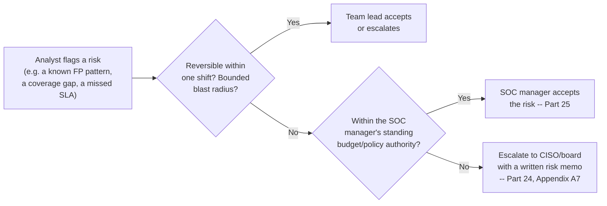
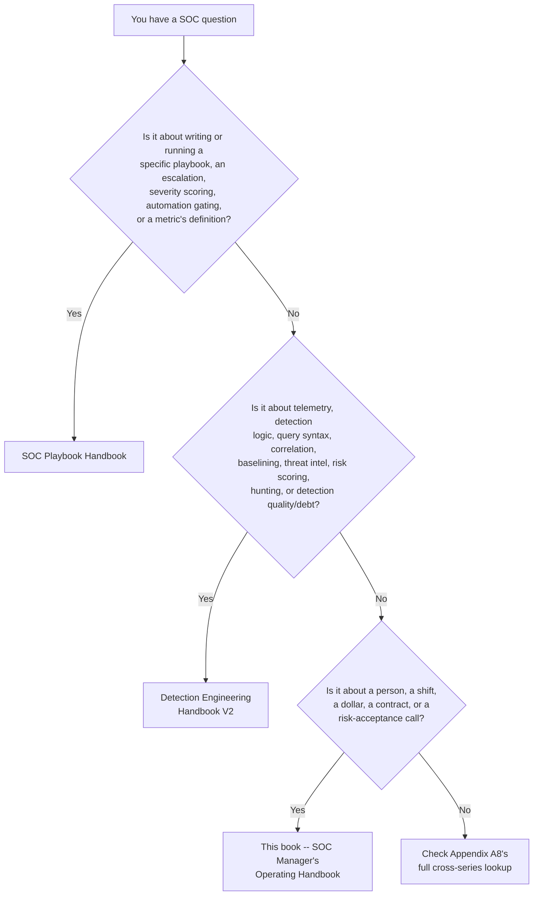

# Part 1 — SOC Manager Foundations & the Series Map

## Why this part exists

**[CONCEPT]** Ask an analyst what their job is and they describe a queue: alerts arrive, get triaged, get escalated or closed. Ask a detection engineer and they describe a pipeline: telemetry arrives, gets normalized, gets matched against logic someone tuned. Ask a SOC manager what their job is and the honest answer isn't a workflow at all — it's a short list of decisions nobody else in the building is positioned to make. How many people to hire, and onto which shift. Whether this quarter's tooling renewal gets funded or a headcount requisition does instead, when both are competing for the same line item. Where the boundary sits between "the team handles this" and "this goes to the board." What to do about the analyst whose numbers are bad — a skill gap, a training gap, or a process that set them up to fail. None of those four decisions has a query behind it. Each one has a dollar figure, a person, a shift schedule, or a signature on a risk-acceptance memo behind it instead. This book is built entirely around that list, and this part exists to state the list precisely before the other 32 parts build on it.

**[CONCEPT]** This part also carries the book's central, falsifiable claim: a SOC fails from bad staffing or bad incentives at least as often as it fails from a bad detection rule, and the manager's chair is the one seat in the building where that failure is visible before it turns into an incident-review finding. A broken rule shows up in a false-negative count. A broken staffing model or a broken incentive shows up as attrition, as a queue that never quite clears, as an escalation that got closed early to protect someone's handle-time average — and by the time any of those show up in a metric, the damage is usually a quarter old. Parts 2 through 33 exist to make that kind of failure visible earlier and cheaper to fix than it is today.

**[CONCEPT]** This part deliberately does not build a headcount model (Part 5), write the mechanics of a good escalation hand-off (SOC Playbook Handbook, Part 27 — Escalation Quality), or score a detection's coverage (Detection Engineering Handbook V2, Part 41 — Detection Coverage). Its job is narrower and comes first: name the decisions that belong to this book at all, draw the boundary against the other two volumes precisely enough that a reader never has to guess which one to open, and set the thesis everything after this part is measured against.

## 1. The job: decisions only a manager can make

**[CONCEPT]** An analyst's decisions are bounded by a ticket. A detection engineer's decisions are bounded by a rule's logic and its test results. A SOC manager's decisions are bounded by none of that — they're bounded by a budget cycle, a labor market, a board's risk appetite, and a legal or HR process that runs on its own clock. Four decision domains recur constantly enough to organize the whole book around them: staffing, budget, escalation-policy design, and risk acceptance. Each one is a decision a team lead or an individual analyst can influence but cannot finally make, because each one commits the organization to a resource or a liability the manager, not the team, is accountable for.

### 1.1 Staffing decisions

**[SENIOR MANAGER]** A staffing decision answers a question like: does a SOC running three shifts around the clock need 12 analysts or 20 to actually keep one person on every shift, every day, after accounting for the people who are on PTO, out sick, or in training this week? Part 5 owns the arithmetic behind that answer. This part's only job is to name the decision itself as one that sits with the manager: a team lead can tell you the queue was short-staffed on Tuesday night, but only the manager can decide whether that's a staffing-model problem worth a new requisition or a one-off worth absorbing. The same logic applies to shift pattern design (Part 6), hiring bar and sourcing channel (Part 7), and where the line sits between "ready for Tier 2" and "not yet" (Part 10) — all decisions a manager owns even when a team lead executes the day-to-day process behind them.

### 1.2 Budget decisions

**[SENIOR MANAGER]** A budget decision answers a question like: when the SIEM renewal and a new-hire requisition are both competing for the same $180,000 this fiscal year, which one gets funded, and what does the manager tell the CFO about the one that doesn't? Part 20 owns the budget-category structure and the cost-per-analyst framing that makes this defensible; Part 21 owns the tooling-selection process that produces the number in the first place. Neither a team lead nor a vendor's sales engineer can make this call — a team lead doesn't see the full budget, and a vendor is structurally motivated to answer "buy the tool," not "which is the better $180,000 bet this year." Only the manager holds both sides of that tradeoff at once.

### 1.3 Escalation-policy design decisions

**[SENIOR MANAGER]** This is the decision domain most likely to get confused with a neighboring book's territory, so it's worth being exact about the boundary here, in the part whose entire job is drawing it. Escalation-*policy design* is a manager's decision: how many tiers exist at all, what response-time target backs an escalation from Tier 1 to Tier 2, and whether Tier 1 is even permitted to close a given alert category without a second set of eyes. Escalation *mechanics* — what a good hand-off actually contains, written for one ticket — is not this book's job at all.

> **Cross-Book Pointer**
> This part does not explain what a good escalation hand-off looks like on a single ticket — that's a triage-level writing and communication skill, not a staffing or policy decision. See SOC Playbook Handbook, Part 27 — Escalation Quality for the mechanics; come back here (or to Part 3, Tiering Models) once you're deciding how many tiers exist and what policy backs the hand-off in the first place.

**[SENIOR MANAGER]** The distinction matters in practice, not just on paper. A manager who reads Escalation Quality (SOC Playbook Part 27) and concludes the team's escalation problem is solved has answered the wrong question — a team can write technically excellent hand-offs inside a tiering structure that adds two days of latency to every incident, or inside a policy that lets Tier 1 close account-takeover alerts unilaterally because nobody ever decided they shouldn't. Part 3 (Tiering Models) and Part 4 (Organizational Placement & Charter) pick up the policy-design side of this; the mechanics stay where SOC Playbook Handbook already owns them.

### 1.4 Risk-acceptance decisions

**[SENIOR MANAGER]** A risk-acceptance decision answers a question like: this coverage gap, this known false-positive rate, this vendor's SLA shortfall — does the manager sign off and accept it, or does it go up to the CISO or the board instead? Part 25 develops this fully as the book's central judgment-call chapter, because most risk-acceptance calls genuinely don't have a clean right answer at the time they're made. What belongs here, in the foundations chapter, is the shape of the decision: it always has an owner, that owner is never "the team" as an undifferentiated group, and the owner changes as the size and reversibility of the risk changes.

**Figure 1.1 — Risk-acceptance escalation path.** *CONCEPTUAL.* Illustrates who owns a risk-acceptance call as its scope and reversibility grow, from a bounded, shift-level call up to a board-level decision documented in a written risk memo. It is a structural decision path, not a capture of any specific organization's actual approval chain — Part 25 and Appendix A7's risk-acceptance memo template develop the real mechanics. Diagram ID `FIG-0001`.

**[SENIOR MANAGER]** The failure mode worth naming now, before Part 25 goes deep on it: a risk that never gets formally accepted by anyone still gets accepted by default, the moment nobody stops the process that's carrying it. A coverage gap a manager never signs off on is not a coverage gap the organization has decided to live with — it's a coverage gap the organization hasn't noticed yet, and "hasn't noticed yet" is not a risk posture, it's an accident waiting for a date.

The table below is a working reference, not an exhaustive one — a quick check for "whose call is this, and where in this book (or the other two) does the mechanics live."

| Decision Domain | Example Decision | This Book's Part(s) | Mechanics Owned Elsewhere |
|---|---|---|---|
| Staffing/headcount | 12 vs. 20 analysts for 24/7 coverage | Part 5 | — |
| Shift & coverage design | Fixed shifts vs. follow-the-sun | Part 6 | Hand-off mechanics: SOC Playbook Handbook, Part 27 — Escalation Quality |
| Hiring bar & sourcing | Which certifications actually predict capability | Part 7, Part 8 | — |
| Tiering & escalation policy | How many tiers, what SLA backs a hand-off | Part 3 | Hand-off writing quality: SOC Playbook Handbook, Part 27 |
| Automation platform investment | Fund a SOAR platform, and how much automation capacity to buy | Part 21 (procurement lens) | Gating-policy design itself: SOC Playbook Handbook, Part 30 — Automation and SOAR |
| Budget & tooling spend | SIEM renewal vs. new headcount | Part 20, Part 21 | Migration engineering cost: Detection Engineering Handbook V2, Part 6 — Normalisation |
| Vendor/MSSP contracting | SLA terms, right-to-audit, exit clauses | Part 22, Part 23 | — |
| Performance management | Skill gap vs. training gap vs. bad rule | Part 16 | Bad-rule diagnosis: Detection Engineering Handbook V2, Part 43 — Detection Debt |
| Risk acceptance | Sign off at manager level vs. escalate to board | Part 25 | Severity scoring itself: SOC Playbook Handbook, Part 29 — Playbook Severity Model |
| Crisis/major-incident leadership | Staffing surge, board comms, retainer activation | Part 28 | Incident-commander mechanics: SOC Playbook Handbook's Ransomware Master Playbook |

## 2. Three books, one SOC: the series map

**[CONCEPT]** The NESHBOY SOC Professional Library is three books because a SOC manager's job, a detection engineer's job, and an analyst-facing playbook's job are three different units of analysis, not three difficulty tiers of the same subject. SOC Playbook Handbook is organized around the ticket and the client-facing operational process wrapped around it. Detection Engineering Handbook V2 is organized around the telemetry and the analytic logic that turns it into a defensible alert. This book is organized around the team and the organization that runs both of those things day after day, year after year, on a real budget with real turnover. A reader who only owns one of the three volumes can do real work with it; a reader who owns all three should never have to guess which one answers a given question, and never have to read the same explanation twice with two different vocabularies.

### 2.1 The governing test

**[CONCEPT]** Every scope decision in this book is checked against one test: if a paragraph's claim is about a rule, a query, or a playbook's internal structure, it belongs in a citation, not a rewrite — cite it and move on. If the claim is about a person, a process, a contract, or a dollar, it stays here. That test is why a chapter on queue health (Part 9) can mention that a growing backlog is sometimes a detection-quality problem in disguise, cite Detection Engineering Handbook V2, Part 42 — Detection Quality for how to diagnose that technically, and then get straight back to the staffing question — without ever re-explaining what makes a detection noisy. Applying the test consistently is harder than it sounds, because staffing, QA, and performance content constantly brushes up against technical material: a QA review touches escalation quality, a performance conversation touches false-positive engineering. The rule holds anyway. It's the single most important thing a reviewer checks on every part in this book (see the review checklist in `STYLE-GUIDE.md` §11, item 10).

### 2.2 What SOC Playbook Handbook owns

**[CONCEPT]** SOC Playbook Handbook owns playbook mechanics — how a specific playbook is written and structured — and the client-facing operational chapters that wrap around a ticket's lifecycle. Concretely: escalation quality (Part 27), stakeholder communication (Part 28 — SOC-to-Stakeholder Communication), severity scoring (Part 29 — Playbook Severity Model), what to automate versus gate for human review (Part 30 — Automation and SOAR), AI-assisted operations at the point of triage (Part 31 — AI-Assisted SOC Operations), the exact definitions behind MTTA, MTTR, and false-positive rate (Part 32 — Metrics), and individual playbook-failure post-mortems (Part 35 — Playbook Failure Examples), plus a playbook-quality maturity model (Appendix 38A) and the specialty playbooks — the Ransomware Master Playbook and the Insider Threat playbooks (Category 19) chief among them. SOC Playbook Handbook also owns playbook governance and playbook testing as client-facing operational disciplines in their own right — this chapter doesn't attach part numbers to those last two here, unlike the numbered items above, because Part 1's job is the map, not the exhaustive lookup, and this book's own citation rule (`STYLE-GUIDE.md` §4) is explicit that a part number never gets cited without checking the target book's current index first. Appendix A8 carries the exhaustive, version-checked table; treat that appendix, not this paragraph, as the answer once it's been built.

### 2.3 What Detection Engineering Handbook V2 owns

**[CONCEPT]** Detection Engineering Handbook V2 owns everything with a technical, testable answer behind it: telemetry, detection rule logic, and query languages across Sigma, KQL, SPL, AQL, YARA-L, and Elastic (Parts 3 through 29); correlation engineering, baselining, threat intelligence as a scoring input, and risk-based detection (Parts 30 through 33); threat-hunting methodology (Parts 34 through 36); and detection quality, coverage, and debt as technical measures of the rule base itself (Parts 41 through 43). A manager reading this book will hit that territory constantly — Part 9's queue-health diagnosis, Part 16's performance-management judgment calls, and Part 25's risk-acceptance framework all touch it — and every one of those parts cites into Detection Engineering Handbook V2 by name and part number rather than re-deriving any of it.

### 2.4 What this book owns

**[SENIOR MANAGER]** This book owns the people and the operations of running the team that uses both of the other two — staffing and shift design (Section B), analyst development and career progression (Section C), quality, performance, and culture (Section D), vendor and budget management (Section E), governance and the executive interface (Section F), crisis leadership from the manager's chair (Section G), and maturity, benchmarking, and the road ahead (Section H). None of it has a query behind it. All of it has a headcount number, a dollar figure, a contract clause, or a person's career attached instead.

The table below expands the series map from a book-level split into a question-level lookup — the form a reader actually uses under time pressure.

| If you're asking... | Open... |
|---|---|
| "How many analysts do we actually need for 24/7 coverage?" | This book, Part 5 — Headcount & Capacity Modeling |
| "How do I write or structure a phishing playbook?" | SOC Playbook Handbook, Foundations / Playbook Library |
| "What does a good Tier 1-to-Tier 2 hand-off look like?" | SOC Playbook Handbook, Part 27 — Escalation Quality |
| "How should an alert's severity be scored?" | SOC Playbook Handbook, Part 29 — Playbook Severity Model |
| "What should be automated versus gated for human review?" | SOC Playbook Handbook, Part 30 — Automation and SOAR |
| "What does MTTR/FP rate actually mean, precisely?" | SOC Playbook Handbook, Part 32 — Metrics |
| "What does this book mean by 'handle time' or 'backlog age'?" | This book's own operational definitions — Part 5 §2 (handle time), Part 9 §1 (backlog age) |
| "This playbook broke live — why, mechanically?" | SOC Playbook Handbook, Part 35 — Playbook Failure Examples |
| "How do I write this detection logic in KQL/Sigma/SPL?" | Detection Engineering Handbook V2, Parts 24–29 |
| "Why is this rule so noisy, and how do I fix that technically?" | Detection Engineering Handbook V2, Part 38 — False Positive Engineering |
| "Do we actually have tested detection coverage for ransomware?" | Detection Engineering Handbook V2, Part 41 — Detection Coverage |
| "Is a growing queue a staffing problem or a bad-rule problem?" | Both — this book's Part 9 to diagnose the queue; Detection Engineering Handbook V2, Part 42 — Detection Quality to diagnose the rule |
| "How many analysts, organized, trained, retained, and led how?" | This book |
| "What's the budget case, and what does the vendor contract say?" | This book, Parts 20–23 |

**Figure 1.2 — "Which book do I open" decision tree.** *CONCEPTUAL.* Illustrates the routing logic behind the lookup table above, collapsed to three yes/no questions. It's a navigation aid for a reader holding all three volumes, not a claim that every real question sorts this cleanly — the "both" row in the table above is the honest exception this diagram simplifies away. Diagram ID `FIG-0002`.

> **Cross-Book Pointer**
> This chapter's series map is a working summary, not the authoritative index — part numbers in either companion volume can shift on a future revision, and this book's own citation standard treats a stale number as worse than no citation. Appendix A8 — Cross-Series Quick Reference: Where to Find It is the single, build-checked place a reader confirms a topic really is (or isn't) covered elsewhere before assuming this book missed it.

## 3. The central thesis: a SOC fails from bad staffing or bad incentives as often as from a bad rule

**[CONCEPT]** Rule failures are visible almost by design — a missed detection shows up as a false negative, gets a name, gets a post-mortem, and usually gets fixed within a review cycle or two because the failure mode is legible to anyone who can read the logic. Staffing failures and incentive failures are not legible the same way. They don't produce a false negative with a timestamp; they produce three resignations in one quarter, a QA score that's technically fine while real judgment quietly degrades, or an escalation that gets closed a little early because closing it helps someone's number. Nobody writes a post-mortem titled "our incentive structure caused this," because by the time the damage is visible, it looks like a training problem, an attrition problem, or a bad week — never the actual root cause, which was a decision made months earlier by someone in the manager's chair. The two worked examples below are composite constructions, not single traceable incidents, built to show the mechanism concretely rather than to point at any one organization.

### 3.1 The overtime spiral

**[SENIOR MANAGER]** `CASE-0001` below shows how a staffing model that looks defensible on paper — and would survive a casual budget review — creates the exact crisis it was built to prevent, the moment normal attrition happens to it.

> **Management Autopsy — "staff to headcount, not to shrinkage" (CASE-0001, COMPOSITE CASE EXAMPLE)**
>
> **The decision:** A 24/7, three-shift SOC at a mid-market financial-services company is staffed to 15 analysts — five per shift — with a flat 10% shrinkage allowance built into the budget model, covering routine PTO and sick time.
>
> **Why it seemed reasonable:** Fifteen headcount, three shifts, five each is a number a CFO can audit in one glance, and 10% shrinkage matched the prior year's actual PTO usage almost exactly. The model wasn't sloppy — it was precisely wrong about what "shrinkage" needs to include.
>
> **How it failed:** Real shrinkage — PTO, sick leave, training days, and one parental leave that started mid-year — ran closer to 32% of paid hours, not 10%, meaning "five per shift" was fiction on more weeks than not. When two senior analysts resigned in the same quarter — a 13% attrition event, unremarkable for a 15-person team over a year — there was no standing buffer to absorb it. Leadership's only lever on short notice was mandatory overtime: the remaining 13 analysts absorbed roughly 15 extra hours a week each for eight straight weeks. At a $75,000 base salary (roughly $36/hour) and a 1.5x overtime rate, that's about $54/hour worked, versus an incremental cost of roughly $7,800 a month per new hire (salary plus a 25% benefits load) — the overtime premium alone cost more over those eight weeks than opening the requisitions immediately would have, and it was paid on top of a 90-day hiring-freeze delay that made overtime the only lever available regardless of its cost. Three more analysts began actively job-hunting within the following two quarters, citing the overtime stretch by name in exit interviews.
>
> **The fix:** Model headcount against realistic shrinkage — Part 5 covers the calculation — and treat "two analysts leave without much notice" as an expected event a standing buffer absorbs, not an exception that justifies emergency overtime as the default response. A staffing model that can't survive its own team's normal attrition rate isn't a staffing model; it's a bet that nobody quits this year.

*(The dollar figures above are `CONCEPTUAL SAMPLE` illustrative arithmetic built to show the mechanism, not sourced benchmark data from a real organization's payroll.)*

### 3.2 Rewarding speed over judgment

**[SENIOR MANAGER]** `CASE-0002` (COMPOSITE CASE EXAMPLE) below shows the second, quieter version of the same thesis: a metric that is correctly defined and honestly reported can still produce a dangerous incentive the moment a manager attaches an individual reward to it without asking what behavior the reward actually produces.

**[HR/PEOPLE]** A 40-analyst SOC rolled out a team dashboard ranking analysts by average ticket-closure time, with a $2,000 quarterly spot bonus for the fastest quartile. Average closure time dropped 22% within two months — a result the manager reported upward as a clear win. A routine QA sampling pass (Part 15) found the actual driver: escalation notes had gotten thinner, and two tickets closed as "false positive, user error" were confirmed months later, during a customer's own audit, to have been real account-takeover activity. The underlying metric — handle time, this book's own operational definition (Part 5 §2), not a Playbook Handbook term — was never wrong or ambiguous. The failure was pairing an individual cash incentive to a team-level operational metric without accounting for the fact that escalating a ticket keeps the clock running against the analyst who escalates it, while closing it — even wrongly — stops the clock in their favor. The dashboard rewarded speed of closure, not quality of judgment, and analysts optimized for exactly what was measured and paid, which is what incentives reliably do.

*(The team size, bonus amount, and closure-time figures above are `CONCEPTUAL SAMPLE` illustrative numbers built to show the incentive mechanism, not sourced benchmark data from a real organization's dashboard or payroll.)*

> **People Risk Trap**
> Attaching an individual bonus to a team-level throughput metric — handle time, closure rate, tickets-per-shift — without first checking what behavior maximizes that specific number in the specific workflow it's measured against, teaches analysts to game the metric rather than do the underlying job well. The fix: model the fastest way to "win" the metric before rewarding it, not after a QA pass catches the damage. If the fastest way to win is a shortcut that degrades judgment, either redesign the incentive around a quality-adjusted measure (Part 16) or don't tie individual pay to that metric at all.

> **What Would Change My Mind**
> This part's central claim is that staffing and incentive failures cause as much real SOC damage as rule failures, just less visibly. If a rigorous, controlled comparison across multiple SOCs found that incident-causing staffing or incentive failures were consistently rare relative to detection-logic failures — not merely less discussed in post-mortems, but actually rarer in root-cause data — that would undercut this book's founding premise and argue for treating people-and-process content as a supporting chapter inside a detection-focused book rather than a full third volume in its own right.

### 3.3 A three-question check before trusting a staffing or incentive model

**[SENIOR MANAGER]** Both cases above pass a casual review and fail a specific one. Before a headcount model, a bonus structure, or a KPI dashboard goes live, three questions catch most of what a casual review misses:

1. **What does this model assume never happens?** The overtime spiral's model assumed shrinkage stayed near 10% and nobody quit mid-cycle. Name the assumption in writing, because an assumption nobody wrote down is an assumption nobody gets to challenge before it breaks.
2. **What's the fastest way to win, under this exact measurement, this week?** Not the intended way — the fastest way. If the fastest way to win a closure-time bonus is to close a real account-takeover ticket as user error, the model is already broken, whether or not anyone has done that yet.
3. **Who finds out first if the assumption in question 1 is wrong, and how long does that take?** In CASE-0001, the answer was "the shift lead approving overtime, in week one" — fast, but with no authority to fix the underlying model. In CASE-0002, the answer was "a QA sample, two months later" — slow enough that real damage had already shipped to a customer. A model whose own failure signal arrives slower than the damage it can cause is a model that needs a faster tripwire, not just a better intention.

None of this replaces the actual models in Parts 5 and 16 — it's the five-minute sanity check a manager runs before trusting either one with a real decision.

## 4. How to read this book

**[CONCEPT]** Six content tags mark every paragraph below the part-title level: `[CONCEPT]` for foundational material, `[FRONTLINE MANAGER]` for what a team lead actually does this week, `[SENIOR MANAGER]` for headcount, budget, vendor, and risk-acceptance calls, `[HR/PEOPLE]` for hiring, performance, and culture content, `[VENDOR/PROCUREMENT]` for tooling and contract content, and `[EXECUTIVE]` for the board-facing register. A shift lead skimming for what changes their Tuesday can filter to `[FRONTLINE MANAGER]`; a CISO preparing a board deck can filter to `[EXECUTIVE]` and `[SENIOR MANAGER]`. Neither has to read past their tag to get something usable, and neither is reading a different book from the other — the multi-level content model in `BOOK-INDEX.md` is what makes that possible without three separate manuscripts.

**[SENIOR MANAGER]** Eight callout boxes carry recurring content across parts, defined exactly in `STYLE-GUIDE.md` §6: Management Autopsy, Manager's Note, Operational Reality, Blind Spot, People Risk Trap, Field Test, Cross-Book Pointer, and What Would Change My Mind. This part leans on the last two — Cross-Book Pointer because a foundations-and-series-map chapter's entire job is routing the reader correctly, and What Would Change My Mind because the thesis in §3 is a claim this book is willing to be wrong about, not a slogan. Worked examples and case narratives carry a permanent evidence classification — `ANONYMIZED CASE EXAMPLE`, `COMPOSITE CASE EXAMPLE`, `OFFICIAL REFERENCE`, or `CONCEPTUAL` — stated plainly rather than left to the reader to guess, per `STYLE-GUIDE.md` §9. Both `CASE-0001` and `CASE-0002` above are composite: built from recognizable, common patterns rather than one traceable real incident, because a single identifiable version of either would be either too identifying to publish or too thin to generalize from.

> **Manager's Note**
> Read this book front to back once, then treat it as a reference you open to a specific part when a specific decision is in front of you. The series map in §2 exists so that the second and third time through, you're not re-reading Part 1 to remember which book owns what — you're checking Appendix A8 once it's built, or the table above, and getting straight to the part that actually answers your question.

## 5. Where this goes next

**[CONCEPT]** Section A (Parts 2 through 4) finishes the organizational-design foundation this part starts: the build/buy/blend decision for the SOC itself, tiering models, and the charter that states what the SOC does and does not own. Section B (Parts 5 through 9) turns the staffing decisions named in §1.1 into an actual headcount model, shift design, hiring pipeline, and queue-health diagnostic. Sections C and D (Parts 10 through 19) build the competency, career-ladder, QA, performance, burnout, and culture programs that make CASE-0002's failure mode diagnosable before a customer audit finds it instead. Section E (Parts 20 through 23) turns the budget decisions from §1.2 into a defensible business case and a governed vendor relationship. Section F (Parts 24 through 27) builds the executive interface and the risk-acceptance framework §1.4 previews. Section G (Parts 28 and 29) is the manager's-chair complement to the incident-commander mechanics SOC Playbook Handbook already owns. Section H (Parts 30 through 33) closes the book with maturity, benchmarking, AI's staffing implications, and a synthesis roadmap. Nothing past this point should need to re-explain what belongs to this book versus the other two — it should just cite correctly and move on.

## Cross-references

**[CONCEPT]** This part assumes no earlier part in this book (it is the entry point). It previews Part 3 (Tiering Models), Part 4 (Organizational Placement & Charter), Part 5 (Headcount & Capacity Modeling), Part 9 (Queue Health & Workload Management), Part 15 (Quality Assurance Programs), Part 16 (Performance Management & Coaching), Part 20 (Building & Defending the SOC Budget), Part 24 (Executive & Board Reporting), Part 25 (Risk Acceptance & Manager Decision-Making Under Uncertainty), and Part 28 (The Manager's Role in a Major Incident). It cross-references SOC Playbook Handbook, Part 27 — Escalation Quality, Part 28 — SOC-to-Stakeholder Communication, Part 29 — Playbook Severity Model, Part 30 — Automation and SOAR, Part 31 — AI-Assisted SOC Operations, Part 32 — Metrics, Part 35 — Playbook Failure Examples, and the Ransomware Master Playbook; and Detection Engineering Handbook V2, Parts 3–29, Parts 30–33, Parts 34–36, and Parts 41–43. Appendix A8 is the standing artifact all of the above resolve to as the companion volumes' own part numbering evolves.
