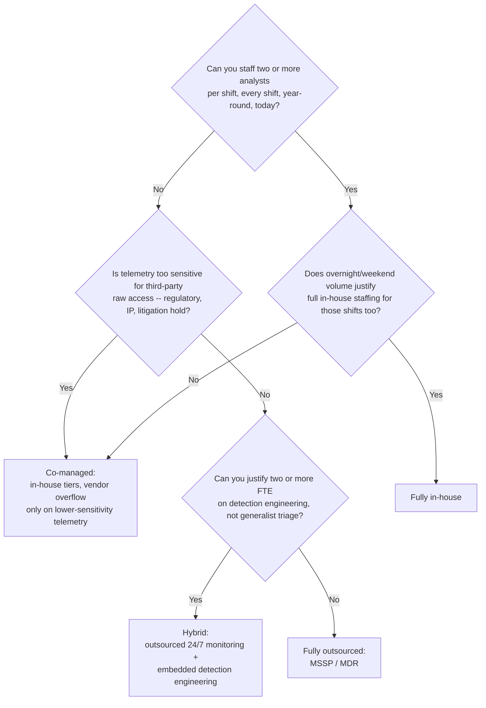

# Part 2 — SOC Operating Models: In-House, MSSP, Co-Managed, Hybrid

## Why this part exists

**[CONCEPT]** Before a manager can staff a shift roster (Part 6), build a competency matrix (Part 10), or defend a budget line (Part 20), someone has to answer a question those parts all assume is already settled: who actually does the work, and who carries the risk if it goes wrong. That's the build/buy/blend decision this part covers — fully in-house, fully outsourced to an MSSP or MDR provider, co-managed in either direction, or a hybrid model that outsources monitoring but keeps detection engineering in-house. Every other operating-model choice in this book sits downstream of this one.

This part stays on four axes: cost, control, talent retention, and the coverage-hours and telemetry-sensitivity economics that make one model cheaper or safer than another for a specific organization. It does not walk through how to write an MSSP statement of work, negotiate a service-level agreement, or build a right-to-audit clause — that's Part 22, and this part cites it rather than re-deriving it. It also does not re-teach the detection logic, playbook structure, or escalation mechanics that run inside any of these four models, because that content belongs to the other two volumes in this series regardless of who's staffing the seat that executes it. A Sigma rule written by an in-house detection engineer and the identical rule written by an MSSP analyst are the same technical artifact — Detection Engineering Handbook V2, Parts 3–29 own what makes either one correct. This part owns only the organizational question of where that seat sits, who's paid to fill it, and what that costs.

## 1. Four models, one underlying question: who does the work and who owns the risk

**[CONCEPT]** Vendors use "MSSP," "MDR," and "co-managed" inconsistently enough that the label on a contract tells you less than two direct questions do: who sees an alert first, and who can close it, tune it, or escalate it without asking permission. Answer those two questions for any given tier of work and the four models below stop being marketing categories and start being a straightforward org chart.

### 1.1 Fully in-house

**[SENIOR MANAGER]** Every analyst, engineer, and manager touching the SOC's telemetry is an employee (or a long-term contractor staffed and managed the same way), the SIEM and EDR consoles never grant a third party standing access, and the 24/7 roster is built and covered entirely from the organization's own headcount using the shift-pattern options in Part 6. This is the model regulated industries default to when a contract or examiner explicitly restricts third-party access to raw security telemetry, and it's the model a mature SOC gravitates toward once its alert volume and budget can absorb the coverage-hours cost worked through in §6 below.

### 1.2 Fully outsourced (MSSP / MDR)

**[VENDOR/PROCUREMENT]** Monitoring, triage, and — in a well-negotiated MDR contract, though not in every legacy MSSP contract — some scoped containment actions are performed entirely by a third party against telemetry the organization forwards or grants read access to. Internal headcount shrinks to a relationship owner: someone who manages the vendor, receives the escalations the vendor decides warrant one, and handles anything the contract doesn't cover. "MSSP" historically implies log monitoring and alerting with the client doing the response; "MDR" usually implies the vendor takes some response action itself. Treat that as a spectrum to confirm line by line in the statement of work, not a label to trust — Part 22 covers exactly how to pin that down contractually.

### 1.3 Co-managed — two directions

**[SENIOR MANAGER]** Co-managed splits the tiers themselves between the organization and a vendor, and it runs in either direction. The first direction — in-house tiers with vendor overflow — keeps Tier 1 and Tier 2 staffed internally during business hours and hands overnight, weekend, and surge volume to a vendor. The second — the reverse — has the vendor staff Tier 1 for high-volume initial triage against every alert, with the in-house team owning Tier 2 and Tier 3: deep investigation, incident response, and anything that needs the organization-specific context a vendor's rotating analyst pool doesn't have. Telling the two apart in a real contract is a matter of asking who sees the alert first and who can close it without escalating — the mechanics of what a good hand-off between those tiers actually looks like, once you've picked a direction, are Part 3's territory and SOC Playbook Handbook, Part 27 — Escalation Quality's, not this part's.

> **Operational Reality**
> A co-managed contract that looks clean on the org chart — vendor owns nights and weekends, in-house owns business hours — routinely breaks down on exactly the alerts that straddle the boundary: one that fires at 5:58 p.m. and is still open at the shift handoff, or a low-and-slow pattern that started on the vendor's watch and only becomes obviously malicious once an in-house analyst with environment context looks at it the next morning. Both sides can reasonably believe the other one is tracking it. Fix this with an explicit standing-alert handoff rule — who owns anything still open at the boundary, by name or by role, not "whoever notices" — rather than assuming the shift schedule alone resolves ownership.

### 1.4 Hybrid with embedded detection engineering

**[SENIOR MANAGER]** The hybrid model outsources 24/7 monitoring and triage entirely, the same as the fully outsourced model, but keeps a small in-house detection engineering function — typically two to four full-time engineers — that owns three things the vendor doesn't: the tuning direction sent back to the vendor's ruleset, custom detection content built for the organization's own high-risk applications and infrastructure, and the telemetry-sensitivity decisions about what does and doesn't get forwarded to the vendor's platform in the first place. This model exists to answer a specific complaint that shows up constantly in §3 below: a generic vendor ruleset built for 1,000 different clients has no way to know your business, and outsourcing detection authority along with monitoring means nobody with that context can act on it. The technical discipline of building and maintaining that content is Detection Engineering Handbook V2's, cover to cover; this part owns only the staffing decision to keep that specific function in-house while everything else walks out the door to a vendor.

**[SENIOR MANAGER]** The table below is a quick-reference for telling the four models apart by who staffs what, not a substitute for the fuller comparison in §7.

| Model | Tier 1 staffed by | Tier 2/3 staffed by | Detection engineering owned by | Typical trigger |
|---|---|---|---|---|
| Fully in-house | Employees | Employees | Employees | Telemetry too sensitive to export; budget and volume support full 24/7 headcount |
| Fully outsourced (MSSP/MDR) | Vendor | Vendor (escalates to a relationship owner) | Vendor | Coverage-hours economics don't support in-house staffing at all |
| Co-managed | Either (business hours) | Either (whichever direction wasn't Tier 1) | Usually whoever staffs Tier 2/3 | Full in-house coverage is close but the thinnest shifts aren't worth staffing |
| Hybrid + embedded DE | Vendor | Vendor (escalates to in-house DE/IR for context) | In-house DE team | Alert volume justifies outsourcing monitoring, but generic vendor content misses org-specific risk |

> **Cross-Book Pointer**
> This part does not cover how to structure the contract that makes any of these four models work in practice — SLA definitions, right-to-audit clauses, data-ownership and offboarding terms. See Part 22 — MSSP & Managed-Service Contract Management for the mechanics once you've picked a direction here. It also does not cover the technical detection content any of these staffing models produces or consumes; see Detection Engineering Handbook V2, Parts 3–29 for the analytics themselves and Parts 41–43 for measuring their coverage, quality, and debt regardless of who wrote them.

## 2. Cost economics: what each model actually costs

**[SENIOR MANAGER]** The honest comparison isn't "in-house is expensive, outsourcing is cheap" — it's steady-state run cost against ramp cost against the cost of a coverage gap, and the headline number on a vendor's pricing sheet is only one of those three.

### 2.1 Worked example — a 4,000-endpoint mid-market organization comparing three paths

**[SENIOR MANAGER]** The comparison below prices three of the four models — fully in-house, fully outsourced, and hybrid — for the same 4,000-endpoint organization, using the coverage-hours math developed in §6 as the basis for the in-house headcount figure rather than an arbitrary round number.

Whoever is building the build-vs-buy business case for a budget defense (Part 20 develops the full version of this) uses a comparison like this as the opening exhibit, not the closing argument — it's the number that gets the conversation started before the softer costs below get factored in.

CONCEPTUAL SAMPLE — illustrative numbers, not sourced benchmark data.

```text
Fully in-house, 24/7, two analysts per shift (see Sec. 6.1 for the FTE math):
  11 analysts x $95,000 loaded cost           =  $1,045,000
   2 team leads x $130,000                    =    $260,000
   1 SOC manager x $160,000                   =    $160,000
   Tooling (SIEM + EDR + SOAR licensing)      =    $450,000
                                         Total =  $1,915,000/year

Fully outsourced MDR, same 4,000 endpoints:
   MDR contract, $18/endpoint/month           =    $864,000
   1 relationship-owner FTE x $110,000        =    $110,000
   Retained log-forwarding/visibility tooling =    $120,000
                                         Total =  $1,094,000/year

Hybrid: outsourced monitoring + embedded detection engineering:
   Monitoring-only MDR, $15/endpoint/month    =    $720,000
   3 detection engineers x $115,000           =    $345,000
   0.4 FTE senior-manager allocation          =     $60,000
                                         Total =  $1,125,000/year
```

Co-managed lands between the hybrid and fully in-house figures above, and exactly where depends entirely on which shifts stay internal — Part 20 builds the full total-cost-of-ownership model with that variable exposed, rather than collapsing it into one more fixed number here.

The three totals above only compare payroll and licensing. They say nothing about hiring-pipeline cost, vendor onboarding friction, or the price of a coverage gap while a new model ramps up — all three show up below, and none of them are optional line items just because a spreadsheet can be built without them.

**[VENDOR/PROCUREMENT]** The $18-per-endpoint figure above is only one of several pricing structures a vendor might actually propose, and the structure matters as much as the rate. Per-endpoint pricing is predictable but penalizes an organization for adding hosts regardless of how much telemetry each one generates. Per-gigabyte-ingested pricing does the opposite — it's cheaper for a lean fleet of quiet endpoints and expensive for exactly the organizations generating the richest telemetry: cloud control-plane logs, application-layer logging, and anything approaching the ingestion volume Detection Engineering Handbook V2, Part 6 — Normalisation assumes a mature program eventually wants. Per-user pricing sits in between and mostly tracks headcount rather than risk. None of these is categorically wrong, but comparing two vendor quotes priced on different structures without normalizing them to the same projected ingestion volume produces a number that looks like an apples-to-apples comparison and isn't one — Part 21 — Tooling Procurement & Platform Strategy covers building that normalized comparison properly.

> **Operational Reality**
> An MDR quote's headline per-endpoint price doesn't include the three to six months it takes the vendor's analysts to learn which of your alerts are normal — the quarterly batch job that looks like exfiltration, the internal vulnerability scanner that looks like a brute-force source, the admin group that legitimately has 40 members. Budget that ramp as a real cost, not a rounding error: expect a materially higher false-positive burden and slower true-positive triage for the first two full billing cycles, and confirm in writing whether the vendor's onboarding fee covers building that context or whether your own staff will spend that time doing it for them anyway.

## 3. Control: what "control" actually buys, and what it doesn't

**[SENIOR MANAGER]** Control is usually argued as if it were a single dial that turns all the way up in-house and all the way down with a vendor. It's really two separate things — the authority to change a detection today, and the organizational context to know it needs changing at all — and a model can grant one without the other.

**[SENIOR MANAGER]** In-house staffing grants the authority by default: an employee can open a pull request against the detection repository this afternoon. Whether that pull request gets reviewed, tested, and shipped safely is a detection-as-code discipline question — Detection Engineering Handbook V2, Part 22 owns that mechanic — not something the org chart alone guarantees. A fully outsourced contract, by contrast, usually routes a tuning request through the vendor's own change-management queue, which can mean anywhere from same-day turnaround to a multi-day wait depending on how the contract defines it — exactly the kind of commitment Part 22 covers making explicit before signing rather than discovering during an incident.

The composite case below shows what happens when an organization gives up the context half of control, not just the authority half.

*Composite case (`CASE-0201`, COMPOSITE CASE EXAMPLE — merges patterns observed across several MSSP engagements; not one identifiable client relationship.)*

> **Management Autopsy — "outsource monitoring and detection-tuning authority together, with no retained review path"**
>
> **The decision:** A mid-market organization signs a fully outsourced MDR contract that gives the vendor sole authority over detection logic — no internal team reviews or requests changes to the ruleset, because the point of outsourcing was to remove that overhead entirely.
>
> **Why it seemed reasonable:** Fewer standing meetings, and the argument that a vendor whose whole business is detection engineering does it better than a generalist internal team could. On paper, removing an internal review step looked like it removed friction, not judgment.
>
> **How it failed:** The vendor's ruleset was built for its median client, not this one. A quarterly batch-processing job the organization ran against its data warehouse tripped a generic exfiltration rule every quarter, and because nobody internally had standing authority to suppress or fix it, the same false positive got triaged from scratch four times a year. More seriously, the organization's highest-risk asset — a custom-built claims-processing application with no equivalent at any other client — had no dedicated detection content at all 18 months into the contract, because no one on either side owned writing it: not the vendor, who had no visibility into an application unique to one client, and not the organization, who had signed away the function that would have done it.
>
> **The fix:** Keep a small internal review and request path even inside a fully outsourced contract — at minimum one person with standing authority to file a tuning request and get a committed response time on it, contractually defined per Part 22. An organization with genuinely org-specific detection needs is describing the hybrid model in §1.4 above, not a fully outsourced one with an informal exception process bolted on afterward.

> **What Would Change My Mind**
> This part treats retained tuning authority as necessary even inside a fully outsourced contract. If a vendor's standing change-request SLA reliably matched same-day in-house turnaround *and* its detection engineers demonstrably built org-specific content without a retained internal reviewer prompting them to, that would undercut the claim that authority and context need to be held by the same side — worth re-testing against a vendor that markets exactly that capability before assuming it's still true.

## 4. Telemetry sensitivity: the constraint that can override the cost argument

**[SENIOR MANAGER]** Some telemetry classes make outsourcing a real constraint, not just a preference — protected health information embedded in application logs, source code and build-pipeline telemetry for a company whose code is the product, data generated inside an active M&A staging environment, and anything already under a litigation hold. The mechanism is concrete: a vendor either needs raw log forwarding into its own platform, or standing elevated read access inside yours, and both are a wider exposure surface than the data had the moment before the contract was signed.

**[VENDOR/PROCUREMENT]** Those two delivery mechanisms carry different risk shapes, and treating them as interchangeable during procurement is a common mistake. Raw log export means a second, permanent copy of your telemetry now exists on infrastructure you don't control, subject to that vendor's own retention and breach history rather than yours — the exposure persists even if the contract ends and the data was never fully deleted. A vendor operating inside your own tenant with a scoped, revocable role avoids creating that second copy, but trades it for a standing credential inside your environment that's only as safe as that vendor's own access-management discipline; a compromised vendor analyst account is now a compromised account with a foothold in your SIEM. Neither mechanism is strictly safer in the abstract — which one a given sensitivity constraint actually rules out depends on what the constraint is protecting against, a copy leaving your control or a foothold entering it.

**[VENDOR/PROCUREMENT]** Where that constraint is real — a regulator, a customer contract, or outside counsel has said this data class doesn't leave the organization's control — fully outsourced and the vendor-front direction of co-managed are off the table regardless of what the budget can absorb. That leaves fully in-house, the in-house-tiers-with-overflow direction of co-managed (with overflow scoped only to the telemetry that isn't restricted), or hybrid with the detection-engineering team explicitly deciding, source by source, what gets forwarded to the monitoring vendor and what doesn't. None of this is a legal-mechanics question this part answers itself — Part 27 — Legal, HR & Compliance Interfaces owns the manager's procedural obligations once a restriction like this is identified; this part's job is only to name sensitivity as an operating-model input.

> **Operational Reality**
> The telemetry-sensitivity review that happens at contract signing covers exactly the log sources listed in the statement of work at that moment, and nothing added afterward gets re-reviewed automatically. Six months into a contract, someone routes a new data source — a customer-support platform with unmasked PII, say — into the same SIEM the vendor already has standing access to, because it's the path of least resistance for getting it monitored at all. Nobody re-runs the sensitivity classification, because nothing in the process prompts anyone to. Treat new-data-source onboarding as a standing trigger for a sensitivity re-check, not a one-time gate cleared once at signing.

## 5. Talent retention: the model shapes who stays, and why

**[HR/PEOPLE]** A fully in-house model gives a manager full ownership of the career ladder described in Part 13 — analyst to senior analyst to team lead or detection engineer — but that ladder is only as tall as the organization's own growth. A Tier 1 analyst at a small in-house SOC with no near-term headcount growth plateaus fast, and that plateau lands right inside the 18-to-24-month window Part 18 identifies as this industry's characteristic burnout-driven exit point — the model didn't cause that attrition pattern, but it removed one of the levers (an internal promotion path) that could have slowed it.

**[HR/PEOPLE]** A fully outsourced model moves that retention problem to the vendor's side of the relationship, which doesn't make it disappear — it makes it someone else's continuity risk that still costs the client. Vendor-side Tier 1 work is high-volume, low-context, and a well-known entry point into the field, which means the specific analyst who triaged your last three incidents may not be the one on shift for your next one. That churn is invisible on your own attrition dashboard and real anyway; ask a prospective MDR vendor directly what their own analyst tenure and account-continuity numbers look like, not just their SLA numbers.

**[HR/PEOPLE]** Co-managed and hybrid models both create a genuine retention lever the other two don't: a Tier 2/3 or detection-engineering role that's more interesting than pure Tier 1 triage, staffed internally, and reachable as a promotion rather than a lateral move to a competitor. That's a real reason some organizations choose co-managed or hybrid even when a pure cost comparison in §2 slightly favors fully outsourcing — the retention value doesn't show up on that spreadsheet, but the cost of replacing a senior analyst who left for exactly that missing growth path does, and Part 18 quantifies it. It also interacts with hiring: Part 7 covers the persistently tight mid-level analyst market this book keeps returning to, and a vendor's own Tier 1 bench is sometimes the most realistic sourcing pipeline into that mid-level role, whether or not the organization ever formally partners with that vendor as a hiring channel.

## 6. Coverage-hours economics: 24/7 is a headcount problem before it's a vendor problem

**[SENIOR MANAGER]** A continuously staffed seat needs coverage for 8,760 hours a year. A single analyst, after the shrinkage Part 5 accounts for in its own headcount model — paid time off, sick leave, training, and the ordinary administrative overhead of a job — delivers something on the order of 1,750 productive hours in that same year, not the roughly 2,080 a naive 40-hour-week calculation suggests. Divide one by the other and a single continuously staffed seat needs roughly five full-time-equivalent analysts before anyone has asked for a second person per shift for backup or quality, let alone a team lead.

### 6.1 Worked example — coverage math across models

**[SENIOR MANAGER]** A manager sizing a 24/7 desk uses this math before touching a vendor quote, because it's the number that determines whether outsourcing the thinnest shifts is a cost decision or the only realistic option at all.

CONCEPTUAL SAMPLE — illustrative numbers, not sourced benchmark data.

```text
Hours needing continuous coverage, one year:             8,760
Productive hours per analyst after shrinkage (Part 5):   ~1,750
FTE required per continuously staffed seat:               ~5.0

Standard for two analysts on shift at all times (quality/backup):
   2 seats x ~5.0 FTE                                   =  ~10 FTE base
   + 1 analyst for cross-training/surge buffer           =    11 FTE total
                                                             (matches Sec. 2.1's in-house figure)
```

The 11-analyst figure used in §2.1 isn't a round number picked for a clean total — it's this 10-FTE base plus one buffer analyst, which is the same arithmetic every fully in-house 24/7 SOC in this book's examples runs through.

The number that this math makes visible is why small organizations almost never insource the last few hours of coverage even when they can afford full in-house staffing for business hours: the marginal cost of covering a 2 a.m.-to-6 a.m. Tuesday shift is close to a full FTE-equivalent commitment for four hours a night, because nothing about that math compresses just because the shift is short. That's the arithmetic behind co-managed's overflow direction — it isn't a compromise position, it's the correct answer to a specific cost curve.

A hybrid model sidesteps this math entirely for its detection-engineering function, which is the other reason that model is cheaper on a coverage-hours basis than it looks: detection engineers work standard business hours and don't need shift coverage at all, because their output — tuned detection content, not real-time triage — doesn't have to exist at 3 a.m. to be valuable the next morning.

The composite case below shows what happens when this math gets ignored on the way out of a vendor contract rather than on the way in.

*Composite case (`CASE-0202`, COMPOSITE CASE EXAMPLE — merges patterns from more than one insourcing transition; not one identifiable organization.)*

> **Management Autopsy — "terminate the MDR contract and insource all coverage in one quarter"**
>
> **The decision:** Leadership, unhappy with a vendor's performance after a bad quarter, decides to terminate the managed-detection contract at its renewal date and hire a full 24/7 in-house team — 10 analysts plus a lead — to go live the same quarter the contract ends.
>
> **Why it seemed reasonable:** A three-year cost projection showed in-house staffing would be cheaper than the contract over that horizon, and leadership wanted full control after the vendor's performance issues rather than negotiating a fix with the same provider.
>
> **How it failed:** Hiring 10 qualified analysts inside one quarter ran straight into the tight mid-level market Part 7 describes — the org went live with six of the 10 seats filled. Six analysts can't cover the coverage-hours math above; the organization immediately reintroduced the exact overnight and weekend gaps the original contract existed to close, except now with no vendor safety net, because the contract had already lapsed on schedule regardless of hiring progress.
>
> **The fix:** Treat a full insourcing transition as itself a co-managed period, not a single cutover date. Keep the vendor on a reduced, overflow-only contract until internal headcount has held steady at the target coverage-hours number for at least one full quarter, and only let the full contract lapse once that's confirmed rather than scheduled around a renewal date chosen for budget reasons alone.

## 7. Choosing and re-choosing: a decision framework

**[SENIOR MANAGER]** The four models aren't a one-time fork in the road. Most SOCs move through more than one of them over their lifetime, usually driven by whichever constraint from §§2–6 is binding hardest right now — which is exactly what the decision path below traces.

### 7.1 The decision path

**[SENIOR MANAGER]** The path below asks the coverage-capacity question first, because it's usually the fastest constraint to hit a hard wall on, then routes through telemetry sensitivity and detection-engineering investment depending on which branch that first answer lands on.

**Figure 2.1 — Choosing (and re-choosing) a SOC operating model.** *CONCEPTUAL.* Diagram ID `FIG-0201`. Illustrates one defensible decision path through the coverage, sensitivity, and detection-engineering-investment questions developed in §§2–6 above; it is a teaching decision tree, not a validated algorithm, and §7.2's scorecard is the finer-grained tool for weighing a real decision. Notice that co-managed is reachable from two different constraints — a staffing shortfall or a telemetry-sensitivity limit — which is part of why it's the most common fallback model in practice.





**Figure 2.1 — Choosing (and re-choosing) a SOC operating model.** *CONCEPTUAL.* Static decision-tree diagram rendered from the Mermaid source directly above. It supports the model-selection guidance in this section, restated in scorecard form in §7.2 immediately below. Diagram ID `FIG-0201`.

### 7.2 The scorecard

**[SENIOR MANAGER]** Where the decision path above gives a single recommended path, the scorecard below is the tool for a manager defending that recommendation against a stakeholder who wants to see the tradeoffs made explicit rather than collapsed into one arrow. Appendix A6 develops this into a full scoring worksheet alongside Part 20's budget templates; the version here is the comparison in its simplest form.

The table below compares all four models across the dimensions this part has walked through, to support exactly that stakeholder conversation (CONCEPTUAL SAMPLE — illustrative ratings, not a scored instrument validated against real outcomes).

| Dimension | Fully in-house | Fully outsourced | Co-managed | Hybrid + embedded DE |
|---|---|---|---|---|
| Steady-state cost, mid-market scale | Highest | Lowest | Mid, depends on split | Mid-low |
| Ramp time to full operation | Slowest (hiring-bound) | Fastest (contract-bound) | Moderate | Moderate |
| Tuning-authority latency | Same-day, if detection-as-code discipline exists | Vendor change-window bound | Fast for in-house tiers, slow for vendor tiers | Same-day for custom content, vendor-bound for generic rules |
| Telemetry-sensitivity fit | Best | Weakest | Good, if overflow scope is limited correctly | Good, if forwarding decisions are deliberate |
| Retention lever for senior talent | Strong, if growth funds the ladder | Weak (vendor's problem, still your risk) | Strong for in-house tiers | Strong (detection-engineer role is the lever) |
| Coverage-hours cost efficiency | Weakest for thin shifts | Strongest | Strong (thin shifts bought, not staffed) | Strong (monitoring bought; DE doesn't need shift coverage) |

## 8. Model transitions: the MSSP-to-hybrid trajectory, and the reverse

**[SENIOR MANAGER]** A common trajectory starts with a small or newly formed security function choosing fully outsourced coverage first, simply because the coverage-hours math in §6 makes staffing a full 24/7 desk indefensible at 40 or 50 employees. As headcount, alert volume, and organization-specific risk grow, the next step is usually insourcing Tier 1 and Tier 2 for business hours while keeping the vendor for overnight and weekend overflow — arriving at co-managed not as a downgrade from full outsourcing, but as the next rung up. Adding a dedicated detection-engineering function once alert volume and organizational complexity justify it — without necessarily insourcing 24/7 monitoring at all — is the move into the hybrid model instead of, or in addition to, that co-managed step.

**[SENIOR MANAGER]** The reverse trajectory is just as real and gets treated far too often as a failure rather than a correction: a fully in-house SOC that's chronically short-staffed on its worst shifts converts overnight or weekend coverage to a vendor overflow arrangement, arriving at co-managed from the opposite direction. That move is frequently the right one precisely because the alternative — leaving the same one or two analysts covering the graveyard shift indefinitely — is the burnout-and-fatigue failure mode Part 17 covers in detail, not a superior outcome just because the org chart says "fully in-house."

**[SENIOR MANAGER]** Neither trajectory is the same question as SOC maturity. Part 30 — SOC Maturity Models scores staffing, process, training, and tooling maturity as its own lens, deliberately kept separate from the operating-model choice this part covers; a fully outsourced SOC can be operating at a mature level on Part 30's terms, and a fully in-house SOC can be immature on every one of them. Which model an organization runs is a build/buy/blend decision driven by the economics in §§2–6; how well it runs whichever model it picked is a different question entirely.

> **What Would Change My Mind**
> This part treats the outsource-first, insource-later trajectory in this section as the dominant pattern for growing security functions. If a meaningful share of mid-market organizations were found to insource fully from day one and never touch a vendor relationship at all — not because sensitivity forced it, but because the coverage-hours economics in §6 didn't apply the way this part assumes — that would be worth re-examining against real staffing histories rather than the pattern this part currently assumes holds.

---

**Cross-references:** Assumes Part 1 — SOC Manager Foundations & the Series Map for the book's overall scope boundary. Feeds forward into Part 3 — Tiering Models (the co-managed tier split), Part 5 — Headcount & Capacity Modeling (the shrinkage figure used in §6), Part 6 — Shift Pattern & Coverage Design, Part 7 — Hiring & Sourcing Analysts, Part 13 — Career Ladders & Promotion Criteria, Part 17 — Burnout, Fatigue & Wellbeing, Part 18 — Attrition & Retention, Part 20 — Building & Defending the SOC Budget, Part 21 — Tooling Procurement & Platform Strategy, Part 22 — MSSP & Managed-Service Contract Management, Part 27 — Legal, HR & Compliance Interfaces, and Part 30 — SOC Maturity Models. Cites SOC Playbook Handbook, Part 27 — Escalation Quality and points to Detection Engineering Handbook V2, Parts 3–29, Part 6 — Normalisation, and Parts 41–43 for the technical content this part deliberately doesn't re-cover.
