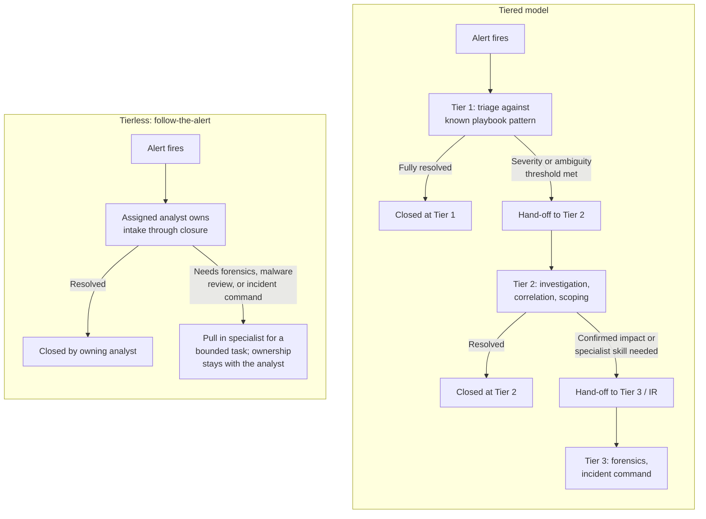

# Part 3 — Tiering Models: L1/L2/L3 and Beyond

## Why this part exists

**[CONCEPT]** Tiering is an org chart, not a technology. A SOC that labels its analysts "L1," "L2," and "L3" has made exactly one decision — who is allowed to touch which alert, and who has to hand it to someone else — and that decision has consequences for cost, speed, and retention regardless of what SIEM, EDR, or SOAR sits underneath it. This part exists because that decision is made badly more often than it's made well: copied from a job-board template, inherited from whoever built the SOC five years ago, or flattened on a whim because a vendor blog said tierless was the future. The job here is to give a manager a real basis for the decision — what each tier and specialist function should own, what actually has to be true before a ticket moves between them, when the tierless alternative is the right call instead, and a framework for telling "tiering is earning its cost" apart from "tiering is just adding a queue."

This part owns the organizational-design question: who does the work, and under what structure. It does not own what a good hand-off looks like once tiers exist — SOC Playbook Handbook, Part 27 — Escalation Quality already owns that mechanic in full, and re-deriving it here would be the exact silent-duplication failure this book's provenance notes warn against. It does not own severity scoring, which drives many hand-off triggers below — that's SOC Playbook Handbook, Part 29 — Playbook Severity Model. And it does not own what a threat hunter, detection engineer, or incident responder technically does day to day — that's Detection Engineering Handbook V2 territory, cited by part number wherever it matters, never re-explained. What this part owns is narrower and, for most SOCs, never actually written down anywhere: the shape of the org chart itself, and the reasoning that should have produced it.

This part assumes the reader has already read Part 1's framing of what decisions belong to a SOC manager, and Part 2's build/buy/blend operating-model decision — tiering is a second, largely independent axis on top of that choice, and §7 below returns to how the two interact.

## 1. What a tier is actually buying you, and what it costs

**[CONCEPT]** A tier is a filter with a price tag on both sides. The classic rationale is straightforward: cheap, less-experienced staff absorb the highest-volume, lowest-complexity work, so that expensive, experienced staff spend their time on the smaller number of things that actually need their judgment. Done well, this is a real economic win — a Tier 1 analyst earning a Tier 1 wage closes the 70–85% of alerts that turn out to be routine or false-positive, and a Tier 2 or Tier 3 analyst earning two to three times that wage never sees them (CONCEPTUAL SAMPLE — illustrative closure-rate range, not sourced benchmark data). That arithmetic is the entire case for tiering, and it's a good one when the underlying assumptions hold.

**[SENIOR MANAGER]** The assumptions stop holding the moment the hand-off itself starts costing real time. Every escalation — even a well-written one, following every mechanic SOC Playbook Part 27 recommends — requires the receiving analyst to re-read the alert, re-establish context, and re-verify at least some of what the first analyst already checked, because trusting an escalation note blind is its own failure mode. That re-establishment cost runs somewhere in the range of eight to fifteen minutes per hand-off even on a good day (CONCEPTUAL SAMPLE — illustrative range, not measured against this book's own data). Multiply that by hand-off volume and it stops being a rounding error: a SOC escalating 200 tickets a day is spending on the order of 25–50 analyst-hours a day just moving tickets between people, before anyone does a minute of actual investigation on them. Tiering is a bet that the filtering savings on the cheap side exceed that hand-off tax on the expensive side. The rest of this part is about how to tell, for a specific SOC, which way that bet actually runs.

> **Operational Reality**
> The tier chart on the wall says Tier 1 closes known-pattern alerts and escalates everything else on a clean threshold. What actually happens during a volume surge is that Tier 1 starts pushing ambiguous tickets up early to protect their own queue metrics, Tier 2 starts pushing tickets back down with "check X and re-escalate if still unclear" to protect theirs, and a ticket can cross the L1/L2 boundary two or three times before anyone actually works it. A tier boundary that isn't monitored for round-trips is a boundary that's quietly become a stalling mechanism, not a filter.

## 2. The three-tier core model and what each tier owns

**[CONCEPT]** The classic three-tier structure divides work by depth of investigation required, not by seniority for its own sake — seniority is a proxy for the skill the depth demands, not the goal itself.

### 2.1 Tier 1 — triage and known-pattern response

**[FRONTLINE MANAGER]** Tier 1 owns initial alert intake: running the matching playbook, closing what the playbook's decision logic clears as benign or fully resolvable at that level, and escalating what it doesn't. Tier 1's value is speed and volume, not depth — a well-run Tier 1 function should be closing the large majority of what it sees inside a target handle time measured in minutes, and escalating a minority that needs a different skill set or more context than the playbook anticipated. This part does not define what a good playbook or a good disposition decision looks like mechanically — that library lives entirely in SOC Playbook Handbook.

**[SENIOR MANAGER]** What matters here is staffing: Tier 1 is where a SOC absorbs entry-level and career-changer hiring (Part 7 covers sourcing those pipelines), and it's the tier most exposed to the automation shift covered in Part 32 — a growing share of what Tier 1 used to do by hand is now dispositioned by SOAR logic before a human ever sees it.

### 2.2 Tier 2 — investigation, correlation, and scoping

**[FRONTLINE MANAGER]** Tier 2 owns what Tier 1 couldn't close on its own: correlating an alert against other activity, pulling additional context (endpoint, identity, network) the initial playbook didn't call for, and scoping whether what looked like one alert is actually part of something bigger. Tier 2 is where a case, in the sense the rest of the series uses the word, actually starts to take shape — bundling related alerts, ruling competing explanations in or out, and deciding whether what's in front of them needs Tier 3 or IR involvement at all. A common ratio in a mature three-tier SOC runs somewhere around three or four Tier 1 analysts for every Tier 2 analyst (CONCEPTUAL SAMPLE — illustrative ratio, not a sourced benchmark); the right ratio for a specific SOC is a headcount-modeling question this part doesn't own — see Part 5.

### 2.3 Tier 3 — deep technical specialists and incident command

**[FRONTLINE MANAGER]** Tier 3 owns the work that needs depth Tier 2 doesn't carry day to day: forensic analysis, malware behavior review, and — when a Tier 2 scoping effort confirms real impact — standing up as incident command or feeding a dedicated IR function.

**[SENIOR MANAGER]** Tier 3 is also usually the smallest tier by headcount and the one where a SOC is most exposed to a single-point-of-failure risk if only one or two people carry that depth; Part 14's succession-planning material and Part 18's retention material both exist partly because losing a Tier 3 analyst hurts more than losing a Tier 1 analyst, disproportionate to the headcount gap between them.

### 2.4 A RACI view across tiers and specialist functions

**[SENIOR MANAGER]** The three-tier writeup above describes steady-state ownership in prose; a RACI matrix makes the same ownership auditable at a glance, and is worth building once a tier chart exists rather than trusted from memory. The table below maps common SOC workflow stages against who is Responsible, Accountable, Consulted, or Informed, across the three tiers and the specialist functions from §3.

CONCEPTUAL SAMPLE — illustrative RACI assignment for a generic three-tier SOC, not a template for any specific organization's actual authority structure.

| Workflow Stage | Tier 1 | Tier 2 | Tier 3 | Detection Engineering | Threat Hunting | IR Lead |
|---|---|---|---|---|---|---|
| Alert intake & known-pattern triage | R/A | I | — | — | — | — |
| Multi-source investigation & scoping | C | R/A | I | — | — | I |
| Escalation / severity call | R | A | C | — | — | — |
| Forensics & malware behavior review | — | C | R/A | C | — | C |
| Incident command once confirmed | I | I | C | I | I | R/A |
| Turning disposition data into a tuned or new analytic | I | C | C | R/A | C | I |
| Hypothesis-driven proactive hunting | — | I | I | C | R/A | — |

**[SENIOR MANAGER]** This view is only as good as its maintenance discipline — a RACI matrix built once at tier-design time and never revisited drifts the same way a headcount model does (Part 5's warning about a model built once at budget time applies equally here). It also has a real limit worth stating plainly: it shows steady-state ownership, not who has override authority once a major incident is declared and the org chart temporarily reshuffles around a single incident commander — that authority question belongs to Part 28's treatment of the manager's role during a live incident, not to this table.

## 3. Specialist tiers aren't "L4": threat hunting, detection engineering, and IR

### 3.1 Why "L4" is the wrong mental model

**[SENIOR MANAGER]** The most common structural mistake in tier design is treating threat hunting, detection engineering, and incident response as a fourth rung on the same ladder — "L4" — staffed by promoting the most senior Tier 3 people and leaving them sitting at the top of the same escalation chain. That's a category error. Tier 1 through Tier 3 are reactive: work arrives as an alert, and the tier structure exists to route it. Threat hunting is proactive: a hunter goes looking for activity that never generated an alert in the first place, on a hypothesis, not a queue item. Detection engineering isn't triage work at all — it's the feedback function that turns a confirmed finding, a repeated false positive, or a hunt result into a new or tuned analytic. Incident response, in most SOCs, isn't a standing tier that sits idle waiting for work; it's an on-call rotation drawn from Tier 2 and Tier 3 staff, activated only when a scoping effort actually confirms an incident.

> **Cross-Book Pointer**
> This part does not cover what a threat hunter or detection engineer actually does — that's genuinely a different book's territory. For threat hunting methodology, see Detection Engineering Handbook V2, Parts 34–36; for the detection rule logic and telemetry work a detection engineer produces, see Detection Engineering Handbook V2, Parts 3–29. This part's only job is where those functions sit relative to the tiers and how they're staffed and protected — read those parts for what the work itself looks like, then come back here for how to organize around it.

**[SENIOR MANAGER]** Once "L4" is on the org chart, it behaves like a tier whether anyone intends it to or not — unresolved Tier 3 tickets drift upward to it by the same gravity that moves tickets from Tier 1 to Tier 2, because it's the next name up the chain. The fix is structural, not a policy memo: give threat hunting and detection engineering their own backlog, entirely separate from the live-alert queue, with a named owner whose calendar time is tracked against it the same way an analyst's handle time is tracked against triage.

### 3.2 The specialist-tier trap: dumping ground vs. protected function

**[HR/PEOPLE]** A second, related mistake is using a threat-hunting or detection-engineering role as an informal reward tier — somewhere to put a burned-out senior analyst who's earned a change of pace — without building the actual skill pipeline or protecting the time the role needs to produce anything. Part 13's career-ladder material covers building a real pathway into these roles; the point here is narrower: a specialist tier with no protected calendar time isn't a specialist tier, it's a title change with the same job underneath it.

> **Blind Spot**
> Standard tiering metrics — escalation rate, hand-off time, MTTR by tier — have nothing to say about whether a specialist function is actually doing specialist work. A threat-hunting program can show a fully staffed roster and zero findings for two straight quarters because every hunter's calendar is quietly absorbed by live-incident overflow, and none of the metrics a manager is already tracking will surface that. The only way to see it is to track protected time directly — hours actually spent on hunting or engineering backlog versus hours pulled into reactive work — as its own number, not inferred from anything else.

> **Management Autopsy — "promote the two senior L3 analysts into a Tier 4 threat-hunting function" (`CASE-0301`, COMPOSITE CASE EXAMPLE)**
>
> **The decision:** A 40-analyst in-house SOC created a "Tier 4 — Threat Hunting" role, staffed by promoting its two most senior Tier 3 analysts, with no new hires and no change to the existing escalation chain.
>
> **Why it seemed reasonable:** It rewarded seniority without adding headcount cost, it gave two flight-risk analysts a title change that read as a promotion, and threat hunting had been on the roadmap for two years with no dedicated budget to fund it any other way.
>
> **How it failed:** Because Tier 4 sat at the top of the same escalation chain as Tier 3, every unresolved Tier 3 ticket eventually landed there too. Within a quarter, the two "hunters" were spending on the order of 35–40 hours a week on live-incident overflow and single-digit hours on anything that looked like a hypothesis-driven hunt (CONCEPTUAL SAMPLE — illustrative hours, not measured against this book's own data). The hunting program produced no documented findings for two consecutive quarters, and both analysts privately described the promotion as a demotion with better pay.
>
> **The fix:** Detach the function from the escalation chain entirely. Threat hunting needs its own backlog, a rule that live-incident work requires the SOC manager's explicit sign-off to interrupt it, and a tracked protected-time number reviewed monthly — not a title sitting at the top of a ladder it was never meant to be part of.

## 4. Hand-off criteria: what actually triggers a tier change

**[FRONTLINE MANAGER]** A tier structure without a written hand-off trigger is a tier structure that runs on individual judgment alone, which produces exactly the round-trip problem the Operational Reality box in §1 describes. The trigger doesn't need to be complicated, but it does need to be specific enough that two different analysts would make the same call on the same ticket. The table below is a starting set of trigger categories, not an exhaustive rulebook — the specific thresholds belong in each SOC's own playbook library.

The table below maps common escalation triggers to the tier boundary they cross and the basis a manager can audit them against.

| Trigger | From → To | Basis | Example Threshold |
|---|---|---|---|
| Severity | Tier 1 → Tier 2 | Playbook severity score | Sev ≥ 3 (SOC Playbook Handbook, Part 29 — Playbook Severity Model) |
| No playbook match | Tier 1 → Tier 2 | Triage produced no clear disposition path | Unresolved after 15 minutes against the matched playbook |
| SLA risk | Tier 1 → Tier 2 | Time in queue approaching breach | Unresolved at 50% of the SLA window |
| Confirmed impact | Tier 2 → Tier 3 / IR | Scoping confirms lateral movement, data access, or persistence | Any confirmed post-exploitation activity |
| Specialist technique needed | Tier 2 → Tier 3 | Requires forensics or malware behavior review beyond Tier 2 scope | Disk or memory forensics required |
| Recurring false positive | Tier 1 or Tier 2 → detection engineering | Same pattern repeatedly closed as benign | Five or more identical dispositions in 30 days |

> **Cross-Book Pointer**
> This table names *when* a ticket should move tiers. It says nothing about *how* to write the hand-off itself — what context has to transfer, how to phrase an escalation note so the receiving analyst doesn't have to redo the first analyst's work, or how a manager audits hand-off quality at scale. All of that is SOC Playbook Handbook, Part 27 — Escalation Quality, in full. Design your triggers here, then go there for the mechanics of executing them well.

**[FRONTLINE MANAGER]** The last row deserves its own note: a recurring false positive isn't a Tier 2 or Tier 3 problem at all, no matter how many times it gets escalated. Escalating the same noisy alert five times in a month and resolving it as benign five times is a detection-quality problem wearing a triage costume — see Detection Engineering Handbook V2, Part 38 — False Positive Engineering for the tuning fix, and Part 9 of this book for how a manager tells that pattern apart from a genuine staffing shortfall in the first place.

> **Manager's Note**
> Write hand-off triggers as a yes/no test, not a judgment call dressed up as a rule. "Escalate if the ticket seems complicated" produces a different answer from every analyst who reads it; "escalate if no playbook step matched within 15 minutes" produces the same answer from all of them, which is the entire point of writing the trigger down in the first place.

> **Field Test**
> **Setup:** A written hand-off-trigger table exists (like the one above), but has never been checked against how analysts actually use it.
> **Action:** Pull three closed Tier 1 tickets that sat right at a trigger boundary — close but not obviously over the line — and ask two different Tier 1 analysts, independently and without seeing each other's answer, whether each one should have escalated.
> **Expected result:** Both analysts should reach the same call on all three tickets. A split verdict on even one means the trigger's wording is doing less work than the table implies, and it's worth rewriting before trusting it as the basis for a staffing or automation decision.

## 5. The tierless alternative: follow-the-alert

**[CONCEPT]** The tierless model removes the structural hand-off entirely. One analyst owns an alert from intake through closure, pulling in a specialist only for a bounded task — forensics, malware reverse engineering, incident command — not because a threshold on a chart says the ticket has to move. The analyst who opened it is still the owner when it closes.

**[SENIOR MANAGER]** The case for tierless is the mirror image of the case for tiering: it eliminates the hand-off tax described in §1, and it eliminates the redundant-investigation problem where Tier 2 re-verifies work Tier 1 already did competently. It also demands far more from every analyst on the roster — there's no cheap tier to absorb volume while someone else is trained up, so the hiring bar, and the pay band that comes with it, has to be uniformly higher than a tiered SOC's Tier 1 band. That's the tradeoff in one sentence: tierless converts a latency cost into a hiring-and-compensation cost, and whether that trade is worth making depends entirely on the four variables §6 walks through.





**Figure 3.1 — Tiered escalation chain vs. tierless follow-the-alert ownership.** *CONCEPTUAL.* Illustrates the structural difference between a strict Tier 1→2→3 hand-off chain, where each threshold moves ownership to a new person, and a tierless model, where one analyst retains ownership from intake to closure and pulls in a specialist only for a bounded task. This is a process diagram of two design options, not a capture of either model running in a real SOC.

> **Management Autopsy — "flatten three tiers into one generalist pod to cut MTTR" (`CASE-0302`, COMPOSITE CASE EXAMPLE)**
>
> **The decision:** A 22-analyst SOC eliminated its Tier 1/Tier 2 distinction in one move, converting every analyst into a generalist who was expected to triage and investigate their own alerts end to end, on the strength of industry commentary that tierless SOCs report lower MTTR.
>
> **Why it seemed reasonable:** Hand-off latency had been identified, correctly, as the single largest contributor to the SOC's MTTR. Removing the hand-off looked like a direct fix, and leadership wanted a visible win without waiting for a multi-quarter hiring or training initiative.
>
> **How it failed:** Roughly two-thirds of the roster had been hired into what was, until that point, an explicitly Tier 1 role, through the help-desk-to-SOC pipeline Part 7 covers — competent at known-pattern triage, not yet trained for independent investigation. Ambiguous tickets that would previously have moved cleanly to a Tier 2 specialist instead sat unresolved, because no one held explicit authority or skill to close them alone. The SOC's three most experienced analysts began fielding a steady stream of informal "can you take a look at this" pings, recreating a tier boundary in practice with none of the tracking, staffing, or hand-off discipline the formal version had.
>
> **The fix:** Tierless only works once the average analyst's skill floor is high enough to close most tickets alone — that means raising the hiring bar and the pay band first (Part 7 for sourcing, Part 18 for what it costs to hold that bar against competitor poaching), not flattening the structure and hoping the skill gap closes itself. This SOC eventually reintroduced a lightweight two-tier model rather than reverting fully, once it became clear a straight revert would have looked like admitting the initiative failed rather than correcting course.

## 6. Decision framework: when tiering helps vs. when it only adds latency

### 6.1 The four variables that actually decide it

**[SENIOR MANAGER]** Four variables do most of the work in deciding whether tiering earns its cost for a given SOC, and none of them is "what everyone else in the industry does."

**[SENIOR MANAGER]** Alert volume and its variance matter first: tiering pays for itself when there's enough volume, and enough spread between routine and complex tickets, that a cheap first pass genuinely saves expensive time downstream. A SOC seeing 4,000 alerts a day with a long tail of one-minute closures and a short tail of genuinely hard investigations is exactly tiering's home turf. A SOC seeing 400 alerts a day where almost every one needs real context has much less to filter, and a hand-off adds cost without removing much.

**[SENIOR MANAGER]** Team size sets a hard floor: a tier needs enough people in it to cover shifts without becoming a single point of failure, and a "tier" of one or two people isn't a tier — it's a promotion ceiling and an outage risk wearing a tier's name. Below roughly ten to twelve analysts total, sustaining three separately staffed tiers across a coverage schedule usually means either chronic understaffing in one tier or idle capacity nobody can justify; Part 6's shift-coverage math is the tool for checking this precisely for a specific schedule.

**[HR/PEOPLE]** The hiring pool's skill floor matters as much as headcount: if the realistic candidate pool is mostly early-career and career-changer talent, tiering is how a SOC affordably hires and trains that pool up rather than needing every seat filled by someone already senior — see Part 7 for that pipeline in detail. If the realistic pool is mostly experienced hires at a premium pay band, tiering wastes the seniority a SOC is already paying for by making a senior hire wait behind a Tier 1 filter they don't need.

**[SENIOR MANAGER]** Detection debt and false-positive rate are the variable managers most often miss, because it looks like a technical question and gets waved off as someone else's book's territory. It isn't, for this specific purpose: a SOC with high detection debt and a noisy rule set has a lot of low-value alerts that genuinely benefit from a cheap human filter before anything expensive touches them, which argues for tiering almost regardless of the other three variables. A SOC with a well-tuned detection set and a low false-positive rate — see Detection Engineering Handbook V2, Part 43 — Detection Debt for how that's measured — has much less cheap-to-filter noise, and the case for a filtering tier weakens correspondingly.

### 6.2 The tiering fit scorecard

**[SENIOR MANAGER]** The table below turns those four variables into a quick working scorecard. Score each row honestly for your own SOC before deciding anything.

CONCEPTUAL SAMPLE — illustrative scoring thresholds for teaching purposes, not a validated instrument.

| Criterion | Favors Tiering | Favors Tierless |
|---|---|---|
| Alert volume per analyst per day | High (50+) with wide severity spread | Low (under 15), mostly already high-context |
| Team size | 12 or more analysts — enough for shift coverage per tier | Under 10 analysts total |
| Hiring-pool skill floor | Mostly early-career / help-desk pipeline | Mostly experienced or senior hires |
| Detection debt / false-positive rate | High — noisy rules need cheap filtering | Low — well-tuned detections |

**[SENIOR MANAGER]** A clean sweep in one column is a strong signal. A split result — two rows favoring tiering, two favoring tierless — usually means the honest answer isn't a forced binary pick at all; it's the hybrid model §7 covers, where only part of the workflow carries a hand-off.

### 6.3 Worked example: two SOCs, same alert volume, opposite answer

**[SENIOR MANAGER]** The scorecard's value is easiest to see when two SOCs land on opposite answers despite looking similar on the one number people default to comparing — alert volume.

CONCEPTUAL SAMPLE — illustrative comparison for teaching purposes, not a sourced benchmark.

```text
SOC A — regional retail, in-house, 30 analysts
  Alert volume:            ~3,800/day, wide severity spread
  Hiring pool:              mostly early-career, help-desk pipeline
  Detection debt:           high; several rules generate 40+ FPs/week each
  Pay bands:                Tier 1 ~$62K, Tier 2 ~$92K, Tier 3 ~$135K
  Scorecard result:         4-for-4 favors tiering
  Structure adopted:        classic three-tier

SOC B — SaaS platform security team, in-house, 9 analysts
  Alert volume:            ~450/day, mostly already high-context
  Hiring pool:              mostly senior hires, ex-Tier 2/3 from other SOCs
  Detection debt:           low; detections tuned quarterly against real disposition data
  Pay bands:                single senior band, ~$118K across the roster
  Scorecard result:         4-for-4 favors tierless
  Structure adopted:        follow-the-alert, specialists pulled in as needed
```

**[SENIOR MANAGER]** Both SOCs are staffed appropriately for their own inputs. A manager who benchmarked SOC B against SOC A's tier chart because "that's the industry-standard structure" would be importing a cost structure built for a different hiring pool and a different noise floor — the single most common reason a copied org chart underperforms the one it was copied from.

> **What Would Change My Mind**
> This framework treats alert volume, team size, hiring-pool skill floor, and detection debt as the four variables that determine tiering fit. If a SOC held three of those four firmly in tiering's favor and still got measurably better MTTR and lower attrition running tierless — not anecdotally, but across more than one comparable period — that would mean a fifth variable this framework is missing is doing real work, and the model here would need to be revised rather than defended.

## 7. Hybrid models and how tier boundaries move over time

**[SENIOR MANAGER]** Few SOCs stay purely tiered or purely tierless for long, and the honest reason is usually that the scorecard's inputs themselves change. A SOC that adopts three tiers because its hiring pool is junior-heavy and its detection debt is high will, if it invests in Part 32's automation and detection-tuning work over a couple of years, find its Tier 1 volume shrinking as SOAR logic absorbs more known-pattern dispositioning. At that point the honest options are to shrink Tier 1 headcount, or to convert the surviving Tier 1 seats into a small cross-trained pod that behaves tierlessly for what's left. Neither is a failure of the original decision — the original decision was correct for the inputs at the time, and the inputs moved.

**[SENIOR MANAGER]** A common hybrid worth naming explicitly is the pod model: several small, cross-trained groups, each anchored by one senior analyst, each running tierlessly inside itself but sitting alongside the others rather than in a strict escalation chain above or below them. This captures much of tierless's speed for routine work while still giving a newer analyst someone senior to lean on without a formal hand-off — in effect, tiering compressed from a chain into a per-pod relationship. It works best in the middle of the scorecard, where a SOC has decent headcount and a mixed-experience roster but hasn't crossed the volume or detection-debt thresholds that make a full three-tier chain worth its hand-off cost.

**[SENIOR MANAGER]** This is also where Part 2's operating-model decision reconnects with tiering directly, rather than sitting alongside it as an independent axis. A co-managed model — in-house tiers with vendor overflow, or the reverse — effectively splits a tier boundary across an organizational and a company boundary at the same time: an escalation from an outsourced Tier 1 to an in-house Tier 2 carries the ordinary hand-off tax from §1 plus a contractual layer neither purely in-house nor purely tierless designs have to account for. Part 22's contract-governance material covers structuring that boundary's SLA commitments; the tier-design point here is narrower — decide the tier structure and the operating model together, not sequentially, because a co-managed split changes where the hand-off tax in §1 actually lands.

**[SENIOR MANAGER]** Because the scorecard's four inputs move, re-score them on a fixed cadence rather than trusting the org chart to flag its own obsolescence — once a year at minimum, and after any change large enough to move a whole row (a new SOAR deployment eating Tier 1 volume, a hiring-pool shift after a competitor opens a local office and starts poaching, per Part 18). Two leading indicators are worth watching between formal re-scores: a rising round-trip rate on the boundary the Operational Reality box in §1 describes, and a Tier 1 closure rate that creeps down even though the underlying alert mix hasn't changed — both usually mean the tier boundary was drawn for a version of the SOC that no longer exists.

## Cross-references

This part assumes Part 1 — SOC Manager Foundations & the Series Map (the manager's-decisions frame) and Part 2 — SOC Operating Models (the build/buy/blend axis §7 reconnects to). It feeds forward into Part 4 — Organizational Placement & Charter, Part 5 — Headcount & Capacity Modeling, Part 6 — Shift Pattern & Coverage Design, Part 7 — Hiring & Sourcing Analysts, Part 9 — Queue Health & Workload Management, Part 10 — Competency Models & Skills Matrices, Part 13 — Career Ladders & Promotion Criteria, Part 14 — Mentorship & Knowledge Transfer, Part 18 — Attrition & Retention, Part 22 — MSSP & Managed-Service Contract Management, and Part 32 — AI, Automation, and the Future Shape of the SOC, all of which take a tier decision made here as a given input. Outside this book: SOC Playbook Handbook, Part 27 — Escalation Quality (hand-off mechanics), Part 29 — Playbook Severity Model (the severity thresholds §4's table cites), and Part 30 — Automation and SOAR (what's shrinking Tier 1's volume, previewed in §7); Detection Engineering Handbook V2, Parts 3–29 (detection engineering's technical content), Parts 34–36 (threat hunting methodology), Part 38 — False Positive Engineering, and Part 43 — Detection Debt (the noise-floor variable in §6's scorecard).
