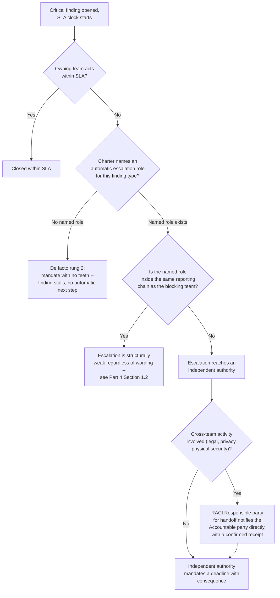

# Part 4 — Organizational Placement & Charter

## Why this part exists

**[CONCEPT]** Part 3 answered who does the work inside the SOC — tiers, hand-offs, specialist roles. This part answers a different question the org chart asks before any of that matters: who does the SOC answer to, and what has it actually been given permission to do? Those are not the same question, and conflating them is how a manager ends up running a well-tiered, well-staffed team that still can't get a critical patch applied on schedule because the team it needs to move reports to the same VP the SOC reports to, and that VP's other KPI is uptime, not remediation speed. Placement is the first constraint on everything else in this book — a headcount model, a QA program, a board narrative all assume a level of authority that placement either grants or withholds.

The charter is where that authority gets written down instead of assumed. A charter that only states what the SOC does is half a document; the more load-bearing half states what it deliberately does not do, so that the first time a patch doesn't ship, an insider-threat finding needs HR involvement, or a business unit wants the SOC to babysit a compliance checkbox it was never resourced to own, there's a written answer instead of a fight settled by whoever yells first. That standing division of labor — with IT operations, engineering, legal, privacy, and physical security — is also the seed of the full politics treatment in Part 26 — Cross-Team Politics & Stakeholder Alignment; this part builds the RACI, Part 26 covers what happens when someone ignores it.

This part does not cover the mechanics of a good hand-off between tiers once an alert is already in the queue — that boundary, and the escalation-quality mechanics for a single ticket, belong to SOC Playbook Handbook, Part 27 — Escalation Quality. It does not re-litigate the build/buy/blend decision from Part 2 — Placement questions apply whether the SOC is fully in-house, co-managed, or a hybrid with an embedded detection-engineering function, and this part assumes the operating-model decision is either made or being made in parallel, not that it's settled first. What follows is squarely about where the function sits, what its charter says, and who it has a standing agreement with before anything goes wrong.

## 1. Placement is a design decision, not an org-chart footnote

### 1.1 What placement actually changes

**[CONCEPT]** Four things move when a SOC's reporting line changes, and none of them are cosmetic. Budget authority — whose signature approves a new tool, whose budget absorbs a headcount request — sits with whoever the SOC reports through, not with the SOC manager alone, regardless of how the org chart is drawn below that line. Escalation weight — how far up the chain a SOC manager can go without asking permission first — is set by proximity to the executive layer, not by title. Independence — whether the SOC's findings about a team's negligence can survive that team's manager reading them — is compromised the moment the SOC and the team it monitors share a boss who evaluates both on the same scorecard. And tooling autonomy — whether the SOC can mandate onboarding a new log source from a system another team owns — depends on whether that other team's manager outranks, is a peer of, or reports to the same person as the SOC manager.

**[SENIOR MANAGER]** None of this shows up in a job description. A SOC manager evaluating a new role, or defending the current one, should ask exactly one diagnostic question before anything else: two years from now, if this SOC needs to force a remediation deadline against a business unit that doesn't want to comply, who actually has to say yes, and how many layers separate that person from me? If the honest answer is "the same person I already report to, and they've never had to choose between us and them," that's the placement to renegotiate before it's tested for real.

### 1.2 The independence problem

**[CONCEPT]** A SOC that reports through IT operations — a common, cost-driven choice, because IT already owns the infrastructure the SOC monitors and the ticketing system it triages into — inherits a structural conflict the org chart never states out loud: the SOC's job includes flagging IT operations' own negligence, and its reporting line runs through the person accountable for IT operations' performance.

> **Blind Spot**
> A SOC reporting through the same IT leadership chain it monitors cannot see its own filtering. Findings that would embarrass the reporting chain — a patch SLA blown for six months on a server the infrastructure director personally signed off on, a misconfigured firewall rule the network team's own lead wrote — don't get suppressed through any dramatic act of censorship; they get "deprioritized," "queued behind a change freeze," or quietly reclassified to a lower severity in a conversation the SOC manager has no standing to refuse, because the person asking is the SOC manager's own boss. No QA program or metrics dashboard catches this, because the finding was real and got logged — it just never escalated past the one person with both the authority and the motive to sit on it.

## 2. The four common reporting lines

### 2.1 CISO-direct

**[SENIOR MANAGER]** The SOC reports to a dedicated CISO (or equivalent VP/Head of Security) who reports to the CIO, COO, or CEO, with no IT-operations or engineering layer in between. This is the placement with the fewest structural conflicts, because the CISO's own performance is measured on security outcomes, not on the uptime or delivery-velocity metrics the SOC's findings sometimes threaten. It's also the most expensive and politically demanding to establish — it requires an organization willing to fund a security leadership seat as a peer to IT and engineering leadership, not a subordinate of either, and a CISO willing to spend political capital defending the SOC's escalation path the first several times it's tested.

### 2.2 Under the CIO or VP of IT Infrastructure

**[SENIOR MANAGER]** The SOC sits inside the IT organization, typically several layers below the CIO, often sharing a ticketing queue and change-management calendar with the infrastructure team it audits. This is the cheapest placement to stand up — no new executive seat, no new budget line separate from IT's — and the most common in organizations that grew a SOC function out of an existing IT security team rather than building one from scratch. It's also where the independence problem in §1.2 shows up most reliably, because the same director who owns the SOC's budget also owns the uptime SLA the SOC's own recommendations most often threaten.

### 2.3 Embedded in engineering

**[SENIOR MANAGER]** Less common outside product-led or platform companies, this placement puts the SOC (or a detection-engineering-heavy hybrid of the kind Part 2 covers) inside the engineering organization, reporting through a VP of Engineering or a Head of Platform. It buys fast access to telemetry, code ownership, and deploy pipelines — useful when the SOC's primary detection surface is the company's own product rather than corporate IT — at the cost of the same conflict as §2.2 in a different shape: the SOC's findings about engineering's own code or infrastructure choices are being escalated through engineering's own chain of command.

### 2.4 Shared security services across business units

**[SENIOR MANAGER]** In holding companies, conglomerates, and organizations with multiple semi-autonomous business units, a central SOC serves several BUs that each have their own local IT or security lead, with the SOC reporting to a group-level CISO or security function that has no direct authority over any single BU's operations. This placement solves the independence problem structurally — the central SOC doesn't report through any BU it monitors — but introduces a different cost: local BU leaders who never agreed to the central SOC's authority in the first place, and can simply decline to act on a finding with the (accurate) observation that the SOC manager isn't in their reporting chain at all. §3 covers the matrixed variant built to soften exactly this friction.

### 2.5 Comparing the four placements

**[SENIOR MANAGER]** The table below is a decision aid, not a ranking — the right placement depends on what an organization is actually optimizing for, and every option below has been the correct choice somewhere.

| Placement | Independence from teams it monitors | Typical enforcement authority | Cost to establish | Most common failure mode |
|---|---|---|---|---|
| CISO-direct | High — CISO's own scorecard is security outcomes | Can mandate deadlines with executive-level escalation | High — new executive seat, dedicated budget | CISO becomes a bottleneck if every escalation routes through one person |
| Under CIO/IT Infrastructure | Low — shares a boss with the team it audits | Recommend-only in practice, absent an explicit override clause | Low — no new leadership seat needed | Findings against IT's own priorities get deprioritized, not rejected |
| Embedded in engineering | Low — same conflict as IT placement, different chain | Strong for product/platform findings, weak for corporate IT | Medium — needs engineering buy-in to host a non-shipping function | Corporate-IT and vendor-risk findings get under-resourced relative to product findings |
| Shared security services (multi-BU) | High — sits outside any single BU's chain | Formally strong, practically dependent on group-level backing | High — needs a group-level charter every BU has actually signed | Local BU leaders treat findings as advisory since the SOC isn't in their chain |

**[SENIOR MANAGER]** The pattern worth naming explicitly: the two cheapest placements to stand up (§2.2 and, in a different shape, §2.3) are the two most likely to produce a SOC that can detect and document a problem it cannot actually force anyone to fix. That tradeoff is sometimes the right one for a smaller organization that genuinely cannot fund a dedicated security leadership seat — but it should be a chosen tradeoff, defended with eyes open, not an accident of how the SOC happened to get built.

*Composite case (`CASE-0401`, COMPOSITE CASE EXAMPLE — patterns merged from several mid-market placements of this kind; not a single traceable organization; cost figures below are illustrative, not audited financials.)*

> **Management Autopsy — "fold the SOC into IT Infrastructure to save a reporting layer"**
>
> **The decision:** A 340-person healthcare-adjacent company with a nine-person SOC decided against creating a standalone CISO seat and instead placed the SOC under the Director of IT Infrastructure, the same director who owned the change-management calendar and the 99.9% uptime SLA for the company's core application servers.
>
> **Why it seemed reasonable:** One fewer executive seat to fund, one shared ticketing queue instead of two, and faster routing for the large share of SOC findings that are genuinely IT-operations issues (unpatched software, misconfigured services) rather than security-specific ones.
>
> **How it failed:** The SOC flagged a critical, actively-exploited-in-the-wild CVE on an internet-facing Exchange server, opened against a 5-day internal SLA for critical findings. The infrastructure director, accountable for the uptime SLA on that same server and mid-way through an unrelated ERP migration, deprioritized the patch three separate times over six weeks, citing change-freeze windows he controlled. The SOC manager had no escalation path that didn't run through the same director — he was, structurally, both the person blocking the fix and the person the SOC manager would have had to ask permission to escalate past. The server was compromised on day 47 of the 5-day SLA; the resulting incident response, forensics, and expedited outside-counsel work cost roughly $180,000, on top of the ERP migration's own schedule slipping regardless.
>
> **The fix:** The charter was rewritten to add a named override clause: any finding that breaches its own SLA gets an automatic escalation to the CISO-equivalent role (created as part of the same fix) or, in that role's absence, directly to the COO, with no discretion left to the manager whose own priorities the finding might conflict with. Placement didn't change immediately — budget for a standalone security leadership seat took another two budget cycles to secure — but the escalation path stopped depending on the goodwill of the person being escalated against.

## 3. Matrixed and dotted-line placements

### 3.1 The dual-boss problem

**[SENIOR MANAGER]** A common compromise, especially in the multi-business-unit placement from §2.4, gives a local SOC lead a dotted-line relationship to the business unit they serve and a solid-line relationship to a central security function. The intent is to get the best of both: local context and buy-in, plus central independence and consistent standards. The failure mode is equally predictable — a dotted-line and a solid-line manager who disagree about priority during a live incident leave the local lead genuinely unsure whose direction controls, and that ambiguity is worst exactly when speed matters most.

> **Operational Reality**
> A matrixed reporting chart on paper shows two lines converging cleanly on one analyst. In practice, during an actual incident, one of those two managers is available and engaged and the other isn't — and the charter almost never specifies which line wins by default when only one manager is reachable. The honest fix isn't better org-chart drawing; it's a written default rule ("central security direction controls during an active incident; local BU direction controls for day-to-day prioritization") that the local lead has actually seen before the day they need it, not one they're improvising during a page from two directions at once.

### 3.2 When matrixing is worth the ambiguity

**[SENIOR MANAGER]** Matrixed placement is worth the dual-boss cost specifically when the alternative — a fully centralized SOC with no local presence — would mean the SOC has zero context on a business unit's specific risk tolerance, regulatory environment, or legacy systems, and a fully decentralized SOC per business unit would mean duplicating detection engineering, tooling, and on-call coverage three, four, or more times over. It is not worth the cost as a permanent default for a single-business-unit company that adopted it only because a reorganization briefly created two plausible reporting parents and nobody picked one — that's not a matrix, it's an unresolved decision wearing a matrix's name.

## 4. From placement to authority: enforce vs. recommend

### 4.1 The enforcement ladder

**[SENIOR MANAGER]** Authority isn't binary. A useful way to state what a charter actually grants is a four-rung ladder, and most real charters land on different rungs for different finding types rather than one rung for everything.

| Rung | What it means in practice | What a charter needs to state to grant it |
|---|---|---|
| Mandate with a named escalation path | The SOC sets a deadline; if it's missed, a specific named role (not "management") is automatically notified, with no discretion to skip the notification | The SLA, who gets escalated to, and that the escalation is automatic, not requested case-by-case |
| Mandate with no teeth | The SOC sets a deadline; missing it has no defined consequence or automatic next step | Common default when a charter states an SLA but no escalation clause — looks like authority, behaves like a recommendation |
| Strong recommendation | The SOC states a required action and a risk rationale but explicitly defers the final call to the owning team | Named risk-acceptance process (Part 25 covers the manager's side of this decision) so "recommended" doesn't quietly become "ignored with no record" |
| Informational (FYI) | The SOC shares a finding for awareness with no expectation of action | Explicit statement that this category exists, so a team doesn't mistake a courtesy notice for a request |

**[SENIOR MANAGER]** Most SOCs discover they're operating on the second rung — mandate with no teeth — only when a deadline is missed for the first time and nothing happens. That discovery is exactly what §2's Management Autopsy shows: the charter said "critical findings must be remediated within five days," which reads like rung one, but named no escalation role, which meant it was actually rung two the entire time.

### 4.2 Where authority actually comes from

**[SENIOR MANAGER]** A charter's authority language only works if it's backed by placement, not instead of it. A CISO-direct SOC (§2.1) can write a real rung-one clause because the CISO has the standing to enforce it against a peer director. A SOC under IT infrastructure (§2.2) can write the identical clause, and it will function as rung two, because the escalation path the clause names loops back to the same person the finding is against. Writing stronger charter language cannot substitute for weaker placement — it can only make the gap between the two visible, which is itself useful: a charter that says "mandate" next to a reporting line that can't back it up is a documented risk-acceptance decision waiting to be noticed by whoever inherits the SOC manager's job next.

## 5. Writing the charter

### 5.1 What a charter must state

**[SENIOR MANAGER]** A charter that survives being read by a skeptical peer during a dispute states, at minimum: the SOC's mission in one sentence that names what it protects, not just that it "protects the organization"; the environments and asset classes actually in scope (production, corporate IT, OT/ICS if applicable, cloud accounts, third-party-managed systems); the enforcement rung (§4.1) for each major finding category, not one blanket authority level; the named escalation roles for missed SLAs, stated as roles, not people, so the clause survives a departure; a review cadence and the role accountable for keeping it current; and the sign-off chain — who actually approved this document, dated, so "the charter says" has a named authority behind it rather than functioning as an unsigned aspiration.

### 5.2 What the SOC is deliberately not responsible for

**[SENIOR MANAGER]** The scope-boundary section is the part of the charter most often left out, and the part most responsible for cross-team friction when it's missing — not because teams disagree about who should own something, but because nobody wrote down the answer before the disagreement happened live, during an incident, in front of an executive. The table below is a starting scope-boundary list, not an exhaustive one; every organization's version needs entries specific to its own structure.

| Activity | Commonly assumed to be SOC's job | Who actually owns it | The SOC's actual role |
|---|---|---|---|
| Applying a patch | Yes | IT operations / infrastructure | Flags the finding, tracks the SLA, escalates per §4.1 — does not touch the system |
| Writing a firewall or access-control rule change | Sometimes | Network/platform engineering | Recommends the change and validates it after deployment — does not author or push it |
| Deciding whether a breach requires regulatory notification | Often assumed | Legal and privacy | Provides the technical timeline and scope of exposure — does not make the notification call (see Part 27 — Legal, HR & Compliance Interfaces) |
| Physical facility response to a badge or camera alert | Sometimes | Physical security | Correlates physical and digital signals when both exist — does not dispatch guards or manage the facility incident |
| HR disciplinary action following an insider-threat finding | Often assumed | HR, with legal | Documents and hands off the technical finding — does not decide or execute discipline (Part 27) |
| Data-classification policy authorship | Sometimes | Data governance / privacy | Enforces classification tags it's given at detection time — does not write the classification scheme |
| Architecture or design decisions that eliminate a finding's root cause | Sometimes | Engineering | Documents the recurring exposure and its cost — does not own the redesign |
| Business continuity / disaster recovery ownership | Rarely, but happens | BCP/DR function | Provides incident timeline and impact data as an input — does not own the continuity plan |

> **Operational Reality**
> A scope-boundary list only works if the teams named as owners have actually agreed to it — a charter that unilaterally declares "physical security owns badge-alert response" without physical security's sign-off isn't a boundary, it's a wish. The charter drafting process itself needs the RACI conversation in §6 to happen before this table is finalized, not after, or the "who actually owns it" column is the SOC manager's guess rather than a standing agreement.

### 5.3 A charter skeleton

**[SENIOR MANAGER]** The template below is a starting skeleton for a SOC manager drafting or revising a charter from scratch — use it as a structure to fill in with an organization's real names, SLAs, and sign-off chain, not as language to adopt verbatim. Its main limitation: it cannot resolve the placement question from §1–§3 for you, and a charter drafted against the wrong placement will read well and still fail the first time it's tested, exactly as in the §2 Management Autopsy.

TEMPLATE — SOC charter skeleton, permanent ID `TMPL-0004`

```markdown
# [Organization] Security Operations Center — Charter

## Mission
<one sentence: what this SOC protects, for whom, and the outcome it exists to produce>

## Scope
In-scope environments: <production / corporate IT / cloud / OT-ICS / third-party-managed>
Out-of-scope environments: <explicitly named, not left to be inferred>

## Authority by finding category
<table: finding category | enforcement rung (see this book's Part 4 §4.1) | named escalation role>

## What this SOC is not responsible for
<the scope-boundary table from §5.2, filled in with real named owners who have signed off>

## Standing RACI
<reference to the RACI matrix in §6 of this part, or attach it directly>

## Review cadence
This charter is reviewed <quarterly/annually> by <named role>, and immediately upon
<reorg, M&A, new CISO/reporting-line change, or a missed SLA that reveals a gap>.

## Sign-off
<name, title, date — for every party named as an owner in the scope-boundary and RACI sections,
not only the SOC manager>
```

The most common way this skeleton fails in practice is a sign-off section signed only by the SOC manager and their own boss — a scope-boundary claim about IT operations, legal, or physical security carries no real weight until someone from those teams has actually signed the same document.

## 6. The standing RACI: IT operations, engineering, legal, privacy, and physical security

### 6.1 Why the RACI is a companion document, not a memory

**[SENIOR MANAGER]** The charter states the SOC's own scope; the RACI states who is Responsible, Accountable, Consulted, and Informed across the handful of activities where the SOC's work and another team's work meet — and it needs to exist as a document both sides have seen, not as an understanding one manager carries in their head. An unwritten RACI works exactly until the person who understood it changes teams, retires, or is simply unavailable during the one incident where it actually mattered.

### 6.2 Building the matrix

**[SENIOR MANAGER]** The matrix below is a starting structure across the five standing relationships this part is scoped to cover — a real organization's version will have more rows, and every cell needs an actual conversation with the named team before it's treated as settled.

| Activity | SOC | IT operations | Engineering | Legal | Privacy | Physical security |
|---|---|---|---|---|---|---|
| Detect and validate a compromise | R/A | I | I | I | I | I |
| Contain at network or endpoint level | R | C | I | I | I | — |
| Patch or remediate root cause | C | R/A | R/A | — | — | — |
| Preserve evidence / apply legal hold | C | C | C | R/A | C | C |
| Decide external breach notification | C | I | I | R/A | R/A | — |
| Revoke physical access (badge, facility) | C | I | — | I | — | R/A |
| Insider-threat finding hand-off to HR | R | I | I | C | C | — |
| Chair the post-incident organizational review | C | C | C | C | C | C |

**[SENIOR MANAGER]** Two patterns in that matrix are worth naming directly. First, the SOC is Responsible or Accountable for detection and containment and almost nothing past that point — it hands off root-cause remediation, legal decisions, and physical response to the teams that actually own the systems, statutes, or facilities involved, which is the RACI's version of the same boundary the §5.2 scope table draws in prose. Second, no single row has the SOC as the sole Accountable party for anything except detection itself — every other activity's Accountable party sits outside the SOC, which is precisely why the charter's escalation clauses in §4 matter: the SOC can be Responsible for surfacing a problem while having zero authority over whether it gets fixed on time.

### 6.3 Where RACIs actually break: a worked example

**[SENIOR MANAGER]** *COMPOSITE CASE EXAMPLE `CASE-0402` — patterns merged from several regulated-industry incidents; not a single traceable organization; cost figures below are illustrative, not audited financials.* A mid-size financial-services firm's SOC confirmed unauthorized access to a database containing regulated customer data, starting a contractual 72-hour notification clock the moment exposure was confirmed. The RACI on paper named Legal as Accountable for the notification decision and the SOC as Consulted, which looked complete. What the RACI didn't specify was who was Responsible for actually looping Legal in — the SOC assumed its standard incident-declaration email, sent to a distribution list that included a legal-team member who happened to be on leave, satisfied that step. Legal's on-call attorney wasn't formally engaged until 61 hours into the 72-hour clock, leaving 11 hours to complete work that normally takes days: confirming scope, drafting notifications, and briefing outside counsel. The rushed engagement of expedited outside counsel and forensics support added roughly $40,000 in costs directly attributable to the compressed timeline, separate from the underlying incident-response cost.

> **Blind Spot**
> A RACI that names who's Accountable for a decision but not who's Responsible for the specific act of notifying that person has a gap that looks filled on paper and is empty in practice. "Legal is Consulted" describes a relationship, not a trigger — it doesn't say who picks up the phone, by when, through which channel, with a receipt confirming it landed. The fix isn't a longer RACI; it's naming, for every Accountable-Consulted pair that has a clock running against it, the specific Responsible party and channel for the handoff itself, not just the eventual decision.

### 6.4 The escalation-authority path, end to end

**[SENIOR MANAGER]** The decision tree below shows how the placement decision (§1–§3), the charter's enforcement rung (§4), and the RACI (§6.2) combine into one path a SOC manager actually walks when a critical finding's SLA is at risk of breach. It is a structural model of the decision, not a capture of any single organization's actual workflow tool.





**Figure 4.1 — The escalation-authority path, end to end.** *CONCEPTUAL.* Shows the escalation path a critical finding follows once its SLA is at risk, tracing how placement (§1–§3), charter enforcement rung (§4), and RACI handoff (§6.2–§6.3) combine into a single walkable decision. It supports the claim, made across §4 and §6, that authority is a function of placement and named handoffs together, not of charter wording alone. Diagram ID `FIG-0401`.

> **Cross-Book Pointer**
> This part stops at the charter-level question of who has standing authority over a finding category and who must be notified when a handoff is required — it does not cover how to write a good escalation for one specific ticket once that path is already in motion. See SOC Playbook Handbook, Part 27 — Escalation Quality for the ticket-level mechanics (what a hand-off should contain, how severity is communicated) that operate inside whichever authority path this part's charter and RACI establish.

## 7. Reviewing and defending the charter over time

### 7.1 Trigger events for revision

**[SENIOR MANAGER]** A charter written once and never revisited degrades the same way any other unmaintained control does. Five events should trigger an out-of-cycle charter review regardless of where the organization sits in its normal annual cadence: a reorganization that changes the SOC's reporting line or the reporting line of a team named in the RACI; a merger or acquisition that adds environments, business units, or entire IT organizations the charter never accounted for; a change of CISO, CIO, or other executive the escalation clauses name by role; any missed SLA that reveals an escalation clause didn't function as written (the §2 Management Autopsy is exactly this trigger, after the fact); and a new regulatory obligation that changes a notification timeline the RACI's Legal/Privacy rows assume.

### 7.2 Who audits the charter itself

**[EXECUTIVE]** The charter's own credibility depends on someone other than the SOC manager periodically checking whether it still matches reality — internal audit, the CISO if the SOC doesn't report there directly, or a peer SOC manager at review time are all reasonable owners of that check, but "the SOC manager reviews their own charter" produces the same blind spot as §1.2 in miniature: the person most invested in the charter looking sufficient is the person checking whether it is. A charter review that only asks "does this document still describe what we do" misses the actual failure mode; the review that matters asks "the last time an SLA was missed or a cross-team handoff failed, did this document's escalation and RACI clauses actually produce the outcome they promise, or did the real outcome depend on who happened to be reachable that day." The second question is the one worth answering, in writing, at every review — and it's the same question the board-reporting narrative in Part 24 — Executive & Board Reporting eventually needs an honest answer to, since "we have a charter" and "our charter works under pressure" are different claims a skeptical board member is entitled to tell apart.

## Cross-references

This part assumes the operating-model groundwork from Part 2 — SOC Operating Models: In-House, MSSP, Co-Managed, Hybrid and the series-scope framing from Part 1 — SOC Manager Foundations & the Series Map. It hands its charter and RACI forward to Part 26 — Cross-Team Politics & Stakeholder Alignment (full politics treatment) and Part 27 — Legal, HR & Compliance Interfaces (procedural mechanics once a legal- or HR-triggering finding is confirmed), and its enforcement-rung language forward to Part 25 — Risk Acceptance & Manager Decision-Making Under Uncertainty and Part 24 — Executive & Board Reporting. Outside this book, it points to SOC Playbook Handbook, Part 27 — Escalation Quality for ticket-level hand-off mechanics that operate inside whatever authority path this part establishes.
