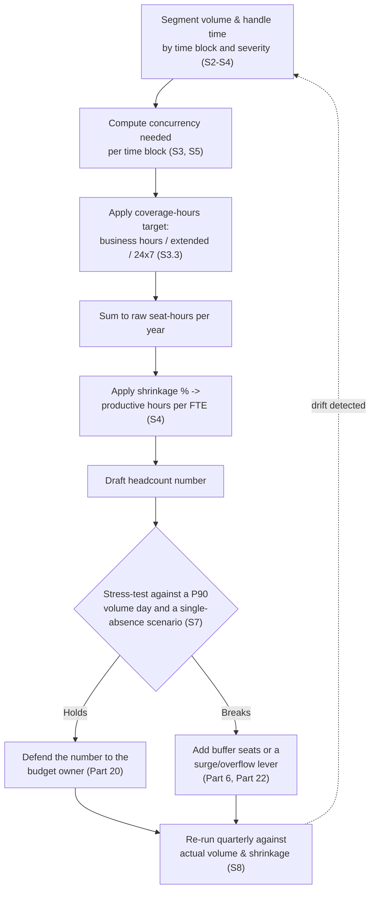

# Part 5 — Headcount & Capacity Modeling

## Why this part exists

**[CONCEPT]** Every SOC manager eventually has to answer one question in a specific, defensible number: how many analysts does this team need. Not "more than we have," not "roughly a dozen," but a number with a formula behind it that survives a CFO asking where it came from and survives a bad Tuesday six months later. This part builds that number from four inputs — alert volume, handle time, shrinkage, and target coverage hours — and walks through the arithmetic, the deductions naive models skip, and the ways even a careful model still lies to you on the day it matters most.

This part does not define what "handle time," "MTTR," or "alert volume" mean, and it does not tell you how to instrument your ticketing system to produce them reliably. That is SOC Playbook Handbook, Part 32 — Metrics, and this part treats those definitions as a fixed input rather than re-deriving them — §2 says exactly what shape that input needs to arrive in. It also does not design the actual shift pattern a headcount number gets scheduled into (fixed, rotating, follow-the-sun — that's Part 6), does not build the CFO-facing budget narrative around the resulting dollar figure (Part 20), and does not tell you how to sanity-check your ratio against a published industry survey (Part 31, which is mostly a warning about doing that carelessly). What's left, and what this part actually owns, is the specific manager's job of turning four numbers into a headcount, and being honest about the three ways that headcount can still be wrong on the day it's tested.

## 1. What a headcount number has to survive

**[CONCEPT]** A headcount model has exactly one real test: does the team it describes still function on a day that isn't average. A model that produces a defensible-looking number for a typical Tuesday and collapses the first time volume spikes or two people call in sick on the same shift hasn't modeled capacity — it has modeled a best case and labeled it a plan. Everything in this part is built around treating that test as the actual bar, not the budget-approval meeting as the actual bar.

**[SENIOR MANAGER]** The number also has three separate audiences who will each stress it differently. The budget owner wants to know the number is the smallest defensible number, not a padded one — every unfilled seat above the real requirement is a line item someone eventually questions. The analysts living inside the number want to know it isn't quietly assuming they'll absorb the gap between the model and reality through unpaid overtime — Part 17 covers what happens when they do that for eighteen months straight. And the manager's own future self, six months into the fiscal year when a new detection doubles the volume on one alert type, wants a model built with enough structure to be re-run quickly rather than reconstructed from scratch under deadline pressure. A number that satisfies only the first audience is a number built to get approved, not a number built to work.

## 2. Inputs this part takes as already defined

**[CONCEPT]** Two of this part's four inputs — alert volume and handle time — come from the organization's instrumentation, and this part's job starts only once those numbers exist in a usable shape. A third input, target coverage hours, is also taken as a given here, but from a different source: a business or risk-tolerance decision about how much of the day the SOC commits to covering (§3.3 works through what that decision costs), not a number any metrics instrumentation produces. The fourth, shrinkage, is this part's own to build, and §4 covers it in full.

> **Cross-Book Pointer**
> This part does not define MTTR, handle time, or alert volume, and it does not cover the instrumentation needed to produce them consistently across queues — that's SOC Playbook Handbook, Part 32 — Metrics. Read that part first if your organization doesn't already have a shared, audited definition of "handle time" that every queue reports the same way; every formula in this part silently assumes you do, and a headcount model built on two different definitions of handle time from two different tools will produce a number that's wrong in a way no amount of careful arithmetic here can fix.

**[SENIOR MANAGER]** What this part needs from those definitions is a specific shape, not just a number. A single annual average handle time and a single annual average alert volume are close to useless for the model built in §3 through §6 — the whole argument of §7 is that the average is exactly what hides the failure. What the model actually needs is volume and handle time broken out by time block (business hours vs. overnight, weekday vs. weekend) and, ideally, by severity or queue, plus the distribution of daily volume across a full year, not just its mean. If your metrics program can produce a mean but not a distribution, that's worth flagging back to whoever owns SOC Playbook Part 32's implementation — a headcount model is one of the clearest business cases for why a distribution matters more than an average.

**[CONCEPT]** One more input decision happens upstream of this part entirely: how much of the raw alert volume a human analyst ever sees in the first place. Auto-closing, auto-enrichment, and SOAR-driven auto-remediation can filter a large share of raw volume before it ever reaches a queue an analyst works — that filtering ratio is a direct multiplier on every calculation in §3, and it's a decision this book doesn't own. SOC Playbook Handbook, Part 30 — Automation and SOAR covers what should and shouldn't be automated versus gated for human review; this part assumes that decision has already been made and takes whatever volume survives it as the "volume" input to the model below.

## 3. From volume and handle time to raw analyst-hours

**[CONCEPT]** This section turns two of §2's inputs — volume and handle time — into a raw analyst-hours requirement, before shrinkage (§4) or coverage-hours reconciliation (§5) touch the number.

### 3.1 The core formula

**[SENIOR MANAGER]** The starting arithmetic is not complicated, which is exactly why it's easy to get wrong by skipping the steps around it rather than the multiplication itself:

```text
CONCEPTUAL SAMPLE — illustrative formula and figures, not sourced benchmark data.

Raw analyst-hours needed (per time block)
    = Alert volume (per time block) × Average handle time (per time block)

Concurrent analysts needed (per time block)
    = Raw analyst-hours needed (per time block) ÷ Length of the time block

Total seat-hours needed (per year)
    = Sum, across every time block in a year, of
      (Concurrent analysts needed, rounded up) × (Length of the time block)
```

The rounding-up step is not cosmetic — a computed concurrency of 8.75 analysts is a real requirement for nine actual people; the fractional analyst doesn't exist, and rounding down to save one headcount is where an otherwise sound model quietly turns into an understaffed one.

### 3.2 What counts as "volume" for this calculation

**[CONCEPT]** The volume this formula wants is post-automation, post-deduplication ticket volume that actually lands on a human analyst's queue — not raw log events, not raw SIEM alerts before correlation, and not a count that includes tickets a SOAR playbook closed without human involvement. Confusing "alerts generated" with "alerts a person had to work" is one of the most common ways a headcount model comes out wrong in either direction: too high if it counts volume the automation already absorbed, too low if the automation layer is newer or less reliable than the model assumes and a chunk of "auto-closed" volume is quietly coming back to the queue as re-opened tickets.

### 3.3 Coverage hours: what continuous coverage costs before anyone touches a ticket

**[SENIOR MANAGER]** Target coverage hours set the denominator in the concurrency calculation, independent of volume. A SOC covering business hours only (roughly 50 hours a week) needs coverage across a much smaller window than one covering 24/7/365 (168 hours a week, 8,760 hours a year). The table below gives the coverage-hours floor for common coverage targets — the minimum number of concurrent seats required purely to keep the target window covered, before any volume-driven adjustment from §3.1 is added on top. This is a floor, not a headcount: it tells you the minimum shape of the schedule, and §5–§6 layer volume back on top of it to get the real requirement.

The table below supports the staffing-model decision in §5 and §6 — use it to see the coverage-hours floor before adding volume-driven concurrency on top.

| Coverage Target | Weekly Hours Covered | Coverage-Floor Seats (before volume) | Typical Driver |
|---|---|---|---|
| Business hours only (5×10) | 50 | 1 | Low after-hours risk tolerance; early-stage or very small SOC |
| Extended hours (16 hours × 5 days) | 80 | 1 per shift, 2 shifts | Two-shift model, no true overnight coverage |
| 24/7, single-seat minimum | 168 | 1 per shift, 3 shifts | Baseline always-on coverage, no redundancy built in |
| 24/7, two-person overnight minimum | 168 | 2 overnight, more during the day | Escalation or safety redundancy requirement — see §7.1 |
| Follow-the-sun (regional handoff) | 168 | Varies by region | No shift anywhere runs the true low-staffing overnight window; model and tradeoffs owned by Part 2 and Part 6 |

**[SENIOR MANAGER]** Notice that the coverage floor and the volume-driven requirement are two separate numbers, and the larger of the two is what actually has to be staffed. A SOC with a strict 24/7 mandate but very low overnight volume is bound by the coverage floor overnight (someone has to be there even if nothing happens) and by volume-driven concurrency during the day (§3.1's math takes over once volume, not the clock, is the binding constraint). §6 works a full example where the two constraints bind at different times of day, which is exactly why a single flat number for "how many people do we need" is the wrong shape of question.

## 4. Shrinkage: turning nominal hours into real ones

**[HR/PEOPLE]** This section builds the fourth input named in this part's opening paragraph — the one this part owns outright rather than importing from SOC Playbook Handbook, Part 32 — Metrics — and it's the deduction a naive headcount model skips most often.

### 4.1 Building a shrinkage stack

**[HR/PEOPLE]** A full-time analyst nominally works 2,080 hours a year (40 hours × 52 weeks). Almost none of those hours are actually available for ticket work, and the gap between the nominal number and the real one is shrinkage — every hour an analyst is paid for but isn't sitting in the queue: PTO, sick leave, company holidays, training, coaching and 1:1 time, QA calibration sessions, team meetings and general admin overhead, paid breaks, and a fleet-wide deduction for the fact that a new hire isn't producing at full rate for their first several months. A model that skips this deduction and staffs against the full 2,080 hours is staffing against a number no real analyst ever delivers.

The table below is a worked shrinkage stack (CONCEPTUAL SAMPLE) showing how a roughly 32% shrinkage figure gets built from named categories rather than asserted as a round number — use it as a starting structure for your own team's actual categories and hours, not as a universal constant.

| Category | Hours/Year (typical) | % of 2,080 Nominal Hours |
|---|---|---|
| PTO & vacation | 120 | 5.8% |
| Sick leave | 40 | 1.9% |
| Company holidays | 64 | 3.1% |
| Training & certification | 80 | 3.8% |
| Coaching, 1:1s, QA calibration | 60 | 2.9% |
| Team meetings & admin overhead | 70 | 3.4% |
| Paid breaks & shift-change overlap | 100 | 4.8% |
| Fleet-wide new-hire ramp deduction | 130 | 6.3% |
| **Total shrinkage** | **664** | **~32%** |

**[HR/PEOPLE]** Two of these categories are easy to underweight. Fleet-wide ramp deduction is not a per-new-hire number you apply only when someone starts — it's an average drag across the whole team's tenure mix, because at any given moment some fraction of the roster is still climbing the onboarding curve Part 11 lays out, and a team with above-average attrition carries a permanently higher version of this line than a stable one. Paid breaks and shift-change overlap also get skipped in models built by someone who's never actually run a 24/7 shift schedule — a clean handoff between shifts costs real overlapping minutes, and pretending shift boundaries are instantaneous understates the hours the schedule actually consumes.

> **Operational Reality**
> The shrinkage line a headcount model treats as fixed is usually the first thing a team lead quietly cuts when the queue is running hot. Training blocks get cancelled, 1:1s get pushed to "if there's time," and QA calibration gets skipped for a month, all in the name of getting through today's volume. The model still assumes the analyst has roughly 1,414 productive hours this year (2,080 at a 32% shrinkage deduction); in practice, a team that's quietly cutting its shrinkage line this way commonly ends up with something closer to an estimated 1,600 hours of actual output, absorbed as unpaid overtime and skipped development time nobody tracks anywhere. A headcount number built on a shrinkage assumption nobody is actually protecting isn't a real number — it's a debt the team is paying down invisibly, and Part 17 covers what that debt costs once it compounds.

### 4.2 A reasonable shrinkage range, and why it's a starting point, not a target

**[SENIOR MANAGER]** A shrinkage figure in the high-20s to mid-30s percent range is a reasonable starting assumption for a mature SOC with a normal PTO policy, a real training budget, and moderate attrition — this is a heuristic drawn from the pattern above, not a sourced industry benchmark, and it should be validated against your own team's actual time-tracking data within the first two quarters of using it. A team with unusually generous PTO, a heavier training mandate (certification-heavy roles, a new platform migration), or above-average attrition will run higher than that; a very stable, low-turnover team with minimal formal training investment can run somewhat lower. Applying an unexamined 32% to every team in every organization is the same error as applying an unexamined blended handle time across every severity — a convenient single number standing in for something that actually varies by team.

## 5. Coverage models and the concurrency they actually require

**[SENIOR MANAGER]** §3.3's coverage-hours floor and §3.1's volume-driven concurrency have to be reconciled hour by hour, or at minimum time-block by time block, not averaged into one daily figure — averaging across time blocks is exactly the error §7.3 names as the tyranny of the average, just introduced one section early here because it's where it first becomes visible in the math. A SOC that receives most of its volume during business hours and comparatively little overnight needs more concurrent seats during the day than the clock alone would suggest, and fewer overnight than a flat 24-hour average would suggest — and a model that doesn't split the day into blocks before dividing will consistently get both numbers wrong in the same calculation.

**[CONCEPT]** This is deliberately not the same question as which shift pattern delivers that concurrency — fixed 8-hour shifts, 12-hour shifts with overlap, or a follow-the-sun handoff across time zones are all different ways of staffing the same concurrency requirement, and Part 6 owns choosing among them. What this section and §6 own is getting the concurrency requirement itself right before anyone starts drawing a shift calendar around it.

## 6. Worked example: the flat model versus the segmented model

**[SENIOR MANAGER]** `CASE-0501` below is a composite, illustrative regional-bank SOC — no real organization's actual figures — built to show a specific, common failure: a manager who computes headcount from a single daily average gets a number that is simultaneously more expensive and worse-distributed than one built from the same underlying data split into time blocks.

COMPOSITE CASE EXAMPLE (`CASE-0501`) — illustrative organization and figures, constructed to demonstrate the flat-vs.-segmented modeling error; not drawn from a single traceable real SOC.

**The environment:** A 24/7 SOC with a mandatory always-on coverage requirement, average alert volume of 600 tickets per day reaching human analysts (post-automation, per §3.2), and a blended average handle time of 15 minutes across all severities.

**The flat model.** A manager takes the daily average at face value: 600 tickets × 15 minutes = 9,000 minutes, or 150 hours of analyst-hours needed per day. Spread evenly across 24 hours, that's 150 ÷ 24 = 6.25 concurrent analysts, rounded up to 7 to be safe. Staffing 7 concurrent seats around the clock costs 7 × 8,760 = 61,320 seat-hours a year. At 1,414 productive hours per FTE after a 32% shrinkage deduction, that's 61,320 ÷ 1,414 ≈ 43.4, rounded up to 44 FTE. The flat model's answer: 44 analysts, staffed evenly around the clock.

**The segmented model.** The same organization's actual ticket data shows volume isn't flat — roughly 70% of the day's 600 tickets arrive during a 12-hour business-hours window, and the remaining 30% arrive during the 12-hour overnight window. Business hours: 420 tickets × 15 minutes = 6,300 minutes (105 hours) across 12 hours, or 105 ÷ 12 ≈ 8.75 concurrent analysts, rounded up to 9. Overnight: 180 tickets × 15 minutes = 2,700 minutes (45 hours) across 12 hours, or 45 ÷ 12 = 3.75 concurrent analysts, rounded up to 4. Seat-hours per day: (9 × 12) + (4 × 12) = 156, or 56,940 a year. Headcount: 56,940 ÷ 1,414 ≈ 40.3, rounded up to 41 FTE. The segmented model's answer: 41 analysts, staffed 9-deep during the day and 4-deep overnight.

**[SENIOR MANAGER]** The segmented model needs 3 fewer total FTE than the flat model (41 vs. 44) while simultaneously fixing a coverage problem the flat model created: the flat model's 7 concurrent seats overstaff the overnight window (7 scheduled against a real need of 4, three idle seats every night) and understaff the business-hours window at the exact moment 70% of the day's volume and the highest-severity escalations are actually arriving (7 scheduled against a real need of 9, two seats short during the hours that matter most). A model that only looks right in its daily-average total can be wrong in both directions at once, on the same day, and still balance on paper. The math behind both versions of this case is the same math built into the headcount calculator worksheet (`TMPL-0001`) in Appendix A1 — run your own volume and handle-time data through that worksheet rather than rebuilding these formulas from scratch each budget cycle.

## 7. The honest failure modes: queue-of-one, burst traffic, and the terrible day the average hides

**[CONCEPT]** §6's segmented model is a real improvement over a flat average, and it is still not the whole picture. Three specific failure modes survive even a carefully segmented, shrinkage-adjusted model, and a manager who doesn't name them explicitly will discover them the hard way, on a day the model didn't plan for.

### 7.1 Queue-of-one variance

**[FRONTLINE MANAGER]** A shift staffed by exactly one analyst has, structurally, zero reserve capacity — not "low" reserve capacity, zero. Every other failure mode in this section is a matter of degree; this one is binary. If that analyst is out sick, the shift is uncovered unless a named backup path exists and is actually reachable, not just written down. If volume on that shift runs even modestly above normal, there is no second person on the same shift to absorb the difference — the choice narrows to working faster (which has a real ceiling, per §7.2), letting the queue age past target response time, or both.

> **Blind Spot**
> A queue-of-one shift design looks fully staffed on the schedule right up until the day it isn't. The gap is invisible in every normal-volume week, because a single analyst comfortably covers a single analyst's worth of expected volume, and there's no dashboard metric that shows "this shift has zero elasticity" — the metric that would show it, capacity held in reserve, is exactly zero, and zero doesn't trigger an alert on its own. The first time anyone sees the gap is the day it's tested: an unplanned absence, or a volume spike, with no second person on that shift to absorb either one.

**[FRONTLINE MANAGER]** The fix is not automatically "always staff at least two people per shift" — that's a real cost increase, and a small SOC covering low-volume off-hours may not be able to justify a second full seat overnight. The fix is knowing, explicitly and before the fact, whether a given shift's design has this property, and deciding on purpose whether the organization accepts that risk or funds a named backup path (an on-call bridge to a second analyst, an MSSP overflow arrangement per this book's own Part 22 — MSSP & Managed-Service Contract Management, or a shift-lead who can step in). Accepting the risk silently, by never asking the question, is the actual failure — not the risk itself.

### 7.2 Burst traffic

**[SENIOR MANAGER]** `CASE-0502` (COMPOSITE CASE EXAMPLE) illustrates the second failure mode: a small SOC with a queue-of-one day shift and a normal average volume that is already running close to its ceiling before any burst hits at all.

**The setup:** A small SOC covers three shifts with one analyst on each, for a baseline of three concurrent seats. Average volume is 80 tickets a day across all three shifts, or roughly 27 tickets per shift on average, at a 15-minute average handle time. An 8-hour shift has 480 available minutes; at 15 minutes a ticket with zero breaks or admin time, the theoretical ceiling is 480 ÷ 15 = 32 tickets. A more realistic sustainable pace — leaving room for the shrinkage categories in §4.1 that still apply inside a single shift — puts working capacity closer to 24 tickets. The "normal" day, at 27 tickets against a realistic 24-ticket sustainable pace, is already running hot before anything unusual happens.

**The burst:** A mass phishing campaign hits during the day shift, pushing that shift's volume to four times normal: 108 tickets in the same 8-hour window. At best-case 15 minutes a ticket with zero slack, that shift needs 108 × 15 = 1,620 minutes of work — more than three full shifts' worth — compressed into 480 available minutes. The single analyst on that shift can process at most 32 tickets in the window even working flat out with no breaks; the other 76 tickets, roughly 70% of the day's volume, do not get touched by end of shift regardless of individual skill or effort. That backlog ages past whatever response-time target the organization has committed to, and it does so structurally — no amount of coaching or urgency changes the arithmetic of one person and 480 minutes.

**[SENIOR MANAGER]** A mean-based headcount model, even a well-segmented one, sizes concurrency against a typical day and has nothing to say about this day. The practical fix is sizing standing concurrency against a high-percentile day — something like the 90th percentile of the actual daily volume distribution, not the mean — and keeping a surge lever for the tail beyond even that: a documented MSSP overflow arrangement (this book's own Part 22, or the general co-managed model from Part 2), pre-approved mandatory overtime, or a cross-trained pool from an adjacent team that can flex in on short notice. None of those levers work if they're invented during the incident; they have to exist, tested, before the burst day arrives.

### 7.3 The tyranny of the average, generalized

**[CONCEPT]** §6 and §7.2 are both instances of the same underlying problem: an average is a single number standing in for a distribution, and a distribution has a shape the average doesn't preserve. A headcount model built entirely on averages — average daily volume, average handle time, average shrinkage — will look correct on the specific day that happens to sit at the average, and wrong on every day that doesn't, which by definition is most days in any distribution with real variance. The practical discipline is cheap relative to the risk it removes: pull the actual daily (or even hourly) volume distribution before finalizing a model, not just its mean, and check where the model's assumptions sit relative to the 90th or 95th percentile day, not just the 50th.

The table below (CONCEPTUAL SAMPLE) summarizes the failure modes this section and §6 have covered, plus two related ones this part's math doesn't automatically catch, as a working checklist for reviewing any headcount model before it ships.

| Failure Mode | What It Looks Like | Why a Mean-Based Model Misses It | The Practical Fix |
|---|---|---|---|
| Queue-of-one variance | 1 analyst per shift; any absence or spike means zero slack | Averages assume a pool with reserve capacity; a single-analyst pool has none | Named backup path or a 2nd seat on any shift that can't tolerate a bad day |
| Burst traffic (day-level) | A single day or week runs at 3 to 4 times normal volume | Annual or monthly averages smear the spike across the quiet days around it | Size concurrency to a high-percentile day (e.g., P90), plus a tested surge/overflow lever |
| Diurnal/intraday variance | Volume concentrated in business hours; flat 24/7 staffing over- and understaffs at once | A single daily figure hides which hours actually carry the volume | Segment concurrency by time block, not just by day (§5–§6) |
| Severity-mix drift | Blended handle time creeps as the ratio of quick vs. complex tickets shifts | A single blended number assumes a mix that may not hold quarter to quarter | Track handle time by severity band; re-run the model when the mix shifts materially |
| Shrinkage assumption gone stale | Real productive hours run below the modeled figure | Shrinkage is a snapshot, not a standing guarantee (§4.2) | Audit actual shrinkage against the model's assumption at least twice a year |
| Attrition/backfill lag | Approved headcount doesn't match heads actually on the floor | The model treats headcount as a step function; hiring and ramp aren't instantaneous | Model backfill lag explicitly (Part 18), not as a rounding error |

> **What Would Change My Mind**
> This part recommends sizing concurrency against a high-percentile volume day, not the mean, because the gap between the 50th and 90th percentile day is usually wide enough to matter operationally. If a queue's day-to-day volume were stable enough that its P50 and P90 sat within a few percent of each other consistently across a full year — a genuinely low-variance queue, not a lucky quiet quarter — the case for a percentile buffer would mostly disappear, and a flat mean-based model would be defensible for that specific queue without the correction this section argues for.

## 8. Keeping the model alive after budget season

**[SENIOR MANAGER]** A headcount model that gets built once, during annual budget planning, and never touched again is a snapshot pretending to be a policy. Alert volume shifts every time a new detection ships or an acquisition adds a new log source; handle time shifts as tooling changes or the severity mix drifts; shrinkage shifts with attrition and PTO-policy changes; and the coverage-hours requirement itself can shift if the business takes on a new regulatory or contractual obligation for faster response. Treat the model built in §3 through §6 as a living worksheet, reviewed on a fixed cadence — quarterly is a reasonable default — against actual volume, actual handle time, and actual shrinkage, not a number defended once at budget time and then defended again from memory a year later.





**Figure 5.1 — Building and re-running a headcount model as a standing loop.** *CONCEPTUAL.* Shows the headcount model as a closed loop from segmented inputs through a stress test to a quarterly re-run rather than a single output. Supports this section's claim that a headcount model is a maintained artifact, not a once-a-year deliverable, and the stress-test branch supports the failure modes named in §7. Diagram ID `FIG-0501`.

> **Operational Reality**
> An approved headcount of 41 analysts — this part's own §6 worked example (`CASE-0501`) — is a target, not a headcount you actually have on the floor every day. Real time-to-fill for a mid-level SOC analyst role commonly runs 60 to 90 days once a requisition is approved, and that's before a new hire is anywhere near full productivity — Part 11 covers the ramp curve that follows. After one resignation, the team operates at 40 during the search, then at an effective 39 or 40 for another two to three months while the replacement ramps. It only returns to a true 41 if nobody else leaves in the meantime. The model's buffer exists on a spreadsheet; the queue experiences the gap in real time, which is exactly the case Part 18 and Part 25 pick up when headcount is fixed and the queue keeps growing anyway.

**[EXECUTIVE]** When the model changes materially between review cycles — a 10% swing in required headcount either direction — that change belongs in the next board or CISO reporting cycle, not held until the next annual budget conversation. Part 24 owns how to frame that change as a risk narrative rather than a raw number; this part's only job is making sure the underlying number is worth reporting in the first place.

## 9. Where this goes next

**[CONCEPT]** The headcount number built here is an input, not a finished product. Part 6 takes it and builds the actual shift calendar — fixed, rotating, or follow-the-sun — that delivers the concurrency this part computed. Part 9 uses the resulting queue as an ongoing health signal and teaches how to tell a genuine staffing shortfall from a detection-quality problem wearing a staffing shortfall's clothing. Part 20 turns the number into dollars a CFO will engage with, and Part 25 covers the judgment call this part can't automate: what a manager actually does when the number the model says is required and the number the budget actually approves don't match.

---

**Cross-references.** This book: Part 2 (operating models — which portion of the SOC this headcount number is even counting), Part 6 (shift pattern and coverage design, consuming this part's concurrency requirement), Part 9 (queue health as an ongoing signal distinct from this part's point-in-time model), Part 11 (onboarding ramp curve behind the shrinkage stack in §4), Part 17 (what absorbing a broken shrinkage assumption costs over time), Part 18 (attrition and backfill lag), Part 20 (budget defense), Part 22 (MSSP overflow as a burst-traffic lever), Part 24 (reporting a material model change), Part 25 (fixed headcount vs. a growing queue), Part 31 (benchmarking caution), and Appendix A1's headcount calculator worksheet (`TMPL-0001`). Other volumes: SOC Playbook Handbook, Part 30 — Automation and SOAR (what volume ever reaches a human) and Part 32 — Metrics (the definitions this entire part treats as a fixed input); Detection Engineering Handbook V2's detection-quality material, reached through this book's own Part 9 rather than cited directly here.
