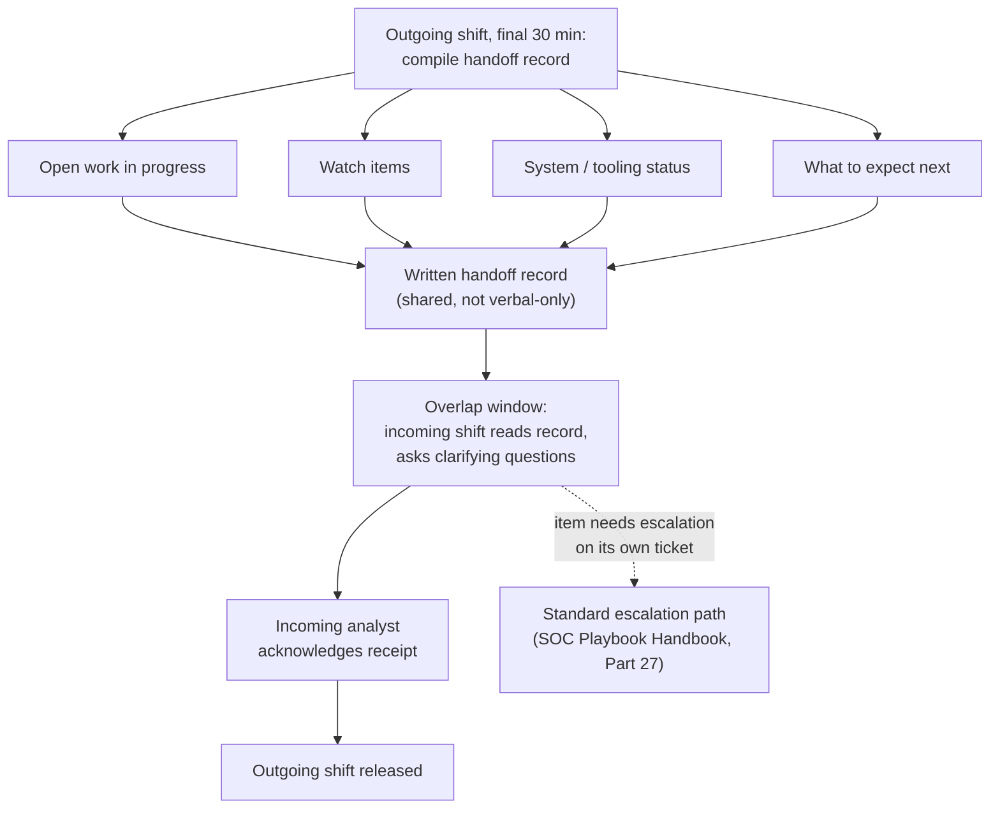
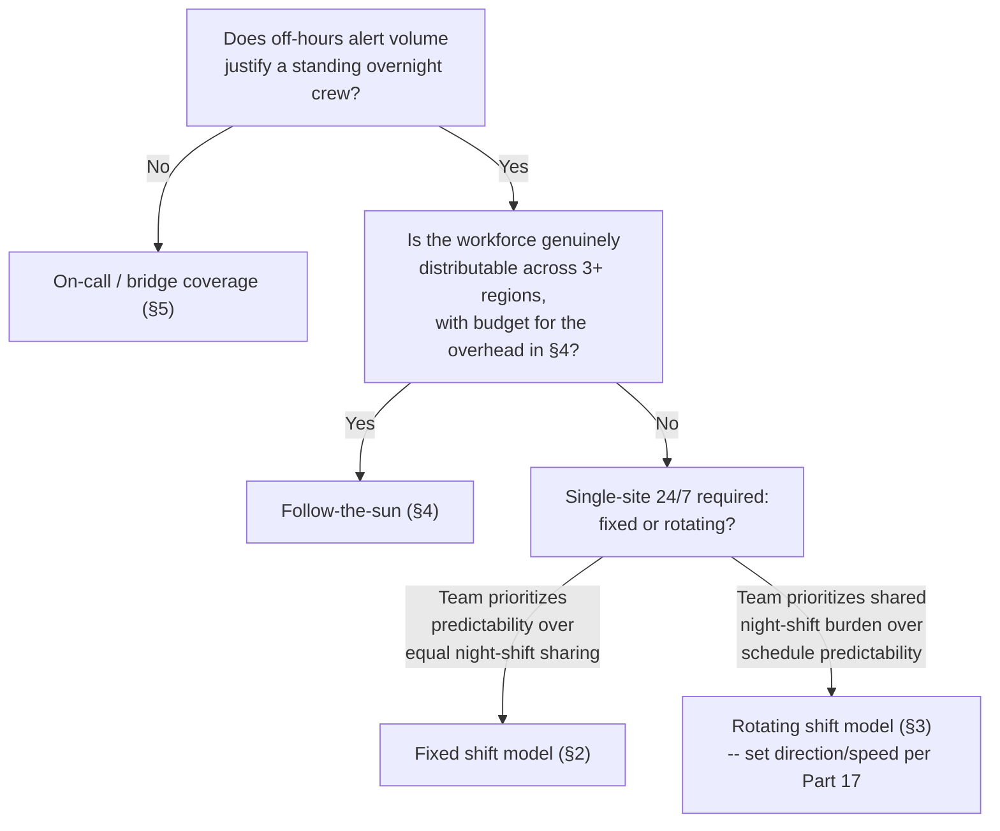

# Part 6 — Shift Pattern & Coverage Design

## Why this part exists

**[CONCEPT]** Part 5 gives a SOC manager a number — say, 14 analysts, after shrinkage — but a headcount number is not a schedule. Fourteen people don't cover a queue by themselves; they cover it only once someone decides how those fourteen bodies are arranged across 8,760 hours a year, who works nights, how many people are awake at 3 a.m. on a Sunday, and what happens in the ninety seconds between the analyst who worked the last eight hours and the one who's about to work the next eight. That arrangement — the shift pattern — is a distinct decision from the headcount math in Part 5, and it has its own failure modes that a correct headcount number does nothing to prevent. A SOC can be fully staffed on paper and still run an unsafe 3 a.m. shift, because the schedule that got built from the right headcount number was still a bad schedule.

This part covers the four coverage models a SOC manager actually chooses between — fixed shifts, rotating shifts, follow-the-sun, and on-call/bridge coverage — plus the two staffing problems every model eventually has to solve: holidays and weekends. It also owns shift-handoff mechanics: what information has to move from the outgoing analyst to the incoming one for the queue to survive the transition without a gap. That is deliberately not the same question as what makes one escalation from Tier 1 to Tier 2 good — SOC Playbook Handbook, Part 27 — Escalation Quality owns the mechanics of a single hand-off between tiers on one ticket. This part owns the mechanics of an entire shift's worth of state moving between two people at a fixed clock boundary, whether or not any single ticket ever gets escalated. A team can run flawless escalations all day and still lose a watch item at 6 a.m. because nobody wrote it down before going home.

This part also previews, but does not develop, the fatigue and circadian research behind why some rotation directions and shift lengths cost more in error rate than others — that's Part 17's job, and this part cites the conclusion where a scheduling decision depends on it rather than re-deriving the physiology here.

## 1. From headcount to a calendar: what coverage design actually decides

**[CONCEPT]** A year has 8,760 hours. A SOC that commits to 24/7 coverage has committed to having at least one analyst awake and watching the queue for all 8,760 of them, every year, including the ones nobody wants — December 25 at 3 a.m., the Sunday of a holiday weekend, the night before a product launch. Coverage design is the set of decisions that turns that raw hour count into a real, staffable calendar: how long is a shift, how many shifts cover a day, how do people rotate (if at all) between day and night, and what happens at the boundary where two shifts meet.

**[SENIOR MANAGER]** Four coverage models cover almost every real SOC schedule in production. The table below compares them on the dimensions that actually drive a manager's choice — coverage gaps, cost, and the fatigue risk this part previews and Part 17 develops (CONCEPTUAL SAMPLE — ratings are illustrative comparisons, not measured against a specific dataset).

**Table 6.1 — Coverage model comparison.** *(CONCEPTUAL SAMPLE.)* Use this table to narrow a coverage decision to one or two candidate models before running the full worked comparison in §8; it does not replace that comparison, because cost and fatigue risk both depend heavily on a specific team's size and geography.

| Model | Typical shift length | Analysts needed for 24/7 | Coverage-gap risk | Relative cost | Fatigue risk (see Part 17) |
|---|---|---|---|---|---|
| Fixed shift, no rotation | 8 hours | 3 dedicated crews | Low if crews are stable | Medium — night differential pay, permanently | Low — no rotation, but night-only crew carries its own chronic risk |
| Rotating shift | 8 or 12 hours | 3–4 crews, same people rotate | Low, if the rotation is planned around holidays/PTO | Medium — same differential, spread across more people | Medium-to-high — depends heavily on rotation direction and speed, see §3 |
| Follow-the-sun | 8 hours per region | 3 regional crews, no one works nights | Low across the day; highest at region-boundary handoffs | High — three regional teams, travel/timezone overhead | Low per analyst — nobody works an unnatural shift, but handoff risk rises |
| On-call / bridge | Business hours + on-call | 1 core crew + on-call rotation | Highest — depends on page response time | Low — no standing night crew | Medium — disrupted sleep on call nights, unpredictable |

**[SENIOR MANAGER]** None of these four is inherently correct; each is a different trade of cost against coverage-gap risk against the fatigue cost this part previews. A 12-analyst regional bank's SOC and a 200-analyst global MSSP are not choosing from the same practical menu — the bank almost certainly can't staff follow-the-sun, and the MSSP almost certainly shouldn't run pure on-call for its core detection queue. The rest of this part works through each model in enough depth to make that choice defensibly, then closes with the decision framework in §8.

## 2. Fixed shift models

### 2.1 Three eight-hour shifts

**[FRONTLINE MANAGER]** The most common starting model: three fixed crews, each working the same eight-hour block every workday — a day shift, an evening shift, and a night (or "graveyard") shift — with the same people on the same shift indefinitely rather than rotating through all three. Its main strength is predictability: an analyst on the night shift knows they're always on nights, plans their life around it, and (if they're suited to night work) can genuinely adapt their sleep cycle to it rather than fighting it every few days the way a rotating schedule forces. Its main weakness is recruiting and retention for the night shift specifically — most candidates would rather not work permanent nights, so a manager either pays a real premium for it or ends up with a night crew skewed toward whoever has the least seniority and the least ability to say no, which is its own retention problem addressed further in Part 18.

**[SENIOR MANAGER]** The arithmetic matters here more than it looks. Three eight-hour shifts times 365 days is 8,760 analyst-hours of raw coverage need per single-seat queue — but "one analyst per shift" doesn't survive contact with PTO, sick time, and training, which is exactly the shrinkage problem Part 5 quantifies. A fixed three-shift model covering one seat per shift with zero backup needs roughly three to four people per shift line once shrinkage is applied, not three exactly — at Part 5's ~32% shrinkage deduction (1,414 productive hours per FTE), one shift line's 2,920-hour annual need already rounds up to 3 heads with zero slack for the queue-of-one variance Part 5 §7.2 names as a real risk, which is why most SOCs run a 4th on that line. This part takes Part 5's shrinkage output as a given input to the calendar and does not re-derive it (see Part 5 for the shrinkage math itself).

### 2.2 Two twelve-hour shifts

**[FRONTLINE MANAGER]** The other common fixed pattern covers the day with two twelve-hour shifts instead of three eight-hour ones — a day crew and a night crew, each working twelve hours, often on a 2-2-3 pattern (two days on, two off, three on) that yields roughly 182 working days a year against 183 off. Long stretches of consecutive days off like that are consistently one of the most-cited positives when analysts talk about schedule structure in exit and stay interviews — not a benchmark this book has validated against its own data, but a pattern common enough that Part 17 treats the 2-2-3 pattern's days-off structure as a genuine retention lever worth weighing against its longer-shift fatigue cost. It also cuts the number of shift handoffs per day from three to two, which sounds like a pure win for handoff quality — fewer transitions, fewer chances to lose a watch item — but a twelve-hour shift is a materially longer stretch of sustained vigilance on a queue, and the error-rate cost of that length is exactly the tradeoff Part 17 quantifies. This part's only job here is to name the tradeoff — fewer handoffs against longer individual shifts — and point forward to where the fatigue side of that tradeoff gets a real answer.

## 3. Rotating shift models

### 3.1 Fast rotation vs. slow rotation

**[FRONTLINE MANAGER]** A rotating model spreads day, evening, and night coverage across the same pool of analysts instead of assigning permanent crews, on the theory that nobody should be stuck on nights forever and everyone shares the unpopular hours. Rotations vary mainly in speed: a fast rotation changes an analyst's shift every two to three days (common in "2-2-3" or "DuPont" schedules); a slow rotation holds someone on the same shift for a full week or two before rotating them to the next block. Fast rotation feels fairer in the moment — nobody works more than a few nights in a row — but it never gives an analyst's circadian rhythm enough consecutive days to adapt, so every rotation restarts the adjustment cost from zero. Slow rotation gives the body more time to adapt to each block, at the cost of a longer stretch on the block people like least.

### 3.2 Rotation direction

**[FRONTLINE MANAGER]** Less obvious than rotation speed, and more consequential: the direction a rotation moves through the clock. A forward rotation moves day → evening → night, in the same direction the day naturally advances; a backward rotation moves night → evening → day, against it. Forward rotation is measurably easier on the body — pushing bedtime later each cycle asks less of the circadian system than pulling it earlier — a finding Part 17 develops in full with the underlying sleep-science citations. This part's job is narrower: naming rotation direction as a real, low-cost design lever a manager controls directly when building the schedule template, not a detail to leave to whoever happens to build the spreadsheet first.

> **Management Autopsy — "adopt a backward-rotating panama schedule to minimize shift changes" (COMPOSITE CASE EXAMPLE, `CASE-0601`)**
>
> **The decision:** A 16-analyst SOC redesigning its schedule adopted a "panama" pattern — two day shifts, two night shifts, four days off, repeating — with the rotation moving backward: day block, then straight into a night block forty-eight hours later, then a long break, then back to days.
>
> **Why it seemed reasonable:** The pattern minimizes the total number of shift changes per month compared to a faster rotation, and the four-day break every cycle tested well when analysts were simply asked whether they liked more days off — they did.
>
> **How it failed:** The rotation direction meant analysts went from a day-shift sleep schedule straight into a night shift roughly 24 hours later, with no gradual adjustment period. QA scores on the first night shift of each cycle ran measurably lower than the second night shift of the same cycle for three consecutive quarters — the same analysts, the same queue, the same detection content, worse outcomes purely as a function of which night of the block it was. Two analysts separately raised the first-night error pattern in 1:1s before the scheduling team connected it to rotation direction.
>
> **The fix:** Keep the four-days-off structure analysts liked, but reverse the rotation direction and add a 24-hour buffer between the day block and the night block instead of transitioning directly — night, then evening, then day, with a full rest day inserted at each direction change. Total days off per month didn't change; QA variance between the first and second night of a block closed to within normal range within two cycles.

**[SENIOR MANAGER]** The version of this that costs nothing to fix and gets ignored anyway: rotation direction is a checkbox in whatever scheduling software builds the calendar, not a negotiation with the team. If the tool defaults to backward rotation because that's how the template was built three managers ago, nobody has to accept a worse schedule to keep the parts of the pattern the team actually likes.

## 4. Follow-the-sun coverage

**[SENIOR MANAGER]** Follow-the-sun coverage staffs three (or more) regional teams — commonly Americas, EMEA, and APAC — each working ordinary daytime business hours in its own time zone, so that as one region's day ends, the next region's day is beginning and picks up the queue. Done well, no analyst anywhere ever works a night shift; the "night coverage" is just daytime coverage somewhere else on the planet. That is the model's entire appeal, and it is real: eliminating night-shift fatigue risk across the whole organization is worth a great deal, both in error rate and in retention.

**[SENIOR MANAGER]** It is also the most expensive model on Table 6.1, and the expense is not just headcount. Follow-the-sun requires three regional teams each independently competent enough to run the queue alone for eight hours a day — which means three sets of on-call backups, three sets of local management overhead, and (usually) enough duplicated tooling access and detection-content familiarity across regions that a single incident spanning a shift boundary doesn't lose context crossing it. The model also concentrates all of its handoff risk into two moments a day instead of spreading it across three or four — the two region-to-region boundaries — which raises the stakes on the handoff mechanics in §7 rather than lowering them.

**COMPOSITE CASE EXAMPLE, `CASE-0602`** — constructed from recurring patterns seen when a mid-sized organization compares single-site and follow-the-sun coverage at the same target coverage level; no single organization is identifiable, and all figures below are illustrative. A single-site model, staffed in its US headquarters with a rotating three-shift pattern per §3, needed 15 analysts after shrinkage (per the Part 5 model) at a blended fully-loaded cost of roughly $95,000 per analyst including a 15% night-shift differential — about $1.43 million a year in analyst cost. A three-region follow-the-sun model, with 5 analysts in each of the Americas, EMEA, and APAC (also 15 total after shrinkage, no differential since nobody works nights), cost roughly $90,000 per analyst in base salary with no night premium anywhere — about $1.35 million a year, a real but modest reduction from the single-site rate — but added an estimated $180,000 a year in regional management overhead, duplicated toolchain licensing seats, and quarterly cross-region calibration travel that the single-site model never needed. The raw analyst headcount was identical; $1.35 million in base salary plus the $180,000 overhead put the follow-the-sun model's true cost at roughly $1.53 million a year — about 7% higher than the single-site model's $1.43 million, not lower, which is the opposite of what the initial single-line "no night differential" comparison suggested before anyone added up the coordination cost.

> **Manager's Note**
> When someone pitches follow-the-sun as "cheaper because you avoid the night differential," ask them to price the regional management layer and the cross-region calibration cadence before believing the comparison. The differential is the visible cost line; the coordination overhead is the one that shows up eighteen months later as three regional teams quietly drifting into three different triage standards.

## 5. On-call and bridge coverage

**[FRONTLINE MANAGER]** Not every SOC needs a standing overnight crew. A SOC with genuinely low off-hours alert volume — a small environment, strong automated triage, or a business with little overnight activity to generate alerts in the first place — can run business-hours core coverage with an on-call rotation covering the rest, rather than paying for a night shift that would spend most of its time watching an empty queue. The on-call model's structure is almost always two-tiered: a primary on-call analyst who gets paged first, and a secondary who gets paged if the primary doesn't acknowledge within a defined window — typically 10 to 15 minutes, set by the manager independently of whatever severity-driven response-time target governs the actual alert (that target is SOC Playbook Handbook, Part 29 — Playbook Severity Model's territory; this part only owns how the on-call rotation itself is structured, not how fast a given severity level requires a response once someone's paged).

**[SENIOR MANAGER]** A "bridge" is the standing conference line or channel that a paged analyst — or, more often, a declared major incident — pulls people onto in real time, distinct from the on-call rotation that decides who gets paged in the first place. Bridge coverage matters as a coverage-design decision because it determines who is expected to be reachable and how fast, not just for the primary on-call analyst but for the specialists (a detection engineer, a manager, sometimes legal) a bridge might need on short notice. A rotation that only accounts for the primary/secondary analyst pair and never defines who else is on the hook to answer a bridge page at 2 a.m. is an incomplete on-call design, not a complete one that simply doesn't need those people.

> **Manager's Note**
> Rotate on-call by full week, not by single night, unless the team is large enough to spread single-night on-call thin. A week-long rotation means an analyst can plan around one bad week a month; a nightly rotation means every analyst carries a phone every single night of the month, which produces the same chronic low-grade disrupted sleep as a badly designed rotating shift, just spread across more nights instead of concentrated into a block.

**[HR/PEOPLE]** On-call compensation is a retention issue as much as a scheduling one — an analyst who carries a pager for a full week and never gets paged has still lost a week of unencumbered personal time, and a rotation that doesn't compensate for that (even a modest on-call stipend, separate from the pay-per-incident that a page itself might trigger) reads as free labor extraction to the person carrying it. Part 18 covers the retention math on this in more depth; the design point here is that on-call needs its own compensation line, not an assumption that base salary already covers it.

## 6. Holiday and weekend staffing

**[HR/PEOPLE]** Every coverage model above eventually runs into the same two staffing problems that don't map cleanly onto any of them: weekends, which repeat every seven days and can be planned into a standing rotation, and holidays, which are rarer, unevenly distributed across the year, and disproportionately unpopular to work. Weekend coverage is usually just an extension of whichever model is already running — a rotating schedule already assigns weekend shifts as part of the normal cycle, and a fixed schedule needs an explicit weekend crew built in from the start rather than treated as an afterthought once the weekday shifts are locked.

**[HR/PEOPLE]** Holidays are the harder problem because unlike a weekend, a holiday is not evenly distributable across a rotation — everyone wants the same handful of days off, and someone has to work them anyway if the SOC is genuinely 24/7. Three approaches cover most real holiday rosters: volunteer-first assignment (ask for volunteers, often with a pay premium, before assigning anyone by default), seniority-based rotation (the newest hires work the least popular holidays until they've earned enough tenure to trade up, which is fair by seniority but corrosive if it's the only mechanism a new analyst ever sees), and blackout-and-lottery (block out the two or three highest-demand holidays, randomly assign who works them, and guarantee no one draws the same blackout holiday two years running). Volunteer-first with a real premium — not a token one — resolves the largest share of a holiday roster with the least resentment; the remainder, after volunteers are exhausted, is where a manager needs a pre-published, consistent tiebreaker rule rather than an ad hoc decision made under pressure two weeks before the holiday.

> **Manager's Note**
> Publish the holiday roster before the volunteer window opens, not after — analysts need to see the actual dates and premium before they decide whether to volunteer, and a vague "we'll figure out who works the holidays closer to the date" announcement reliably produces zero volunteers and a scramble.

## 7. Shift-handoff mechanics: what must transfer

**[CONCEPT]** Every coverage model above eventually produces the same moment: one analyst's shift ends, another's begins, and the queue does not pause for the transition. What happens in that window is a genuinely different problem from escalation quality, and it is worth stating the distinction precisely rather than gesturing at it, because the two get confused constantly in practice.

> **Cross-Book Pointer**
> This part does not cover what makes a single escalation from Tier 1 to Tier 2 good — the context a handing-off analyst needs to include on one ticket so the receiving tier doesn't have to redo the triage. That's SOC Playbook Handbook, Part 27 — Escalation Quality, and it applies whether or not a shift change is happening at the same time. This part covers a different transfer: everything an entire outgoing shift knows that the entire incoming shift needs, regardless of whether any individual ticket is escalating to anyone. A shift can have zero escalations all day and still need a complete handoff; an escalation can happen at 2 p.m. with no shift change anywhere near it. Treat them as two separate mechanisms that happen to sometimes overlap in time, not one process with two names.

### 7.1 The four categories of handoff content

**[FRONTLINE MANAGER]** A complete shift handoff transfers four distinct kinds of information, and a handoff that only covers one or two of them is incomplete even if it feels thorough:

- **Open work in progress** — tickets or cases the outgoing shift started but didn't close, with enough context (not just a ticket number) that the incoming analyst doesn't have to re-read the entire case history to know what's already been ruled out.
- **Watch items** — things that aren't yet a ticket but that the outgoing shift is deliberately keeping an eye on: an unusual-but-not-yet-alerting pattern, a system behaving oddly, a heads-up from another team about planned activity that might generate noise. Watch items are the single most commonly dropped category in an informal handoff, because there's no ticket forcing them to be written down anywhere.
- **System and tooling status** — anything not working normally: a detection source that went quiet, a SIEM ingestion delay, a maintenance window in progress, a tool the outgoing shift had to work around all shift.
- **What to expect next** — scheduled changes, planned deployments, known events (a company all-hands, a marketing campaign going live, a pen test window) likely to generate alert volume or noise the incoming shift should recognize rather than chase as if it were novel.

**Table 6.2 — Shift-handoff content checklist.** Use this at the handoff point itself, not as a retrospective audit tool — its purpose is to catch a missing category in the moment, before the outgoing analyst leaves, not to grade the handoff afterward. A fuller, fillable version of this checklist (the shift-handoff checklist, `TMPL-0602`) lives in Appendix A1's shift-pattern templates.

| Category | What transfers | Where it commonly gets dropped |
|---|---|---|
| Open work in progress | Case/ticket IDs, current status, what's already ruled out, next action owner | Ticket number given with no context — incoming analyst has to re-triage from scratch |
| Watch items | Anything being informally monitored that isn't yet a ticket | Never written down at all — lives only in the outgoing analyst's head |
| System/tooling status | Known outages, ingestion delays, maintenance windows, workarounds in use | Assumed "everyone already knows" because it's been broken for hours |
| What to expect next | Scheduled changes, planned noisy events, known upcoming activity | Told verbally to one person, not logged anywhere the whole incoming shift can see |

### 7.2 The handoff process

**[FRONTLINE MANAGER]** The mechanism that actually gets all four categories to transfer reliably is less about the content and more about sequencing: the outgoing analyst has to produce the record before the incoming analyst arrives, not narrate it from memory in the ninety seconds they physically overlap. A live-only handoff — whatever the outgoing analyst remembers to say out loud as they're leaving — loses exactly the categories that don't have a ticket forcing them to exist, which is precisely the watch-items category above.

**Figure 6.1 — The shift-handoff transfer flow.** *CONCEPTUAL.* Illustrates the sequence a complete handoff follows across a shift boundary, independent of which of the four coverage models in §1–5 is running; it is a process diagram, not a capture of any specific team's tooling. Diagram ID `FIG-0601`.

**[FRONTLINE MANAGER]** Two structural details make the diagram above work in practice rather than as an aspiration. First, the written record has to exist before the overlap window starts — the overlap is for questions and clarification, not for producing the record itself, which means the outgoing shift needs protected time near the end of the shift specifically to write it, not "whenever there's a lull." Second, the incoming analyst's acknowledgment has to be a real step, not implicit — a shift that lets the outgoing analyst leave the moment the incoming one shows up, with no confirmation the record was actually read, has the same failure mode as sending an escalation and never checking whether anyone picked it up.

> **Management Autopsy — "cut the shift-overlap window to save payroll" (COMPOSITE CASE EXAMPLE, `CASE-0603`)**
>
> **The decision:** A 22-analyst SOC running three fixed eight-hour shifts eliminated its 30-minute paid overlap between shifts, moving to a hard clock-boundary handoff where the outgoing analyst was expected to log off at the shift's end and the incoming analyst started cold.
>
> **Why it seemed reasonable:** Thirty minutes a day, across three shift boundaries, seven days a week, worked out to roughly 548 payroll-hours a year for that single seat line — multiplied across every seat in the SOC, a real, board-visible number the budget review flagged as low-hanging fruit with "no operational impact," since the plan was for outgoing analysts to leave brief written notes before logging off instead.
>
> **How it failed:** Written notes, produced under no protected time and with nobody checking whether they'd actually been read, defaulted to whatever the outgoing analyst remembered to type in the last few minutes before their shift ended — which was reliably the open tickets (because those had ticket numbers forcing them to exist) and almost never the watch items or system-status context that had no forcing function. Three separate incidents over one quarter traced back to the incoming shift not knowing about a watch item or a known tooling outage the previous shift had been tracking informally. One of the three cost roughly six hours of duplicated investigation before someone on the new shift rediscovered, from scratch, a false-positive pattern the previous shift had already identified and would have mentioned in a real overlap conversation.
>
> **The fix:** Restore the overlap window as protected, paid production time — not optional, not the first thing cut when the shift is short-staffed — and pair it with the written record in Figure 6.1 rather than relying on either the overlap or the notes alone. The payroll line the original decision saved was real — roughly 548 hours a year on that single seat line. But the six-hour duplicated investigation on just one of the three incidents, priced at a fully-loaded incident-response rate rather than a routine overlap-window wage, plausibly cost more by itself than a month of that saved time, without counting the other two incidents or the ongoing risk of a fourth.

**[SENIOR MANAGER]** The number worth carrying out of that autopsy isn't "overlap is expensive" — it's that overlap looks like pure cost on a budget line and only shows its value when something goes wrong, which is exactly the asymmetry that makes it an easy, wrong target during a budget review. If a manager can't point to a specific incident the overlap prevented, that's not evidence the overlap is unnecessary; the same is true of any other control that only pays for itself on the days it's needed.

## 8. Choosing a coverage model: a decision framework

**[SENIOR MANAGER]** The four models in §1–5 aren't a menu a manager picks from freely — they're constrained hard by three questions: is the workforce genuinely distributable across regions, does off-hours alert volume justify a standing overnight crew at all, and can the organization tolerate the cost of the model that best fits the first two answers. The flow below sequences those questions in the order that actually eliminates options fastest.

**Figure 6.2 — Coverage model decision path.** *CONCEPTUAL.* Illustrates the sequence of constraints that typically narrows a coverage-model choice to one realistic candidate; it is a decision-support diagram, not a substitute for the cost and headcount arithmetic in §1–5 once a candidate model is identified. Diagram ID `FIG-0602`.

**[SENIOR MANAGER]** The honest failure mode of this framework is the same one every decision tree has: it assumes each question has a clean yes/no answer when real organizations often have a genuinely uncertain middle case — off-hours volume that's low most nights and spikes during specific business events, or a workforce that's distributable in two regions but not a clean three. Treat a "maybe" answer at any node as a signal to model both branches with real numbers (per the worked comparison in §4) rather than forcing a premature yes or no just to keep the flowchart moving.

**[EXECUTIVE]** When this decision reaches a budget conversation, the framework above is not what a CFO or board wants to see — they want the dollar delta between the realistic candidate models, in the same format Part 20 uses for the broader SOC budget case. The value of walking the decision path first is narrowing to one or two models worth costing out in that detail, rather than presenting every option's full cost breakdown and asking the board to do the narrowing themselves.

## 9. Where this goes next

**[CONCEPT]** This part assumed a headcount number from Part 5 and turned it into a coverage model, a rotation design, and a handoff mechanism. It deliberately left two things for later parts to finish: the sleep-science and error-rate evidence behind rotation direction, shift length, and mandatory recovery time after a major incident belongs to Part 17, which this part cited but did not re-derive; and the retention cost of night-shift and on-call burden belongs to Part 18. Appendix A1 carries the fillable versions of the shift-pattern templates (`TMPL-0601`) and the handoff checklist introduced here (`TMPL-0602`), plus an on-call rotation calculator this part's §5 assumed but didn't build (`TMPL-0603`). Nothing past this point should need to re-decide what has to transfer at a shift boundary — it should assume Table 6.2's four categories and build on top of them.

## Cross-references

This part assumes the headcount output of Part 5 — Headcount & Capacity Modeling, and previews the fatigue/circadian evidence developed fully in Part 17 — Burnout, Fatigue & Wellbeing and the retention cost of night/on-call burden covered in Part 18 — Attrition & Retention. It defers escalation hand-off mechanics to SOC Playbook Handbook, Part 27 — Escalation Quality, per-alert severity-driven response timing to SOC Playbook Handbook, Part 29 — Playbook Severity Model, and MSSP/overflow-coverage contracting mechanics to Part 2 — SOC Operating Models: In-House, MSSP, Co-Managed, Hybrid and Part 22 — MSSP & Managed-Service Contract Management. Appendix A1 holds the companion shift-pattern (`TMPL-0601`), shift-handoff checklist (`TMPL-0602`), and on-call-rotation (`TMPL-0603`) templates.
