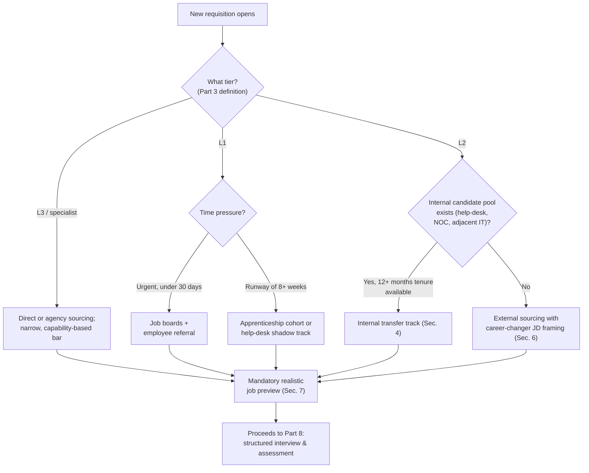

# Part 7 — Hiring & Sourcing Analysts

## Why this part exists

**[CONCEPT]** This part owns getting a correctly leveled, adequately sized candidate pool in front of a hiring panel — the job description, the channels that pool comes from, and the preview that keeps a signed offer from turning into a 90-day resignation. It deliberately stops there. What happens once a candidate is in front of the panel — structured-interview design, building a practical triage exercise, de-biasing the evaluation — is Part 8's territory, not this one's. The tier boundaries a leveled job description encodes ("this is an L1 req, this is an L2 req") are borrowed from Part 10's competency matrix rather than invented here a second time; this part uses those boundaries, it does not define them. What happens in a candidate's first 90 days after signing is Part 11's onboarding and ramp-up program, and the realistic-preview obligation in §7 exists specifically so that program starts with someone who understood the job they accepted. And whether a given certification actually predicts on-the-job capability, as opposed to padding a resume, is Part 12's question in full — this part only addresses certifications as a sourcing-stage filter, a narrower failure mode with its own specific damage: screening out a capable candidate before anyone ever evaluates their actual capability.

**[SENIOR MANAGER]** This part assumes three things are already settled by the time sourcing starts: a tiering model that defines what an L1, L2, or L3 analyst is actually responsible for (Part 3), a headcount plan that says how many of each level you're allowed to hire and by when (Part 5), and a shift pattern that determines what hours the role actually covers (Part 6). Sourcing without those three in hand produces the failure mode this part spends most of its pages diagnosing: a posting that describes a role nobody has actually designed yet, filled by whoever applies fastest — which is not the same thing as filled correctly.

## 1. The mid-level analyst market, and why sourcing is where headcount plans die

**[CONCEPT]** A headcount plan built in Part 5 says a SOC needs, for example, 12 analysts split across three tiers to hold 24/7 coverage. Sourcing is where that number either becomes real people or becomes a permanently open req that shows up in every staffing review for the next year. The two tiers do not source at the same difficulty, and treating them as one problem is the single most common planning error this part exists to correct.

**[SENIOR MANAGER]** Entry-level (L1) roles draw from a genuinely large applicant pool — bootcamp graduates, degree holders, help-desk staff looking to move, career-changers testing the field. A well-written L1 posting on a mainstream job board typically fills inside 30 to 45 days, illustrative figures for a mid-market SOC rather than a sourced industry benchmark. Mid-level (L2) roles — two to five years of hands-on triage experience, capable of running an investigation without a senior analyst checking every step — draw from a pool that is small, employed, and getting called by three other SOCs and at least one MSSP the same week. An L2 req that sits open past 90 days without a serious rethink of the sourcing strategy is not unusual; it's the default outcome of running an L1 sourcing process against an L2 role.

> **Manager's Note**
> If your L2 req has been open longer than your L1 req from the same headcount round, that's not bad luck — it's the market telling you the same sourcing channel doesn't work for both roles. Diagnose the channel before you touch the compensation band; a lot of managers reach for a pay bump first because it's the lever they control fastest, when the actual problem is that the job board posting for an L2 role never reaches anyone who's already an L2 analyst somewhere else.

**[SENIOR MANAGER]** Three things make the L2 layer specifically tight, and each has a different fix rather than one shared fix:

- **Supply is genuinely thin.** Producing a competent L2 analyst takes roughly a year or two of real triage volume after an L1 hire clears onboarding — there is no fast path to manufacture more L2 candidates on demand, which is why sourcing has to reach people who are already there rather than waiting for the market to produce more.
- **Demand is correlated across employers.** Every SOC that grew its L1 bench 18 months ago is now trying to promote or backfill L2 seats at roughly the same time, because headcount plans tend to follow the same budget cycle and the same industry-wide alert-volume growth.
- **Retention pressure compounds it.** Part 18 documents burnout-driven exits clustering in the 18- to 24-month range — almost exactly the point at which an L1 analyst becomes a credible L2 candidate for a competitor. The candidate you're trying to source externally is, in a real sense, competing with the internal promotion your own L1 bench should be producing for you.

**[SENIOR MANAGER]** The practical implication: a sourcing strategy built entirely around external, market-facing channels (job boards, contingency recruiters) will always be fighting the tightest part of the market at the worst odds. The channels covered in §4 through §6 — internal pipelines, apprenticeships, and career-changers — exist because they draw from pools the rest of the market isn't fishing in, not because they're cheaper (though they usually are).

## 2. Leveled job descriptions that map to your tiering model

**[HR/PEOPLE]** A job description has two audiences that want different things from the same document: a candidate deciding whether to apply, and an applicant-tracking system deciding whether to surface the resume to a human at all. Most job descriptions fail the second audience by accident and the first on purpose, listing every skill a fully mature L2 analyst might eventually use as if it were a day-one requirement. The result screens out the exact candidate a mid-level market can't afford to lose — someone strong on fundamentals who hasn't touched the specific SIEM named in bullet point nine.

### 2.1 The leveled job description skeleton

**[HR/PEOPLE]** The fix starts with writing one skeleton with a level parameter, not three unrelated documents. The template below states, level by level, what changes and what doesn't — filed in Appendix A2 as `TMPL-0701`, the leveled job-description template. Use it whenever a new req opens against an already-defined tier from Part 3's model; it does not decide what belongs in each tier for your SOC specifically — that's a Part 3 and Part 10 exercise this template assumes is already done.

```text
TEMPLATE — Leveled analyst job description skeleton, permanent ID TMPL-0701

ROLE: SOC Analyst — [Tier: L1 / L2 / L3]
SHIFT COMMITMENT: [State the actual pattern from Part 6 — do not write "flexible
  hours" if the role is a fixed night rotation]

SCOPE OF WORK (what this person owns, not what the team owns):
  - <!-- state the specific alert categories, ticket types, or investigation depth
       this level handles unsupervised, not "monitors security events" -->

DECISION AUTHORITY:
  - <!-- what this level can close/escalate/contain without sign-off, and what
       always requires a hand-off -->

MUST HAVE (screens candidates out — keep this list short and load-bearing):
  - <!-- the two or three things a person genuinely cannot do the job without,
       stated as a capability, not a certification: "can read raw firewall logs
       and reconstruct a session," not "CCNA required" -->

STRONGLY PREFERRED (does not screen out; used to break ties):
  - <!-- everything else that would be nice -->

GROWTH PATH: What "ready for the next tier" looks like, one sentence, pointing
  to Part 13's ladder rather than restating it.

ON-CALL / ESCALATION EXPECTATION: <!-- the actual frequency, stated as a number
  ("one week in six"), not "occasional on-call support may be required" -->
```

One sentence states what the template does not automate: it does not decide where the must-have/strongly-preferred line sits for a given tier at your SOC — that judgment call belongs to whoever owns the competency matrix in Part 10, and a template filled in without that input just moves the kitchen-sink problem from the "requirements" section to the "preferred" section instead of fixing it.

### 2.2 Common defects: title inflation and the kitchen-sink requirement list

**[HR/PEOPLE]** Two defects account for most leveled-JD failures, and neither is exotic.

The first is writing one job description and slapping "Senior" on the title for the L2 version without changing the content — same bullet points, same tool list, same three sentences about "a passion for security," different job title. Nothing in the document tells an L2 candidate what actually changes about their day, and nothing tells the hiring panel what to test for that an L1 candidate wouldn't also pass.

The second is the kitchen-sink list: every tool the SOC has ever deployed, every certification anyone on the team happens to hold, every "nice to have" stacked into "must have" because a manager reasoned that more requirements can only improve the applicant quality. It does the opposite. An ATS keyword filter or a self-selecting candidate reads 11 required items and one missing item the same way — as a mismatch — even when the missing item is the least important one on the list.

> **People Risk Trap**
> A kitchen-sink requirements list doesn't just shrink the applicant pool — it shrinks it non-randomly, in a direction that hurts the mid-level market specifically. A candidate with five years of strong, relevant experience but a resume that happens to use different vendor-tool names than your list will self-select out or get auto-rejected before a human ever reads it, while a candidate with none of the practical experience but a resume tuned to match every keyword sails through. The fix: cap the must-have section at three items, stated as capabilities rather than tool or certification names wherever a capability claim can substitute for a brand name, and move everything else to strongly preferred — a section explicitly documented as non-disqualifying.

**[HR/PEOPLE]** The table below states what should actually differ across three tiers of the same analyst job description, as a working reference for filling in `TMPL-0701` (CONCEPTUAL SAMPLE — illustrative tier definitions; substitute your own Part 3/Part 10 boundaries).

| Dimension | L1 | L2 | L3 |
|---|---|---|---|
| Scope of autonomy | Handles defined, playbook-covered alert types unsupervised | Handles ambiguous or multi-stage alerts; builds the initial hypothesis without a playbook | Owns novel investigations and mentors triage judgment calls across tiers |
| Escalation authority | Escalates on any uncertainty per playbook trigger | Decides when to escalate vs. close; owns the call for its own queue | Is the escalation endpoint for L1/L2; decides when to pull in IR |
| Typical experience band | 0–2 years, including adjacent IT roles | 2–5 years of hands-on triage | 5+ years, often with a specialist track (hunting, detection engineering) |
| Tooling depth expected | Comfortable navigating the SIEM/EDR console | Can write or tune queries, not just run saved ones | Can evaluate whether the tool itself is the problem |
| On-call exposure | Rare or none | Rotational, as defined in Part 6 | Often carries escalation on-call across shifts |

## 3. The certification trap in sourcing screens

**[HR/PEOPLE]** Certifications are useful signal at the right stage and useless, actively harmful signal at the wrong one. Whether a specific certification predicts on-the-job capability once someone is already an analyst is Part 12's question, and the honest answer there is "it depends, and mostly not as much as certification-heavy job boards imply." This part's narrower claim doesn't need Part 12's full analysis to hold: using certifications as a sourcing-stage filter — before anyone has evaluated a candidate's actual reasoning — screens out people who would pass the real assessment in Part 8 and never gets the chance to find out.

**CASE-0701 — the 11-line filter.** *COMPOSITE CASE EXAMPLE, illustrative numbers constructed from recurring patterns across several mid-market SOC hiring processes, not a single traceable organization.* An L2 analyst req's applicant-tracking system was configured to auto-reject any resume lacking at least two of three named certifications (Security+, CySA+, GCIH) plus three years of a job title containing the word "analyst." Over a six-month posting window, the filter auto-rejected 71% of submitted applications before a recruiter read them. A manual audit of a sample of the rejected pool — done only after the req had sat open for 140 days — found several candidates with genuine triage-relevant backgrounds the filter had no way to see: a former help-desk lead with two years of hands-on incident-ticket ownership and no formal security title, a compliance analyst who had spent a year investigating access-log anomalies for SOX evidence, and a veteran with an intelligence-analysis background and no civilian certifications at all. None had the specific job-title string or the certification pair the filter demanded. All three, once interviewed, cleared the technical bar the req actually needed.

> **People Risk Trap**
> An ATS keyword filter configured around certifications and job titles doesn't reject weak candidates — it rejects candidates whose resume happens to describe their experience differently than the filter expects, which correlates with non-traditional background far more than it correlates with actual capability. The fix is not to remove screening; it's to move the screening criteria from proxy signals (a certification name, a job-title string) to the two or three capability statements from `TMPL-0701`'s must-have section, evaluated by a human on a fast pass rather than an automated keyword match. If your ATS can't screen on a capability statement, screen on nothing at automated stage and let a recruiter do a 15-minute pass instead — a slower human filter that actually reads the resume outperforms a fast filter that reads only certification names.

**[HR/PEOPLE]** This doesn't mean certifications are worthless in sourcing — a cert can be a legitimate, if weak, proxy for baseline knowledge on a candidate with no other track record, which is a real use for an L1 posting drawing from a large unknown pool. The trap is specifically applying that same proxy-signal logic to an L2 or L3 req, where a candidate's actual track record — investigations closed, escalations handled, tools built — is available and is a far stronger signal than whether they hold a particular vendor exam. Part 12 covers which certifications correlate with real capability once you're deciding on a training and certification-support budget for people already on the team; this part's fix is narrower and cheaper: stop using certification possession as a pre-interview gate for any role above L1.

## 4. Help-desk-to-SOC pipelines

**[HR/PEOPLE]** A help desk or NOC produces a steady stream of people who already have three things a security-fundamentals bootcamp graduate usually doesn't: real ticketing-system discipline, real experience being the calm voice on a stressful call, and direct exposure to how this specific organization's systems actually behave day to day. What they don't have yet is security-specific pattern recognition, which is exactly what a structured onboarding program (Part 11) exists to build — the pipeline's job is to select the right people and get them into that program, not to substitute for it.

**CASE-0702 — the tenure-gated shadow track.** *COMPOSITE CASE EXAMPLE, illustrative numbers built from a common pattern across help-desk-to-SOC programs, not one traceable organization.* A help-desk-to-SOC pipeline nominated agents with at least 12 months of tenure and a clean escalation record for an eight-week shadow track: two weeks of security-fundamentals coursework, four weeks of supervised ride-along on real (already-triaged) tickets with a mentor analyst, and two weeks running a reduced live queue under close review before a formal L1 offer. Roughly 30% of nominated agents completed the track and converted to an L1 analyst role in a typical year. The blended cost per hire through this channel — mentor time, coursework, the opportunity cost of a reduced live queue during the ride-along weeks — ran to roughly a third of the agency-recruiter cost per hire the same SOC was paying for externally sourced L1 hires, and 12-month retention on pipeline hires ran noticeably higher than on externally sourced hires from the general job-board channel, largely because pipeline hires already knew the organization's systems, culture, and shift realities going in.

**[HR/PEOPLE]** Two design choices make or break a pipeline like this. First, the tenure and record gate has to be real and enforced — a pipeline that takes any help-desk agent who asks, regardless of performance, becomes a dumping ground for people the help-desk manager wanted to move along anyway, and the SOC inherits that reputation fast. Second, the help-desk manager has to be a genuine stakeholder in the program rather than someone losing staff to it with no offsetting benefit; a pipeline that quietly drains a help desk's best people without backfill or executive sponsorship turns into a cross-team political fight covered more fully in Part 26.

> **Manager's Note**
> Run the pipeline as a named, visible program with its own intake criteria — not an informal "talk to me if you're interested" arrangement. An informal version tends to surface whoever is already friends with someone on the SOC team, which is a much narrower and less representative pool than the one a documented, open nomination process reaches, and it's much harder to defend as fair if it's ever questioned.

## 5. Apprenticeships and other structured non-traditional pipelines

**[HR/PEOPLE]** An apprenticeship model — a fixed-length, paid, cohort-based program combining structured coursework with supervised real work, common in the U.S. under the Department of Labor's registered-apprenticeship framework and in similar forms elsewhere — solves a different sourcing problem than the help-desk pipeline. It reaches people with no existing employment relationship to the organization at all: career-changers, community-college and bootcamp graduates, veterans transitioning out of a related but non-civilian specialty. The tradeoff is structural rather than financial: an apprenticeship needs a genuine curriculum, a named program owner, and a defined evaluation gate before conversion to a full analyst role, or it becomes an unpaid-adjacent labor arrangement that damages the SOC's reputation with exactly the talent pool it's trying to reach.

**[SENIOR MANAGER]** Building a cohort-based apprenticeship (CONCEPTUAL SAMPLE — illustrative structure, not a specific published program) typically runs 10 to 12 weeks, mixes vendor-neutral security fundamentals with graduated, supervised live-queue work in roughly the same shape as the help-desk shadow track in §4, and ends with a documented conversion decision rather than an automatic offer. The cost profile favors this channel heavily against agency recruiting on a per-hire basis once a cohort is running at any real size, because the marginal cost of a fourth or fifth apprentice in the same cohort is far lower than the marginal cost of a fourth or fifth agency placement — but the fixed cost of designing the curriculum and staffing mentors the first time is real, and a one-off cohort of two or three people rarely justifies that fixed cost on its own. This is the channel most worth building jointly with two or three peer SOCs, a community college, or a regional workforce-development partner, spreading the fixed curriculum cost across more apprentices than any single SOC could source alone — a build-vs-buy tradeoff structurally similar to the one Part 2 works through for the SOC's operating model itself, applied here to a training pipeline instead of the SOC function as a whole.

## 6. Career-changers as a deliberate sourcing category

**[HR/PEOPLE]** Career-changers overlap partly with the help-desk and apprenticeship channels above but deserve their own sourcing lens because the transferable skill and the resume language rarely match. A military intelligence analyst, a systems administrator, a compliance or internal-audit investigator, a QA engineer used to reproducing and documenting defects, even an experienced teacher used to real-time behavior monitoring across a room of 30 people — each brings a genuinely relevant capability (structured investigation, pattern recognition under time pressure, disciplined documentation, sustained attention across a long shift) that almost never appears as a keyword an ATS or a skimming recruiter is trained to look for.

**[HR/PEOPLE]** The practical fix sits in the job description itself, not just in outreach: an explicit "or equivalent experience" clause attached to each must-have item, with the equivalent stated concretely rather than left as a vague escape hatch. "Two years of SOC analyst experience, or two years in a role requiring structured investigation under time pressure (audit, compliance, help desk, military intelligence, or similar)" does real work; "or equivalent experience considered" as a bare afterthought does none, because it gives a recruiter or an ATS nothing to match against and gets ignored in practice.

> **Manager's Note**
> When you interview a career-changer, resist grading them against the vocabulary an incumbent analyst would use and instead ask them to walk through a real investigation or discrepancy they resolved in their previous role, in their own language, then map it yourself to the capability you actually need. A candidate who can describe reconstructing a fraudulent-transaction pattern from disparate audit logs is describing the same underlying skill as reconstructing an attack chain from disparate telemetry — they just don't know to call it that yet, and it isn't their job to translate it for you.

## 7. The realistic job preview

**[HR/PEOPLE]** A realistic job preview — telling a candidate, before they accept, what the job actually feels like rather than only what it requires — is an established recruiting practice, not a novel idea invented for this book: giving candidates accurate, including unflattering, information about a role has long been shown in organizational-psychology research to reduce early turnover, because it lets people who wouldn't tolerate the actual conditions self-select out before they cost the organization a signed offer and a 90-day ramp-up investment. A SOC has an unusually strong case for using one deliberately, because the gap between how a SOC analyst role reads on paper and what it feels like on a Tuesday night shift is often wide.

### 7.1 What a realistic preview actually includes

**[FRONTLINE MANAGER]** A useful preview is concrete, not a disclaimer. Four elements do most of the work:

- **The actual shift pattern**, stated the way Part 6 defines it — not "some evening and weekend work may be required" when the real pattern is a fixed rotating night shift with one weekend in six. If a candidate would decline the role after seeing the real pattern, better to lose them before the offer than after 90 days.
- **A sample-ticket walkthrough during the interview itself** — showing (or better, walking a candidate through) a real, already-closed alert and asking them to reason about it out loud, so the interview process itself previews the actual work rather than only discussing it abstractly.
- **A stated volume expectation** — a concrete range like "40 to 60 tickets per eight-hour shift at a steady state, with surge days well above that" tells a candidate something a bulleted list of responsibilities never will.
- **Honest disclosure of the escalation and on-call reality** — how often a shift genuinely turns into a high-stress event, not just that "incident response" appears somewhere in the job description.

**[FRONTLINE MANAGER]** None of this requires new infrastructure. A 15-minute segment added to the existing interview loop, run by whoever already owns the technical portion of the assessment in Part 8, covers most of it — the preview and the assessment can share the same conversation as long as the interviewer is explicit about which parts are evaluative and which parts are informational for the candidate.

**CASE-0703 — attrition after adding a shift-reality preview.** *COMPOSITE CASE EXAMPLE, illustrative numbers, constructed from a recurring pattern rather than one traceable organization.* A SOC hiring for a fixed night-rotation L1 role had been describing the shift pattern only as "24/7 coverage team, flexible scheduling" in the posting and interview, relying on the offer letter to disclose the actual rotation. 90-day attrition on hires from that channel ran to roughly 35%, with exit interviews (Part 18's methodology) consistently naming the shift pattern as a surprise rather than a known tradeoff. After the SOC added a mandatory 15-minute shift-reality segment to the interview — stating the exact rotation, the weekend frequency, and asking candidates directly whether that pattern was workable for their life circumstances before proceeding further — the applicant pool narrowed (fewer candidates advanced past that stage, which was the intended effect, not a defect), and 90-day attrition among hires who did advance fell to roughly 12% over the following year.

> **People Risk Trap**
> Treating a realistic preview as something that might scare off candidates you need is the mistake, not a defensible tradeoff — every candidate it scares off is a candidate who would have accepted, discovered the reality within a few weeks, and left anyway, except now the SOC has also lost the 60 to 90 days of onboarding investment. The math almost always favors losing the candidate earlier and cheaper.

### 7.2 Validating your own preview

**[FRONTLINE MANAGER]** A preview that exists only as a line in the job posting ("shift work required") without being reinforced in the interview conversation tends to be technically honest and practically useless, because candidates skim past boilerplate language and remember what an actual person told them.

> **Field Test**
> **Setup:** A written realistic-preview step exists in the interview process (the shift pattern, ticket volume, and on-call reality are supposed to be disclosed at some point before an offer).
> **Action:** Ask someone with no involvement in hiring for this role — a peer manager, an HR partner, or a recently onboarded analyst — to sit through the standard phone screen or read the current posting cold, then describe back, unprompted, what a typical Tuesday-night shift in this role actually feels like.
> **Expected result:** They should be able to name the shift pattern, a rough ticket-volume range, and the on-call frequency without having to guess or extrapolate. If they can only repeat generic language like "fast-paced environment" or "24/7 operations," the preview exists on paper but isn't actually reaching candidates in the room.

## 8. Choosing and scoring sourcing channels

**[SENIOR MANAGER]** No single channel covers every level and every urgency, and the right answer changes with how much time pressure a given req is under. The table below compares the channels this part covers, as a working reference for a headcount round rather than a fixed ranking (CONCEPTUAL SAMPLE — illustrative comparison; substitute your own sourced cost and time-to-fill data before using this for a real budget defense in Part 20).

| Channel | Typical cost per hire | Typical time-to-fill | Best-suited level(s) | Primary risk |
|---|---|---|---|---|
| Job boards / inbound applications | Low direct cost, high recruiter screening time | 30–60 days for L1; often 90+ days for L2 | L1 primarily | Highest exposure to the certification-keyword trap in §3 |
| Employee referral | Low | 20–45 days | L1–L2 | Can narrow diversity of the pool if run informally, per §4's caution |
| Contingency / agency recruiter | High — often 15–25% of first-year salary | 30–60 days once engaged | L2–L3 | Fast, but expensive at volume; weak on non-traditional candidates who don't match agency search terms |
| Help-desk-to-SOC pipeline | Low, mostly internal staff time | 8–12 weeks program length, planned in advance | L1, feeding L2 over time | Needs a genuine tenure/performance gate or it becomes a dumping ground |
| Apprenticeship / bootcamp partnership | Low per hire at cohort scale; high fixed setup cost | 10–12 week program, cohort-scheduled | L1 | Fixed curriculum cost doesn't pay off below a minimum cohort size |
| University / early-career program | Moderate, seasonal | Tied to academic calendar | L1 | Long lead time; poor fit for an urgent open req |
| Veteran transition program | Low to moderate | Varies with program partner | L1–L2, occasionally L3 for intelligence-adjacent roles | Resume translation gap covered in §6 if the JD isn't adapted |

## 9. Worked example: rebuilding a sourcing funnel under a tight mid-level market

**CASE-0704 — the agency-only L2 funnel.** *COMPOSITE CASE EXAMPLE, illustrative numbers constructed to demonstrate the interaction of the failure modes covered in this part; not a single traceable organization.*

**[SENIOR MANAGER]** A 40-analyst SOC's headcount plan (from a Part 5-style capacity model) approved three additional L2 seats for the year. The SOC sourced all three exclusively through a contingency recruiting agency, using a job description carried over from the previous year with minor edits — a description that listed 11 required certifications and tools, several inherited from a platform the SOC had since retired. Average time-to-fill across the three reqs ran to roughly 150 days, agency fees ran to about $17,500 per hire, and of the three hires eventually made, two left within six months — exit interviews naming the actual on-call rotation and escalation-volume expectations as materially different from what they'd understood going in, echoing the pattern in CASE-0703.

**[SENIOR MANAGER]** The redesign touched every lever this part covers, not just one:

- The job description was rewritten against `TMPL-0701`, cutting the requirements list to three must-have capability statements and moving everything else — including the retired platform's tool name — to strongly preferred.
- A help-desk-to-SOC pipeline (§4) was stood up in parallel, drawing on internal candidates who already knew the environment; two of the eventual three hires for the next round of reqs came from this channel rather than external sourcing.
- A mandatory shift-and-escalation-reality segment (§7) was added to every interview loop for the role, disclosing the actual on-call frequency and a real ticket-volume range before any offer was extended.

**[SENIOR MANAGER]** Over the following 12 months, average time-to-fill for L2 reqs fell to roughly 55 days, blended cost per hire (mixing internal-pipeline hires with the smaller number still sourced externally) fell to roughly $4,200, and six-month attrition among new L2 hires fell to roughly 10%. None of the three changes alone would have produced that result on its own — a rewritten job description with no change to sourcing channel still competes for the same thin external pool; a pipeline with no realistic preview still risks the same early-attrition pattern from CASE-0703; a preview attached to a kitchen-sink job description never gets enough candidates through the door to preview anything to. The combination is the point.

## 10. Choosing a channel for a specific req: a decision aid

**[SENIOR MANAGER]** Figure 7.1 below turns §1 through §8 into a single decision aid for a manager opening a new req — which channel (or combination) fits, given the level and how much runway the req has before it needs to be filled.

Mermaid source retained below as the editable source of truth per this book's diagram build process.





**Figure 7.1 — Choosing a sourcing channel by tier and time pressure.** *CONCEPTUAL.* Illustrates the decision path this part's channels feed into; it is a structural aid for a manager opening a req, not a capture of any specific SOC's actual applicant-tracking workflow. Every path converges on the realistic job preview from §7 before handing off to Part 8's assessment process — no channel is exempt from that step. Supports the channel-selection guidance in this section and the worked example in §9. Diagram ID `FIG-0701`.

## Where this goes next

**[CONCEPT]** A correctly sourced candidate is the input Part 8's structured interview and assessment process needs to do its job — a strong assessment process cannot fix a pool that never contained the right people, and a weak one will waste a strong pool regardless. Part 10's competency matrix should be the document `TMPL-0701` pulls its tier boundaries from, and Part 13's career ladder is what the "growth path" line in that same template ultimately points to. Part 12 picks the certification question back up in full once someone is already on the team and a training budget is being decided, rather than at the sourcing gate this part covers. Part 18's attrition data is what the realistic-preview obligation in §7 exists to reduce, and Part 20's budget model is what the cost-per-hire figures in §8 and §9 ultimately feed into when a hiring channel needs to be defended in dollars rather than described in prose.

---

**Cross-references:** This part assumes Part 3 — Tiering Models: L1/L2/L3 and Beyond (tier definitions that leveled job descriptions encode), Part 5 — Headcount & Capacity Modeling (the approved req count and timing this part sources against), and Part 6 — Shift Pattern & Coverage Design (the shift reality a realistic job preview must disclose accurately). It points forward, within this book, to Part 8 — Interviewing & Technical Assessment Design, Part 10 — Competency Models & Skills Matrices, Part 11 — Onboarding & Ramp-Up Programs, Part 12 — Ongoing Training & Skill Development, Part 13 — Career Ladders & Promotion Criteria, Part 18 — Attrition & Retention, and Part 20 — Building & Defending the SOC Budget. It does not cite SOC Playbook Handbook or Detection Engineering Handbook V2 — sourcing and hiring mechanics have no technical-mechanics counterpart in either companion volume. The leveled job-description template (`TMPL-0701`) is filed in Appendix A2, companion to Parts 7–8 and 10.
