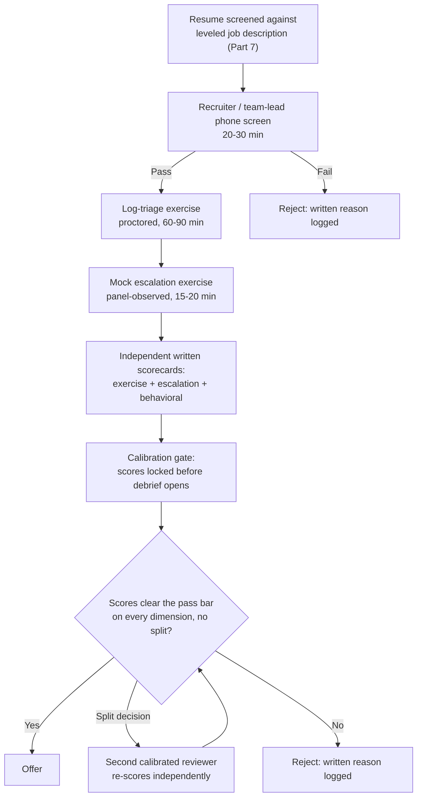

# Part 8 — Interviewing & Technical Assessment Design

## Why this part exists

**[CONCEPT]** Part 7 gets a candidate to the point where their resume matches a leveled job description and they've seen a realistic preview of the job. This part is what happens once that candidate is actually on a call or working through a timed exercise: how the interview loop is structured, what a practical assessment actually tests, how a panel scores it consistently, and how the whole process gets checked for bias before it quietly starts hiring for confidence instead of competence. The two parts are sequential, not overlapping. A poorly leveled job description — Part 7's problem — sinks an interview loop no matter how well the loop itself is designed, because the loop ends up screening candidates against a bar nobody actually defined.

This part does not invent new detection logic, new playbook steps, or new escalation criteria to use as assessment material. When an exercise needs a log-triage scenario, the underlying alert, query, or analytic behind it is borrowed — sanitized and adapted, not authored from scratch — from Detection Engineering Handbook V2's detection content, cited by part number where it matters. When an exercise needs a mock escalation, the standard for what a good escalation looks like comes from SOC Playbook Handbook, Part 27 — Escalation Quality, for the mechanics of a good hand-off, not from a definition invented here. This part's job is narrower, and in most hiring programs it's the part that goes wrong more often than the material does: designing the exercise format, writing the scoring rubric, running the panel process, and de-biasing the controls around whatever technical content gets dropped into them. A technically flawless exercise scored by an uncalibrated panel with no written rubric produces the same bad hire as a sloppy exercise scored well. Most SOC hiring failures trace back to the process wrapped around the material, not the material itself, which is why this chapter spends almost no time on detection or playbook correctness and a great deal of time on scorecards, calibration, and bias.

## 1. What a SOC technical interview loop is actually testing for

### 1.1 Knowledge, skill, and judgment are three different claims

**[CONCEPT]** Most unstructured SOC interviews test knowledge, because knowledge is the easiest thing to verify in a thirty-minute conversation. "Walk me through the MITRE ATT&CK framework" or "what's the difference between an IOC and an IOA" gets an answer a non-technical interviewer can pattern-match against a study guide, and a technical interviewer can nod along to without ever finding out whether the candidate has actually triaged anything. Knowledge is real and it matters, but it's the weakest of the three things a SOC role actually needs, because it's also the cheapest thing for a candidate to cram the week before an interview.

Skill is whether the candidate can perform the triage motion itself under realistic conditions: pull the right context, read a log line correctly, notice the field that's missing, write a clear note. Judgment is the layer above skill — knowing when the playbook doesn't cleanly apply, when a disposition should be "unable to determine" rather than a confident guess, when a pattern that matches a rule's logic still doesn't mean the activity was malicious. Detection Engineering Handbook V2, Part 1 — Detection Engineering Foundations draws exactly this line for alert disposition: collapsing "the rule's logic matched" into "the activity was malicious" is a named triage failure mode there, and it is precisely the judgment gap a good SOC interview needs to surface and an unstructured conversation almost never does, because a candidate can describe good judgment in the abstract far more easily than they can exercise it against an actual queue item.

**[HR/PEOPLE]** The practical consequence for interview design is that knowledge questions belong in a short screen, not the center of the loop. If knowledge is over 60% of the total scoring weight across a loop, the loop is measuring the wrong thing — it will pass articulate candidates who can talk about triage and fail quieter candidates who are actually good at it, and it will do this consistently, cycle after cycle, until someone looks at who's getting hired and who's succeeding six months in and notices they aren't the same population.

### 1.2 What has to already be true before day one of interviewing

**[SENIOR MANAGER]** This part assumes the inputs from Part 7 are already in place: a leveled job description that states, in observable terms, what an L1 versus an L2 candidate needs to demonstrate, and a realistic job preview so a candidate walking into the loop already knows roughly what the job is. Without the leveled job description, there's no defensible answer to "what's the pass bar for this exercise" — the pass bar for an L1 hire and an L2 hire on the same log-triage exercise should differ, and it can only differ on purpose if someone already wrote down what separates the two levels before the first candidate sat down.

> **Cross-Book Pointer**
> This part does not define what a good escalation looks like, mechanically — that's a per-ticket standard, not a hiring standard. See SOC Playbook Handbook, Part 27 — Escalation Quality for the criteria a real escalation is judged against (context included, severity justified, next action named); the mock escalation exercise in §3.2 borrows that standard directly as its rubric rather than inventing a separate one for hiring purposes. Come back here once you understand what "good" means mechanically — this part only covers how to observe it in a 30-minute simulation and score it consistently across candidates.

## 2. Structured-interview design

### 2.1 Why the unstructured "just have a conversation" loop fails predictably

**[HR/PEOPLE]** An unstructured loop — different interviewers asking whatever occurs to them, in whatever order, with no shared rubric — fails in the same handful of ways every time. Interviewers anchor on the first strong or weak answer and score the rest of the conversation to match it. Two interviewers asking different questions produce scores that aren't comparable, so a debrief becomes a negotiation over impressions rather than a comparison of evidence. And the interviewer's own specialty leaks into the bar: a detection-engineering-leaning interviewer over-weights query syntax, an incident-response-leaning interviewer over-weights containment steps, and the candidate's actual fit for the open role — which might be neither — gets lost under whichever interviewer happened to be in the room and enjoyed asking about their own specialty most.

None of this requires a bad-faith interviewer. It's what happens by default when four people are each given "assess this candidate's technical ability" with no shared definition of what that means for this specific role, at this specific level, this week.

### 2.2 The three-stage loop

**[SENIOR MANAGER]** A structured SOC loop separates the conversation from the demonstration, and separates both from the debrief. Three stages cover the ground a fourth or fifth stage rarely adds much to:

1. **Screen** (20–30 minutes) — recruiter or team lead confirms baseline fit against the leveled job description: shift availability, the realistic-preview conversation from Part 7, and a small number of scoped technical questions to rule out a clear mismatch before investing panel time.
2. **Practical assessment** (60–120 minutes, proctored or live) — the log-triage exercise and the mock escalation exercise, described in §3, which test skill and judgment directly rather than through a candidate's self-report.
3. **Panel and behavioral loop** (45–60 minutes) — a small panel (two to three interviewers, never one) reviews the assessment output with the candidate, asks behavioral questions tied to specific competencies from the leveled job description, and each interviewer scores independently before any group discussion happens.

The table below maps each stage to what it's actually designed to validate, so a manager building or auditing a loop can check whether a given stage is pulling its weight, adding time to the process for no distinct signal, or duplicating what an earlier stage already validated.

| Loop Stage | Primarily Validates | Typical Duration | Owner | Common Failure Mode |
|---|---|---|---|---|
| Screen | Baseline fit, shift/logistics, gross mismatch | 20–30 min | Recruiter or team lead | Turns into a second full technical interview, wasting panel time on candidates who were never a fit |
| Log-triage exercise | Skill: can the candidate actually work an alert to a defensible disposition | 60–90 min | Assessment designer / SOC manager | Graded on "the right answer" instead of the reasoning that got there |
| Mock escalation exercise | Judgment: does the candidate know what to escalate, how, and with what context | 20–30 min | Team lead or senior analyst | No written rubric — panel scores on "sounded confident" |
| Panel + behavioral loop | Communication, collaboration, culture add (not culture "fit") | 45–60 min | Hiring manager + 2 panelists | One panelist's strong opinion overrides two written scorecards in debrief |

### 2.3 Writing a scorecard that survives a challenge

**[HR/PEOPLE]** A scorecard survives a challenge — from a rejected candidate, from HR, from a lawyer — when every score traces to an observable behavior in the interview or exercise, not to an interviewer's overall impression. "Strong communicator" is not a score; "explained the triage decision in under two minutes without prompting, using the correct account and source-address fields from the log excerpt" is a score. The difference is whether a second person, reading only the written notes with no memory of the conversation, would reach the same score.

> **People Risk Trap**
> Letting a panel debrief happen before every interviewer submits an independent written score lets whoever speaks first, speaks loudest, or outranks the room set the anchor the rest of the discussion drifts toward — a well-documented group-decision failure mode, not a SOC-specific one, but one that shows up constantly in hiring debriefs. The fix: every interviewer submits their scorecard, in writing, against the rubric, before the debrief conversation starts. The debrief resolves disagreement between already-recorded scores; it does not generate the scores in the first place.

## 3. Building the practical assessment

### 3.1 The log-triage exercise: what to build versus what to borrow

**[SENIOR MANAGER]** The exercise's job is to put a candidate in front of something close to a real alert and watch how they work it, not to test whether they can solve a novel puzzle nobody in the actual role would ever face. The fastest way to build one badly is to invent a synthetic scenario with no connection to how a real analyst actually encounters ambiguity — a clean, single-cause "gotcha" that has one correct answer and one path to it, which tests puzzle-solving more than triage.

A better source is real, already-produced detection content, sanitized: a redacted alert, a de-identified log excerpt, or a described analytic behavior drawn from Detection Engineering Handbook V2's detection library (Parts 3–29 for the underlying rule logic and telemetry, or Part 1 — Detection Engineering Foundations for the vocabulary the rubric should use when scoring how the candidate talks about what they're seeing: event, signal, alert, disposition). The exercise doesn't need — and should not include — the full detection's tuning history or its false-positive allowlist; it needs enough raw material that a candidate has to do the same cognitive work a real analyst does: read the evidence, decide what's missing, and reach a disposition they can defend, including "unable to determine" when the evidence genuinely doesn't support a confident call.

**[FRONTLINE MANAGER]** The rubric should reward the reasoning path, not just the final label. A candidate who reaches "unable to determine, escalate for enrichment" and can name exactly what enrichment they'd request and why is demonstrating stronger judgment than a candidate who confidently calls it a false positive with no stated reasoning — even if the second candidate happens to land on the label the real detection's own disposition history eventually confirmed. Scoring the label instead of the reasoning rewards lucky guessing and punishes appropriately cautious analysts, which is exactly backward for a role where an overconfident wrong disposition is more expensive than a correctly cautious escalation.

### 3.2 The mock escalation exercise: what to build versus what to borrow

**[SENIOR MANAGER]** Where the log-triage exercise tests whether a candidate can work an alert alone, the mock escalation exercise tests whether they can hand it off — verbally, to a panelist playing a Tier 2 analyst or team lead, with a defined time limit (10–15 minutes is enough; longer starts testing stamina rather than communication). The scenario can be the same log-triage exercise the candidate just finished, or a second, shorter one, but the standard the escalation is judged against should not be invented for the hiring loop. It's the same standard a real escalation is judged against operationally: does it include the context the receiving tier actually needs, is the severity call justified rather than asserted, and does it name a concrete next action — the exact criteria in SOC Playbook Handbook, Part 27 — Escalation Quality. Reusing that standard here means a strong performer on this exercise is, by construction, someone who already escalates the way the SOC wants escalations to look on day one, not someone who happens to interview well.

### 3.3 Calibrating difficulty and length to the level being hired

**[SENIOR MANAGER]** The same exercise format should not carry the same pass bar across every level on the ladder, and it should not run the same length either — a senior candidate sitting through a 90-minute exercise built for an entry-level screen reads, correctly, as a process that doesn't know what it's hiring for. The table below is a starting calibration, not a fixed rule; adjust the specific minutes and bar language to the actual leveled job description from Part 7 (CONCEPTUAL SAMPLE — illustrative calibration bands, not sourced benchmark data).

| Level | Exercise Content | Time Budget | Pass Bar Language |
|---|---|---|---|
| L1 / entry | Single alert, clear evidence trail, one missing field | 45–60 min | Reaches a defensible disposition; correctly identifies the missing field without prompting |
| L2 / experienced analyst | Alert with a genuine ambiguity (competing plausible explanations) | 60–90 min | Reaches "unable to determine" appropriately, names the exact enrichment needed, or defends a confident call with correct reasoning |
| Senior / team-lead track | Alert plus a coaching component (a fictional L1's incorrect disposition to review) | 75–90 min | Correctly re-disposition *and* gives feedback that would actually help the fictional L1 improve, not just a corrected answer |

> **Field Test**
> **Setup:** A new or revised log-triage exercise exists on paper but has never been run against anyone.
> **Action:** Before offering it to a single candidate, run it, proctored, against two current analysts already known to be strong performers and one analyst who is currently on a performance-improvement track or recently struggled with a similar real ticket.
> **Expected result:** The two strong performers should clear the intended pass bar comfortably and within the time budget; the struggling analyst's result should visibly resemble the specific gap already documented in their real performance record. If a strong performer fails the exercise, or the struggling analyst sails through it, the exercise is measuring something other than the skill it's named for — fix the exercise before it ever touches a candidate, not after a bad hire six months later.

## 4. Scoring, calibration, and the pass bar

### 4.1 Anchoring the rubric to observable behavior

**[HR/PEOPLE]** Every rubric line should answer one question: what would I actually see or hear that earns this score? "Good technical judgment — 4/5" is not a rubric line; "correctly flags the missing source-attribution field and requests the specific enrichment needed to resolve it — 4/5, one point off for not stating why the alternative explanation was ruled out" is. The difference isn't wordiness for its own sake — it's whether two different interviewers, watching the same candidate, land on the same score without discussing it first.

### 4.2 Running a calibration session before the first real candidate

**[SENIOR MANAGER]** Calibration means multiple interviewers score the same recorded or simulated candidate performance independently, then compare scores and discuss any gap before the rubric is used on a real person. This is the hiring-side twin of the calibration practice this book develops fully for ongoing quality assurance in Part 15 — same mechanism (independent scoring, then reconciliation), different unit of analysis (one candidate's interview performance instead of one analyst's ticket).

> **Manager's Note**
> Calibrate on a recording everyone already agrees was a strong pass before calibrating on a genuinely borderline one. It's the fastest way to discover two interviewers don't actually share a definition of "clears the bar" yet — better to find that out on an easy case than in a live debrief where a real candidate's offer is riding on the disagreement.

### 4.3 Setting the pass bar and defending it later

**[SENIOR MANAGER]** The pass bar is a real tradeoff between two costs a manager has to name out loud, not split the difference on by instinct: a bar set too low produces bad hires that cost months of remediation, coaching time, and — if it goes badly enough — a termination and a re-hire cycle; a bar set too high produces false negatives, rejecting candidates who would have succeeded, in an analyst market Part 7 already establishes as persistently tight at the mid-level. Neither failure is visible in the moment a hiring decision is made. Bad hires reveal themselves three to six months in; false negatives never reveal themselves at all, because the rejected candidate simply goes and succeeds somewhere else, invisibly, and the hiring program never learns it made a mistake.

**COMPOSITE CASE EXAMPLE (`CASE-0801`)** — the following merges patterns from multiple structured-interview redesigns into one illustrative narrative; it is not a single traceable organization.

A 22-person SOC ran an unstructured loop for years: one 45-minute conversational interview per candidate, no shared rubric, a single interviewer's judgment call on each hire. Over an 18-month hiring window, 68% of new hires required a formal performance-improvement plan within their first six months — most for the same underlying gap, an inability to reach a defensible disposition on an ambiguous alert without heavy hand-holding, which the unstructured interview had never actually tested. Average time-to-fill was 47 days. Not every PIP ended in a loss — a few analysts improved and stayed — but 6 of the 11 new hires in that window ultimately failed the PIP and had to be backfilled. Using a rough fully-loaded cost of $45,000 per bad hire (recruiting spend, ramp-up time, a struggling analyst's real handle-time drag on the queue, and eventual backfill), the SOC's own back-of-envelope math put the unstructured loop's hidden cost at roughly $275,000 across that window, against a headcount of eleven new hires.

The SOC replaced the single interview with the three-stage loop from §2.2: a screen, a 75-minute log-triage exercise borrowed and sanitized from its own detection library, a 15-minute mock escalation scored against the SOC Playbook Handbook's escalation-quality criteria, and a calibrated three-person panel scoring independently before debrief. Time-to-fill rose slightly, to 52 days — the extra stages take real calendar time — but the six-month performance-improvement-plan rate for the next hiring cohort dropped to 15%. The SOC's own estimate is that the five-day increase in time-to-fill cost roughly $8,000 per hire in extended coverage-gap overtime, against a bad-hire-cost reduction of over $30,000 per avoided PIP-track hire — a trade the SOC judged worth making, though it required defending a slower hiring process to a leadership team that had been measuring the recruiting function on time-to-fill alone.

> **What Would Change My Mind**
> This part treats a structured, calibrated practical assessment as a materially better predictor of on-the-job triage performance than an unstructured conversational interview. If a SOC running a genuinely unstructured loop showed a six-month performance-improvement-plan rate at or below what CASE-0801's structured loop achieved — not a self-reported "we hire good people," but a tracked rate — that would undercut this part's central claim that structure itself is doing the predictive work, rather than some other factor (a tighter labor market that quarter, a better recruiter, a smaller hiring volume) coinciding with whichever loop happened to be in place at the time.

## 5. De-biasing the interview and assessment process

### 5.1 Where bias actually enters the loop

**[HR/PEOPLE]** Bias in a SOC interview loop rarely shows up as an interviewer consciously favoring one group over another. It shows up structurally, in places a well-intentioned process still lets it operate unchallenged:

- **Certification halo carried over from the resume screen.** Part 7 already names the risk of over-indexing on certifications during sourcing; the same pattern re-enters the interview when a panelist keeps steering questions back toward a candidate's certification instead of the actual exercise output, effectively re-testing the resume instead of the job.
- **Order and recency effects in the panel debrief.** The candidate discussed last, or the interviewer who speaks first in the debrief, disproportionately shapes the outcome — the exact failure the People Risk Trap in §2.3 names.
- **Unpaid, open-ended take-home exercises.** Covered in full in §5.3, because the mechanism and the fix are specific enough to deserve their own subsection.
- **Panel composition.** A panel drawn entirely from one specialty, one tenure band, or one demographic group narrows what "looks like a good hire" means without anyone deciding that on purpose.

### 5.2 Structural fixes that hold up under scrutiny

**[HR/PEOPLE]** Each bias source above has a structural fix that doesn't depend on any individual interviewer's good judgment in the moment, which is the point — a fix that relies on everyone remembering to be fair on a busy hiring week doesn't survive a busy hiring week.

| Bias Source | Mechanism | Structural Fix |
|---|---|---|
| Certification halo | Panelist re-tests the resume instead of the exercise | Rubric has no "certifications" line past the initial screen; scorecard fields only reference exercise and behavioral evidence |
| Debrief order/recency | Last or loudest opinion anchors the group | Written independent scores locked before debrief opens (§2.3) |
| Unpaid take-home | Filters for candidates with spare unstructured time | Proctored, time-boxed exercise or a paid stipend (§5.3) |
| Narrow panel composition | "Good hire" pattern-matches to the panel's own profile | Rotate panel membership; require at least one panelist outside the hiring manager's own reporting line |

> **People Risk Trap**
> A panel that always includes the same two or three senior analysts, because they're the most technically credible reviewers, quietly trains the hiring bar to reproduce whoever is already on the team — including whatever gaps that team already has. The fix: rotate panel seats across a wider pool of qualified reviewers on a fixed schedule, and treat "who's on the panel this cycle" as a deliberate roster decision, not a default to whoever's available.

### 5.3 The equity cost of an unpaid take-home assessment

**[HR/PEOPLE]** A four-hour unpaid take-home exercise, due within a week, does not test the same thing for every candidate. A candidate with no caregiving responsibilities and no second job can carve out four uninterrupted hours on a weekday evening; a candidate working a second job, or a single parent, or someone in a household where evening hours are already committed, either can't complete it at all or has to complete it in fragments late at night, degraded by fatigue in a way that has nothing to do with their actual triage skill. The exercise ends up screening for available unstructured personal time as much as it screens for the skill it claims to measure — and the population it screens out skews toward exactly the non-traditional and career-changer candidates Part 7 identifies as the mid-level market's most under-tapped source.

Two fixes address this without weakening the exercise itself: run it proctored and time-boxed inside the loop instead of sent home unpaid, or, where a take-home format is genuinely necessary (distributed candidates, scheduling constraints), pay a stipend for the time — a modest flat rate, commonly in the $100–$200 range for a two-to-three-hour exercise, signals the SOC is buying the candidate's time rather than assuming it's free, and removes the "who can afford to spend an unpaid evening on this" filter entirely.

> **People Risk Trap**
> Scoring a take-home exercise on how quickly it was returned — treating a same-day submission as a stronger signal than one that arrives on the deadline — punishes exactly the candidates described above, who may need the full window precisely because they're fitting the exercise around other obligations, not because they're less capable. The fix: score only the submission's content against the rubric; never let elapsed time factor into the score unless the exercise is explicitly, and fairly, timed and proctored for everyone.

## 6. Running the loop end to end

### 6.1 Sequencing and the calibration gate before a decision

**[SENIOR MANAGER]** Figure 8.1 lays out the full loop from §2 through §5 as one sequence, with the calibration gate — independent written scores, locked before debrief — placed explicitly before any pass/fail decision, not folded into the debrief conversation itself.

**Figure 8.1 — Structured SOC technical-interview loop, screen to offer decision.** *CONCEPTUAL.* Illustrates the sequencing this part recommends: independent scoring happens before group discussion at every gate, and a split decision routes to a second calibrated reviewer rather than being resolved by debate alone. This is a process model of the recommended loop, not a capture of any single organization's actual applicant-tracking workflow. Diagram ID `FIG-0801`.

**[SENIOR MANAGER]** The split-decision path matters as much as the pass/fail paths. A loop with no defined response to disagreement quietly defaults to whoever argues hardest in the debrief winning — the same recency-and-volume problem named in §2.3 and §5.1, just relocated to the very last step instead of removed from the process. Routing a genuine split to a second, independent, calibrated reviewer costs one more scoring pass and removes the debate from the decision entirely.

### 6.2 What "the assessment predicted this" looks like 90 days in

**[SENIOR MANAGER]** The loop's real test isn't the hiring decision — it's whether the specific gaps or strengths the assessment flagged show up, unsurprised, in the new hire's first 90 days. A candidate whose log-triage exercise showed strong reasoning but a habit of under-communicating context should, 90 days in, look like an analyst whose dispositions are usually right but whose escalation notes need coaching — not a surprise, but confirmation the exercise measured something real. Part 11 — Onboarding & Ramp-Up Programs is the natural place that 90-day picture gets built out into a structured ramp plan, and Part 10 — Competency Models & Skills Matrices is where the same observable-behavior language this part uses for a hiring rubric becomes the ongoing standard a promoted-in-place analyst is measured against. If the assessment's flagged gaps and the ramp-up period's actual coaching notes routinely have nothing to do with each other, that's the signal the assessment itself needs to be redesigned, not a signal that this particular hire was simply unlucky.

## 7. Where this goes next

**[CONCEPT]** This part assumed a leveled job description and a realistic preview already exist (Part 7) and borrowed its practical-assessment material and mock-escalation rubric from SOC Playbook Handbook, Part 27 — Escalation Quality and Detection Engineering Handbook V2's detection content rather than inventing either. What it built instead is the process wrapped around that material: a three-stage loop, a scorecard anchored to observable behavior, a calibration gate that locks scores before debrief, and structural fixes for the specific ways bias enters a SOC hiring process. The structured-interview scorecard and log-triage/mock-escalation exercise templates this part describes have their reusable, fillable form in Appendix A2 (`TMPL-0801`), built as the companion artifact to this part and Part 7. Part 10 picks the same observable-behavior language back up to define what "ready for L2" means on an ongoing basis, and Part 13 uses it again for promotion criteria — nothing past this point should need to redefine what a calibrated, bias-checked assessment looks like; it should just use one.

## Cross-references

This part assumes Part 7 — Hiring & Sourcing Analysts (leveled job description, realistic job preview, the tight mid-level market and certification-over-indexing risk) and points forward to Part 10 — Competency Models & Skills Matrices, Part 11 — Onboarding & Ramp-Up Programs, Part 13 — Career Ladders & Promotion Criteria, and Part 15 — Quality Assurance Programs (the calibration mechanism reused for ongoing QA rather than hiring). Outside this book, it cites SOC Playbook Handbook, Part 27 — Escalation Quality (the mock-escalation rubric) and Detection Engineering Handbook V2, Part 1 — Detection Engineering Foundations and Parts 3–29 (source material and vocabulary for the log-triage exercise) — this part owns assessment methodology only, never the technical correctness of either volume's underlying content.
