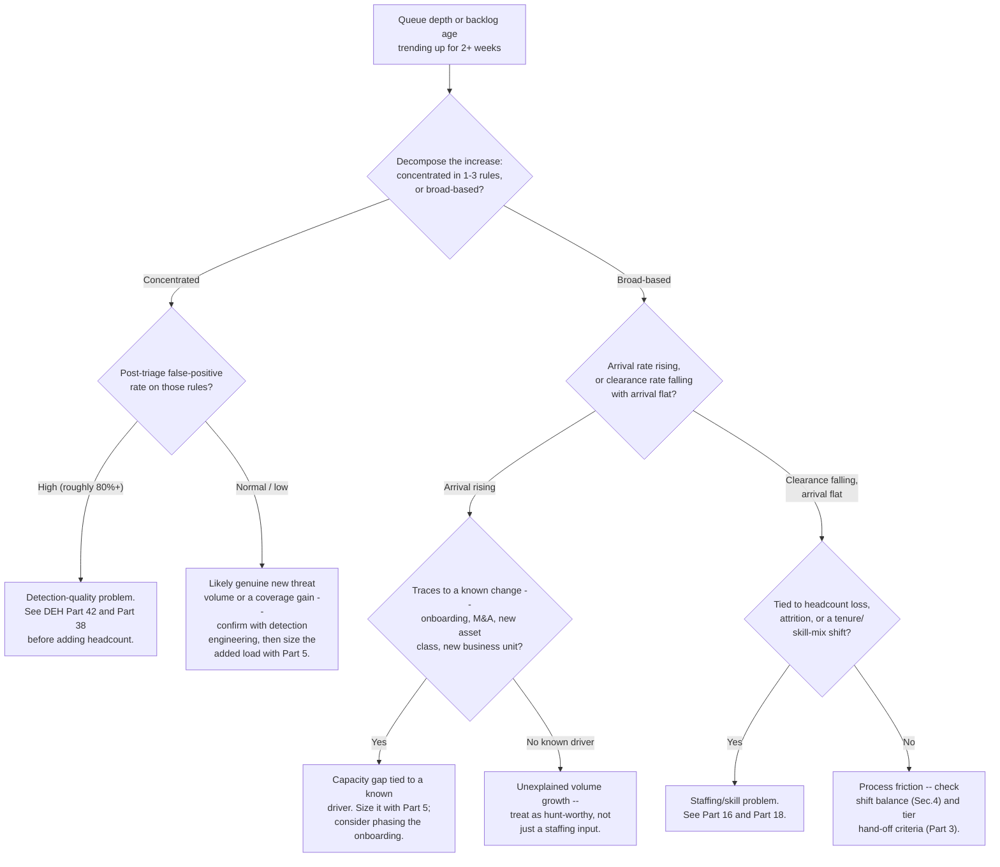

# Part 9 — Queue Health & Workload Management

## Why this part exists

**[CONCEPT]** A queue can hold 200 open tickets and be perfectly healthy. A queue can hold 15 and be in real trouble. Severity tells you how bad any single alert is if it turns out to be true; it says nothing about whether the team working the queue as a whole is keeping pace, falling behind gradually, or quietly drowning in tickets nobody has touched in two days. Those are two different questions, answered by two different instruments, and this part is about the second one only. SOC Playbook Handbook, Part 29 — Playbook Severity Model owns how any one alert gets scored; this part does not re-score alerts, and it does not touch severity logic at all. It measures the queue those alerts sit in — depth, age, arrival rate, clearance rate — as an operational health signal that can be dangerously wrong even when every individual severity score in the queue is correct.

**[CONCEPT]** The other question this part exists to answer is harder and more consequential: when a queue is visibly growing, is that a staffing problem or a detection-quality problem? Those two diagnoses point at completely different fixes — hire, or tune — and a manager who reaches for the wrong one either spends real budget on headcount that won't fix anything or leaves a genuinely understaffed team convinced that "better rules" will save them from a fix that only more people can deliver. Distinguishing the two is a workload-management judgment call this book owns; the technical mechanics of what "detection quality" actually measures — coverage, false-positive rate, detection debt — belong to Detection Engineering Handbook V2, Part 42 — Detection Quality, and this part cites that material rather than re-deriving it.

**[CONCEPT]** Three things this part deliberately does not do, each because another part or book already owns it and re-deriving it here would be exactly the kind of duplication this book's own production rules exist to prevent: it does not define handle time, MTTR, or false-positive rate — those definitions live in SOC Playbook Handbook, Part 32 — Metrics, and every number in this part's worked examples uses them as already-defined inputs. It does not do the headcount arithmetic that turns a capacity gap into a hiring plan — that model, including its honest failure modes, is Part 5 — Headcount & Capacity Modeling's job, and this part's diagnosis feeds that model rather than replacing it. And it does not resolve the cases where the right call is genuinely unclear — a persistent queue-health problem that could plausibly be either a staffing gap or a detection-debt problem, with a resourcing decision that has to be made before the ambiguity resolves itself, is exactly the judgment-call territory Part 25 — Risk Acceptance & Manager Decision-Making Under Uncertainty was built for, and this part hands off to it explicitly in §3.5.

## 1. Queue depth and backlog age are not severity

**[CONCEPT]** Two SOCs can report an identical severity mix — the same proportion of critical, high, medium, and low alerts — and be in entirely different operational condition, because severity mix says nothing about *when* those alerts get worked. A critical alert triaged within 12 minutes and a critical alert of identical content sitting untouched for 9 hours carry the same severity score and represent completely different risk exposure. Queue health is the measure of that second dimension: not what's in the queue, but how the queue as a whole is moving.

**[FRONTLINE MANAGER]** The mistake this produces in practice is a shift lead who checks the dashboard, sees "no criticals open," and reports the queue as healthy — while 40 medium and low-severity tickets sit unopened from the previous shift, aging past their SLA windows one at a time with nobody noticing because no single one of them is the highest-severity item in the queue at any given moment. A queue-health view has to answer "how is the backlog moving" as a question separate from "what's the worst thing currently open," because a dashboard sorted by severity will always show you the worst thing first and never show you the slow accumulation happening underneath it.

> **Operational Reality**
> A severity-sorted queue view trains analysts to work top-down by severity, which is correct for any single shift but actively hides backlog accumulation at the medium and low end — the oldest ticket in most under-strain SOCs is rarely the highest-severity one, because high-severity tickets get pulled first regardless of age, and low-severity tickets are exactly the ones left to accumulate. If your only queue view is severity-sorted, you will not see a health problem until it's already large enough to start generating SLA-breach complaints from whoever the SLA is owed to.

**[CONCEPT]** Queue health, then, needs its own metrics, tracked independently of severity, and reviewed on their own cadence rather than folded into a severity-first dashboard. The next section names the four that matter and what each one actually tells you that the others don't.

## 2. The four numbers that describe queue health

**[FRONTLINE MANAGER]** Four numbers, tracked together, describe queue health well enough to act on. Tracked separately, each one alone is misleading in a specific, predictable way.

### 2.1 Queue depth

**[FRONTLINE MANAGER]** Queue depth is the simplest number and the least useful one on its own: the count of open tickets right now. It's the number most dashboards lead with because it's the easiest to compute, and it's the number most likely to make a genuinely healthy queue look alarming or a genuinely unhealthy one look fine. A depth of 150 tickets is unremarkable for a large enterprise SOC processing thousands of daily events and alarming for a four-analyst team that normally sits at 20; the number means nothing without a baseline for that specific team, and it means nothing at all about *how long* those 150 tickets have been sitting there.

### 2.2 Backlog age and the aging distribution

**[FRONTLINE MANAGER]** Backlog age — how long the oldest open tickets have been open — is the number that actually predicts trouble, and the single number worth watching if a manager can only watch one. A queue with a depth of 60 and a p90 age of 20 minutes is a team keeping up with a busy day. A queue with a depth of 60 and a p90 age of 30 hours is a team that has lost control of the backlog, even though the depth number alone looks identical to the first case at a casual glance.

> **Manager's Note**
> If you can only watch one queue-health number on a Monday-morning check-in, watch the p90 backlog age, not the depth count. Ten tickets that are 2 minutes old is a non-event. Ten tickets that are 30 hours old is a slow-burning SLA breach sitting quietly in a queue that might report the exact same depth number either way. Depth tells you how much work is sitting there; age tells you whether anyone is actually getting to it.

**[FRONTLINE MANAGER]** The full aging distribution matters more than any single percentile, because a p50 (median) age can look fine while a p90 or p99 tells a much worse story about a specific subset of the backlog that's being systematically deprioritized — usually the lower-severity tickets that never win the top-down triage fight described in §1. Track age in buckets (under 1 hour, 1–4 hours, 4–12 hours, 12–24 hours, over 24 hours) rather than a single average, and watch the proportion of the backlog sitting in the two oldest buckets specifically. That proportion, not the average, is the number that should trigger a conversation.

### 2.3 Arrival rate and clearance rate

**[SENIOR MANAGER]** Arrival rate is how many alerts land in the queue per unit time; clearance rate is how many the team closes in that same window. Depth and age are both downstream consequences of the relationship between these two — a queue only grows when arrival rate exceeds clearance rate, and it only shrinks when the reverse is true. This relationship has a formal name — Little's Law, from queuing theory — and a manager doesn't need the underlying math to use the practical version of it: **average time an item spends in the queue is proportional to the number of items in the queue, divided by the rate at which items leave.** Practically, that means a growing p90 backlog age is never a mystery once you have arrival rate and clearance rate for the same window — it's arithmetic, not a diagnosis in itself. The diagnosis is *why* arrival rate rose or clearance rate fell, which is §3's job.

> **Operational Reality**
> Most queue dashboards report arrival rate and depth but not clearance rate, because clearance rate requires tracking closures over a matching time window rather than a single snapshot, and most ticketing systems make snapshot counts easier to pull than rate-over-time counts. The result is a dashboard that can tell you the queue is growing but can't tell you whether that's because more work is arriving or because less work is getting done — the two explanations require completely different fixes, and a dashboard that only shows depth leaves that distinction to guesswork.

## 3. Diagnosing a growing queue: staffing problem or detection-quality problem

**[SENIOR MANAGER]** A queue that's growing week over week has, in practice, one of a small number of root causes, and the fix for each is different enough that guessing wrong is expensive. The two most consequential to distinguish are a genuine capacity gap — the team needs more people or more hours, full stop — and a detection-quality problem, where a small number of noisy or badly tuned rules are generating volume that no amount of headcount will ever fully absorb, because the rules keep generating more of it. Hiring against a detection-quality problem adds headcount that spends its days triaging the same bad rule faster; tuning a rule that isn't the actual cause of a genuine capacity shortfall leaves the real gap exactly where it was.

### 3.1 Decompose the backlog before diagnosing anything

**[SENIOR MANAGER]** The fastest, cheapest diagnostic step — and the one skipped most often under time pressure — is decomposing backlog growth by its source: which specific detection rules, alert types, or upstream systems account for the increase, rather than treating the growth as one undifferentiated number. Pull the tickets that make up the increase (not the whole backlog — just the delta over the period the growth happened) and group them by rule ID or alert type. Two outcomes are possible, and they point in opposite directions.

**[SENIOR MANAGER]** If a small number of rules — often one to three — account for most of the increase, that's evidence pointing toward a detection-quality explanation, and the next question is that rule's post-triage false-positive rate, which Detection Engineering Handbook V2, Part 42 — Detection Quality treats as a first-class measurement rather than an afterthought. If the increase is broad-based across dozens of unrelated rules and sources with no single one dominating, a detection-quality explanation becomes much less likely — noisy rules concentrate; genuine new attack surface or business growth spreads out.

> **Blind Spot**
> A backlog decomposed by rule ID can still hide the real pattern if several rules are all reacting to the same upstream root cause — a misconfigured log source flooding duplicate events, a newly onboarded business unit whose normal activity trips five unrelated rules at once, or a single upstream API change that degrades enrichment quality across every rule that depends on it. "No single rule dominates" is not the same finding as "no single cause dominates," and a decomposition that stops at the rule level will misread a one-cause, many-symptom problem as broad-based organic growth every time.

### 3.2 The diagnostic decision tree

**[SENIOR MANAGER]** Figure 9.1 lays out the decision sequence: decompose first, then branch on concentration, then branch again on false-positive rate or on whether the broad-based growth traces to a known cause. It's a starting sequence, not a replacement for judgment on any case that sits near a branch boundary — §3.5 covers what to do when a case genuinely won't resolve cleanly to one branch.





**Figure 9.1 — Queue growth diagnostic decision tree.** *CONCEPTUAL.* `FIG-0901` renders the
decision sequence described in §3.1–§3.2 — decompose, branch on concentration, then branch on
false-positive rate or on whether broad-based growth traces to a known cause. It supports every
routing call made in §3.2's decision tree and the worked examples in §3.3–§3.5, none of which are
a capture of any single organization's actual triage workflow.

> **Cross-Book Pointer**
> This part does not define false-positive rate or explain how to reduce a noisy rule's trigger volume — that's a detection-engineering fix, not a staffing one. See Detection Engineering Handbook V2, Part 38 — False Positive Engineering for the tuning mechanics, and Part 42 — Detection Quality for how coverage and quality are measured well enough to tell "this rule is genuinely catching more real activity" apart from "this rule got noisier." Come back here once you know which one you're looking at — that's the fork this part's decision tree depends on.

### 3.3 Worked example — "we need more people"

**COMPOSITE CASE EXAMPLE — `CASE-0901`.** Constructed from recurring patterns seen across mid-market in-house SOCs during cloud-migration waves; no single organization is identifiable, and all figures below are illustrative.

**[SENIOR MANAGER]** A nine-analyst in-house SOC covering three 8-hour shifts (three analysts per shift) ran a steady-state queue depth around 40 open tickets for months, with a p90 backlog age under 3 hours. Over a 6-week window, the organization migrated roughly 40 new cloud workloads into production, and the queue changed shape: depth climbed to a sustained 165+ open tickets, and p90 backlog age rose from 3 hours to 26 hours. The medium-severity SLA target was 4 hours; the proportion of tickets breaching that SLA rose from about 4% to about 38% over the same window.

**[SENIOR MANAGER]** The manager's first instinct was to suspect a bad rule shipped alongside the migration. A decomposition (§3.1) ruled that out quickly: the increase was broad-based across more than 30 distinct rule IDs, with the single largest contributor accounting for only about 9% of the added volume — nowhere near the concentration §3.2's decision tree treats as a detection-quality signal. Average handle time per ticket stayed flat at roughly 14 minutes across the whole window, which also ruled out a skill or training explanation — if handle time had crept up instead, that would point at Part 16's territory (a coaching or competency gap), not this part's.

```text
CONCEPTUAL SAMPLE — illustrative numbers, not sourced benchmark data

Existing analyst capacity: 9 analysts x 3 shifts, ~6.5 productive hours/analyst/shift
                            after Part 5's shrinkage deductions (PTO, training, breaks)
                            = ~58.5 analyst-hours/day of baseline capacity

Baseline arrival rate:      ~250 alerts/day
Average handle time:        14 minutes (flat, before and after)
Baseline demand = 250 alerts/day x 14 min = 3,500 minutes/day = ~58.3 analyst-hours/day
                 -- essentially equal to the ~58.5-hour baseline capacity above, which is
                    what "steady-state, no slack" actually looks like as arithmetic

Post-migration arrival:     ~310 alerts/day (+24%)
Added daily analyst-minutes needed = 60 alerts/day x 14 min = 840 minutes/day
                                    = ~14 analyst-hours/day
                                    = a gap the baseline's ~58.5-hour capacity has no
                                      room to absorb without breaching age targets
```

**[SENIOR MANAGER]** Arrival rate rose 24% with handle time flat and no rule concentration — by Little's Law's practical version (§2.3), a queue under those conditions grows until either arrival rate drops or clearance capacity rises; nothing about the existing team's process was failing, it simply had no spare capacity to absorb a permanent 24% volume increase. The fix that actually worked combined two moves rather than one: two additional analysts were brought on (on a temp-to-perm basis to preserve flexibility if the migration's later phases turned out smaller than planned), adding roughly 13 analyst-hours/day — enough to close nearly all of the ~14-hour/day gap on its own — and the remaining onboarding tranches were renegotiated with the migration team to phase in over 2 months instead of 3 weeks, smoothing over the small residual and avoiding a sustained SLA breach. Backlog age returned to baseline within about 5 weeks of the headcount addition landing.

### 3.4 Worked example — "we need fewer, better rules"

**COMPOSITE CASE EXAMPLE — `CASE-0902`.** Constructed from recurring patterns seen when an upstream identity or network provider changes behavior underneath an existing detection; no single organization is identifiable, and all figures below are illustrative.

**[SENIOR MANAGER]** A different SOC saw the same surface symptom — queue depth and backlog age both climbing over roughly 3 weeks — and the manager's first instinct, reasonably, was to request two additional headcount to absorb the volume. A decomposition first: one rule, an anomalous-sign-in-location ("impossible travel") detection, accounted for 61% of the added ticket volume. A VPN provider used by a large fraction of the remote workforce had changed how it reported egress-IP geolocation, and the existing rule's travel-velocity threshold started tripping on ordinary remote logins that looked, to the rule, like physically impossible travel between sessions.

```text
CONCEPTUAL SAMPLE — illustrative numbers, not sourced benchmark data

Rule volume before the VPN provider's change:   ~40 alerts/day
Rule volume after the change:                   ~310 alerts/day
Average handle time for this specific rule:     3.5 minutes (fast; analysts learned
                                                 the pattern quickly)
Added daily analyst-load from this rule alone:  270 extra alerts/day x 3.5 min
                                                 = ~16 analyst-hours/day
Post-triage false-positive rate on this rule
  during the affected window:                   ~97%  (3% escalated for further review;
                                                 zero confirmed true positives among
                                                 those in the sampled period)
```

**[SENIOR MANAGER]** Sixteen analyst-hours a day of added load looks, from a pure capacity-math view, almost identical to a genuine staffing gap — it's close enough in magnitude to Example 1's ~14-hour/day gap that the capacity math alone can't tell the two problems apart. The decomposition step is what kept this from becoming a headcount request: concentration in one rule (61% of the increase) plus a 97% post-triage false-positive rate is squarely the detection-quality branch of Figure 9.1, not the capacity branch. The manager routed the finding to detection engineering instead of opening a requisition. A suppression rule scoped to the VPN provider's known egress-IP ranges, plus a retuned travel-velocity threshold, went in within 4 days; volume from that rule dropped back to roughly 35 alerts/day, and queue depth normalized without any headcount change.

**[SENIOR MANAGER]** The cost comparison is worth stating plainly, because it's the argument that actually moves a budget conversation: two additional analysts at a fully loaded cost of roughly $130,000 each run close to $260,000 a year in ongoing spend; the detection-engineering fix cost approximately two engineer-days, on the order of $1,500–$2,000 in loaded time. Neither number is a universal constant — treat both as this composite's illustrative figures, not a benchmark — but the ratio is the point: a queue-health problem that looks like a capacity gap on the surface can be two orders of magnitude cheaper to fix as a tuning problem, and the only way to know which one you're looking at is the decomposition step in §3.1, done before the headcount request goes anywhere.

### 3.5 When it's genuinely both

**[SENIOR MANAGER]** Some queues fail this decision tree cleanly — decompose the backlog and you find real concentration in a handful of noisy rules *and* a real underlying capacity gap once those rules are tuned down, because the team was already thin before the noise arrived. Fixing the rule buys headroom; it doesn't manufacture a ninth or tenth analyst out of nowhere if the team was already running at four when workload modeling says it needs six. Treat that combination as two separate findings with two separate fixes on two separate timelines — the tuning fix is fast and should happen regardless of the headcount decision, and the headcount decision should be made on the *post-tuning* volume, not the inflated volume the noisy rule was contributing. Making a hiring decision against pre-tuning numbers routinely results in adding headcount sized to solve a problem that a same-week detection fix was about to make disappear.

> **What Would Change My Mind**
> This section treats backlog concentration in a small number of rules, paired with a high post-triage false-positive rate, as reliable evidence that a queue-health problem is (at least partly) a detection-quality problem rather than a pure staffing gap. If teams applying this decomposition routinely found that concentrated, high-FP-rate rules turned out to be catching a real and growing volume of true positives once investigated properly — meaning the concentration reflected a genuine new threat pattern rather than noise — that would weaken the heuristic and argue for treating rule concentration as, at most, a prompt to investigate rather than a diagnosis in itself.

**[SENIOR MANAGER]** A resourcing decision made under this exact kind of ambiguity — tune first or hire first, when the honest answer is "we don't fully know yet and the queue is breaching SLA today" — is the book's central judgment-call territory. Part 25 — Risk Acceptance & Manager Decision-Making Under Uncertainty works through cases where that call was genuinely unclear at the time it had to be made; this part's job stops at getting the diagnosis as clear as the decomposition can make it, not at making the call when the decomposition itself doesn't fully resolve.

## 4. Workload balancing across shifts and tiers

**[FRONTLINE MANAGER]** Queue-health numbers describe the whole queue. They don't, by themselves, tell you whether the load sitting behind those numbers is distributed evenly across the team working it — and an unhealthy queue-health trend line is exactly as often caused by one shift or one tier quietly absorbing more than its share as by a genuine aggregate shortfall.

### 4.1 Balancing across shifts

**[FRONTLINE MANAGER]** Part 6 — Shift Pattern & Coverage Design owns the design of the shift pattern itself and the mechanics of what information has to transfer at a handoff. This part's concern is narrower and sits upstream of both: the live, day-to-day decision of how much open backlog is acceptable to carry across a shift boundary before the shift pattern itself needs to change, and whether one specific shift is systematically absorbing more volume or higher-difficulty tickets than the others without anyone noticing, because the aggregate 24-hour queue-health numbers average the imbalance away.

> **Blind Spot**
> A 24-hour aggregate backlog-age number can look perfectly healthy while hiding a night shift that is running 3 times over its fair share of the aging distribution and a day shift running comfortably under. Averaging across shifts is exactly the operation that erases this — three shifts each carrying a very different load can average out to a number that looks like "one team, evenly loaded," and a manager who only checks the 24-hour rollup will never see the night shift quietly drowning until someone on it burns out or quits, at which point Part 17 and Part 18's territory takes over from this part's.

**[FRONTLINE MANAGER]** The practical check is cheap and worth running weekly, not just after a complaint: pull backlog age and depth broken out by the shift the ticket was assigned to (or the shift active when it aged into the oldest bucket, if ownership transfers), not just the aggregate. A gap between shifts wide enough to matter — one shift's p90 age running double another's for more than a week or two — is a workload-balance problem worth acting on directly, independent of whether the aggregate number looks fine.

### 4.2 Balancing across tiers

**[FRONTLINE MANAGER]** Part 3 — Tiering Models: L1/L2/L3 and Beyond owns what each tier is responsible for and the criteria that govern when a ticket moves from one to the next; SOC Playbook Handbook, Part 27 — Escalation Quality owns whether any single hand-off across that boundary was done well. Neither of those answers this part's question: whether the *volume* of work sitting at each tier is balanced, independent of whether every individual escalation across the boundary met quality bar. A Tier 1 queue can be executing textbook-quality escalations, one at a time, while still running structurally over capacity because Tier 2 has more slack than Tier 1 does and nobody has adjusted the escalation criteria to route more of the ambiguous middle ground upward while the imbalance lasts.

**[SENIOR MANAGER]** The workable lever here is temporary, not structural: loosening escalation criteria for a bounded period so more borderline tickets route to a tier with spare capacity, or pulling a Tier 2 analyst down to help triage a Tier 1 backlog surge directly, reversed once the imbalance clears. Treat this as a pressure-release valve, not a standing policy — a "temporary" loosened escalation criterion that's never tightened back up quietly becomes the new tier boundary by default, and six months later nobody remembers it was supposed to be temporary or why the boundary moved.

## 5. Surge handling

**[SENIOR MANAGER]** A surge is a sharp, usually short-lived spike in arrival rate — a mass-phishing campaign, a widely reported vulnerability driving a scan-and-triage wave, a marketing-driven false-positive storm from a new external-facing campaign — as distinct from the structural, sustained growth Example 1 in §3.3 walked through. The distinction matters because the fix is different: a structural gap needs headcount or tuning that persists; a surge needs a response that can be stood up fast and stood back down just as fast, because paying for permanent capacity to cover a one-week spike is a standing cost against a temporary problem.

> **Cross-Book Pointer**
> This part covers surge handling for a routine volume spike with an identifiable, bounded cause — a phishing wave, a scan wave, a noisy campaign. It does not cover the manager's role during a live, declared major incident, where staffing surge decisions are made under a different kind of pressure and against a different decision authority. That's Part 28 — The Manager's Role in a Major Incident, which also covers executive communication cadence and retainer activation that this part's routine-surge toolkit has no reason to touch.

### 5.1 Recognizing a surge before committing to a response

**[SENIOR MANAGER]** The tell that distinguishes a surge from the start of a structural decline is the decomposition from §3.1, run early rather than after the fact: a surge is almost always concentrated (one campaign, one CVE, one external event) and almost always has an identifiable end condition (the campaign gets blocked at the gateway, the CVE gets patched fleet-wide, the news cycle moves on). A structural gap, by contrast, usually has no end condition at all — it just persists until someone changes headcount or tuning. Committing a surge-response tactic (temporary overtime, MSSP overflow) against what turns out to be a structural gap just delays the real fix at real cost; committing a structural fix (a permanent hire) against what turns out to be a 10-day surge leaves a fully loaded headcount cost with nothing to do once the surge ends.

### 5.2 A surge-response toolkit

**[SENIOR MANAGER]** The table below maps each standing option for covering a genuine short-term surge — not a structural gap — to how fast it can be stood up, what it costs relative to a permanent hire, and where it stops working; pick based on how long the spike is expected to last and how much lead time exists before it starts.

| Option | Lead Time | Relative Cost | Best For | Where It Breaks Down |
|---|---|---|---|---|
| Pull from an adjacent shift or tier | Hours | Low — existing headcount, no new spend | A spike lasting under a week, concentrated in hours when another shift has slack | Runs the lending shift/tier thin; unsustainable past 1-2 weeks without creating a second surge |
| Voluntary overtime | Hours to 1 day | Moderate — overtime premium on existing staff | A spike with a known, short end date (days to 2 weeks) | Fatigue risk climbs fast past 2 consecutive weeks; ties directly into Part 17's burnout territory |
| Temporary/contract surge staff | 1-2 weeks (sourcing + ramp) | Moderate-high — agency premium plus ramp-up drag on training a new person for a short engagement | A spike expected to last 3+ weeks, or a known recurring seasonal pattern | Ramp-up time can exceed the surge itself for anything under ~3 weeks; ineffective for a sudden, short spike |
| MSSP/vendor overflow burst capacity | Days, if a contract clause already exists; months, if not | High per-alert during burst, but zero standing cost between bursts | Organizations with an existing co-managed or hybrid model (Part 2) and a pre-negotiated burst clause (Part 22) | Useless without the contract clause already in place — negotiating one mid-surge is too slow to help this surge |
| Temporarily raise the triage/escalation bar | Immediate | Low direct cost, real risk cost | A true emergency spike where nothing else can be stood up fast enough | Defers real work rather than absorbing it; every ticket the raised bar defers still has to get worked eventually, usually as a backlog spike right after the surge "ends" |

> **Operational Reality**
> The MSSP overflow row only works for organizations that negotiated a burst-capacity clause before the surge started — a fact most managers discover the hard way, mid-surge, when they call the MSSP account team and learn the current contract has no mechanism for temporary volume above the committed baseline without a new statement of work that takes longer to execute than the surge itself will last. Part 22 — MSSP & Managed-Service Contract Management covers negotiating that clause in advance; this part can only tell you it needs to already exist.

**[SENIOR MANAGER]** The row most often reached for under real pressure — temporarily raising the triage or escalation bar — deserves one more sentence of caution, because it's the cheapest option on the table and the most tempting for exactly that reason: it doesn't absorb the surge's workload, it defers it. Every ticket that a raised bar pushes past without full triage is still sitting somewhere, aging, and it reappears as a backlog spike the moment the bar comes back down — which means this option should be reserved for the shortest, sharpest spikes, paired with an explicit plan for working through the deferred set once the surge itself clears, not treated as a general-purpose pressure release.

## 6. Building a queue-health scorecard your team actually watches

**[FRONTLINE MANAGER]** A queue-health program that lives only in an ad hoc "does this feel bad today" judgment call doesn't survive a shift-lead turnover, and a queue-health program that lives only in a dense dashboard nobody opens doesn't survive contact with a busy week either. The table below is a minimum viable scorecard, mapping four signals to a plain-language read on each and the next concrete step a bad reading should trigger — meant to be checked on a fixed cadence (daily for a shift lead, weekly for a SOC manager reviewing the trend) rather than only when someone already suspects a problem.

| Signal | Healthy Pattern | Warning Pattern | Next Step If Warning Persists 2+ Weeks |
|---|---|---|---|
| Queue depth | Stable around an established baseline for this team | Sustained rise with no return to baseline within days | Run the §3.1 decomposition before anything else |
| Backlog age (p90) | Well inside the tightest SLA target this team owns | Approaching or exceeding the SLA target for a growing share of tickets | Check age distribution by shift (§4.1) and by tier (§4.2) before assuming it's aggregate |
| Arrival rate vs. clearance rate | Roughly matched, week over week | Arrival consistently outpacing clearance | Decompose by source (§3.1); this is the pairing that should trigger the diagnostic tree in Figure 9.1 |
| Per-shift/per-tier age variance | Similar age distribution across shifts and tiers | One shift or tier's p90 running well above the others | Investigate workload balance (§4) before assuming an aggregate capacity gap |

> **Blind Spot**
> A scorecard checked weekly will still miss a fast surge that spikes and clears inside a 3-4 day window between check-ins — the kind of spike §5 covers. A weekly cadence catches structural drift; it is the wrong instrument for catching a sharp surge in time to respond to it while it's happening, which is why surge recognition (§5.1) has to run on a much shorter loop, closer to daily, than the structural scorecard here does.

## 7. Where this goes next

**[CONCEPT]** The diagnostic habit built in this part — decompose before diagnosing, and treat "more people" and "fewer, better rules" as genuinely different fixes rather than interchangeable responses to the same symptom — recurs through the rest of this book wherever a queue-health signal feeds into a bigger decision. Part 5 takes a confirmed capacity gap and turns it into a defensible headcount number. Part 16 picks up the case where a clearance-rate decline traces to an individual skill or coaching gap rather than a team-wide staffing shortfall. Part 25 picks up the cases where the diagnosis itself doesn't fully resolve and a resourcing decision has to be made anyway. And Detection Engineering Handbook V2, Part 38 and Part 42 pick up every case this part's decomposition routes toward a rule rather than a roster. Nothing past this point in the book should treat "the queue is growing" as a self-explanatory staffing request — it should ask which branch of Figure 9.1 it's actually looking at first.

---

## Cross-references

**Within this book:** Part 3 — Tiering Models: L1/L2/L3 and Beyond (tier definitions and hand-off criteria this part's §4.2 balances load across, without redefining); Part 5 — Headcount & Capacity Modeling (the model that turns a confirmed capacity gap into a defensible headcount number); Part 6 — Shift Pattern & Coverage Design (shift-pattern design and handoff-content mechanics this part's §4.1 assumes rather than re-derives); Part 16 — Performance Management & Coaching (when a clearance-rate decline is a skill or coaching gap rather than a staffing gap); Part 17 — Burnout, Fatigue & Wellbeing (the fatigue risk behind sustained overtime as a surge-response tactic, §5.2); Part 18 — Attrition & Retention (what an unbalanced shift left unaddressed eventually costs); Part 22 — MSSP & Managed-Service Contract Management (negotiating the burst-capacity clause §5.2's MSSP row depends on); Part 25 — Risk Acceptance & Manager Decision-Making Under Uncertainty (the resourcing call when §3.5's ambiguity doesn't resolve cleanly); Part 28 — The Manager's Role in a Major Incident (staffing surge under a live declared incident, distinct from this part's routine-surge toolkit).

**SOC Playbook Handbook:** Part 27 — Escalation Quality (the mechanics of a good single hand-off, distinct from this part's tier-level workload-balance question); Part 29 — Playbook Severity Model (per-alert severity scoring, distinct from this part's queue-level health signals per §1); Part 32 — Metrics (the definitions of handle time, MTTR, and false-positive rate used as inputs throughout this part's worked examples).

**Detection Engineering Handbook V2:** Part 38 — False Positive Engineering (the tuning mechanics behind every case this part's decomposition routes to a rule rather than a roster); Part 42 — Detection Quality (measuring coverage and quality well enough to tell a genuine new threat pattern apart from a noisy rule, the fork §3.1–§3.2's decision tree depends on).
