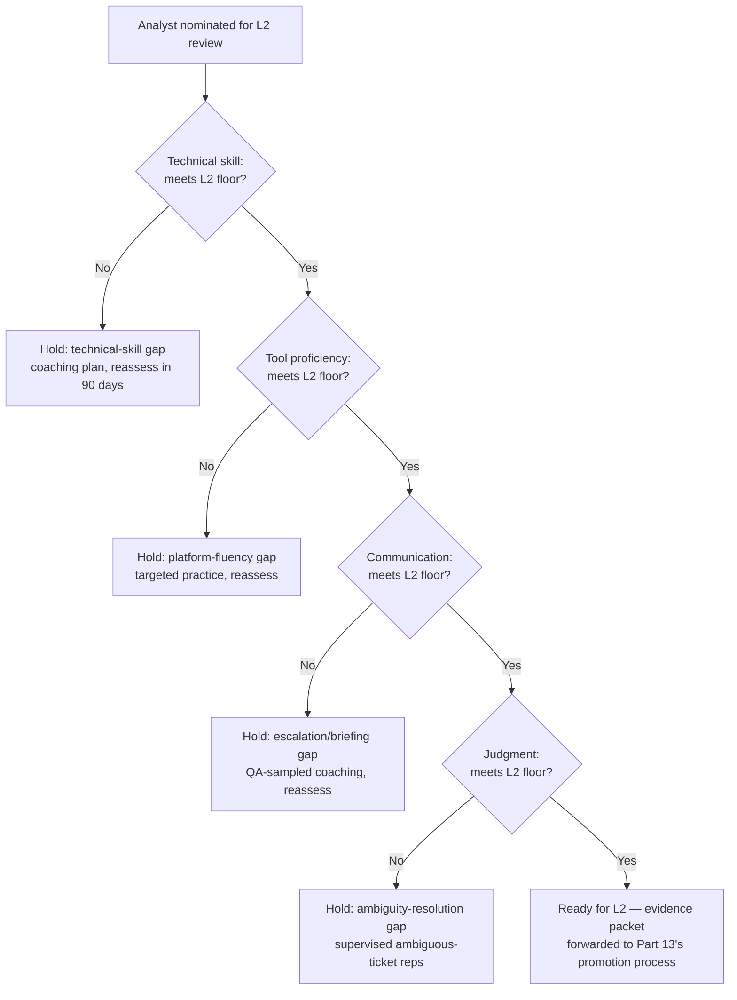

# Part 10 — Competency Models & Skills Matrices

## Why this part exists

**[CONCEPT]** Every SOC manager eventually sits in a room where a shift lead says an analyst is "ready for L2" and a second reviewer says he isn't, and neither can point to anything more specific than a feeling. That argument is a symptom of a missing artifact, not a personality conflict. This part builds that artifact: a tiered competency matrix scored across four axes — technical skill, tool proficiency, communication, and judgment — that turns "ready for L2" and "ready for promotion" from an opinion into a checkable claim, with named, observable behavior standing in for each cell instead of a number pulled from nowhere. The matrix's job is narrow and specific: define what a person can reliably do, at a given tier or in a given role, in terms two independent reviewers would score the same way after watching the same evidence.

**[CONCEPT]** That's a different question from whether someone is doing the job well right now. A competency matrix is a capability floor, assessed periodically and expected to move slowly; performance is this month's execution against that floor, and it can dip for reasons that have nothing to do with capability — a bad rule flooding the queue, a rough personal stretch, three consecutive short-staffed shifts. Part 16 — Performance Management & Coaching owns that ongoing measurement and the coaching conversation built on it. Conflating the two is the single most common failure mode this part exists to prevent: a manager who scores competency the way they'd score performance ends up gating promotion on this month's ticket count, and a manager who scores performance the way they'd score competency ends up treating a bad month as proof someone was never ready in the first place. Keep the two questions in separate documents, scored on separate cadences, or they collapse into each other.

**[CONCEPT]** This part does not design the exercises used to test for these behaviors — that's Interviewing & Technical Assessment Design (Part 8), which owns assessment methodology for candidates and can reuse this matrix's tier-one row as its target bar. It does not run the committee that decides who actually gets promoted — that's Career Ladders & Promotion Criteria (Part 13), which owns the ladder structure and the fairness mechanics of a promotion decision once the matrix has supplied the evidence. And it does not define what "good" looks like technically inside a detection rule or an escalation — those standards belong to Detection Engineering Handbook V2 and SOC Playbook Handbook respectively, cited by name below wherever the technical-skill and communication axes need them. What this part owns is narrower than all three: the observable standard itself, and the discipline of writing it down so it means the same thing to every reviewer who uses it.

## 1. Competency and performance are not the same measurement

**[CONCEPT]** A competency matrix answers "could this person do L2 work if handed an L2 queue tomorrow." A performance review answers "is this person doing good work on the queue they already have." The two correlate — competency is close to a precondition for good performance — but they diverge often enough that treating them as one measurement produces bad decisions in both directions.

**[SENIOR MANAGER]** Run the divergence forward: an analyst can be fully L2-competent and still post a mediocre quarter, because the queue she inherited that quarter was dominated by a badly tuned rule generating hundreds of near-duplicate low-value alerts a shift — a detection-quality problem, not a capability gap, and one Detection Engineering Handbook V2, Part 43 — Detection Debt names directly as a distinct failure mode from an analyst being under-skilled. Score her competency using that quarter's numbers and the matrix reports a false negative: it says she can't do the job, when the job she was handed that quarter was unusually hard to do well regardless of who held it. Run it the other direction: an analyst can post excellent numbers for six straight months on a queue that never once handed him an ambiguous severity call, a hostile stakeholder conversation, or a multi-source pivot with no playbook to follow — and still be unready for L2, because nothing in his actual work ever tested the judgment axis this part builds out in §3.4. His performance metrics look identical to a genuinely L2-ready analyst's, right up until the first week he's handed L2-shaped ambiguity and has no track record of resolving it.

**[SENIOR MANAGER]** The practical fix is structural, not just conceptual: score competency against a fixed, tier-defined standard on a slow cadence — at nomination for tier change, and roughly annually otherwise — using deliberately sampled evidence chosen to test each axis, not whatever tickets happened to land in the queue that month. Score performance against the same person's actual output on a fast cadence, monthly or per sprint, using the Quality Assurance Programs (Part 15) sampling methodology built for exactly that purpose. Keep them in separate documents. A promotion packet that cites "strong Q3 metrics" as its only evidence is really citing performance data to answer a competency question, and a reviewer who knows the difference should send it back.

**[SENIOR MANAGER]** The conflation runs in both directions in real promotion packets, not just in theory. A packet that leads with "closed 340 tickets this quarter, zero SLA breaches" is citing performance data to answer a competency question — it says nothing about whether any of those 340 tickets ever tested judgment under real ambiguity, because a quiet quarter with no hard calls produces the same clean numbers as a quarter spent skillfully resolving difficult ones. Ask what the evidence would look like if the quarter had been harder; if the honest answer is "the same, just with a lower ticket count," the packet hasn't demonstrated competency at all, only throughput.

## 2. Why "I'd know it if I saw it" fails as a standard

**[CONCEPT]** Every experienced SOC manager can, in fact, usually tell a genuinely L2-ready analyst from one who isn't, after watching them work for a few weeks. The problem isn't that this instinct is wrong often — it's that it's expensive, slow to transfer, and impossible to defend. It's expensive because it requires the one senior manager who has the instinct to personally observe every candidate; it doesn't scale past a handful of nominations a quarter. It's slow to transfer because a new team lead promoted into a review role has no way to inherit the instinct except by watching the senior manager make calls for a year and reverse-engineering the pattern. And it's impossible to defend, in the specific sense that matters most: when a passed-over analyst asks why, "you didn't seem ready to me" is not an answer HR, a promotion-committee peer, or the analyst himself can act on. He can't go build the specific thing he's missing if nobody can name it.

> **Management Autopsy — "promote on tenure once the tenure clock runs out"**
>
> **The decision (CASE-1001, COMPOSITE CASE EXAMPLE):** A mid-sized SOC — roughly 40 analysts across three shifts — sets its L1-to-L2 bar at 18 months of tenure with no active performance-improvement plan open, and nothing else. No matrix, no structured evidence review, no second reviewer. Tenure alone triggers the promotion packet.
>
> **Why it seemed reasonable:** It's transparent, it's cheap to administer, nobody can accuse the manager of favoritism, and 18 months roughly matches what candidates in the local market expect before a title and pay-band change. It also feels safe against a specific accusation — that promotion is subjective — by removing subjectivity entirely.
>
> **How it failed:** Over two years, 14 analysts crossed the 18-month mark and were promoted on schedule. Five of them — about a third — needed a shift lead to directly re-review their escalations for the next two to three months post-promotion, because they couldn't reliably resolve an ambiguous severity call alone; tenure had told the manager nothing about the judgment axis, only that time had passed. In the same window, two analysts who were demonstrably ready for L2-level ambiguity at 11 and 13 months stayed capped at L1 pay and title until the clock ran out — one of them left for a competitor offering an L2 title at 14 months, a resignation this book's Attrition & Retention (Part 18) would file under exactly the poaching pattern it tracks for mid-level analysts.
>
> **The fix:** Tenure becomes a floor, not a bar — nobody is nominated before six months, full stop, but crossing that floor triggers a matrix-based evidence review rather than an automatic promotion. The clock stops mattering once the matrix does the actual work.

**[SENIOR MANAGER]** The fix embedded in that autopsy generalizes: replace the instinct with a written standard specific enough that two different reviewers, looking at the same evidence, reach the same conclusion most of the time. That's the actual bar for "observable" as this part uses the word — not that the behavior is easy to see, but that it's specific enough for independent agreement.

**[HR/PEOPLE]** Tenure isn't the only proxy that quietly substitutes for observed behavior. A certification fails for the same underlying reason: it proves someone passed an exam, not that they apply the material against a live, ambiguous ticket under time pressure. Hiring & Sourcing Analysts (Part 7) already flags the sourcing-side version of this mistake — over-indexing on certifications during hiring screens out capable non-traditional candidates who never had employer-sponsored exam budget. The internal version is the mirror image: treating a certification earned mid-tenure as sufficient evidence for a tier change, without separately checking whether the analyst applies the certified material on shift. Accept a certification as one input on the technical-skill axis when it's genuinely relevant to the tier; never let it stand in for that axis's own observed-behavior evidence.

## 3. The four-axis framework: technical skill, tool proficiency, communication, judgment

**[CONCEPT]** Collapsing everything an analyst does into one competency score hides exactly the information a manager needs, for the same reason a single aggregate maturity score hides which part of a program is actually weak (a theme this book's Part 30 develops fully for organizational maturity). An analyst can be excellent on three axes and dangerously weak on the fourth, and a single blended number buries that. The four axes below aren't the only possible split, but they're the split that maps cleanly onto four genuinely different failure modes a manager needs to diagnose separately.

### 3.1 Technical skill

**[FRONTLINE MANAGER]** Technical skill is the ability to reason correctly about what's happening in the environment — recognizing a technique, forming a hypothesis, telling a true positive from a false one, designing or evaluating detection logic. It's the axis most managers default to measuring, because it's the easiest to test with a synthetic exercise, and the easiest to over-weight as a result.

> **Cross-Book Pointer**
> This part does not define what correct detection logic, a well-designed analytic, or a sound hunt hypothesis actually look like — that standard already exists, in detail, in Detection Engineering Handbook V2, Parts 3–29 (detection rule logic, telemetry, and query mechanics) and Parts 34–36 (threat hunting methodology). What this part owns is narrower: what evidence proves a specific analyst can reliably produce work that meets that already-defined standard, unsupervised, under time pressure. Come back here once you've confirmed what "good" means technically; this section is about proving someone can do it, not about what it is.

### 3.2 Tool proficiency

**[FRONTLINE MANAGER]** Tool proficiency is a distinct axis because it's possible to reason correctly about an attack and still be too slow or clumsy in the specific SIEM, EDR, or SOAR platform in front of you to act on that reasoning inside the SLA. An analyst who can describe exactly what query she'd want to run, but takes 20 minutes to actually build it because she doesn't know the platform's query syntax or field-mapping quirks, is not tool-proficient at the tier she's being evaluated for — regardless of how sound her underlying hypothesis was. This axis is also the one most sensitive to a platform migration: Tooling Procurement & Platform Strategy (Part 21) covers the retraining cost of a SIEM switch in budget terms, and this axis is where that retraining cost actually lands, person by person, on the matrix.

### 3.3 Communication

**[FRONTLINE MANAGER]** Communication is the ability to produce an escalation, a stakeholder briefing, or an incident update that the receiving party can act on without asking a clarifying question first. SOC Playbook Handbook, Part 27 — Escalation Quality already defines what a mechanically good hand-off contains — the fields, the framing, the specific information a Tier 2 analyst needs to pick up a case cold. This axis asks a different question: does this specific analyst reliably produce that, unprompted, across a real sample of their actual tickets, not just on the one escalation a team lead happened to review this week.

### 3.4 Judgment

**[FRONTLINE MANAGER]** Judgment is the axis most managers skip testing directly, because it's the hardest to observe in a clean exercise — and it's also, per the autopsy in §2, the axis most likely to be the real gap hiding behind a tenure-based or metrics-based promotion decision. It's the ability to correctly resolve ambiguity: applying SOC Playbook Handbook, Part 29 — Playbook Severity Model consistently when a case doesn't map cleanly onto the model's clearest examples, knowing which categories of ambiguity still require escalation regardless of tier (legal holds, suspected insider activity, anything touching an executive), and being able to explain the reasoning afterward in a way a reviewer could reconstruct and check.

> **Manager's Note**
> The fastest way to actually test judgment is to sit with an analyst on a real, already-closed ambiguous ticket and ask them to narrate their reasoning out loud, live, before you tell them how it was actually resolved. 10 minutes of real reasoning on a real case tells you more than a page of self-assessment ever will, because self-assessment measures how well someone can describe good judgment in the abstract, not whether they exercise it under the same uncertainty they'll face on shift.

## 4. Building the tiered matrix

**[SENIOR MANAGER]** Four axes only become a usable tool once they're anchored to specific tiers with specific, checkable behavior in each cell. The anchors below assume the L1/L2/L3 tiering structure from Tiering Models: L1/L2/L3 and Beyond (Part 3) already exists; this part doesn't redesign what each tier owns organizationally, only who's demonstrably capable of holding it.

### 4.1 The gate rule: a floor on every axis, not an average

**[SENIOR MANAGER]** The single most consequential design decision in a competency matrix is whether tiers gate on a floor per axis or an average across axes — and averaging is the wrong default almost every time. An analyst who scores exceptionally on technical skill and tool proficiency but is still weak on judgment is not "roughly L2 on average." He's an analyst who will make confident, fast, technically sound decisions on the wrong call, which is a more dangerous failure mode than an analyst who's slow and cautious across the board, because a fast wrong call does more damage before anyone catches it. Gate every tier transition on clearing the minimum bar on all four axes independently. A strong score on three axes does not buy down the fourth.

**Figure 10.1 — The four-axis "ready for L2" gate, evaluated independently.** *CONCEPTUAL.* Diagram ID `FIG-1001`. Illustrates the gate-per-axis logic described above: a nomination only proceeds to promotion once every axis clears the L2 floor on its own terms, and a failure on any single axis routes to a targeted hold rather than an averaged score.

### 4.2 A worked L1-to-L2 matrix

**[SENIOR MANAGER]** The table below is a worked example of the anchors themselves — the specific, observable behavior a manager checks for at each tier, and the evidence source that actually lets a reviewer check it rather than guess (CONCEPTUAL SAMPLE — illustrative anchors, calibrate against your own tier definitions before use). It supports a nomination decision the way Figure 10.1's gate logic consumes it: one row failing its L2 column is one axis on hold, regardless of how strong the other three rows look. Appendix A2's companion worksheet (per this book's index) carries a blank version of this same structure for direct use.

| Axis | L1 anchor | L2 anchor | L3 / track anchor | How a manager verifies it |
|---|---|---|---|---|
| Technical skill | Maps an alert to the correct playbook step unaided; explains why a match is or isn't a true positive | Forms and tests a hypothesis across multiple log sources with no playbook to follow; flags when a rule's signal-to-noise ratio has gone bad | Designs or validates a new analytic to the standard defined in Detection Engineering Handbook V2, Parts 3–29; owns tuning after deployment | QA-sampled ticket review (Part 15); shadowed rule-build or hunt session |
| Tool proficiency | Pulls the exact fields a documented playbook calls for, within SLA, unaided | Builds an ad hoc cross-tool query to test a hypothesis with no documentation, in a comparable time budget to L1's lookup | Writes and tests platform rule content; manages false-positive suppression logic; knows where the platform's own results can't be trusted | Timed practical exercise; live shift ride-along |
| Communication | Escalation notes meet the bar defined in SOC Playbook Handbook, Part 27 — Escalation Quality, with no rewrite needed | Briefs a stakeholder outside the SOC, live and unscripted, translating alert detail into a business-relevant ask | Communicates directly with an executive or incident commander during a major incident, with no manager relay | QA sample of written escalations; observed live stakeholder call |
| Judgment | Applies the severity model consistently on clear-cut cases; escalates genuinely ambiguous ones instead of guessing | Resolves ambiguous severity calls correctly; knows which categories (legal, insider-threat-adjacent, executive-touching) still require escalation regardless | Makes risk-acceptance-adjacent calls under real uncertainty and can defend the reasoning afterward | Live ambiguous-ticket reasoning walkthrough; calibration cross-check against a second reviewer |

## 5. Matrices fork by track, not just by tier

**[SENIOR MANAGER]** L1 to L2 is a linear tier transition, and the matrix above treats it that way. Career Ladders & Promotion Criteria (Part 13) covers what happens past that point — the ladder forks into senior analyst, detection engineer, threat hunter, and team-lead tracks, each of which needs its own version of these four axes rather than "more of the same L2 behavior, but better." This part's job is to flag that the fork exists and show where the axes actually diverge; Part 13 owns the ladder structure and the committee that decides who moves onto which track.

**[SENIOR MANAGER]** Take judgment as the clearest example of the divergence. On the detection-engineer track, an L3-level judgment anchor is about tradeoffs inside an analytic's design — accepting a specific false-positive rate in exchange for coverage against a technique the team has decided matters more, and being able to defend that tradeoff when it's questioned later. On the team-lead track, the L3-equivalent judgment anchor is almost the opposite skill: recognizing when to let another analyst make the call themselves, sit with being wrong, and learn from it, rather than stepping in to make the correct call faster. Both are real judgment. Neither substitutes for the other, and a matrix that scores them identically is measuring the wrong thing for at least one of the two tracks.

**[SENIOR MANAGER]** Tool proficiency forks just as sharply. A threat hunter's L3-equivalent tool-proficiency anchor is fluency moving across raw, unstructured data with no prebuilt dashboard — building a one-off pivot against weeks of raw process-creation telemetry to test a hypothesis nobody has asked the SIEM to pre-aggregate before. A detection engineer's L3-equivalent anchor looks more like platform administration: managing rule-content version control, understanding how a specific backend's query planner behaves under load, knowing which fields silently drop out of a join when a schema changes upstream. Both are advanced tool proficiency. Neither prepares someone for the other track's daily tool use, and a manager who promotes a strong hunter directly into a detection-engineering role on the assumption that tool skill transfers is making the same category error as promoting on tenure alone — trading one unverified proxy for another.

> **Manager's Note**
> Don't build the team-lead matrix by copying the senior-analyst matrix and bolting a coaching row onto the bottom. Coaching, delegation, and running a hard conversation without personally taking over are skills a strong analyst has frequently never had reason to practice — nothing in being technically excellent teaches you to watch someone else work through a problem slower than you would and resist fixing it for them. Test for the track's actual skill directly, with its own exercise, instead of assuming it comes bundled with technical seniority.

## 6. Assessing against the matrix without turning it into a review

**[HR/PEOPLE]** A matrix is only as good as the evidence behind each cell, and the fastest way to wreck that evidence is to let the assessment collapse into an informal performance review — a single manager's overall impression, stamped onto four boxes after the fact to make the impression look structured. Assess each axis against its own dedicated evidence: a QA sample pulled the same way Part 15's calibration methodology pulls one, a timed practical exercise, a live-observed stakeholder call, a walked-through ambiguous ticket. Evidence collected specifically to test one axis is worth more than an impression retrofitted across four.

**[HR/PEOPLE]** Capacity is the practical constraint that breaks this fastest. A team lead assessing more than about eight analysts against a four-axis matrix inside a single nomination cycle runs out of time to gather enough real evidence per analyst per axis — not because the axes get harder, but because there simply aren't enough observed shifts, sampled tickets, and live walkthroughs to go around. Past that point, the assessment quietly reverts to impression, even with the matrix's structure sitting on top of it. Split the cycle, add a second rater, or extend the assessment window before that ratio gets away from the team lead running it.

**[HR/PEOPLE]** Run the first competency calibration session on an analyst everyone already agrees is solidly L2, not on a disputed nomination. It surfaces the same problem Part 15's QA calibration surfaces on an easy ticket: reviewers who think they share a definition of "meets the judgment floor" usually don't, and it's far cheaper to find that gap on a case with no stakes than in the middle of a contested promotion decision. Once two reviewers converge on the easy case — scoring the same four axes the same way, independently, before comparing notes — move to a genuinely marginal case and check whether the convergence holds. If it doesn't, the anchors themselves are still too vague, and the fix is rewriting the cell's language, not retraining the reviewers.

**Worked example (CASE-1002, COMPOSITE CASE EXAMPLE).** A 16-analyst SOC runs its first formal matrix-gated nomination cycle. Nine analysts are nominated for L2. Structured evidence — QA samples, a timed practical exercise, and a live ambiguous-ticket walkthrough per analyst — shows six clearing all four axes cleanly. The remaining three clear technical skill, tool proficiency, and communication, but all three fail the same axis: judgment, specifically the category of ambiguous severity calls that don't require escalation but that all three had been escalating anyway rather than resolving. None of the three is held indefinitely — each gets a targeted coaching plan built around supervised reps on exactly that ticket category, and the SOC's own tracking shows an average of 10 weeks before all three clear the judgment floor on a follow-up review. The pay-band step from L1 to L2 in this SOC runs $6,500 a year (CONCEPTUAL SAMPLE); holding three analysts back 10 weeks rather than promoting them on the strength of the other three axes costs the SOC nothing but patience, and avoids handing three analysts L2-level authority over calls they'd demonstrably been routing around rather than making.

> **People Risk Trap**
> Once a matrix exists, the easiest way to quietly destroy it is grade inflation: a reviewer who finds every axis "meets bar" on every nomination to avoid an uncomfortable conversation, or to keep pace with a peer team lead who's rating generously. A matrix where every score is high stops distinguishing anyone, which means it stops doing the one thing it exists to do. The fix is the same one Part 15 uses for QA scoring: calibration sessions where two or more reviewers independently score the same evidence before comparing notes, run often enough that drift gets caught within a cycle, not discovered a year later when someone finally asks why every nomination in one team lead's queue has passed.

## 7. Feeding hiring bars and promotion criteria

**[SENIOR MANAGER]** The matrix's value compounds once other decisions actually consume it instead of running on a separately invented standard. Interviewing & Technical Assessment Design (Part 8) should target this matrix's L1 row directly: the log-triage exercise or mock escalation that part builds is only as good as the target behavior it's testing for, and that target behavior is exactly what §4.2's L1 column already specifies. Without a shared matrix, a hiring bar and an internal promotion bar drift apart silently — a hiring manager who was burned by one bad hire tightens the interview bar informally over time, while the internal L1-to-L2 bar for existing analysts stays wherever it was set originally, and eventually an external candidate is being held to a materially higher standard than an internal analyst moving into the identical seat. That's not a hypothetical inconsistency; it's the kind of thing a rejected external candidate's LinkedIn post makes very visible very fast.

**[SENIOR MANAGER]** Hiring & Sourcing Analysts (Part 7) is the other direct consumer worth naming specifically: the leveled job descriptions that part builds — the actual document a candidate reads before applying — should describe this matrix's L1 row in plain language, not a separately invented list of buzzwords assembled from a template. A job description that promises a "fast-paced, dynamic environment" and lists a certification wishlist, while the real L1 bar is "maps an alert to the correct playbook step unaided," sets a false expectation in both directions: candidates self-select against a job that isn't what's described, and the ones who do get hired discover the real bar only after starting. Write the job description from the matrix, not around it.

**[SENIOR MANAGER]** Career Ladders & Promotion Criteria (Part 13) consumes the matrix the other direction: it owns the promotion committee's process, its consistency mechanics across cases, and the ladder structure itself, but the committee needs something concrete to look at, and "the matrix says all four axes cleared, evidence attached" is a categorically better packet than "the manager recommends her." A promotion committee that reviews matrix evidence is reviewing a claim it can actually audit. A committee that reviews a manager's narrative recommendation is reviewing the manager's judgment about the candidate, one layer removed from the candidate's actual demonstrated behavior — which reintroduces exactly the "I'd know it if I saw it" problem this part opened with, just relocated to the committee table instead of the shift lead's desk.

**[SENIOR MANAGER]** One more consumer worth naming without expanding on here: AI, Automation, and the Future Shape of the SOC (Part 32) revisits this matrix later in the book to ask what happens to the technical-skill and tool-proficiency axes once AI copilots absorb a meaningful share of Tier 1 triage work. That's a real question this part deliberately leaves untouched — the matrix built here assumes today's tier definitions from Part 3, and Part 32's job is to say how those definitions, and the axes anchored to them, need to move as the work itself changes.

## 8. Where competency models fail

**[SENIOR MANAGER]** A matrix built once and never revisited drifts out of date the moment a tool changes, a new attack technique becomes routine enough to expect everyone to recognize it, or a tier's actual scope shifts under Part 3's own tiering decisions. Treat the anchors as a living document reviewed on the same cadence the headcount model in Part 5 gets reviewed, not something defended once at rollout and then left alone for three years while the environment it describes keeps changing underneath it.

**[SENIOR MANAGER]** A matrix also can't see a skill nobody has ever asked an analyst to demonstrate. A hunter who's never once briefed an executive isn't failing the communication axis at L3 — she's unmeasured on it, which is a different fact than "not ready," and a reviewer who conflates the two ends up blocking a genuinely qualified candidate over a gap in the evidence rather than a gap in the person. Before scoring an axis "not met," check whether the real finding is "never tested" and fix the evidence gap before treating it as a competency gap.

> **Management Autopsy — "build the matrix, then never touch it again"**
>
> **The decision:** A SOC builds a careful four-axis matrix during a headcount-planning push, uses it for one nomination cycle, and then leaves it untouched for two years while the platform migrates from one SIEM to another and the threat model shifts toward cloud-native attack paths the original technical-skill anchors never mention.
>
> **Why it seemed reasonable:** Building the matrix took real effort — workshops, calibration, buy-in from three shift leads — and once it shipped, it felt finished, the way a policy document feels finished once it's approved.
>
> **How it failed:** 18 months in, the technical-skill L2 anchor still describes fluency in the retired SIEM's query syntax, and two analysts who are demonstrably strong in the new platform score as "not yet met" against an anchor testing a skill nobody needs anymore, while an analyst who never adapted past the old platform still scores well against a standard that's now describing the wrong job.
>
> **The fix:** Assign the matrix an owner and a review trigger tied to real events — a platform migration, a tiering change from Part 3, a new specialty track from Part 13 — rather than a calendar date alone, so the artifact updates when the job changes instead of drifting quietly behind it.

**[SENIOR MANAGER]** Neither failure mode is a reason to skip building the matrix — both are cheaper to fix than the tenure-based and instinct-based alternatives from §2 and §4, because both point to a specific, correctable gap in the artifact rather than an unfixable gap in the manager's judgment. That's the whole case for building one in the first place: a wrong anchor can be corrected in a review cycle; an unwritten standard can't be corrected at all, because there's nothing on paper to point at and fix.

## Cross-references

This part assumes the tiering vocabulary from Part 3 — Tiering Models: L1/L2/L3 and Beyond. It feeds Part 8 — Interviewing & Technical Assessment Design and Part 13 — Career Ladders & Promotion Criteria, and hands off to Part 16 — Performance Management & Coaching, Part 15 — Quality Assurance Programs, and Part 32 — AI, Automation, and the Future Shape of the SOC for the questions this part deliberately leaves open. Outside this book, it cites SOC Playbook Handbook, Part 27 — Escalation Quality and Part 29 — Playbook Severity Model for the communication and judgment axes' technical standards, and Detection Engineering Handbook V2, Parts 3–29 and Parts 34–36 for the technical-skill axis's standard of "good," without re-deriving either.
