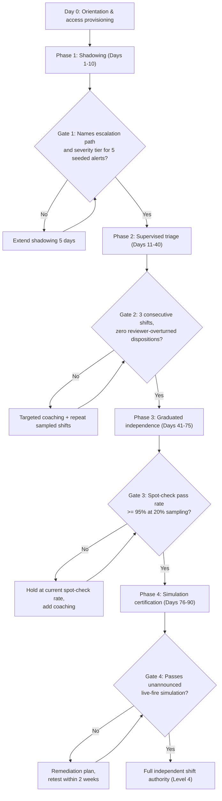

# Part 11 — Onboarding & Ramp-Up Programs

## Why this part exists

**[CONCEPT]** A new analyst's first 90 days decide more about whether they're still on the team at month 18 than almost anything that happens afterward. A rushed ramp produces an analyst who never fully trusts their own judgment, who escalates everything or nothing because nobody ever drew the line clearly, and who either burns out chasing a standard nobody explained or gets quietly managed out for missing a bar they were never actually taught. This part owns the structure and pacing of that first-90-days program: how shadowing, supervised triage, graduated independence, and simulation-based certification sequence against each other, how much autonomy an analyst earns at each stage, who signs off on moving to the next one, and what a manager measures to know the program is actually working rather than merely running on a calendar.

It does not own the technical material a ramp program runs an analyst through. The scenarios used inside a certification exercise — a seeded alert, an injected log sample, a scripted attacker behavior — are pulled by reference from Detection Engineering Handbook V2, Part 37 — Detection Testing and SOC Playbook Handbook's Playbook Library and Part 34 — Playbook Testing, not re-authored here. It also does not own what "ready for L2" means in observable, testable terms — that's Part 10's competency matrix, consumed here as the criteria this program's gates check against — or the standing mentorship program a graduated analyst enters next, which belongs to Part 14. And it is not the ongoing-training budget and certification-strategy question, which is Part 12's: this part ends the day an analyst reaches full independent shift authority, whatever comes after that is continuing development, not ramp-up.

## 1. What a ramp-up program is for, and what it costs to skip

**[CONCEPT]** A ramp-up program is a sequence of expanding permissions with checkpoints attached, not a training curriculum. The distinction matters: a curriculum measures exposure — did the analyst sit through the material — while a ramp program measures earned autonomy — has this specific person, doing this specific work, demonstrated enough judgment to be trusted with the next increment of it. A new hire can complete every training module in a learning-management system and still not be ready to disposition a privileged-account-login alert alone at 2 a.m. with no one to ask. The four phases in this part exist because "trained" and "ready" are different claims, and only the second one should open the door to the next stage.

**[SENIOR MANAGER]** The reason this needs to be a manager-owned program rather than an informal "shadow someone for a couple weeks" habit is cost. Every day a new analyst isn't independently productive is a day Part 5's headcount model is quietly wrong if it counted that analyst as a full FTE from the start date. The gap doesn't disappear — it shows up as a mentor's own queue growing, or the rest of the shift absorbing the slack.

CONCEPTUAL SAMPLE — illustrative numbers, not sourced benchmark data:

```text
New L1 analyst, fully loaded salary: $62,000/year (~$5,167/month)
Ramp duration: 90 days
Average productivity during ramp, blended across all 4 phases: ~30% of a
fully ramped analyst's independent throughput

Senior-analyst mentor time diverted:
  Weeks 1-6 (Phases 1-2):  ~5 hrs/week
  Weeks 7-11 (Phase 3):    ~2 hrs/week
  Mentor's fully loaded rate: $68,000/year (~$32.70/hour)

Mentor-hour cost:      (5 hrs x 6 weeks) + (2 hrs x 5 weeks) = 40 hours
                       40 hours x $32.70/hour = $1,308

Unrealized-output cost: 3 months x $5,167/month x (1 - 0.30) = $10,850
  (salary paid against output the team doesn't get back at full rate yet)

Total visible cost of one ramp cycle: roughly $12,150
```

None of this is an argument against hiring — it's the number a headcount plan needs to hold honestly instead of assuming a new hire is a full FTE from day one. A team hiring three analysts in the same quarter is temporarily absorbing something on the order of $36,000 in ramp cost and 120 mentor-hours pulled from senior analysts' own queues — exactly the kind of surge Part 6's shift-design options need to staff around in advance, not discover halfway through the quarter. The limitation of the number above: it counts mentor-hours and unrealized output, not the harder-to-price cost of a mentor's own queue backing up while they're diverted, which is a Part 9 queue-health problem this model doesn't capture.

**[SENIOR MANAGER]** The reason this cost usually stays invisible is that it never gets its own line anywhere — it's buried inside the new hire's salary line (already budgeted) and the mentor's existing headcount (already budgeted), so nothing in a standard budget review flags that the mentor is running at roughly 90% of normal queue capacity for 11 weeks. Part 20 covers building the SOC budget in full; the specific ask this part makes of that process is a visible, named ramp-cost line for every planned hire, sized against the model above, rather than an assumption that ramp-up happens inside existing capacity for free.

> **Operational Reality**
> A headcount plan that lists a new hire as one FTE starting day one is already wrong by the ratio in the example above — that analyst is worth something closer to 0.3 of an FTE for the first three months, and the 0.7 gap doesn't vanish, it shows up as a mentor's queue growing and the rest of the shift absorbing the difference. Budget the ramp cost against the hiring decision itself, not against a vague assumption that onboarding is a wash.

## 2. The four-phase structure

**[SENIOR MANAGER]** The program has four phases, and the sequencing is itself the design decision a manager owns: shadowing (observe, no independent action), supervised triage (act, but nothing ships without review), graduated independence (act independently, spot-checked at a declining rate), and simulation certification (a graduation exam under realistic, unannounced conditions). Skipping a phase or shortening it under backlog pressure is the single most common way this program breaks, covered as its own failure mode in §5 and §8 below.

**[FRONTLINE MANAGER]** Table 11.1 sets illustrative day counts against a 90-day program; adjust the total and the split between phases to your own queue's alert mix and complexity, but keep the sequence and the gate logic intact. A phase with no exit criterion isn't a phase — it's a calendar entry, and calendar entries don't catch a bad disposition before it ships.

Table 11.1 (CONCEPTUAL SAMPLE) maps each phase to the decision a manager makes at its gate: advance, hold, or remediate.

| Phase | Typical Duration | Supervision Model | Exit Criteria | Sign-off Authority |
|---|---|---|---|---|
| 1. Shadowing | Days 1–10 | Paired observation only; no independent actions on live tickets | Correctly names the escalation path and severity tier for 5 seeded historical alerts | Buddy + team lead |
| 2. Supervised triage | Days 11–40 | Analyst drafts a disposition; reviewer approves before it ships | 3 consecutive shifts with zero reviewer-overturned dispositions | Team lead |
| 3. Graduated independence | Days 41–75 | Independent dispositions, spot-checked at a declining rate (100% → 50% → 20%) | Spot-check pass rate at or above 95% at 20% sampling, sustained for 2 consecutive weeks | Team lead + QA reviewer |
| 4. Simulation certification | Days 76–90 | One unannounced live-fire simulation under normal shift conditions | Passes the certification simulation with no unresolved critical gaps | SOC manager |

The flowchart below draws Table 11.1's gate logic as a decision path, including the remediation loop at each gate — useful when explaining to a new analyst, or a skeptical HR partner, that failing a gate once is a loop back, not a dead end.

**Figure 11.1 — The four-phase ramp-up gate flow, with remediation loops.** *CONCEPTUAL.* Diagram ID `FIG-1101`. Illustrates Table 11.1's phase sequence and gate logic as a decision path, including the remediation loop that fires at each gate when an analyst doesn't clear it on the first attempt. It is a structural diagram of the program's own design, not a capture of any specific cohort's real ramp record.





**Figure 11.1 — The four-phase ramp-up gate flow, with remediation loops.** *CONCEPTUAL.* Illustrates Table 11.1's phase sequence and gate logic as a decision path, including the remediation loop that fires at each gate when an analyst doesn't clear it on the first attempt. It supports the claim, made throughout §2–§6, that "graduated independence" is a loop with a remediation path built in, not a one-way progression a manager either grants or withholds once. Diagram ID `FIG-1101`.

The diagram shows the sequence and the remediation loops; it doesn't show who specifically staffs each review — that's Table 11.1's sign-off-authority column and §7's competency-matrix tie-in.

> **What Would Change My Mind**
> This part uses 90 days and the four-phase split in Table 11.1 as a default frame, calibrated to a generic mid-complexity SOC's alert mix. If a team running genuinely simple, low-variety alert traffic — a narrow tool stack, a small handful of alert types — could reliably certify analysts at Level 4 in under 60 days with spot-check pass rates still holding at the same 95% bar, that would show this part's default duration is calibrated to the alert-mix complexity most SOCs have, not a fixed property of how long judgment takes to build. The guidance should then shift from a default day count to one keyed explicitly to alert-type variety.

## 3. Phase 1 — shadowing

**[FRONTLINE MANAGER]** Shadowing means the new analyst sits with a working analyst on a live queue, watches real tickets at real volume, and narrates back what they'd do at each decision point before being told the actual answer — not a scripted walkthrough of a handful of cherry-picked examples. Ten days is usually enough to see most of a shift's alert mix at least once; a shift that only handles 3 alert types in that window needs the schedule adjusted so shadowing spans more than one shift pattern (Part 6 covers the coverage options), not an extended shadowing phase that still misses the same gap.

The exit gate in Table 11.1 tests recognition and escalation-path naming against 5 seeded historical alerts pulled from the real queue — not judgment under live pressure, which is Phase 2's job. A new hire who can correctly say where a privileged-account-login alert routes, and why, has learned the map. Whether they can draw sound conclusions from it themselves comes next.

### 3.1 The shadow log

**[FRONTLINE MANAGER]** Shadowing produces almost nothing to check against unless the new hire keeps a record while doing it. A shadow log is a running list — one line per alert observed, noting the alert type, the disposition reached, and the one thing the new hire would have done differently if they'd been alone — kept in whatever tool the team already uses for notes, not a system built specifically for this. By day 10, the log itself is evidence for the exit gate: a log with 40 or 50 entries spanning most of the queue's alert types means the 5 seeded historical alerts in Table 11.1's exit criteria are confirming something the log already suggests. A log with 8 entries clustered on two alert types means the seeded-alert test is about to fail, and the team lead already knows why before running it.

The log's other job is surfacing this section's People Risk Trap before day 10 rather than after it. A team lead who spot-checks the log at the end of day 3 catches a stalled shadowing week — one where the new hire is watching a screen with no narration — while there's still a week left to fix it, instead of finding out on day 10 that the exit gate is failing for a reason that had nothing to do with the new hire's aptitude.

> **People Risk Trap**
> Assigning the new hire to whichever senior analyst has the most tenure, with no regard for that analyst's current workload, routinely produces a shadowing week where the pairer just keeps triaging at full speed and the new hire watches a screen for six hours a day with no narration. The fix: rotate shadowing across two or three analysts who have headroom that particular week, and give the pairer explicit, counted time in their own workload plan for it — not an unstated expectation that mentoring happens for free on top of a full queue.

## 4. Phase 2 — supervised triage and the trust ladder

**[FRONTLINE MANAGER]** Supervised triage is the phase where the new analyst does the actual work — pulls the alert, gathers context, drafts a disposition and, where warranted, an escalation write-up — and a reviewer reads it before anything ships. The reviewer isn't rewriting the analyst's work; they're catching it before it goes out wrong, then explaining why, in that order. A reviewer who silently fixes and ships the draft without feedback teaches nothing, and produces an analyst who reaches Phase 3 no better calibrated than they were on day 11. The standard a reviewer holds a draft escalation against is the one already defined in SOC Playbook Handbook, Part 27 — Escalation Quality for the mechanics of a good hand-off; this phase doesn't invent a separate, softer ramp-specific bar, it applies the real one earlier, with a safety net underneath it.

**[FRONTLINE MANAGER]** The reviewer's actual skill in this phase is asking before telling. Faced with a draft disposition that missed a lateral-movement indicator, a reviewer who says "you need to check for follow-on authentication on the same host" fixes this one ticket and teaches nothing repeatable. A reviewer who asks "what would you expect to see next if this account really was compromised, and did you check for it" forces the analyst to build the same reasoning path they'll need alone in Phase 3. This runs slower per ticket during Phase 2, sometimes markedly slower, and that's the phase's whole point — if it moved at Phase 3 speed, it wouldn't be Phase 2.

CONCEPTUAL SAMPLE — illustrative feedback exchange, not a transcript of a real review:

```text
Analyst's draft disposition: "Benign -- single failed-then-successful login,
user likely mistyped a password."

Reviewer, asking rather than telling: "What's the time gap between the
failure and the success, and does it match how long it takes a person to
retype a password by hand?"

Analyst, checking: "...four seconds. That's fast for a retype."

Reviewer: "So what does that change about the disposition, and what would
you check next before shipping it?"
```

The reviewer never states the answer outright — that credential-stuffing tooling retries near-instantly, while a human doesn't. The analyst reaches it by being asked the right question, which is the version of this finding that survives into Phase 3, when no one is there to ask it for them.

### 4.1 The trust ladder

**[SENIOR MANAGER]** The trust ladder is the axis Phases 2 and 3 actually move along — not a calendar date, but a specific, checkable expansion of what the analyst is allowed to do without someone else looking first. A manager should be able to state, for any analyst on the team, which level they're currently at and why, not just how many weeks they've been employed.

Table 11.2 (CONCEPTUAL SAMPLE) gives the five levels a manager uses to decide how much unsupervised action an analyst has earned.

| Level | Autonomy Scope | Review / Spot-Check Rate | Typical Phase |
|---|---|---|---|
| 0 | Observation only; no actions on live tickets | 100% (nothing ships without the pairer) | Shadowing |
| 1 | Drafts a full disposition; reviewer approves before it ships | 100% (every disposition reviewed pre-ship) | Supervised triage |
| 2 | Independent on low-severity, well-covered alert types only | 50% of dispositions spot-checked after the fact | Early graduated independence |
| 3 | Independent on all severities except a formally declared incident | 20% of dispositions spot-checked after the fact | Late graduated independence |
| 4 | Full independent shift authority, including escalation and incident participation | Standard QA sampling rate, not a ramp-specific rate | Post-certification |

Level 4's review rate is whatever Part 15's quality-assurance program samples for every analyst on the team. This program's job ends at getting someone onto that standard rate — it does not maintain a permanent higher-scrutiny lane for anyone just because they were once a new hire.

> **Field Test**
> **Setup:** Phase 2 is documented as requiring 3 consecutive shifts with zero reviewer-overturned dispositions before an analyst advances to Level 2.
> **Action:** Pull the last five ramp analysts' Phase 2 records and check how many of them actually had a reviewer overturn at least one disposition somewhere in their Phase 2 history, versus how many gates were signed off with no overturned disposition ever logged for that analyst.
> **Expected result:** Some overturns should show up somewhere in most analysts' Phase 2 history — a reviewer catching a real mistake before it ships is the entire point of the phase. A pattern of zero overturns across every analyst's complete Phase 2 record means reviews are being rubber-stamped rather than performed, and the gate is protecting nothing.

> **Blind Spot**
> This program tracks the analyst being ramped; it has no built-in visibility into whether the reviewer assigned to give feedback is any good at giving it. Two analysts hired in the same quarter, run through an identical Table 11.1, can graduate at meaningfully different competence levels solely because one reviewer explains reasoning out loud and the other just approves or rejects drafts silently. Rotate Phase 2 reviewers across more than one analyst per cohort where staffing allows, and add "explains reasoning, doesn't just correct" as its own line in whatever review Part 16 runs on senior analysts who take on this role.

## 5. Phase 3 — graduated independence

**[FRONTLINE MANAGER]** Graduated independence is where the trust ladder actually moves: Level 2 to Level 3 to Level 4, each step earned by a sustained spot-check pass rate rather than a single good week. A weekly check-in against the current sampling rate — not a monthly one — catches a slipping analyst while the fix is still a coaching conversation instead of a pattern that needs a formal performance conversation under Part 16.

The single most common way this phase gets skipped is backlog pressure, and it's expensive enough to be worth a full worked case, `CASE-1101` below — a composite assembled from recurring patterns across several ramp-collapse situations, not one traceable incident.

> **Management Autopsy — "skip straight to independent queue duty because the backlog was three days deep" (CASE-1101, COMPOSITE CASE EXAMPLE)**
>
> **The decision:** With the queue running roughly 3 days behind and two experienced analysts out the same week, a team lead at an 18-analyst managed-detection SOC moved a Phase 2 analyst — 11 days into supervised triage — straight onto solo queue duty at full Level 3 autonomy, skipping the graduated Level 2 step entirely.
>
> **Why it seemed reasonable:** The analyst's Phase 2 dispositions had looked solid in the reviews that had actually happened, the backlog was a visible and urgent problem that day, and the alternative was overtime the budget hadn't planned for.
>
> **How it failed:** With no spot-check rate in place, nobody was reading the analyst's dispositions at all for 11 days. A QA sweep at the end of that stretch found that 40% of the analyst's solo dispositions from the first week needed to be reopened, and one lateral-movement-shaped alert had been dispositioned as benign and sat unescalated for six hours before an unrelated alert on the same host forced a second look.
>
> **The fix:** Treat a backlog spike as a staffing problem to solve with the tools built for it — surge coverage or overtime from Part 6's shift-design options — not a reason to delete a trust-ladder level. If the ramp program has no headroom to absorb a bad week without collapsing, the headcount model in Part 5 didn't account for ramp-time shrinkage in the first place.

A spot-check "fail" during Phase 3 should mean something narrower than a general QA score: a small, fixed list of critical criteria (wrong severity, missed escalation, disposition unsupported by the evidence gathered) rather than the full stylistic rubric Part 15 runs against the whole team. Ramp spot-checks are a binary gate; Part 15's QA program is a calibrated, ongoing measurement. Treating them as the same instrument invites exactly the confusion §8 below covers.

## 6. Phase 4 — simulation certification

**[SENIOR MANAGER]** Certification is a single, deliberately realistic exercise, not a written quiz. The two credible formats are an unannounced scenario injected into a real shift and a dedicated live-fire session run against a lab environment — either way, the analyst doesn't know in advance which alert in front of them is the test.

> **Cross-Book Pointer**
> This part doesn't specify what makes a certification scenario's underlying detection logic or telemetry realistic rather than a hand-crafted toy — that's a technical-content question with two existing owners. Detection Engineering Handbook V2, Part 37 — Detection Testing documents the test-case patterns (firing for the right reason, behaving correctly against a realistic attack tool run at natural volume and timing) that separate a sound test scenario from a synthetic one; SOC Playbook Handbook, Part 34 — Playbook Testing documents the simulation and lab-based methods for producing that scenario's telemetry in the first place. Pull certification scenarios from both rather than inventing new technical content for each ramp cohort — a certification exercise built on an untested or unrealistic scenario certifies nothing.

**[FRONTLINE MANAGER]** A pass means the analyst reaches a defensible disposition, follows the correct escalation path where one is warranted, and does so inside the same time window a fully independent analyst would be expected to hit on that alert type — not that they reach the exact disposition a specific reviewer happened to write. A fail routes to a two-week remediation plan targeting the specific gap the simulation exposed (a missed pivot, a wrong severity call, a skipped escalation step), followed by a retest against a different scenario in the same class. Retesting with the identical scenario only proves the analyst can remember one exercise, not that the underlying gap closed.

> **Field Test**
> **Setup:** An analyst is in the last week of Phase 3, spot-check pass rate already at or above 95%.
> **Action:** Without advance notice, inject one seeded scenario, drawn from the technical sources named in the Cross-Book Pointer above, into their queue during a normal shift, timed for a moment the queue isn't already unusually heavy.
> **Expected result:** A defensible disposition and correct escalation path within the alert type's normal handling-time range, produced without the analyst realizing mid-exercise that it wasn't a real ticket. If the analyst asks a reviewer for help before finishing, that's diagnostic information about how Phase 3's spot-checks have been run, not an automatic fail — note it and adjust the next cohort's Phase 3 coaching rather than only re-scoring this one analyst.

### 6.1 The certification report

**[SENIOR MANAGER]** Certification produces one short document, not a pass/fail email. Table 11.3 (CONCEPTUAL SAMPLE) is the minimum a certification report should capture — thin enough to actually get filled out under real time pressure, complete enough to survive a promotion committee or an auditor asking why someone was certified.

| Field | What Goes Here |
|---|---|
| Scenario used | Which Detection Test / playbook-testing scenario, and its source part |
| Observed disposition | What the analyst actually concluded, in their own words |
| Escalation path taken | Whether escalation was warranted, and whether the analyst took it |
| Time to disposition | Elapsed time, compared to the alert type's normal handling-time range |
| Result | Pass, or fail with the specific gap named |
| Remediation plan (if failed) | The 2-week plan and the retest scenario class |
| Sign-off | SOC manager name and date |

A report with only a pass/fail checkbox and no "observed disposition" field can't support a later challenge — from the analyst, from HR, or from an auditor — about why the certification decision was made. Keep the analyst's actual words, not just the reviewer's summary of them.

## 7. Milestones, sign-off, and the competency tie-in

**[SENIOR MANAGER]** Each gate in Table 11.1 should map onto specific rows in the competency matrix from Part 10, not a separate ramp-specific rubric invented in parallel. If Part 10 defines "ready for L2" as a named set of observable technical, tool, communication, and judgment criteria, Phase 4's certification is the moment a manager checks the ramp analyst against that same matrix for the first time — not a softer, onboarding-only bar that gets quietly replaced by the real one later.

**[HR/PEOPLE]** Most organizations run a 90-day probationary period in parallel with exactly this program, and the two should share a calendar rather than run on separate tracks that happen to both end around day 90. A fillable version of the phase/gate structure in Table 11.1, with space for reviewer sign-off at each gate, lives in Appendix A3's 90-day onboarding plan template — use it as the shared document HR, the team lead, and the analyst all reference, rather than three informal tracking systems that quietly drift out of sync with each other.

## 8. Where the program actually breaks

**[HR/PEOPLE]** Beyond the backlog-collapse pattern in §5, the two other recurring failure modes are a checklist standing in for readiness, and a single Phase 4 result being treated as more final than it is.

> **Operational Reality**
> A completed onboarding checklist tells you the analyst was exposed to a list of topics; it doesn't tell you they can act on any of them under real pressure. A program that lets a manager mark onboarding "complete" against 100% checklist completion while the Phase 3 spot-check pass rate sits at 80% is measuring the wrong thing — the checklist is a training-exposure record, not a readiness signal. Gate advancement on the spot-check number and the certification result; keep the checklist as a compliance artifact, not the graduation criterion.

A single Phase 4 failure is a remediation trigger, not a termination trigger — apply the same diagnostic question Part 16 develops fully for ongoing performance issues: is this a skill gap the two-week remediation plan can close, or is it evidence the hire itself was wrong for the role. A second consecutive failure on a retest against a different scenario is a materially different signal than a first failure, and the two shouldn't be handled identically.

## 9. Measuring whether the program is working

**[SENIOR MANAGER]** Four numbers tell a manager whether the program is actually working, and none of them duplicate the queue metrics SOC Playbook Handbook, Part 32 — Metrics already owns (MTTR, handle time, FP rate). These are onboarding-specific and have no earlier definition anywhere in the series:

- **Time-to-Level-4** — days from start date to full independent shift authority. A rising trend across cohorts, with no change in the hiring bar, usually means Phase 2 or Phase 3 coaching capacity hasn't scaled with hiring volume.
- **Phase 3 spot-check pass-rate trajectory** — the week-by-week curve, not just the final number that clears the gate. A flat curve that jumps to 95% right before the gate is graded, rather than climbing gradually, is worth a second look at whether spot-checks are scheduled predictably enough for an analyst, or a sympathetic reviewer, to prepare for them in advance.
- **90-day and 180-day retention of each ramp cohort**, tracked separately from the team's overall attrition number in Part 18. Early-tenure attrition traceable to a rushed or badly paced ramp looks identical to burnout-driven attrition in an aggregate figure; splitting the cohort out is the only way to tell which lever in Part 18 is actually the fix.
- **Reviewer time spent per ramp analyst**, tracked against the cost model in §1. A program whose actual mentor-hour cost is running well above the illustrative 40 hours in that example has either under-resourced its reviewers or is running phases longer than Table 11.1 assumes.

## 10. Adapting the pacing for lateral hires and career-changers

**[FRONTLINE MANAGER]** The four-phase structure holds for every new hire; the duration of each phase should not. An experienced lateral hire and a career-changer from Part 7's apprenticeship pipeline are not the same ramp problem, and pacing both identically wastes the experienced hire's time or overwhelms the career-changer.

Table 11.4 (CONCEPTUAL SAMPLE) maps typical background to a pacing adjustment, using the initial assessment score from Part 8 as the input that decides how much to compress.

| Candidate Background | Typical Adjustment | Rationale |
|---|---|---|
| Experienced lateral hire (2+ years at another SOC, strong Part 8 assessment score) | Compress Phase 1 to 3–5 days; do not compress Phase 4 | Already knows how to triage generically; doesn't yet know this SOC's tools, escalation paths, or client-specific context |
| Help-desk-to-SOC internal transfer | Standard-length Phases 1–2; often faster through Phase 3 | Knows the environment and tooling already; still building security-specific judgment |
| Career-changer / apprenticeship pipeline (Part 7) | Extend Phase 1 by 1–2 weeks; do not compress any later phase | Needs more exposure time before supervised triage is productive rather than overwhelming |
| MSSP-to-in-house transfer, same industry | Standard length across all phases | Generic triage skill transfers; this SOC's severity model and escalation paths do not |

Never compress Phase 4. Certification tests calibration to this specific SOC's environment, severity model, and escalation paths, not general triage skill — a background that justifies shortening Phases 1 through 3 says nothing about whether the analyst has internalized this team's specific gates yet.

**[HR/PEOPLE]** Document the compression or extension decision itself, not just the adjusted dates — a one-line note in the same onboarding plan referenced in §7, stating which row of Table 11.4 applied and why. Six months later, when someone asks why one analyst's Phase 1 ran 5 days and another's ran three weeks, "the assessment score and background justified it, and here's the note from day one" is a defensible answer; "the team lead's judgment call, unrecorded" is not — particularly if the two analysts in question don't share the same background, and the difference in treatment ever gets questioned.

---

**Cross-references:** This book — Part 5 (headcount and shrinkage math behind the ramp-cost example in §1), Part 6 (shift design for shadowing pairing and surge coverage as the alternative to collapsing the ramp in §5), Part 7 (career-changer and apprenticeship sourcing referenced in §10), Part 8 (assessment scores driving the pacing decisions in §10), Part 9 (queue health as the pressure behind the Management Autopsy in §5), Part 10 (competency matrix the graduation gates check against, §7), Part 14 (the mentorship program a graduated analyst enters next), Part 15 (the standing QA sampling rate an analyst moves onto at Level 4, §4 and §5), Part 16 (diagnosing a Phase 4 failure, §8), Part 18 (splitting ramp-cohort attrition from aggregate attrition, §9). SOC Playbook Handbook — Part 27, Escalation Quality (the standard Phase 2 reviewers hold drafts against, §4) and Part 34, Playbook Testing (simulation and lab methodology for certification scenarios, §6). Detection Engineering Handbook V2 — Part 37, Detection Testing (the test-case patterns behind a realistic certification scenario, §6).
