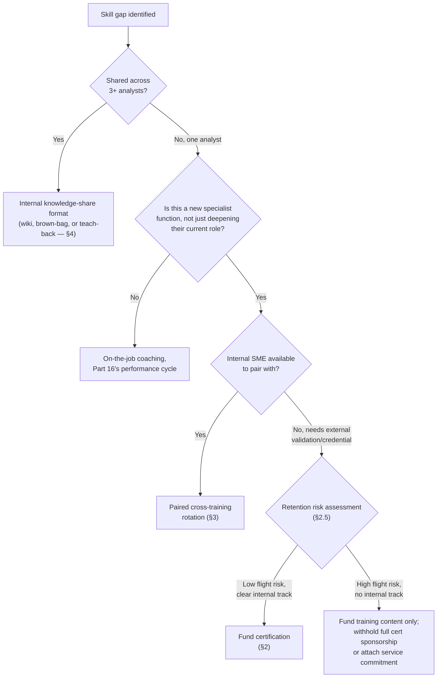

# Part 12 — Ongoing Training & Skill Development

## Why this part exists

**[CONCEPT]** Four decisions land on a SOC manager's desk every year regardless of whether a formal program exists to make them: how much continuing-education money to spend and on what, whether a specific certification request is worth funding, whether a given analyst should be cross-trained into a second specialty, and whether the team's internal knowledge-sharing sessions are actually transferring skill or just consuming an hour of everyone's Friday. This part gives a manager a way to answer all four with a number or a named criterion instead of a gut call defended after the fact.

**[CONCEPT]** Three adjacent parts of this book own related but distinct ground, and the boundary matters enough to state before anything else. Part 11 owns the structured first 90 days — this part starts where that one ends, once an analyst is off the ramp plan and into steady-state work. Part 13 owns the ladder an analyst climbs and the committee that decides who moves up it; this part owns the skill-building that makes someone eligible, not the promotion decision itself. Part 14 owns formal mentorship pairing and succession planning for a specific irreplaceable role before its incumbent leaves; this part owns the standing, always-on program — budget, certification policy, rotation, and internal teach-backs — that reduces how often a role becomes irreplaceable in the first place. Where the actual technical content of a certification exam, a detection technique, or a hunting method belongs to SOC Playbook Handbook or Detection Engineering Handbook V2, this part cites that content and spends its own words on the program that decides who learns it, when, and on whose budget.

**[CONCEPT]** All four decisions share one underlying tension a manager should expect to hold rather than resolve once: every dollar and every scheduled hour spent building a specific person's skill is also a dollar and an hour that makes that person more valuable to a competitor, and every skill concentrated in one specialist for convenience is a coverage plan that survives only as long as that one person's attendance. This part doesn't pretend that tension goes away with a better policy. It gives you the specific levers — service commitments, bench-depth targets, format selection — that make the tradeoff deliberate instead of accidental.

## 1. The continuing-education budget as an operating line, not a perk

### 1.1 What the line actually has to cover

**[SENIOR MANAGER]** A continuing-education budget that only funds conference tickets and certification exam fees is funding the two most visible categories and missing the three that usually matter more day to day: paid study time (the hours an analyst spends studying are a real labor cost whether or not a line item ever says so), internal lab or range access (a sandboxed environment to practice an attack technique or a new tool without touching production), and content licensing (a training-platform seat, a CTF-platform subscription, a book budget). A budget built only from exam-fee receipts systematically understates what training actually costs, because the largest cost — an analyst's paid time not spent on the queue — never generates an invoice.

**[SENIOR MANAGER]** Appendix A3 carries a reusable training-budget worksheet that breaks a per-analyst allocation into these five categories explicitly, rather than one blended "training" number, specifically so a manager defending the budget can show a CFO what happened to the money instead of a single total that invites an across-the-board cut. Part 20 — Building & Defending the SOC Budget covers where this line sits inside the overall budget structure and how to frame it against headcount and tooling; this section only covers what belongs inside it.

### 1.2 Sizing the line and watching where it actually goes

**[SENIOR MANAGER]** A workable starting point for a mid-market in-house SOC is $2,000–$3,500 in direct spend per analyst per year, plus 24–40 paid hours of study/lab time — roughly 1–2% of a fully loaded analyst's annual cost. That range is a starting point for building your own number, not a benchmark to defend to a board without adjustment; a SOC running mostly commodity SIEM/EDR tooling with low specialist demand sits at the low end, and a SOC actively building an internal detection-engineering or threat-hunting bench (Section 3 below) should expect to run well above it in the specific years it's closing a bench-depth gap.

> **Manager's Note**
> Track utilization of the training budget the same way you'd track a PTO balance — a line that's 40% spent by October isn't "under budget," it's a program nobody is using, and the reason is almost never "the team doesn't want training." It's usually that nobody has time carved out of the queue to use it, which makes this a scheduling problem (Part 6) wearing a budget problem's clothes.

**[FRONTLINE MANAGER]** The failure mode a team lead actually sees is simpler than a budget spreadsheet: an analyst gets approved for a training day, then gets pulled back onto the floor because the queue spiked, three times in a row, and stops asking. Protecting a scheduled training block the same way you'd protect a scheduled on-call handoff — not "whenever the queue allows it" — is the entire fix, and it costs nothing beyond the discipline to say no to pulling that person back for anything short of a declared major incident.

### 1.3 Defending the line when someone asks for its ROI

**[EXECUTIVE]** A training budget is one of the easiest lines for a CFO to flag during a lean year, because unlike a SIEM license, nothing visibly breaks the week after it's cut. The honest response is not to invent a fabricated return-on-investment percentage — it's to name what the line is actually insuring against: the bench-depth gaps in Section 3, which have a real, demonstrated cost when they go unaddressed, and the certification-linked capability that keeps the team from needing to backfill a specialist role externally at a market premium every time one is created internally instead.

**[EXECUTIVE]** A more defensible framing than an invented ROI number is a direct cost comparison the board can check: hiring a mid-level detection engineer externally in most markets costs 15–25% of first-year salary in recruiting fees alone, plus three to six months of reduced output while the new hire ramps against unfamiliar tooling and environment context an internal candidate already has. Growing that same capability internally through the cross-training program in Section 3 costs the 15–25% capacity draw quantified in 3.5, paid by an existing team member who already knows the environment. That's a comparison a skeptical board member can interrogate line by line, which is exactly what a manufactured ROI percentage can't survive.

> **What Would Change My Mind**
> This part treats internally grown specialist capability as generally cheaper than externally hired specialist capability once ramp time and environment-familiarity loss are counted. If a manager could show that external specialist hires in a comparable market consistently ramped to full productivity faster than an internally cross-trained analyst — not just cheaper on the recruiting-fee line alone — that would undercut this section's default recommendation and shift the calculus back toward external hiring for urgent specialist gaps.

## 2. Certification strategy: what predicts capability versus what pads a résumé

### 2.1 The question that actually needs answering

**[SENIOR MANAGER]** Part 7 — Hiring & Sourcing Analysts already covers the hiring-side version of this problem: over-indexing on certifications during sourcing screens out capable non-traditional candidates who never needed a credential to be good at the job. The development-side version is the mirror image and just as costly — funding a certification for an existing analyst that adds a line to their résumé without changing what they can do in the queue, while a different, cheaper credential would have closed a real capability gap. Both mistakes come from treating "certified" as a single signal instead of asking what, specifically, the exam actually tests.

**[SENIOR MANAGER]** The question worth asking before approving any certification request is not "is this a respected certification" but "does passing this exam require doing the thing, or knowing about the thing." A proctored practical exam that requires compromising a live host, writing a working detection, or completing a forensic timeline under time pressure tests a skill directly. A multiple-choice exam tests whether the candidate memorized the vocabulary and framework well enough to recognize the right answer among four — valuable for breadth and shared vocabulary, but a weak predictor of whether that person can do the corresponding task unsupervised on a real incident.

### 2.2 A certification scorecard

**[HR/PEOPLE]** The table below scores the certifications a SOC manager most commonly gets asked to fund against the dimension that actually predicts on-the-job value: whether the exam format forces demonstrated performance rather than recognition. Use it to route a request, not to reject one outright — a low hands-on score doesn't mean a certification is worthless, only that it shouldn't be the thing you point to as proof of readiness for independent work.

**CONCEPTUAL SAMPLE — illustrative scoring based on each certification's published exam format as of this writing, not a validated study correlating certification with measured job performance.**

| Certification | Exam format | Hands-on skill validated | Typical cost & renewal | Best use |
|---|---|---|---|---|
| CompTIA Security+ | Multiple choice | Low | ~$400, renews every 3 years | Baseline shared vocabulary for a new-to-security hire; not a signal of triage capability |
| GIAC GCIH (Certified Incident Handler) | Proctored, scenario-based multiple choice | Medium | ~$2,500 incl. training, renews every 4 years | Structured incident-handling framework knowledge for an analyst moving toward Tier 2 |
| GIAC GCFA / GCFE (forensics) | Proctored, scenario-based multiple choice | Medium | ~$2,500 incl. training, renews every 4 years | Forensic methodology grounding ahead of a hands-on forensic rotation, not a substitute for one |
| Offensive Security OSCP | Proctored, live practical exam (compromise real hosts) | High | ~$1,600 (exam + 90-day lab), no renewal | Genuine hands-on offensive-technique fluency; strongest for an analyst cross-training toward threat hunting or red-team liaison work |
| Security Blue Team BTL1 / BTL2 | Practical, scenario-based (investigate real captured data) | High | ~$400–$700, no renewal | Directly exercises SOC-analyst triage and investigation skill at low cost — underused relative to its signal strength |
| (ISC)² CISSP | Multiple choice, broad domain coverage | Low for hands-on work | ~$750, renews annually with CPE credits | Management/governance-track credential; a poor proxy for triage or engineering capability, useful for team-lead-and-above roles that touch policy and risk framing |
| Cloud vendor security certs (e.g., a major cloud provider's security-specialty exam) | Multiple choice / scenario, platform-specific | Medium | ~$300, renews every 1–2 years | Fast, cheap way to validate platform-specific knowledge once an analyst's environment has real cloud telemetry to triage |

**[HR/PEOPLE]** Two patterns in that table are worth naming directly. First, cost and hands-on validity don't move together — BTL1/BTL2 costs a fraction of CISSP and tests the actual job more directly, which makes it a better default funding choice for a Tier 1 or Tier 2 analyst than the more expensive, more widely recognized credential. Second, CISSP's low hands-on score is not a knock on the certification's actual purpose — it's a mismatch between what it tests (governance, risk framework breadth) and what a SOC manager is usually trying to buy with a training budget (demonstrated triage or engineering skill). Fund CISSP for someone heading toward a team-lead or manager track where that breadth is the actual job; don't fund it as a stand-in for hands-on readiness.

### 2.3 Certification stacking and diminishing returns

**[HR/PEOPLE]** A second, quieter failure pattern shows up less often as a single bad decision and more as a slow drift: an analyst accumulates a fourth or fifth certification in adjacent domains — Security+, then GCIH, then a cloud-security cert, then a second incident-handling credential — with each one individually defensible and the combination adding almost nothing to what the analyst can actually do that the second certification hadn't already covered. Certifications that test overlapping domains (most entry- and mid-level security credentials cover the same core incident-response vocabulary) have sharply diminishing marginal value past the second one in a given skill area, even though each individual exam still costs close to full price and full study time.

**[HR/PEOPLE]** The practical check before approving a third-or-later certification request in the same domain is the same question from 2.1 applied to the *marginal* exam rather than the first one: what can this specific credential validate that the analyst's existing certifications and demonstrated work don't already show? If the honest answer is "very little, but it looks good on a proposal we're bidding on" or "the analyst just likes collecting them," that's a legitimate reason to fund it out of a marketing or business-development budget rather than the skill-development line — the two purposes are different and conflating them hides how much the training budget is actually buying in capability versus credibility theater.

### 2.4 Worked example — the certification-and-exit pattern

**CASE-1201 — the certification-and-exit pattern.** *COMPOSITE CASE EXAMPLE, merging patterns from several mid-sized in-house SOCs into one illustrative case; no single organization's data is reproduced.*

**[SENIOR MANAGER]** A 16-analyst in-house SOC at a mid-market healthcare organization adopted a simple policy: any analyst with 12 months of tenure could request full sponsorship for the OSCP, no questions asked, as its primary visible investment in technical growth. Fully loaded, one certification came to roughly $5,500 per analyst — the $1,600 exam and lab fee, plus about 80 hours of paid study time at a loaded rate near $50/hour. Over two years, seven analysts completed it. Five of the seven resigned within six months of certifying, each taking a role elsewhere with an average total-compensation increase of about 28% (roughly $65,000 to $83,000), most often into penetration-testing or red-team roles the OSCP is specifically built to signal readiness for. The SOC spent approximately $38,500 across the seven certifications and retained the resulting skill increase in only two of the seven people past the six-month mark.

The program wasn't badly chosen on the merits — OSCP is a legitimately strong, hands-on-validated credential, and it genuinely improved the five departing analysts' offensive-technique fluency. The failure was structural: an unconditional, unbonded sponsorship of a certification whose primary external market value points directly at roles the SOC doesn't offer internally is a subsidized recruiting pipeline for other employers. The fix applied afterward had three parts — a 12-month service commitment (with pro-rated repayment on early departure) attached to any certification costing more than $1,000, a rule that certification sponsorship requests get evaluated against whether the SOC has, or is building, an internal role the credential leads toward, and stacking certification funding with an actual internal track change (Part 13's ladder) so the raise the certification earns happens inside the organization instead of at the next one.

### 2.5 Certification sponsorship and the retention trap

> **People Risk Trap**
> Funding a certification whose strongest external market value points at a role you don't have open internally trains your best analysts to leave, on your budget, at the exact moment they become most valuable. Before approving spend above roughly $1,000, ask what internal role or track this credential is preparing the analyst for, and attach a service commitment or pro-rated repayment clause to anything that doesn't have a clear answer. This isn't a reason to stop funding strong certifications — it's a reason to stop funding them unconditionally.

**[VENDOR/PROCUREMENT]** The exam voucher and renewal fees themselves are a small, predictable recurring cost worth negotiating directly with the certifying body or training vendor at volume — most GIAC- and vendor-affiliated programs offer a bulk-voucher discount once a SOC is purchasing more than four or five seats a year, typically in the 10–15% range. Track renewal dates centrally rather than per-analyst; a lapsed certification an analyst was relying on for a client-facing MSSP requirement (Part 22) is a contract-compliance problem discovered at the worst possible time, not a training-administration inconvenience.

## 3. Cross-training: closing single points of knowledge failure

### 3.1 Naming the risk specifically

**[SENIOR MANAGER]** A single point of knowledge failure is a specific, checkable condition: exactly one person on the team can perform a given specialist function unsupervised, with no one else able to cover it at an acceptable quality bar if that person is unavailable for more than a day. It is distinct from a single point of *staffing* failure (not enough people to cover a shift, Part 5's territory) — the team can be fully staffed on paper and still have a knowledge concentration risk if the one person who understands the custom correlation-rule logic, the SOAR playbook internals, or the TIP integration is on vacation, on leave, or gone.

**[SENIOR MANAGER]** Part 3 — Tiering Models: L1/L2/L3 and Beyond defines the specialist tiers — detection engineering, threat hunting, incident response — that sit above the generalist L1/L2 structure. Cross-training, for this part's purposes, means deliberately building a second (or third) person's competence in one of those specialist functions or in a peer generalist tier, not simply exposing someone to it in passing. Sitting next to the detection engineer for an afternoon is exposure; being able to triage, modify, and redeploy that engineer's rule set unsupervised six months later is cross-training that actually closed the gap.

### 3.2 Building a cross-training matrix

**[SENIOR MANAGER]** The tool that makes a knowledge-concentration risk visible before it becomes a crisis is a simple matrix: list every specialist function down the rows, and for each one record how many analysts can currently perform it unsupervised, what the target bench depth is, and which format (Section 4) is doing the work of closing the gap. The table below is a conceptual template, not a specific team's real data.

**CONCEPTUAL SAMPLE — illustrative bench-depth matrix, not a specific team's real staffing data.**

| Specialist function | Analysts currently unsupervised-capable | Target bench depth | Current gap | Closing format |
|---|---|---|---|---|
| Custom correlation-rule authoring and tuning | 1 | 2 | 1 | Paired rotation with the incumbent, 90 days |
| Threat hunting (hypothesis-driven) | 1 | 2 | 1 | Structured hunt-shadowing rotation, then solo hunt with review |
| SOAR playbook administration | 1 | 2 | 1 | Documented runbook + supervised playbook edit, 60 days |
| Threat-intel platform (TIP) integration and feed tuning | 2 | 2 | 0 | — |
| Incident-response lead (major incident) | 2 | 3 | 1 | Tabletop co-lead role, next two exercises |

**[SENIOR MANAGER]** A matrix like this one turns "we should probably cross-train more" into a specific, funded plan: three of five specialist functions above show a one-person gap against target, which is exactly the pattern that produces the failure described in `CASE-1202` below. Rebuilding this matrix on a fixed cadence — quarterly is reasonable for most teams — keeps it from going stale the same way an unreviewed headcount model does (Part 5's Operational Reality on that same failure mode applies here without modification).

### 3.3 Running the rotation itself

**[FRONTLINE MANAGER]** A paired rotation needs four things decided before it starts, or it degrades into the same vague exposure described in 3.1: a fixed duration (60–120 days depending on the specialty's complexity — SOAR playbook administration is closer to the short end, custom correlation-rule authoring closer to the long end), an explicit list of tasks the trainee must perform under supervision before graduating (not "shadow the SME," but "author, test, and deploy one new correlation rule end to end with the SME reviewing every step"), a named point at which supervision formally ends, and who makes that call. The competency matrix from Part 10 is the natural authority for that last point — "ready to perform this function unsupervised" should be an observable, matrix-defined bar, not the mentor's informal comfort level, because a mentor who likes the trainee will tend to sign off early and one who's protective of the role will tend to never sign off at all.

**[FRONTLINE MANAGER]** The mentor's incentive in a paired rotation deserves a direct look, because it's easy to get backwards. An analyst who has been the sole owner of a specialist function for years, often precisely because it made them hard to schedule around, doesn't always experience "someone else can now do my job" as good news — some genuinely welcome the relief, and some quietly slow-walk the handoff without ever saying so. Naming this openly with the mentor before the rotation starts, and giving them credit for successful knowledge transfer as its own recognized contribution (not just a footnote to their individual output), heads off the version of this where the rotation technically ran for 90 days and nobody actually got signed off at the end of it.

> **Cross-Book Pointer**
> This part owns the decision to cross-train an analyst into detection engineering or threat hunting and the rotation program that gets them there — it does not teach the technical content of either discipline. For the actual methodology a hunter needs, see Detection Engineering Handbook V2, Parts 34–36 — Threat Hunting Methodology; for the detection-authoring and detection-as-code discipline a rotation into detection engineering should build toward, see Detection Engineering Handbook V2, Part 22 — Detection as Code. Once an analyst finishes a cross-training rotation and starts handing off escalations across a tier boundary, SOC Playbook Handbook, Part 27 — Escalation Quality defines what a good hand-off looks like mechanically — worth a refresher for someone operating in an unfamiliar tier for the first time.

### 3.4 Worked example — the bench-depth audit

**CASE-1202 — the bench-depth audit.** *COMPOSITE CASE EXAMPLE, merged from patterns across several mid-sized SOCs; no single organization's staffing is reproduced.*

**[SENIOR MANAGER]** A 22-analyst SOC at a mid-market financial-services organization, running three shifts, had one analyst — call him the pattern's "Analyst A" — who had authored and personally tuned roughly 80% of the team's custom correlation rules over three years, mostly because he was good at it and it was faster for him to just do it than to teach it. When Analyst A took three weeks of parental leave, two of his rules began misfiring against a legitimate but newly changed upstream data source. Nobody remaining on any shift understood the rule logic well enough to retune it safely, so the on-call lead disabled both rules rather than risk a bad change to live detection — a defensible call in the moment that nonetheless reopened a real coverage gap for 11 days until Analyst A returned.

The post-incident review that followed ran a bench-depth audit across all five specialist functions the team relied on and found that four of the five had exactly one person who could perform them unsupervised — a bus factor of one on 80% of the team's specialist capability, discovered only because one of those four people happened to take planned, unremarkable leave. The fix was the matrix in 3.2, built for real, with a standing target of at least two unsupervised-capable people per specialist function within 12 months, funded from the training-budget line in Section 1 and staffed through the paired-rotation format in Section 4.

### 3.5 The real cost of cross-training, and why it's worth paying

**[SENIOR MANAGER]** Cross-training has a genuine, non-hidden cost: an analyst pulled into a rotation is, for the duration of that rotation, producing less of their normal output — reasonable to budget at a 15–25% capacity reduction for the person being trained during the active rotation window, plus a smaller draw on the mentor's time. A 90-day paired rotation on one analyst therefore costs something like 14–23 analyst-days of reduced throughput (90 days at that 15–25% draw), which is the real number to put next to the 11-day coverage gap in `CASE-1202` when someone asks whether the investment was worth it.

**[SENIOR MANAGER]** The comparison that actually justifies the spend isn't "cross-training costs nothing" — it costs something specific and schedulable. It's that an unplanned single point of knowledge failure costs the same capacity hit at the worst possible time, with no lead time to schedule around it and a live coverage gap attached. Paying the cost on your own schedule, once, is cheaper than paying an unknown version of the same cost during someone's medical leave, resignation, or the exact week of a major incident.

## 4. Internal knowledge-sharing formats

### 4.1 The format menu

**[FRONTLINE MANAGER]** Five formats cover most of what a SOC needs, and they are not interchangeable — each transfers a different kind of knowledge and fits a different team size and shift pattern.

- **Brown-bag / lunch-and-learn.** A 30–45 minute session, one analyst presenting something they recently learned or built. Cheap, low-prep, good for surfacing what individuals already know; weak for deep skill transfer because it's a lecture, not practice.
- **Shadow rotation.** One analyst observes a specialist doing real work for a fixed period, without doing it themselves yet. Good for building situational awareness of a specialty before committing rotation budget to it; on its own, produces exposure, not competence — see 3.1's exposure-versus-competence distinction.
- **Paired rotation.** The format behind both cross-training case studies above — a less-experienced analyst does the actual work under a specialist's direct supervision for a fixed window, with explicit sign-off criteria for graduating to unsupervised. This is the format that actually closes a bench-depth gap; the other four support it or substitute for it when it isn't available.
- **Internal wiki / runbook library.** Asynchronous, written documentation of how a specific tool, rule set, or process actually works, maintained by whoever owns it. The only format that works the same way for every shift without live attendance — essential for a 24/7 team, and the first thing that goes stale the moment nobody's job explicitly includes updating it.
- **Post-incident teach-back.** A short session, distinct from the blameless postmortem covered in Part 29, where the analyst who handled a notable incident walks the team through what they saw and did, focused on transferable technique rather than root-cause analysis. Good for spreading a specific new investigative trick quickly while it's still fresh.

**[FRONTLINE MANAGER]** The table below lines up the five formats against what actually decides whether a manager should use one — cost, prep burden, and how strong a claim it supports about skill transfer — so a format gets picked for the job in front of it rather than out of habit (CONCEPTUAL SAMPLE — relative cost/cadence bands, not measured figures from any specific team).

| Format | Prep/facilitation cost | Cadence that works | Transfer strength | Best evidence it worked |
|---|---|---|---|---|
| Brown-bag / lunch-and-learn | Low — one presenter, ~1 hour prep | Biweekly or monthly | Weak on its own | Attendees can restate the idea; rarely demonstrates a new capability |
| Shadow rotation | Low-medium — mentor's time, no formal prep | As needed, ahead of a rotation decision | Weak-medium | Trainee can describe the workflow accurately; cannot yet perform it |
| Paired rotation | High — dedicated mentor time over weeks | Ongoing per bench-depth gap (§3.2) | Strong | Trainee performs the task unsupervised and passes the matrix sign-off (§3.3) |
| Internal wiki / runbook library | Medium — ongoing maintenance, not a one-time cost | Continuous, owned by whoever maintains the relevant system | Medium, format-dependent | A different analyst follows the runbook unaided and gets the correct result |
| Post-incident teach-back | Low — one presenter, session tied to a real incident | Within 1–2 weeks of a notable incident | Medium | A later analyst applies the specific technique described, on an unrelated ticket |

### 4.2 Fitting formats to a 24/7 shift-based team

**[FRONTLINE MANAGER]** A synchronous format — brown-bag, shadow rotation, teach-back — structurally excludes whichever shift isn't on the clock when it happens, unless it's recorded and the recording is actually watched afterward, which in practice happens rarely enough that a manager should assume it doesn't. A team running three shifts that schedules its only knowledge-sharing session at 10 a.m. is running a knowledge-sharing program for one shift and calling it a team-wide program.

**[FRONTLINE MANAGER]** The practical fix is not "record everything" — it's picking the right format for the shift-coverage problem specifically. Rotate the live session's time slot across a two- or three-week cycle so every shift gets a live turn eventually, and put the load-bearing content into the wiki/runbook format (asynchronous by construction) rather than treating a recording of a synchronous session as an adequate substitute. Part 6 — Shift Pattern & Coverage Design covers the handoff mechanics between shifts generally; this is the training-specific version of the same equal-access problem.

### 4.3 Telling real transfer from a performative meeting

> **Manager's Note**
> If you can't name one specific thing an analyst can now do that they couldn't do before a knowledge-sharing session, the session was entertainment, not training — good entertainment is fine to keep funding for morale, just don't count it against a skill-gap budget line.

**[SENIOR MANAGER]** The honest test for any recurring knowledge-sharing format is whether it changes what someone can independently do afterward, checkable the same way a competency matrix (Part 10) checks readiness for a tier: pick one attendee, one session later, and ask them to perform the thing unsupervised. A brown-bag on a new attacker technique that never gets tested this way might still be worth running for morale and shared vocabulary, but it shouldn't be counted as having closed a skill gap in the bench-depth matrix from Section 3 — only a format with an explicit graduation check, almost always the paired rotation, earns that credit.

> **Field Test**
> **Setup:** A post-incident teach-back or brown-bag session on a specific technique has just run, and the presenter believes the technique is now understood by the team.
> **Action:** Two weeks later, without advance warning, hand a different attendee a ticket where the technique applies and ask them to work it without help.
> **Expected result:** The attendee should apply the technique correctly, or at minimum recognize where it applies and know where to look up the specifics. If most attendees can't do either, the session transferred awareness, not capability — schedule a paired-rotation follow-up instead of re-running the same format.

## 5. Building the annual training plan

### 5.1 Routing a skill gap to the right investment

**[SENIOR MANAGER]** Most training-plan mistakes come from applying one favorite format to every gap — funding certifications for everything, or defaulting to a brown-bag for everything — instead of routing each identified gap to the format actually built to close it. The decision tree below is the routing logic this part's sections build toward.

**Figure 12.1 — Routing a skill gap to a training investment.** *CONCEPTUAL.* Illustrates the decision sequence this part's sections build toward: whether a gap is shared or individual, whether it's a new specialty or a deepening of an existing role, and whether an external credential's retention risk is priced in before funding it. This is a structural decision aid, not a captured record of any specific team's actual approval workflow. Diagram ID `FIG-1201`.

### 5.2 Reviewing the plan against what actually happened

**[EXECUTIVE]** A training plan defended to a CISO or budget owner once a year and never revisited against outcomes is a forecast, not a program. Two numbers are worth reviewing against the plan every year, alongside the metric definitions owned by SOC Playbook Handbook, Part 32 — Metrics rather than redefined here: how many bench-depth gaps identified in the cross-training matrix (Section 3.2) actually closed on schedule, and how many certification-sponsored analysts left within 12 months of certifying, broken out separately from baseline attrition (Part 18's territory for the general number). A plan that closes gaps on schedule and doesn't lose certified analysts at a higher rate than the rest of the team is working; a plan that spends the full budget every year and can't answer either question is a spending habit wearing a program's name.

**[SENIOR MANAGER]** The training-budget worksheet in Appendix A3 has a column for exactly this — planned closure date against actual closure date per bench-depth gap — specifically so this review takes an afternoon against existing records instead of a reconstruction project every January.

---

## Cross-references

**Within this book:** assumes Part 3 — Tiering Models (the specialist-tier definitions cross-training routes analysts into), Part 7 — Hiring & Sourcing Analysts (the hiring-side certification-screening problem this part's development-side counterpart mirrors), and Part 10 — Competency Models & Skills Matrices (the readiness criteria a training plan is built to close gaps against). Points forward to Part 6 — Shift Pattern & Coverage Design (equal shift access to synchronous training), Part 13 — Career Ladders & Promotion Criteria (what a completed certification or cross-training rotation feeds into, not decides), Part 14 — Mentorship & Knowledge Transfer (formal succession planning, distinct from this part's standing program), Part 16 — Performance Management & Coaching (on-the-job coaching versus formal training), Part 18 — Attrition & Retention (baseline attrition rate to compare certification-linked departures against), Part 20 — Building & Defending the SOC Budget (where this budget line sits in the whole), and Part 29 — Post-Incident Organizational Review (the blameless postmortem, distinct from the post-incident teach-back in §4.1).

**Other volumes:** Detection Engineering Handbook V2, Parts 34–36 — Threat Hunting Methodology and Part 22 — detection-as-code discipline (the technical content a cross-training rotation into those specialties actually teaches). SOC Playbook Handbook, Part 27 — Escalation Quality (hand-off mechanics for an analyst newly cross-trained across a tier boundary) and Part 32 — Metrics (the metric definitions this part's plan-review step consumes rather than redefines).
