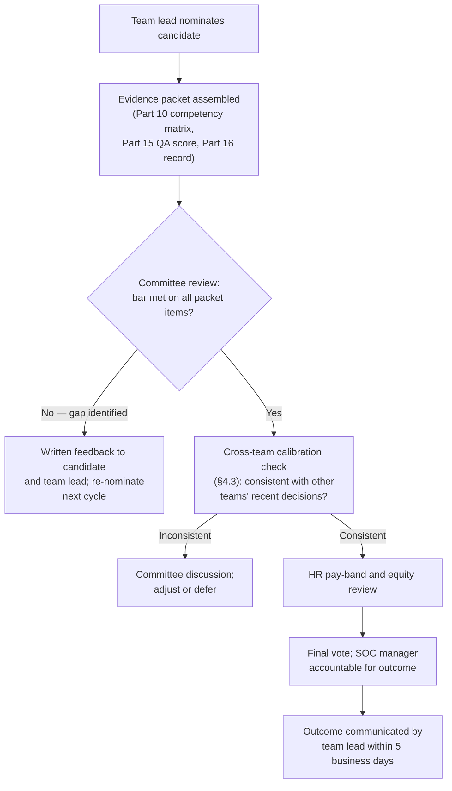

# Part 13 — Career Ladders & Promotion Criteria

## Why this part exists

**[CONCEPT]** A tiering model (Part 3) answers "who does what work today." A career ladder answers a different question: "how does a specific person move from one rung to the next, and who decides." The two get confused constantly, because the rungs of a ladder usually borrow the same labels as the tiers — Analyst I, Analyst II, detection engineer, team lead — and it is easy to mistake a staffing chart for a promotion policy. They are not the same artifact, and a SOC that only has the first one has no defensible answer when an analyst asks "what do I actually need to do to get promoted," which is the single most common question this part exists to answer in writing rather than in a hallway conversation that changes depending on who's asking and who's answering.

**[CONCEPT]** This part owns three things: defining the rungs from analyst through senior analyst and the branch point into detection engineer, threat hunter, or team lead; running the committee that decides who moves up those rungs, fairly and repeatably; and naming and fixing leveling drift — the specific failure mode where titles and actual demonstrated competency quietly stop matching each other. It does not own what a detection engineer or a threat hunter technically does day to day. Detection Engineering Handbook V2, Part 22 — Detection as Code and Part 34 — Threat Hunting Fundamentals already define those roles' technical content in the depth this book has no reason to duplicate; this part cites them exactly once each, for exactly what a candidate has to be able to demonstrate to earn the title, and moves on. It also does not own the competency matrix that defines "ready for the next rung" in observable terms — that is Part 10's job, and this part treats a finished competency matrix as an input it consumes rather than a thing it re-derives.

**[CONCEPT]** It also assumes Part 15's QA program and Part 16's performance-management process are already running, because a promotion committee that has no QA score and no performance-management record to draw on is making the decision on vibes, which is exactly the failure mode this part is written to prevent.

## 1. The ladder is not the tier chart

**[CONCEPT]** A tier chart is a snapshot: it says a 22-person SOC currently has fourteen Tier 1 analysts, five Tier 2, two detection engineers, and one team lead reporting to the SOC manager. A career ladder is a policy: it says what an Analyst I has to demonstrate to become an Analyst II, what an Analyst II has to demonstrate to be considered for the branch into detection engineer, threat hunter, or team lead, and what evidence a committee will actually look at before approving any of it. The tier chart can be redrawn every quarter as headcount and workload shift. The ladder should not move nearly that often — a ladder that gets renegotiated every time a manager wants to promote a specific person isn't a ladder, it's a title generator, and §5 covers exactly how that failure develops.

**[SENIOR MANAGER]** The practical reason to keep them separate: a tiering redesign (say, collapsing L1 and L2 into a single tierless "follow-the-alert" model, per Part 3's decision framework) changes who does which task on a given day. It should not, by itself, change what "Senior Analyst" means as a demonstrated level of competency, pay band, and scope. Conflating the two means every org-design change turns into a promotion-policy renegotiation, which is slower than either change needs to be and teaches analysts that their level is a function of this quarter's org chart rather than a stable, portable credential they carry with them.

> **Manager's Note**
> If you can't answer "what would have to be different about this person's demonstrated work for them to already be at the next rung" without looking at the org chart, you're describing a tier, not a level. Levels describe a person; tiers describe a seat.

**[SENIOR MANAGER]** A ladder also has a right number of rungs, and it's smaller than most first drafts. Five to seven total levels — Analyst I, Analyst II/Senior Analyst, the three specialist branches (or a combined "specialist" band if the SOC is too small to title them separately), and one senior/principal band above that — covers a SOC from roughly 10 to 60 analysts without needing a rung added every time someone asks for a bigger title. Adding a rung to solve a single person's compensation problem is the same mistake as an off-cycle promotion (§5.1 covers exactly this failure mode with a worked case): it treats the ladder as a title generator instead of a standing policy, and every extra rung is one more distinction a candidate, a peer, and eventually an auditor has to be able to explain the difference between.

## 2. Building the rungs: analyst through senior analyst

### 2.1 Analyst I to Analyst II: what actually has to change

**[HR/PEOPLE]** The most common defect in a first-draft ladder is defining the Analyst I → Analyst II jump entirely in tenure ("12 months in seat") with no competency bar attached. Tenure alone promotes the analyst who was merely present for a year exactly as readily as the one who got measurably better, and it gives a committee nothing to point to when a manager pushes for an early promotion or a peer asks why someone else got passed over. A defensible Analyst II bar is observable and multi-part, not a single number:

- Sustained handle time within 15% of the team median across the trailing 90 days, not a single good week.
- Independent closure — no escalation required — on at least 80% of the ticket types the L1 tier owns, measured against Part 3's own tier hand-off definitions.
- A calibrated QA score at or above 85%, sustained across two consecutive quarters under Part 15's calibration process, not a single reviewer's one-time score.
- Every "meets" rating on the Analyst II row of the Part 10 competency matrix — not an average across rows, because an analyst who is excellent at triage speed and weak at written communication has a real gap a single averaged number hides.

**[HR/PEOPLE]** None of these four bars is sufficient alone. Handle time alone promotes someone who's fast but escalates constantly to avoid genuinely hard tickets. QA score alone promotes someone thorough but too slow to carry a full queue. The four together are what makes the case defensible in front of a committee that includes someone other than the candidate's own manager — the exact problem §4 exists to solve.

### 2.2 What "senior" should actually gate

**[HR/PEOPLE]** "Senior Analyst" earns its title by gating on judgment under ambiguity, not just more of the same triage at higher speed. A useful test: give the candidate a ticket type the runbook genuinely doesn't cover cleanly, and see whether they escalate immediately, guess and move on, or reason from the underlying threat model to a defensible disposition and document why. The third response is the one "senior" is supposed to certify. A ladder that promotes to Senior purely on volume and speed metrics is really just certifying "very fast Analyst I," and the title stops meaning anything the first time a genuinely ambiguous incident lands on that person's queue and they have no more judgment than they did a year earlier.

> **Operational Reality**
> In practice, most SOCs promote to Senior roughly a year to eighteen months after hire, because that's how long it takes handle time and QA scores to stabilize enough to trust — not because eighteen months is some magic threshold of judgment. Treat the timeline as a floor set by how long the evidence takes to accumulate, not a target. An analyst who hits every bar in §2.1 at month nine has met the bar at month nine; making them wait another year "because that's normally how long it takes" is exactly the kind of ungrounded rule that teaches your best people the ladder isn't really about the bar.

## 3. The branch point: three roads out of senior analyst

**[CONCEPT]** Senior Analyst is the fork, not the destination. From there, a ladder needs at least three genuinely different paths, because detection engineering, threat hunting, and team leadership select for different aptitudes that don't reliably co-occur in the same person: detection engineering rewards someone who thinks in edge cases and false-positive mechanisms; threat hunting rewards someone comfortable pursuing a hypothesis that might resolve to nothing; team leadership rewards someone who gets more value from coaching four other people than from personally closing the hardest ticket in the queue. A ladder that only offers "stay an analyst or become a manager" forces every strong technical performer through a management funnel whether or not they want to manage anyone, which §3.4 covers as its own design failure.

> **Cross-Book Pointer**
> This part does not define what a detection engineer or a threat hunter actually does — the query languages, the detection-as-code review pipeline, the hunt methodology. Detection Engineering Handbook V2, Part 22 — Detection as Code covers the git-based rule pipeline, peer-review gates, and ownership model a detection engineer works inside every day; Part 34 — Threat Hunting Fundamentals and Part 35 — Hunt Types cover hypothesis formation, scoping, and the range of hunt types a candidate's completed-hunt record (§3.2) might draw from. Read those for the job. Come back here for how someone earns the title.

### 3.1 The detection engineer branch

**[SENIOR MANAGER]** The entrance bar for this branch has to be a work-sample bar, not a self-declared interest. A candidate should have at least five detections merged through the actual detection-as-code review pipeline (DEH V2 Part 22) under their own authorship, with a post-deployment false-positive rate that stayed inside whatever tuning threshold Part 22's own review gate sets — not five detections drafted and abandoned, and not five detections someone else had to substantially rewrite before merge. A committee that promotes on interest alone ("they asked to move into detection engineering and seem sharp") gets a detection engineer who learns the review pipeline on the job, at the cost of every reviewer's time and every rule's early false-positive rate while that learning happens. Require the work sample before the title, not after.

### 3.2 The threat hunter branch

**[SENIOR MANAGER]** The equivalent bar here is a completed hunt record, not a completed course. A candidate should be able to point to at least two structured hunts run under DEH V2 Part 34–35's methodology, with at least one that either resolved to a documented negative finding (a real answer, not an abandoned hypothesis) or converted into a shipped detection candidate. The distinguishing failure mode for this branch is different from detection engineering's: a candidate can be technically strong at querying and still be a poor hunter if every hunt they've run started from "let's see what's weird in this data" rather than a falsifiable hypothesis. Test for hypothesis discipline specifically, not just query fluency — ask the candidate to state, before they touch the data, what a negative result would look like and what would make them abandon the hypothesis.

### 3.3 The team lead branch

**[SENIOR MANAGER]** This is the branch most SOCs get wrong, because the instinct is to hand the open team-lead seat to whoever is best at the individual-contributor job, and that instinct is measuring the wrong thing.

**CASE-1301 — the fastest analyst becomes the team lead.** *COMPOSITE CASE EXAMPLE* — constructed from patterns across multiple SOCs in the 12–20 analyst range, not one traceable organization.

> **Management Autopsy — "the fastest triage analyst becomes the team lead"**
>
> **The decision:** A 16-person SOC promotes its highest-QA-score, fastest-handle-time senior analyst directly into an open team-lead vacancy, with no transition period and no prior coaching assessment.
>
> **Why it seemed reasonable:** She was, by every metric the team tracked, the best analyst on the floor, and promoting the visibly best performer into the open leadership seat is the promotion the rest of the team expects and rarely questions.
>
> **How it failed:** Six months in, she was still personally closing the hardest 20% of the queue herself rather than delegating it, ran zero QA calibration sessions across two full quarters (Part 15 sets quarterly calibration as the baseline cadence), and two of her six direct reports had gone the full quarter with zero scheduled 1:1s. Team throughput was flat, her own workload had roughly doubled, and the two under-coached analysts both later cited "no real feedback loop" in their exit interviews (Part 18) within the year.
>
> **The fix:** Separate the promotion decision from the transition. Run a structured coaching-aptitude assessment — a mock delegation scenario, a mock difficult-conversation role-play, using the same assessment-design discipline Part 8 applies to external hiring, just turned inward — before the offer, not after. Pair it with a 90-day shadow-lead period: reduced individual queue, one QA calibration session run under supervision, a mentor who is already a team lead. If the aptitude assessment comes back weak, that is real information the committee should be willing to act on, even for the team's strongest individual performer.

**[SENIOR MANAGER]** The bar for this branch, concretely: a passed coaching-aptitude assessment, a completed shadow-lead cycle covering at least one full stand-up rotation and one QA calibration session run with a current team lead observing, and — this is the part committees skip most often — explicit, voluntary interest. Nobody should end up in the team-lead branch because they were the obvious technical choice and nobody asked whether they actually wanted to spend their day coaching instead of triaging.

**[SENIOR MANAGER]** A candidate can fail any of these three branch bars on a first attempt without that failure becoming a career setback, and the ladder should say so explicitly. A detection engineer candidate whose first three merged rules ran hot on false positives, a hunter candidate whose two hunts both stalled on a hypothesis nobody could operationalize, or a team-lead candidate whose aptitude assessment came back weak on delegation specifically — each of those is diagnostic information, not a verdict. Set a fixed re-attempt window (two full quarters is a reasonable default, long enough to show a genuinely different result, short enough that the candidate isn't left in limbo) and require the committee to name, in writing, exactly which part of the bar wasn't met. A committee that says "not ready yet" with no specifics teaches the candidate nothing and reliably reads as a soft no rather than a real path forward.

### 3.4 The fourth road: staying a senior individual contributor

**[HR/PEOPLE]** A ladder with only three branches out of Senior Analyst — detection engineer, threat hunter, team lead — has a fourth, unlabeled branch by default: the analyst who is excellent at the individual-contributor job, doesn't want any of the three specialist tracks, and has nowhere to go but out. Build an explicit Principal Analyst or Staff Analyst rung that pays and titles like the specialist branches without requiring a role change — mentoring newer analysts, owning the hardest escalations personally, contributing to runbook and playbook quality without owning the QA program itself. Without this rung, a ladder quietly becomes "promote into management or your pay tops out," which is precisely the dynamic that pushes strong technical people into management roles they don't want and aren't suited for, purely because it's the only route to a bigger number on the offer letter. Part 18 covers the retention cost of this specific gap in more depth; the fix that actually closes it is a dual-ladder design decided here, not a retention program bolted on after the fact.

## 4. Running a fair promotion committee

**[SENIOR MANAGER]** A ladder with well-defined rungs still produces unfair outcomes if the decision sits with one manager evaluating their own reports against a bar only they interpret. A promotion committee exists to put more than one set of eyes, calibrated against each other, on every promotion decision before it ships.

### 4.1 Composition and cadence

**[SENIOR MANAGER]** A workable committee for a SOC in the 15–40 analyst range: the SOC manager (accountable for the final call), two team leads or senior peers from teams other than the candidate's own, and an HR partner for pay-band and equity review. Meeting quarterly, tied to the same cadence Part 15 already uses for QA calibration, keeps the promotion conversation from becoming a special, rare event that only happens when a manager pushes hard enough — a quarterly cadence normalizes it as a standing operational process instead.

**Figure 13.1 — Promotion committee decision flow, nomination through outcome.** *CONCEPTUAL.* Illustrates the standing process a quarterly promotion committee runs for one candidate, from nomination through communicated outcome, including the cross-team calibration check that §4.3 exists to enforce. This is a process design, not a capture of any single organization's actual workflow. Diagram ID `FIG-1301`.

**[SENIOR MANAGER]** The RACI below assigns one accountable owner — the SOC manager — across every step, which matters: a committee with no single accountable owner tends to diffuse responsibility for a bad call across everyone in the room, and nobody actually owns fixing the process when it produces an unfair outcome.

The table below maps who does what across a single promotion decision, so a new committee member (or a candidate asking "who actually decides this") can see the process at a glance.

| Activity | SOC Manager | Nominating Team Lead | Promotion Committee | HR Partner | Candidate |
|---|---|---|---|---|---|
| Nominate candidate | C | R | I | I | — |
| Assemble evidence packet | A | R | C | I | C |
| Calibrate scores across teams | A | C | R | C | — |
| Final promotion vote | A | I | R | C | I |
| Communicate outcome | A | R | I | C | I |

R = Responsible, A = Accountable, C = Consulted, I = Informed.

### 4.2 The evidence packet

**[HR/PEOPLE]** A promotion case that arrives as a manager's paragraph of praise is not an evidence packet — it's an opinion with a title request attached. The table below is what a committee should expect to see before a candidate's name is even discussed.

| Evidence item | Source | Minimum bar | Owner |
|---|---|---|---|
| Competency matrix rating | Part 10 skills matrix | "Meets" on every next-level row, not an average | Team lead |
| QA calibration score | Part 15 QA program | 85% or higher, sustained across two quarters | QA reviewer |
| Handle time and independence | Ticket system data | Within 15% of team median; under 20% escalation rate | Team lead |
| Open PIP or coaching plan | Part 16 performance records | None open in the trailing 6 months | SOC manager |
| Peer input | Structured peer-nomination form | At least 2 peer submissions; no unaddressed concern | Committee |
| Branch-specific work sample | Detection PRs, hunt records, or shadow-lead log | Meets the §3 branch bar | Team lead + specialist reviewer |

> **Manager's Note**
> Don't let the packet turn into a research project the team lead dreads assembling — most of this should already exist as a byproduct of running QA (Part 15) and performance management (Part 16) properly. If assembling a packet takes more than an hour of new work, the underlying record-keeping is the actual problem, not the promotion process.

### 4.3 Calibration across teams and managers

**[SENIOR MANAGER]** The single most common way a promotion committee fails is silently, by letting a lenient manager's team get promoted at a materially higher rate than a strict manager's team for indistinguishable actual performance — and nobody notices until HR runs a pay-equity report eighteen months later.

**CASE-1302 — cross-team promotion-rate gap, calibration fix.** *COMPOSITE CASE EXAMPLE* — constructed from patterns across multiple mid-size SOCs, not one traceable organization. A 24-analyst SOC split across two teams under two different team leads promoted 22% of Team A's eligible senior-analyst pool to a specialist branch in one cycle, against 4% of Team B's — despite both teams averaging a nearly identical 3.4-out-of-5 rating on the Part 10 competency matrix. Team A's lead was simply a more generous nominator; Team B's lead held an informal, higher personal bar nobody else on the committee had agreed to. HR flagged the gap during a routine pay-equity review roughly a year and a half later, by which point Team B had two informal grievances about perceived favoritism. The committee's fix going into the next two cycles: blind the competency-matrix and QA scores from the team-lead name during the committee's first-pass review, and require a second reviewer from outside the candidate's own team on every case — the same cross-team-second-reviewer principle §4.1's RACI already assigns. Two cycles later, the promotion rates had converged to 9% (Team A) and 7% (Team B) — not identical, but no longer a gap large enough to read as favoritism rather than noise.

> **People Risk Trap**
> Letting a candidate's own direct manager be the only real decision-maker — with the "committee" rubber-stamping whatever that manager already decided — reproduces every one of that manager's individual biases at scale, and it's invisible until someone compares outcomes across managers the way CASE-1302 eventually did. The fix: require a reviewer from outside the candidate's reporting line on every case, blind the competency and QA scores from the nominating manager's name during the committee's first pass, and run an annual cross-team promotion-rate comparison as a standing check — not something HR only surfaces after a complaint.

> **Field Test**
> **Setup:** A promotion committee exists on paper, with a published rung and branch bar, but has never actually voted on a case.
> **Action:** Before the first real candidate reaches the committee, run it once against a deliberately borderline synthetic case — a fabricated evidence packet that clears three of the four §2.1 bars cleanly and misses the fourth by a small, defensible margin.
> **Expected result:** The committee should split, at least initially, and the disagreement should trace back to which bar members weigh most heavily — not to who likes the fictional candidate. If every member immediately agrees with no discussion, the synthetic case wasn't ambiguous enough to test anything, and the committee hasn't actually learned whether it shares a bar yet.

## 5. Leveling drift: the failure mode this part is named for

### 5.1 What it is and how it starts

**[SENIOR MANAGER]** Leveling drift is the gradual mismatch between a person's title and their actually demonstrated competency at that title's rung — in either direction, though the retention-driven direction is by far the more common one in a SOC. It rarely starts as a policy decision. It starts as a single, understandable exception.

**CASE-1303 — the retention counter-promotion.** *COMPOSITE CASE EXAMPLE* — constructed from patterns across multiple organizations, not one traceable incident.

> **Management Autopsy — "the retention counter-promotion"**
>
> **The decision:** A senior analyst holding a competing offer roughly 18% above their current pay tells their manager they're leaving in two weeks. The SOC manager, unable to match the raise through base pay alone within the timeline, promotes them overnight to "Lead Detection Engineer" — bypassing the committee entirely — with no change in scope, no evidence packet, and no work sample against the §3.1 bar.
>
> **Why it seemed reasonable:** It was fast, it was cheaper than an equivalent base-pay counter-offer, and it kept a scarce mid-level analyst from walking out the door in a market where a replacement search realistically takes 8–12 weeks.
>
> **How it failed:** The promotion worked exactly once, and then it became the template. Over the following year, three more retention-driven promotions happened through the identical shortcut — a manager, under time pressure, bypassing the committee to retain someone about to leave. An internal leveling audit eventually found that 45% of a 20-person team held a "Senior" or "Lead" title, but only about 20% actually cleared the Part 10 competency bar for that rung. New mid-level hires, brought in at competitive market rates, discovered they were being paid close to or above several title-inflated "seniors" with visibly less demonstrated capability. One formal pay-equity grievance was filed; exit interviews (Part 18) over the following two quarters cited perceived unfairness in the title-to-pay mapping as a contributing factor in at least two more resignations — the exact attrition the original counter-promotion was trying to prevent, now recurring for a different, self-inflicted reason.
>
> **The fix:** One approved emergency-retention path, not an unlimited number of manager-improvised ones: a documented process where a manager can request an accelerated review, but the promotion committee still ratifies it — after the fact if timing truly requires it, within 30 days, never skipped — against the same evidence bar every other promotion uses. Publish a target ladder-distribution ceiling per level (§5.3) and run the leveling audit on a fixed schedule, not only after a grievance forces the question.

### 5.2 The compounding cost

**[SENIOR MANAGER]** Leveling drift is expensive in a specific, calculable way, not just an abstract fairness problem. Every off-cycle title bump that isn't matched to an actual scope or pay-band change creates one of two outcomes: either the person's pay eventually gets corrected upward to match the inflated title (a real, recurring cost the original budget never accounted for), or it doesn't, and the organization now has a "Senior" who is paid like an "Analyst II" and knows it — precisely the internal pay gap against market that Part 18's poaching-driven-exit pattern (Table 18.1) flags as the highest-risk setup for a resignation once a competing offer arrives. Either branch costs money; the drift just decides whether the organization pays it on purpose, through a corrected budget, or by surprise, through an attrition event and a re-hire at a worse market rate than the one it was trying to avoid in the first place.

**[SENIOR MANAGER]** There's a second cost that doesn't show up on a budget line at all: committee credibility. Once analysts learn that the fastest way to a promotion is a competing offer and a direct conversation with the manager rather than the evidence packet in §4.2, the whole apparatus in §4 becomes theater for the people who don't already know the workaround — and the people who do know it have every incentive to shop for outside offers specifically to trigger it, which is a strange incentive for a promotion system to be quietly running.

### 5.3 Auditing and correcting drift without a re-org bloodbath

**[SENIOR MANAGER]** The corrective tool is a leveling audit: compare the actual title distribution across the team against the ladder's own target distribution, run on a fixed schedule — semi-annually is a reasonable default — rather than only when a complaint forces it.

CONCEPTUAL SAMPLE — illustrative target and drifted distributions for a hypothetical 20-analyst SOC; not sourced benchmark data, and not every SOC's correct target ratio.

| Level | Target % of headcount | Target headcount | Drifted actual headcount | Gap |
|---|---|---|---|---|
| Analyst I | 30% | 6 | 3 | −3 |
| Analyst II / Senior Analyst | 40% | 8 | 9 | +1 |
| Specialist / Lead (detection engineer, threat hunter, team lead) | 25% | 5 | 7 | +2 |
| Principal / Manager | 5% | 1 | 1 | 0 |

**[SENIOR MANAGER]** Read against a fully loaded pay-band delta of roughly $14,000 a year between an Analyst II and a Specialist/Lead seat, the drifted column above represents about $28,000 a year in unbudgeted labor cost sitting in titles the org chart the CFO approved never accounted for — on top of the fairness and credibility cost §5.2 already covers. That number is what makes a leveling audit a budget conversation (Part 20 owns defending the number to a CFO), not only an HR housekeeping exercise.

**[SENIOR MANAGER]** Correcting drift forward, never backward, is the rule that makes the audit survivable politically: never demote someone to fix a distribution table. Instead, freeze new off-cycle promotions outside the single ratified emergency-retention path, let the Analyst I and Analyst II rungs refill through ordinary hiring and ordinary promotion at the correct rate, and let the distribution converge over roughly two to three hiring cycles rather than a single disruptive correction. A drift audit that produces demotions will be read, correctly, as a punishment for a decision the analyst never made — the manager made it — and will do more damage to trust than the drift it was meant to fix.

> **What Would Change My Mind**
> This part treats a semi-annual leveling audit as the right cadence for most SOCs in the 15–40 analyst range. If a SOC of that size ran the audit only annually and still caught drift before it produced a pay-equity grievance or a drift-driven resignation — because its promotion committee's cross-team calibration (§4.3) was strong enough to prevent drift from accumulating in the first place — that would suggest the audit cadence is a backstop for weak calibration, not an independent requirement, and this part's default recommendation should soften to "audit at whatever cadence your calibration process's own track record justifies."

## 6. Sequencing this without breaking a team that's already running

**[SENIOR MANAGER]** None of §§2–5 should ship simultaneously in an organization with no existing ladder. Publish the rung definitions and the branch bars first, on their own, and let people see where they currently sit against a bar that didn't exist yesterday, before convening the first committee cycle — a committee with no published bar to work from is just the old hallway-conversation problem with a calendar invite attached. Run the first leveling audit before, not after, the first committee cycle, so any existing drift is disclosed and addressed on its own terms rather than discovered mid-cycle and treated as a reason to distrust the new process.

**[SENIOR MANAGER]** Expect the first two committee cycles to surface more disagreement than later ones — that's the calibration process in §4.3 doing its job, not evidence the process is broken. A committee that agrees on every candidate in its first quarter either has an unusually settled team or hasn't yet been given a case ambiguous enough to test whether its members actually share a bar.

**[FRONTLINE MANAGER]** A "not yet" is the outcome a new committee handles worst, because the team lead delivering it is usually the same person who nominated the candidate and now has to explain a gap in their own evidence packet. Deliver it against the specific bar item that wasn't met — "the QA score was 81% against an 85% bar, sustained for one quarter instead of two" — never as a vague "the committee felt you weren't quite ready." A specific gap is something the analyst can close on a known timeline; a vague one reads as a decision that was never really about the bar at all, which is the same trust problem §5.2 describes for leveling drift, arriving from the opposite direction.

---

**Cross-references:** This part assumes Part 3 — Tiering Models (the tier structure the branch point sits above), Part 10 — Competency Models & Skills Matrices (the observable bar every rung and branch cites), Part 15 — Quality Assurance Programs and Part 16 — Performance Management & Coaching (the QA scores and performance record the evidence packet in §4.2 draws on). It connects forward to Part 14 — Mentorship & Knowledge Transfer (the shadow-lead and mentor mechanics in §3.3), Part 18 — Attrition & Retention (the pay-compression and poaching cost leveling drift produces), and Part 20 — Building & Defending the SOC Budget (pricing a leveling audit's correction). Outside this book, it cites Detection Engineering Handbook V2, Part 22 — Detection as Code, Part 34 — Threat Hunting Fundamentals, and Part 35 — Hunt Types for what the detection-engineer and threat-hunter branches technically do, and nothing else — how someone is promoted into either role stays here.
