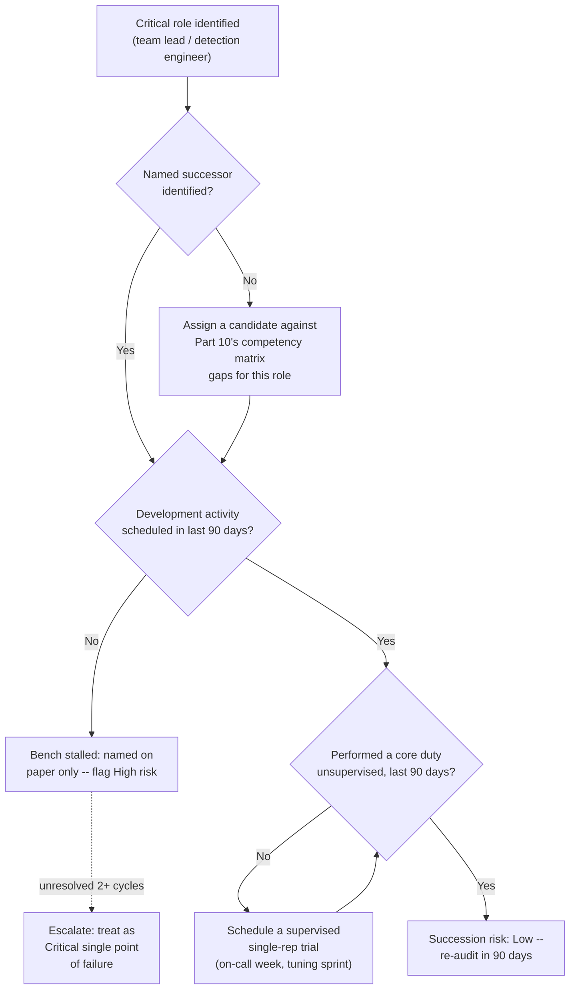

# Part 14 — Mentorship & Knowledge Transfer

## Why this part exists

**[CONCEPT]** A resignation letter doesn't remove a person from the org chart — it starts a clock. For most analyst seats, that clock is generous: the role is documented, the queue is shared, and a reasonably competent replacement can be productive within weeks. For two seats on almost every SOC roster, the clock is short and the damage compounds fast: the team lead who's been quietly absorbing every scheduling exception and every "who do I escalate this to" question for three years, and the detection engineer who's the only person who remembers why 40 suppression rules exist and which ones are load-bearing. When either one leaves without a plan already in motion, the team doesn't lose a person — it loses a function, for however long it takes to rebuild the knowledge and judgment that person carried alone.

This part covers three things: designing a formal pairing/mentorship program instead of leaving development to whichever pairs of people happen to like each other; capturing the tribal knowledge concentrated in one person's head before that person is walking out the door, not after; and building a named-successor plan for team-lead and detection-engineer roles specifically, because those two roles fail differently than a rotating analyst seat does. It deliberately does not cover the career-ladder criteria a successor is measured against — that's Part 13 — Career Ladders & Promotion Criteria — or the ongoing, breadth-building cross-training program that reduces single-points-of-knowledge-failure across the whole team as a matter of course, which is Part 12 — Ongoing Training & Skill Development's job. This part is narrower and more urgent than either: it's what a manager does about the specific knowledge and the specific roles where a gap is already forming, whether or not the broader training program has gotten there yet. It connects forward to Part 18 — Attrition & Retention, which quantifies the cost of the coverage crisis this part exists to prevent; read that part for what attrition costs, and this one for how to make sure a single resignation doesn't turn into one.

## 1. Two problems wearing one name

**[CONCEPT]** "Mentorship program" gets used as a label for two different things that fail for different reasons, and a program that conflates them usually does neither well.

### 1.1 Mentorship: a career-development relationship with an owner

**[HR/PEOPLE]** Mentorship is a standing relationship aimed at the mentee's general growth — judgment, communication, career direction, confidence in ambiguous situations — that has no fixed deliverable and no natural end date tied to a specific piece of information. A good mentor for a Tier 1 analyst two years into their first SOC job might spend a session talking about how to push back on a manager's unrealistic timeline, not about any specific detection or tool. The relationship's success metric is the mentee's trajectory over quarters, not a checklist of topics covered.

### 1.2 Knowledge transfer: capturing what one person's head currently holds alone

**[SENIOR MANAGER]** Knowledge transfer is narrower and has a deadline: a specific, nameable body of tacit knowledge — why this correlation rule's threshold is set where it is, which vendor contact actually picks up the phone during an outage, which three customers' environments have a quirk that breaks the standard playbook — currently exists in one person's head and needs to exist somewhere durable and shared before that person is unavailable, whether "unavailable" means resigned, on leave, or just on vacation during the one week it mattered. Unlike mentorship, knowledge transfer has a clear finish line: the knowledge is captured, or it isn't.

> **Manager's Note**
> If your "mentorship program" consists entirely of pairing a new hire with a senior analyst for their first 90 days, you don't have a mentorship program — you have an onboarding buddy system, and that's fine, but call it what it is. Onboarding's structure and pacing is Part 11 — Onboarding & Ramp-Up Programs's job; a mentorship program that only runs during someone's first 90 days on the team isn't investing in the analyst who's been there for two years and is starting to look at other postings.

The table below separates the two by owner, trigger, and how each is judged to have worked, because a program built to solve one badly serves the other.

| Dimension | Mentorship | Knowledge Transfer |
|---|---|---|
| Trigger | Ongoing career development, no specific event | A named departure, role change, or an identified single point of knowledge failure |
| Typical Duration | Months to years, informal end | Days to a few weeks, sharp end point |
| What's Captured | Judgment, confidence, career navigation | Specific facts, decisions, and undocumented context |
| Success Looks Like | Mentee's trajectory improves over quarters | A written, findable artifact exists and someone else can act on it |
| Primary Owner | The mentor and mentee, manager checks in | The manager, actively driving the timeline |
| Fails Silently When... | Pairing happens once, never followed up | The departing person's notice period runs out before the interview does |

## 2. Designing a formal pairing/mentorship program

### 2.1 Why "let it happen organically" guarantees uneven coverage

**[FRONTLINE MANAGER]** Informal mentorship happens to the analysts who are already easy to mentor — confident enough to ask a senior person for time, personable enough that a senior person offers it unprompted. It reliably skips the introverted analyst doing solid work in the corner of the queue, the remote hire who's never shared a physical break room with anyone senior, and the analyst whose personality doesn't naturally click with whoever's available. None of those are reasons to write someone off; they're reasons a manager can't rely on chemistry to distribute a resource this important.

> **Manager's Note**
> Ask your best analyst who their informal mentor is. If the honest answer is "nobody, I just figured it out," that's not a compliment to their independence — it's a data point that your program (if you have one) missed your strongest performer, and it'll miss the next one too unless assignment is deliberate rather than opt-in.

### 2.2 Matching mentors to mentees on more than tenure

**[HR/PEOPLE]** The default matching logic — most senior available analyst, paired with newest hire — optimizes for the wrong variable. Tenure predicts technical knowledge, not coaching ability, and a mentor who's a poor teacher but a strong individual performer produces a mentee who feels unsupported despite being "assigned" someone qualified. Match on three things instead: demonstrated willingness to teach (ask candidates directly, don't assume), a skill or knowledge gap the mentee actually has that the mentor actually holds, and enough scheduling overlap that the pairing can meet without either person's shift making it structurally hard. A mentor two time zones and a rotating shift away from their mentee will let the relationship lapse within a month, not because either person is negligent, but because "we'll grab fifteen minutes" never has a fifteen minutes that works for both of them.

### 2.3 Structure, cadence, and a defined end point

**[FRONTLINE MANAGER]** A pairing with no structure decays into occasional hallway chat, which is better than nothing but not what a program is for. Set a fixed cadence — every two weeks is a reasonable default for a working pairing, weekly for a mentee in their first six months past onboarding — a rough agenda template (not a rigid script) covering what's going well, what's stuck, and one thing the mentee wants to get better at before the next session, and a defined program length of six to twelve months with an explicit renewal decision at the end rather than a relationship that just trails off unacknowledged. An open-ended commitment with no review point is the single most common reason a mentoring pairing that started well goes quiet by month four: neither person wants to be the one to say it isn't working, so instead it just stops, with no signal to the manager that the mentee is now unsupported again.

### 2.4 What the program should never be used for

**[SENIOR MANAGER]** A mentor is not a shadow performance manager, and mentorship notes are not performance-review input. The moment a mentee suspects that what they say in a mentoring session might reach their formal review, they stop saying anything useful, and the program's actual value — a relationship where it's safe to admit "I don't understand this escalation path" or "I think I mishandled that ticket" — disappears. Keep mentorship structurally separate from the reporting line: a mentor should never be their mentee's direct manager, and a mentor should never be asked to report on a mentee's performance, only on whether the pairing itself is functioning.

> **Blind Spot**
> A program that measures itself by "number of active mentoring pairs" is measuring participation, not transfer. Two people can meet every two weeks for a year and produce nothing more durable than pleasant conversation if neither ever writes anything down or changes any observable behavior. Pair the participation count with a light mentee self-report every quarter — one question, "what's one specific thing you can do now that you couldn't six months ago" — or the program will report full health right up until the mentee who was quietly disengaged the whole time hands in their notice.

### 2.5 Sizing the program: how many pairs one manager can actually run

**[SENIOR MANAGER]** A manager personally checking in on every mentoring pair loses the ability to do that check-in honestly somewhere past eight to 10 active pairs — beyond that, "how's it going" stops being a real audit of the relationship and becomes a rubber stamp, because there isn't enough attention left to notice which pairs have quietly gone quiet. On a 30-analyst team, that arithmetic forces a choice: delegate pair oversight to team leads, each tracking their own shift's pairings and rolling up a summary rather than the manager owning every relationship directly, or run the program in cohorts — starting eight to 10 new pairs at a time, staggered a quarter apart, rather than pairing all 30 analysts simultaneously and being unable to meaningfully track any of them. Either choice is fine; running the program at a scale nobody can actually supervise is the failure mode, not a specific structure.

## 3. Capturing tribal knowledge before it walks out the door

### 3.1 Naming the risk: bus factor, not "hit by a bus"

**[SENIOR MANAGER]** The engineering-culture term for this is bus factor: the number of people who would need to become simultaneously unavailable before a specific piece of knowledge or capability is lost to the team. A bus factor of one on anything that matters is a standing risk, whether or not the specific person carrying it has any intention of leaving — illness, a sudden family emergency, or a competitor's unsolicited offer all produce the identical operational gap with none of the warning a two-week resignation notice at least provides. Part 12 — Ongoing Training & Skill Development owns the standing remedy for this at the skill-breadth level: cross-training analysts across specialties so competence isn't concentrated in one person in the first place. This part's job is narrower — finding the bus-factor-of-one knowledge that's already concentrated, right now, before the program-level fix has caught up to it, and doing something about the two roles (team lead, detection engineer) where that concentration is most damaging when it breaks.

### 3.2 The knowledge-capture audit

**[SENIOR MANAGER]** Most managers can't answer "what does this person know that nobody else does" with any precision until they're asked to answer it under deadline pressure during an exit interview, which is exactly the point at which the answer is hardest to extract completely. Run the audit before there's a departure: for each person in a role with meaningful bus-factor risk, list the systems they're the sole administrator or approver for, the vendor or client relationships they're the only point of contact for, the tuning decisions or exception lists with no documented rationale anyone else can point to, and the "who do you call" answers that only exist in their head. This is a 15-to-30-minute structured conversation, not a survey — most people can't self-generate this list unprompted, because knowledge that's become invisible to its holder ("of course everyone knows that") is exactly the knowledge most likely to be genuinely undocumented. Ask about, specifically:

- Systems or accounts where this person is the sole administrator, approver, or credential holder, including anything with a shared password only they actually know.
- Vendor, client, or cross-team contacts where this person is the only one with a working relationship — the person who actually returns a call inside an hour versus the generic support line everyone else gets.
- Tuning decisions, suppression rules, or exception lists with no written rationale anyone else can point to, including anything this person would describe as "we just always do it that way."
- The specific escalation judgment calls this person makes that a written runbook doesn't capture — not "what's the process" but "when do you deviate from the process, and how do you know."

Run this against every name on the §4.2 succession scorecard at minimum, and against any analyst whose unplanned two-week absence would visibly disrupt operations, whether or not they hold a title that sounds senior.

> **Field Test**
> **Setup:** Pick one analyst or engineer whose sudden two-week absence would meaningfully disrupt operations — not necessarily the one you'd guess first.
> **Action:** Without telling that person in advance, ask their manager or team lead to answer, from memory, the four questions in §3.2 (sole administration, sole points of contact, undocumented tuning rationale, "who do you call" knowledge) for that person's role.
> **Expected result:** If the manager can answer completely and cites a written source for each answer, bus-factor risk is genuinely low. If the manager has to guess, hedge, or say "I'd have to ask them," the audit has already found a real gap — treat that gap as the first item on the capture backlog, not as evidence the exercise failed.

### 3.3 Turning tacit knowledge into a durable asset

**[SENIOR MANAGER]** Capture only works if what comes out of the audit lands somewhere a second person will actually find and use it, which rules out a one-time knowledge-dump document nobody links to from anywhere the team actually looks. Where the captured knowledge is procedural — how to run a specific escalation, how to handle a specific recurring client request — it belongs in the same playbook library the rest of the team already checks, not a separate mentorship-program wiki nobody remembers exists.

> **Cross-Book Pointer**
> This part does not cover how to structure or write a good playbook once tribal knowledge needs to become one — that's SOC Playbook Handbook, Foundations / Playbook Library, which owns playbook mechanics across the whole series. Use the audit in §3.2 to find what needs writing down; use that book's structure to actually write it well.

Where the captured knowledge is a detection engineer's rule-tuning history and rationale, the format is different: it belongs as metadata traveling with the rule itself, not as prose in a separate document that will drift out of sync with the rule the moment someone edits it without also updating the write-up.

> **Cross-Book Pointer**
> This part does not cover how a detection repository should structure ownership metadata, version history, and review trails — that's Detection Engineering Handbook V2, Part 22 — Detection as Code, which treats exactly this problem (a rule's tuning rationale living only in one engineer's memory) as a structural risk to be solved with metadata standards and CI-enforced review, not as a documentation nice-to-have. A rule with no ownership metadata and no tuning history is, in that book's own terms, detection debt (Detection Engineering Handbook V2, Part 43 — Detection Debt) the moment its sole author becomes unavailable — this part's knowledge-capture audit is one of the ways that debt gets found before it comes due.

### 3.4 The exit-window sprint: knowledge transfer under a deadline

**[SENIOR MANAGER]** Once someone has actually given notice, knowledge transfer stops being a program and becomes a sprint with a hard deadline set by their last day. Prioritize by the audit from §3.2, not by whatever the departing person happens to think of first — left to their own judgment, most people over-document the interesting parts of their job and under-document the boring parts that turn out to be exactly the parts nobody else knows, because boring and undocumented tend to be the same knowledge for a reason.

**CASE-1401 — the two-week handoff.** *COMPOSITE CASE EXAMPLE — merges patterns from several mid-sized SOC detection-engineer transitions rather than tracing one identifiable organization; figures below are illustrative, not audited financials.*

A 14-analyst SOC runs one dedicated detection-engineer role, responsible for roughly 340 production rules and their entire suppression-list history. That engineer resigns with two weeks' notice, the contractual minimum, with no successor previously identified and no rule-ownership documentation beyond the rules' own query text.

```text
CONCEPTUAL SAMPLE -- illustrative figures, not sourced benchmark or audited financial data

Before departure:
  False-positive rate, team-wide: 8%
  Average tuning-request turnaround: 3 business days
  Rules with documented suppression rationale: ~40% (engineer's own estimate, unverified)

90 days after departure (no successor identified before notice was given):
  False-positive rate, team-wide: 19%
  Average tuning-request turnaround: 3 weeks
  Two rules silently disabled during a platform migration, unnoticed for 6 weeks
  Replacement hire time-to-start: 116 days
  Interim contractor cost to cover the gap: $46,000
  Estimated added analyst overtime handling elevated false-positive volume: $22,000 over the quarter
```

The two weeks were spent almost entirely on the departing engineer's own priority list — the rules they considered most technically interesting — rather than the audit-driven list from §3.2. Nobody asked, in the first three days, "which rules have a suppression exception with no written reason," which is precisely the category that produced the two silently-disabled rules six weeks later: a well-meaning successor, working from the query text alone with no rationale attached, disabled what looked like dead weight during an unrelated migration and had no way to know it was covering a real gap.

> **Management Autopsy — "let the departing engineer run their own two-week handoff"**
>
> **The decision:** The manager gave the departing detection engineer their final two weeks to "get everything documented" with no specific priority list, trusting their judgment about what mattered most to hand off.
>
> **Why it seemed reasonable:** The engineer knew the rule set better than anyone else on the team; asking them to self-direct the handoff looked like the most efficient use of a short, fixed window, and it avoided an awkward conversation about exactly how much the team didn't already know.
>
> **How it failed:** People documenting their own departure default to what's interesting or impressive to write about, not what's dangerous to lose — the suppression exceptions with no recorded rationale never made the list because the departing engineer had long since stopped thinking of them as knowledge at all; they were just "how it's always been."
>
> **The fix:** Run the §3.2 audit before the notice period starts wherever possible, or on day one of it at the latest, and hand the departing person a prioritized list ranked by bus-factor risk, not a blank two weeks and good intentions. The audit turns "document what you think matters" into "document these 14 specific things, in this order," which produces a finished, ranked artifact even if the full list never gets covered before the last day.

## 4. Succession planning for team-lead and detection-engineer roles

### 4.1 Why these two roles fail differently than a rotating analyst seat

**[SENIOR MANAGER]** A vacant Tier 1 analyst seat is a capacity problem: the queue gets a little slower until the seat is filled, and any reasonably competent hire restores capacity once trained. A vacant team-lead or detection-engineer seat is a judgment problem: the team lead's replacement doesn't just need to know the schedule, they need the accumulated, situational judgment about which analyst is close to burnout, which escalation actually needs the manager pulled in versus handled at the team-lead level, and which recurring client complaint is really a symptom of something else — none of which is written down anywhere, because it's the kind of knowledge that only accumulates by doing the job. The detection engineer's replacement doesn't just need the query syntax, they need the years of accumulated false-positive history that explains why 40 exceptions exist and which 10 of them are load-bearing rather than stale. Both roles concentrate exactly the kind of tacit, undocumented judgment §3 is built to find and capture — the difference here is that succession planning tries to solve it before a vacancy exists at all, by having a specific named person already developing toward readiness.

### 4.2 Building the bench before there's a vacancy

**[SENIOR MANAGER]** A defensible succession plan names a specific person, states specifically what that person still needs before they're ready, and puts a real development activity against that gap on a real calendar — not a name scribbled on a whiteboard next to "eventually." For a team-lead successor, that development activity might be co-running one QA calibration session a month (Part 15 — Quality Assurance Programs owns the calibration mechanics themselves), owning the on-call escalation phone for one week a quarter under the current lead's supervision, and sitting in on one budget or staffing conversation a quarter so the business side of the role isn't a total surprise on day one. For a detection-engineer successor, it might mean co-owning tuning decisions on a defined subset of rules for two consecutive quarters, with the current engineer required to explain their reasoning out loud rather than just approving the change — the explaining is the actual transfer mechanism; silent approval transfers nothing.

> **Manager's Note**
> Don't wait for a successor to feel fully ready before giving them real, unsupervised reps at pieces of the role — a successor who's never run the on-call phone alone, only shadowed it, will freeze the first time they have to make a call with no one to check with. Give them the training wheels off for something low-stakes on purpose, on a schedule you control, rather than the first time being an actual emergency with no notice.

The scorecard below turns "we have a bench" into something a manager can actually audit role by role, rather than a comforting assumption that dissolves the moment someone checks.

**Table 4.1 — Succession-readiness scorecard, worked example.** *(CONCEPTUAL SAMPLE — illustrative role names and dates, not a specific team's actual roster.)* Run this structure against every role named in §4.1, not just the one already causing visible pain.

| Role | Named Successor Identified? | Development Activity on a Real Calendar? | Performed Core Duty Unsupervised, Last 90 Days? | Succession Risk Rating |
|---|---|---|---|---|
| Team lead, Shift A | Yes — senior analyst J.R. | Yes — monthly calibration co-lead | Yes — ran on-call week solo in Q2 | Low |
| Team lead, Shift B | Yes — senior analyst on paper | No — no activity scheduled since naming | No | High — named but stalled |
| Detection engineer | No | — | — | Critical — single point of failure, no bench at all |

### 4.3 What a defensible succession plan costs, and what skipping it costs

**[SENIOR MANAGER]** A working bench isn't free, but it's cheap relative to the alternative, and a manager defending the time investment to a budget-conscious director needs both numbers in the same room.

**CASE-1402 — the bench that held.** *COMPOSITE CASE EXAMPLE — merges patterns from several succession-planning efforts; figures below are illustrative, not sourced financial or benchmark data.*

A 22-analyst SOC running three shifts staffs two team-lead roles. A full 12 months before either lead's most likely departure window (no resignation had occurred yet — this is the planning case, not the recovery case), the manager names one senior analyst per shift as a development-track successor and commits roughly four hours a month of paired time per pairing to the activities in §4.2.

```text
CONCEPTUAL SAMPLE -- illustrative figures, not sourced benchmark or audited financial data

Cost of running the bench, per successor, per year:
  ~48 hours of paired developmental time (4 hrs/month x 12)
  Rough fully-loaded cost of that time at senior-analyst rates: ~$3,000/year

Cost of an unplanned team-lead vacancy with no bench, same organization:
  Time to source and onboard an external team-lead hire: 90-120 days
  No interim leadership during that window -- shift runs on ad hoc peer coverage
  Estimated added overtime and coverage-gap cost across the vacancy window: $28,000-$40,000
  Team-lead-level judgment calls (schedule exceptions, escalation triage) made by
    whichever senior analyst is on shift, with no formal authority or documented criteria
```

One shift's lead resigns eight months into the plan. The named successor takes over the same week on a defined 30/60/90-day reduced-queue ramp — a lighter individual caseload for the first 30 days while they get their footing, full team-lead duties by day 60, and a formal check-in at day 90 — instead of stepping into the role at full weight on day one. No external search runs, no interim-leadership gap opens, and the shift never runs without a clear decision-maker. The other shift's lead does not resign during the period covered by this case; the point of the comparison is the avoided cost of the scenario that didn't happen, not a claim that succession planning is free insurance against every departure.

> **Blind Spot**
> "Named successor identified" is the easiest column in the §4.2 scorecard to fill in and the easiest one to be wrong about, because naming someone costs nothing and changes nothing on its own. A name with no development activity attached for six months isn't a bench — it's a name, and it will fail exactly like having no plan at all the moment it's tested, just with an extra layer of false confidence built in. Audit the middle two columns, not just the first one.

Below is the succession-readiness pipeline this section assumes: how a role moves from "no named successor" to "succession risk: low," and where the process most commonly stalls.





**Figure 14.1 — Succession-readiness pipeline.** *CONCEPTUAL.* Shows the succession-readiness pipeline as a rendered flowchart. It supports the readiness scorecard in §4.2 and the risk ratings used in Table 4.1 and CASE-1402 — a role sits at whichever node in this pipeline its scorecard row actually shows, not wherever its manager assumes it sits. `FIG-1401`.

### 4.4 Recognizing false readiness

**[SENIOR MANAGER]** A successor can clear every column on the §4.2 scorecard — named, scheduled development activity, one unsupervised rep on record — and still not be ready, because a single rep during a calm week tests almost nothing. Before signing off on a successor as fully ready, check for three specific gaps a clean scorecard hides: whether they've ever exercised the role's authority when something was actually going wrong, not just during routine coverage; whether they've ever had a peer or an analyst push back on a call they made and had to hold their ground or productively change their mind, rather than every decision so far going uncontested; and whether they've ever made an unpopular call — a schedule denial, a tuning decision someone disagreed with — that stuck without the current role-holder quietly overriding it afterward. A successor who's only ever been tested on easy days looks identical, on paper, to one who's actually ready, right up until the first hard day lands on their desk alone.

## 5. Measuring whether any of this is actually working

**[SENIOR MANAGER]** Mentorship and knowledge-transfer programs are easy to run in a way that looks healthy on a status slide and is quietly failing underneath it, because the easiest things to measure — pairs formed, documents written, successors named — are participation counts, not outcome measures. Track the pair below instead: an activity count and the outcome it's a weak proxy for, so a gap between the two shows up before it becomes a crisis.

| Leading Indicator (Easy to Game) | What It's a Proxy For | Better Outcome Check |
|---|---|---|
| Number of active mentoring pairs | Career development actually happening | Quarterly mentee self-report: one concrete thing they can now do that they couldn't six months ago |
| Number of playbooks/runbooks written from the §3.2 audit | Tribal knowledge actually captured | A second person, cold, successfully executes the documented procedure without asking the original author for help |
| Number of roles with a "named successor" | Real succession readiness | The §4.2 scorecard's middle two columns — scheduled development activity and a recent unsupervised rep — not just the name field |
| Documentation exists for a rule/process | Documentation stays current | Last-reviewed date on the document is inside the last two review cycles, not from the year it was first written |

**[SENIOR MANAGER]** Own the §3.2 audit and §4.2 scorecard directly rather than delegating them to an HR partner, and run both on a fixed cadence — every two quarters is a reasonable default — rather than only when a departure prompts one. An HR partner's natural view into this problem is the exit interview, which is Part 18's territory and by definition arrives after the person has already decided to leave; the audit and scorecard in this part are only useful run *before* that decision, on a schedule that doesn't wait for a resignation letter to trigger them.

> **What Would Change My Mind**
> This part treats named-successor programs and structured knowledge-capture audits as materially better than relying on informal mentorship and ad hoc documentation. If teams that skipped both — no formal succession scorecard, no audit-driven capture sprint — recovered from team-lead and detection-engineer departures just as fast and just as cleanly as teams that ran them, purely on the strength of a strong general culture of documentation and cross-training, that would undermine this part's case for the specific, formal mechanisms described here rather than trusting Part 12's broader cross-training program to eventually cover the same ground on its own.

## 6. Where this connects

**[CONCEPT]** Everything in this part is preventive. It doesn't tell a manager what to do once a coverage crisis has already started — that's the cost model, the exit-interview analysis, and the retention levers covered in Part 18 — Attrition & Retention, which this part exists specifically to keep a manager from needing on short notice. It assumes the competency matrix from Part 10 — Competency Models & Skills Matrices as the yardstick for "ready" in §4.2's scorecard, the onboarding structure from Part 11 — Onboarding & Ramp-Up Programs as the thing formal mentorship is not a substitute for, the cross-training program from Part 12 — Ongoing Training & Skill Development as the standing, breadth-level version of the bus-factor fix this part applies narrowly and urgently, and the promotion criteria from Part 13 — Career Ladders & Promotion Criteria as what a successor is ultimately measured against once they're actually promoted into the role they've been developing toward.

**Cross-references:** Within this book, assumes Part 3 (role definitions for team lead and detection-engineer tiers), Part 10 (competency matrix as readiness criteria), Part 11 (onboarding, distinct from ongoing mentorship), Part 12 (cross-training as the standing breadth-level fix), and Part 13 (promotion criteria a successor is measured against); points forward to Part 18 (the cost of the coverage crisis this part prevents) and Part 15 (calibration-session mechanics referenced in §4.2). Outside this book: SOC Playbook Handbook, Foundations / Playbook Library (playbook structure for captured procedural knowledge) and Detection Engineering Handbook V2, Part 22 — Detection as Code and Part 43 — Detection Debt (rule-ownership metadata and the debt that accrues without it).
