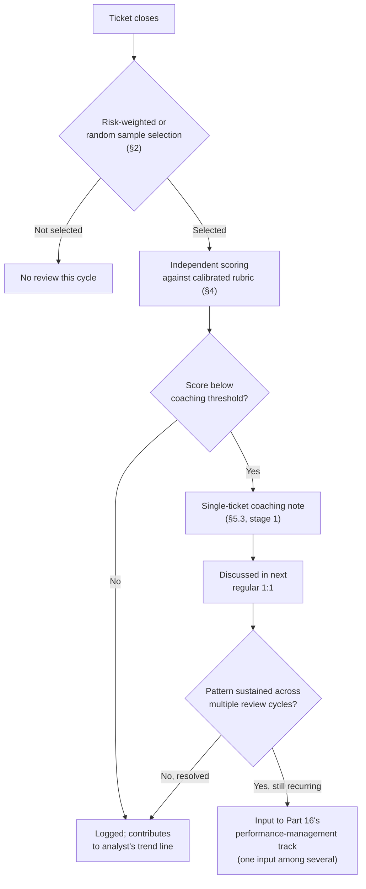
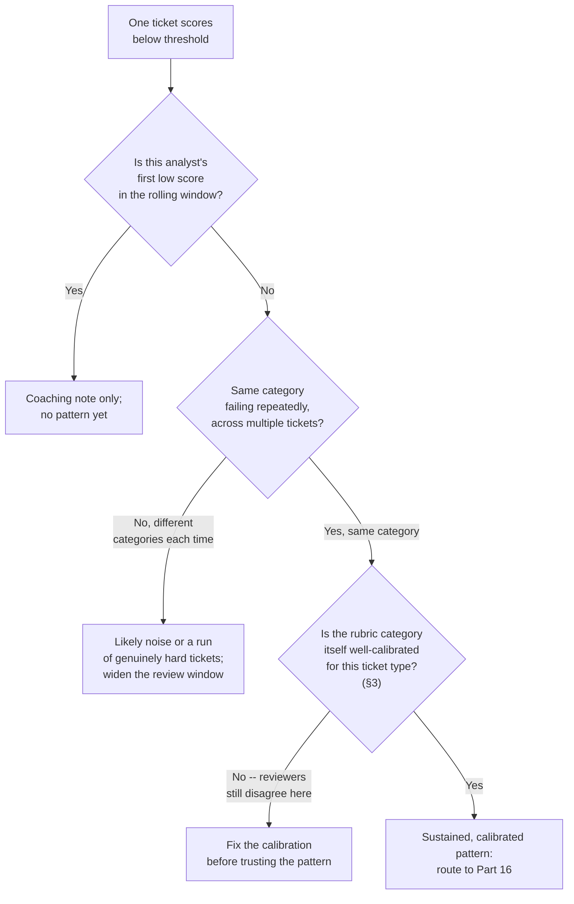

# Part 15 — Quality Assurance Programs

## Why this part exists

**[CONCEPT]** A SOC manager who has never built a formal QA program still has an opinion about ticket quality — it comes from whichever tickets happened to cross the manager's own desk that week, which is not a sample, it's whoever escalated loudest or broke something visibly. A QA program's entire job is to replace that accidental, unrepresentative view with a deliberate one: pull a defined slice of closed work on a schedule nobody can predict, score it against a rubric more than one person has agreed means the same thing, and route what that scoring finds into a coaching conversation before it ever becomes a number on a review form. Three separate mechanics sit inside that one sentence — sampling, calibration, and the score-to-coaching pipeline — and this part builds all three.

**[CONCEPT]** SOC Playbook Handbook, Part 27 — Escalation Quality already owns what a good hand-off from Tier 1 to Tier 2 looks like, mechanically, on one ticket: what context has to travel, what a receiving analyst needs to not have to re-triage from scratch. This part does not re-derive that standard. It assumes a mechanical definition of "good" already exists somewhere — Part 27's, or an internal playbook built on top of it — and answers a different question: at scale, across hundreds of tickets a month and a dozen analysts, is that standard actually being met, by whom, how consistently, and what happens once you find out it isn't. Escalation Quality is the rubric's raw material. QA is the program that applies a rubric to a sample, again and again, on a schedule, with more than one reviewer, and turns the result into something an analyst can act on. Confusing the two produces a chapter that either drifts into re-explaining escalation mechanics this book has no business owning, or a QA program with no defined standard to score against — this part is built to avoid both failure modes.

**[CONCEPT]** This part also stays out of two other adjacent chapters' territory on purpose. Part 16 — Performance Management & Coaching owns the 1:1 cadence, the performance-improvement-plan mechanics, and the diagnostic judgment call of whether a recurring miss is a skill gap, a training gap, or a bad process the analyst was set up to fail by. This part's job ends at producing a calibrated, trustworthy QA score and routing it toward that conversation — not running the conversation itself. And SOC Playbook Handbook, Part 32 — Metrics owns the definitions of MTTR, handle time, and false-positive rate; a QA score is a different kind of measurement entirely — a qualitative rubric judgment about one piece of work, not a queue-level throughput statistic — and this part is careful never to let the two blur into each other.

## 1. What a QA program measures, and what it doesn't

### 1.1 The unit of analysis is the sample, not the analyst

**[CONCEPT]** A QA program's raw unit of analysis is one reviewed ticket, scored against a rubric, by a reviewer who wasn't the analyst who worked it. An analyst's QA standing is not a single number — it's the trend line across a rolling window of that analyst's sampled tickets, because any individual ticket can be an outlier in either direction: the easiest false positive of the month scored perfectly, or a genuinely hard multi-stage incident scored a 2 out of 5 on "escalation judgment" because the analyst made one defensible-but-wrong call under real ambiguity. A program that reacts to a single ticket's score as if it were the analyst's whole performance record has confused the sample with the population it's meant to estimate.

**[SENIOR MANAGER]** That distinction matters because it sets the bar for what a QA finding can responsibly justify. One low-scoring ticket is a coaching prompt — a specific thing to walk through in the next 1:1. A sustained pattern across a defined number of consecutive review cycles is the kind of evidence Part 16's performance-improvement-plan process needs before it acts. A program that skips straight from "this one ticket scored low" to a documented performance conversation is treating a single data point as if it had the statistical weight of a trend, and analysts notice the inconsistency immediately even when they can't name it that precisely.

### 1.2 Distinguishing QA from the metrics a manager already tracks

**[SENIOR MANAGER]** A queue dashboard already reports MTTR, handle time, and ticket volume per analyst — numbers that exist automatically as a byproduct of the ticketing system, with no reviewer required. A QA score is not a faster or cheaper version of that same information; it answers a question none of those numbers can. Handle time tells you an analyst closed a ticket in nine minutes. It says nothing about whether the nine-minute close correctly ruled out lateral movement or missed it. A fast, wrong disposition and a fast, right one produce identical throughput numbers and opposite QA scores — which is the entire reason a program that only watches the dashboard and never opens a ticket to read it can run for years believing it has a well-performing team.

> **Cross-Book Pointer**
> This part does not define MTTR, handle time, or false-positive rate, and a QA scorecard should never quietly redefine them either — those definitions live in SOC Playbook Handbook, Part 32 — Metrics, and Part 5 and Part 24 of this book consume them as already-settled inputs. A QA score sits next to those metrics on a manager's dashboard, not inside their definitions; treat a rising QA score alongside a flat MTTR as two independent facts about the same team, not one number restated as two.

**[CONCEPT]** The two measurements are complementary rather than competing precisely because of where each one gets its evidence. A throughput metric comes from the ticketing system's own timestamps and requires no human judgment to produce, which makes it cheap and complete — every ticket contributes, all the time — but blind to correctness. A QA score comes from a human reviewer reading the actual work, which makes it expensive and necessarily partial — nobody reviews every ticket — but the only source of evidence a manager has for whether the work itself was any good. Section 2 builds the sampling methodology that decides which slice of that expensive evidence you can actually afford to collect.

## 2. Building a sampling methodology

### 2.1 Why full review is neither possible nor desirable

**[SENIOR MANAGER]** Reviewing every closed ticket sounds like the safest possible QA program until the arithmetic lands: a fully scored review — reading the ticket, checking the underlying telemetry the analyst worked from, scoring five or six rubric categories, and writing a note — takes a reviewer somewhere in the range of 15 to 25 minutes per ticket, even for a straightforward case. A 20-analyst SOC closing a combined 4,000 tickets a month at 20 minutes each would need roughly 1,333 reviewer-hours a month — roughly eight full-time reviewers doing nothing else, on a team that size, purely to check the work of the people actually working the queue. Full review isn't a rigorous version of QA; it's a second SOC built to watch the first one.

**[SENIOR MANAGER]** The real design question a sampling methodology answers is not "how do we review everything" but "what slice of the work, reviewed well, tells us the most about the team's actual quality per hour of reviewer time spent." That reframing is what makes stratified and risk-weighted sampling better than either full review or pure random sampling, covered next.

### 2.2 Three sampling approaches, compared

**[SENIOR MANAGER]** The table below compares the three sampling approaches a QA program actually chooses between, on the dimensions that drive the choice: what gets pulled, what it's good at catching, and where it leaves a gap (CONCEPTUAL SAMPLE — illustrative comparison, not validated against a specific program's measured outcomes).

**Table 15.1 — Sampling approach comparison.** *(CONCEPTUAL SAMPLE.)* Use this table to decide which approach — or, more often, which blend of approaches — fits a specific queue's risk profile before building the sampling formula in §2.3.

| Approach | How the Sample Is Pulled | Good At | Where It Leaves a Gap |
|---|---|---|---|
| Pure random | Every closed ticket has an equal chance of selection, regardless of severity or analyst | Giving an unbiased read on average quality across the whole queue | A rare but high-consequence ticket type (a real intrusion, a P1) may go months without ever landing in the sample by chance alone |
| Risk-weighted / stratified | Sampling rate varies by severity or ticket type — for example, 100% of P1/P2 escalations, a smaller fixed percentage of routine P3/P4 closures | Guaranteeing review of the tickets where a missed error costs the most | Routine, high-volume ticket types get thin coverage per analyst even at a nonzero rate, if volume is high enough |
| Targeted / triggered | Pulled in response to a specific signal — a customer complaint, a reopened ticket, a near-miss flagged by another analyst | Investigating a known concern quickly, with high relevance per ticket reviewed | Says nothing about baseline quality on the vast majority of tickets that never trigger a flag; can't be the *only* method a program runs |

**[SENIOR MANAGER]** Almost no working QA program picks one row and stops — the standard structure blends risk-weighted sampling as the backbone (so nothing severe goes unreviewed) with a random baseline slice layered on top (so routine work still gets an unbiased check) and targeted pulls reserved for specific complaints or reopened tickets, which are useful precisely because they're the exception, not the method the whole program rests on.

### 2.3 Sizing the sample: a worked example

**[SENIOR MANAGER]** **CONCEPTUAL SAMPLE — illustrative sampling math for a 20-analyst SOC; not sourced benchmark data.**

A 20-analyst in-house SOC closes roughly 4,200 tickets a month across its combined queue — about 210 tickets per analyst, a mix dominated by routine P3/P4 alert triage with a much smaller volume of P1/P2 escalations, averaging around 140 P1/P2 tickets a month across the whole team. Built on the blended approach above, the program reviews 100% of the roughly 140 P1/P2 tickets (because a missed error there is the one the board eventually hears about) plus a 3% random slice of the remaining 4,060 routine tickets, which comes to about 122 additional reviews. That's 262 reviewed tickets a month out of 4,200 — a 6.2% overall sample rate — but the sample isn't evenly spread: every P1/P2 ticket gets checked, and each routine ticket has roughly a 1-in-33 chance of being pulled.

At 20 analysts and 262 reviewed tickets, that averages to about 13 reviewed tickets per analyst per month — comfortably above the rough floor of four to six reviewed tickets per analyst per month this book treats as the minimum needed for a monthly trend line to mean anything at all, rather than reacting to noise from one or two tickets. At roughly 20 minutes per full scored review, 262 tickets costs about 87 reviewer-hours a month — a bit over half of one dedicated full-time reviewer's capacity, in practice usually split across two or three team leads doing QA review alongside their other duties rather than one person doing it full time.

> **Blind Spot**
> Every sampling method above only pulls from tickets that exist in the system — closed, documented, with a case ID. It has nothing to say about an alert an analyst looked at, silently judged not worth a ticket, and closed without ever creating a record, or a watch item mentioned once in a shift handoff and never followed up on. A QA program built entirely on ticket sampling can report a clean, high-scoring quarter while missing exactly the disposition an analyst never wrote down in the first place — which is also, not coincidentally, the disposition most likely to be wrong.

## 3. Calibration sessions: getting reviewers to agree

### 3.1 Why one reviewer's judgment isn't enough

**[CONCEPT]** A rubric with five categories and a 1-to-5 scale looks precise on paper, but "precise" and "consistent across reviewers" are different properties, and a program only has the second one if it checks for it directly. Two team leads reading the identical ticket will drift toward different scores for reasons that have nothing to do with the ticket — one reads "escalation judgment" as forgiving toward a defensible-but-wrong call, the other reads it strictly; one weighs documentation completeness heavily because that's what burned them personally on a past incident, the other barely notices it. Neither reviewer is acting in bad faith. Left unchecked, an analyst's QA trend becomes as much a measurement of which team lead happened to review their tickets that month as a measurement of the analyst's own work — and once that's true, the score has stopped measuring what the program claims it measures.

**[FRONTLINE MANAGER]** Calibration is the fix, and it's a specific exercise, not a synonym for "the reviewers talked about it once." Multiple reviewers independently score the same ticket, compare results, and — critically — resolve *why* they disagree into a written anchor: a concrete example of what a 2 looks like in this category versus what a 4 looks like, attached to the rubric itself so the next reviewer doesn't have to reconstruct the same judgment call from first principles.

### 3.2 Running the session

**[FRONTLINE MANAGER]** A calibration session needs, at minimum, every person who currently reviews QA tickets in the room, a small batch of already-closed tickets (five to 10 is enough for one session) nobody has scored yet, and the rubric itself. Each reviewer scores the batch independently and privately before anyone compares notes — comparing first and scoring second defeats the entire purpose, because it just produces polite convergence toward whoever spoke first rather than an honest read of where real disagreement lives.

> **Manager's Note**
> Tell reviewers the rubric's categories and scale in advance — that part should never be a secret, since a reviewer can't score consistently against criteria they haven't internalized. Never tell them, in advance or after the fact, which specific closed tickets will end up in a live sample; those are two different kinds of transparency, and a program that keeps both open ends up with reviewers who understand the standard and analysts who've learned exactly which tickets are safe to under-document.

**[FRONTLINE MANAGER]** Once scores are compared, the session's real work is the categories where scores diverge, not the ones where everyone already agreed — an easy convergence needs no discussion, and spending session time congratulating each other on it is the single most common way a calibration session runs out of time before reaching the categories that actually needed it. For each divergent category, the group talks through what specifically in the ticket each reviewer weighed differently, and writes down the resolution as a concrete anchor example other reviewers can apply later without re-litigating the same disagreement from scratch.

### 3.3 Measuring whether calibration actually worked

**[SENIOR MANAGER]** **CONCEPTUAL SAMPLE — illustrative inter-rater agreement figures; not sourced benchmark data.**

Four reviewers — two team leads, a dedicated QA specialist, and the SOC manager — independently scored the same batch of 10 previously closed tickets against a five-category rubric, before any calibration session had been run. On the "escalation judgment" category, one ticket drew scores of 2, 4, 3, and 5 from the four reviewers — a three-point spread on a five-point scale, the widest disagreement in the batch. On "documentation completeness," the same ticket drew 4, 4, 3, and 4 — reviewers already agreed there without any intervention. Averaged across all five categories and all 10 tickets, only 58% of individual category scores landed within one point of that ticket's median score across reviewers — the working definition of "agreement" this program adopted, since a five-point rubric with reviewers routinely three points apart isn't measuring anything reliably.

A calibration session followed the structure in §3.2, producing two written anchor examples for each of the categories that showed the worst spread. Reviewers then rescored the same 10-ticket batch blind — without being shown their own earlier scores — roughly two weeks later. Agreement rose to 84%. A second session six weeks after that, prompted by a handful of new edge cases the first anchors hadn't covered, held agreement at 86%, which the program set as its working threshold: scores from a rubric with less than roughly 80% inter-rater agreement across a calibration batch aren't yet trustworthy enough to route into a coaching conversation, let alone anything Part 16's performance-management process would act on.

> **Field Test**
> **Setup:** A rubric and at least two active reviewers, with no calibration session run yet this quarter.
> **Action:** Have every active reviewer independently score the same batch of eight to 10 already-closed tickets, without comparing notes first. Run one calibration session per §3.2, then have the same reviewers blind-rescore the identical batch at least two weeks later.
> **Expected result:** Category-level agreement (scores within one point of the batch median) should rise measurably between the first and second round — a meaningful jump is normal and expected. If agreement doesn't move, or moves and then collapses again within a quarter, the anchors from the session weren't specific enough to actually change how reviewers score, and the session needs to be rerun with sharper examples rather than assumed to have worked because it happened.

> **Cross-Book Pointer**
> A calibration session inevitably surfaces disagreement about what a *good escalation* actually looked like on a specific ticket — that's the moment to reach for SOC Playbook Handbook, Part 27 — Escalation Quality's mechanical definition rather than let the room negotiate its own standard from scratch. Calibration should resolve *how consistently reviewers apply* an existing standard, not invent a competing one; if a session keeps producing disagreements that trace back to "what does a good hand-off even require," the gap is in the team's shared understanding of Part 27, not in the QA rubric.

## 4. The QA scorecard: what a rubric should measure

### 4.1 Category selection

**[SENIOR MANAGER]** A rubric with too many categories collapses under its own weight in a calibration session — 10 categories times a five-point scale gives reviewers 50 independent judgment calls per ticket, most of which end up correlated with each other anyway (an analyst who documents poorly usually communicates poorly too, so scoring both separately mostly adds review time without adding distinct information). Five or six categories, weighted by how much each one actually predicts downstream risk, covers what most SOCs need without diluting reviewer attention across categories that don't move independently of each other.

**[SENIOR MANAGER]** The categories below tie back to the competency dimensions Part 10 — Competency Models & Skills Matrices already defines for tiering and promotion decisions, deliberately reusing the same vocabulary rather than inventing a second, QA-specific taxonomy an analyst has to learn on top of the one that already governs their career progression.

### 4.2 A worked rubric

**[SENIOR MANAGER]** The table below is an illustrative starting rubric, not a fixed standard every SOC should adopt unmodified — weight distribution should reflect what a specific program's own incident history says actually predicts a missed threat, which is a question worth revisiting annually rather than answering once and freezing (CONCEPTUAL SAMPLE — illustrative weighting, not derived from a specific program's validated outcome data).

**Table 15.2 — Illustrative QA scorecard rubric.** *(CONCEPTUAL SAMPLE.)* Use this table as a starting structure for a program's own rubric, built out in full in Appendix A4's QA scorecard template; the weights are a reasonable default, not a number to defend unmodified to a skeptical analyst who's done the math on their own score.

| Category | Weight | What a 5 Looks Like | What a 1 Looks Like |
|---|---|---|---|
| Technical accuracy | 30% | Correct disposition, correctly supported by the evidence actually reviewed | Wrong disposition, or right disposition reached by coincidence rather than the evidence |
| Escalation judgment | 25% | Escalates or closes at the right point, with the context Part 27 requires already attached | Escalates everything reflexively, or sits on something that should have moved, with no defensible reasoning either way |
| Documentation completeness | 20% | A second analyst could pick up the case cold and understand what was checked and ruled out | Case notes name a verdict with no trail showing how it was reached |
| Process adherence | 15% | Followed the applicable playbook step order; deviations are logged with a stated reason | Skipped required steps with no record of why |
| Communication and tone | 10% | Clear, calibrated urgency in any customer- or stakeholder-facing note; no unnecessary alarm or false reassurance | Tone mismatched to actual severity, in either direction |

**[HR/PEOPLE]** The weighting itself is a policy statement a manager should be able to defend out loud: technical accuracy and escalation judgment together account for 55% of the score deliberately, because a beautifully documented wrong disposition is still a wrong disposition, and a program that weighted documentation as heavily as accuracy would be rewarding good paperwork over good judgment. An analyst who disputes their score is, in effect, disputing either the facts of one ticket or this weighting — and a program that can show its weighting logic survives that conversation far better than one that can only say "that's just what the form says."

## 5. From QA score to coaching input — not a punitive scorecard

### 5.1 What the pipeline has to protect against

**[CONCEPT]** A QA score that reaches an analyst with no defined next step invites the worst version of both possible failure modes: either it's ignored entirely because nothing ever happens as a result, or it becomes the thing an analyst fears most because the *first* time it visibly mattered was a bad surprise — tied to a bonus, a PIP, or a comment in a review the analyst never saw coming. Neither failure comes from the scoring itself; both come from never designing what happens after the score exists. Section 5.2 through 5.4 build that pipeline; the case below shows exactly what happens when it's skipped.

### 5.2 Management Autopsy — the bonus-linked scorecard

> **Management Autopsy — "tie QA score directly to the quarterly bonus" (COMPOSITE CASE EXAMPLE, `CASE-1501`)**
>
> **The decision:** A 30-analyst MSSP SOC linked its QA score directly to a quarterly performance bonus on a fixed schedule: an average score of 85 or above across the quarter's reviewed tickets earned the full 10% bonus, 70 to 84 earned half, and anything below 70 earned nothing.
>
> **Why it seemed reasonable:** Leadership had heard a real, valid complaint for over a year — that QA feedback was soft, got nodded at in 1:1s, and never visibly changed anyone's behavior. Attaching real money to the score looked like the fix: give the program teeth, and analysts would finally take it seriously.
>
> **How it failed:** The monthly sample was pulled from a static report that always exported closed tickets in the same fixed order, which in practice meant tickets closed in the first 10 days of the month were reviewed far more often than tickets closed in the last 10. Within two quarters, this had spread by word of mouth across the floor, and a later audit found documentation completeness scoring an average of 92% on early-month tickets against 61% on late-month tickets, for the same analysts working the same ticket types — a 31-point gap explained entirely by which window of the month a ticket happened to close in, not by any difference in the underlying work. Analysts weren't lying about their tickets; they'd correctly identified which slice of their own output was actually being watched and put their limited documentation effort there instead of spreading it evenly. Meanwhile, voluntary attrition among analysts with more than two years of tenure rose from a baseline of roughly 15% annualized to 33% annualized across the two quarters after the bonus linkage took effect; two of the four departing senior analysts named the QA-bonus scheme specifically in their exit interviews as feeling arbitrary and gameable — a complaint that damaged trust in the scores even on the tickets where they'd been scored accurately.
>
> **The fix:** Sampling moved to a continuous, rolling pull across the entire month rather than a single monthly export in a fixed, learnable order, and the raw score was decoupled from direct compensation entirely. A single low-scoring ticket became a coaching prompt for the next 1:1, full stop; only a sustained pattern across several consecutive review cycles — the trend line described in §1.1 — became an input to Part 16's performance-improvement-plan process, and even then as one input among several, not an automatic trigger on its own. The program also stopped publishing the specific export mechanics of its sampling, while still publishing the rubric categories in full, so analysts understood exactly what "good" meant without being able to reverse-engineer which tickets were safe to under-document.

### 5.3 The score-to-consequence pipeline, designed on purpose

**[SENIOR MANAGER]** The pipeline that survives the failure mode above has three distinct stages, and skipping straight from scoring to consequence is what breaks it: a single reviewed ticket produces a score and, where it's low, a specific coaching note about what to do differently; a rolling window of scored tickets (the same trend line from §1.1) produces a pattern an analyst's direct manager discusses in a normal 1:1 cadence, framed as development, not discipline; and only a documented, sustained pattern that survives that coaching conversation without improving becomes an input to Part 16's formal performance-management track. Compensation, where a QA-linked incentive exists at all, should attach to the third stage at the earliest — never the first, and case CASE-1501 above is the reason why.

> **People Risk Trap**
> Letting one team lead be both the only person who reviews their own reports' tickets and the only rater of those same reports' performance concentrates every calibration failure and every personal bias into one unchecked channel — a generous reviewer and a strict one produce different scores for identical work, and if review assignment tracks management-reporting lines exactly, an analyst's QA trend becomes partly a measurement of which manager they happen to report to. Rotate reviewer assignment away from direct-report lines wherever team size allows it, and calibrate across reviewers (§3) specifically so a score means roughly the same thing regardless of who pulled the ticket.

### 5.4 Validating the pipeline actually works this way

> **Field Test**
> **Setup:** At least one full quarter of QA scores has been recorded, including some below the program's coaching threshold.
> **Action:** Pull every ticket-level score from that quarter that fell below the threshold. For each one, independently ask the analyst whose ticket it was whether a specific coaching conversation referencing that score happened within about two weeks of the score being recorded.
> **Expected result:** Close to all of them should say yes, with the analyst able to name at least roughly what the conversation covered. A pattern of "no" answers, or answers where the analyst didn't know the score existed at all, means the score is sitting in a spreadsheet rather than functioning as the coaching input the program claims to provide — the pipeline exists on paper but isn't actually running.

## 6. Program governance: ownership, cadence, and cost

### 6.1 Who owns each step

**[SENIOR MANAGER]** QA program ownership splits cleanly across a small number of roles, and the table below states who's accountable for each step versus who's merely consulted or informed — worth pinning down explicitly, because "QA is everyone's job" in practice usually means nobody actually owns the parts that go quiet first, which is calibration cadence and rubric maintenance.

**Table 15.3 — QA program RACI.** *(CONCEPTUAL SAMPLE.)* Use this table when a program's ownership is informal or contested — most commonly when a team lead is doing QA review as an unofficial extra duty with no defined authority to change the rubric or sampling method.

| Activity | SOC Manager | Team Lead / Senior Reviewer | QA Specialist (If Dedicated) | Analyst Reviewed | HR/People Partner |
|---|---|---|---|---|---|
| Own program design (rubric, sampling method, thresholds) | A | C | R | I | C |
| Pull the sample | I | R | R | — | — |
| Score a ticket | I | R | R | I | — |
| Run calibration sessions | C | R | R | — | — |
| Deliver coaching feedback from a score | I | R | C | R | — |
| Escalate a sustained pattern to Part 16's PIP process | A | C | I | R | C |
| Review and revise the rubric annually | A | C | R | I | C |

**[SENIOR MANAGER]** Two rows are worth reading twice. The SOC manager is accountable (A) for program design and for the PIP escalation decision — the two points where a wrong call has the most downstream cost — without being the one pulling samples or scoring tickets day to day, which is exactly the separation §5.2's case study shows breaking down when one person or one incentive structure controls every stage at once. And HR/People is consulted, not merely informed, the moment a QA pattern is being considered as PIP input — a QA finding that's about to become part of a documented performance record is no longer a purely technical judgment call.

### 6.2 Cadence and cost, put together

**[SENIOR MANAGER]** Returning to the 20-analyst SOC from §2.3: 87 reviewer-hours a month at a fully loaded reviewer cost of roughly $60 an hour comes to about $5,220 a month, or a little over $62,000 a year, split across two or three team leads doing review as part of a broader role rather than one dedicated headcount line. A calibration session, run quarterly with four reviewers for about two hours each, adds roughly 32 reviewer-hours a year — a small fraction of the ongoing sampling cost, and the single most common casualty when a manager needs to cut QA-program cost quickly, which is the wrong place to cut: a program that keeps sampling and scoring but stops calibrating is spending nearly the same money to produce scores that drift apart in meaning across reviewers, exactly the failure §3.1 describes.

### 6.3 The pipeline, end to end

**[CONCEPT]** Figure 15.1 below ties Sections 2 through 5 into one process, from the moment a ticket closes to the point a sustained pattern either resolves through coaching or moves into Part 16's formal track.

**Figure 15.1 — The QA program pipeline, from sample to coaching outcome.** *CONCEPTUAL.* Illustrates the sequence this part's sections build: sampling method, independent scoring against a calibrated rubric, and the two-tier routing (single-ticket coaching versus sustained-pattern escalation) developed in §5.3. It is a structural process diagram, not a capture of any specific ticketing tool's workflow. Diagram ID `FIG-1501`.

**[FRONTLINE MANAGER]** The branch worth noticing is the one most programs skip: "not selected" is a real, frequent outcome, not a gap in the diagram. Most closed tickets in any given cycle never enter the pipeline at all, which is the entire point of sampling rather than full review from §2.1 — the diagram's job is to show what happens to the minority that *is* reviewed, not to imply every ticket passes through it.

### 6.4 Routing a single low score versus a real pattern

**[SENIOR MANAGER]** The second decision point worth diagramming on its own is the one §5.2's case study got wrong by skipping it entirely — whether a low score is noise, a coaching moment, or evidence a formal process needs to see.

**Figure 15.2 — Routing a low QA score: noise, coaching, or Part 16.** *CONCEPTUAL.* Illustrates the decision sequence a manager should apply before treating any single QA finding as more than a coaching prompt; it is a decision-support diagram, not a substitute for the judgment calls Part 16 develops in full once a pattern actually reaches that track. Diagram ID `FIG-1502`.

**[SENIOR MANAGER]** The branch that most protects an analyst from an unfair escalation is the one in the middle: before a repeating low score on the same category becomes evidence of anything, check whether that category is actually calibrated for the ticket type it's being applied to. A category that reviewers still disagree about isn't ready to justify a performance conversation, no matter how consistent the low scores look on the surface — consistency in a badly calibrated measurement is not the same thing as a real finding.

## 7. Where this goes next

**[CONCEPT]** This part built the QA program as three connected mechanics — a sampling methodology sized to a real budget of reviewer time, a calibration practice that keeps more than one reviewer's judgment meaning the same thing, and a scoring-to-consequence pipeline designed so a low score's first stop is always a coaching conversation, never a bonus letter or a surprise PIP. Appendix A4 carries the fillable QA scorecard and a calibration-session guide built on the rubric and process in §3–4; nothing past this point should need to re-derive what a QA score is for — it should assume a calibrated score exists and use it as an input.

---

## Cross-references

**Within this book:** Assumes Part 10 — Competency Models & Skills Matrices for the shared vocabulary this part's rubric categories reuse rather than inventing separately. Points forward to Part 16 — Performance Management & Coaching, which owns the 1:1 cadence, the performance-improvement-plan process, and the diagnostic judgment call a sustained QA pattern feeds into; Part 18 — Attrition & Retention, for the baseline attrition rate against which any QA-linked incentive's effect should be checked before assuming it's neutral; and Appendix A4 — QA, Performance & Retention Templates, which carries the fillable scorecard and calibration-session guide this part's Section 4 and Section 3 build toward.

**Other volumes:** SOC Playbook Handbook, Part 27 — Escalation Quality, for the mechanical definition of a good hand-off that this part's rubric scores against rather than redefines. SOC Playbook Handbook, Part 32 — Metrics, for the MTTR, handle-time, and false-positive-rate definitions this part deliberately does not restate or blur together with a QA score.
