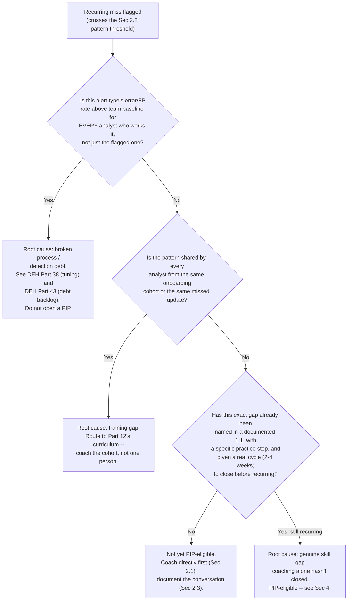

# Part 16 — Performance Management & Coaching

## Why this part exists

**[CONCEPT]** Part 15 builds the program that finds out, at scale, whether analysts are actually doing good work — sampling methodology, calibration sessions, scores that mean the same thing across reviewers. This part starts where a QA finding, a missed escalation, or a pattern a team lead has simply noticed lands next: in a 1:1, then possibly in a formal Performance Improvement Plan. The two parts have different units of analysis on purpose. Part 15 asks "is our QA program measuring the right thing, consistently, across a whole team." This part asks a narrower, harder question about one specific person and one specific recurring problem: given a finding that's real, what actually caused it, and what fixes that cause rather than just documenting it.

That second question is the load-bearing one in this part, and it's the same judgment call developed further in Part 25 — Risk Acceptance & Manager Decision-Making Under Uncertainty for the cases where it stays genuinely unclear even after a manager has done the diagnostic work below. Most of the time, the ambiguity resolves cleanly once a manager actually checks: a recurring miss is a skill gap (this specific person hasn't learned this specific thing yet), a training gap (nobody was ever taught this — it's not a "this person" problem, it's a "this cohort" or "this curriculum" problem, which routes to Part 12 — Ongoing Training & Skill Development), or a broken process — most often a detection rule with a false-positive rate high enough that "getting it wrong" was close to unavoidable, which is a technical-debt problem with a technical-debt owner, not a coaching problem at all. Skipping that third possibility and defaulting straight to coaching or a PIP is the single most common and most expensive mistake this part exists to prevent.

This part covers three things: how a 1:1 should actually be run so it's a real coaching instrument rather than a status meeting with a fixed time slot, how a coaching conversation escalates into a formal Performance Improvement Plan and what makes a PIP defensible rather than a documented pretense, and the three-hypothesis diagnostic — skill, training, or process — that has to run before either of the first two decisions gets made. It does not cover QA sampling or calibration mechanics (Part 15 owns that), the termination and legal-documentation obligations once a PIP fails (Part 27 — Legal, HR & Compliance Interfaces owns what happens organizationally after that point), the cost of losing someone this process couldn't save (Part 18 — Attrition & Retention), or the technical mechanics of tuning a noisy detection or scoring detection debt as a program (Detection Engineering Handbook V2, Part 38 — False Positive Engineering and Part 43 — Detection Debt own both, and this part cites them rather than re-deriving either).

## 1. The 1:1 as the primary coaching instrument

### 1.1 Cadence: what frequency is actually buying you

**[FRONTLINE MANAGER]** Cadence is not a scheduling preference — it's the mechanism that determines how long a fixable problem gets to compound before anyone with the authority to fix it hears about it. An analyst struggling with one specific alert type who has a 1:1 every two weeks gets, at most, two weeks of unaddressed drift before a team lead has a structured chance to notice; the same analyst on a monthly cadence gets up to four weeks, during which the same miss can recur eight or ten times against a live queue instead of two or three. The gap isn't just slower coaching — it's a longer window in which a fixable individual problem gets misread as a bigger pattern than it actually is, because nobody checked in early enough to catch it while it was still small.

The table below sets a starting cadence by where someone sits relative to onboarding and tenure — not a fixed rule for every team, but a defensible default a manager can adjust from rather than invent from nothing.

| Analyst status | Cadence | Typical length | Why this frequency |
|---|---|---|---|
| First 90 days post-ramp (past Part 11's structured onboarding) | Weekly | 20–30 min | Highest rate of new, uncorrected habit formation; small errors are cheap to fix now and expensive to unlearn later |
| Steady-state analyst, no open coaching item | Biweekly | 20–30 min | Enough frequency to catch drift before it becomes a pattern, without turning every week into a review |
| Steady-state analyst, active coaching item or recent QA flag | Weekly | 30 min | Matches §1.1's compounding-drift logic — a known issue needs the shorter window, not the default one |
| Senior analyst / informal mentor track | Monthly, plus ad hoc | 30–45 min | Lower need for close-interval correction; more time spent on growth and delegation readiness than triage mechanics |

**[SENIOR MANAGER]** A manager whose own span of control has grown past what a real weekly-or-biweekly cadence can sustain — past roughly ten to twelve direct reports for a hands-on cadence, fewer if the manager also carries operational duties — has a staffing problem, not a scheduling problem, and no amount of shortening each session fixes it. Delegating some 1:1s to team leads is a legitimate answer; quietly letting cadence slip to monthly because there's no time is not the same decision, even though it produces the same calendar.

> **Manager's Note**
> If you catch yourself repeating the identical coaching point in three consecutive 1:1s with no change in the analyst's actual behavior on the queue, stop scheduling a fourth identical conversation and run the diagnostic in §3 instead. Two clean cycles of "here's the gap, here's what to try" with no movement is the signal that repetition itself isn't the fix — either the coaching hasn't identified the real cause, or the cause isn't something coaching can fix at all.

### 1.2 A fixed skeleton, an open half

**[FRONTLINE MANAGER]** A 1:1 with no structure drifts toward whatever's loudest that week — usually a status update on an open ticket or a scheduling question — and a 1:1 that's entirely scripted stops being a conversation at all. Split it: roughly half the time on a fixed, short skeleton (open items from the last session, any new coaching input since then, one specific thing that went well), and the other half genuinely open to whatever the analyst brings. The fixed half exists so coaching input never silently falls off a to-do list between sessions; the open half exists because the most useful thing to come out of a 1:1 is often not on the manager's agenda at all — a concern about a teammate, a question about a career path, a problem with a tool that's been quietly slowing everyone down.

**[FRONTLINE MANAGER]** Keep a running written note per analyst, dated, one line per open item and its status — not a full transcript, but enough that a manager looking back after two months can answer "did we actually cover this, and what did we agree to do about it" without relying on memory. This is the same discipline §2.3 needs before any coaching input becomes formal enough to matter in a PIP, and building the habit early, on ordinary 1:1s, means it's already in place the one time it needs to hold up to scrutiny.

> **Blind Spot**
> A manager who tracks whether a 1:1 happened — a checkbox in a calendar, a "yes, we met" — but not what was actually covered can't tell a real coaching program apart from a habit of meeting that happens to recur every two weeks with nothing substantive in it. Track content, not attendance: a running note with dated, specific items is the only artifact that shows the difference, and it's the artifact every later step in this part — the pattern threshold in §2.2, the PIP's evidence base in §4.2 — actually depends on existing.

### 1.3 What a 1:1 is not

**[SENIOR MANAGER]** Three things a 1:1 quietly turns into when nobody's actively steering it, none of which is coaching: a status meeting where the analyst reports ticket counts the manager could already see in the queue tooling; a QA-scorecard readout, where the entire session is spent walking through numbers the analyst already received and had no chance to prepare a response to; or a purely social check-in with real value for morale but no coaching content at all. All three are legitimate uses of *some* meeting — they're just not this one, and letting any of them consume the slot means the actual coaching conversation this part is about never happens, while the calendar shows a 1:1 occurred right on schedule.

## 2. From a QA finding to a coaching conversation

### 2.1 The handoff Part 15 doesn't own

**[HR/PEOPLE]** Part 15 — Quality Assurance Programs owns the sampling methodology and the calibration session that gets multiple reviewers to the same score on the same ticket. What it deliberately doesn't own is what happens once a flagged ticket reaches the analyst who worked it — that translation, from a scored ticket to an actual conversation about what to do differently, is this part's job. A QA score with no coaching conversation behind it is a number nobody acts on; a coaching conversation with no QA data behind it is an opinion with no evidence trail. Both halves are necessary, and losing either one is a common way a QA program looks healthy on a dashboard while changing nothing in how the team actually works.

**[FRONTLINE MANAGER]** The translation itself is simple to describe and easy to do badly: name the specific ticket and the specific gap (not "your escalations need work" but "on ticket #4471, the escalation note didn't name which account was affected, so Tier 2 had to ask before they could start"), ask the analyst's own account of what happened before offering a correction, and agree on one concrete thing to try differently next time — not three, not a general resolution to "be more thorough." One specific, checkable commitment is something a 1:1 two weeks later can actually verify happened; a vague resolution to improve isn't checkable at all, which means the next 1:1 has nothing to confirm and the conversation effectively resets to zero.

### 2.2 One miss versus a pattern: setting the threshold before you need it

**[SENIOR MANAGER]** Every analyst misses something occasionally, and treating a single miss as a pattern before it is one teaches an entirely different lesson than the one intended: that every QA flag is a formal event, regardless of whether it reflects one bad day or a real recurring gap. Set the threshold for "this is now a pattern worth a dedicated diagnostic conversation, not just a normal coaching note" in advance, before a specific case forces the decision under pressure — a reasonable default is three or more flags on the same underlying issue within a rolling 60- to 90-day window, adjusted down for anything safety- or scope-critical (a repeated failure to escalate a specific high-severity indicator warrants attention well before three instances) and adjusted up for genuinely low-volume alert types where three instances might represent the analyst's entire exposure to that scenario.

> **People Risk Trap**
> Reacting to every single QA flag as if it were already a pattern — pulling the analyst into a dedicated coaching conversation, complete with formal notes, for a single miss — teaches the team that every 1:1 might turn into a review at any moment. Analysts who learn this stop bringing up their own uncertainty proactively, because volunteering "I wasn't sure about this one" starts to feel indistinguishable from confessing to a performance problem. The fix: name the threshold from §2.2 out loud to the team once, apply it consistently, and treat single misses inside the threshold as ordinary coaching, covered in the fixed-skeleton half of a normal 1:1, not as a separate, heavier process.

### 2.3 Documenting without turning every 1:1 into a paper trail

**[HR/PEOPLE]** The running note from §1.2 already carries most of what's needed, but once a pattern crosses the §2.2 threshold, the documentation standard changes: from this point on, a note needs to be specific enough that someone who wasn't in the room — a second manager during calibration, an HR partner reviewing a later PIP — could read it and understand what was raised, what was agreed, and what happened next. That's a different bar than a personal reminder, and the shift should happen deliberately at the threshold, not retroactively once a PIP is already being drafted and a manager is trying to reconstruct three months of history from memory.

## 3. The diagnostic call: skill gap, training gap, or a broken process

### 3.1 Three hypotheses, three completely different fixes

**[CONCEPT]** A recurring miss on the same alert type or the same kind of ticket has exactly three plausible root causes worth checking before any fix gets chosen, and each one is fixed by a different person, using a different tool, on a different timeline. A skill gap means this specific person hasn't yet learned or practiced this specific thing — the fix is direct coaching, aimed at one person. A training gap means the gap isn't really about this person at all; it shows up in everyone who came through the same onboarding cohort or missed the same update, and the fix is a curriculum change owned by Part 12's ongoing-training program, not an individual conversation repeated once per affected analyst. A broken process — almost always, in a SOC, a detection rule with a false-positive rate high enough that a "wrong" disposition was close to the expected outcome regardless of who worked it — means the fix is a tuning change or a debt-backlog item owned by detection engineering (Detection Engineering Handbook V2, Part 38 — False Positive Engineering for the tuning mechanics, Part 43 — Detection Debt for the backlog discipline), and no amount of coaching the analyst changes the outcome, because the analyst was never the actual point of failure.

The table below is the fast version of the diagnostic — what each hypothesis looks like once you actually check, and who owns the fix once it's confirmed.

| Hypothesis | Signature pattern once checked | Where to check first | Who fixes it | Risk if misdiagnosed |
|---|---|---|---|---|
| Skill gap | Isolated to one analyst; other analysts working the same alert type show a normal error rate | Compare this analyst's error rate on the specific alert type against team baseline for that same alert type | The analyst, coached directly by their manager or team lead | Coaching never happens; gap persists and eventually looks like a bigger problem than it is |
| Training gap | Shared across a hire cohort or everyone who missed a specific update; not isolated to one person | Check whether every analyst who shows the pattern shares an onboarding date, a missed update, or a common training gap | Ongoing-training program (Part 12) — curriculum fix, not individual coaching | One analyst gets coached repeatedly for a gap the whole cohort has; the others' identical gap goes uncaught until it resurfaces elsewhere |
| Broken process / detection debt | Error rate on this specific alert type is high for every analyst who works it, not just the flagged one | Compare the alert type's team-wide false-positive or error rate against the team's overall baseline | Detection engineering — rule tuning (DEH Part 38) or debt-backlog remediation (DEH Part 43) | Analyst is coached or performance-managed for a problem no amount of individual skill fixes; the rule keeps producing the same "miss" in whoever works it next |

### 3.2 Why "skill gap" is the default guess, and why that default is usually wrong

**[SENIOR MANAGER]** A manager looking at a recurring miss almost always sees the analyst first, because the analyst is the visible, nameable actor in the story and the detection rule is an abstraction sitting several layers back in a platform the manager may not query directly. That visibility bias is exactly backward from where the check should start: the rule's team-wide baseline is cheap and fast to check — usually one query against existing QA or disposition data — while a genuine skill gap can only be confirmed by ruling out the other two explanations first. Checking the cheapest, fastest disqualifying test before assuming the expensive, slower explanation (coaching, which takes weeks to show results either way) is the right order of operations regardless of which hypothesis eventually turns out to be true.

### 3.3 A decision framework

**[CONCEPT]** Figure 16.1 lays out the check sequence as a decision tree: rule out the process explanation first, because it's the cheapest to check and the most consequential to miss, then check whether the pattern is shared across a cohort before concluding it's isolated to one person, and only open a formal coaching or PIP track once both of those have been ruled out and a documented coaching cycle has already run with no change.

**Figure 16.1 — Diagnosing a recurring miss: skill gap, training gap, or broken process.** *CONCEPTUAL.* Illustrates the check sequence this part recommends — process first, cohort second, individual coaching last — rather than a capture of any single organization's actual triage workflow.





**Figure 16.1 — Diagnosing a recurring miss: skill gap, training gap, or broken process.** *CONCEPTUAL.* Shows the three-hypothesis check sequence as a rendered flowchart. It supports the diagnostic matrix in §3.1's table and the CASE-1601 worked example below — a real recurring-miss investigation should be able to point to the exact node in this tree where it landed, not to a manager's unaided judgment call. `FIG-1601`.

### 3.4 Worked example: the same recurring miss, three true causes

**CASE-1601 — the same alert, three analysts, three causes.** *COMPOSITE CASE EXAMPLE — merges patterns from several mid-sized SOC coaching investigations into one illustrative narrative; figures below are illustrative, not sourced benchmark or audited data.*

A 16-analyst SOC's Part 15 QA sample flags a recurring problem on a single detection — a rule for suspicious base64-encoded PowerShell execution — across three analysts in the same quarterly sampling cycle. Before this investigation, the manager's working assumption was that all three needed coaching, in roughly the same way, on roughly the same gap.

```text
CONCEPTUAL SAMPLE -- illustrative figures, not sourced benchmark or audited financial data

Team-wide baseline, this detection, trailing quarter:
  False-positive / miscalled-disposition rate: 14% (roughly in line with the team's
    8-16% baseline range across all detections)

Analyst A (2 months post-ramp): flagged on 6 of 9 sampled tickets for this alert type
Analyst B (14 months tenure, otherwise strong QA record): flagged on 5 of 11 sampled tickets
Analyst C (3+ years tenure, strong QA record on every other alert type): flagged on 7 of 8
  sampled tickets -- but the rule's own disposition data, checked for the first time
  during this investigation, showed a 58% miscall rate for EVERY analyst who worked it
  that quarter, not just Analyst C
```

Running the §3.1 checks in order changed the plan for all three. Analyst A's gap was isolated and she was two months past ramp-up — a genuine skill gap: she hadn't yet learned to decode a specific PowerShell obfuscation pattern the rule's alert text didn't spell out. One coaching session plus a short practice set closed it; her error rate on this alert type matched team baseline within the next sampling cycle. Analyst B's gap looked identical on paper, but checking cohort membership showed three other analysts hired in the same onboarding window shared the exact same blind spot once anyone actually looked — the technique had been added to the detection roughly two months after that cohort's onboarding curriculum was last updated, so nobody in that cohort had ever been taught it. That routed to Part 12 as a curriculum fix, not four separate individual coaching conversations repeating the same missing content. Analyst C's case was the one the original assumption got most wrong: the rule's own team-wide rate — 58%, against a 14% baseline for every other detection this team ran — meant Analyst C's dispositions were close to what anyone would produce working that same rule that quarter. Retuning the rule's encoding-pattern match (the specific fix lived in detection engineering's backlog, not in this manager's reach) dropped Analyst C's apparent error rate back to team baseline within two sampling cycles, with zero coaching time spent on an analyst who had never actually had a performance problem.

> **Management Autopsy — "coach the analyst on the alert everyone was getting wrong"**
>
> **The decision:** Before checking the rule's own team-wide disposition rate, the manager scheduled a formal coaching conversation with Analyst C, treating the QA flag the same way as Analyst A's and Analyst B's.
>
> **Why it seemed reasonable:** Analyst C was the most experienced of the three and had the strongest QA record everywhere else, which made "must be an unusual lapse, worth addressing directly" a plausible read — nobody had reason to suspect the rule itself before looking.
>
> **How it failed:** A coaching conversation aimed at an analyst whose dispositions were consistent with what the rule's own logic was producing for everyone changes nothing measurable, because the analyst was never the point of failure — the miscall rate stayed at 58% for the next sampling cycle regardless of the coaching, because the rule kept producing the same ambiguous evidence for whoever worked it next.
>
> **The fix:** Check the rule's team-wide baseline before scheduling any coaching conversation tied to a specific alert type — it's a single query against existing disposition data, and it's cheaper and faster than a coaching cycle that turns out to have been aimed at the wrong target from the start.

### 3.5 When the honest answer is detection debt, not a person

**[SENIOR MANAGER]** The broken-process branch of §3.1 has a name in the companion technical volume, and it's worth using precisely rather than reinventing a softer version of it here.

> **Cross-Book Pointer**
> This part does not cover how to measure a detection's false-positive rate, decide whether a rule is worth tuning versus retiring, or score a detection backlog as organizational debt — those are technical-engineering questions with technical owners. See Detection Engineering Handbook V2, Part 38 — False Positive Engineering for the tuning mechanics behind fixing a rule like the one in CASE-1601, and Part 43 — Detection Debt for how a backlog of untuned, high-noise rules gets tracked and prioritized as a standing liability rather than a one-off fix. Come back here once a detection's own numbers confirm the process explanation from §3.1 — this part's job is recognizing when that's the real answer, not doing the tuning work itself.

**[SENIOR MANAGER]** The practical consequence for a manager is that "this alert type has bad numbers for everyone" is a finding worth escalating to detection engineering as its own item, tracked independently of whichever analyst happened to surface it. A rule sitting in DEH Part 43's debt backlog for six months while three different analysts get individually coached on its symptoms in three different quarters is a sign the finding never actually reached the team that owns the fix — the coaching kept happening because it was the visible, available lever, not because it was ever going to close the gap.

> **What Would Change My Mind**
> This part treats the process check (§3.1's cheapest, fastest test) as the correct first move before any individual coaching begins. If a manager could show that skipping the process check and going straight to coaching produced the same time-to-resolution and the same rate of correctly identifying the true cause — not just eventually arriving at the right answer, but arriving at it just as fast — that would undercut this section's ordering claim, and the recommendation would need to soften from "check process first" to "check process and skill in whichever order is locally convenient."

## 4. Performance Improvement Plans

### 4.1 The precondition: don't open a PIP until §3 has been run

**[HR/PEOPLE]** A Performance Improvement Plan is the heaviest instrument in this part's toolkit, and opening one before ruling out the training-gap and broken-process branches of §3.1 means there's a real chance the plan is aimed at something the analyst was never actually in a position to fix. A PIP opened against a genuine detection-debt problem doesn't just fail to improve anything — it puts a person through a formal, stressful, career-affecting process for a defect that belonged in an engineering backlog, and it does nothing to stop the same "performance problem" from recurring in whoever inherits that alert type next.

> **People Risk Trap**
> Opening a PIP against an analyst whose recurring miss is actually a broken rule teaches everyone else who works that same rule exactly the wrong lesson: that surfacing a miss on this alert type risks a formal process, so the safer move is to quietly work around it rather than report it. That has the perverse effect of making the real defect — the rule itself — harder to find, because the QA signal that would have flagged it for detection engineering starts getting suppressed by analysts protecting themselves instead. Run §3.1's process check before a PIP, every time a recurring miss is tied to one specific alert type rather than a general pattern of judgment across many different kinds of tickets.

**[HR/PEOPLE]** A second precondition, separate from the diagnostic: the specific gap named in a PIP should already have come up in at least one prior documented 1:1 (§2.3), with a real attempt at coaching and a real cycle to show improvement. A PIP is not the venue where an analyst hears about a problem for the first time — that's what a normal coaching conversation is for. If the first formal mention of a specific gap is the PIP document itself, the process has skipped a step, and the plan will read, correctly, to the analyst and to anyone reviewing it later, as a surprise rather than a documented escalation of an already-known issue.

### 4.2 What a defensible PIP actually contains

**[HR/PEOPLE]** A PIP that survives scrutiny — from the analyst, from HR, from a later reviewer trying to understand what happened — has the same handful of components every time, and each one has a specific, common way of being written too vaguely to actually do its job.

| Component | What it must contain | Common failure mode |
|---|---|---|
| Problem statement | The specific, observable gap, tied to dated prior 1:1 notes (§2.3) or QA data (Part 15), not a general impression | "Needs to improve overall performance" — no specific behavior named, nothing to disprove |
| Success criteria | A measurable target tied to an existing baseline (team QA average, handle-time norm, error rate on a named alert type) | A subjective bar ("show more initiative") with no way to check objectively whether it was met |
| Support committed | Specific coaching time, resources, or shadowing the manager is actually providing during the plan, not just monitoring | Support is listed but never actually scheduled or delivered — the plan becomes surveillance with no assistance behind it |
| Timeline and checkpoints | A defined length (commonly 30, 45, or 60 days) with named checkpoint dates, not just a start and an end | No interim checkpoint — the analyst gets no signal on progress until the plan's outcome is already decided |
| Consequence of non-improvement | Stated plainly and honestly — what happens if the criteria aren't met by the deadline | Left vague or unstated, which reads as either a bluff or a foregone conclusion depending on who's asking |

**[HR/PEOPLE]** The reusable PIP template this section assumes has its fillable home in Appendix A4 (`TMPL-1601`), built as the companion artifact to this part, Part 15, and Part 18. It doesn't automate the diagnostic judgment call in §3 — no template can — and it doesn't replace the legal review a PIP should get before it's delivered in any jurisdiction with meaningful wrongful-termination exposure, which is Part 27 — Legal, HR & Compliance Interfaces's territory, not this part's.

### 4.3 Cadence and checkpoints during the plan

**[FRONTLINE MANAGER]** A PIP with a single check-in at the very end — start the plan, disappear for 45 days, deliver a verdict — gives the analyst no chance to course-correct and gives the manager no early signal that the plan itself might be failing to produce movement. Run the same weekly cadence §1.1 already sets for an active coaching item, with each session explicitly checking progress against the specific success criteria from §4.2, not a general "how's it going." A PIP that isn't showing any measurable movement by its midpoint checkpoint rarely turns around by the deadline; that midpoint check is the honest moment to decide whether to adjust the plan's support, extend the timeline for a genuinely close case, or acknowledge that the outcome is already trending toward non-improvement.

### 4.4 The two ways a PIP gets used dishonestly

**[SENIOR MANAGER]** A PIP fails its own purpose in one of two directions, and both are common enough to name specifically. The first is using a PIP as a paper trail for a termination decision that's already been made — going through the motions of a plan with no real intention of the analyst succeeding, because the actual decision happened before the plan was written. The second, less discussed, is using a PIP as a way to avoid a termination decision that should already have been made — extending plan after plan for someone who was never going to improve, because opening a new plan feels more comfortable than closing the process with an honest outcome. Both waste the same thing: the analyst's time, the manager's credibility, and — in the first case specifically — the organization's legal position if the paper trail is ever examined.

**CASE-1602 — the plan that was already decided.** *COMPOSITE CASE EXAMPLE — merges patterns from several disputed-termination reviews into one illustrative narrative; figures below are illustrative, not sourced legal or financial data.*

```text
CONCEPTUAL SAMPLE -- illustrative figures, not sourced benchmark or audited financial data

Timeline:
  Day 1:   30-day PIP opened. Problem statement: "overall performance below expectations."
           No specific ticket, alert type, or dated prior 1:1 cited.
  Day 15:  First check-in, 15 minutes, no documented notes beyond "discussed progress."
  Day 30:  Second check-in, same format.
  Day 32:  Termination. HR file contains the PIP document and two undocumented check-ins;
           no prior coaching record predates the PIP by more than a few days.

Outcome:
  Former analyst's attorney sends a demand letter citing the absence of any documented
  performance concern before the PIP, inconsistent treatment relative to a comparator
  who received no PIP for a similar QA record, and undocumented check-ins with no
  measurable criteria ever stated in writing.
  Case resolved via a negotiated separation payment rather than litigation: roughly
  $40,000, plus the manager's and HR's time across several weeks of document review
  and outside-counsel consultation that a properly documented process would not have required.
```

> **Management Autopsy — "the PIP that was really a decision already made"**
>
> **The decision:** A manager who had already decided to terminate an underperforming analyst opened a 30-day PIP with a vague problem statement, intending it primarily as a documentation step rather than a genuine improvement opportunity.
>
> **Why it seemed reasonable:** The manager believed the underlying performance problem was real and long-standing, and treated the PIP as a formality that HR policy required before a termination could proceed — a box to check on the way to a decision already settled.
>
> **How it failed:** Because the plan was never meant to produce improvement, it was never built the way §4.2 describes: no specific problem statement, no measurable criteria, no documented check-ins, and no prior coaching record showing the issue had ever been raised before the PIP itself. When the termination was challenged, the file that was supposed to protect the decision instead read as exactly what it was: a pretense, assembled in the same window as a decision that had already been made.
>
> **The fix:** If the decision to terminate is genuinely already made, say so honestly and route straight to Part 27's process for a documented termination — don't open a PIP to dress up a decision that isn't actually open to a different outcome. If the decision genuinely isn't made yet, build the plan to §4.2's standard from day one: a specific problem statement tied to dated prior coaching, measurable criteria, real committed support, and documented checkpoints — the version that would hold up to scrutiny regardless of which way the plan ultimately ends.

### 4.5 Closing a PIP: three honest outcomes

**[HR/PEOPLE]** A PIP ends in exactly one of three ways, and each has an honest next step. The analyst meets the criteria: document it clearly, close the plan, and — this matters more than it sounds — actually treat the plan as closed rather than continuing to watch that person more closely than everyone else indefinitely on the strength of a resolved plan. The analyst shows real, partial movement but hasn't fully met the criteria by the deadline: this is the genuinely judgment-call case, and a short, explicitly bounded extension can be defensible if the trend is real and documented, which is different from an open-ended series of extensions with no new criteria attached. The analyst shows no meaningful movement against clearly stated, achievable criteria: this is where the plan's stated consequence from §4.2 gets honored, and where Part 27's termination-documentation process takes over from this part's coaching-and-improvement process.

## 5. Measuring whether any of this is actually working

**[SENIOR MANAGER]** A performance-management program can look busy — 1:1s on the calendar, PIPs opened and closed — while doing almost nothing to actually change outcomes, and the easiest way to catch that gap is to check whether the program's own diagnostic step is getting used, not just whether the paperwork exists.

> **Field Test**
> **Setup:** Pull every PIP opened in the last 12 months, along with the prior 1:1 notes for each affected analyst.
> **Action:** For each PIP, check whether §3.1's three-hypothesis diagnostic — specifically, the team-wide baseline check for any alert type or ticket category named in the plan — was run and documented before the PIP was opened.
> **Expected result:** Every PIP tied to a specific recurring alert type or process should show a documented baseline check ruling out the process explanation. If most PIPs in the sample show no such check, the program is skipping the cheapest, most consequential step in this part's diagnostic — and some fraction of those plans were probably opened against people who were never the actual point of failure.

**[SENIOR MANAGER]** Beyond that audit, three simple counts tell a manager more about program health than any survey: how many recurring-miss cases got resolved by a rule fix or curriculum change rather than a PIP (this number going up over time is a sign the diagnostic is actually catching process and training explanations before they reach an individual); how many PIPs closed successfully versus ended in termination (a program where every single PIP ends in termination is either only opening plans once the decision is already made, per §4.4, or setting criteria nobody could realistically meet); and how many PIPs show a documented prior coaching conversation predating them by more than a few days, per §4.1's second precondition.

## 6. Where this connects

**[CONCEPT]** This part assumed Part 15's QA sampling and calibration as the source of most of the signal a 1:1 acts on, and it assumed Part 10 — Competency Models & Skills Matrices's observable-behavior standard as the yardstick for what "meets expectations" concretely means once a PIP has to state it in writing. It routes the training-gap branch of §3.1 to Part 12 — Ongoing Training & Skill Development rather than treating a shared, cohort-wide gap as a series of individual coaching problems, and it routes the broken-process branch to Detection Engineering Handbook V2's technical-debt content rather than performance-managing a person for a rule's false-positive rate. It deliberately stops short of the legal-documentation standard a PIP needs once termination is on the table (Part 27), the cost model for what happens when this process doesn't save someone (Part 18), and the genuinely unresolved judgment calls that remain even after the diagnostic in §3 has been run correctly (Part 25) — all three pick up exactly where this part's honest limits are.

## Cross-references

Within this book, this part assumes Part 10 — Competency Models & Skills Matrices (the observable-behavior standard a PIP's success criteria are written against), Part 12 — Ongoing Training & Skill Development (the routing destination for a confirmed training gap), and Part 15 — Quality Assurance Programs (the sampling and calibration mechanics that produce most of the signal a 1:1 acts on). It points forward to Part 18 — Attrition & Retention (the cost of a coaching or PIP process that doesn't succeed), Part 25 — Risk Acceptance & Manager Decision-Making Under Uncertainty (the diagnostic judgment call developed further for genuinely unresolved cases), and Part 27 — Legal, HR & Compliance Interfaces (termination-documentation standards once a PIP fails). Outside this book, it cites Detection Engineering Handbook V2, Part 38 — False Positive Engineering and Part 43 — Detection Debt for the technical fix and debt-tracking discipline behind the broken-process branch of §3.1 — this part owns recognizing that a rule, not a person, is the real point of failure; it does not own tuning the rule or scoring the backlog.
