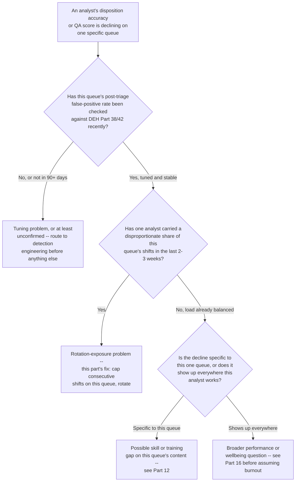

# Part 17 — Burnout, Fatigue & Wellbeing

## Why this part exists

**[CONCEPT]** Part 6 — Shift Pattern & Coverage Design turns a headcount number into a calendar and previews, without developing, the fatigue and circadian research behind why some rotation directions and shift lengths cost more in error rate than others. This part is where that research actually gets developed and turned into scheduling decisions a manager can defend. It also picks up a second, related problem that Part 9 — Queue Health & Workload Management touches only at the aggregate-queue level: alert fatigue in the individual analyst who has been sitting on the highest-noise part of the queue for too many shifts in a row. Both problems share a mechanism — sustained exposure with insufficient recovery — and both have a fix a manager controls directly: the rotation, not the rule.

**[CONCEPT]** That last distinction is the one this part exists to hold, and it is worth stating precisely because it is the split most likely to collapse into one muddled chapter by accident. Detection Engineering Handbook V2, Part 38 — False Positive Engineering owns the fix that lowers a queue's noise floor — retuning a rule, adding suppression logic, raising a threshold, so fewer false positives are generated in the first place. This part owns the fix that bounds how much of whatever noise floor remains any single analyst absorbs, and for how long, before someone else takes a turn. A manager with only the tuning half of that picture will keep retuning a queue whose real problem is that nobody has rotated off it in three weeks; a manager with only the rotation half will rotate people through a queue that a two-day tuning fix would have made mostly disappear. Both halves are real fixes for the same symptom, aimed at different causes, and a manager needs to be able to tell which one is in front of them before reaching for either.

**[CONCEPT]** This part covers three things in sequence: the shift-work fatigue and circadian evidence that should inform rotation design (§1), alert fatigue treated specifically as a workload and rotation problem rather than a detection-quality one (§2), and the wellbeing program a SOC manager actually builds — leading-indicator detection before burnout becomes a resignation, and mandatory disconnected time after a major incident (§3–§4). It does not cover the retention economics of burnout-driven attrition (that cost model, and the levers that move it, belong to Part 18 — Attrition & Retention), the diagnostic judgment call between a burnout-driven performance dip and a genuine skill gap (Part 16 — Performance Management & Coaching), the manager's live staffing-surge decisions during a declared major incident (Part 28 — The Manager's Role in a Major Incident), or the standing postmortem program that would eventually audit whether a disconnect policy actually held (Part 29 — Post-Incident Organizational Review). Each gets a pointer where it's relevant and nothing more.

## 1. Shift-work fatigue and circadian science, applied to SOC scheduling

### 1.1 Why "tired" is the wrong unit of measurement

**[CONCEPT]** A manager who thinks about fatigue purely as "hours since last slept" is measuring the wrong thing. Sleep deprivation and circadian misalignment are two different mechanisms, and a SOC's night shift runs into the second one regardless of how well the first one is managed. The human body runs on an internal clock with a period that averages slightly longer than twenty-four hours, not exactly twenty-four — a fact established by decades of controlled sleep-lab research on subjects isolated from external time cues. That internal clock does not reset itself just because an analyst's calendar says they're now working nights; it keeps running on roughly the same schedule it always has, which means a night-shift analyst is asking their body to be alert and vigilant during the hours that same body's own clock has spent a lifetime treating as the deepest part of its rest period.

**[FRONTLINE MANAGER]** The practical consequence is that a fully rested analyst, eight hours of sleep the day before, can still perform measurably worse at 4 a.m. than the same analyst performs at 10 a.m. on identical work, because the deficit isn't about how much they slept — it's about what their internal clock expects to be doing at that clock time. A staffing model that treats every covered hour as interchangeable, as long as a seat is filled, is quietly assuming this effect doesn't exist. It does, and it doesn't average out just because the shift is fully staffed.

### 1.2 The window of circadian low, and why a single-seat overnight shift sits inside it

**[CONCEPT]** Occupational fatigue-risk-management practice in aviation and maritime operations — industries that have spent decades building formal fatigue rules because the cost of a fatigue-driven error is measured in lives, not tickets — converges on a consistent finding: human alertness and reaction time bottom out in a window roughly between 2 a.m. and 6 a.m., regardless of shift history, sleep quality the night before, or how motivated the person is. Those industries call it the window of circadian low, and they build hard rules around it — maximum duty hours, mandatory rest, restrictions on what safety-critical tasks can be assigned inside it — precisely because willpower and good staffing intentions don't move it.

**[SENIOR MANAGER]** A SOC's overnight shift, on almost any coverage model, sits centered on that window rather than clipping its edges the way an evening shift does. An evening shift ending at midnight touches the start of the trough at most; a night shift running roughly 11 p.m. to 7 a.m. spends its entire middle stretch inside it. That has a direct, uncomfortable implication for triage quality: whatever alert happens to land at 3 a.m. gets first-pass judgment from the analyst whose cognitive performance is, structurally, at its lowest point of the entire twenty-four-hour cycle — not because that analyst is worse at the job, but because nobody's judgment is as sharp at that clock hour as it is at 10 a.m., and a coverage model that satisfies Part 6's staffing math says nothing about that.

> **Blind Spot**
> A coverage model that Part 6 would certify as "fully staffed" — one analyst, every hour, no gap — answers a different question than "is the judgment in that seat as reliable at 3 a.m. as it is at 10 a.m." Staffing math counts seats; it has no variable for the window of circadian low, and a manager who only checks the staffing math will never see this gap, because the dashboard that shows a seat filled looks identical whether the person in it is at their cognitive peak or their trough. If overnight escalation accuracy or overnight false-negative rate runs measurably worse than day-shift rates on the same alert types with the same rules, check the clock before checking the rule or the person — the gap this Blind Spot describes produces exactly that signature.

### 1.3 Rotation direction and speed as manager-controlled levers

**[FRONTLINE MANAGER]** Part 6 §3.2 names rotation direction as a real, low-cost design lever without developing why it matters; here is why. Because the human circadian clock naturally runs slightly longer than twenty-four hours, delaying it — going to bed later each night — asks less of the body than advancing it — going to bed earlier. A forward-rotating schedule (day, then evening, then night) delays the clock at each transition, moving in the same direction the body's own drift already wants to go. A backward-rotating schedule (night, then evening, then day) advances it at each transition, fighting that drift every single time the rotation turns over. Two schedules can share an identical number of night shifts per month and differ only in which direction the rotation moves between blocks, and the backward-rotating version will reliably produce more adaptation difficulty, more subjective fatigue complaints, and — the number that actually gets a manager's attention — a measurably higher error rate on the first shift of each new block, exactly the pattern Part 6's own CASE-0601 documented.

**[FRONTLINE MANAGER]** Rotation speed is the second lever, and it cuts in a less intuitive direction than fairness intuition suggests. A fast rotation — changing shifts every two to three days — feels fair because nobody works more than a handful of nights in a row, but it never gives the body enough consecutive days on any one schedule to adapt at all; every rotation restarts the adjustment cost from zero, so the analyst effectively works every night shift while still circadian-adapted to a day schedule, which is its own form of chronic misalignment even though no single stretch looks extreme. A slow rotation — a full week or more per block — gives the body real time to adapt to each block before it changes again, at the cost of a longer stretch on whichever block people like least. Neither speed eliminates the problem; they trade a low-grade, constant misalignment (fast rotation) for a sharper, front-loaded one that improves as the block goes on (slow rotation). A manager choosing between them is choosing which shape of cost the team absorbs, not choosing whether to pay one.

### 1.4 Consecutive nights and cumulative sleep debt: a worked example

**COMPOSITE CASE EXAMPLE — `CASE-1701`.** Constructed from recurring patterns seen across mid-sized in-house SOCs that consolidated night blocks to reduce total shift transitions; no single organization is identifiable, and all figures below are illustrative.

**[SENIOR MANAGER]** A 20-analyst SOC running four crews of five on a slow, forward rotation decided to consolidate its night block from four consecutive nights to seven, on the reasoning that fewer, longer blocks meant fewer total rotation transitions per year and the same total number of nights worked per analyst either way. The change looked neutral on every scheduling metric the team tracked — same total hours, same total nights per quarter, same pay differential. QA sampling by night-in-sequence, run for one quarter after the change, told a different story.

```text
CONCEPTUAL SAMPLE -- illustrative QA-sampled miss rate, not sourced benchmark data

Night 1 of block:  3.2% missed or misrouted escalation rate (QA-sampled)
Night 2 of block:  3.6%
Night 3 of block:  5.1%
Night 4 of block:  6.9%   (previously the last night of the block, before consolidation)
Night 5 of block:  8.4%
Night 6 of block:  9.1%
Night 7 of block:  9.6%
```

**[SENIOR MANAGER]** The miss rate did not climb in a straight line — it accelerated after the third night, consistent with cumulative sleep debt compounding rather than simply adding up night over night. Under the old four-night block, the crew never worked past the point where the curve was still climbing gently; under the seven-night block, three additional nights were added squarely in the zone where the curve was steepest. The fix was not to abandon slow rotation — the crew still preferred fewer transitions to more — but to cap consecutive night shifts at four regardless of how the rest of the block was structured, splitting what had been one seven-night block into a four-night block and a separate three-night block with at least one recovery day between them. QA-sampled miss rate on the reduced blocks returned to the 3–5% range across every night worked.

> **What Would Change My Mind**
> This part treats a roughly four-consecutive-night cap as a reasonable default before cumulative sleep debt starts accelerating rather than accumulating linearly, based on the pattern in CASE-1701 and consistent with general shift-work ergonomics guidance. If a SOC running longer consecutive-night blocks, with deliberate recovery-sleep support built into the schedule (protected sleep windows, no on-call obligation on days off immediately before a block), could show QA or error-rate data that stayed flat rather than accelerating past four nights, that would weaken this default and argue for a team-specific threshold determined by that team's own QA data rather than a fixed number carried over from this case.

### 1.5 Shift length: the eight-hour and twelve-hour tradeoff, resolved

**[FRONTLINE MANAGER]** Part 6 §2.2 names the tradeoff between three eight-hour shifts and two twelve-hour shifts — fewer handoffs against a longer individual stretch of sustained vigilance — without resolving which side of that tradeoff wins. It depends on where the shift sits relative to the window of circadian low. An eight-hour night shift already spends its entire duration inside or adjacent to the trough; stretching that same shift to twelve hours adds four more hours of vigilance-decay on top of an already-compromised baseline, and the decay compounds with time-on-task the same way it compounds across consecutive nights in §1.4 — the last two hours of a twelve-hour overnight shift are reliably the worst two hours of anyone's week, not because the person is unmotivated, but because time-on-task fatigue and circadian trough are stacking on top of each other at exactly that point. A twelve-hour day or evening shift carries much less of this cost, because it never enters the trough at all. The practical rule this part adds to Part 6's tradeoff: twelve-hour shifts are a reasonable default for day and evening coverage, where the popular 2-2-3 pattern's long weekends are a genuine retention win with modest fatigue cost; twelve-hour night shifts should be the last pattern a manager reaches for, not the first, because they concentrate the two most expensive fatigue mechanisms in this part into the same four extra hours.

## 2. Alert fatigue as a rotation and workload problem

### 2.1 The split, stated precisely

> **Cross-Book Pointer**
> This part does not explain how to lower a queue's false-positive rate — that is a detection-tuning fix, not a staffing one. See Detection Engineering Handbook V2, Part 38 — False Positive Engineering for the tuning mechanics, and Part 42 — Detection Quality for how to tell a genuinely noisy rule apart from one that's catching a real, growing pattern. This part starts downstream of that work: even a well-tuned queue almost never reaches a zero false-positive rate, and alert fatigue is what happens when one analyst absorbs whatever noise floor remains for too many consecutive shifts without relief. Tune the rule to lower the floor. Rotate the person to bound how much of that floor any one person carries alone.

**[SENIOR MANAGER]** The reason this split matters in practice, not just in principle, is that the two fixes are asymmetric in cost and speed. A tuning fix, once identified, can land in days — Part 9's own worked example (`CASE-0902`) shows a detection-engineering fix landing in four days for roughly $1,500–$2,000 in engineer time, against a $260,000-a-year headcount alternative. A rotation fix costs nothing in engineering time and can be implemented as a scheduling-policy change this week, but it does not reduce total noise volume by a single alert — it only changes who is exposed to it and for how long. Reaching for the rotation fix when the real problem is an untuned rule leaves the total noise volume exactly where it was, just spread more evenly across more tired people instead of concentrated on one exhausted one. Reaching for the tuning fix when the real problem is that one analyst has been informally left on the worst queue for eleven of the last fourteen shifts leaves that analyst exactly as overexposed as before, no matter how good the resulting rule gets.

### 2.2 Diagnosing which problem is actually in front of you

**[SENIOR MANAGER]** Figure 17.1 sequences the diagnostic questions in the order that resolves fastest, building on the queue-level decomposition Part 9 §3.1 already establishes rather than repeating it. Part 9's decision tree answers whether a *growing queue* is a staffing or detection-quality problem at the aggregate level; this one answers a narrower, person-level question that Part 9's tree never reaches — whether a *stable, already-tuned* queue's residual noise is being absorbed unevenly across the team.





**Figure 17.1 — Analyst-decline diagnostic flow.** *CONCEPTUAL.* Shows the diagnostic flow as a rendered decision tree. It supports the diagnosis in §2.2 and the routing decision in CASE-1702 below — a declining analyst sits at whichever node this tree actually routes them to, not wherever a manager's first guess assumes. `FIG-1701`.

**[SENIOR MANAGER]** The branch most often skipped under time pressure is the first one: confirming the queue is actually tuned before assuming the person is the problem. A manager who never checks whether the false-positive rate has moved in ninety days risks diagnosing a rotation problem — or worse, a performance problem — on a queue that a two-day tuning fix would have quieted regardless of who was rotated onto it.

### 2.3 Rotation-based mitigations, once tuning is confirmed

**[FRONTLINE MANAGER]** Once a queue's noise floor is confirmed as tuned and stable, three mitigations bound how unevenly the remaining floor gets absorbed. First, a consecutive-shift cap on the specific queue carrying the highest residual noise — a number, published and enforced, not a vague expectation that "someone" will notice an imbalance. Second, mixed-queue assignment within a single shift rather than one analyst working the noisiest queue exclusively all day; splitting a shift between a high-noise and a low-noise queue gives recovery time inside the same day rather than only across days. Third, a tracked noise-exposure metric — tickets worked or minutes spent on the highest-noise queue per analyst per rolling two weeks — reviewed on the same cadence Part 9 §4.1 already recommends for shift-level backlog-age balance, just at finer, per-analyst, per-queue granularity than that check operates at.

**Table 17.1 — Noise-exposure rotation policy, by queue tier.** Use this table to set a consecutive-shift cap once a queue's false-positive rate is confirmed tuned per §2.1; it is a starting policy to adapt to a specific team's queue mix, not a fixed standard (CONCEPTUAL SAMPLE).

| Queue Noise Tier | Illustrative Post-Tuning FP Rate | Consecutive-Shift Cap | Recovery Requirement |
|---|---|---|---|
| Low noise | Under 20% | No cap needed | — |
| Moderate noise | 20%–50% | 4 consecutive shifts | 1 shift on a lower-noise queue before returning |
| High, structurally noisy (e.g., user-reported phishing) | Over 50%, expected to stay high even after tuning | 3 consecutive shifts | 2 shifts on a lower-noise queue, or a full rotation off, before returning |

**[FRONTLINE MANAGER]** The middle column matters more than the cap itself: a queue that is noisy because of a specific unfixed rule belongs back in §2.1's tuning conversation, not in this table at all. This table is only for queues whose noise is structural — a category, like user-submitted phishing reports, where a meaningful fraction of legitimate submissions will always look like a false positive on triage, no matter how well the surrounding automation is tuned. Applying a rotation cap to a queue that's noisy because of a bad rule treats a two-day fix as a permanent staffing policy.

### 2.4 Worked example: the phishing-queue rotation cap

**COMPOSITE CASE EXAMPLE — `CASE-1702`.** Constructed from recurring patterns seen in SOCs with a dedicated user-reported-phishing queue and an informal "whoever's fastest at it" assignment habit; no single organization is identifiable, and all figures below are illustrative.

**[SENIOR MANAGER]** An 8-analyst Tier 1 team ran a user-reported-phishing queue that made up roughly 35% of total ticket volume, with a post-tuning false-positive rate holding steady around 55% — high, but confirmed structural rather than rule-driven after a detection-engineering review found no single rule or filter concentration to fix. One analyst, consistently the fastest at triaging this queue, was informally left on it for eleven of the previous fourteen shifts, because rotating someone slower onto it visibly slowed the team's overall queue-clearance rate on the days it happened.

```text
CONCEPTUAL SAMPLE -- illustrative disposition-accuracy tracking, not sourced benchmark data

Weeks 1-2 of the stretch: 96% disposition accuracy on phishing-queue tickets (QA-sampled)
Weeks 3-4 of the stretch: 89%
Week 5 of the stretch:    82%, including 2 confirmed true-positive credential-phishing
                          reports dispositioned as benign, both caught later by QA sampling
                          rather than at first triage
```

**[SENIOR MANAGER]** Both missed true positives were credential-harvesting pages that matched a pattern the same analyst had correctly caught dozens of times earlier in the stretch — this was not a skill gap; the analyst had already demonstrated the skill. Figure 17.1's diagnostic path applies directly: the queue was confirmed tuned, the load was confirmed unbalanced, and the decline was specific to this one queue rather than showing up in the analyst's work elsewhere — squarely the rotation-exposure branch, not a training or broader performance question. The fix applied Table 17.1's high-noise-tier policy: a three-consecutive-shift cap on the phishing queue, with the two fastest triagers on the team each taking a rotation instead of one person carrying it continuously. Disposition accuracy across the team on this queue settled at 93–95%, below the original analyst's best two-week stretch but well above where that analyst's own accuracy had fallen by week five, and with no single person carrying the miss risk of a bad week alone. The analyst who had absorbed the heaviest stretch resigned nine weeks later, citing burnout in an exit conversation; replacing them cost the team roughly ten weeks of reduced capacity during sourcing and ramp — the retention-cost accounting for that kind of departure is Part 18's model to run, not this part's, but the fourteen-shift stretch that preceded it is exactly the pattern this section exists to catch before it gets that far.

## 3. Detecting burnout before it becomes attrition

### 3.1 Leading indicators versus lagging indicators

**[HR/PEOPLE]** A resignation, a spike in sick leave, a QA failure serious enough to trigger a formal review — these are lagging indicators: real, measurable, and already too late to prevent the specific event they're measuring. A wellbeing program that only watches lagging indicators is running a smoke detector that goes off after the building has already burned partway down. Leading indicators — overtime trend, PTO non-use, on-call frequency, a declining QA trend on a previously strong performer, an uptick in unplanned absences, something an analyst says in a 1:1 that sounds like disengagement rather than a bad week — are the signals available while there's still time to act. The entire value of a wellbeing program, as distinct from an exit-interview program, is operating on the leading side of that line.

### 3.2 A burnout risk scorecard

**Table 17.2 — Burnout risk scorecard.** Use this on a monthly cadence per analyst, alongside — not instead of — a direct 1:1 conversation; it flags where to look, it does not replace the conversation itself (CONCEPTUAL SAMPLE — illustrative thresholds, calibrate against a specific team's own baseline before using these as hard triggers).

| Indicator | What It Measures | Illustrative Trigger | Manager Action |
|---|---|---|---|
| Overtime hours, trailing 30 days | Sustained work beyond scheduled hours | Over 15 hours in a month, or any 2 consecutive weeks over 5 hours | Ask why directly; check whether it's surge-driven (Part 9 §5) or chronic |
| Consecutive shifts on highest-noise queue | Uneven noise exposure (§2) | Exceeds Table 17.1's cap for that queue's tier | Rotate immediately; don't wait for the next scheduling cycle |
| PTO days used vs. accrued, trailing 6 months | Actual time off taken, not just available | Under 50% of accrued days used | Ask what's blocking use — backlog anxiety is the most common answer |
| Unplanned absences, trailing 90 days | Sudden pattern change from baseline | 3 or more, where the analyst's prior baseline was 0-1 | Direct check-in; do not treat as a discipline issue by default |
| On-call pages, trailing 30 days | Disrupted-sleep exposure outside scheduled hours | Above the team's median by a wide margin | Check on-call rotation fairness per Part 6 §5 |
| QA score trend, 3-month | Quality drift on a previously stable performer | A downward trend of 2 consecutive review periods | Route through Figure 17.1 before assuming a skill gap |

**[HR/PEOPLE]** No single row on this table is diagnostic by itself — an analyst who skips PTO because they're saving for a planned trip is not the same as one who skips it because the backlog waiting on their return makes time off feel like a cost rather than a benefit. The scorecard's job is to prompt a specific conversation, not to generate a score a manager acts on without one.

### 3.3 What the scorecard cannot see

> **Blind Spot**
> Every row on Table 17.2 is easiest to trigger on the analyst who is already visibly struggling — someone taking unplanned days off, someone whose QA scores are already sliding. It is structurally blind to the analyst who is burned out and still performing: the one who never uses PTO, never flags anything in a 1:1, keeps QA scores flat by sheer discipline, and scores "low risk" on every single row precisely because the coping mechanism is suppression rather than visible strain. That analyst looks identical to a genuinely thriving one on this scorecard right up until they resign with no warning, or their performance drops off a cliff rather than sliding gradually. A scorecard built entirely from observable, quantifiable signals will always under-catch the person whose strategy is not showing any of them — pair it with a psychological-safety culture where disengagement can be said out loud before it's this far along, which is Part 19's territory, not a fix this scorecard can deliver on its own.

> **Manager's Note**
> Ask the "never takes PTO, never complains" analyst directly, by name, in a 1:1: "what would make you actually take the time off you've been sitting on." Not "are you okay" — that question gets a reflexive "yes" from exactly the person this Blind Spot describes. A specific, practical question about a specific, observable pattern gets a more honest answer than a general check-in question does.

## 4. Wellbeing program design

### 4.1 The core components

**[HR/PEOPLE]** A SOC wellbeing program that's more than a poster in a break room has four working parts, and the first three of the four earn their place by directly enforcing what §2 and §3 already establish: a workload-exposure policy (Table 17.1's rotation caps, enforced, not aspirational), a leading-indicator review cadence (Table 17.2, run monthly and acted on), an enforced PTO minimum — a floor, not just an accrual balance — and access to a mental-health benefit an analyst can use without going through their own chain of command first. The fourth component, mandatory disconnected time after a major incident, is significant enough to warrant its own treatment below.

> **Operational Reality**
> Most SOCs already have a generous PTO policy on paper and a real usage rate well under what that policy allows, because the backlog waiting on return makes the time off feel like it costs more than it's worth. An enforced minimum — "you must use at least this many days by this date, and your manager is notified if you haven't" — only works if it's paired with a coverage plan for the specific days requested, using the same shift-handoff and workload-balancing mechanics Part 6 §7 and Part 9 §4 already build for routine coverage gaps. A PTO mandate with no coverage plan behind it just moves the anxiety from "should I take this time" to "what's going to be waiting for me," which defeats the purpose just as effectively as no mandate at all.

**[VENDOR/PROCUREMENT]** Selecting and contracting an employee-assistance or mental-health benefit vendor is a procurement decision with its own evaluation criteria — utilization data privacy, network adequacy for the team's actual locations, response-time commitments — that belongs to Part 21 — Tooling Procurement & Platform Strategy and Part 23 — Vendor Relationship & Renewal Management's general vendor-governance mechanics rather than to this part. This part's job stops at establishing that the benefit needs to exist and needs to be genuinely, confidentially accessible; which vendor provides it is someone else's evaluation.

### 4.2 Mandatory disconnected time after a major incident

**[SENIOR MANAGER]** A major incident concentrates fatigue risk the way a consolidated night block does in §1.4 — sustained, high-intensity engagement with compressed or interrupted sleep, often for days, on top of whatever baseline schedule was already running. The mechanism is identical to shift-work fatigue; the trigger is different, and it needs its own policy rather than an assumption that normal PTO or normal rotation caps will catch it, because a major incident overrides both by design while it's live.

**[SENIOR MANAGER]** A disconnect policy that actually works specifies four things, none of which should be left to the responder's own judgment in the moment: who it covers (the incident commander and any analyst who carried primary investigative load, not only whoever holds an official title), how long the minimum window is (48 to 72 hours is a reasonable default for a multi-day incident, scaled to the incident's actual duration and intensity rather than fixed at one number for every severity), what "disconnected" actually means operationally (removed from the incident channel, on-call phone reassigned, calendar meetings for that window cancelled or reassigned, not merely "encouraged to rest" while still reachable), and who has the authority to grant an exception if the responder genuinely wants to stay engaged through a specific handoff meeting. The person deciding who's covered and when the clock starts is doing exactly the kind of live staffing-and-backfill judgment call this book's Part 28 — The Manager's Role in a Major Incident owns; this part's job is the standing policy that Part 28's live decision executes against, not the live decision itself.

**[SENIOR MANAGER]** The mechanism that makes a disconnect window survivable without losing incident context is the same one Part 6 §7 already builds for an ordinary shift boundary, applied at incident-closure scale instead of a daily one: a written handoff covering open work in progress, watch items, system status, and what to expect next, produced before the responder disconnects rather than narrated from memory as they leave. A designated backup — not "whoever's around" — reads it, acknowledges receipt, and owns anything that surfaces during the window. Skipping this step and simply sending the responder home with no structured transfer produces the same failure mode Part 6's `CASE-0603` documents for a cut shift-overlap window, just at a scale where the missed watch item is a live intrusion's remaining foothold rather than a routine ticket.

### 4.3 Why "encouraged" time off doesn't hold under pressure

> **Management Autopsy — "keep the incident commander engaged because they have the context" (COMPOSITE CASE EXAMPLE, `CASE-1703`)**
>
> **The decision:** After a declared business-email-compromise incident closed on its fifth day, the incident commander and the two analysts who'd carried the bulk of the investigation were kept "available" for follow-up meetings and questions over the following week rather than given a hard disconnect window — the plan called it "light duty," a few hours a day of debrief and documentation instead of a full return to the queue.
>
> **Why it seemed reasonable:** They had the freshest, most complete context on the incident, follow-up questions from legal and from the affected business unit kept arriving daily, and re-briefing someone else from scratch felt slower than just answering the questions directly.
>
> **How it failed:** "Light duty" in practice meant broken sleep continued for another week on top of the five days already spent on the incident itself, with no defined end point. Three weeks after the original incident closed, a second, smaller phishing-driven compromise attempt landed in the same environment. The same incident commander, still not meaningfully rested, missed a lateral-movement indicator in the first six hours that a second analyst caught only after independently re-reviewing the same telemetry — a detail this book's own case-review discipline would flag in a Part 29 postmortem as directly traceable to accumulated fatigue, not to a gap in the commander's skill or the detection content itself.
>
> **The fix:** Replace "available if needed" with a hard minimum disconnect window — in this organization's revised policy, 72 hours, full removal from the incident channel and on-call phone, with follow-up questions routed to a designated backup who received the written handoff described in §4.2 before the commander disconnected. Legal and business-unit follow-up still got answered; it went through the backup instead of through someone who badly needed to stop.

### 4.4 Verifying the policy actually holds

> **Field Test**
> **Setup:** A written mandatory-disconnect policy exists after a major incident, with a defined minimum window and a named backup process.
> **Action:** During the next real major-incident closure, have someone outside the incident itself — the SOC manager, or a peer team lead — check, partway through the mandated window, whether the covered responder has actually been removed from the incident channel and on-call rotation, not just told to rest.
> **Expected result:** The responder should be unreachable through the incident's normal channels for the full window, and the backup should be fielding follow-up questions without needing to escalate back to the disconnected responder for context the handoff record should already contain. If the responder is still answering pings "just to help out," or the backup can't answer a question without pulling them back in, the policy is aspirational, not operational — fix the handoff record or the backup's authority before trusting the policy in a real incident again.

## 5. Where this goes next

**[CONCEPT]** This part gave a manager three things: the circadian and shift-work evidence to make rotation-direction, rotation-speed, and shift-length decisions defensibly rather than by habit; a way to tell an alert-fatigue problem that's really a tuning problem from one that's really a rotation problem, and a rotation policy to apply once it's confirmed the latter; and a wellbeing program with leading-indicator detection and a mandatory disconnect policy that holds under real incident pressure rather than existing only on paper. It deliberately left the retention-cost math for a burnout-driven departure to Part 18, the diagnostic call between burnout and a genuine skill gap to Part 16, the live staffing-surge decision during a declared incident to Part 28, the standing postmortem program that would eventually audit this part's own disconnect policy to Part 29, and the technical false-positive-rate reduction behind every noisy queue this part assumes is already tuned to Detection Engineering Handbook V2, Part 38. Nothing past this point should need to re-derive why rotation direction matters or re-litigate whether alert fatigue is a people problem or a rule problem — it should use Figure 17.1 to find out which one it's looking at and act accordingly.

## Cross-references

This part assumes Part 6 — Shift Pattern & Coverage Design (the coverage model and rotation structure this part supplies the fatigue physiology for) and Part 9 — Queue Health & Workload Management (the queue-level decomposition method §2.2's person-level diagnostic builds on rather than repeats). It points forward, within this book, to Part 12 — Ongoing Training & Skill Development (the skill-gap branch of Figure 17.1), Part 16 — Performance Management & Coaching (the broader performance-versus-wellbeing branch of the same figure), Part 18 — Attrition & Retention (the cost model for a burnout-driven departure this part only flags, never prices), Part 19 — Team Culture & Psychological Safety (the disclosure culture the §3.3 Blind Spot depends on), Part 21 — Tooling Procurement & Platform Strategy and Part 23 — Vendor Relationship & Renewal Management (EAP/benefit vendor selection, deferred from §4.1), Part 25 — Risk Acceptance & Manager Decision-Making Under Uncertainty (when a rotation cap and a genuine staffing shortfall collide with no clean answer), Part 28 — The Manager's Role in a Major Incident (the live staffing-and-backfill authority §4.2's disconnect policy executes against), and Part 29 — Post-Incident Organizational Review (where a disconnect policy's own compliance eventually gets audited, as `CASE-1703` illustrates). Other volumes: Detection Engineering Handbook V2, Part 38 — False Positive Engineering and Part 42 — Detection Quality (the tuning-side fix for alert fatigue this part deliberately does not re-derive, per §2.1).
