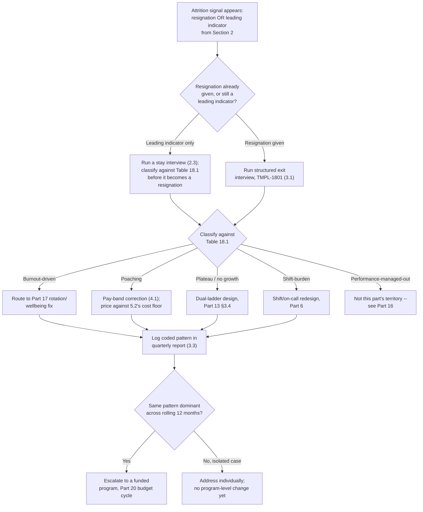

# Part 18 — Attrition & Retention

## Why this part exists

**[CONCEPT]** Every SOC loses people. The question this part answers is narrower than "how do we stop that" — no manager stops it entirely, and a program built on that premise is already lying to itself. The real questions are: which of the departures walking out the door this year were predictable and preventable, which lever actually would have kept the preventable ones, and what does it cost to pull that lever compared to what it costs not to. This part covers four things: the two attrition patterns that show up in a SOC more often and more predictably than in most other technical teams — the burnout-driven exit clustering in the 18- to 24-month range, and competitor poaching of mid-level analysts; a structured method for turning exit interviews into something a manager can act on instead of a folder of anecdotes; a hard look at which retention levers actually move a resignation rate and which ones only feel like they should; and a cost model that puts a real dollar figure on a departure so a retention investment can be defended in the same room as a raise pool, a training budget, or a new hire.

**[CONCEPT]** This part sits in Section D, between Part 17 — Burnout, Fatigue & Wellbeing and Part 19 — Team Culture & Psychological Safety, and it deliberately does not re-walk either neighbor's ground. Part 17 owns the mechanism behind burnout-driven exits — the shift-fatigue physiology, the circadian research, the rotation and wellbeing fixes — and this part cites that mechanism rather than re-deriving it; this part's job starts at the point where burnout has already produced, or is about to produce, a resignation. Part 14 — Mentorship & Knowledge Transfer owns the preventive response to a departure once it's coming — succession planning, knowledge capture, the exit-window sprint — and this part cites its cost figures rather than re-running that program here. Part 13 — Career Ladders & Promotion Criteria owns the mechanics of building a ladder and running a promotion committee; this part treats a working ladder as a retention lever and prices what happens when one is missing, without re-explaining how to build it. Part 20 — Building & Defending the SOC Budget owns how a retention investment gets defended as a line item against a CFO's questions; this part builds the number Part 20 defends. And Part 5 — Headcount & Capacity Modeling owns the arithmetic of shrinkage and backfill lag as headcount inputs; this part borrows that arithmetic as one ingredient in a cost-of-departure figure, not as something to re-derive from scratch. If a paragraph below starts explaining shift physiology, a promotion committee's composition, or a headcount formula, that paragraph has drifted — the fix is a citation, not more prose.

## 1. The SOC attrition curve: two patterns, two mechanisms

### 1.1 The 18- to 24-month burnout exit

**[CONCEPT]** A SOC's Tier 1 tenure curve has a recognizable shape: strong early retention through the first year, while the job is still new and the learning curve is still steep, followed by a sharp resignation spike concentrated in the 18- to 24-month window, tapering off for whoever survives past it. That window isn't arbitrary. It's roughly how long sustained shift-work fatigue, alert volume, and the accumulated weight of triaging other people's emergencies takes to outweigh the novelty that carried a new analyst through their first year — the physiological and workload mechanics behind that curve are Part 17's territory in full. What belongs here is the shape of the curve itself as a planning fact: if a SOC doesn't know where its own curve peaks, every retention conversation happens too late, aimed at analysts who are already several months past the point where a fix would have worked.

**[SENIOR MANAGER]** The practical use of the curve is timing, not diagnosis. Pull tenure-at-departure for the last two years of voluntary resignations and plot it as a simple histogram — most SOCs that do this for the first time are surprised by how sharply it clusters rather than spreading evenly across tenure. If the SOC's own peak sits at month 16 rather than month 20, the retention conversation — a 1:1 specifically about trajectory, workload, and what's next, not a routine check-in — needs to start by month 12, not month 18, because a conversation that starts after the disengagement has already set in is closer to an exit interview than a retention intervention.

### 1.2 Competitor poaching of mid-level analysts

**[SENIOR MANAGER]** The second pattern has a different mechanism and a different fix, and confusing the two is the single most common error in this part's territory. Poaching targets the analyst who is good enough to be immediately productive somewhere else — typically 18 months to three years in, past the burnout-exit window, with real triage judgment and no longer a flight risk on fatigue grounds alone. A competing MSSP or an enterprise standing up its own in-house SOC doesn't want to train someone; it wants someone who can carry a queue on day one, and it's willing to pay a real premium — commonly in the 15% to 20% range above the market rate this SOC is paying — to skip the ramp-up curve entirely. Part 7 — Hiring & Sourcing Analysts already documents how tight the mid-level market is from the sourcing side; this is the same tightness, experienced from the losing side of the transaction.

**[SENIOR MANAGER]** Part 10 — Competency Models & Skills Matrices shows the mechanism concretely in its own tenure-gating case: an analyst who was demonstrably ready for L2-level judgment months before the internal ladder's clock said so left for a competitor offering the L2 title immediately, rather than waiting out an arbitrary internal timeline. That's the poaching pattern's signature: it doesn't need to out-pay a fair internal ladder, only a slow or rigid one. A competitor doesn't have to win on total compensation if the internal path is visibly capped or visibly delayed relative to demonstrated readiness — it only has to offer the recognition faster than this SOC's own process does.

### 1.3 Naming the pattern before choosing the fix

**[CONCEPT]** A retention conversation that starts with "why are people leaving" instead of "which pattern is this" tends to reach for whatever fix is culturally comfortable — usually a culture initiative — regardless of whether that fix matches the actual mechanism. The table below is the diagnostic starting point Section 4 builds its lever recommendations from.

**Table 18.1 — Attrition pattern taxonomy for a SOC.** Use this to classify a departure (or a cluster of departures) before reaching for a fix; a fix aimed at the wrong pattern below wastes budget and doesn't move the number it was meant to move.

| Pattern | Typical tenure window | Signature signal | Primary driver | Owning fix |
|---|---|---|---|---|
| Burnout-driven exit | 18–24 months | Declining handle time/QA score, rising unplanned absence, disengagement in 1:1s | Sustained shift fatigue, alert volume, no recovery time | Rotation/wellbeing design (Part 17), workload rebalancing (Part 9) |
| Competitor poaching | 18 months to 3 years | Sudden resignation, minimal notice, named competitor/MSSP as destination | Pay gap or recognition-speed gap versus market | Pay-band correction, ladder-speed fix (§4.1–4.2) |
| Plateau/no-growth exit | 2–4 years | "Nowhere to go" cited directly in exit interview | No dual-ladder path for a strong senior IC | Dual-ladder design (Part 13 §3.4) |
| Shift-burden exit | Concentrated on night/weekend crews | Departures cluster on one shift, not team-wide | Uncompensated or unrotated undesirable shift load | Shift redesign, on-call pay (Part 6) |
| Performance-managed-out | Any tenure | Departure follows an open PIP | Skill/fit mismatch, not a retention failure | Part 16 — not this part's territory |

**[SENIOR MANAGER]** The last row matters as much as the first four: not every departure is a retention failure, and a program that tries to "retain" someone already on a performance-improvement plan is solving the wrong problem with the wrong tool. Part 16 — Performance Management & Coaching owns that judgment call; this part's levers apply to the first four rows, not the fifth.

## 2. Reading the signal before the resignation letter

### 2.1 Leading indicators: metrics, not vibes

**[SENIOR MANAGER]** By the time someone hands in a resignation letter, the decision is usually weeks or months old, which means a manager who only reacts to the letter is always working the trailing edge of the problem. The leading indicators worth tracking are operational metrics the SOC already collects for other reasons — handle time and escalation rate, as defined once and consistently in SOC Playbook Handbook, Part 32 — Metrics rather than redefined here, plus QA score, this book's own metric defined in Part 15 — Quality Assurance Programs — read for a specific shape: a sustained decline over 60 to 90 days in an analyst who was previously stable, not a single bad week. Part 9 — Queue Health & Workload Management already treats a declining team-wide clearance rate as a signal that routes to either a staffing diagnosis or a skill diagnosis; the same logic applied to one person, rather than a whole shift, is this part's leading-indicator signal for an individual at risk of leaving.

> **Cross-Book Pointer**
> This part does not define handle time or escalation rate — those definitions live in SOC Playbook Handbook, Part 32 — Metrics, and using a locally redefined version of either one here would silently create the exact same-number-two-ways problem this book's own production model is built to avoid. QA score is a different case: it's this book's own metric, defined once in Part 15 — Quality Assurance Programs and not redefined here either. What this part adds is a specific read on all three existing metrics: a 60- to 90-day downward trend in an individual's handle time or QA score, previously stable, is a flight-risk signal worth a direct conversation, distinct from the team-wide, program-level reading SOC Playbook Part 32 and this book's own Part 15 apply to the same underlying numbers.

### 2.2 The blind spot in every exit interview

**[HR/PEOPLE]** Every exit-interview program has a structural ceiling on what it can see, and a manager who forgets that ceiling exists will over-trust the data it produces.

> **Blind Spot**
> An exit interview only ever talks to someone who has already decided to leave — it captures a completed decision, not the six or eight weeks of disengagement that preceded it. That's fine for identifying a pattern across many past departures, and useless for catching the specific analyst who is six weeks out from resigning right now but hasn't said anything yet. A retention program built entirely on exit-interview themes is permanently one resignation cycle behind the attrition it's trying to prevent; §2.1's leading indicators and §2.3's stay interviews exist specifically to close that gap.

### 2.3 Stay interviews: the complement, not a replacement

**[FRONTLINE MANAGER]** A stay interview is the same structured-conversation format as an exit interview, run on someone with no plans to leave, asking a narrower question: what would make you consider leaving, and what's the best part of this job that a competitor's offer couldn't replicate. It works because it removes the two biases that distort an exit interview — the departing person's incentive to give a clean, non-burning-bridges answer, and the survivor-bias gap of never hearing from the people who stayed. Run it on a rolling basis, a small handful of conversations a quarter rather than a single annual event, so it functions as an ongoing pulse check rather than a survey that goes stale the month after it runs.

> **Field Test**
> **Setup:** Pick two or three analysts at random across different tenure bands — not just your most senior or most obviously engaged people.
> **Action:** Run a 20-minute stay interview using three fixed questions: "What's the one thing that would make you look at other openings?" "What's kept you here through a hard week recently?" and "If you could change one thing about how this role works day to day, what would it be?"
> **Expected result:** At least one answer per conversation should surprise you — something you couldn't have predicted from that person's metrics or your last 1:1. If every answer matches what you already assumed, either you already have unusually good visibility into your team, or the conversation wasn't candid; check which by asking someone else on the team what they told you.

## 3. Structured exit-interview analysis

### 3.1 Designing a question set that produces comparable data

**[HR/PEOPLE]** An exit interview run as an open-ended "so, what happened" conversation produces a different, incomparable narrative every time, which feels thorough and analyzes badly — six months of exit interviews conducted this way leaves a manager with six good stories and no pattern. A structured question set, asked the same way every time, trades some conversational warmth for the ability to code answers against the Table 18.1 taxonomy and actually count them.

The exit-interview question set (`TMPL-1801`), filed in Appendix A4 alongside the QA scorecard, calibration-session guide, and performance-improvement-plan template, is used by whoever runs the departing analyst's final conversation — ideally an HR partner or a manager one level removed from the departing person's own chain, not their direct manager, who is both an interested party and often (correctly) not trusted with a fully candid answer. Its main limitation: it structures the conversation, but it can't make a departing employee candid who has already decided that candor isn't worth the effort on their way out the door — corroborate its themes against the leading indicators in §2.1 and the stay-interview data in §2.3 rather than trusting a single exit interview's coded answer at face value.

### 3.2 Coding themes without overfitting to the last three departures

**[SENIOR MANAGER]** The most common analysis mistake is treating the most recent departure's stated reason as the organization's attrition problem, when a handful of interviews is too small a sample to generalize from reliably. Code every exit interview against the same fixed category list — ideally Table 18.1's five patterns, plus an "other" bucket for anything genuinely novel — and only treat a category as a real, actionable signal once it accounts for a clear plurality across a rolling 12-month window, not a single quarter's cluster. A SOC that loses three analysts in one bad month to three unrelated causes (one relocation, one performance exit, one genuine poach) will misread that month as a crisis in progress if it reacts to the raw count instead of the coded pattern underneath it.

### 3.3 Turning themes into a report a budget owner will read

**[EXECUTIVE]** The output of this analysis, run quarterly, should be short enough that a budget owner actually reads it: the baseline voluntary-attrition rate for the trailing 12 months, the coded breakdown against Table 18.1's five patterns, and — this is the part that turns a report into a decision — the one or two levers from Section 4 that map to whichever pattern is currently the largest coded share. A report that lists twelve themes with no ranking and no recommended action gets filed, not acted on; a report that says "poaching accounts for more coded departures than every other pattern combined this year, and here's what closing the pay gap costs against what the departures already cost" gets a budget conversation.

## 4. Retention levers that move the needle, and the ones that don't

### 4.1 Pay-band correction against poaching-driven exits

**[SENIOR MANAGER]** When Table 18.1's poaching row is the dominant coded pattern, the lever that actually moves the resignation rate is a pay-band correction for the specific level being targeted — not a raise pool spread evenly across the whole team, which dilutes the fix exactly where it's needed least and does almost nothing where it's needed most. Section 5.3 works this as a full worked example with real numbers; the design point here is narrower: benchmark the specific level being poached against the specific competitor doing the poaching, not against a generic industry survey that may not reflect the local labor market a competitor just disrupted by opening an office nearby.

### 4.2 Career-pathing against plateau exits

**[SENIOR MANAGER]** When Table 18.1's plateau row dominates, the fix is structural, not financial: a dual-ladder design that gives a strong senior individual contributor a title, a pay ceiling, and real scope above Senior Analyst without forcing them into the team-lead branch — Part 13 §3.4 already owns this design in full, and this part's job is only to confirm it's the lever that actually addresses this specific pattern. Throwing a pay-band correction at a plateau exit without the structural fix just delays the same resignation; the person wasn't underpaid relative to their current title, they had no title left to grow into.

### 4.3 Shift and on-call redesign against shift-burden exits

**[FRONTLINE MANAGER]** When departures cluster on one shift rather than spreading evenly across the team, the diagnostic in Table 18.1 points at the shift itself, not the people rostered on it — a night crew that skews toward whoever has the least seniority and the least ability to say no, as Part 6 names it, will keep losing whoever's on it regardless of how good this SOC's pay band or career ladder otherwise is. The fix is Part 6's territory: rotation redesign, a real on-call stipend rather than an assumption that base salary already covers being paged, and rotating the undesirable shift's burden across more of the team instead of concentrating it on the newest hires by default.

### 4.4 What doesn't move the needle

**[SENIOR MANAGER]** Three levers get reached for constantly because they're cheap, fast, and visible, and none of them address the actual mechanism behind Table 18.1's top two rows.

> **Management Autopsy — "answer a poaching wave with a culture initiative" (COMPOSITE CASE EXAMPLE, `CASE-1802`)**
>
> **The decision:** After losing several mid-level analysts to a competitor's aggressive local hiring push, a SOC manager responds by launching a team-culture initiative — a catered monthly lunch, a revamped recognition program, a redecorated break room — without adjusting the pay band the departing analysts were being outbid on.
>
> **Why it seemed reasonable:** The initiative was fast to approve, visible to the whole team immediately, and framed internally as "investing in retention" without requiring a difficult compensation conversation with finance.
>
> **How it failed:** The analysts still on the team liked the lunches and kept interviewing anyway, because a free lunch doesn't close a $12,000-a-year gap (CONCEPTUAL SAMPLE — illustrative pay gap, not sourced benchmark data) between what this SOC pays and what the competitor down the road is offering for the identical job. Two more resignations followed within the same quarter, both citing pay directly in their exit interviews, and the manager had by then spent real budget on something that measurably didn't touch the pattern actually driving the losses.
>
> **The fix:** Diagnose the pattern against Table 18.1 before choosing the lever — a poaching-driven exit is a pay-gap problem and gets a pay-band fix (§4.1, §5.3); a culture initiative is a real and valid investment against a completely different pattern (disengagement, weak psychological safety, the territory Part 19 owns), and spending it against the wrong pattern doesn't just fail to help, it spends the budget that could have funded the fix that would have worked.

**[SENIOR MANAGER]** Counter-offers are the second lever that looks like it works and mostly doesn't. Matching one departing analyst's outside offer, one time, can be the right call — but it establishes, in full view of the rest of the team, that the fastest route to a raise is an outside offer in hand, not a documented case through the normal process.

> **People Risk Trap**
> A counter-offer strategy run repeatedly, case by case, without a corresponding pay-band review, trains the whole team that leverage — not performance — is what actually moves pay, and it recreates the exact leveling-drift dynamic Part 13's own case study on retention-driven counter-promotions describes, just on the compensation axis instead of the title axis. The fix: cap counter-offers at genuinely rare, individually justified exceptions, and treat two or more counter-offers on the same role within a year as a mandatory trigger for a full pay-band review under §4.1 — the review is the actual fix, and the counter-offer was only ever buying time for it to happen.

**[HR/PEOPLE]** The third weak lever is the exit interview itself, treated as if collecting the data were the intervention. Running exit interviews and coding them well (§3) is real, necessary infrastructure — but it changes nothing on its own unless the coded themes actually drive a §4.1–4.3 decision afterward. A SOC that has run exit interviews faithfully for three years with no pay-band review and no ladder change in that window isn't running a retention program; it's running a well-documented attrition-observation program.

### 4.5 A lever scorecard

**[SENIOR MANAGER]** Table 18.2 consolidates §4.1 through §4.4 into a single reference for a manager choosing where to spend a limited retention budget in a given quarter.

**Table 18.2 — Retention lever scorecard.** Match the lever to the coded pattern from Table 18.1 before committing budget; a lever aimed at the wrong pattern below is money spent with no measurable effect on the resignation rate it was meant to move.

| Lever | Targets which pattern | Moves the needle? | Typical cost | Notes |
|---|---|---|---|---|
| Pay-band correction | Poaching | Yes | Recurring, several thousand dollars per affected analyst per year | See §4.1, §5.3 |
| Dual-ladder / senior-IC track | Plateau | Yes | Low direct cost; mostly a design and title decision | Part 13 §3.4 owns the design |
| Shift/on-call redesign | Shift-burden | Yes | Low to moderate — stipend cost, coverage-model change | Part 6 owns the mechanics |
| Rotation/wellbeing program | Burnout | Yes, on the burnout row specifically | Moderate — coverage cost during protected recovery time | Part 17 owns the mechanics |
| One-time counter-offer | Poaching (single case) | Short-term only | One-time, often less than a full pay-band fix | Escalates to §4.1 if repeated |
| Culture/perks initiative | Disengagement (Part 19's territory) | Not for poaching or pay-driven plateau exits | Low to moderate, recurring | Real value against the wrong pattern is a mismatch, not a benefit |
| Exit interviews alone, no follow-through | None | No | Low | Necessary input, not itself an intervention |

## 5. Modeling the true cost of attrition against retention investment

### 5.1 What belongs in a fully loaded cost-per-departure figure

**[SENIOR MANAGER]** A retention investment gets rejected far more often for lack of a comparison number than for being a bad idea on its own terms — a $9,000 pay correction sounds expensive in isolation and cheap the moment it's set next to what replacing the person it retains actually costs. Build the comparison from five components, each already covered elsewhere in this book and assembled here rather than re-derived: sourcing and recruiting cost (Part 7's channel-cost data), the coverage gap during backfill lag (Part 5's time-to-fill and shrinkage arithmetic), lost output while the replacement ramps to full productivity, the manager and team-lead time spent on the search and onboarding, and — the component most models skip — the knowledge and judgment that leaves with the departing person, which Part 14's own succession-planning case already prices concretely for a specialist role.

### 5.2 Worked example: the fully loaded cost of one mid-level departure

CONCEPTUAL SAMPLE -- illustrative figures for a generalist L2 analyst departure, not sourced benchmark or audited financial data; substitute your own team's actual recruiting, ramp, and coverage costs before using this for a real budget defense.

```text
Sourcing and recruiting (blended internal/external channel, per Part 7's cost-per-hire range):     $7,000
Backfill-lag coverage gap (70 days at reduced capacity; overtime/contractor coverage):              $9,500
Ramp-to-productivity shortfall (reduced output for ~90 days post-start, per Part 11's ramp curve):  $6,500
Manager/team-lead time (search, interviews, onboarding oversight, ~40 hours fully loaded):          $2,500
Knowledge loss / elevated error-rate cost during the gap (lower bound for a generalist L2 seat):    $3,500
-----------------------------------------------------------------------------------------------------
Fully loaded cost, one mid-level departure:                                                       ~$29,000
```

**[SENIOR MANAGER]** That figure is a floor, not a ceiling — it assumes a generalist L2 seat with reasonably documented procedures. Part 14 — Mentorship & Knowledge Transfer's own case (`CASE-1401`) prices a specialist departure with no succession plan at a materially higher cost: roughly $46,000 in interim contractor coverage and $22,000 in absorbed overtime in a single quarter alone, on top of a 116-day replacement search, because a detection engineer's departure carries technical debt a generalist analyst's doesn't. Losing a detection engineer with undocumented tuning rationale also converts every rule that engineer owned into detection debt in Detection Engineering Handbook V2's own terms (DEH V2, Part 43 — Detection Debt) the moment they're unavailable to explain it — a cost this part's dollar figure doesn't fully capture and that book's does. Part 3 — Tiering Models already flags this asymmetry directly: losing a Tier 3 or lead-level analyst hurts disproportionately to the headcount share that role represents, and the $29,000 floor above should be scaled up accordingly for any seat with real specialist depth.

### 5.3 Worked example: the poaching wave

**CASE-1801 — the local-office poaching wave.** *COMPOSITE CASE EXAMPLE — merges patterns from several mid-market SOCs facing new local competition, not one traceable organization; figures below are illustrative.*

**[SENIOR MANAGER]** A 28-analyst SOC runs a 10-person L2 tier at a pay band of $70,000–$80,000. A competing MSSP opens a local office and begins recruiting directly from the area's SOC analyst pool at a 15% to 20% premium over that band. Within four months, the SOC loses four of its 10 L2 analysts to the new competitor — a coded poaching pattern under Table 18.1, confirmed by name-the-competitor answers across all four exit interviews.

**[SENIOR MANAGER]** The manager's first response is the one-time counter-offer lever from §4.4: a $5,000 retention bonus offered to the remaining six L2 analysts, with no change to the underlying pay band. One additional analyst resigns within the following 90 days despite having taken the bonus, citing the same pay gap in their exit interview — the bonus bought a quarter of retention on that individual case, not a fix to the pattern.

**[SENIOR MANAGER]** The root-cause response, approved for the next budget cycle through the business case Part 20 owns building, corrects the L2 band to $80,000–$92,000 for the remaining five L2 analysts — an average increase of roughly $9,500 per analyst, or about $47,500 a year in recurring cost across the corrected cohort. Applying §5.2's $29,000 floor, avoiding just two further poaching-driven departures a year pays back the correction's entire recurring cost, before counting the knowledge, continuity, and coverage benefits a raw dollar comparison leaves out. Over the following 12 months, the corrected cohort loses one analyst, not the four-of-ten pace the SOC was on before the fix — a result consistent with §4.1's claim that a targeted pay-band correction, not a culture initiative or a repeatable bonus, is the lever that actually closes a poaching-driven gap.

### 5.4 A decision path from signal to lever

**[SENIOR MANAGER]** The flow below ties Sections 2 through 5 together as a single path a manager can actually run: from a leading indicator or a resignation, through classification against Table 18.1, to the lever and the cost comparison that justifies it.





**Figure 18.1 — From attrition signal to lever, classification through budget escalation.** *CONCEPTUAL.* Illustrates the decision path this part builds across Sections 2 through 5: a signal (leading indicator or resignation) is classified against the Table 18.1 taxonomy, routed to the matching lever, logged, and escalated to a funded program only once a pattern, not an isolated case, shows up across a rolling 12-month window. This is a process design, not a capture of any single organization's actual workflow. Supports every lever recommendation in Section 4 and the escalation trigger referenced in §3.3 and Part 20. `FIG-1801`.

## 6. Building the standing program

### 6.1 Who owns this, and on what cadence

**[SENIOR MANAGER]** None of Sections 2 through 5 works as a one-time project. Own three things on a fixed, recurring cadence: the tenure-at-departure histogram from §1.1, re-pulled twice a year; the coded exit-interview theme report from §3.3, run quarterly; and a pay-band benchmark check against any competitor known to be actively hiring locally, reviewed at minimum once a year and immediately after any confirmed poaching-pattern cluster. The SOC manager is accountable for the pay-band and ladder-design decisions this data feeds; an HR partner co-owns running the exit and stay interviews themselves, for the same reason Part 14 keeps knowledge-capture audits out of HR's sole hands — the manager has to see the raw signal directly, not only a summarized version of it filtered through a partner who wasn't in the room for the day-to-day pattern.

### 6.2 Tying the program to budget season

**[EXECUTIVE]** The quarterly report from §3.3 is only as useful as the budget cycle it feeds. A pay-band correction identified in a Q2 report and not proposed until the next annual budget cycle in Q4 gives a poaching wave two more quarters to run — Part 20 — Building & Defending the SOC Budget owns how to build and time that business case, but this part's job is making sure the case exists, with real numbers attached, before the budget conversation happens rather than being improvised in it.

> **What Would Change My Mind**
> This part treats pay-band correction as the lever that actually closes a poaching-driven gap, and treats culture initiatives and repeated counter-offers as levers that don't. If a SOC facing a confirmed, sustained poaching pattern held its attrition rate flat for a year using only non-monetary levers — a stronger dual-ladder path, materially improved scheduling, and a genuine culture investment, with no pay-band change at all — while a comparable local competitor's premium stayed in the 15%-to-20% range this part assumes, that would undermine the claim that pay is the load-bearing variable in this specific pattern, and the confidence rating on §4.1 and §5.3's argument should drop from "reliable for a confirmed pay-gap pattern" to "context-dependent — verify the actual gap before assuming money is the fix."

---

**Cross-references:** Within this book, this part assumes Part 5 — Headcount & Capacity Modeling (backfill-lag and shrinkage arithmetic used in §5.2), Part 6 — Shift Pattern & Coverage Design (the shift-burden pattern and its fix in §4.3), Part 7 — Hiring & Sourcing Analysts (channel cost data used in §5.1–5.2), Part 13 — Career Ladders & Promotion Criteria (the dual-ladder fix in §4.2 and the counter-offer/leveling-drift parallel in §4.4), Part 14 — Mentorship & Knowledge Transfer (the specialist-departure cost figure cited in §5.2, `CASE-1401`), and Part 17 — Burnout, Fatigue & Wellbeing (the mechanism behind §1.1's tenure curve). It points forward to Part 16 — Performance Management & Coaching (the performance-managed-out row this part excludes), Part 19 — Team Culture & Psychological Safety (the pattern culture initiatives actually address), Part 20 — Building & Defending the SOC Budget (defending §5's cost figures and §6.2's business case), and Part 3 — Tiering Models (the disproportionate cost of losing a Tier 3 or lead-level analyst, scaling §5.2's floor). Outside this book, it cites SOC Playbook Handbook, Part 32 — Metrics (the handle-time, QA-score, and escalation-rate definitions §2.1's leading indicators read) and Detection Engineering Handbook V2, Part 43 — Detection Debt (the technical-debt cost of an undocumented departure, alongside this part's dollar figure in §5.2).
