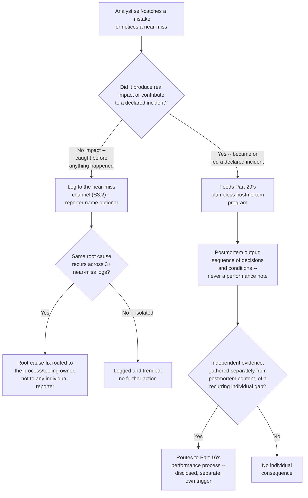

# Part 19 — Team Culture & Psychological Safety

## Why this part exists

**[CONCEPT]** A blameless postmortem policy that exists only as a paragraph in the team wiki changes nothing about what actually happens the next time an analyst realizes, alone, that they mis-triaged something several hours ago. What changes that moment is whether the analyst believes — based on what they've actually watched happen to someone else, not what a policy document promises — that saying so out loud costs them less than staying quiet does. That belief is psychological safety, and it is the precondition this part is named for: without it, a blameless postmortem program is a room full of people describing what they're comfortable admitting rather than what actually happened, and a near-miss reporting channel is a channel nobody uses. This part is about building and protecting that precondition, not about running the postmortem program itself.

**[CONCEPT]** Four things sit inside this part's scope, and each has a hard edge where another part or book picks up the mechanics. Blameless postmortem culture is the trust layer underneath honest incident review, with Part 29 — Post-Incident Organizational Review owning the actual program — cadence, participants, corrective-action tracking — that this culture has to make honest. Psychological safety is the specific mechanism that gets an analyst to report a near miss or a self-caught mistake early rather than late or never. Diversity and inclusion in hiring and scheduling sits downstream of Part 7 — Hiring & Sourcing Analysts and Part 8 — Interviewing & Technical Assessment Design, which already own the sourcing-channel and debiased-assessment mechanics that get a diverse candidate into the pipeline; this part owns what happens to that pipeline afterward — whether it survives conversion into a diverse, retained team, and whether the operational schedule built in Part 6 — Shift Pattern & Coverage Design quietly filters people back out after they're hired. And sustaining all of the above across a distributed or fully remote team is genuinely new ground: nothing else in this book addresses what happens to culture when the ambient, incidental contact of a shared physical space disappears.

**[CONCEPT]** One thing this part deliberately refuses to do: treat culture as a single soft, unmeasurable good feeling. Every section below states a specific, observable behavior culture is supposed to produce — early self-reporting, a diverse team that stays past its first year, a remote analyst who actually knows the team's real norms rather than its written ones — and a way to check whether that behavior is happening. A culture program that can't say what it's supposed to make people do differently isn't a program a manager can defend, staff, or fix.

## 1. Psychological safety: the mechanism behind honest self-reporting

### 1.1 What psychological safety actually means for a SOC

**[CONCEPT]** Psychological safety, in the sense this part uses it — the construct most associated with Harvard researcher Amy Edmondson's decades of team-effectiveness research — is a specific, testable belief held by a team member: that speaking up with a mistake, a question, a concern, or a piece of bad news will not get them punished, humiliated, or quietly held against them later. It is not the same thing as a comfortable team, a friendly team, or a team with no conflict. A team can be psychologically safe and still argue hard about a disposition call, and a team can be pleasant and low-conflict while every analyst on it privately edits what they're willing to say in a postmortem. The test is behavioral, not emotional: does the belief actually change what someone says, and when they say it.

**[FRONTLINE MANAGER]** The sharpest version of the test for a SOC specifically: an analyst realizes, alone on an overnight shift, that a disposition they closed several hours earlier as a false positive was wrong — a fresher alert now shows the pattern they dismissed on the earlier ticket. Do they reopen it and message the on-call lead right now, admitting the earlier call was wrong? Or do they wait for the shift handoff, hoping the next shift catches it independently so the mistake never has to be attributed to them by name? Every other mechanism in this part is, in one way or another, about moving that specific decision toward the first branch.

### 1.2 Why this is an operating requirement, not a soft skill

**[SENIOR MANAGER]** The gap between "reported in minutes" and "reported in days" is not a comfort question, it's a dwell-time question, and dwell time is one of the most expensive variables in an active intrusion. A self-caught mistake that gets reported the moment it's noticed can usually be corrected inside the same shift. A self-caught mistake that gets sat on for fear of the reaction gets reported — if it gets reported at all — on whatever schedule the analyst's own courage and guilt resolve on, which has nothing to do with how fast the underlying exposure is getting worse.

**CASE-1901 — the six-day gap.** *COMPOSITE CASE EXAMPLE — merges patterns from several mid-size in-house SOCs' post-incident reviews where a delayed self-report was identified as a contributing factor; no single organization is identifiable, and all figures are illustrative.*

A 12-analyst SOC closes a lateral-movement alert as a benign administrative script six hours after it fires, during a busy overnight shift already running short-staffed. Two days later, the same analyst notices a structurally similar alert against a different host and recognizes, this time, that the pattern matches a known post-exploitation technique rather than routine administration. They do not reopen the original ticket or tell anyone. Six months earlier, a different analyst on the same team had self-reported a comparable disposition error in a team channel and had it referenced, by name, in their next quarterly review as an example of "attention to detail concerns" — a fact the whole team knew about within a week, whether or not it was ever formally confirmed.

```text
CONCEPTUAL SAMPLE -- illustrative figures, not sourced benchmark or audited incident data

Time from mistake to self-recognition:               ~6 hours (unavoidable -- the
                                                        pattern only became recognizable
                                                        once a second, related alert fired)
Time from self-recognition to disclosure:              6 days
Estimated attacker dwell time added by the gap
  between recognition and disclosure:                  ~5.5 days
Additional hosts reached during the extended
  dwell window:                                         3 (versus an estimated 0-1 had
                                                        containment started within hours
                                                        of recognition)
Estimated incremental containment and forensic
  cost attributable to the extended dwell window:       $38,000-$55,000
```

**[SENIOR MANAGER]** Nothing about the six-day gap required a weak analyst or a weak detection. The team's own detection worked — it eventually produced the second alert that triggered recognition. What failed was the few minutes it should have taken to send one message saying "I think I got this one wrong," weighed against six days of an analyst doing the arithmetic on what happened to a colleague six months earlier and concluding that silence was the safer bet.

> **Blind Spot**
> A QA program built on ticket sampling (Part 15 — Quality Assurance Programs) can score the *original* disposition on the ticket it reviews, but it has no way to see the six days CASE-1901 lost between recognition and disclosure — that gap never generated a ticket, a QA sample, or an escalation for anyone to review until the analyst finally spoke up. Whatever fraction of your "average time to correct a known-bad disposition" number looks fast is, by construction, measuring only the mistakes that got reported promptly. The slow ones stay invisible to that same metric until something else — an audit, a second incident, an exit interview — surfaces them independently, usually much later and at much higher cost.

### 1.3 Measuring whether you actually have it

**[HR/PEOPLE]** Most managers assume they know whether their team has psychological safety, and most are wrong in a specific direction: a manager who feels comfortable being challenged in a 1:1 routinely overestimates how safe the newest, most junior, or most different-from-the-manager team member feels doing the same thing. Assumption is not measurement. A short, anonymous survey — five to seven items, run separately from the standing engagement survey so it isn't buried inside dozens of other questions about pay and benefits — gives an actual baseline. The table below states five representative item types and what a low score on each specifically indicates, so a low aggregate score turns into a specific fix rather than a vague "improve culture" action item.

| Item type (paraphrased) | Low score indicates | Where the fix lives |
|---|---|---|
| "If I make a mistake on this team, it will be held against me." | Fear-driven disposition inflation and slow self-reporting | §1.2, §2.2 |
| "It is easy to ask another analyst or my lead for help on this team." | Analysts working ambiguous tickets alone rather than escalating | §2.3 |
| "People on this team are willing to raise problems and tough issues." | Near-misses and process gaps are noticed but not voiced | §3 |
| "I can bring up a mistake I made without being embarrassed in front of the team." | A public-shaming pattern in stand-ups or postmortems | §2.2, §2.3 |
| "I feel as connected to this team's actual culture as someone sitting in an office would." | A distributed or remote culture gap invisible to an in-office manager | §5 |

**[FRONTLINE MANAGER]** Run it at the team level, not the org level, and report results back to the team that took it within a couple of weeks — a survey whose results disappear into a director's slide deck and never come back to the people who answered it teaches exactly the same lesson as a blameless-postmortem policy that turns out not to be blameless: the mechanism is theater.

> **Manager's Note**
> Don't run this survey for the first time right after a bad incident or a round of layoffs — you'll get a real number, but it'll be depressed by an acute event rather than your team's actual baseline, and comparing next quarter's score against it will look like a big improvement that's really just the acute stress wearing off. Get a baseline during a calm period if you can, and note the date of any major disruption next to every reading you take afterward.

## 2. Blameless postmortem culture as precondition, not program

### 2.1 The precondition/program split

**[CONCEPT]** Part 29 — Post-Incident Organizational Review owns the blameless postmortem program as a designed artifact: who's in the room, how often it runs, how a corrective action gets tracked so the same finding doesn't recur across incidents. None of that program design determines whether the people in the room actually tell the truth. A postmortem run with a perfect cadence, the right participants, and a rigorous corrective-action tracker still produces a sanitized, defensive account of what happened if the room isn't safe — the mechanics can be flawless and the input can still be fiction. This part owns that input quality: the manager behaviors and standing norms that determine whether a postmortem's account of what happened and why is the real one.

**[CONCEPT]** The distinction matters because the two failure modes look identical from the outside and need opposite fixes. A postmortem program that produces thin, generic findings might have a design problem — Part 29's job to fix, by changing who attends or how corrective actions get tracked — or it might have a trust problem, where the room is designed correctly but nobody in it is willing to say what actually happened. Fixing the wrong one wastes a redesign cycle on a program that was never structurally broken.

### 2.2 Blameless does not mean consequence-free

**[SENIOR MANAGER]** "Blameless" gets misread constantly as "nothing bad ever happens to anyone, no matter what." That's not the claim. The claim is narrower and more precise: an honest, good-faith mistake, disclosed promptly, does not become the basis for a performance consequence, because punishing disclosure teaches concealment, and concealment is strictly worse for the organization than the mistake itself in almost every case. It does not mean a genuine pattern of repeated, avoidable errors is invisible to performance management, and it does not mean negligence or a deliberate policy violation gets the same treatment as an honest slip. The line runs between the disclosure and the underlying pattern: a postmortem's content should never be the trigger for a performance conversation, but an independently observed pattern — the same category of mistake recurring across multiple unrelated postmortems, spotted by whoever tracks corrective actions rather than dug out of any single blameless account — legitimately is, and Part 16 — Performance Management & Coaching owns that separate, disclosed process.

> **Management Autopsy — "announce blameless, track it privately anyway" (COMPOSITE CASE EXAMPLE, `CASE-1903`)**
>
> **The decision:** A SOC manager publicly rolls out a blameless-postmortem policy to the team, and privately continues logging postmortem-disclosed mistakes in each analyst's individual performance notes, reasoning that a manager needs a complete record even if it's never formally cited.
>
> **Why it seemed reasonable:** It looked like a low-cost compromise — get the stated benefit of a blameless culture while still preserving a paper trail a manager might need later, and nobody had to know the trail existed unless it ever actually came up.
>
> **How it failed:** It came up. An analyst saw a line referencing a specific postmortem-disclosed mistake in their annual review months later, mentioned it to a teammate, and within two weeks the whole team understood that "blameless" meant "not blamed out loud, in the room, on the day" rather than "not held against you, ever." Near-miss reports, which had briefly risen after the policy launched, fell back below their pre-policy baseline within a month — lower than before the policy existed, because now the team had direct evidence the stated policy didn't match the real one.
>
> **The fix:** Draw the line in writing, and make it structural rather than a promise: postmortem content is never entered into, referenced by, or accessible to the performance-review process, full stop, enforced by keeping the two systems in genuinely separate tools with no shared owner who could cross-reference them casually. If a real pattern needs a performance conversation, it has to be built from evidence gathered independently of the postmortem record — QA scores, direct observation, ticket data — never from "I remember they mentioned this in the postmortem months ago."

### 2.3 The three-question test for whether "blameless" is real

**[FRONTLINE MANAGER]** A written policy is not evidence the policy is real. Three questions, asked honestly, tell a team lead more than the policy document ever will. Has anyone, ever, had something disclosed at a postmortem show up in a later review, a compensation conversation, or a hallway comment from someone senior — even once, even softened? Does the postmortem's written output describe a sequence of decisions and system conditions, or does it name individuals as the explanation ("Analyst X missed this") rather than describing what about the situation made the miss likely? And would a new hire, hearing about the last postmortem secondhand from a teammate rather than reading the policy, describe it as something they'd want to be involved in, or something they'd want to avoid being named in?

> **Manager's Note**
> Model the first disclosure yourself, and make it visible. The fastest way to convince a team that admitting a mistake is safe is to publicly admit one of your own — a scheduling call that backfired, a risk-acceptance decision that turned out wrong, a time you personally mis-triaged something years ago — before asking anyone junior to go first. A team watches what a manager actually does with their own mistakes far more closely than they read what a policy says should happen with everyone else's.

## 3. Near-miss reporting: the leading indicator no other program can see

### 3.1 Why near-misses are invisible to QA and to the postmortem program

**[SENIOR MANAGER]** A near miss, by definition, never became an incident and often never became a ticket anyone else touched — an analyst catches their own error before it propagates, a suppression rule almost hides something real but a second, unrelated alert happens to catch it anyway, a scheduling gap almost leaves a queue uncovered but someone picks up an extra shift at the last minute. None of that generates the artifact any of this book's other quality mechanisms review: Part 15's QA program samples closed tickets, and a near miss that never became a ticket has nothing to sample; Part 29's postmortem program reviews declared incidents, and a near miss that stayed a near miss never gets declared. A near-miss reporting channel is the only mechanism in a SOC's toolkit that can see this category of information at all, and it only works if someone actually uses it.

### 3.2 A lightweight near-miss reporting mechanism

**[FRONTLINE MANAGER]** The mechanism that works is deliberately smaller and faster than a postmortem: a single-channel, low-friction log — a dedicated chat channel, a one-field form, whatever the team already checks daily — built around four fields, not a full incident write-up, because a reporting process that takes twenty minutes to fill out gets used a handful of times before people quietly stop. The table below states the four fields worth capturing and why each earns its place, rather than the longer field list a full postmortem template would use.

| Field | Why it's worth capturing | What it should not require |
|---|---|---|
| What almost happened | The specific near-miss event, in one or two sentences | A root-cause analysis — that comes later, if at all |
| What caught it | The thing that actually prevented escalation (a second alert, a lucky catch, a colleague's question) | An assumption that the same catch will work next time |
| What it would have cost if uncaught | A rough, honest guess at the downstream impact | Precision — "probably a missed detection window on a real intrusion" is a complete answer |
| Reporter name | Optional, reporter's choice | Ever mandatory — see §2.2's boundary |

**[FRONTLINE MANAGER]** The reporter-name field being optional is not a small detail — it's the field that determines whether the channel gets used by anyone below the confidence level of someone who already trusts the blameless policy completely. Early in a program's life, before trust is established, expect most reports to arrive anonymous; a rising proportion of named reports over time is itself one of the better leading indicators that the §1.3 survey score is moving in the right direction, not just a nice-to-have.

### 3.3 The disclosure-to-consequence pipeline

**[SENIOR MANAGER]** Figure 19.1 turns §2.2's boundary — blameless for the disclosure, not consequence-free for an independently observed pattern — into an actual routing decision rather than a promise, so a team lead handling a specific report has a concrete answer for "where does this go" instead of relying on fresh judgment every time.





**Figure 19.1 — Mistake and near-miss disclosure flow, separated from performance consequence.** *CONCEPTUAL.* Illustrates how a self-caught mistake or near miss routes to either the lightweight near-miss log or Part 29's postmortem program, and how a genuine individual performance question can only enter Part 16's process through independently gathered evidence — never through the disclosure itself. This is a structural decision aid, not a capture of any single organization's actual workflow. Diagram ID `FIG-1901`.

**[SENIOR MANAGER]** The node most managers skip in practice is the recurrence check — whether a near miss's root cause repeats — because a single near-miss report feels too small to warrant tracking over time the way a postmortem's corrective action is tracked. Route recurring near-miss root causes to whoever owns the relevant process or tool, the same way Part 29 routes a postmortem's corrective action, or the channel becomes a place where the same gap gets reported five separate times over a year with nothing ever fixed.

### 3.4 Worked example: near-miss reporting rate as an early-warning metric

**CASE-1902 — near-miss reporting before and after a stated no-review-impact guarantee.** *COMPOSITE CASE EXAMPLE — merges patterns from several SOCs that introduced a formal near-miss channel alongside explicit manager-modeled disclosure; no single organization is identifiable, and all figures are illustrative.*

An 18-analyst SOC launches a near-miss channel with the fields from §3.2, an explicit written guarantee that channel content never touches performance review, and a team lead who opens the first month by publicly logging two of her own near-misses from the prior quarter.

```text
CONCEPTUAL SAMPLE -- illustrative figures, not sourced benchmark or audited data

Near-miss reports logged, month before launch (informal count,
  reconstructed from hallway/chat mentions, not a real channel):     ~1
Near-miss reports logged, month 1 after launch:                       6
Near-miss reports logged, month 4 after launch:                      14
Proportion of reports carrying a reporter name, month 1:             15%
Proportion of reports carrying a reporter name, month 4:             55%
Estimated average lag between self-recognition of a real mistake
  and disclosure, reconstructed from postmortems mentioning delay,
  before launch:                                                    ~4.2 days
Same lag, measured across postmortems in the two quarters
  after launch:                                                    under 6 hours
```

**[SENIOR MANAGER]** One report in month three named a suppression exception on a rarely triggered rule that had, on inspection, been silently masking a real technique for several weeks — caught not because the rule fired again, but because an analyst updating an unrelated exception noticed the older one looked wrong and logged it as a near miss rather than quietly fixing it and moving on. The fix took under a day once flagged. Estimating what an unnoticed multi-week masking window would have cost is speculative by nature — there's no way to know what, if anything, would have exploited that gap — but this is exactly the kind of silent, undocumented suppression exception Detection Engineering Handbook V2, Part 43 — Detection Debt treats as debt accruing whether or not anyone notices it accruing, and the reporting channel is the only reason this instance surfaced before the debt came due.

## 4. Diversity and inclusion in hiring and scheduling

### 4.1 Why this is this part's territory, not Part 7's or Part 8's

**[CONCEPT]** Part 7 — Hiring & Sourcing Analysts already covers building sourcing channels that reach non-traditional and under-represented candidates, and why over-indexing on certifications during sourcing screens capable people out before anyone even sees a resume. Part 8 — Interviewing & Technical Assessment Design already covers de-biasing the structured-interview process itself — scorecards anchored to observable behavior, calibration gates that lock scores before debrief. Both parts do real, specific work getting a diverse candidate pool to an offer. Neither part follows that candidate past the offer to ask whether the team they're joining, and the schedule they're joining it into, actually keeps them — and that gap is exactly where a diversity effort that looks successful at the hiring-funnel stage quietly fails a year later. This part owns that gap: what happens to a fairly sourced, fairly assessed hire once they're inside a specific team's culture and a specific shift's schedule.

### 4.2 Closing the gap between a diverse pipeline and a diverse, retained team

**[HR/PEOPLE]** A hiring funnel can be diverse at every stage Part 7 and Part 8 directly control — sourced pool, interview slate, offer — and still lose that diversity at two points neither part owns: the informal "would this person fit in with the team" conversation that happens after the structured scorecard closes, and the retention curve over the candidate's first year once they're actually on the team. The first point re-introduces exactly the unstructured, gut-feel judgment Part 8's calibration gate exists to remove, just one step later in the process, where it's harder to catch. The second point is a culture question this part owns directly: a diverse hire retained for eleven months and then gone is not a hiring success by any measure that matters.

**[HR/PEOPLE]** The table below maps where a fairly run hiring funnel most often loses diversity after the point Part 7 and Part 8's mechanics stop controlling it, and where the actual fix lives.

| Funnel stage | How diversity quietly leaks out here | Where the fix lives |
|---|---|---|
| Post-scorecard "team fit" conversation | An unstructured gut check re-introduces the exact bias the Part 8 calibration gate removed, one step later | Extend Part 8's calibration discipline to this conversation, or eliminate it as a separate gate entirely |
| Panel composition | An all-one-background interview panel signals something to a candidate before a single question is asked, regardless of how fair the questions are | Deliberately mix panel composition on every loop, not just for candidates from under-represented backgrounds |
| First ninety days | A new hire outside the team's existing majority demographic gets less informal mentorship by default | Part 14's deliberate mentor-matching, applied without waiting for a demographic pattern to show up in attrition data first |
| Year-one retention | Isolation, a lack of psychological safety specific to being the only one of a kind on the team, or a schedule that structurally excludes them | This section and §4.3, tracked against the caution in §4.4 |

> **People Risk Trap**
> A "culture fit" question added back into the hiring process after the structured scorecard closes — even informally, even just among interviewers comparing notes over lunch — reproduces the exact unstructured bias Part 8's calibration gate was built to remove, and it's harder to catch because it happens outside any documented step. The fix: if "fit" matters, define it as specific, observable behaviors on the same scorecard everything else is scored against, evaluated by the same calibrated panel, before the loop closes — not as a separate, undocumented gut check afterward.

### 4.3 Scheduling as an inclusion lever, not just a coverage puzzle

**[SENIOR MANAGER]** Part 6 — Shift Pattern & Coverage Design owns the coverage mathematics of a shift pattern — how many people, on which rotation, covering which hours. It does not, by itself, ask whether that pattern quietly excludes categories of otherwise-qualified people before they ever apply, or burns out the people already on it faster than others on the same team. Three patterns recur often enough to name directly. Rotating night shifts fall disproportionately on analysts with caregiving responsibilities, who are still more often women and single parents than not. Rigid on-call rotations with no swap flexibility push out analysts managing a chronic condition or disability that needs a predictable schedule for treatment. And holiday coverage assigned by informal volunteering defaults to whoever is least comfortable saying no — usually the newest hires and, specifically, whichever religious minority on the team doesn't observe whatever holiday the majority of the team wants off.

**[SENIOR MANAGER]** The table below names each scheduling lever, the specific inclusion risk it creates if left undesigned, and where the actual shift-design fix belongs.

| Scheduling lever | Inclusion risk if left undesigned | Where the fix belongs |
|---|---|---|
| Fixed night or rotating-night assignment | Disproportionately burdens caregivers; can silently filter them out of promotion tracks that assume night-shift reps | Build swap and bid mechanisms into Part 6's pattern design, not as an exception process |
| Rigid on-call with no swap path | Excludes analysts needing predictable schedules for medical treatment or disability accommodation | A documented swap/accommodation path owned jointly with HR, referenced in Part 6's pattern |
| Informal holiday-coverage volunteering | Defaults to newest hires and religious minorities who don't observe the majority holiday | A published, tracked holiday-coverage roster, not an ask-for-volunteers thread |
| Shift-swap approval left to team-lead discretion | A lead's personal comfort with a request (a Friday-evening swap for Sabbath observance, a Friday-afternoon swap for Jummah prayer) becomes an inconsistent, undocumented gate | Written swap-approval criteria applied the same way regardless of the stated reason |

> **Management Autopsy — "ask for volunteers to cover the holiday" (COMPOSITE CASE EXAMPLE, `CASE-1904`)**
>
> **The decision:** A team lead posts an open call in the team channel asking who's willing to work the December holiday block, rather than assigning it through a tracked rotation.
>
> **Why it seemed reasonable:** Asking for volunteers looked more considerate than assigning coverage top-down, and in past years someone had always stepped up without anyone having to force the issue.
>
> **How it failed:** The same two analysts volunteered every year — one because she didn't observe the holiday and felt obligated to raise her hand before anyone else could be asked, the other because he was newest on the team and didn't feel he could say no to an open call his more senior colleagues were visibly not answering. Neither ever formally complained, but both mentioned the pattern, independently, in exit interviews roughly a year apart, each citing it as one example of feeling like coverage decisions fell on whoever was least able to push back rather than being distributed fairly.
>
> **The fix:** Replace the open call with a published, tracked rotation that spreads major-holiday coverage across the whole team over a multi-year cycle, with an explicit, equally available swap mechanism for anyone who wants to trade in either direction — including trading toward a holiday they don't personally observe, which should be just as easy to request as trading away from one. A rotation nobody has to volunteer into removes the specific dynamic that quietly taxed the same two people every year.

### 4.4 Measuring D&I outcomes without creating a legal exposure

**[HR/PEOPLE]** The honest outcome check for everything in §4.2 and §4.3 is a retention curve broken out by whatever demographic categories matter to an organization's actual D&I goals — does a hire from an under-represented background stay at the same rate as everyone else past the first year, does a religious-minority analyst's exit-interview theme ever mention scheduling. That check requires collecting and retaining demographic data tied to individual employment outcomes, which is exactly the kind of data collection that varies sharply by jurisdiction in what's legally collectible, how it must be stored, and who inside the organization is allowed to see it tied to an individual name.

**[HR/PEOPLE]** Run that tracking, if it's run at all, through Part 27 — Legal, HR & Compliance Interfaces's standing relationship with HR and legal before building it, not after a well-intentioned retention dashboard turns into the first exhibit in a discovery request. This part can name the outcome worth checking; it cannot tell you what's legally collectible in a specific jurisdiction, and treating a demographic retention dashboard as a pure culture-team exercise with no legal review is its own risk, distinct from anything else in this section.

**[HR/PEOPLE]** Where a full cohort-retention analysis isn't feasible or isn't advisable to run internally, a lighter-weight substitute still beats nothing: track whether exit-interview themes — Part 18 — Attrition & Retention's territory — ever cluster around scheduling fairness or feeling like "the only one," without needing to tie any single theme back to a named demographic category to notice the pattern.

## 5. Sustaining culture across a distributed or fully remote team

### 5.1 Why remote SOC culture fails silently

**[CONCEPT]** A co-located SOC builds trust and shared norms partly through contact nobody schedules: overhearing a stressed colleague on a call and checking in unprompted, noticing a teammate's body language sour over the course of a bad shift, watching how a lead actually reacts in the ten seconds after someone admits a mistake in person rather than reading about the policy. None of that ambient signal survives a move to distributed or fully remote work by default — it has to be deliberately rebuilt through channels that don't happen automatically, and a manager who assumes the same trust will simply persist because "we still have the same policies" is the specific failure mode this section is about.

### 5.2 Deliberate replacements for the office's ambient signals

**[FRONTLINE MANAGER]** The replacement for noticing a teammate's stress in the hallway is a standing, camera-on 1:1 cadence a lead actually protects from being the first meeting cancelled when the queue gets busy — video, not just a status message, because tone and visible fatigue carry information a text update strips out entirely. The replacement for overhearing the near miss someone mentioned in passing to a deskmate is making the near-miss channel from §3.2 genuinely the easiest way to mention something in passing on a distributed team — pinned, low-friction, checked by a lead daily, not a form buried three clicks into an intranet.

**[SENIOR MANAGER]** The replacement for watching how a lead reacts to a disclosed mistake in real time is harder and more deliberate: a lead on a distributed team has to narrate their own reaction in writing, in the same channel the mistake was disclosed in, because there's no hallway body language for a remote analyst to read instead. "Thanks for flagging this — here's what we're doing about the process, not about you," written visibly, every time, does the same trust-building work an in-person reaction does automatically. Skipping it because "they already know the policy" leaves a remote analyst with nothing but silence to interpret, and silence gets read as disapproval far more often than it gets read as fine.

> **Manager's Note**
> On a distributed team, write the reaction you'd give in person, every time, even when it feels repetitive to type "thank you for flagging this" for the third time this month. The repetition is the point — a remote analyst has no other signal to calibrate against, and a lead who only narrates the reaction once, the first time the policy launches, has effectively let the policy go back to being just a document again for everyone who joins after that first week.

### 5.3 The follow-the-sun culture-fork risk

**[SENIOR MANAGER]** A follow-the-sun SOC spanning two or three regions has a specific distributed-culture risk that a single-site remote team doesn't: each region's on-the-ground lead enforces the written blameless and near-miss norms through personal judgment, and personal judgment drifts differently in different rooms even when everyone is reading the same policy document. A region whose lead models disclosure visibly develops a real blameless culture; a region several time zones away, under a different lead who's never been told to model it explicitly, can end up with a technically identical written policy and a materially less safe actual one — and because the two regions rarely see each other's day-to-day interactions directly, that gap can run for a long time before anyone notices it isn't one culture, it's two, sharing a policy document.

> **Blind Spot**
> A single, org-wide psychological-safety survey score (§1.3) can look acceptable in aggregate while hiding exactly this fork — one region scoring comfortably safe and another scoring meaningfully lower, averaged into one number that reports "healthy" to a director who never breaks the result out by region or by lead. Always segment the §1.3 survey by team and by manager, not just by the whole distributed SOC, or a follow-the-sun program's worst region hides inside its best region's score.

## 6. A culture health scorecard

**[SENIOR MANAGER]** Every mechanism in this part has its own local check — the §1.3 survey, the §3.2 near-miss log's volume trend, the §4.2 funnel table, the §5.3 segmented survey cut. None of them alone tells a SOC manager whether culture, as a whole, is healthy or quietly eroding, and a manager checking four different places on four different cadences will eventually stop checking one of them. The table below rolls the leading indicators from this part into a single quarterly scorecard, using the same healthy-pattern-versus-warning-pattern structure Part 9's queue-health scorecard uses, so a culture check takes the same few minutes a manager already spends on operational metrics rather than becoming its own separate project.

| Signal | Healthy pattern | Warning pattern | Next step if warning persists 2+ quarters |
|---|---|---|---|
| Psychological-safety survey score, segmented by team/lead | Stable or rising, no team scoring materially below the group | One team or region scoring well below the rest | Investigate that lead's actual disclosure-response behavior (§2.3), not just the policy |
| Near-miss reports per analyst per quarter | Steady or rising, proportion of named reports rising over time | Flat or falling volume, or reports staying anonymous long after launch | Re-run the §2.2 boundary check — something is teaching the team disclosure isn't actually safe |
| Self-report lag on postmortem-identified mistakes | Hours, not days | A multi-day gap between recognizable mistake and disclosure, per postmortem records | Treat as a psychological-safety finding, not just a process-speed finding |
| Year-one retention, diverse hires vs. team baseline | Comparable retention curves | Diverse hires leaving materially earlier than the team baseline | Run the §4.2 funnel-stage review and the §4.4 exit-interview theme check before assuming it's unrelated to culture |
| Distributed/remote segment of the psychological-safety survey | Comparable to co-located or single-site scores | A region or remote cohort scoring meaningfully lower | Audit whether §5.2's deliberate replacements are actually happening in that region, not assumed |

## 7. Where this connects

**[CONCEPT]** None of the mechanisms in this part work as a one-time rollout. A blameless policy that isn't tested against real disclosure for a year proves nothing; a diverse hiring funnel that isn't tracked past the offer stage proves nothing; a distributed team's culture that's never been segmented by region in a survey proves nothing. Treat every scorecard row in §6 as a standing quarterly check, not a project with an end date, and revisit §2.2's boundary explicitly any time the team goes through a leadership change — a new lead inherits the written policy automatically and inherits the team's actual trust in it not at all, and the gap between those two only shows up in the survey score or the near-miss volume, not in an org chart.

---

## Cross-references

**Within this book:** Part 6 — Shift Pattern & Coverage Design (the shift-pattern mechanics §4.3's inclusion levers sit on top of, without redesigning); Part 7 — Hiring & Sourcing Analysts and Part 8 — Interviewing & Technical Assessment Design (the sourcing and debiased-assessment mechanics that get a diverse candidate to an offer, which §4 picks up from there); Part 13 — Career Ladders & Promotion Criteria (the branch and promotion tracks §4.3's night-shift row can quietly gate someone out of); Part 14 — Mentorship & Knowledge Transfer (the organic-mentorship gap §4.2 sharpens for new hires outside a team's existing majority); Part 15 — Quality Assurance Programs (the ticket-sampling mechanism §3.1 explains near-misses are invisible to); Part 16 — Performance Management & Coaching (the separate, disclosed process §2.2 and Figure 19.1 route a genuine individual pattern to); Part 18 — Attrition & Retention (the exit-interview theme check in §4.4 and the cost of the coverage gaps this part's culture failures eventually produce); Part 27 — Legal, HR & Compliance Interfaces (the legal boundaries around demographic data collection in §4.4); Part 29 — Post-Incident Organizational Review (the operational blameless-postmortem program this part's culture work is the precondition for).

**SOC Playbook Handbook:** No direct citation — hiring, culture, and scheduling equity have no playbook-mechanics counterpart in that volume.

**Detection Engineering Handbook V2:** Part 43 — Detection Debt (the undocumented suppression-exception pattern CASE-1902's near-miss report actually caught).
