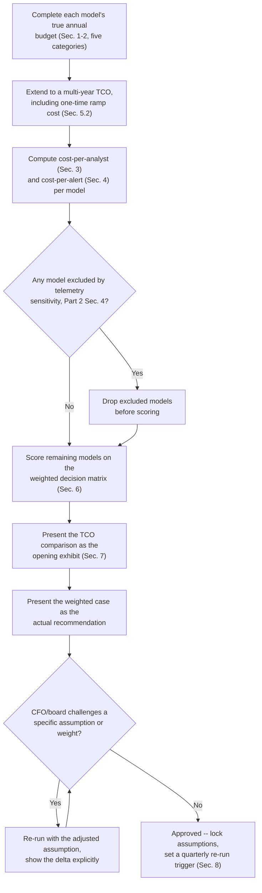

# Part 20 — Building & Defending the SOC Budget

## Why this part exists

**[CONCEPT]** Every SOC manager eventually stops describing the team in headcount and shift patterns and starts describing it in dollars, because that's the language the budget owner speaks and the language a renewal or a cut actually gets decided in. This part is about building that dollar description well enough to survive the room it gets defended in: a category structure that doesn't quietly bury vendor spend inside "tooling" or drop facilities off the page entirely, two summary numbers — cost-per-analyst and cost-per-alert — a CFO can hold onto without a security background, and a full build-vs-buy-vs-outsource business case that turns Part 2's operating-model decision into a defensible multi-year number instead of one year's sticker price.

**[CONCEPT]** This part does not run a SIEM/EDR/SOAR selection process, score a proof-of-concept bake-off, or work through the vendor-lock-in and exit-cost analysis a platform migration specifically carries — that's Part 21 — Tooling Procurement & Platform Strategy. It does not write the service-level agreement, right-to-audit clause, or data-ownership terms that make an MSSP or MDR contract enforceable — that's Part 22. It does not cover ongoing vendor governance, renewal negotiation, or the political work of killing a redundant tool once three of them do the same job — that's Part 23. It does not turn this part's numbers into a board-ready risk narrative — Part 24 owns that translation, and this part's job stops at building the number worth translating. It does not compare your numbers against a published industry survey — Part 31, and for good reason given how easily that comparison goes wrong. And it does not define handle time, alert volume, or any other metric this part's cost-per-alert framing depends on — SOC Playbook Handbook, Part 32 — Metrics owns those definitions, used here strictly as fixed inputs.

**[CONCEPT]** This part assumes two things already exist: a leading candidate for Part 2's build/buy/blend operating-model decision, and a headcount number from Part 5's capacity model, including its shrinkage assumption. Everything below turns those two inputs into a budget, and then into a business case for defending — or changing — the model that produced them.

## 1. Five categories, and the one that swallows the other four if you let it

**[CONCEPT]** A SOC budget presented as a single number, or split only into "people" and "tools," doesn't survive the first serious question a finance reviewer asks: what's driving the increase this year. A budget worth defending separates five categories, each with its own growth driver and its own failure mode when it's skipped.

**[SENIOR MANAGER]** Headcount is salary, benefits, and payroll overhead for every tier, team lead, and manager on the roster — the number Part 5's capacity model exists to produce, run through whatever loaded-cost multiplier your finance team applies to base salary. Tooling is SIEM, EDR, SOAR, and threat-intelligence-platform licensing — the recurring software cost that scales with data volume and seat count, and the category Part 21 owns selecting and negotiating. Training is the continuing-education line Part 12 covers — certifications, conference attendance, and the internal knowledge-sharing time that has a real opportunity cost even when it has no line-item price. Facilities and vendor services are the two categories most likely to go missing from a first-draft budget, and both deserve their own paragraph below because "missing" is exactly how they fail.

**[VENDOR/PROCUREMENT]** Facilities is the physical cost of running a SOC that has to be somewhere: a secure floor with badge-controlled access if the team works on-site, redundant power and network circuits so a single ISP outage doesn't blind a 24/7 desk, and — for a SOC handling classified or highly regulated telemetry — access controls beyond what a normal open-plan office needs. A remote-first SOC doesn't eliminate this category; it changes its shape into home-office stipends, hardened endpoint and VPN provisioning for remote analysts, and a smaller shared space for in-person incident bridges. Either way, treating facilities as "already covered by general corporate real estate" is how the category goes missing — a 24/7 desk's redundant-connectivity requirement is a SOC-specific cost, not a general office cost, even when it rides on the same building's lease.

**[VENDOR/PROCUREMENT]** Vendor services is everything that isn't a software license but also isn't payroll: an MSSP or MDR contract if Part 2's decision involves one, a standing incident-response retainer that gets activated during a major incident (Part 28 covers when a manager actually pulls that trigger), threat-intelligence feed subscriptions, and penetration-testing or red-team engagements. The distinction from tooling matters because a vendor-services contract is a relationship with an ongoing service obligation and a renewal negotiation attached to it — Part 23's territory — where a tooling license is a static grant of software rights. Collapsing the two into one "vendor spend" line makes it impossible to answer a finance reviewer's next question: is this growing because we're buying more software, or because we're buying more service hours.

The table below maps the five categories to what commonly drives their growth and what happens when the category is skipped or folded into another one — use it as the checklist for reviewing a draft budget before it goes anywhere near a stakeholder.

| Category | What It Covers | Typical Growth Driver | What Happens If Skipped/Folded |
|---|---|---|---|
| Headcount | Salary, benefits, payroll overhead, all tiers and leads | Alert volume, coverage-hours target (Part 5) | Understates true cost of scaling the team; hides shrinkage and ramp lag |
| Tooling | SIEM, EDR, SOAR, TIP licensing | Data volume, seat count, feature-tier upgrades | Vendor renewal surprises finance as a step-function jump instead of a forecast |
| Training | Certifications, conferences, internal knowledge-sharing time | Headcount growth, skill-gap closure plans (Part 12) | First line cut under pressure; shows up later as retention cost (Part 18) |
| Facilities | Secure floor, redundant power/network, remote-work provisioning | Coverage-hours model, on-site vs. remote mix | Folded into general corporate real estate; can't be defended as a SOC-specific line when it grows |
| Vendor services | MSSP/MDR contract, IR retainer, threat-intel feeds, pentest | Operating-model choice (Part 2), contract renewal cycle | Folded into "tooling"; makes a service-cost increase look like a software-cost increase |

**[SENIOR MANAGER]** Which category dominates the total is not a fixed property of running a SOC — it's a direct, mechanical consequence of Part 2's operating-model decision. A fully in-house model is headcount-heavy by construction; a fully outsourced model shifts most of that same spend into vendor services instead, with headcount shrinking to a single relationship-owner line. Neither shape is wrong on its own. §5 of this part builds the full business case around exactly that shift, but the category table above has to exist first, because a comparison across operating models that doesn't track the same five categories consistently for every model isn't a real comparison — it's whichever category each side happened to remember to include.

## 2. From Part 2's payroll-and-licensing number to a true annual budget

**[SENIOR MANAGER]** Part 2 §2.1 priced three operating models for a composite 4,000-endpoint organization, and said so explicitly: "the three totals above only compare payroll and licensing." That was a deliberate simplification for a part about choosing a model, not defending a budget. This part's first job is completing that number using the five-category structure above, for all four models Part 2 covers — because a business case built on an admittedly incomplete number is a business case with a hole in it that a sharp finance reviewer will eventually find.

**[SENIOR MANAGER]** Extending Part 2's fully in-house figure ($1,045,000 for eleven analysts, $260,000 for two team leads, $160,000 for one SOC manager, $450,000 in tooling — a $1,915,000 payroll-and-licensing total) with the three remaining categories:

CONCEPTUAL SAMPLE — illustrative numbers extending Part 2 §2.1's composite organization, not sourced benchmark data.

```text
Fully in-house, completing Part 2's payroll-and-licensing figure:
  Payroll + tooling (Part 2 §2.1)              =  $1,915,000
  Training ($3,000/analyst x 11, $2,500/lead
    or manager x 3 for leadership development)  =     $40,500
  Facilities (secure floor share, redundant
    network circuit, badge/access system)       =     $60,000
  Vendor services (threat-intel feed $40,000 +
    standing IR retainer $50,000, kept even
    with full in-house staffing)                 =     $90,000
                                          Total  =  $2,105,500/year
```

**[SENIOR MANAGER]** The same completion applies to the other three models, using the same category logic — a relationship-owner still needs a training budget even if it's small, an outsourced model still usually keeps an independent incident-response retainer rather than trusting the MDR vendor's own contained response to cover a genuine breach, and every model carries some facilities cost even when it's minimal.

CONCEPTUAL SAMPLE — illustrative numbers extending Part 2 §2.1, not sourced benchmark data.

```text
Fully outsourced MDR:  $1,094,000 (Part 2) + $63,000 (training $3,000,
                       facilities $10,000, retained IR retainer $50,000)
                       = $1,157,000/year

Hybrid + embedded DE:  $1,125,000 (Part 2) + $104,000 (training $9,000 for
                       3 engineers, facilities $15,000, IR retainer $50,000
                       + supplemental threat-intel feed $30,000)
                       = $1,229,000/year
```

**[SENIOR MANAGER]** Co-managed needs its own worked figure rather than a completion of Part 2's, because Part 2 deliberately left it as a variable: "exactly where [co-managed lands] depends entirely on which shifts stay internal — Part 20 builds the full total-cost-of-ownership model with that variable exposed." §5 below builds that model in full, including the coverage-hours arithmetic behind its headcount figure; for now, the completed co-managed total from that build-out is $1,738,000/year, arrived at the same way as the three models above.

> **Operational Reality**
> A budget that only compares payroll and licensing across models — the exact comparison Part 2 §2.1 offers as an opening exhibit, not a finished case — routinely gets treated as the finished case anyway, because it's the number that's easiest to pull from existing quotes and offer letters. Training, facilities, and vendor services outside the primary contract get added later, if at all, usually after a finance partner asks where the incident-response retainer is hiding. Build the five-category total before the first draft goes to anyone outside the SOC, not after someone asks for it.

## 3. Cost-per-analyst: the number a CFO already has a mental model for

**[EXECUTIVE]** A CFO already thinks in fully loaded cost per employee for every other function in the business, so cost-per-analyst — total annual SOC budget divided by the number of analysts actually staffing a triage seat, not counting leads, managers, or engineers whose output multiplies across seats rather than being one — is the fastest number to make the SOC's economics legible in a format the rest of the org already uses.

**[EXECUTIVE]** Using the completed in-house figure from §2: $2,105,500 divided by eleven analyst seats is approximately $191,409 per seat. That's the number worth presenting, not the $95,000 loaded-salary line Part 2 uses for headcount modeling — the gap between the two, roughly double, is management overhead, tooling, training, facilities, and vendor services allocated across the seats that do the triage work. A CFO who only ever sees the $95,000 figure will underestimate the true cost of adding a twelfth analyst by more than half, because every dollar of overhead this model already carries gets spread across one more seat instead of appearing as new spend.

> **Blind Spot**
> Cost-per-analyst assumes the organization is actually buying analyst seats, and that assumption breaks the moment a model stops staffing seats directly. The fully outsourced model in §2 has exactly one internal FTE — a relationship owner — and dividing $1,157,000 by one produces a number that describes nothing real about the cost of triage; the hybrid model's three detection engineers aren't triage seats at all, and dividing its budget by three is equally meaningless. Cost-per-analyst is a genuinely useful number for comparing in-house and co-managed models against each other, or against last year's own in-house figure. It has nothing to say the moment a comparison crosses into a model that isn't staffing seats — which is exactly the comparison a build-vs-buy business case most needs a number for. §4 covers the metric that survives that crossing.

## 4. Cost-per-alert: the number that survives a model change

**[EXECUTIVE]** Cost-per-alert — total annual budget divided by the number of alerts a human analyst actually triaged in the period, matching the same post-automation, post-deduplication definition of "volume" Part 5 §3.2 uses for headcount modeling — is comparable across every operating model, because every model produces the same denominator regardless of who's staffing the seat that clears it.

> **Cross-Book Pointer**
> This part does not define what counts as an alert reaching a human analyst, or how much of the raw signal volume automation and SOAR playbooks filter out before that point — those are SOC Playbook Handbook, Part 32 — Metrics (the definitions themselves) and Part 30 — Automation and SOAR (the decision about what gets auto-closed before a human ever sees it) territory. Every cost-per-alert figure in this section uses "alerts triaged by a human" as its denominator, exactly as Part 5 §3.2 does for headcount — confirm your own organization's automation rate before trusting a cost-per-alert comparison, because two SOCs auto-closing different shares of raw volume are not measuring the same thing even if their dashboards use the same label.

**[EXECUTIVE]** Extending the composite 4,000-endpoint organization with one input Part 2 didn't need: an assumed 600 tickets a day reaching a human analyst, the same order of magnitude Part 5's own headcount worked examples use, chosen here for consistency across this book's running numbers rather than because 4,000 endpoints mechanically produces exactly that volume for any real organization. That's 219,000 alerts a year.

CONCEPTUAL SAMPLE — illustrative numbers extending Part 2 §2.1 and Part 5's volume assumption, not sourced benchmark data.

```text
Cost-per-alert, Year 1, using each model's completed budget from Sec. 2:

  Fully in-house      $2,105,500 / 219,000 alerts  =  $9.61/alert
  Fully outsourced     $1,157,000 / 219,000 alerts  =  $5.28/alert
  Hybrid + embedded DE $1,229,000 / 219,000 alerts  =  $5.61/alert
  Co-managed           $1,738,000 / 219,000 alerts  =  $7.94/alert
```

**[EXECUTIVE]** Unlike cost-per-analyst, all four numbers above describe the same thing: what it costs this organization to get one alert from arrival to a human disposition, regardless of whose payroll or contract that cost sits on. That portability is exactly why it's the number worth leading a CFO conversation with when the comparison spans more than one operating model — and exactly why it needs the caution below before anyone treats the lowest number as the automatic answer.

> **People Risk Trap**
> A cost-per-alert target, once a CFO has one, creates a real incentive to lower it by triaging faster and shallower rather than by getting genuinely more efficient — closing borderline dispositions without the follow-up a careful triage would have done, or discouraging analysts from escalating anything that would show up as added handle time on this quarter's number. The fix isn't refusing to report cost-per-alert; it's never reporting it without a paired quality signal from the same period — Part 15's QA sampling scores, or the escalation and re-open rate SOC Playbook Handbook, Part 27 — Escalation Quality tracks. A cost-per-alert number that improved while QA scores dropped in the same quarter isn't an efficiency win, and presenting it as one to a CFO who has no way to see the QA side is a trap this section's whole framing exists to prevent, not enable.

> **What Would Change My Mind**
> This section treats cost-per-alert as the primary number for comparing across operating models, on the grounds that it's the one metric every model produces in comparable form. If a large share of an alert population's real cost turned out to concentrate almost entirely in a small fraction of complex, multi-hour investigations — making the blended per-alert average nearly meaningless as a predictor of what any specific model would actually cost a real organization — that would argue for a cost-per-investigation-hour metric instead, segmented by complexity, rather than a single blended cost-per-alert figure. Check your own handle-time distribution (not just its mean, per Part 5 §7.3's tyranny-of-the-average argument) before leaning on a single blended number for a decision this consequential.

## 5. The build-vs-buy-vs-outsource business case: three years of dollars, not one

**[SENIOR MANAGER]** Part 2 makes the operating-model decision on cost, control, retention, telemetry sensitivity, and coverage-hours economics. This part's job is narrower and comes after: once a model is chosen or being reconsidered, turn it into a business case that survives more than a Year 1 comparison, because every model in §2's table carries real one-time transition cost that a steady-state number hides completely.

### 5.1 Building the co-managed figure Part 2 left as a variable

**[SENIOR MANAGER]** Co-managed's cost depends entirely on which shifts stay internal, so it needs its own worked arithmetic rather than a borrowed number. Assume the in-house side covers a twelve-hour business-hours window, seven days a week — eighty-four of the week's 168 hours — with two analysts on shift at all times, and hands the remaining eighty-four hours to a vendor overflow contract.

CONCEPTUAL SAMPLE — illustrative numbers, not sourced benchmark data.

```text
Co-managed, business-hours in-house / overnight-and-weekend vendor overflow:

Seat-hours needed per year, two concurrent seats,
84 of the week's 168 hours:      2 x 84 x 52                =   8,736
Productive hours/analyst after shrinkage (Part 2 Sec. 6)    =   ~1,750
FTE required:                    8,736 / 1,750               =    ~4.99
  Rounded up to 5 FTE base, + 1 buffer analyst for
  cross-training/surge (same buffer logic as Part 2 Sec. 6.1) =    6 FTE

  6 analysts x $95,000                                       =  $570,000
  1 team lead x $130,000                                     =  $130,000
  0.75 FTE SOC-manager allocation x $160,000                 =  $120,000
  Tooling (SIEM/EDR for the in-house side)                   =  $350,000
  Overnight/weekend MDR overflow, $9/endpoint/month x 4,000
    endpoints x 12 months                                    =  $432,000
                                                        Total =  $1,602,000/year

  + training ($3,000 x 7 people) $21,000, facilities $45,000,
    vendor services (IR retainer $50,000 + threat-intel
    supplement $20,000) $70,000                              =    $136,000
                                                  True total  =  $1,738,000/year
```

> **Operational Reality**
> The $9-per-endpoint overflow rate above is an illustrative assumption, not a rule — some MDR vendors price overflow-only coverage *higher* per endpoint than full-time coverage, precisely because unpredictable burst volume is more expensive for them to staff against than a committed 24/7 baseline. Get the overflow rate from an actual quote before building a co-managed business case around a halved version of the full-coverage price; the arithmetic above shows the method, not a number to copy.

### 5.2 Extending to a three-year total cost of ownership

**[SENIOR MANAGER]** A steady-state annual figure hides the one-time cost every model carries during its first year: hiring and onboarding for in-house seats, or vendor-onboarding friction and a real coverage-context gap for anything with a vendor in it. Adding those one-time costs to three years of the completed steady-state figures from §2 and §5.1:

CONCEPTUAL SAMPLE — illustrative numbers, not sourced benchmark data.

```text
One-time ramp/transition cost, Year 1 only:

  Fully in-house:  14 hires x $9,000 recruiting cost = $126,000,
                   + 3-month MDR bridge contract while hiring ramps
                   (4,000 endpoints x $18/mo x 3)     = $216,000
                                              Total   = $342,000

  Fully outsourced: vendor onboarding/transition fee  =  $45,000
                   + internal context-transfer time    =  $20,000
                                              Total   =  $65,000

  Hybrid:          vendor onboarding fee (monitoring
                   scope only)                        =  $35,000
                   + 3 detection engineers x $9,000     =  $27,000
                                              Total   =  $62,000

  Co-managed:      7 hires x $9,000                    =  $63,000
                   + vendor overflow onboarding fee     =  $25,000
                                              Total   =  $88,000

Three-year TCO (3 x true annual total, Sec. 2/5.1, + one-time ramp):

  Fully in-house:   3 x $2,105,500 + $342,000  =  $6,658,500
  Fully outsourced: 3 x $1,157,000 + $65,000   =  $3,536,000
  Hybrid:           3 x $1,229,000 + $62,000   =  $3,749,000
  Co-managed:       3 x $1,738,000 + $88,000   =  $5,302,000

Cost-per-alert over the same 3-year window (657,000 alerts, assuming
flat volume across the period -- a simplifying assumption, not a forecast):

  Fully in-house:    $10.13/alert
  Fully outsourced:   $5.38/alert
  Hybrid:              $5.71/alert
  Co-managed:          $8.07/alert
```

**[SENIOR MANAGER]** The ranking doesn't flip once ramp cost and a real multi-year horizon are added — fully outsourced is still cheapest, fully in-house still costs the most — but the margins move, and the in-house model's cost-per-alert rises more than any other model's once its own ramp cost is included, because a large one-time hiring cost sits entirely inside a Year 1 that a steady-state comparison never sees. A business case built on Year 1 steady-state alone understates the in-house model's true cost specifically, which matters most when in-house is the option a stakeholder already favors on control grounds and needs the full number to defend it honestly rather than optimistically.

> **Management Autopsy — "present the cheapest steady-state number and skip the ramp cost"** (`CASE-2001`, COMPOSITE CASE EXAMPLE)
>
> **The decision:** A SOC manager built a build-vs-buy case comparing fully in-house against a fully outsourced MDR contract using only Year 1 steady-state run cost — the same shape of comparison Part 2 §2.1 offers as an opening exhibit — and presented the outsourced model as clearly cheaper to secure budget approval for the switch.
>
> **Why it seemed reasonable:** The steady-state numbers were real, pulled from an actual vendor quote and actual current payroll, and the comparison was honest as far as it went. Nobody on the finance side asked about ramp cost, because nothing in the one-page comparison prompted the question.
>
> **How it failed:** The vendor's onboarding period ran three full billing cycles instead of the two the original case assumed, during which the elevated false-positive burden Part 2's own Operational Reality box describes drove real overtime cost on the reduced in-house relationship-owner team that the case never modeled. Separately, a data source the outsourcing contract's scope never anticipated — added six months later by an unrelated team — turned out to be telemetry-sensitivity-restricted, forcing an emergency partial rehire of in-house analysts to cover it outside the vendor relationship. The "cheaper" model's real first-year cost, including the emergency rehire, ended up exceeding the in-house baseline it had replaced.
>
> **The fix:** Present a multi-year TCO with one-time ramp cost as the default exhibit, per §5.2, not an optional add-on requested after the fact. Treat the absence of a ramp-cost line in someone else's build-vs-buy case as a reason to ask for one before approving it, not just a reason to add one to your own.

### 5.3 What dollars alone still can't settle

**[SENIOR MANAGER]** A three-year TCO answers "which model costs less," which is a real answer but not the whole business case. Part 2's control, telemetry-sensitivity, and retention dimensions don't collapse into a dollar figure, and neither does detection quality.

> **Cross-Book Pointer**
> A budget case that only compares dollars can make the cheapest model look like the right one even when it produces materially worse detection outcomes — a fully outsourced model running a generic vendor ruleset with no org-specific tuning, per Part 2 §3's `CASE-0201`, can win every cost comparison in this section while quietly leaving high-risk, organization-specific attack paths uncovered. This part has no way to measure that gap; Detection Engineering Handbook V2, Parts 41–43 — Detection Coverage, Quality, and Debt do. Run that assessment against whichever model wins the cost comparison before treating the cost comparison as the decision, not after.

## 6. Weighing the case: a decision matrix, and the process that produces one

**[SENIOR MANAGER]** Part 2 §7.2 offers a qualitative scorecard across the same four models; this section turns it into a weighted, numeric version — `TMPL-2002`, the build-vs-buy-vs-outsource decision matrix housed in Appendix A6 — so a dollar comparison and a set of qualitative priorities land in the same table instead of two separate conversations.

**[SENIOR MANAGER]** Score each model 1 through 5 (5 is best) on each dimension, using the same qualitative comparisons Part 2 §7.2 already establishes, translated to numbers:

CONCEPTUAL SAMPLE — illustrative scoring for the composite organization used throughout this part, not a universal scoring key.

| Dimension | Fully in-house | Fully outsourced | Hybrid | Co-managed |
|---|---|---|---|---|
| 3-year TCO (lower cost scores higher) | 1 | 5 | 4 | 2 |
| Cost-per-alert trend (Sec. 4/5.2) | 1 | 5 | 4 | 2 |
| Tuning-authority latency/control | 5 | 2 | 4 | 3 |
| Telemetry-sensitivity fit | 5 | 1 | 3 | 4 |
| Retention lever for senior talent | 4 | 1 | 4 | 4 |
| Coverage-hours cost efficiency (thin shifts) | 1 | 5 | 4 | 4 |

**[SENIOR MANAGER]** Weight the dimensions to match what this specific organization actually cares about — a heavily cost-constrained mid-market organization with low telemetry sensitivity and no near-term retention crisis might weight TCO and cost-per-alert at 30% and 15%, control and sensitivity fit at 15% each, retention at 15%, and coverage-hours efficiency at 10%. Multiplying scores by those weights and summing (CONCEPTUAL SAMPLE — illustrative weights and resulting scores for the composite organization used throughout this part, not a universal weighting key):

| Model | Weighted Score | 3-Year TCO | Cost-Per-Alert (Y1) |
|---|---|---|---|
| Fully in-house | 2.65 | `$6,658,500` | `$9.61` |
| Fully outsourced | 3.35 | `$3,536,000` | `$5.28` |
| Hybrid + embedded DE | 3.85 | `$3,749,000` | `$5.61` |
| Co-managed | 2.95 | `$5,302,000` | `$7.94` |

**[SENIOR MANAGER]** The weighted result is worth sitting with for a moment, because it isn't just a restatement of the cost ranking: hybrid wins the weighted comparison even though fully outsourced is cheaper on raw dollars, because hybrid's retained tuning authority and detection-engineer retention lever score high enough to overcome a modestly higher TCO. That's the entire value a weighted matrix adds over a bare cost comparison — it's the difference between "this is cheapest" and "this is the right tradeoff for what we actually value," and it's why §5.3's Cross-Book Pointer matters: the matrix still says nothing about whether hybrid's or any other model's actual detection coverage holds up, which is a separate check against a separate set of numbers this book doesn't produce.

**Figure 20.1 — Process for building and defending a build-vs-buy-vs-outsource business case.** *CONCEPTUAL.* `FIG-2001`. Illustrates the sequence this part builds — completing the five-category budget, extending to a multi-year TCO, computing the two CFO-facing summary numbers, checking for a telemetry-sensitivity exclusion before scoring, and building in a re-run loop when a stakeholder challenges an assumption — rather than a one-time exhibit built once and defended unchanged.





## 7. Presenting and defending the number

**[EXECUTIVE]** Lead with the multi-year TCO table, not the weighted matrix — Part 2's own framing of a bare cost comparison as "the opening exhibit, not the closing argument" applies here word for word. A CFO wants to see the dollar comparison first, on its own, before being asked to accept that a more expensive option might still be the right call once control, sensitivity, and retention are weighed in. Reversing that order — leading with a weighted score that already bakes in judgment calls the CFO hasn't seen yet — reads as burying the ball, even when the underlying analysis is sound.

**[EXECUTIVE]** Once the TCO table is on the table, cost-per-alert (§4) is the number to anchor the conversation to for the rest of the discussion, because it's the one figure that stays comparable no matter which model the conversation drifts toward next. Cost-per-analyst (§3) is useful only inside a single model or against that same model's own prior year — flag its limits before a CFO tries to use it to compare in-house against outsourced, or the Blind Spot in §3 becomes a live misunderstanding in the room instead of a footnote in this chapter.

> **Operational Reality**
> A budget case that lands well in the room it was built for often gets re-forwarded, months later, to a different stakeholder who wasn't there for the caveats — a board member, a new CFO, an auditor — with the weighted matrix's scores intact and the conversation that produced the weights long gone. Document the weighting rationale in the same file as the matrix itself, not just in the meeting notes from the day it was presented, or the next reader will treat the scores as objective measurements instead of the negotiated judgment calls they actually are.

**[EXECUTIVE]** This part builds the number; it does not build the narrative around it. Part 24 — Executive & Board Reporting owns translating a budget defense like this one into the risk-framed language a board-level audience needs, including how to survive a skeptical follow-up question the TCO table alone doesn't answer. Bring this part's numbers there — don't rebuild the narrative logic from scratch once the audience changes from a CFO to a board.

## 8. Keeping the budget honest after it's approved

**[SENIOR MANAGER]** An approved budget is a snapshot of the assumptions that were true when it was built, not a standing guarantee that those assumptions stay true. Alert volume shifts the moment a new detection ships or an acquisition adds a log source, vendor per-endpoint pricing changes at renewal, and the shrinkage figure behind the headcount line drifts the same way Part 5 §8 describes for the capacity model itself. Review the five-category total and both summary numbers on a fixed cadence — quarterly is a reasonable default, matching Part 5's own recommendation for the headcount model this budget is built on — rather than only at the next annual budget cycle.

**[SENIOR MANAGER]** The specific trigger worth watching for is a cost-per-alert or cost-per-analyst figure that moves more than roughly 10% to 15% between review cycles in either direction — the same order of magnitude as (if not identical to) the flat 10% headcount swing Part 5 §8 already treats as worth escalating to the next board or CISO reporting cycle rather than holding until the next annual conversation — and for good reason: a budget number that's drifted that far from what was approved is no longer describing the model the CFO signed off on, whether the drift is good news (automation cut cost-per-alert faster than expected) or bad news (a vendor renewal came in well above the prior contract).

---

**Cross-references.** This book: Part 2 — SOC Operating Models (the build/buy/blend decision this part's business case defends, and the source of every dollar figure extended in §2 and §5); Part 5 — Headcount & Capacity Modeling (the shrinkage assumption and volume framing behind §3–§4's cost figures); Part 9 — Queue Health & Workload Management (the staffing-vs-detection-quality diagnosis a rising cost-per-alert should route through before assuming it's a budget problem); Part 12 — Ongoing Training & Skill Development (the training category in §1–§2); Part 15 — Quality Assurance Programs (the quality signal that has to accompany any cost-per-alert target, §4); Part 18 — Attrition & Retention (the retention-cost side of the weighted matrix in §6); Part 21 — Tooling Procurement & Platform Strategy, Part 22 — MSSP & Managed-Service Contract Management, and Part 23 — Vendor Relationship & Renewal Management (the tooling and vendor-services mechanics this part deliberately doesn't re-derive); Part 24 — Executive & Board Reporting (turning this part's numbers into a board-level narrative); Part 28 — The Manager's Role in a Major Incident (activating the IR retainer priced in §1–§2); Part 31 — Benchmarking & Industry Comparison (the caution against comparing this part's numbers to an external survey uncritically); Appendix A6 — Budget & Business-Case Templates (`TMPL-2001` budget worksheet, `TMPL-2002` decision matrix, `TMPL-2003` TCO calculator).

**SOC Playbook Handbook:** Part 27 — Escalation Quality (the re-open/escalation signal that should accompany a cost-per-alert figure, §4); Part 30 — Automation and SOAR (what counts as alert volume before it reaches a human, the denominator for §4's metric); Part 32 — Metrics (the handle-time and volume definitions used as fixed inputs throughout).

**Detection Engineering Handbook V2:** Parts 41–43 — Detection Coverage, Quality, and Detection Debt (the check this part's cost comparison in §5–§6 cannot substitute for — the cheapest model on a TCO table is not automatically the right one if it produces materially worse detection coverage).
