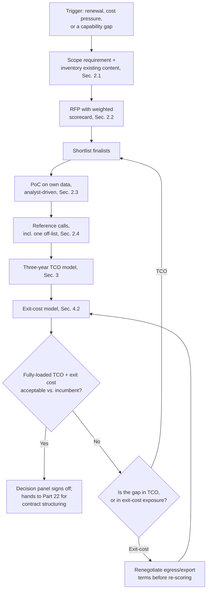

# Part 21 — Tooling Procurement & Platform Strategy

## Why this part exists

**[CONCEPT]** Signing a SIEM, EDR, SOAR, or TIP contract is a decision made once, over a few weeks, by a handful of people in a room with a vendor's slide deck. Living with that decision is a multi-year condition that touches nearly everything else in this book: the headcount model in Part 5 assumes a stable handle-time distribution that a platform swap resets to zero while analysts relearn a new console; the QA sampling in Part 15 assumes a ticket structure that doesn't change out from under it; the coaching cadence in Part 16 assumes the tool an analyst is being coached on this month is the same tool next month. Most organizations run the selection process that produces that decision as a feature bake-off — a scored checklist of capabilities, a proof-of-concept, a reference call or two — and feature bake-offs are structurally good at answering "does this product do the thing" and structurally blind to the three questions that determine whether the decision was actually a good one: what does it cost to get our existing detection content and our analysts onto this platform, what does it cost to get back off it if we're wrong, and how does the vendor's own pricing model behave once we're no longer the size we were during the demo.

This part owns the manager's side of that selection process — scoping the requirement, structuring RFP and PoC evaluation criteria, running reference-customer calls that get past a vendor's curated list, building a total-cost-of-ownership model that includes migration and retraining rather than license price alone, and pricing vendor lock-in and exit cost as a line item in the decision rather than a surprise at the next renewal. It does not walk through how to structure the resulting contract — SLA definitions, right-to-audit clauses, data-ownership and offboarding terms are Part 22 — MSSP & Managed-Service Contract Management's territory, and this part cites that part rather than re-deriving contract mechanics. It also does not re-teach what a SIEM migration actually costs in engineering effort, field by field — that mechanical cost model belongs to Detection Engineering Handbook V2, Part 6 — Normalisation, and this part borrows its cost structure directly rather than inventing a competing one. Nor does it cover the ongoing vendor governance and renewal negotiation that happens after signing — that's Part 23 — Vendor Relationship & Renewal Management, which uses this part's exit-cost model as a standing input rather than building its own.

## 1. What a tooling decision actually is: a platform bet, not a purchase

**[CONCEPT]** A feature bake-off scores a vendor's product against a checklist of capabilities, usually two hundred rows deep, checked off against a scripted demo running on the vendor's own curated data. Mature platform vendors in the SIEM, EDR, SOAR, and TIP markets converge on broadly similar checklist coverage — correlation rules, dashboards, case management, some flavor of automation, some flavor of threat-intel enrichment — which means the checklist increasingly measures polish and breadth rather than a decisive functional gap between finalists. What the checklist has no column for at all is what happens after the contract is signed: the one-time cost of moving three hundred existing detections and years of tuning knowledge onto the new platform, the cost of an analyst team that is measurably slower for roughly six to ten weeks while it relearns query syntax and dashboard muscle memory, and the cost of leaving, three or five years from now, once the organization has built enough proprietary content on top of the winning platform that leaving is no longer a real option.

**[SENIOR MANAGER]** The table below states plainly what a standard bake-off measures against what it structurally cannot see, because the two failure modes this part spends most of its length on — an underpriced total cost of ownership and an unpriced exit cost — both live in the right-hand column.

| A feature bake-off measures | What it structurally can't see |
|---|---|
| Whether the product does X today, in a scripted demo | Whether it does X against your actual log volume, your actual field-naming mess, and your analysts' actual query habits |
| The vendor-quoted list price for the tier proposed during the sale | How that pricing model behaves once ingestion volume, endpoint count, or automation-run count grows past what the demo scoped |
| A curated reference customer's stated satisfaction | The dollar and month cost this organization will pay to migrate content, retrain analysts, and re-earn the coverage lost in translation |
| Today's stated exit terms, as described in the sales deck | The actual cost of leaving three years from now, once content and workflow are already built on top of the platform |

## 2. Running the selection process

### 2.1 Scoping the requirement before the RFP goes out

**[VENDOR/PROCUREMENT]** An RFP written before anyone inventories the current platform's content produces a bake-off that structurally favors whichever finalist talks least about migration, because with no inventory, every finalist's migration-cost estimate defaults to zero by omission rather than by analysis. Before a requirement goes to any vendor, a manager needs three numbers already in hand: the count of standing detection rules, dashboards, and SOAR playbooks currently in production; the log sources that must ingest correctly on day one, ranked by how much of the SOC's real alert volume each one drives rather than by how recently it was onboarded; and the mandatory integration surface — ticketing, identity provider, case management, whatever downstream system a triage workflow already depends on. That inventory is the direct input to the total-cost-of-ownership model in §3 and the exit-cost model in §4; skipping it doesn't remove the cost, it just moves the discovery of that cost to a much worse moment, during the actual migration.

### 2.2 Structuring RFP evaluation criteria: the weighted scorecard

**[VENDOR/PROCUREMENT]** A weighted scorecard is the direct antidote to a checklist that rewards breadth: instead of summing yes/no answers across two hundred rows, a small number of categories get a weight that reflects how much each one actually determines whether this decision holds up in three years, and every finalist gets scored against the same categories using evidence gathered from the PoC and reference calls in §2.3–§2.4 rather than from the vendor's own pitch.

**[VENDOR/PROCUREMENT]** A SOC manager or the designated procurement lead fills the scorecard below in once per finalist, after the PoC and reference calls are both complete, so every row is scored against evidence the buying organization gathered itself rather than a number the vendor supplied.

TEMPLATE — Platform RFP/PoC weighted evaluation scorecard, permanent ID TMPL-2101

```text
CRITERION                                             WEIGHT   SCORE (1-5)   WEIGHTED
Functional fit against the use cases named in §2.1      25%        _             _
  <!-- score only against the use cases the RFP actually named, not the
       vendor's full feature list -->
Data ingest/normalization fit, own messiest source       15%        _             _
  <!-- score from the PoC's worst-case log source (Sec. 2.3),
       never from the demo's cleanest one -->
Integration surface (SOAR, ticketing, IdP, EDR)          10%        _             _
Three-year TCO: license + migration + retraining         25%        _             _
  <!-- pull the number from the TCO worksheet in Sec. 3.2,
       never the vendor's list price alone -->
Exit-cost / lock-in exposure                              15%        _             _
  <!-- pull the number from the exit-cost model in Sec. 4.2 -->
Vendor viability & support model                            5%        _             _
Reference-customer signal, incl. one off-list call          5%        _             _
                                                        ------
                                               TOTAL      100%                     _
```

**[VENDOR/PROCUREMENT]** This scorecard fixes a candidate's fit and cost into one score; it does not fix the weights themselves, which a manager should adjust for a genuinely different risk profile — a heavily regulated environment might push exit-cost exposure higher still, and a SOC with no realistic near-term migration risk might legitimately push functional fit back up toward where a standard bake-off would put it.

> **What Would Change My Mind**
> This scorecard weights three-year TCO and exit-cost exposure at 40% combined, above functional fit's 25%, on the claim that a standard bake-off structurally under-weights both. If a large sample of real procurement outcomes showed that platforms chosen mainly on functional fit rarely produced regret on a three-year horizon — not because TCO and exit cost didn't matter, but because they tracked functional fit closely enough that scoring them separately added no decision-useful information — that would argue for collapsing this scorecard back toward something closer to a standard bake-off after all.

### 2.3 Designing a PoC that tests your own data, not the vendor's demo

**[VENDOR/PROCUREMENT]** A proof-of-concept run on a vendor-curated data sample, on a timeline short enough that only the platform's cleanest ingest paths get exercised, tests the vendor's demo environment rather than the buying organization's actual conditions. The fix is concrete: name the single messiest log source in scope — usually an old on-prem application, a homegrown tool, or whichever source has the worst field-naming — and require it in the PoC's test plan by name, not as an optional stretch goal; require the buying organization's own analysts to drive at least half of the PoC sessions from a normal analyst seat, running real queries against real historical tickets, rather than watching the vendor's sales engineer click through a prepared walkthrough; and run the PoC long enough — a minimum of two to three weeks of real ingest, not two or three days of a scripted demo — that a field-mapping problem has time to surface at all.

*COMPOSITE CASE EXAMPLE (`CASE-2101`) — merges patterns observed across several mid-market PoC engagements; not one identifiable organization.*

> **Management Autopsy — "let the vendor's sales engineer run the PoC"**
>
> **The decision:** A finalist vendor's sales engineer configured and ran the entire proof-of-concept environment, choosing which of the buying SOC's log sources to onboard first and which sample queries to demonstrate, with the buyer's own analysts observing rather than driving.
>
> **Why it seemed reasonable:** The SOC's analysts were fully committed to live queue work, the vendor's engineer could stand up a working environment in days rather than weeks, and the vendor's own product expertise seemed likely to showcase the platform's strongest capabilities rather than waste time on a clumsy self-guided setup.
>
> **How it failed:** The sales engineer selected the buyer's three cleanest, best-parsed log sources and skipped a fourth — a fifteen-year-old on-prem case-management application with inconsistent field names that turned out to drive nearly a third of the SOC's highest-severity alerts. The PoC scored the platform's ingest and parsing capability as excellent because the PoC never touched the one source that would have tested it under real conditions. Six weeks after go-live, that application's logs landed in the new platform with more than half their fields unmapped, and detections built against them during the PoC's "successful" period had been silently matching against the wrong field the entire time.
>
> **The fix:** Name the messiest log source before the PoC starts and require it in the test plan; have the buying organization's own analysts, not the vendor's sales engineer, drive at least half the PoC from a normal analyst seat, against tickets they already know the right answer to.

> **Manager's Note**
> Ask a finalist vendor to import a real week of your own already-closed tickets — the raw logs behind five confirmed true positives and five confirmed false positives your team already has full context on — and see whether the new platform's interface gets an analyst to the same disposition in less time, not more. If a demo can't survive being pointed at data you already understand, it isn't ready to be pointed at data you don't.

### 2.4 Reference-customer calls: who to ask, and who not to ask

**[VENDOR/PROCUREMENT]** A reference list a vendor hands over during a sale is a curated sample of that vendor's most satisfied customers, selected by the same account team trying to close the deal — treating three curated conversations as representative of the vendor's typical customer experience makes the same self-selection error Part 31 — Benchmarking & Industry Comparison flags for a three-hundred-respondent industry survey, just at a much smaller and more deliberately chosen scale. The two fixes that actually move the needle: ask the vendor directly for a named reference close to the buying organization's own size, industry, and log volume who migrated off a specific, named competitor product within roughly the last two years — a request specific enough that a vendor without a real match has to say so — and separately, before signing, spend an hour finding one reference through a peer network or professional community the vendor didn't supply, since that call is the only one guaranteed not to have been pre-briefed.

> **People Risk Trap**
> A vendor-supplied reference list is a self-selected sample of that vendor's happiest customers, curated by the team trying to close your deal. Treating it as representative is the same self-selection error a survey with an unknown, self-selected respondent pool produces, just applied to a sample of three instead of three hundred. The fix: ask for a named reference matched on size, industry, and log volume who migrated off a specific competitor product recently, and separately find one reference the vendor didn't hand you.

A short composite example shows what an off-list call is actually worth. *COMPOSITE CASE EXAMPLE (`CASE-2102`) — merges patterns from more than one mid-market procurement cycle; not one identifiable organization.* A vendor's supplied reference list for an eighteen-analyst SOC's SIEM bake-off consisted of three customers, all with security teams over 150 people — a poor size match, but the only names offered. Through a peer Slack community rather than the vendor's account team, the buying manager located a former customer close to their own size who had migrated off the same product the previous year. That off-list reference reported that the vendor's quoted six-to-eight-week migration timeline for a comparable rule count had actually run to just over seven months, driven mostly by the mapping-and-parity effort Detection Engineering Handbook V2, Part 6 — Normalisation prices for exactly this kind of move, and separately flagged an egress fee for historical log export that the sales cycle had never mentioned. Because the buying organization surfaced both facts before signing rather than after, it negotiated a fixed-fee migration-support clause and a capped egress fee into the contract instead of discovering the same gap at renewal, three years later, with no leverage left.

## 3. Total cost of ownership: the model a bake-off never builds

### 3.1 The categories a bake-off skips

**[SENIOR MANAGER]** A vendor's quoted license price captures maybe half of what a platform actually costs over a multi-year term, and even that half grows nonlinearly as ingestion volume, endpoint count, or automation-run count crosses the tier boundaries the sales quote scoped against. The categories a standard bake-off routinely leaves at zero: the one-time engineering effort to migrate existing detection content and historical data, the retraining hours needed before analysts return to their prior handle-time baseline, the parallel-run cost of operating both platforms simultaneously during cutover, and the ongoing content-authoring FTE tail the new platform requires, which is not guaranteed to match the old platform's.

> **Cross-Book Pointer**
> This part does not re-derive what a SIEM migration actually costs in engineering effort — that's Detection Engineering Handbook V2, Part 6 — Normalisation, which breaks real migration cost into four components (platform, mapping, parity-testing, and dual-running) and shows why the mapping and parity-testing lines, not the license line, are what actually blow a migration's budget. The worked example below pulls that component structure directly into a total-cost-of-ownership model rather than inventing a separate cost taxonomy for the same underlying work.

### 3.2 Worked example: three-year TCO across two SIEM finalists

**[SENIOR MANAGER]** The comparison below prices two finalists for a 22-analyst SOC replacing its incumbent SIEM at renewal, with 340 existing detection rules in scope. Vendor A's platform shares a schema family closely related to the incumbent's, which keeps its per-rule mapping effort low; Vendor B won the functional bake-off outright and quoted the cheaper sticker price every single year, but its schema is a genuinely different family, which raises its per-rule mapping effort under the same DEH Part 6 cost model.

CONCEPTUAL SAMPLE — illustrative numbers, not sourced benchmark data.

```text
License, 3-year total:
  Vendor A:  $410,000 (Y1) + $430,000 (Y2) + $450,000 (Y3)  = $1,290,000
  Vendor B:  $340,000 (Y1) + $355,000 (Y2) + $370,000 (Y3)  = $1,065,000
  License savings choosing B over A, 3-year total:          =   $225,000

Migration cost (one-time, DEH Part 6 mapping + parity-testing + dual-running):
  Vendor A: 340 rules x 2 hrs/rule x $95/hr loaded eng. cost = $64,600
            + 60-day dual-run overlap                        = $35,000
                                                    Subtotal  = $99,600
  Vendor B: 340 rules x 6 hrs/rule x $95/hr loaded eng. cost = $193,800
            + 90-day dual-run overlap                         = $60,000
            + vendor migration professional-services fee     = $75,000
                                                    Subtotal  = $328,800

Retraining cost (one-time):
  Vendor A: 22 analysts x 8 hrs x $60/hr loaded cost          = $10,560
  Vendor B: 22 analysts x 40 hrs x $60/hr loaded cost         = $52,800

Temporary capacity loss during ramp (Vendor B only --
different query language, one quarter at ~20% handle-time
regression across 22 analysts, per the FTE math in Part 5):  = $23,750

One-time cost, total:
  Vendor A: $99,600 + $10,560                                = $110,160
  Vendor B: $328,800 + $52,800 + $23,750                     = $405,350

3-year TCO:
  Vendor A: $1,290,000 + $110,160                            = $1,400,160
  Vendor B: $1,065,000 + $405,350                             = $1,470,350
```

**[SENIOR MANAGER]** Vendor B wins the functional bake-off and quotes the cheaper license every year, saving $225,000 in cumulative license cost over three years — and still ends up roughly $70,000 more expensive over that same three years, because its one-time migration, retraining, and capacity-loss premium runs nearly $295,000 higher than Vendor A's. Spread across the license savings alone, that premium takes almost four years to earn back — longer than the three-year contract term either finalist is quoting, which means a renewal negotiation arrives before the switch has paid for itself, a fact §4 returns to as an exit-cost problem in its own right, not just a TCO one.

### 3.3 Retraining cost, named separately from migration cost

**[HR/PEOPLE]** A migration project plan almost always budgets the vendor's own training curriculum — a two-day instructor-led course, a certification voucher — and treats retraining as finished once that course is delivered. What actually costs the SOC is the weeks after that course during which an analyst's query-writing speed on the new platform is still visibly slower than it was on the old one. That gap shows up as a real, temporary capacity loss, not a training-budget line item, and it lands directly on the metrics Part 5's headcount model and Part 9 — Queue Health & Workload Management's tracking both already watch.

> **Operational Reality**
> A migration project plan almost always budgets the vendor's own training curriculum — an instructor-led course, a certification voucher — and calls retraining done. What actually costs the SOC is the six to ten weeks after that course during which an analyst's query-writing speed on the new platform is still visibly slower than it was on the old one, showing up as a temporary bump in handle time that Part 5's headcount model and Part 9's queue-health tracking will both register as a real capacity loss, not a training-budget line item.

**[HR/PEOPLE]** A migration's retraining line is also an unplanned draw against the same annual training budget Part 12 — Ongoing Training & Skill Development governs; a manager who doesn't flag it in advance, as its own line item separate from the year's normal certification and conference spend, discovers the collision only when the training budget runs out early, with no warning and no obvious place the overrun came from.

## 4. Vendor lock-in and exit-cost analysis

### 4.1 What actually creates lock-in

**[VENDOR/PROCUREMENT]** Lock-in is rarely one dramatic contract clause; it accumulates from four ordinary mechanisms, each individually reasonable and collectively expensive to escape. A proprietary query or rule language with no export path to a portable format turns every detection built on the platform into content that can only leave by being rewritten. A proprietary historical-data retention format, paired with a metered or gated bulk-export API, turns years of retained logs into a asset the vendor can charge to release. A deep integration surface — SOAR playbooks, dashboards, ticketing hooks, identity-provider connections — built on vendor-specific APIs multiplies the rebuild cost of leaving well past the core platform itself. And a bundled multi-module discount, where SIEM, EDR, and SOAR are priced together from one vendor, means leaving any single module can unwind the discount on every module kept.

**[VENDOR/PROCUREMENT]** The table below names each mechanism, what it costs to escape once it's in place, and — the part that actually matters for this part's argument — where in the procurement process a manager still has real leverage to limit it, because none of the four is meaningfully negotiable after signing.

| Lock-in mechanism | What creates it | What escaping it costs later | Mitigation available before signing |
|---|---|---|---|
| Proprietary query/rule language | Detection content authored directly in a vendor-specific syntax with no abstraction layer | Full re-authoring of every rule, priced the same way DEH Part 6's mapping/parity-testing cost is priced, paid a second time to leave | Negotiate a documented export format for rule logic; keep field references centralized on the new platform from day one, per DEH Part 6's own mitigation advice |
| Historical data retention format | Logs stored in a proprietary index behind a gated or metered bulk-export API | A one-time egress fee, sometimes large enough on its own to fund most of a migration | Negotiate a capped, included egress allowance and a defined export format in the contract, not just an unpriced right-to-export clause |
| Deep integration surface | SOAR playbooks, dashboards, and ticketing hooks built on vendor-specific APIs | Every downstream integration rebuilt, not just the core platform itself | Prefer a documented, versioned API; avoid a vendor-exclusive webhook format where a common alerting-webhook shape already exists |
| Bundled multi-module discount | SIEM, EDR, and SOAR priced together from one vendor at a combined rate | Leaving one module unwinds the discount on the modules kept | Price every module's standalone rate during the RFP, so the bundle's true size — and its unwind cost — is known before signing |

### 4.2 Modeling exit cost as a first-class line item

**[SENIOR MANAGER]** Exit cost is the sum of what it would take to leave a finalist platform, estimated before signing rather than discovered at the next renewal: data egress and re-ingestion cost, content re-migration cost priced with the same four-component model used in §3.2, retraining cost for whichever platform comes next, and any contractual early-termination penalty. The mechanism that makes this analysis urgent rather than academic is that exit cost only grows over time — every quarter of accumulated custom content and every additional year of retained historical logs makes leaving more expensive than it was the quarter before — which means the only point in the relationship where an organization has real leverage to shape that cost is before it signs, not after three years of accumulation have already happened.

**[EXECUTIVE]** For a board or CISO conversation, express exit-cost exposure the same concrete way the TCO model in §3.2 is expressed — as a dollar figure and, more usefully, as a number of months of contract spend it would take to fund an exit today. A finalist whose exit cost equals eighteen months of contract value is carrying meaningfully more risk than one whose exit cost equals four months, even if the two quote identical license prices, and that risk deserves the same visibility in a renewal-year budget narrative that a security-risk finding gets in an incident report — Part 24 — Executive & Board Reporting covers building that narrative once this part's number exists to put in it.

### 4.3 When lock-in is priced only at renewal

**[SENIOR MANAGER]** The composite case below shows the mechanism in §4.2 running to completion: an exit-cost estimate that was never built at procurement time, discovered instead at the exact moment it had the least leverage left to change anything.

*COMPOSITE CASE EXAMPLE (`CASE-2103`) — merges patterns observed across several mid-market renewal negotiations; not one identifiable organization.*

> **Management Autopsy — "the bake-off winner nobody could leave"**
>
> **The decision:** A mid-market, 30-analyst SOC selected a SIEM finalist with the highest functional bake-off score four years earlier — a feature-rich proprietary correlation and behavioral-analytics engine — helped along by an aggressive first-year discount that made it the cheapest option in year one specifically.
>
> **Why it seemed reasonable:** The platform won the functional comparison decisively, the discounted first-year price undercut the incumbent, and the vendor's sales engineer described data portability as straightforward, available "any time," with no mention of a cost attached to it.
>
> **How it failed:** Over four years, the SOC built 480 custom correlation rules directly in the vendor's proprietary rule syntax with no abstraction layer separating the logic from the platform, and its historical log retention lived entirely in the vendor's proprietary index, with bulk export gated behind a paid add-on module the organization had never purchased. At the four-year renewal, the vendor proposed a 24% list-price increase — roughly $210,000 more per year than the prior year's spend. The SOC's own exit-cost estimate, built only at this point, totaled to roughly $540,000: full DEH Part 6-style migration effort for 480 rules, an egress fee for three years of retained historical logs quoted at roughly $85,000, and 320 hours of analyst retraining. At that exit cost, accepting the 24% increase was cheaper than leaving for at least the next two and a half years. According to the SOC's own account team afterward, the vendor's renewal negotiator had been aware of that exit-cost gap the entire time.
>
> **The fix:** Run the exit-cost model in §4.2 before signing, not at renewal — specifically, negotiate a bulk-export/egress clause and a cap on future list-price increases into the original contract, while the buying organization still has bake-off-stage leverage. Never let custom content accumulate exclusively in a single vendor's proprietary syntax without a periodic re-measurement of what leaving would cost right now: lock-in priced early is a negotiating chip; lock-in priced only at renewal is a bill.

## 5. A decision framework: from trigger to signature

### 5.1 The procurement decision flow

**[SENIOR MANAGER]** The flow below sequences everything this part has covered — scoping, the weighted scorecard, an analyst-driven PoC, off-list reference calls, and the TCO and exit-cost models — into one path a decision panel can actually follow, rather than three unconnected spreadsheets arriving at a meeting with no shared conclusion.

**Figure 21.1 — The procurement decision flow, trigger to signature.** *CONCEPTUAL.* Illustrates the sequence this part argues for — a weighted scorecard, an analyst-driven PoC, off-list reference calls, and a three-year TCO and exit-cost model, all resolving into one decision panel rather than a single feature-comparison score. It is a process diagram, not a capture of any specific SOC's actual procurement workflow. Diagram ID `FIG-2101`.





**Figure 21.1 — The procurement decision flow, trigger to signature.** *CONCEPTUAL.* Static flowchart rendered from the Mermaid source directly above. It supports the decision-framework guidance in §5, tying together the scorecard (§2.2), the TCO model (§3.2), and the exit-cost model (§4.2) into one process. Diagram ID `FIG-2101`.

### 5.2 One scorecard, not three spreadsheets

**[SENIOR MANAGER]** The scorecard in §2.2 already carries the TCO and exit-cost numbers as two of its seven weighted rows, so a decision panel using both isn't reconciling three separate documents in the room — it's reading one instrument whose two highest-weighted rows already have the fully loaded numbers from §3.2 and §4.2 behind them. A panel that reaches for the scorecard's total score without checking that those two rows were actually filled in from the worksheets, rather than estimated on the spot from a gut feel about the vendor's reputation, has reproduced the exact bake-off failure mode this part exists to fix, just with better formatting.

## 6. Platform-specific procurement wrinkles

**[VENDOR/PROCUREMENT]** The TCO and exit-cost mechanics in §3–§4 apply to all four platform categories this part covers, but what actually drives migration cost differs enough by platform type that a manager pricing one against the same DEH Part 6 model used for a SIEM will underprice or overprice the number without adjusting for it.

### 6.1 SIEM

**[VENDOR/PROCUREMENT]** For a SIEM, migration cost is dominated by the per-rule field-mapping-and-parity-test problem DEH Part 6 prices directly — rule count is the single largest driver of the mapping and parity-testing components in §3.2's worked example, and it scales close to linearly with however many detections the outgoing inventory in §2.1 counted.

### 6.2 EDR

**[VENDOR/PROCUREMENT]** For an EDR platform, migration cost is dominated less by query rewriting and more by fleet-wide agent redeployment: uninstalling the old agent, pushing the new one, and rebuilding prevention and detection policy across every endpoint on a patch-window schedule set by IT operations, not by the SOC. That logistics effort — and the coordination it requires with a team the SOC doesn't manage — is the dominant unbudgeted cost, and coordinating it cleanly is exactly the cross-team relationship Part 26 — Cross-Team Politics & Stakeholder Alignment covers.

### 6.3 SOAR

**[VENDOR/PROCUREMENT]** For a SOAR platform, migration cost is dominated by rewriting existing automated playbooks and re-testing every automated action path for the risk of a wrong containment or closure action, not by query syntax at all — a playbook that closes the wrong ticket or contains the wrong host silently is a materially worse failure than a detection that silently stops matching. Deciding what's safe to automate in the first place is SOC Playbook Handbook, Part 30 — Automation and SOAR's territory; this part's concern is narrower — pricing the cost of safely rewriting and re-validating playbooks that already exist, once a platform change is on the table.

### 6.4 TIP

**[VENDOR/PROCUREMENT]** For a threat intelligence platform, migration cost is usually the smallest of the four, because a TIP rarely holds the bulk of an organization's custom detection logic — the dominant cost is re-integrating threat feeds and rewiring whatever enrichment pipeline feeds indicators into the SIEM or SOAR. Lock-in can still be real here even so: some community or paid feeds are contractually tied to a specific platform's ingestion format, and losing access to a feed a hunting program has built history against is a coverage cost, not just an integration one.

## 7. Where this goes next

**[CONCEPT]** The TCO number this part's worked example produces is the opening exhibit for the broader budget defense Part 20 — Building & Defending the SOC Budget builds out in full; this part's job is only to make sure that number is fully loaded before it reaches that conversation. Once a decision panel signs off using the framework in §5, Part 22 turns the lock-in mitigations named in §4.1 into actual contract language — an export-format clause, a capped egress fee, a price-increase ceiling — rather than leaving them as intentions. Part 23 then picks the exit-cost model back up every renewal cycle as standing negotiating leverage, so the failure mode in §4.3's case — pricing exit cost for the first time at the moment it's least useful — never recurs on the same platform twice. Nothing past this part should treat a platform decision as a one-time purchase with a sticker price; every later reference to "the SIEM" or "the EDR" in this book assumes the fully loaded cost this part's model produces, not the number on the vendor's price sheet.

---

**Cross-references:** This part assumes Part 2 — SOC Operating Models: In-House, MSSP, Co-Managed, Hybrid (which staffing model is doing the buying, and who carries the migration effort) and Part 5 — Headcount & Capacity Modeling (the shrinkage and FTE math this part's retraining and capacity-loss figures borrow directly). It points forward, within this book, to Part 12 — Ongoing Training & Skill Development (the training-budget line a migration draws against unannounced), Part 15 — Quality Assurance Programs and Part 16 — Performance Management & Coaching (both of which assume a stable platform underneath their sampling and coaching cadence), Part 20 — Building & Defending the SOC Budget (the budget category this part's TCO model feeds), Part 22 — MSSP & Managed-Service Contract Management (the contract mechanics that implement this part's lock-in mitigations), Part 23 — Vendor Relationship & Renewal Management (the standing use of this part's exit-cost model as renewal leverage), Part 24 — Executive & Board Reporting (presenting exit-cost exposure upward), Part 26 — Cross-Team Politics & Stakeholder Alignment (coordinating an EDR fleet migration with IT operations), and Part 31 — Benchmarking & Industry Comparison (the reference-customer self-selection problem named in §2.4). It cites Detection Engineering Handbook V2, Part 6 — Normalisation for the technical migration-cost mechanics behind §3–§4, and SOC Playbook Handbook, Part 30 — Automation and SOAR for what's safe to automate once a SOAR platform is in place, which §6.3 deliberately does not re-derive. The RFP/PoC weighted evaluation scorecard (`TMPL-2101`) is filed in Appendix A5, companion to Parts 21–23.
