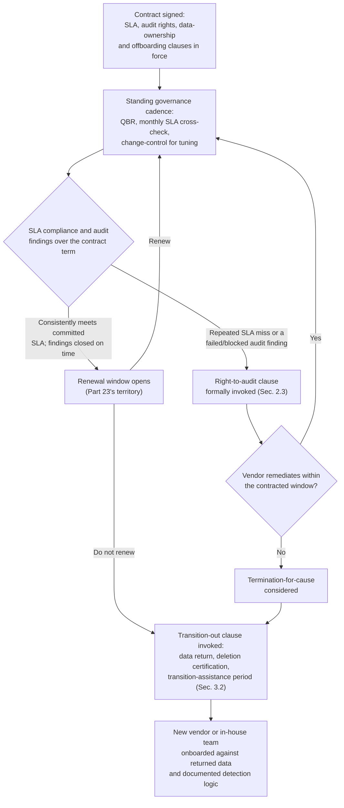

# Part 22 — MSSP & Managed-Service Contract Management

## Why this part exists

**[CONCEPT]** Part 2 answers whether an organization should use an MSSP, MDR provider, or co-managed model at all. This part starts after that decision is made and a specific vendor is on the table: how the contract itself is written, because the contract — not the sales deck, not the pilot demo, not the account executive's verbal assurance — is the only thing that governs what happens the first time something goes wrong. A statement of work that reads well in a proposal and a statement of work that survives a dispute are not automatically the same document, and the gap between them is almost always in four places: how the service-level agreement is defined and measured, what the client can actually inspect and verify, who owns the data and the custom detection content once the relationship ends, and whether anyone is running a standing process to keep the contract honest between the signature and the renewal date.

**[CONCEPT]** Those four places are this part's entire scope, and nothing else. It does not cover choosing between operating models — that's settled ground by the time a contract is being negotiated, and Part 2 — SOC Operating Models: In-House, MSSP, Co-Managed, Hybrid owns the economics of that decision. It does not cover running a SIEM/EDR/SOAR/TIP procurement process — Part 21 — Tooling Procurement & Platform Strategy owns PoC evaluation, reference calls, and total-cost-of-ownership modeling for that kind of purchase, and while the evaluation discipline generalizes to picking an MSSP candidate in the first place, this part picks up once a specific vendor is already at the negotiating table, not before. And it does not cover the ongoing, portfolio-wide vendor governance that continues for years after signing — renewal-cycle negotiation strategy, vendor risk scoring across every tool and vendor the SOC runs, tool-sprawl rationalization, and the politics of retiring a vendor a stakeholder personally championed. That's Part 23 — Vendor Relationship & Renewal Management's territory, and the two parts are easy to blur because both use the word "governance." The distinction that keeps them separate: this part's governance cadence is the operating rhythm of one specific contract — did this MSSP hit its committed numbers this quarter, does the audit clause still work, is the offboarding language still current — while Part 23's is the multi-year, multi-vendor lens that decides whether this vendor relationship should exist at all going into the next renewal. A SOC manager who only reads this part will know how to keep a signed MSSP contract honest; Part 23 is where that manager learns how to decide, later, whether to keep it.

**[CONCEPT]** One more boundary matters enough to state before anything else: an SLA in an MSSP contract and the severity model a SOC uses to triage its own queue are not the same instrument, even though both use words like "critical" and "response time." SOC Playbook Handbook, Part 29 — Playbook Severity Model owns how an individual alert gets scored for internal triage purposes — a judgment call an analyst makes about one ticket. The SLA covered in this part is an external, negotiated, contractually enforceable commitment between two organizations, backed by a remedy (usually a service credit) when it's missed, and measured against clock-start and clock-stop definitions that are themselves subject to negotiation. A vendor can hit its own contractual "critical" SLA on paper while the underlying activity would score very differently against a client's internal severity rubric, and confusing the two is one of the most common — and most expensive — mistakes a manager makes when reading a vendor's own performance dashboard at face value.

## 1. The SLA as a contract instrument

### 1.1 Why a contract SLA is not the internal severity model

**[VENDOR/PROCUREMENT]** A contract SLA exists to do one job: give the client a remedy when the vendor doesn't perform, and give the vendor a defensible, measurable target instead of an open-ended promise to "respond quickly." That job only gets done if every SLA metric in the contract specifies four things without ambiguity — what event starts the clock, what event stops it, which severity tier the commitment applies to, and what happens when it's missed. A metric missing any one of those four is not an SLA; it's an aspiration with a table around it.

> **Cross-Book Pointer**
> This part does not define how an alert's severity is scored for internal triage purposes — that's a per-ticket judgment call, not a contract term. See SOC Playbook Handbook, Part 29 — Playbook Severity Model for the scoring mechanics. What this part covers is different: the severity *tiers named in the contract* (often borrowing the same labels — critical, high, medium, low) as the buckets a negotiated response-time commitment attaches to. A vendor's contractual "critical" tier and a client's internal "critical" score can diverge the moment either side's definition changes without the other renegotiating — worth confirming they still mean the same thing at every governance review in §4, not just at signing.

**[VENDOR/PROCUREMENT]** The practical test for whether an SLA clause is real: ask what document or system timestamp the clock-start event actually refers to, and whether that timestamp is one the client can independently verify, or one that only exists inside the vendor's own ticketing platform. If the answer is the second, the client has agreed to measure the vendor's performance using data only the vendor controls — a structural weakness worth naming during negotiation, not discovering during a dispute.

### 1.2 The clock-start problem

**[VENDOR/PROCUREMENT]** The single most common way an SLA looks strong on paper and performs weakly in practice is the gap between when something bad actually happened and when the vendor's contractual clock starts running. A vendor proposing "critical alerts acknowledged within 15 minutes" sounds aggressive until the contract language is read closely enough to find that the 15 minutes is measured from ticket creation inside the vendor's own platform — not from when the underlying telemetry first showed the malicious activity, and not even from when the vendor's detection logic first fired. Between those two points sits the vendor's own internal queueing and Tier 1 review, which can run anywhere from a few minutes to well over an hour depending on the vendor's current load, and none of that time counts against the SLA at all.

**[VENDOR/PROCUREMENT]** Negotiating the clock-start definition down to the earliest verifiable event — ideally the timestamp on the raw alert itself, logged in a system the client can also see — closes most of this gap. Where a vendor won't agree to that (and many won't, because it exposes their own internal triage latency to the SLA for the first time), the fallback worth pushing for is a second, secondary metric: total elapsed time from alert generation to client notification, reported separately from the primary SLA, even if it carries no contractual remedy of its own. A number with no teeth is still a number a manager can track and use as leverage at the next renewal, which is more than a vendor-side clock that only starts once the vendor decides to start it.

### 1.3 Coverage-hours commitments: a distinct SLA class

**[VENDOR/PROCUREMENT]** Response-time commitments answer "how fast." Coverage commitments answer a separate question — "is anyone actually watching right now" — and the two get conflated constantly in vendor marketing material. "24/7/365 SOC monitoring" describes coverage; it says nothing about staffing depth, and a vendor can satisfy a literal reading of that phrase with one analyst covering several hundred client accounts overnight, which is a materially different service than the same phrase implied during the sales conversation.

**[VENDOR/PROCUREMENT]** The coverage-hours math from Part 2 — SOC Operating Models: In-House, MSSP, Co-Managed, Hybrid, §6 is the right lens for testing whether a vendor's staffing commitment is realistic, not just aspirational: a single continuously staffed seat needs roughly five full-time-equivalent analysts once shrinkage is accounted for, per that section and the underlying model in Part 5 — Headcount & Capacity Modeling. A vendor account team that can't produce a real number for how many dedicated analysts are on a given overnight shift, or that answers with the vendor's total headcount across every client rather than the per-shift figure, hasn't actually committed to a coverage level — it's committed to a phrase.

> **Field Test**
> **Setup:** The contract states a minimum staffing level for continuous coverage — for example, "no fewer than two dedicated SOC analysts on every shift, 24/7."
> **Action:** At an unannounced time between 2 a.m. and 4 a.m. on an ordinary weekday, place a real call to the vendor's after-hours contact line (not a scheduled test the account team knows is coming), and ask the analyst who answers two direct questions: how many analysts are on this shift right now, and how many client accounts is this shift covering.
> **Expected result:** The analyst answers both questions promptly and the numbers match what the contract commits to. If the analyst can't answer, has to check with someone else first, or names a per-analyst account load far above what a "dedicated" clause implies, the coverage commitment is functioning as marketing language, not a staffing guarantee — worth raising at the next governance review in §4, not waiting for an incident to expose it.

**[VENDOR/PROCUREMENT]** The table below separates the SLA metric classes a contract typically bundles together under one heading, and names the trap specific to each — worth walking through clause by clause during negotiation rather than accepting a vendor's standard SLA table as a single unit.

| SLA metric | What it commits to | Common contract trap |
|---|---|---|
| Notification/acknowledgment time | How fast the client is told a critical alert exists | Clock starts at the vendor's internal ticket creation, not at alert generation — elapsed real time can run well past the stated window |
| Time-to-triage or time-to-analysis | How fast the vendor forms an initial disposition | "Triage" often means "acknowledged," not "analyzed" — confirm the contract defines what activity must actually complete, not just that a status field changed |
| Time-to-escalation | How fast a confirmed finding reaches the client's own team | Only counted for alerts the vendor decides warrant escalation — a suppressed or under-triaged alert never starts this clock at all |
| Time-to-containment (MDR only) | How fast the vendor takes a scoped response action | Frequently the narrowest-scoped, most heavily caveated clause in the contract — confirm which actions are actually pre-authorized versus which still require client sign-off first |
| Coverage hours / staffing minimum | Whether committed headcount is actually on shift | "24/7 monitored" is a claim about the platform running, not about dedicated staffing depth — see the Field Test above |
| Platform/tooling uptime | Whether the vendor's own console and pipeline are available | Protects the vendor's infrastructure metric, not detection or response quality — a vendor can hit 99.9% platform uptime while still missing real threats |

### 1.4 Service credits and what they actually compensate

**[VENDOR/PROCUREMENT]** Nearly every MSSP contract's remedy for a missed SLA is a service credit — a percentage discount off a future invoice — and nearly every one of those credit schedules is capped, both per incident and per billing period. The cap exists to protect the vendor from unlimited exposure, which is a reasonable thing for a vendor to want; the trap is a client mistaking the credit for compensation proportional to what a missed SLA actually cost, when in most contracts it is nothing close.

*COMPOSITE CASE EXAMPLE `CASE-2201` — merges patterns from more than one MDR engagement; not a single traceable organization. Figures are illustrative.*

> **Management Autopsy — "rely on the SLA credit as the real protection against a missed notification"**
>
> **The decision:** A mid-market retailer with roughly 2,500 endpoints signs an MDR contract with a critical-severity notification SLA of 30 minutes from the vendor's own ticket creation, backed by a service credit of 10% of that month's service fee per missed instance, capped at 20% of the monthly fee in any billing period. The monthly fee is $28,000.
>
> **Why it seemed reasonable:** A named SLA with a defined financial remedy looked like real accountability, and 30 minutes from ticket creation sounded fast enough during the sales process — nobody on the buying side ran the clock-start gap in §1.2 all the way through before signing.
>
> **How it failed:** A credential-dumping alert against a domain controller fires at 02:14. The vendor's own Tier 1 queue is backed up; a ticket isn't created until 03:02 — 48 minutes later, none of which counts against the SLA. The vendor then takes 74 minutes from ticket creation to actually notify the client, missing even its own 30-minute clock. Total elapsed time from the real malicious activity to client notification: two hours and two minutes, during which the attacker moves laterally to two more hosts. Ransomware deploys at 04:40. The missed-SLA credit that lands on the next invoice is $2,800 — 10% of the monthly fee. The incident itself, once containment, forensics, downtime, and breach-notification costs are totaled, runs approximately $340,000.
>
> **The fix:** Treat the credit schedule as a compliance signal, not a risk transfer — it tells you whether the vendor is meeting its own numbers, not whether you've been made whole for a miss. Negotiate for the credit cap to scale with incident severity rather than sitting at a flat percentage regardless of what the miss actually cost, and pair the SLA clause with the secondary elapsed-time metric from §1.2 so a repeated pattern of technically-compliant-but-slow notification is visible at governance review before it produces the incident that exposes it for real.

> **What Would Change My Mind**
> This section treats service credits as compensating the vendor relationship, not the client's actual loss. If a meaningful share of MSSP contracts in practice used uncapped credit schedules that scaled with documented incident impact rather than a flat percentage of monthly fees, that would weaken the claim that credits are structurally cosmetic — worth checking a specific proposed contract's credit schedule against that standard before assuming this composite's pattern holds for it.

## 2. Right-to-audit clauses

### 2.1 What "right to audit" must specify to mean anything

**[VENDOR/PROCUREMENT]** "Client shall have the right to audit Vendor's security controls upon reasonable notice" is the single most common right-to-audit sentence in an MSSP contract, and it is close to unenforceable as written, because every load-bearing word in it — "reasonable," "audit," "notice" — is left for the vendor to define unilaterally the one time it actually matters. A right-to-audit clause worth having specifies five things: the audit type in scope (a documentation and access review, a technical control assessment, or an on-site visit are different commitments with different costs), the frequency the client can invoke it without cause, the notice period in days, who bears the cost of the audit itself, and the remediation timeline the vendor is bound to once a finding comes back.

**[VENDOR/PROCUREMENT]** A frequent, cheaper substitute worth naming explicitly rather than accepting by default: many vendors will offer an annual SOC 2 Type II report or ISO 27001 certification in place of a client-initiated audit. That substitution is a reasonable baseline for a lower-sensitivity engagement, but it answers a narrower question than a real audit does — it tells the client the vendor's controls satisfied an independent auditor's sampling on the dates covered by that report, not that the specific controls protecting this client's own telemetry are currently operating as described. Accepting the substitute clause without at least retaining the option to request a scoped, client-specific review under defined circumstances trades a real right for a document the vendor was going to produce anyway.

The table below states what each right-to-audit component should specify and why it's the piece most often left vague.

| Audit clause component | What it should specify | Why it's often missing or weak |
|---|---|---|
| Audit type/scope | Documentation review, technical access review, or on-site — named explicitly, not left open | Vendors default to the cheapest interpretation ("reasonable" access to documentation) unless a stronger type is named |
| Frequency without cause | How many times per contract year the client can invoke it, e.g. once annually | Left silent, defaults to "whenever the vendor agrees it's reasonable" — functionally zero times |
| Notice period | A specific number of days, not "reasonable notice" | Vendors have negotiated 60- to 90-day notice periods under a "reasonable" standard, which is too slow to confirm posture before an active concern |
| Cost allocation | Who pays for the audit itself — client, vendor, or split above a defined scope | Silent by default, meaning the vendor can price a requested audit high enough to discourage using the clause at all |
| Subcontractor/fourth-party flow-down | Whether the audit right extends to any subcontracted tier, offshore desk, or platform the vendor itself relies on | Almost always missing unless negotiated — see §2.2 |
| Remediation timeline | A committed number of days to remediate a confirmed finding, with an escalation path if missed | Left as "vendor will use commercially reasonable efforts," which sets no actual deadline |
| Regulator/examiner substitution | Whether the client's own regulator or outside auditor can exercise this right directly, not only the client itself | Relevant mainly in regulated industries, and rarely offered unless specifically requested |

### 2.2 Subcontractors and the fourth-party blind spot

**[VENDOR/PROCUREMENT]** An MSSP contract's right-to-audit clause is usually written against the vendor the client signed with — not against whatever subcontracted overnight desk, offshore triage tier, or platform provider that vendor itself relies on to deliver the service. That gap matters more than it looks like on paper: a vendor that markets a single brand and a single SLA can, entirely within its contractual rights, route the graveyard shift through a subcontracted staffing partner in a different jurisdiction, with different hiring standards and different access controls, and none of that shows up anywhere the client's audit clause reaches unless the flow-down was negotiated explicitly.

> **Blind Spot**
> A right-to-audit clause scoped only to the named vendor is structurally unable to see the fourth-party risk sitting underneath a subcontracted tier — the client can audit the vendor's front door and never learn who's actually staffing the 3 a.m. shift or what access controls that subcontractor's own staff operate under. This is the same telemetry-exposure question Part 2 §4 raises for raw log forwarding versus in-tenant access, one layer further removed: the client isn't just trusting the vendor's own security program, but a chain of vendors the contract may never name. Ask directly, before signing, whether any tier of the committed service is subcontracted, and negotiate flow-down audit rights or, at minimum, a disclosure obligation before assuming the audit clause covers the whole delivery chain.

### 2.3 Exercising the clause before you need it

**[VENDOR/PROCUREMENT]** A right-to-audit clause that has never been invoked since signing is an unknown quantity precisely when an organization most needs it to work — during an active concern about the vendor's posture, when the 60- or 90-day notice period the contract quietly specifies makes the clause useless for the situation that prompted reaching for it in the first place.

> **Field Test**
> **Setup:** A right-to-audit clause exists in a signed MSSP contract and has never been exercised.
> **Action:** Formally invoke the clause in writing, following the exact notice period and process the contract specifies, requesting the narrowest scope that would still test whether the mechanism functions — a documentation and access review, not a full on-site audit — timed to land before the next renewal decision rather than in response to an incident.
> **Expected result:** The vendor responds within the contracted notice window with the scoped deliverable, and the response confirms the process described in the contract actually runs the way it reads. If the vendor stalls, narrows the scope unilaterally, or leans on a "reasonable" qualifier to push past the stated window, that's the clause's real boundary — better discovered on a routine exercise than during a dispute where the clause was supposed to be the leverage.

> **Operational Reality**
> Most organizations sign a right-to-audit clause for the legal comfort of having one and never invoke it again until something has already gone wrong — at which point they discover, for the first time, exactly how long the notice period actually is and how narrowly the vendor is willing to interpret "reasonable" scope. Treat the clause the same way Part 15 — Quality Assurance Programs treats a QA rubric: a mechanism that only proves it works when it's actually exercised, on a routine cadence, not held in reserve as a theoretical deterrent.

## 3. Data ownership and the offboarding/transition-out clause

### 3.1 Telemetry vs. derived work product: two different ownership defaults

**[VENDOR/PROCUREMENT]** "Client owns all client data" is the boilerplate ownership line in nearly every MSSP contract, and it answers a narrower question than most managers assume it does. Raw telemetry — the logs, alerts, and events generated by the client's own infrastructure and forwarded to or processed by the vendor — is almost never seriously contested; that ownership line covers it cleanly. What it usually does not cover, unless negotiated separately, is everything the vendor's analysts and engineers build on top of that telemetry during the engagement: custom-tuned detection rules, enrichment logic, playbooks written specifically for this client's environment, and the accumulated case history and disposition notes attached to years of alerts.

**[VENDOR/PROCUREMENT]** Vendors have a real commercial reason to treat that second category differently, and it's not always bad faith: a detection rule written in the vendor's own proprietary rule syntax, running on the vendor's own platform, genuinely does incorporate the vendor's intellectual property alongside anything specific to the client's environment. The problem isn't that vendors claim some interest in that content — it's that most contracts never separate the two categories explicitly, leaving "client owns client data" to silently exclude the derived work product a client will need most on the way out the door.

### 3.2 The transition-out clause, element by element

**[VENDOR/PROCUREMENT]** A transition-out clause worth having specifies six things, each of which is silently absent from a generic MSSP contract unless someone negotiates it in: the format and timeline for returning historical alert and case data, stated in a portable format the client's next platform can actually ingest, not a proprietary export only the vendor's own tooling can read; how long the vendor retains that historical data after termination, and under what access terms, in case something is missed in the initial handoff; a written certification of data deletion once the retention period ends, so the client isn't relying on a verbal assurance that a former vendor actually purged its systems; a defined transition-assistance period — commonly 60 to 90 days post-termination — during which the outgoing vendor remains contractually obligated to answer questions and hand off context, not just data; an explicit statement of whether custom-tuned detection logic and the rationale behind it transfers to the client in a usable, documented form, not just as an unreadable rule file; and a cap or waiver on "reverse transition" fees — what the vendor is allowed to charge for the act of helping the client leave, which some contracts leave entirely open-ended.

**[VENDOR/PROCUREMENT]** That last point deserves its own sentence: a vendor with no cap on exit-support fees has a direct financial incentive to make offboarding expensive, and a client who didn't negotiate a cap discovers that incentive exists at the worst possible moment — during the transition itself, with no leverage left, because the old contract is already ending and the new one hasn't started delivering yet.

### 3.3 What happens when this clause is missing

*COMPOSITE CASE EXAMPLE `CASE-2202` — merges patterns from more than one insourcing transition following a multi-year managed-detection engagement; not a single traceable organization. Figures are illustrative.*

> **Management Autopsy — "let the boilerplate data-ownership line stand in for a real transition-out clause"**
>
> **The decision:** A 1,200-employee healthcare-services company signs a three-year co-managed MDR contract with only the standard "client owns client data" line and no negotiated transition-out terms, on the reasoning that a three-year horizon made offboarding mechanics feel like a distant, low-priority negotiating point at signing.
>
> **Why it seemed reasonable:** The contract was competitively priced, the vendor's onboarding process was smooth, and nobody involved in signing expected to be thinking about an exit three years before the exit was relevant — a reasonable, common way for a low-priority-seeming clause to get traded away for a better rate elsewhere in the negotiation.
>
> **How it failed:** At the end of the term, the company moves to a fully in-house model, following the same insourcing trajectory Part 2 §8 describes. The vendor confirms raw alert data is available, but only through a data-extraction service priced at $150 per gigabyte, quoting $61,000 to retrieve the full three-year archive. More consequentially, the vendor declines to hand over the tuning rationale behind more than 40 custom-built detection rules, citing proprietary rule syntax and internal IP — the client receives the rules' final logic but no documentation of why each threshold or exclusion was set the way it was. The incoming in-house detection-engineering team spends roughly four months rebuilding baseline detection content essentially from first principles, and two real coverage gaps surface only in hindsight, once an internal review compares the rebuilt ruleset against what the vendor's rules had actually been catching.
>
> **The fix:** Negotiate the transition-out clause — data-return format, retention, deletion certification, a defined transition-assistance window, and documented custom-rule rationale — at signing, not at renewal and never at termination, when the outgoing vendor has the least remaining incentive to cooperate. Appendix A5's SLA contract-clause library exists specifically to give a negotiator standing language for this clause to start from, rather than drafting it from scratch under time pressure three years later.

> **Blind Spot**
> A data-ownership clause reviewed once, at signing, only covers the log sources and rule set that existed on that date. Custom detection content built in month 14 of a three-year engagement, or a new data source onboarded in year two, was never contemplated by the original ownership language — and nothing in a typical contract prompts anyone to revisit that clause when new content gets built. Treat a material addition to the vendor's custom detection footprint as a trigger for confirming the ownership and transition terms still cover it, the same way Part 2 §4 treats a new data source as a trigger for re-running the telemetry-sensitivity review.

## 4. The standing governance cadence once signed

### 4.1 The cadence itself

**[SENIOR MANAGER]** A signed contract with a strong SLA, a real audit clause, and a clean transition-out provision still fails if nobody runs a standing process to check, on a fixed schedule, whether the vendor is actually performing to what was negotiated. Four cadence items belong in every MSSP governance program, run on their own schedule rather than only when something has already gone wrong: a quarterly business review (QBR) covering SLA performance, notable incidents, and upcoming changes on either side; a monthly review of the vendor's own SLA compliance report, cross-checked against the client's independent record of the same incidents rather than accepted at face value; a defined change-control process for tuning requests, so a request to suppress a noisy rule or adjust a threshold has a committed turnaround time instead of disappearing into the vendor's general queue; and tracking the renewal-notice window and the right-to-audit exercise cadence from §2.3 far enough in advance that neither deadline arrives as a surprise.

**[SENIOR MANAGER]** The QBR is the cadence item most likely to decay into a status-update ritual with no teeth, and the fix is specific: every QBR should walk through the SLA metrics from §1's table against the vendor's actual numbers for the quarter, not a vendor-prepared summary slide asserting compliance. A QBR that only reviews the vendor's own framing of its own performance isn't governance — it's a briefing.

### 4.2 Who owns which piece: a governance RACI

**[SENIOR MANAGER]** Governance cadence items fail most often not because nobody is willing to do them, but because no single role is named as accountable for each one, and a task with no named owner quietly stops happening the first time the person who used to do it informally changes roles. The table below assigns each standing cadence item across the roles typically involved in an MSSP relationship — who is Responsible, Accountable, Consulted, or Informed for each one, so a new SOC manager inheriting the relationship can see who actually owns keeping it honest (CONCEPTUAL SAMPLE — illustrative role assignment; substitute your own organization's actual titles).

| Governance activity | SOC manager | Legal/Procurement | Vendor relationship owner | Vendor account team |
|---|---|---|---|---|
| Quarterly business review | C | I | R/A | R |
| Monthly SLA compliance cross-check | R/A | I | C | I |
| Tuning/change-request turnaround | R/A | — | C | R |
| Right-to-audit exercise (§2.3) | C | R/A | R | I |
| Renewal-notice-window tracking | C | R/A | R | I |
| Contract amendment for new data sources or added custom rules | C | R/A | R | C |

**[SENIOR MANAGER]** Two patterns in that matrix are worth naming directly. The vendor relationship owner — a role distinct from the SOC manager in any organization large enough to separate them — carries Responsible or Accountable status on nearly every row, which is the point: someone specific has to own the relationship day to day, or every item on this list defaults to whoever notices it's overdue. And Legal/Procurement is Accountable for exactly the two items with contractual notice periods and deadlines attached — the audit clause and the renewal window — because those are the two failure modes most likely to be discovered too late to act on, not too early.

### 4.3 The contract lifecycle, end to end

**[SENIOR MANAGER]** Figure 22.1 traces the full lifecycle this part covers, from the moment the contract's core clauses take effect through the standing governance loop, and into whichever of the two paths — renewal or termination — the governance history actually supports. Notice that the right-to-audit clause and the transition-out clause aren't separate, occasional events sitting outside the main loop; they're the two mechanisms the loop exists to feed into when performance data alone doesn't resolve the renewal question.

**Figure 22.1 — The MSSP contract lifecycle, from signing through renewal or offboarding.** *CONCEPTUAL.* `FIG-2201`. Illustrates how the standing governance cadence (§4.1–§4.2) feeds into either a renewal decision or a formal invocation of the right-to-audit and transition-out clauses (§2–§3), and supports the claim (made across §2–§4) that the audit and transition-out clauses aren't rarely-used contract boilerplate but the two mechanisms the standing governance loop routes into whenever ordinary performance monitoring surfaces a problem it can't resolve on its own. It is a structural model of the decision path, not a capture of any single organization's actual contract-management workflow.

## 5. Building the contract: a negotiation checklist

**[VENDOR/PROCUREMENT]** The clauses covered in §1 through §4 don't get negotiated in one pass, and a negotiator walking into a renewal or a first contract with a long legal document and no prioritization will spend the available negotiating capital on whichever clause the vendor's own draft happens to present first — not necessarily the one that matters most. The checklist below orders the four clause families by how expensive they typically are to fix after signing versus how much negotiating leverage they cost to fix before signing — a working aid for prioritizing what to push hardest on during negotiation, not a substitute for legal review of the actual contract language.

| Clause family | Cost to fix after signing if missing | Typical negotiating difficulty | Priority |
|---|---|---|---|
| Clock-start definition on core SLA metrics (§1.2) | High — every subsequent SLA report is measured against the weaker definition | Moderate — vendors resist exposing internal triage latency, but usually concede a secondary metric | First |
| Coverage-hours staffing minimum, stated as a number, not a phrase (§1.3) | High — discovered only when coverage is actually tested, often during an incident | Moderate | First |
| Transition-out clause: format, retention, and custom-rule documentation (§3.2) | Very high — renegotiating this from a position of near-zero leverage, at termination, is close to impossible | Low — this clause costs a vendor little to grant and most will agree without much resistance if asked | First |
| Right-to-audit scope, notice period, and subcontractor flow-down (§2.1–§2.2) | High — but only realized if the client actually needed to exercise it, which is rarer than the other three | Moderate to high — subcontractor flow-down specifically draws real resistance | Second |
| Service-credit cap scaling with incident severity (§1.4) | Moderate — a capped credit is a known, bounded weakness, not a hidden one | High — vendors protect credit-cap terms aggressively | Third |
| Named-resource/key-person clauses on the account team | Moderate — mainly a continuity risk, not a data or audit risk | Low to moderate | Third |

**[VENDOR/PROCUREMENT]** The third row is the one most negotiators underweight relative to its actual cost, precisely because it's the cheapest to fix and the most expensive to discover missing. A vendor granting clear transition-out terms at signing is giving up almost nothing it currently has — no client is transitioning out on day one — while a client who waits to negotiate that clause until the relationship is already ending has given up nearly all of its own leverage to get it. Appendix A5 — Vendor, Contract & Procurement Templates carries a fuller SLA contract-clause library built from this same prioritization; the table above is the ordering logic a negotiator should bring to that library, not a replacement for reading the specific language it contains.

---

## Cross-references

**Within this book:** Assumes the operating-model decision from Part 2 — SOC Operating Models: In-House, MSSP, Co-Managed, Hybrid, and uses the coverage-hours FTE math from Part 2 §6 and Part 5 — Headcount & Capacity Modeling to test whether a vendor's staffing commitment is realistic (§1.3). Feeds forward into Part 23 — Vendor Relationship & Renewal Management for the portfolio-wide, multi-year renewal and vendor-risk-scoring lens this part deliberately doesn't cover, and into Part 9 — Queue Health & Workload Management, which cites this part's burst-capacity contract clause as the prerequisite for MSSP overflow surge handling. Cites Part 21 — Tooling Procurement & Platform Strategy for the vendor-evaluation methodology that generalizes to selecting an MSSP candidate before this part's negotiation begins, Part 15 — Quality Assurance Programs for the same use-it-or-it's-theoretical logic applied to the right-to-audit clause, and Part 20 — Building & Defending the SOC Budget for the build-vs-buy-vs-outsource business case this part's contract terms ultimately feed a dollar figure into.

**SOC Playbook Handbook:** Part 29 — Playbook Severity Model (the internal, per-alert severity scoring this part's contractual SLA tiers are explicitly distinct from, per §1.1).

**Detection Engineering Handbook V2:** Not cited directly in this part — contract structure and clause negotiation have no technical detection content, and this part deliberately stops at the organizational and legal mechanics rather than drifting into what the vendor's detection logic itself should contain.
