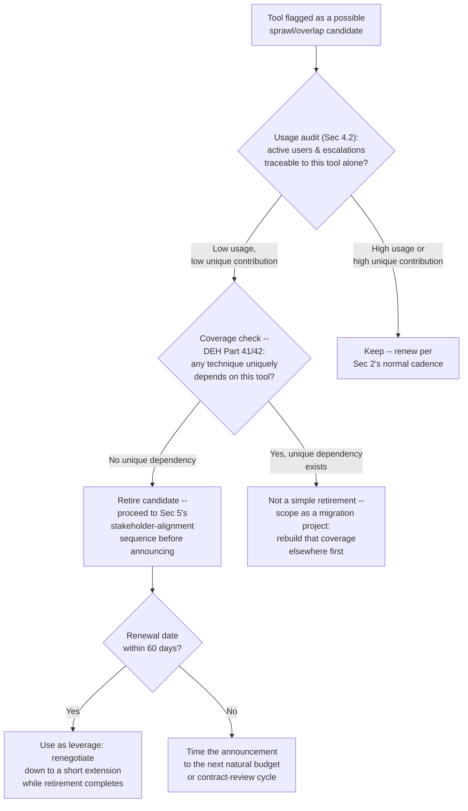

# Part 23 — Vendor Relationship & Renewal Management

## Why this part exists

**[CONCEPT]** Part 21 — Tooling Procurement & Platform Strategy owns the decision to bring a vendor in: the PoC, the reference calls, the total-cost-of-ownership model. Part 22 — MSSP & Managed-Service Contract Management owns writing the contract that decision produces: the SLA, the right-to-audit clause, the offboarding terms, the governance cadence that starts the day both sides sign. Neither part owns what this one does — the years between signing and either renewing or walking away, during which a vendor's product, pricing, support quality, and ownership structure all keep changing whether or not anyone is watching. A contract signed well in year one can be a bad deal by year three with no single decision anyone can point to as the moment it went wrong — it just drifted, unmonitored, until a renewal invoice or a support failure forced the question.

**[CONCEPT]** This part covers three things that only happen after signing: running a renewal negotiation on a cadence instead of a deadline, scoring vendor risk as a standing program rather than a one-time gate, and rationalizing tool sprawl — the accumulated state of three tools doing one job because retiring any of them requires a fight nobody wanted to start. That third topic has a specific, recurring complication this part treats as first-class rather than a footnote: the tool a senior stakeholder personally championed is, on the merits, often the easiest one to justify killing and the hardest one to actually kill, and the two facts are unrelated to each other. Part 26 — Cross-Team Politics & Stakeholder Alignment develops the general playbook for standing cross-team friction; this part covers the specific, common instance of it that shows up every time a tooling budget gets reviewed, because a vendor-retirement decision is where that friction shows up earliest and most predictably in most SOCs.

**[CONCEPT]** Two things this part deliberately leaves to other chapters. What a tool's renewal or replacement costs, and how that cost is defended to a CFO, is Part 20 — Building & Defending the SOC Budget's arithmetic; this part produces the renewal decision and the dollar figure behind it, not the budget-category structure that figure lands in. And whether a tool flagged for retirement is actually safe to retire from a coverage standpoint — whether some detection or telemetry source uniquely depends on it — is not a governance question this part can answer on its own; that confirmation step depends on Detection Engineering Handbook V2's coverage material, cited in §4 below rather than re-derived.

## 1. From procurement to governance: what changes after the signature

**[CONCEPT]** A vendor relationship has exactly one moment where the SOC has real, favorable leverage by default: the period before a contract is signed, when the vendor is competing for the deal and the SOC can walk away to a competitor at close to zero cost. Every day after signature erodes that leverage a little, because switching now costs migration effort, retraining, and — for anything touching detection logic — a real coverage gap during the transition. Part 22's governance cadence (quarterly business reviews, SLA-compliance checks, a named account-management contact) exists to slow that erosion, not eliminate it. A governance cadence that runs on autopilot — the quarterly call happens, the SLA numbers get reported, nobody asks a harder question than "any issues?" — recovers almost none of the leverage a genuinely adversarial renewal negotiation needs, because it never produces the two things that create leverage after signing: a documented pattern of vendor performance drift, and a live, credible alternative.

**[SENIOR MANAGER]** The practical shift this part asks for is treating every signed vendor contract as an open, live risk position rather than a closed decision. A signed contract is not evidence the vendor question is settled for its term — it's evidence a decision was correct on the date it was made, with no guarantee that the vendor, the market, or the SOC's own needs will still match that decision by the next renewal. The rest of this part builds three concrete mechanisms — a renewal calendar, a risk scorecard, and a rationalization audit — that turn "we should keep an eye on this" into something that actually runs on a schedule instead of getting reprioritized every time a live incident eats a manager's week.

## 2. The renewal negotiation cadence

**[CONCEPT]** A renewal negotiation started 30 days before the contract's auto-renewal date is not a negotiation — it's a request to a vendor who already knows the SOC has no time to switch, no completed alternative evaluation, and no credible walk-away option. Leverage in a renewal conversation is a function of runway, not of how compelling the SOC's arguments are, and runway has to be built into the calendar months ahead of the date anyone starts thinking about the renewal as a live decision.

### 2.1 Building a renewal calendar by contract tier

**[VENDOR/PROCUREMENT]** Not every contract deserves the same runway. A four-figure logging add-on and a seven-figure SIEM platform contract do not carry the same switching cost, and treating them identically either wastes review time on low-stakes renewals or — far more common in practice — leaves the highest-stakes contract with the same 60-day review window as a commodity tool, because nobody built a tiered calendar and every renewal date just shows up on the same generic list. The table below sorts contracts into three tiers by annual value and technical dependency, and assigns each a review-start date measured backward from the renewal or auto-renewal date, as a working default for building a renewal calendar rather than a fixed rule for every organization.

| Tier | Typical annual value | Technical-dependency signal | Review starts (before renewal date) | Owner |
|---|---|---|---|---|
| Tier 1 | Above $250,000, or any value with a single point of technical dependency (primary SIEM, EDR, core case-management platform) | Detection logic, playbooks, or daily triage workflow are built directly on top of this vendor's platform | 180 days | SOC manager, with procurement and security architecture |
| Tier 2 | $25,000–$250,000 | Meaningful workflow dependency, but a credible substitute exists without a full platform migration | 90 days | SOC manager or a delegated team lead |
| Tier 3 | Below $25,000, commodity or single-purpose tooling | Low switching cost; a comparable tool could be stood up in weeks | 45 days | Team lead or whoever owns the tool day to day |

**[VENDOR/PROCUREMENT]** The review-start date is not the negotiation-start date — it's the point by which the vendor risk scorecard (§3) and, for any tool with overlap candidates, the rationalization audit (§4) both need a current read. A Tier 1 review that starts at 180 days but only produces a usage number and a price quote by day 30 has wasted five of its six months of runway on nothing; the calendar buys time specifically so those two inputs exist early enough to shape the negotiation itself, not so the date sits on a calendar unused until it's nearly gone.

### 2.2 The auto-renewal trap

**[VENDOR/PROCUREMENT]** Most vendor contracts of any size auto-renew by default, with a notice-to-cancel window — typically 30, 60, or 90 days before the renewal date — buried in a contract clause almost nobody rereads after signing. Missing that window doesn't just mean staying with the vendor; it locks in another full term, usually at whatever price-escalation clause the contract specifies, with zero further negotiating room until the next cycle. This is the single most avoidable failure this part covers, because the fix costs nothing but a calendar entry, and it is also the single most common one, because the notice window is easy to forget once the person who negotiated the original deal has moved on.

**`CASE-2301` — the missed 60-day window.** *COMPOSITE CASE EXAMPLE, illustrative figures constructed from a recurring pattern across mid-market SOC tooling contracts, not one traceable organization.* A threat-intelligence platform contract, originally negotiated by a detection-engineering lead who left the organization four months before the next renewal date, carried a 60-day notice-to-cancel clause and an 8% annual price escalator on auto-renewal, both stated in the contract's Section 14.3 and never flagged anywhere else. The departing lead's own calendar reminder for the renewal review left with them; nobody else had it. Six months earlier, the SOC had migrated off the on-premises SIEM this platform's feed was originally built to enrich, and actual usage of the platform had fallen by roughly half — fewer analysts touched it, and the integration that once justified the full feed tier was no longer running. The 60-day window passed with no review. The contract auto-renewed at $194,400 for another 12 months (up from $180,000, the 8% escalator applied automatically), of which roughly $97,000 — close to half the renewed value — represented capacity and integration scope the SOC was no longer using at all.

> **Manager's Note**
> Put every vendor contract's auto-renewal notice date on a calendar the day the contract is signed, owned by a role rather than a person — "SOC manager" or "vendor governance lead," never a named individual who might leave before the date arrives. The calendar entry costs five minutes. The 8% escalator on a contract nobody was tracking anymore cost this SOC roughly $97,000 it never got a chance to negotiate away.

**[VENDOR/PROCUREMENT]** The fix generalizes past this one case: every Tier 1 and Tier 2 contract's notice-to-cancel date and price-escalation terms should be extracted into the renewal calendar at signing time — the exact clause language, not a paraphrase — as one of Part 22's standing governance-cadence deliverables, so this part's calendar has something real to work from rather than having to reread every contract cold at review time.

### 2.3 Leverage decays with time

**[VENDOR/PROCUREMENT]** Leverage in a renewal conversation is highest early and collapses fast as the renewal date approaches, and the mechanism is simple: a vendor's account team can tell, from the calendar alone, whether the SOC has enough runway left to credibly switch. A renewal conversation opened at 150 days out, backed by a live competitive evaluation already underway, is a different conversation than the same numbers presented at 20 days out with no alternative lined up — the vendor knows the second one has no real walk-away option behind it, and prices accordingly.

| Time to renewal | Available leverage | What's realistically achievable |
|---|---|---|
| 150+ days | High — a credible competitive process is still possible | Price renegotiation, scope changes, a genuine rebid if the vendor won't move |
| 60–150 days | Moderate — too late to run a full competitive PoC, not too late to threaten one | Price and term concessions; vendor account teams still move to avoid a documented at-risk renewal |
| 30–60 days | Low — vendor knows switching in this window is operationally disruptive | Minor concessions at best; usually a like-for-like renewal with cosmetic changes |
| Under 30 days | Near zero | Accept current terms, or accept a short-term (month-to-month) extension while a real process starts for next cycle |

**[VENDOR/PROCUREMENT]** The practical implication of this curve is that the renewal calendar in §2.1 isn't primarily an administrative safeguard against missing a deadline — it's what preserves the top two rows of this table as live options instead of foreclosed ones. A SOC that starts every renewal conversation inside the bottom two rows, however good its negotiators are, is negotiating from a position the calendar gave away months earlier.

## 3. Vendor risk scoring as a standing program

**[CONCEPT]** Part 21's PoC evaluation scorecard answers one question, at one point in time: does this vendor's product fit the requirement well enough to sign. That score is a snapshot, and snapshots go stale — a vendor's financial health, security posture, support quality, and product roadmap all keep moving after the ink dries, and nothing about a strong PoC score two years ago tells a manager anything about where those dimensions sit today. Vendor risk scoring, as this part uses the term, is a different instrument: a small set of dimensions, rescored on a fixed cadence, built specifically to catch drift rather than to justify an initial decision.

### 3.1 What a one-time PoC score can't tell you

**[VENDOR/PROCUREMENT]** A PoC scorecard is built to compare competing vendors against a requirement at a single moment, and it does that job well. It has no mechanism for catching what happens next: a vendor gets acquired by a private-equity-backed roll-up and support staffing quietly thins out over the following year; a key product line goes into maintenance mode while the vendor's roadmap attention shifts to a newer, unrelated product; a vendor's own security posture degrades — a breach, a lapsed compliance certification, a leadership departure in the security function — in ways that matter enormously to a SOC buying a security tool and that a PoC run three years ago had no way to anticipate. None of these show up in an invoice. All of them show up, eventually, in a renewal conversation that goes worse than expected, or in a live incident where the vendor's own support turns out to be the bottleneck.

### 3.2 A standing vendor risk scorecard

**[VENDOR/PROCUREMENT]** The table below names six dimensions worth tracking on a fixed cadence — quarterly for Tier 1 vendors per §2.1's tiers, at minimum annually for everyone else — each scored 1 (healthy) to 5 (severe concern), with a documented reason for the score, not just a number. The scoring itself is a judgment call every quarter; the value of the program comes from forcing that judgment to happen on a schedule and get written down, so a slow decline shows up as a trend line instead of staying invisible until it becomes a crisis.

| Dimension | What it measures | A 4 or 5 typically looks like |
|---|---|---|
| Financial stability | Public financial signals, funding rounds, layoff news, or (for private vendors) payment/renewal behavior suggesting distress | Reported layoffs in the product's own division, a down-round, or a sudden push for multi-year prepayment |
| Ownership/M&A exposure | Recent or rumored acquisition, private-equity ownership, leadership churn | Acquired within the last 12–18 months with no public integration roadmap yet |
| Support quality trend | Median ticket response/resolution time, account-team turnover, escalation-path clarity, measured against the prior review | Response time materially worse than the prior review, or a named technical contact who left with no replacement assigned |
| Product/roadmap health | Release cadence, whether the specific features the SOC relies on are still receiving investment | No meaningful release addressing the SOC's use case in over a year; feature deprecation notices with no clear replacement |
| Security posture | The vendor's own breach history, certification status (SOC 2, ISO 27001 renewal currency), and how transparently they disclose incidents | A lapsed certification, an undisclosed or slowly disclosed incident affecting customer data |
| Concentration risk | How many critical SOC functions depend on this one vendor with no fallback | A single vendor covers detection, case management, and reporting with no documented failover plan |

**[VENDOR/PROCUREMENT]** Use the scorecard below as the standing worksheet a vendor-governance owner fills in each review cycle, filed alongside the renewal calendar entry for the same vendor; it belongs in Appendix A5 as `TMPL-2301`, the vendor risk-scoring template. It does not automate the judgment call behind any single score — two reviewers can legitimately land on different numbers for the same evidence, especially on support-quality trend, which is why the "evidence/reason" field is not optional filler: a score with no stated reason behind it can't be compared meaningfully to the next quarter's score, and the trend line is the entire point of running this more than once.

```text
TEMPLATE — Standing vendor risk scorecard, permanent ID TMPL-2301

VENDOR: __________________     REVIEW PERIOD: Q___ 20___     REVIEWER: __________

| Dimension              | Score (1-5) | Evidence / reason for this score        | Change vs. last review |
|-------------------------|-------------|-------------------------------------------|--------------------------|
| Financial stability     |             | <!-- cite the specific signal, not a gut feel --> |                    |
| Ownership / M&A exposure|             |                                            |                          |
| Support quality trend   |             | <!-- compare to a specific prior-period number, e.g. median response time --> |    |
| Product / roadmap health|             |                                            |                          |
| Security posture        |             |                                            |                          |
| Concentration risk      |             | <!-- name the specific functions that depend on this vendor with no fallback --> | |

OVERALL FLAG: [ ] Green (no action)  [ ] Yellow (monitor, revisit next cycle)
              [ ] Red (any single dimension at 4-5, or 2+ dimensions worsened
                  since last review -- build a contingency plan before the
                  next renewal date, regardless of how far out it is)
```

**[VENDOR/PROCUREMENT]** A vendor that scores red on this worksheet is not necessarily a vendor to drop — a red flag means the contingency-planning clock has started, not that the decision is already made. The judgment call the scorecard doesn't make for you is what to do once a vendor is flagged; that call, and the negotiation leverage a documented red flag actually buys, is what §3.3's worked example turns on.

### 3.3 Worked example: acquisition, and the score that would have caught it

**`CASE-2302` — the private-equity acquisition nobody scored.** *COMPOSITE CASE EXAMPLE, illustrative figures constructed from a recurring pattern following vendor private-equity roll-up acquisitions in the security-tooling market, not one traceable organization.*

**[VENDOR/PROCUREMENT]** An EDR vendor a mid-market SOC had used for three years was acquired by a private-equity-backed platform consolidator. No formal risk review existed at the time — the relationship had been running on Part 22's standard quarterly business-review cadence, which covered SLA-compliance numbers and upcoming feature requests, not ownership or support-trend questions. Over the following nine months, median support-ticket response time rose from roughly 4 business hours to roughly 3 business days; two named technical account managers left within the same window and were never replaced with a dedicated point of contact; and the product's release notes, which had shipped meaningful updates roughly every quarter for the prior two years, showed no material feature release for 14 straight months. None of this was hidden — it was all visible in ordinary support tickets and public release notes — but nothing in the SOC's existing governance cadence was built to notice a trend across nine months of otherwise-routine interactions.

**[VENDOR/PROCUREMENT]** The consequence arrived at renewal: a quote 22% above the prior year's price, with no corresponding improvement in the roadmap to justify it, arriving with roughly 45 days of runway left on the existing contract — deep in the low-leverage band of §2.3's table, because nobody had started a review earlier. The SOC had no completed alternative evaluation in hand and no time to run one, and renewed on largely the vendor's terms.

**[VENDOR/PROCUREMENT]** Run against `TMPL-2301` retroactively, the same nine months would have produced a clear early signal: support quality trend alone would have dropped from a 1 or 2 to a 4 by the third month, on the strength of the response-time change alone, well before the roadmap stagnation or the renewal quote made the problem undeniable. A quarterly scorecard catching that drop at month three — rather than discovering it live at month nine — buys six additional months of runway, moving the eventual renewal conversation from the "under 30 days" row of §2.3's leverage table into the "150+ days" row, with a credible competitive alternative evaluation actually possible in that window instead of foreclosed by the calendar before the negotiation even started.

> **Blind Spot**
> A quarterly scorecard catches a slow, visible drift — support response time, release cadence — reasonably well. It does not catch a sudden, non-public event between review cycles: an acquisition announced the week after a review just ran, a breach disclosed on a delay, a key engineering team laid off with no public statement. Treat the scorecard as a floor, not a guarantee, and pair it with a standing habit of watching public M&A and security-disclosure news for every Tier 1 vendor between formal review cycles — the review cadence tells you when to look deliberately; it doesn't replace paying attention in between.

## 4. Tool sprawl rationalization

**[CONCEPT]** Tool sprawl is not usually one bad decision — it's the accumulated residue of several individually reasonable ones, none of which included a corresponding decision to retire anything. A SOC rarely wakes up one day having decided to run three overlapping threat-intelligence platforms; it ends up there because each one was added to solve a real problem at the time it was added, and nobody ever revisited whether the problem the first one solved still needed a dedicated tool once the third one existed.

### 4.1 How sprawl actually happens

**[VENDOR/PROCUREMENT]** Three mechanisms account for most tool sprawl this part sees, and each has a different early-warning sign worth watching for specifically, because the fix differs slightly by cause even though the eventual rationalization audit (§4.2) is the same regardless.

- **Inherited overlap from a merger or reorganization.** Two SOCs — or a SOC absorbing a business unit's informal monitoring function — combine, and each side's toolset comes along, fully licensed and fully justified on its own terms, with no forcing function that ever required choosing one over the other.
- **Shadow procurement for an urgent, narrow need.** A team lead signs up for a free-tier or low-cost trial to solve one specific problem fast, outside the normal procurement process Part 21 governs, and the trial becomes a permanent fixture because it worked well enough that nobody wanted to be the one to turn it off, even after the normal procurement process later adds a platform that does the same thing properly.
- **Bundled capability that duplicates a standalone purchase.** An EDR, SIEM, or SOAR platform upgrade adds a bundled feature — threat intel, case management, basic SOAR playbooks — that overlaps a tool already purchased standalone for the same function, and the standalone tool's renewal simply continues because nobody connected the new bundle to the old contract at the time either happened.

> **People Risk Trap**
> A shadow-procured trial has no natural expiration, which is exactly why it's the mechanism most likely to survive years past the "urgent, narrow need" that justified it — nobody owns a formal decision to keep it, so nobody ever has to make a formal decision to kill it either. The fix: any tool brought in outside Part 21's normal procurement process gets an automatic 90-day expiration written down at the moment it's adopted, with a named owner who has to actively request continuation through the normal process to keep it past that date. Silence should default to the trial ending, not to it becoming permanent.

### 4.2 Auditing overlap: usage data, not seat counts

**[VENDOR/PROCUREMENT]** The single most common analytical mistake in a rationalization audit is measuring adoption by license seats provisioned instead of actual usage, because seat counts are the number every vendor's own dashboard surfaces first and the number every stakeholder defending a tool will cite. Forty provisioned seats on a platform that eight people have logged into in the last 90 days is not "widely adopted" — it's eight users and thirty-two unused licenses, and the difference between those two framings is exactly the difference between a tool that's earning its renewal and one that isn't. Pull real usage telemetry wherever the platform exposes it: active users in the trailing 90 days, actual query or API call volume, and — the number that matters most for a security tool specifically — how many escalated true positives actually trace back to something this tool uniquely surfaced, as opposed to something every other tool in the stack would have caught anyway.

> **Cross-Book Pointer**
> This part's usage audit tells you whether a tool is being used. It does not tell you, on its own, whether retiring it would open a real detection gap — that's a coverage question, not a usage question, and a low-usage tool can still be the only source for one specific, rarely-triggered but important detection. See Detection Engineering Handbook V2, Part 41 — Detection Coverage for the six-tier model that answers whether a given technique's coverage genuinely depends on this tool alone, and Part 42 — Detection Quality for confirming that coverage is actually validated rather than assumed. Run that check before finalizing any retirement decision this section's audit points toward — a tool with low usage and a real, unique coverage dependency is a retuning-and-migration project, not a straightforward cut.

### 4.3 Worked example: three threat-intel platforms, one job

**`CASE-2303` — the triplicate TIP.** *COMPOSITE CASE EXAMPLE, illustrative figures constructed from a recurring pattern across SOCs that accumulated threat-intelligence tooling incrementally, not one traceable organization.*

**[VENDOR/PROCUREMENT]** A SOC found itself running three separate threat-intelligence platforms feeding IOC and enrichment data into its detection stack. TIP-A was a standalone paid platform, procured three years earlier at $62,000 a year, before the SOC's current EDR contract existed. TIP-B arrived bundled at no additional license cost inside a later EDR enterprise-tier upgrade, but consumed roughly 15 analyst-hours a month reconciling its feed against TIP-A's, because the two platforms tagged and scored the same indicators differently and analysts had learned to cross-check both rather than trust either alone. TIP-C was a lower-cost feed with a paid enrichment add-on running about $40,000 a year, originally wired up by a threat hunter who has since moved to a different team, now maintained by whoever happens to own the integration that quarter.

```text
CONCEPTUAL SAMPLE -- illustrative arithmetic, not sourced benchmark data

Overlap analysis across a two-quarter sample:
  Indicators duplicated across 2+ of the 3 platforms:      ~85% of total volume
  Escalated true positives in the sample window:            340
  Of those, uniquely traceable to a TIP-A-sourced indicator: 14   (~4% of total)

Annual cost:
  TIP-A license:            $62,000/year
  TIP-B:                     $0 license (bundled), ~15 analyst-hrs/month reconciliation
  TIP-C + enrichment add-on: $40,000/year

Reconciliation labor: 15 analyst-hrs/month x 12 = ~180 analyst-hours/year spent
  cross-checking duplicate indicators across three consoles instead of one
```

**[VENDOR/PROCUREMENT]** The overlap analysis, not a subjective sense that "we probably have too many tools," is what made the decision defensible: 85% indicator duplication meant the three platforms were mostly restating the same intelligence in three formats, and TIP-A — the most expensive of the three — contributed uniquely to only about 4% of actual escalated true positives over the sample window. The SOC retired TIP-A, kept TIP-B (already paid for as part of the EDR bundle) as the primary feed, and kept TIP-C's enrichment add-on for the specific indicator categories TIP-B's bundle didn't cover well. The result: $62,000 a year in license cost eliminated outright, and roughly 180 analyst-hours a year reclaimed that had been going into reconciling duplicate alerts across three consoles instead of working a single queue.

### 4.4 A rationalization decision path

**[VENDOR/PROCUREMENT]** Figure 23.1 turns §4.2's usage audit and §4.3's overlap analysis into a repeatable decision path for any tool a rationalization review flags as a candidate, folding in the renewal-timing question from §2 and the coverage check from §4.2's Cross-Book Pointer so usage, uniqueness, and timing all get checked before a retirement decision is finalized.





**Figure 23.1 — Tool rationalization decision path.** *CONCEPTUAL.* `FIG-2301`. Illustrates how a usage audit, a detection-coverage check, and renewal timing combine into a single retirement decision; it is a structural decision aid, not a capture of any specific SOC's actual tooling-review workflow. It deliberately routes every "retire candidate" outcome into §5's stakeholder-alignment sequence rather than straight to an announcement — the data-driven decision and the politically survivable announcement are two different problems, and this diagram exists partly to keep a reviewer from treating "the numbers say retire it" as the end of the process.

## 5. The political difficulty of killing a champion's tool

**[CONCEPT]** Every rationalization audit eventually flags a tool someone senior chose, championed to their own leadership, and has a real stake in seeing succeed — not out of irrationality, but because recommending a platform, defending its budget in front of peers, and having it later quietly retired reads, to most people in that position, as a public reversal of their own judgment. The data in §4 can be completely correct and still lose this fight, because the fight isn't about the data. It's about whether the retirement can happen in a way that doesn't require the champion to publicly concede they were wrong two years ago.

### 5.1 Why this is a people problem, not a data problem

**[SENIOR MANAGER]** A manager who treats a champion's objection to a retirement recommendation as a data disagreement — "let me show you the usage numbers again, more clearly this time" — is answering a question the champion isn't actually asking. The champion already knows, in most cases, that usage is low; the objection is rarely a genuine dispute about the eight active users on a forty-seat license. What's actually being protected is standing: the narrative that the original decision was sound, the relationship with a vendor executive that might be personal as well as professional, and the risk that a visible reversal becomes the story other leaders remember about that person's judgment. No usage chart resolves any of that, because none of it is about the chart.

> **People Risk Trap**
> Presenting a data-backed retirement recommendation to a champion for the first time in a group setting — a monthly ops review, a leadership meeting, anywhere with an audience — is close to guaranteed to produce a defensive, public reaction regardless of how solid the data is, because the champion now has to respond in front of an audience whose opinion of their judgment matters to them. The fix: the champion sees every number privately, first, with enough time to react before anyone else does. A senior stakeholder blindsided in public will very often find a reason to object on the spot and win, purely on the strength of having more positional authority in that room than the person presenting — not because the objection was actually stronger than the data.

### 5.2 Tactics that actually work

**[SENIOR MANAGER]** Four moves consistently make this conversation survivable, none of them a substitute for having the data right in the first place.

- **Brief privately, well before any public forum.** Give the champion the usage and cost data one-on-one, framed as "here's what the current numbers show, what am I missing" rather than "here's the recommendation." That framing invites correction instead of forcing a defense, and it surfaces a genuine objection — a real coverage dependency, a contract term nobody else knew about — before it becomes a public standoff.
- **Reframe the decision as evolution, not indictment.** "This was the right call for where we were two years ago; we've outgrown what any single tool needed to cover back then" is a true statement in most sprawl cases and a survivable one, because it doesn't require anyone to have been wrong — only for circumstances to have changed, which they usually genuinely have.
- **Bring a scoped alternative, not a bare cut.** A recommendation that ends at "retire this" reads as pure loss to the person who championed it. A recommendation that reads "consolidate into the platform we already have, migrate these three remaining use cases over an eight-week window" gives the champion something to co-own instead of something to lose.
- **Let the champion be the one who announces it, at least in part.** A retirement the champion frames to their own leadership — "we've evolved past needing this as a standalone tool" — lands completely differently than the same retirement announced about their decision by someone else. Ceding the announcement costs the SOC manager almost nothing and buys most of the political goodwill needed to get the decision through cleanly.

**[SENIOR MANAGER]** When none of that resolves the disagreement — the private brief happens, the alternative is on the table, and the champion still blocks it — the next move is escalation to a shared superior, not a public argument the SOC manager has no positional authority to win outright against someone more senior. Framed as "we have a clear cost and usage case and a stakeholder objection that hasn't been resolved after a good-faith private conversation; we need a decision," that escalation is a legitimate use of the chain of command, not a failure to have handled the politics well enough on the manager's own.

### 5.3 Management Autopsy: the ambush retirement

**[SENIOR MANAGER]** `CASE-2304` below shows what §5.1's warning looks like when it isn't heeded — a technically correct recommendation, delivered in exactly the wrong sequence, turning a straightforward cost decision into a 14-month political stalemate.

> **Management Autopsy — "present the retirement in the monthly ops review" (`CASE-2304`, COMPOSITE CASE EXAMPLE)**
>
> **The decision:** A SOC manager brought a fully data-backed recommendation to retire a legacy case-management console — 8 active users out of 40 analysts, averaging roughly two logins a month each — directly to the monthly ops review attended by the CISO's full leadership team, reasoning that a leadership forum was the right venue for visibility on a real cost decision.
>
> **Why it seemed reasonable:** The usage numbers were clean, the cost case was strong, and the manager assumed presenting to the full leadership group would move the decision faster than a series of one-on-one conversations — more visibility, one meeting, done.
>
> **How it failed:** The console's original champion — a director who had personally sold the platform to the CISO two years earlier as a signature initiative — was in the room, unbriefed, and challenged the usage numbers on the spot rather than accept them in front of peers. Rather than get corrected with a follow-up data point, the challenge escalated into "let's take this offline and revisit," which quietly became a 14-month stay of execution with no further review scheduled. The SOC manager's credibility also took a real hit outside this one decision — colleagues who witnessed what looked like a public ambush of a fellow director became noticeably more cautious about what the manager brought to shared forums afterward.
>
> **The fix:** The same recommendation, delivered to the champion privately a week ahead of the ops review, with the framing from §5.2 and a scoped migration alternative already attached, would very likely have reached the same ops-review meeting as a jointly presented, already-agreed change instead of a live confrontation — the data didn't need to change at all; only the sequence in which people saw it did.

## 6. Running this as a standing quarterly program

**[CONCEPT]** A renewal calendar, a risk scorecard, and a rationalization audit each work as described above in isolation, but they compound when run together on the same standing cadence, because the inputs to one are frequently the trigger for another: a red-flagged risk score (§3) is exactly the condition that should pull a vendor's renewal review forward regardless of where it sits on the §2.1 calendar, and a rationalization audit (§4) is most useful when it's run against the same vendor list the risk scorecard already covers, rather than as a separate, occasional special project.

### 6.1 Who's in the room

**[SENIOR MANAGER]** A vendor governance review that's only ever attended by the SOC manager tends to produce decisions that stall the moment they touch budget, legal terms, or a stakeholder outside the SOC's own reporting line — exactly the failure mode §5 covers. The table below states who needs a standing seat and why, as a minimum viable roster rather than an exhaustive committee.

| Role | Why they're in the room |
|---|---|
| SOC manager | Owns the overall recommendation and the tradeoffs across vendors |
| Procurement/legal contact | Confirms contract terms, notice windows, and negotiating room accurately, rather than from memory |
| Finance/budget owner | Confirms the dollar impact lands correctly in Part 20's budget structure and flags multi-year commitment implications |
| Security architecture representative | Speaks to the coverage-dependency question from §4.2's Cross-Book Pointer before any retirement is finalized |
| Relevant team lead or stakeholder (rotating) | Represents the tool's actual day-to-day users; invited specifically for vendors under review that quarter, including any champion per §5 |

### 6.2 The quarterly cadence, assembled

**[SENIOR MANAGER]** A minimum viable version of this program runs on two nested loops: a quarterly refresh of the risk scorecard (§3.2) for every Tier 1 vendor and a usage-data pull for any vendor already flagged as a possible overlap candidate, plus an annual pass that runs the full rationalization audit (§4) across the entire tool inventory and rebuilds the next 12 months of the renewal calendar (§2.1) from scratch rather than incrementally patching last year's dates. The quarterly loop is what catches drift early enough to matter, the way §3.3's worked example shows; the annual loop is what catches sprawl that accumulated too gradually for any single quarter's review to notice on its own.

> **Manager's Note**
> Calendar the quarterly scorecard refresh the same week every quarter — tied to a fixed date, not to "whenever things are quiet enough." A vendor governance program that only runs when the SOC has spare capacity runs during exactly the quarters when nothing urgent happened, which are the quarters least likely to contain the drift worth catching in the first place.

## 7. Where this goes next

**[CONCEPT]** The renewal calendar, the risk scorecard, and the rationalization audit built in this part feed directly into Part 20's budget cycle every time a renewal decision produces a number that needs defending, and into Part 26's broader cross-team politics treatment every time a rationalization decision runs into a stakeholder whose objection has nothing to do with the tool itself. Nothing here replaces the initial selection discipline in Part 21 or the contract-drafting mechanics in Part 22 — this part assumes both already happened and picks up the moment the ink is dry, which is also the moment most SOCs stop paying attention until the next crisis forces the question back onto someone's desk.

---

## Cross-references

**Within this book:** Part 20 — Building & Defending the SOC Budget (the budget-category structure a renewal decision's dollar figure ultimately has to fit into); Part 21 — Tooling Procurement & Platform Strategy (the PoC and TCO process this part's ongoing risk scorecard picks up from at signing); Part 22 — MSSP & Managed-Service Contract Management (the contract terms, SLA, and standing governance cadence this part's renewal calendar and risk scorecard build on rather than re-derive); Part 26 — Cross-Team Politics & Stakeholder Alignment (the general treatment of standing cross-team friction that this part's §5 covers as one specific, recurring instance).

**Detection Engineering Handbook V2:** Part 41 — Detection Coverage (confirming whether a rationalization candidate is the sole source of validated coverage for a technique before it's retired, per §4.2's Cross-Book Pointer); Part 42 — Detection Quality (confirming that coverage is actually tested and current, not just assumed, before the same retirement decision is finalized).
