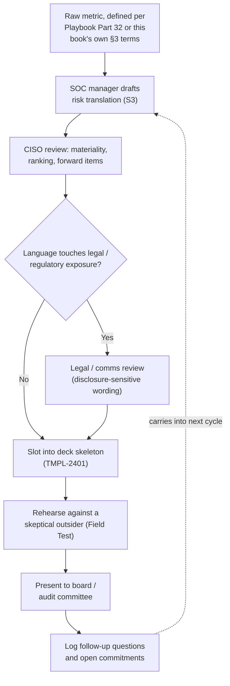

# Part 24 — Executive & Board Reporting

## Why this part exists

**[EXECUTIVE]** A SOC can have a clean, well-instrumented metrics program — mean time to respond and false-positive rate defined consistently per SOC Playbook Handbook, Part 32 — Metrics, plus mean time to detect and backlog age defined just as consistently as this book's own operational terms (§3 below, Part 9 §1) — and still fail completely the first time someone has to stand in front of a board and explain what those numbers mean for the company's risk. A board member doesn't act on "MTTR improved from 42 minutes to 31 minutes this quarter." They act on "the average window an attacker has to do damage before we notice shrank by about a quarter, and here's what that bought us on the incident we actually had." Those are the same fact, stated two different ways, and only one of them survives contact with a room full of people whose job is fiduciary oversight, not incident response.

This part covers the mechanics of getting from the first sentence to the second, reliably, on a fixed cadence, in a form that holds up when someone asks a hard question back. It does not define what MTTR, MTTA, or false-positive rate actually measure — that ownership sits with SOC Playbook Handbook, Part 32 — Metrics. Backlog age is Part 9 §1's own operational term. Mean time to detect (MTTD) is defined in §3 below, since it belongs to neither companion volume — every number this part touches beyond that is a finished input from whichever definitional source actually owns it, not something re-derived here. It does not build the CFO-facing budget defense — cost-per-analyst, cost-per-alert, the build-vs-buy business case — that's Part 20's material, and a board deck borrows that model's headline number without rebuilding the model itself. It does not cover the manager's own judgment about which risks get escalated into this reporting cycle in the first place, versus accepted quietly at the SOC-manager level — that call, and the cases where it's genuinely unclear, belongs to Part 25. And it does not cover the compressed, high-frequency communication cadence a manager runs during a live major incident, which is a different problem with a different clock — Part 28 owns that. What's left, and what this part actually owns, is the steady-state reporting relationship: cadence, format, translation, and the specific discipline of building material that survives a skeptical follow-up question.

## 1. What the board is actually asking

**[CONCEPT]** Board members overseeing a SOC's output are rarely security practitioners, and treating them as junior analysts who just need the jargon translated is its own category error — they aren't trying to learn what a SOC does, they're trying to discharge a specific fiduciary obligation with limited time on an agenda that includes this topic alongside a dozen others that have nothing to do with security. Underneath the specific questions any given board asks, three recur across almost every board relationship a SOC manager will report into.

**Are we exposed, right now, in a way that matters?** Not "how many alerts did we see" — whether the organization's actual risk posture changed this quarter, and in which direction. **Are we prepared for the thing most likely to hurt us?** Not "do we have an incident response plan" as a yes/no — whether the plan has been tested against something resembling the organization's real threat profile, and what that test revealed. **Is the money we're spending on this buying a proportionate reduction in risk?** Not the budget defense itself — Part 20 owns that mechanically — but whether the board can credibly tell a regulator, an auditor, or a shareholder that security spend was overseen, not just approved.

**[EXECUTIVE]** That third question has gotten sharper in most jurisdictions in recent years. Both disclosure obligations below come from the same SEC final rule on cybersecurity risk management, strategy, governance, and incident disclosure, adopted July 2023, but they took effect on two different clocks worth keeping straight before citing either one to a board: the Form 8-K requirement — disclosing a material cybersecurity incident within four business days of a materiality determination — carried its own compliance date of December 18, 2023, for most registrants (smaller reporting companies got until June 15, 2024); the annual disclosure (Form 10-K, Item 1C), describing the board's cybersecurity risk oversight process itself and not just its outcome, applies starting with annual reports for fiscal years ending on or after December 15, 2023. A board that can't describe how it oversees cyber risk is exposed on that fact alone, independent of whether an incident ever happens, which is a direct board-level reason the SOC's reporting has to hold up as a documented process, not just as a set of accurate numbers. This isn't universal — plenty of organizations this book's readers run a SOC for aren't SEC registrants — but it's the sharpest current version of a pressure that shows up in some form in most regulated industries and most audit-committee relationships.

## 2. Reporting cadence: who gets what, how often

**[SENIOR MANAGER]** A single reporting cadence trying to serve the CISO, the board, and an audit committee at once produces material that's too shallow for the CISO's actual working relationship with the SOC manager and too deep for a board member juggling eleven other agenda items in the same meeting. Match cadence and depth to the audience's actual decision rights, not to whatever cadence is administratively convenient to produce. The table below matches audience to cadence and depth, and names who actually owns preparing each one.

| Audience | Typical Cadence | Content Depth | Primary Question Answered | Who Prepares |
|---|---|---|---|---|
| SOC manager's own leadership review | Weekly | Full operational detail — queue health, staffing gaps, tuning backlog | Are this week's numbers within expected range | SOC manager / team leads |
| CISO | Monthly | Trend-level metrics, named exceptions, resourcing flags | Is anything drifting that needs intervention before it reaches the board | SOC manager |
| Audit / risk committee | Quarterly | Risk-narrative summary, control-effectiveness statements, material changes | Is the control environment operating as represented | CISO, with SOC manager input |
| Full board | Quarterly (or per bylaws) | High-level risk posture, incidents of note, forward risk items | Are we exposed, prepared, and spending proportionately | CISO, presenting the manager's material |
| Ad hoc — material incident | Hours to days of a materiality determination | Incident-specific, fact-based, legal-reviewed | What happened, what's the exposure, what's next | CISO plus legal, SOC manager as input (Part 28) |

**[SENIOR MANAGER]** Content should narrow, not just shrink, as it moves up this table — the weekly review is a full instrument panel, the CISO's monthly pass filters for anything that needs a decision above the SOC manager's authority, and the board's quarterly slot filters again for anything that changes the answer to one of §1's three questions. A deck that just compresses the weekly review's font size for the board isn't narrowing content, it's hiding the same volume of noise in less space.

> **Manager's Note**
> If you're the SOC manager personally standing in front of the full board every quarter, check who actually owns that relationship on paper. In most organizations the CISO holds the board seat and the SOC manager feeds material through them — confusing "I built the numbers" with "I own the board relationship" is a fast way to say something in a board room that legal or the CISO needed to see first.

## 3. The translation problem: from operational metric to risk narrative

**[CONCEPT]** A metric without a stated consequence is inert in a board room. "MTTD is 3.1 hours" is a fact a board member can neither dispute nor act on — it has no direction, no comparison point, and no attached decision. The translation this part builds is a fixed three-part recipe: state the metric and its trend, name the mechanism in plain business terms (what changing that number actually does or doesn't protect), and close with the specific thing the board should do, ask, or simply note as a result. Skip any one of the three and the sentence reverts to a number with a period after it.

> **Cross-Book Pointer**
> This part does not define MTTR, MTTA, or false-positive rate — those definitions, and the instrumentation discipline that makes them comparable quarter over quarter, are SOC Playbook Handbook, Part 32 — Metrics. Backlog age is Part 9 §1's own operational term. Mean time to detect (MTTD) is defined here, in this part, because neither companion volume owns it: it is the elapsed time between a security-relevant event first appearing in raw telemetry and the point a detection fires or an analyst first identifies it — a measure of dwell time before notice, distinct from MTTA (Playbook Part 32), which measures how fast an analyst acknowledges an alert that has already fired. Read Part 32 first for MTTR, MTTA, and false-positive rate, and make sure this part's own definition of MTTD (and Part 9 §1's definition of backlog age) is applied just as consistently, if your organization doesn't already have one shared, audited definition per metric — a board narrative built on a metric that means something different in Q1 than in Q3 will eventually get caught by exactly the kind of follow-up question §7 covers, and it won't survive it.

**[EXECUTIVE]** The table below is a translation pattern to reuse for any metric your program tracks — take the raw number, name the mechanism in one sentence, and close with the specific thing the board should do or ask next. The specific figures in the "Raw Statement" column are illustrative placeholders standing in for whatever your own instrumentation reports **(CONCEPTUAL SAMPLE — illustrative numbers, not sourced benchmark data)**; the translation pattern in the other two columns is the reusable part.

| Operational Metric (definition source) | Raw Statement | Risk Translation for the Board | What It Should Prompt the Board to Do |
|---|---|---|---|
| Mean time to detect (MTTD) — this part's own term, §3 above | MTTD dropped from 6.2 hours to 3.9 hours this quarter | An intruder now has roughly 2 hours less time inside our environment before we notice, on average — that's the window we closed | Note the trend; ask what closed it, and whether it holds under a worse scenario than an average one |
| Mean time to respond (MTTR) — Playbook Part 32 | MTTR held flat at 31 minutes | Once we notice something, our response speed hasn't changed — flat is only reassuring if detection or exposure hasn't gotten worse elsewhere | Ask whether "flat" is masking a shift in the mix of what's coming in (see §7's pattern for this exact question) |
| False-positive rate — Playbook Part 32 | FP rate is 68% this quarter, down from 74% | Roughly 2 out of 3 alerts our team investigates turn out to be nothing, down from 3 out of 4 — fewer wasted analyst-hours chasing noise, which is capacity we can put against real threats | Treat as a capacity and efficiency signal, not a safety signal — Detection Engineering Handbook V2, Part 42 — Detection Quality owns whether detection quality itself actually improved |
| Backlog age (p90) — this book's own term, Part 9 §1 | P90 backlog age is 4.5 hours, up from 2 hours | 1 in 10 open items now sits untouched for over 4.5 hours before anyone looks at it — double last quarter's figure, and where a real incident could sit unnoticed the longest | Ask whether this is a volume spike, a staffing gap, or both, before approving any fix |
| Detection coverage (validated) | Coverage against our top 5 mapped threat scenarios is 3 of 5 fully validated | 2 of the 5 attack patterns we've identified as most likely to hit us don't yet have a tested detection behind them — a known, named gap, not an unknown one | Ask for the remediation timeline and whether it needs budget (Part 20) or just engineering time — Detection Engineering Handbook V2, Part 41 — Detection Coverage owns how "validated" is actually defined |

> **Cross-Book Pointer**
> The false-positive-rate and detection-coverage rows above translate a technical measurement into a board-facing consequence; they don't explain how false-positive rate gets reduced or how "validated coverage" gets established in the first place. For the tuning mechanics behind a falling false-positive rate, see Detection Engineering Handbook V2, Part 38 — False Positive Engineering; for what "validated" means on a coverage matrix, see DEH Part 41 and DEH Part 42. This part only owns turning whatever those parts produce into a sentence a board member can act on.

> **Manager's Note**
> Draft the risk-translation sentence before you finalize the chart, not after. If you can't write the one sentence a board member should take away from a metric before you've picked its axis labels and colors, the chart is decoration around a number nobody's translated yet — and that gap shows the moment someone in the room asks what it means and the honest answer is a longer, less confident version of the sentence you skipped writing.

## 4. Worked example: turning a quarter's numbers into a board narrative

**[SENIOR MANAGER]** COMPOSITE CASE EXAMPLE (`CASE-2401`) — illustrative organization and figures, constructed to show how one quarter's operational numbers become one board slide; not drawn from a single traceable real SOC.

**The organization:** A 28-analyst in-house SOC at a mid-market insurer (roughly 4,000 employees), reporting through a CISO who presents to the full board once a quarter and to the audit committee in the intervening months.

**The quarter's raw numbers:** MTTD improved from 5.8 hours to 3.1 hours following a new EDR deployment (Part 21's tooling-procurement territory, not re-covered here). One event during the quarter matched a known ransomware-precursor pattern — credential dumping followed by an attempt to disable backup agents — and was contained at the credential-dumping stage, before any encryption or exfiltration occurred. FP rate held at 71%, roughly flat quarter over quarter. P90 backlog age rose from 2.1 to 3.4 hours, driven by a two-week staffing gap while a departing analyst's backfill was still in the pipeline (Part 18's attrition territory).

**The manager's first draft, too raw to present:** "MTTD down from 5.8h to 3.1h. FP rate flat at 71%. One High-severity ransomware-precursor incident, contained. P90 backlog age up from 2.1h to 3.4h due to a staffing gap." Accurate, and useless to a board member reading it cold — four disconnected facts with no ranking and no consequence attached to any of them.

**The board-ready version:** "This quarter, we cut our average detection time nearly in half, which is what let us stop a ransomware-precursor attack at the credential-theft stage — before it reached backup systems or encryption. That's the incident this deck's next slide covers in more detail. The one number moving in the wrong direction is how long a lower-priority ticket now sits before anyone looks at it, which tracks directly to a two-week staffing gap we've since closed; we're watching it for one more quarter before treating it as a trend." Same four facts, ranked by consequence, with the one bad number named honestly instead of buried in a footnote, and a specific, bounded commitment instead of a vague reassurance.

**Why the rewrite works:** it leads with the fact that actually answers §1's fiduciary questions, uses the ransomware-precursor incident as concrete proof behind the MTTD number instead of leaving MTTD as an abstract improvement, and doesn't let the one negative number disappear. A board that later discovers a manager quietly dropped a worsening metric from the deck stops trusting every other number in it, which costs far more than one uncomfortable quarter.

> **Operational Reality**
> The instinct to drop or soften the one metric moving the wrong direction is strongest exactly when the rest of the deck looks good — a manager riding a genuinely strong MTTD improvement has the most to lose by also flagging the backlog-age miss, and the most cover to quietly leave it out. Boards that catch this once, even on a metric that turns out to be minor, downgrade their trust in every number that manager presents afterward, not just the one that was hidden.

## 5. Building the board-ready deck

**[EXECUTIVE]** The table below is a five-section deck skeleton that fits inside a 20–30 minute board slot including questions — use it as a default structure, not a mandatory template. A quarter with nothing forcing a resourcing ask should simply drop that slide rather than padding it to fill the slot.

| Deck Section | Purpose | Typical Length | Content Source |
|---|---|---|---|
| Risk posture summary | One-glance answer to "are we exposed" | 1 slide, 3–5 lines | This part's translation layer (§3) |
| Incidents of note | Concrete proof behind the summary | 1 slide per incident, at most two or three incidents | Post-incident organizational review (Part 29) |
| Trend metrics | Direction of travel on the metrics that matter this cycle | 1 slide | The scorecard in §6, sourced from Playbook Part 32 (MTTR, FP rate) and this book's own definitions (MTTD — §3 above; backlog age — Part 9 §1) |
| Resourcing / spend ask | Ties risk posture to a specific budget or headcount decision | 1 slide, only when there's an actual ask | Part 20's budget model, Part 5's headcount model |
| Forward risk items | What the board should expect to hear about next cycle | 1 slide | Part 25's risk-acceptance log, escalated items |

**[SENIOR MANAGER]** This structure is built out as a reusable board deck template (`TMPL-2401`) in Appendix A7, alongside the risk-acceptance memo template Part 25 uses and the post-incident organizational review template Part 29 uses — the three share a lot of sourcing logic, which is why they're grouped in the same appendix. Use the template as a starting skeleton and expect to cut slides more often than you add them; a deck that grows every quarter because nothing ever gets retired is the same failure mode as a metrics dashboard nobody prunes.

**[SENIOR MANAGER]** The pipeline from a raw metric to a board slide involves more review hops than most first-time preparers expect, and skipping one of them is a common way risky language reaches a board unreviewed.

**Figure 24.1 — From raw metric to board slide, as a repeating pipeline.** *CONCEPTUAL.* Illustrates the review hops between a defined operational metric and a presented board slide — CISO materiality review, a conditional legal/comms pass for disclosure-sensitive language, and a rehearsal step — feeding into a follow-up log that carries into the next cycle rather than a one-way, one-time production process. Diagram ID `FIG-2401`.

> **Field Test**
> **Setup:** A draft board deck exists, one week before the actual meeting.
> **Action:** Hand it to someone outside the SOC — a peer manager, the CISO's chief of staff, legal — with no context beyond what's on the slides, and ask them to raise the single hardest question they can think of after reading it once.
> **Expected result:** You should be able to answer that question in under 30 seconds without flipping to a slide that doesn't exist yet. If the honest answer is "let me get back to you," that's a gap to close before the real meeting, not during it.

## 6. Choosing what makes the cut: a metric-selection scorecard

**[SENIOR MANAGER]** Not every metric the weekly operational review tracks earns a board slide, and picking by instinct produces a deck that either drowns the board in detail or quietly omits the number that mattered most. Score each candidate metric against the five criteria below before it earns a slot.

| Criterion | Score 0 | Score 1 | Score 2 |
|---|---|---|---|
| Materiality | Change under 5% quarter over quarter | Change of 5–15% | Change over 15%, or any incident-linked shift |
| Actionability | Board has no lever that changes this | Board can influence indirectly (budget, risk acceptance) | A board decision this cycle directly changes this next cycle |
| Comparability | No consistent baseline yet | Baseline exists but is under two quarters old | Two or more quarters of a consistent, audited definition |
| Audience relevance | Purely operational (queue mechanics) | Ties to a named risk or incident | Directly answers one of §1's three fiduciary questions |
| Narrative-readiness | No translation sentence written yet | Draft translation exists | Translation has survived a skeptical read (§5's Field Test) |

A metric scoring 6 or higher out of 10 belongs in the board deck; a metric scoring 3–5 belongs in the CISO's monthly review instead; anything under 3 stays in the SOC manager's own weekly operational review until it moves.

**[SENIOR MANAGER]** A metric's comparability score should specifically exclude comparison against an external industry benchmark, even when a board member asks for one directly. "How do we stack up against peers" is one of the single most common questions this chapter's material has to survive, and Part 31 covers, in detail, why most published benchmark reports answer that question less reliably than they look like they do — self-selected respondent pools, no shared metric definition across contributors. Have the honest, bounded version of that answer ready — what you're genuinely comparable on, what you're not, and why — rather than either refusing the question or handing over a benchmark number with no caveat.

## 7. Surviving the skeptical follow-up question

**[EXECUTIVE]** A board-ready answer to a hard question has three layers, in a fixed order: a **headline** that directly answers the literal question in one sentence, with no hedging in front of it; **evidence** — one concrete fact backing the headline, ready before the question is asked, not assembled while answering it; and a **bound** — what you don't know yet or what's out of scope right now, plus a specific commitment to close that gap, with a name and a date attached. Skipping the bound and hoping nobody asks is how a confident answer turns into a credibility problem the moment a second question follows the first.

The table below maps four questions that come up in almost every board Q&A to this headline/evidence/bound pattern, worth rehearsing before the meeting rather than improvising during it.

| Skeptical Question | Headline Answer Pattern | Evidence to Have Ready | The Honest Bound |
|---|---|---|---|
| How do we compare to peers? | State what's genuinely comparable and what isn't | Internal trend data, not a raw benchmark number (Part 31) | Name the benchmark's own limitation before the board finds it |
| Why should I trust this number? | State who audits or validates it, and how | The metric's definition source (SOC Playbook Part 32 for MTTR/FP rate; this part's own §3 for MTTD, or Part 9 §1 for backlog age) and its sampling or QA method (Part 15) | Flag if a definition changed recently, and whether the trend still holds under the old one |
| What would it take for this to happen to us? | Name the specific scenario tested, not a generic reassurance | The most recent tabletop or Field Test result | State which scenario hasn't been tested yet, and when it will be |
| Is spend keeping pace with the threat? | Tie spend directly to a named risk reduction, not a budget total | Part 20's cost-per-risk-reduction framing | Name what a flat or cut budget would specifically stop covering |

> **Management Autopsy — "answer the peer-comparison question with a vendor's own benchmark number" (COMPOSITE CASE EXAMPLE, `CASE-2402`)**
>
> **The decision:** Asked by a board member how the SOC's mean time to respond compared to similar organizations, a SOC manager cited a number directly from a security vendor's annual benchmark report — "the report says the industry average is 24 hours; we're at 6" — with no further qualification.
>
> **Why it seemed reasonable:** The number was favorable, it came from a named, recognizable industry report, and it directly answered the literal question in the room without requiring a follow-up meeting.
>
> **How it failed:** A board member who happened to sit on another company's audit committee asked, on the spot, how the report defined "respond" and how many organizations the average was drawn from. The manager didn't know either answer. The report, like most vendor benchmark surveys, drew its respondent pool from the vendor's own customer base and left "respond" loosely defined across contributors — exactly the self-selection problem Part 31 names in detail. The favorable comparison became the least trusted number in the deck for the rest of that board's tenure, and every subsequent metric got a harder round of questions than it had before.
>
> **The fix:** Answer a peer-comparison question with the organization's own trend data first, name the benchmark's sampling limitation before anyone else has to point it out, and offer the vendor number only as a loosely bounded reference point, never as the headline evidence. A comparison you can defend under one follow-up question is worth more in the room than a flattering one you can't.

> **What Would Change My Mind**
> This section assumes a headline-first, three-layer answer serves a skeptical board question better than a fuller, evidence-first answer given up front. If a specific board consistently responded better to a slower walkthrough — asking for the data before the conclusion, and visibly trusting the conclusion more when it arrived last — that would be a reason to invert the pattern for that specific board, not evidence the general pattern is wrong. Boards vary enough in composition and culture that this is a default, not a law.

## 8. Folding in vendor and MSSP performance, and reporting an honestly bad quarter

**[VENDOR/PROCUREMENT]** When part of detection or response is contracted out, a board's exposure question doesn't stop at the in-house team's numbers — a missed MSSP SLA is the organization's exposure regardless of whose payroll the analyst is on. Fold vendor performance into the same translation layer §3 builds for internal metrics rather than presenting it as a separate scorecard the board has to reconcile on its own. "Vendor performance: 94% SLA compliance" and "in six incidents this quarter, our contracted overnight coverage was 20 to 90 minutes slower than the contract requires, and here's what we did about the two that mattered" describe the same underlying fact, and only the second is useful to a board deciding whether the contract needs renegotiating. Part 22 owns the SLA and contract-governance mechanics that produce this data; Part 23 owns the renewal-negotiation response to a pattern like this one. This part's only job is making sure the pattern reaches the board in the same risk-narrative shape as everything else in the deck, not buried on an appendix slide nobody reads.

**[EXECUTIVE]** Every reporting relationship eventually hits a quarter where the honest translation is unfavorable — coverage slipped, an incident wasn't caught as fast as the plan promised, a metric moved the wrong way with no good explanation yet. The three-layer pattern from §7 still applies, with one adjustment: lead with what changed and what's already in motion to fix it, not with context that reads as an excuse before the board has even heard the headline. "MTTD got worse this quarter, driven mostly by two weeks of a staffing gap we've now closed; here's what we're watching to confirm it's back on track" survives a board meeting. "A number of factors, including seasonal staffing variance and an unusually complex threat environment, contributed to some softening in our detection metrics" reads as evasive even when every clause in it happens to be true, because it delays the actual fact behind two sentences of hedging first — and a board room punishes that pattern in speech faster than a careful editor would catch it in prose.

> **Blind Spot**
> A quarterly board cadence, by construction, can't see a risk that emerges and gets resolved entirely inside one quarter — the two-week staffing gap in `CASE-2401` above is already closed by the time the board hears about it, which is the right operational outcome and a real limit on the board's actual oversight visibility. A board relying only on the quarterly cadence to catch emerging risk is relying on the SOC manager and CISO to self-report anything that resolves faster than the reporting cycle, with no independent check on what didn't make the cut. That's a structural gap in the cadence itself, not a failure of any one report, and the only mitigation is the CISO's monthly review (§2's table) actually functioning as a real check, not a lighter copy of the quarterly deck.

## 9. Where this goes next

**[CONCEPT]** The reporting discipline built in this part feeds three later parts more than it stands alone. Part 25 covers the manager's own judgment about which risks get escalated into this reporting cycle at all, versus accepted quietly at the SOC-manager level — this part assumes that decision has already been made and only covers how the escalated item gets communicated once it arrives. Part 28 covers the compressed cadence that takes over the moment a major incident is live, replacing this part's quarterly rhythm with an hours-to-days one until the incident closes and its numbers re-enter the cycle described here. Part 29's post-incident organizational review is the actual source material behind every "incidents of note" slide this part's deck skeleton calls for — write that review well, and this part's hardest slide writes itself. And Part 30's maturity model gives a longer-horizon version of the same board story: where this part covers one quarter's translation, Part 30 covers what "improving" looks like measured in years rather than quarters.

---

**Cross-references.** This book: Part 5 (headcount model outputs entering a board narrative when they shift materially), Part 9 (queue-health metrics, including backlog age, as board-narrative input), Part 15 (QA and calibration as part of a metric's trustworthiness), Part 18 (attrition and backfill lag behind a staffing-driven metric miss), Part 20 (the budget model a resourcing slide borrows its headline number from), Part 21 (tooling decisions behind a detection-time improvement), Part 22 and Part 23 (MSSP SLA data folded into the same risk narrative), Part 25 (the risk-acceptance judgment call upstream of what reaches this reporting cycle), Part 28 (the compressed cadence that replaces this part's rhythm during a live major incident), Part 29 (post-incident organizational review as the source of the deck's incidents-of-note slide), Part 30 (maturity narrative, a longer-horizon version of this part's board story), and Part 31 (the benchmarking caution this part leans on directly in §6 and §7). Other volumes: SOC Playbook Handbook, Part 32 — Metrics (the fixed definitional input behind this part's MTTR and false-positive-rate numbers; MTTD is defined in this part's own §3, and backlog age is Part 9 §1's definition); Detection Engineering Handbook V2, Part 38 — False Positive Engineering, Part 41 — Detection Coverage, and Part 42 — Detection Quality (the technical basis behind the false-positive and coverage rows in §3's translation table).
