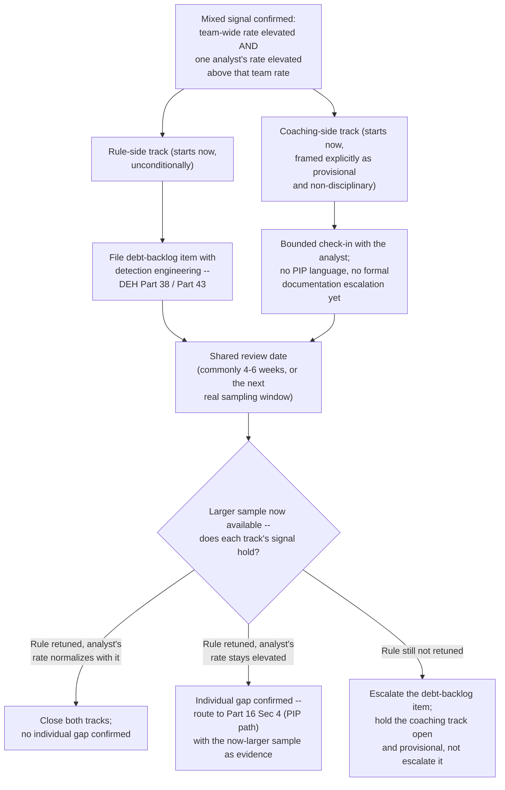

# Part 25 — Risk Acceptance & Manager Decision-Making Under Uncertainty

## Why this part exists

**[CONCEPT]** Most of this book gives a manager a model that resolves a decision if it's run correctly: Part 5's headcount arithmetic, Part 9's decomposition of a growing queue into a staffing branch or a detection-quality branch, Part 16's three-hypothesis check for a recurring miss. Run any of those honestly, on real data, and the ambiguity usually collapses into a clear answer. This part exists for the residual cases where it doesn't — where the data is too thin, too mixed, or too slow to arrive before a decision has to be made anyway, and a manager is left holding a call with no clean model behind it. Three specific calls recur often enough to organize this part around: whether to accept a known risk at the SOC-manager level or send it up to the CISO or the board, what to do when a persistent miss won't sort cleanly into "fire the rule" or "coach the analyst," and how to make a defensible resourcing tradeoff when headcount is fixed and the queue keeps growing anyway. Every case study in this part is deliberately one where the right answer was genuinely unclear at the time it had to be made — not a diagnostic problem in disguise, and not a case where the manager was careless and a clean model would have caught it.

**[CONCEPT]** This part does not re-run any of the diagnostics that already exist elsewhere in this book or its companion volumes, and it's worth being exact about the boundary before anything else, because this is the part of the book most likely to drift into re-explaining material another chapter already owns. It does not re-decompose a growing queue into a staffing gap versus a detection-quality problem — Part 9 — Queue Health & Workload Management already builds that decomposition and explicitly hands off the cases where it doesn't resolve cleanly to this part's §4. It does not re-run the three-hypothesis check for a recurring miss — Part 16 — Performance Management & Coaching already builds skill-gap-versus-training-gap-versus-broken-process as a decision tree, and hands off the cases where that check stays genuinely unresolved to this part's §3. It does not teach how to tune a noisy detection rule or score a backlog of untuned rules as organizational debt — Detection Engineering Handbook V2, Part 38 — False Positive Engineering and Part 43 — Detection Debt own both, and this part cites them rather than re-deriving either. And it does not score how severe any single alert is — SOC Playbook Handbook, Part 29 — Playbook Severity Model owns that, at the level of one ticket; this part's risk classification in §2 operates one level up, at the level of a standing decision about an accepted gap, not a single alert's score.

**[CONCEPT]** What's left, once those boundaries are drawn, is the actual judgment call: what a manager does once the cheapest, fastest diagnostic test has already been run and the answer still isn't clean. That's a different skill than running the diagnostic well, and it's the skill this part is built to teach.

## 1. Why this chapter is different: judgment calls a checklist can't finish

**[CONCEPT]** A diagnostic works when the signal is strong enough to separate competing explanations cleanly. Part 9's decomposition works when a queue's growth concentrates in one or two rules with an obviously abnormal false-positive rate, or spreads broadly enough that no single rule dominates — either result points somewhere specific. Part 16's three-hypothesis check works when a rule's team-wide error rate is either clearly at baseline (pointing at the individual) or clearly elevated for everyone who touches it (pointing at the rule). Both diagnostics fail quietly, not loudly, when the underlying signal doesn't cooperate: a sample too small to trust, a rule that's moderately noisy for everyone and additionally worse for one specific analyst, a queue that's growing for reasons that trace to a real capacity gap the organization has no near-term ability to fund. None of those are diagnostic failures in the sense of a broken model — they're cases where a correctly run diagnostic returns "both, partially, with real uncertainty remaining" instead of a clean branch.

**[SENIOR MANAGER]** It's worth naming the difference between two things that feel identical in the moment but call for opposite responses. The first is decision paralysis dressed up as diligence: a manager who could get a clean answer by waiting two more weeks for a larger sample, or by running a query that already exists but hasn't been pulled yet, and instead treats the ambiguity as permanent because acting now is uncomfortable. The second is genuine irreducible ambiguity: the data that would resolve the question doesn't exist yet at any price the situation can afford, or won't exist until well after a decision has to be made regardless. The first case has a cheap fix — go get the data, per Part 9's and Part 16's own diagnostics — and treating it as this chapter's territory is itself a mistake worth catching early. The second case is what this part actually addresses, and the table below is the fast check for telling them apart before assuming either.

The table below is a working filter — run it before treating any specific decision as this part's territory rather than a diagnostic that just hasn't been run yet.

| Signal | Decision paralysis (a diagnostic that hasn't been run) | Genuine irreducible ambiguity (this part's territory) |
|---|---|---|
| The missing evidence | Exists somewhere already — a query away, a report someone already has | Doesn't exist yet at any price this decision can afford, or won't exist for longer than the decision can wait |
| Time to resolve | Days, if someone just runs the check | Weeks to quarters, or never, if the underlying signal is genuinely this noisy |
| What waiting costs | Nothing beyond mild discomfort — the answer is sitting there | A real, accruing cost — an aging queue, a live risk, a person sitting under an unresolved cloud |
| The honest fix | Run Part 9's decomposition or Part 16's three-hypothesis check properly, then decide | Make the best defensible call now, with an explicit review trigger — §5 builds this discipline |

> **Blind Spot**
> A manager under real time pressure can mistake the second row for the first in either direction — either treating a genuinely thin, irreducible signal as if one more query would resolve it (and delaying a decision that's actually ready to be made), or treating a diagnostic that was simply never run as if it were this chapter's territory (and skipping a cheap check that would have resolved things cleanly). The check above only works if it's applied honestly before the decision, not used after the fact to justify whichever choice already felt easier.

## 2. Risk acceptance: whose signature actually belongs on this

### 2.1 The dimensions that decide who signs

**[SENIOR MANAGER]** Part 1 — SOC Manager Foundations & the Series Map previews the shape of a risk-acceptance call and the escalation path it follows as scope and reversibility grow, without building the mechanics — that's this section's job. A risk-acceptance decision is not a severity score. SOC Playbook Handbook, Part 29 — Playbook Severity Model scores how bad a single alert is if it turns out to be real; a risk-acceptance call is a standing decision about a known, ongoing gap — a coverage hole, an unpatched system running longer than policy allows, a vendor's SLA shortfall — that doesn't resolve when one ticket closes, and stays open until someone with the authority to do so either fixes it, accepts it explicitly, or escalates it to someone whose authority is bigger than theirs.

**[SENIOR MANAGER]** Four dimensions decide, in practice, whether a specific risk belongs at the SOC-manager's own level or needs to go up: how big the exposure is in dollar terms if it materializes; how reversible the situation is once it does (can it be undone within days, or does it become a permanent fact, like a data exposure that's already happened); how bounded the blast radius actually is, not just how bounded it looks on a network diagram; and whether the acceptance is a one-time, short-lived call or a standing policy the organization will be living with for months. None of the four is sufficient alone — a small-dollar risk with an unbounded, unpredictable blast radius can outrank a large-dollar risk that's cleanly contained, and a manager who scores only the dollar figure will systematically under-escalate the second kind.

### 2.2 A risk-acceptance scorecard

**[SENIOR MANAGER]** The table below is a working scorecard for sorting a specific risk-acceptance decision toward the right owner before it gets accepted, delayed, or escalated by default — use it at the moment a known gap is first identified, not months into living with it.

**Table 25.1 — Risk-acceptance scorecard.** Run a specific, real risk against all four rows before deciding who signs off on accepting it; a risk that lands in the right-hand column on any single row is a strong candidate for escalation even if the other three rows look manager-level.

| Dimension | Manager-level signal | Board/CISO-level signal |
|---|---|---|
| Dollar exposure if it materializes | Below the organization's own defined manager-authority threshold (a specific number set in advance, not judged case by case) | At or above that threshold, or genuinely unknown and unbounded |
| Reversibility | Contained and correctable within the current budget cycle if it goes wrong | Permanent or slow to correct — a data exposure, a regulatory finding, a client contract breach |
| Blast radius, validated not assumed | Confirmed bounded by an active, currently verified compensating control | Assumed bounded by a control nobody has re-checked recently, or genuinely broad |
| Duration and standing nature | A short, named window with a scheduled end (a migration, a vendor fix already in flight) | An indefinite acceptance with no real end date, or a repeat of a risk already accepted before |

**[EXECUTIVE]** The third row is the one most manager-level risk-acceptance decisions get wrong not at the moment of the decision but months later, and §2.4 covers exactly that failure mode in the context of a real case. A compensating control that was genuinely verified and bounded on the day a risk was accepted doesn't stay that way automatically — it stays that way only if something checks it again, on a schedule, independent of whether the original risk-acceptance decision ever gets revisited.

### 2.3 Worked example: the legacy file-cluster acceptance

**COMPOSITE CASE EXAMPLE — `CASE-2501`.** Constructed from recurring patterns in how mid-market organizations carry a legacy-system coverage gap through an extended decommission timeline; no single organization is identifiable, and all figures below are illustrative.

**[SENIOR MANAGER]** A 22-analyst in-house SOC at a mid-market insurer ran a legacy on-premises file-share cluster still hosting roughly 35% of policy-processing documents, originally scheduled for decommission in six months but delayed to 14 months by a vendor migration slip outside the SOC's control. The cluster's operating system was too old for the organization's standard EDR agent, leaving only network-level telemetry (NetFlow and firewall logs) and forwarded Windows Security event-log data — no process-level visibility, meaning staged ransomware activity or lateral movement on that specific cluster would not trip any of the SOC's primary host-based detections. Building an interim compensating capability — a temporary jump-box architecture with its own logging appliance — was estimated at $85,000 and roughly two months of engineering time, for an asset with 14 months of remaining life. A worst-case exposure estimate for a full compromise of the cluster, including regulatory notification and remediation cost, ran to roughly $1.2 million — a figure well above this organization's own manager-authority threshold, set at $250,000 for a bounded, correctable risk.

**[SENIOR MANAGER]** The manager accepted the risk at the SOC-manager level rather than escalating it, reasoning that the $1.2 million worst-case figure assumed no compensating control at all, and the cluster sat behind a network segmentation boundary that had been specifically verified — a firewall-rule review confirming only two narrow, named services could reach it from the rest of the environment — at the time the decision was made. Against that verified, bounded blast radius, the manager judged the realistic exposure closer to a contained incident than the unmitigated worst case, and treated the $85,000 acceleration cost as not worth spending on an asset with a defined, short remaining life. That call was defensible on the day it was made: it used Table 25.1's dimensions correctly, it named its own reasoning in writing, and it treated the segmentation boundary as the load-bearing fact rather than an assumption.

**[SENIOR MANAGER]** Six months into the 14-month window, a contractor's compromised laptop attempted to pivot toward the file-cluster's segment and was stopped cleanly by the segmentation boundary — on its face, validation that the manager-level acceptance had been the right call. The post-incident review surfaced a second fact that had nothing to do with the incident itself: two months after the original acceptance, a vendor-integration request had opened a new firewall exception into that same segment, approved through a routine change-control process that had no linkage back to the original risk-acceptance decision and no requirement to notify whoever owned it. The exception happened to be narrow enough that this particular incident's vector didn't use it. Nothing about the original decision was wrong — the dimensions were read correctly, the compensating control was real and verified at the time. What was missing was a mechanism that would have caught the fact that the control's own boundary had quietly moved two months into a 14-month acceptance window, independent of whether anything went wrong through it.

> **What Would Change My Mind**
> This section treats CASE-2501's outcome as evidence that a verified compensating control needs a standing re-check, not evidence that the original manager-level acceptance was itself the wrong call. If a rigorous review of similar cases found that firewall or segmentation exceptions opened after a risk acceptance rarely widened blast radius in practice — that the near-miss in CASE-2501 was a rare coincidence rather than a common pattern — that would weaken the case for a mandatory re-check cadence and argue for treating this as an acceptable, low-probability residual risk instead of a standing gap worth a recurring process.

### 2.4 The default-acceptance trap

**[SENIOR MANAGER]** Part 1 names the failure mode this section builds on directly: a risk that never gets formally accepted by anyone still gets accepted by default the moment nobody stops the process carrying it. CASE-2501 shows the same failure mode one layer deeper — a risk that *was* formally accepted, correctly, at the moment of acceptance, can still slide back into the same default-acceptance trap afterward if nothing checks whether the specific fact the acceptance depended on is still true. The signature on a risk-acceptance memo is a snapshot of a judgment made against a specific set of facts on a specific day; treating that signature as durable proof the risk remains correctly sized months or years later is the mistake, not the original signature itself.

**[EXECUTIVE]** The practical fix costs little relative to the exposure it protects: every risk accepted under Table 25.1's dimensions gets a named re-check date, not just a named owner, and the re-check specifically re-verifies the fact the acceptance depended on — the control's boundary, the exposure estimate, the remaining duration — rather than simply confirming the memo still exists on file. The risk-acceptance memo template (`TMPL-2501`), filed in Appendix A7 alongside Part 24's board-reporting material, carries a dedicated re-check-date field for exactly this reason; it does not, on its own, make anyone actually run the re-check on schedule, which is a standing-cadence discipline this section's §5.3 returns to rather than something a template field can enforce by itself.

## 3. When Part 16's diagnostic doesn't resolve cleanly

### 3.1 Where the three-hypothesis check stalls

**[SENIOR MANAGER]** Part 16 §3 builds a fast, cheap check for a recurring miss: compare the flagged analyst's error rate on a specific alert type against the team-wide baseline for that same alert type. A clearly elevated team-wide rate points at the rule; a rate at baseline for everyone except the flagged analyst points at the person. That check stalls in three specific, recurring ways, and naming them is what separates "the diagnostic hasn't been run yet" from "the diagnostic was run correctly and the signal is genuinely mixed."

**[SENIOR MANAGER]** The first stall is sample size: a low-volume alert type might give one analyst only a dozen or so sampled tickets in a quarter, which isn't enough to distinguish a real elevated error rate from ordinary noise with any real confidence. The second is a genuinely mixed signal: the rule's team-wide rate is elevated over the team's overall baseline — real evidence the rule deserves attention — while one specific analyst's rate is elevated again over that already-elevated team rate, meaning both explanations are true at once rather than one ruling out the other. The third is time pressure: the queue is bleeding SLA on this exact alert type today, and waiting for a full additional sampling cycle to get a cleaner read, the fix Part 9 and Part 16 both recommend when the data is thin, isn't available because the decision can't wait that long.

> **Cross-Book Pointer**
> This section does not cover how a detection's false-positive rate gets measured, tuned, or prioritized in a debt backlog once it's confirmed to need attention — that's Detection Engineering Handbook V2, Part 38 — False Positive Engineering for the tuning mechanics and Part 43 — Detection Debt for how a backlog of noisy, untuned rules gets tracked and prioritized as a standing liability. This part's job stops at recognizing that a mixed signal needs a decision now, not at doing the tuning work — file the rule to detection engineering regardless of how the individual-coaching question resolves, per §3.3 below.

### 3.2 Worked example: the genuinely-both case

**COMPOSITE CASE EXAMPLE — `CASE-2502`.** Constructed from recurring patterns across MSSP and in-house SOCs where a rule's own noise and one analyst's individual gap compound on the same alert type; no single organization is identifiable, and all figures below are illustrative.

**[SENIOR MANAGER]** A 14-analyst MSSP SOC's quarterly QA sample flagged a cloud-identity impossible-travel detection with a team-wide false-positive rate of 46% against a team baseline of 18% for other detections — clearly elevated, and squarely the kind of finding Part 16 §3.5 routes to detection engineering as its own item. It was also true, in the same sampling cycle, that one specific analyst with two years of tenure and a previously strong QA record showed a personal error rate of 64% on that same alert type, worked over 22 sampled tickets that quarter, against teammates whose rates on the identical rule ranged from 40% to 51% across sample sizes of 12 to 19 tickets each. Both facts were real at once: the rule genuinely deserved a tuning ticket, and this one analyst's rate sat meaningfully above every teammate working the identical noisy rule — evidence of a second, separate contribution stacked on top of the rule's own baseline noise, not proof that either explanation alone accounted for the gap.

> **Management Autopsy — "wait for a clean signal before touching the coaching question"**
>
> **The decision:** Rather than open any coaching conversation with the flagged analyst, the manager chose to wait for a second full quarterly sampling cycle, reasoning that a larger sample would separate the rule's contribution from the individual's more reliably than the current, smaller one could.
>
> **Why it seemed reasonable:** Part 16 §3.2 is explicit that a manager's instinct defaults to blaming the person, and that the process explanation should be checked first and taken seriously. Waiting for cleaner data before coaching someone whose numbers might be entirely explained by a broken rule looked like exactly the discipline that section recommends, not an avoidable delay.
>
> **How it failed:** The extra quarter cost three more months during which the same avoidable error recurred on live, high-severity tickets, not just the ambiguous ones the sample happened to catch. One of them was a real account-takeover attempt miscalled as a false positive, caught only 11 days later when the client's own fraud team flagged suspicious account activity independently — a genuine near-miss that cost roughly 40 hours of incident-response time at a blended $150 an hour, plus the reputational exposure of a client-side team catching what the SOC's own sampling had missed. When the rule was finally retuned three months on, the team's rates dropped in line with the new baseline — and the flagged analyst's rate stayed elevated at roughly 50%, confirming the second, individual contribution the manager had waited a full quarter to investigate at all.
>
> **The fix:** Detection debt and an individual coaching question are not mutually exclusive hypotheses that have to be resolved in sequence — file the rule to detection engineering's backlog immediately, regardless of how confident the individual read is, and open a bounded, explicitly non-disciplinary coaching cycle with the flagged analyst in parallel, with a shared review date once a larger sample exists to reassess both signals together. §3.3 builds this as a standing pattern rather than a one-off improvisation.

### 3.3 The dual-track holding pattern

**[SENIOR MANAGER]** The fix CASE-2502 arrived at late is reusable earlier, as a default response the moment a signal reads as genuinely mixed rather than waiting for it to resolve into one clean branch. Running both tracks costs little relative to the cost of running neither, and the two tracks don't compete for the same resource or the same person's attention.

**[SENIOR MANAGER]** The rule-side track starts immediately and unconditionally: file a debt-backlog item with detection engineering the moment the team-wide rate reads elevated, independent of whatever the individual signal eventually shows. A tuning fix that turns out to have been unnecessary once the individual explanation resolves costs a small amount of wasted engineering triage time; a tuning fix that never gets filed because the individual question was still open costs however long that rule keeps producing the same miscalls in whoever works it next. The coaching-side track opens in parallel, not after, but explicitly framed to the analyst as provisional and non-disciplinary — this is not a Performance Improvement Plan, it's a bounded check-in specifically because the rule is already known to be part of the picture, with a stated shared review date (commonly four to six weeks, or whatever the next reasonable sampling window actually is) at which both tracks get reassessed together against a larger sample.

**Figure 25.1 — The dual-track holding pattern for a genuinely mixed diagnostic signal.** *CONCEPTUAL.* Illustrates the parallel-track sequence described above — a rule-side debt filing that starts unconditionally and a coaching-side track that opens provisionally, both converging on a shared review date rather than being sequenced one after the other. It is a process diagram of the decision pattern, not a capture of any specific case-management tool's workflow. `FIG-2501`.





> **Figure 25.1 — The dual-track holding pattern for a genuinely mixed diagnostic signal.** *CONCEPTUAL.* Shows the dual-track sequence above as a rendered flowchart. It supports this section's claim that the rule-side and coaching-side tracks should run in parallel rather than in sequence, and gives the shared review date in CASE-2502's fix a concrete decision point to resolve against once a larger sample exists. `FIG-2501`.

> **What Would Change My Mind**
> This section recommends running the rule-side and coaching-side tracks in parallel by default whenever a signal reads as genuinely mixed, rather than sequencing detection engineering's fix first and coaching second. If analysts in a specific team culture routinely reported that a parallel, explicitly non-disciplinary coaching track still felt indistinguishable from a PIP regardless of how it was framed — that the framing failed to land, not just occasionally but as a consistent pattern — that would undercut the parallel-tracks recommendation for that team specifically, and sequencing (rule fix first, coaching only once the rule's contribution is fully known) would be the more defensible default there instead.

## 4. Resourcing tradeoffs when headcount is fixed and the queue keeps growing

### 4.1 What "fixed headcount" actually means on a manager's calendar

**[SENIOR MANAGER]** Part 9 §3.5 covers the case where a queue's growth is genuinely both a detection-quality problem and a real underlying capacity gap, and hands off a specific question to this part: a resourcing decision made under exactly that kind of ambiguity, when the honest answer is "we don't fully know yet and the queue is breaching SLA today." This section covers a related but distinct case, where the diagnosis itself has already resolved cleanly — Part 9's decomposition confirms a genuine, broad-based capacity gap, not a rule problem — and the ambiguity sits entirely on the resourcing side: the organization has a hiring freeze, a budget cycle that won't reopen for months, or a headcount ceiling set by a decision several layers above the SOC manager, and none of that changes what the queue is actually doing in the meantime.

**[SENIOR MANAGER]** This is a genuinely different kind of uncertainty than §3's mixed diagnostic signal. Nothing about the underlying cause is unclear here — the model in Part 5 and the decomposition in Part 9 both point the same direction. What's unclear is which of several imperfect options is the least-bad way to absorb a confirmed gap for as long as the organizational constraint holds, and reasonable managers looking at the same numbers can defensibly pick different options.

### 4.2 A tradeoff menu, and what each option actually costs

**[SENIOR MANAGER]** The table below compares the standing options for absorbing a confirmed capacity gap when the headcount lever itself is unavailable — not a menu of equally good choices, but a working comparison of what each one buys, what it quietly costs, and the condition that makes it defensible rather than just convenient.

**Table 25.2 — Resourcing-tradeoff options when headcount is frozen.** Use this table once Part 9's decomposition has already confirmed a genuine capacity gap; it does not apply to a detection-quality problem wearing a staffing shortfall's clothing, which Part 9 §3 should have already ruled out before this table is relevant.

| Option | What it buys | What it actually costs | Defensible when... |
|---|---|---|---|
| Reduce QA sampling rate, freeing reviewer hours for direct triage | Immediate capacity, no new spend | Slower detection of a real quality regression — Part 15's pattern-threshold math simply takes longer to accumulate at a lower sample rate | A hard floor per alert type keeps any single detection from going fully dark, and there's an explicit trigger to restore the rate once the constraint lifts |
| Temporarily relax the SLA target for the lowest severities | Breathing room without touching anyone's actual workload | Aged low-severity backlog can mask an early-stage signal that only looks low-severity in isolation, per Part 9 §1's warning about severity-sorted views | The aging distribution is still tracked and reported even while the target itself is relaxed, not quietly stopped watching |
| Reallocate training and coaching time to direct queue work | Immediate capacity, no new spend | Ramp curves slow and skill development stalls — Part 11 and Part 12's territory, with a lagged cost that shows up later, not now | The reallocation is short (weeks, not a standing policy) and reversed the moment volume normalizes |
| Fund temporary contractor or MSSP overflow from a non-headcount budget line | Capacity without touching the frozen headcount line at all | Usually a higher per-unit cost, real ramp-up drag on a short engagement, and a risk of quietly becoming a permanent workaround that masks the headcount case that should be reopened at the next budget cycle | A burst-capacity contract clause already exists (Part 22) and everyone involved treats it as explicitly temporary, not a substitute for the requisition |
| Let backlog age and SLA breaches accumulate as the visible, honest signal | No immediate cost or reallocation at all | Real, accruing risk sitting in the queue, and a real customer or regulatory consequence if a breach lands on the wrong ticket | The breach pattern is actively tracked and reported upward (Part 24) as the evidence for reopening headcount, not silently absorbed without anyone above the SOC manager seeing it |

> **Operational Reality**
> A budget cycle and a queue do not run on the same clock, and a headcount freeze doesn't pause the arrival rate while it's in effect. The gap between "the org can't fund this until next quarter" and "the queue needs this today" is exactly the space every row in Table 25.2 lives in — none of the five options actually closes the gap Part 5's model says exists; each one is a different way of deciding which specific cost the organization absorbs while it waits for the lever it actually needs.

### 4.3 Worked example: cutting QA sampling to save the queue

**COMPOSITE CASE EXAMPLE — `CASE-2503`.** Constructed from recurring patterns in how a fixed-headcount SOC absorbs a confirmed, unfunded capacity gap; no single organization is identifiable, and all figures below are illustrative.

**[SENIOR MANAGER]** A 12-analyst in-house SOC at a health-tech company saw arrival rate rise 15% over two quarters, broad-based across dozens of alert types with no single rule concentrating the increase — Part 9's decomposition ruled out a detection-quality explanation cleanly, confirming a genuine capacity gap. A company-wide hiring freeze, unrelated to the strength of the SOC's own headcount case, meant the requisition Part 5's model would have justified had no path to approval for at least two quarters.

```text
CONCEPTUAL SAMPLE -- illustrative arithmetic, not sourced benchmark data

Baseline ticket volume:           ~2,400 tickets/month
QA sample rate before the cut:    6% (~144 reviewed tickets/month), low/medium severity
QA sample rate after the cut:     3% (~72 reviewed tickets/month), low/medium severity only
                                   (High/Critical sampling held at 100%, untouched)
Reviewer time freed:              ~72 fewer reviews x 20 min/review = ~1,440 minutes
                                   = ~24 reviewer-hours/month reallocated to direct triage
```

**[SENIOR MANAGER]** The manager picked a blend from Table 25.2: cutting the QA sample rate on low- and medium-severity tickets from 6% to 3%, freeing roughly 24 reviewer-hours a month for direct queue work, while holding High/Critical sampling at 100% specifically because that's where a missed error costs the most. The reasoning at the time was defensible — the cut fell only on the tail the organization could most afford to see less of, not on the highest-consequence tickets.

> **Management Autopsy — "cut the QA sample rate, not the SLA target"**
>
> **The decision:** Reduce QA sampling on low/medium-severity tickets from 6% to 3%, reallocating the freed reviewer time to direct triage, while leaving High/Critical sampling untouched.
>
> **Why it seemed reasonable:** Of every option on Table 25.2, this one appeared to concentrate its cost on the lowest-consequence slice of the queue, protected the highest-severity tickets completely, and required no new spend during a freeze that made new spend impossible anyway.
>
> **How it failed:** A real, under-tuned but medium-classified detection was already producing a quiet quality regression before the cut. At the 6% rate, Part 16 §2.2's pattern threshold of three flags in a rolling window would likely have been crossed in roughly four to five weeks; at the 3% rate, the smaller sample took an estimated 11 weeks to accumulate the same three flags. The regression itself wasn't caused by the sampling cut — but the cut genuinely widened the detection window on exactly the kind of finding QA sampling exists to catch. No controlled counterfactual exists to prove the alternative would have gone better: it's equally plausible that without the reallocated hours, the queue itself would have missed something directly through sheer backlog aging. What's true either way is that this specific downside — slower QA detection latency — is the one that materialized, and the manager can defend the decision's process without being able to claim the outcome was risk-free.
>
> **The fix:** Rather than treating the delayed detection as proof the sampling cut was wrong, the manager added a floor beneath it — a minimum sample size per alert type per month, regardless of the overall rate, so no single detection can go fully dark under the reduced rate — and set an explicit trigger to restore full sampling the moment the freeze lifted or headcount arrived. The cut became a named, time-boxed acceptance of a specific risk (slower QA detection latency on the low/medium tail) rather than a silent, indefinite policy change nobody had agreed to in those terms.

## 5. A decision discipline for calls that stay genuinely unclear

### 5.1 Four questions before the decision, not after

**[SENIOR MANAGER]** Part 1 §3.3 builds a three-question check for auditing a staffing or incentive *model* before trusting it with a decision. This section's job is narrower and comes later: not auditing a model in advance, but making a live, uncertain call — a risk acceptance, a dual-track holding pattern, a resourcing tradeoff — in the moment, when no more model-building is going to remove the remaining uncertainty before the decision has to be made. Four questions, asked at the moment of the decision rather than reconstructed afterward, do most of the work.

1. **What is the smallest, most reversible version of this decision available right now?** CASE-2503's manager chose a cut with a built-in floor and an explicit restore trigger rather than an open-ended policy change — the same underlying tradeoff, made reversible by design rather than by luck.
2. **What specific, checkable evidence would resolve the ambiguity, and by when can it realistically arrive?** This is the question that separates §1's two rows — if the honest answer is "a query away, this week," the decision isn't ready to be made yet; if the honest answer is "not for a full sampling cycle, and the queue can't wait that long," the decision belongs in this part's territory.
3. **Has the reasoning been written down now, not reconstructed later?** CASE-2501's manager could show, months after the fact, exactly what Table 25.1 dimensions the original acceptance had weighed and why — which is precisely what let the post-incident review separate "the original call was reasonable" from "something changed afterward that nobody caught," instead of collapsing both into a single verdict on the decision itself.
4. **Who reviews this on a calendar date, regardless of outcome — not "if it becomes a problem"?** CASE-2501's near-miss traces directly to the absence of this question at the moment of acceptance; §5.3 builds the standing version of this discipline rather than leaving it to each individual decision to remember on its own.

### 5.2 Separating decision quality from outcome luck

**[SENIOR MANAGER]** CASE-2501 and CASE-2503 share a structure worth naming directly: in both, the decision was reasonable and documented against what was knowable at the time, and the outcome still carried a real downside that the manager couldn't have fully prevented without spending resources the situation didn't justify spending. Grading either decision by its outcome alone — "the segmentation nearly failed to hold, so the original acceptance was wrong" or "QA missed something for eleven weeks, so the sampling cut was wrong" — collapses two separate questions into one and produces the wrong lesson both times. The question that should drive whether a manager repeats a decision next time isn't "did this specific instance turn out fine," it's "was this the best call available given what was actually knowable at the time, and does the same call still look right applying the same standard today."

**[SENIOR MANAGER]** That distinction cuts in a direction managers under pressure to look decisive often resist: a bad outcome from a genuinely good decision doesn't automatically indict the decision, and a good outcome from a genuinely reckless decision doesn't retroactively vindicate it. What a bad outcome should always do is update the standing process around the decision — the re-check cadence in §2.4, the dual-track default in §3.3, the sampling floor in §4.3 — even when the original call itself holds up under review. Confusing "the decision was sound" with "nothing needs to change" is its own failure mode, distinct from blaming a sound decision for an outcome it couldn't fully control.

> **Manager's Note**
> When a risk-acceptance call goes wrong, resist writing the post-incident narrative around whoever signed the original memo. Write it around what changed between the day of the signature and the day it mattered, and whether anything was watching for that change. In most cases with CASE-2501's shape, the honest answer isn't "the wrong person accepted this" — it's "nobody was still checking."

### 5.3 Reviewing accepted risk on a cadence

**[EXECUTIVE]** A single accepted risk with a named re-check date is a good decision. A standing register of every currently accepted risk, reviewed together on a fixed cadence rather than only when an individual memo's own date happens to come up, is what actually catches the CASE-2501 pattern before a near-miss does it instead. A quarterly pass through the open risk-acceptance register — every item still open, its original Table 25.1 dimensions, and whether the specific fact it depended on is still true — belongs on the same reporting cycle Part 24 — Executive & Board Reporting already uses for material operational changes, not as a separate, easily skipped exercise nobody's calendar protects.

**[EXECUTIVE]** The material outcome of that quarterly pass is usually short: most accepted risks are still exactly what they were when accepted, and confirming that costs little. The value is in the exceptions the pass catches — a compensating control that's quietly changed, a "temporary" resourcing tradeoff from §4 that's drifted past its own restore trigger with nobody noticing, a risk whose dollar-exposure estimate is stale because the underlying system's footprint grew. None of those exceptions are dramatic on the day they're caught. Each one is exactly the kind of fact CASE-2501's near-miss shows going unwatched for months at a time when nothing forces a review.

## 6. Where this goes next

**[CONCEPT]** This part picked up three specific handoffs — Part 1's risk-acceptance shape, Part 9's diagnosed-but-unresourceable capacity gap, and Part 16's genuinely mixed diagnostic signal — and built the discipline each one needed once its own model or decomposition had done everything a model can do. None of the three cases in this part resolve into a formula the way Part 5's headcount arithmetic or Part 15's sampling math do, and that's the honest point of the chapter: some of a SOC manager's real decisions never get a formula, and pretending otherwise produces false confidence rather than a better decision. What does transfer from case to case is the discipline in §5 — bias toward the reversible option, name what evidence would resolve the ambiguity and by when, write the reasoning down now, and put a real date on the calendar to check again regardless of how things look today. Nothing past this point in the book should treat "the diagnostic didn't fully resolve" as a dead end; it's the exact moment this part's discipline is built to take over.

---

## Cross-references

**Within this book:** Part 1 — SOC Manager Foundations & the Series Map (the risk-acceptance escalation shape this part's §2 builds out into a full scorecard); Part 5 — Headcount & Capacity Modeling (the fixed-headcount constraint §4's tradeoff menu operates against); Part 9 — Queue Health & Workload Management (the queue-growth decomposition that hands off both the genuinely-both case and the resourced-but-unresourceable case to this part's §4); Part 15 — Quality Assurance Programs (the sampling math §4.3's tradeoff and CASE-2503's floor are built on); Part 16 — Performance Management & Coaching (the three-hypothesis diagnostic this part's §3 picks up once it stalls, and the pattern-threshold math CASE-2502 and CASE-2503 both reference); Part 18 — Attrition & Retention (the cost of a coaching track that goes on too long without resolving, relevant to §3.3's dual-track framing); Part 20 — Building & Defending the SOC Budget (the budget-cycle constraint behind §4's frozen-headcount scenario); Part 22 — MSSP & Managed-Service Contract Management (the burst-capacity contract clause Table 25.2's contractor-overflow row depends on already existing); Part 24 — Executive & Board Reporting (the reporting cadence §2.4 and §5.3's standing risk-register review rides on); Appendix A7 — Executive, Board & Risk-Acceptance Templates (the risk-acceptance memo template, `TMPL-2501`, this part's §2.4 assumes as the durable record of a decision made under this chapter's discipline).

**SOC Playbook Handbook:** Part 29 — Playbook Severity Model, for the per-alert severity score this part's decision-level risk classification in §2.1 sits one level above and does not redefine.

**Detection Engineering Handbook V2:** Part 38 — False Positive Engineering, for the tuning mechanics behind the rule-side track in §3.3's dual-track holding pattern; Part 43 — Detection Debt, for how a confirmed noisy rule gets tracked and prioritized as a standing backlog item once §3's diagnostic points that direction, independent of whatever the individual coaching question resolves to.
