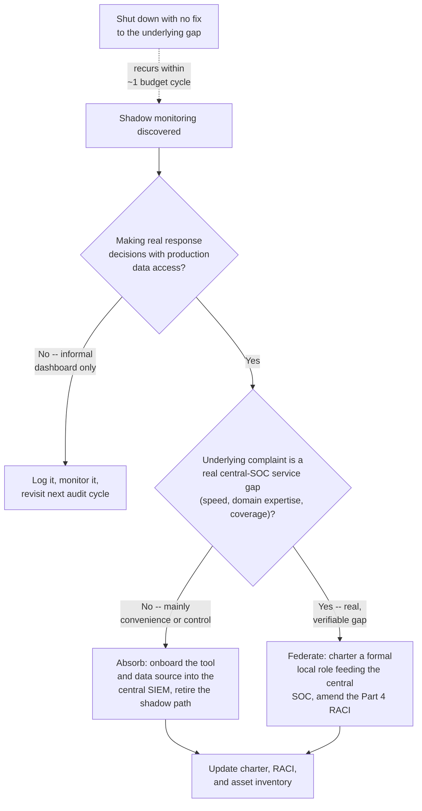

# Part 26 — Cross-Team Politics & Stakeholder Alignment

## Why this part exists

**[CONCEPT]** Part 4 — Organizational Placement & Charter built the charter and the standing RACI: a written answer, signed by every named party, to who is Responsible, Accountable, Consulted, and Informed across the handful of activities where the SOC's work and another team's work meet. That document is necessary and not sufficient. A RACI cell that names IT operations as Responsible and Accountable for patching doesn't make an infrastructure director's Friday change freeze disappear the week a critical finding needs a Tuesday patch. A charter clause naming AppSec as a consulted party on a production code vulnerability doesn't stop AppSec from treating the finding as the SOC's problem because it surfaced in a SOC-owned alert queue instead of AppSec's own scanner output. The signed agreement is the starting position in a negotiation that recurs, in some form, most weeks the SOC operates — not a settled question that stops being asked once the ink is dry.

This part covers the eight standing counterpart relationships named in this book's scope — IT operations, engineering, legal, privacy, physical security, and three internal security sub-teams (AppSec, identity and access management, and vulnerability management) that outsiders, and sometimes a new SOC manager, assume share the SOC's incentives simply because they share the word "security" — plus the three friction points that recur across all eight regardless of which specific counterpart is involved: who owns remediation once a finding is confirmed, who gets paged first when an incident spans more than one team's territory, and whose tooling or scoring system wins when two teams disagree about the same finding. It closes with the "shadow SOC" problem: what happens when a frustrated business unit stops waiting for any of this to work and quietly builds its own monitoring instead.

This part does not re-derive the charter or RACI mechanics themselves — that groundwork is Part 4's, and every relationship below assumes it already exists or is actively being built. It does not cover the legal and HR procedural mechanics that follow once a finding is confirmed to need legal or disciplinary handling — evidence preservation, subpoena response, termination documentation — which is Part 27 — Legal, HR & Compliance Interfaces's job; this part covers the standing relationship and the recurring political friction with those two functions, not the procedure that runs once a specific finding triggers them. It does not cover the ticket-level mechanics of a good hand-off between any two parties, which is SOC Playbook Handbook, Part 27 — Escalation Quality's job regardless of which teams are handing off to each other, and it does not referee which team's detection logic is technically more accurate — that is a question of evidence, not politics, and belongs wherever the specific technical claim is made.

## 1. Eight standing relationships, not one

### 1.1 Why a uniform instinct fails

**[CONCEPT]** The RACI treats every counterpart relationship as the same shape: a table row, a letter, a name. In practice, each of the eight counterparts below optimizes for something structurally different, and a manager who applies one uniform "stakeholder management" instinct across all eight will misjudge most of them. IT operations is measured on uptime and change stability. Engineering is measured on shipping velocity. Legal is measured on liability and privilege exposure avoided, not tickets closed. Privacy is measured on regulatory exposure and data-minimization discipline. Physical security frequently reports through an entirely separate chain — facilities or corporate security — with its own incident-classification vocabulary and almost no shared tooling with the SOC. AppSec, IAM, and vulnerability management usually report through the same CISO as the SOC and still generate real friction, because their mandates overlap with the SOC's instead of sitting cleanly outside it. The lever that works on one counterpart — naming a missed SLA in a report IT operations' own director reads — does nothing to a legal team whose performance metric has nothing to do with SLAs at all.

### 1.2 IT operations

**[SENIOR MANAGER]** IT operations usually owns actual remediation execution — Part 4's standing RACI names IT operations Responsible and Accountable for patching and root-cause remediation, and the Management Autopsy in that part's §2 shows exactly what happens when the escalation path for a missed SLA loops back through the same director who owns the change calendar. The everyday version of that friction is smaller and constant: an infrastructure team asking for "one more change window" before applying a fix, individually reasonable each time, cumulatively how a 5-day SLA on a critical finding becomes a 6-week backlog with nobody able to point to the single decision that let it happen. Paging follows a similar split: IT operations reasonably expects to be paged first for anything framed as an availability problem, because they own the infrastructure; the SOC needs to be paged first for anything with a live compromise indicator, regardless of whose infrastructure it's running on. The recurring dispute is the ambiguous middle case — a server that's both down and possibly compromised — and it's worth a written trigger rather than a judgment call made fresh every time: any finding carrying an active-compromise indicator pages the SOC first, full stop; everything else follows ownership as the RACI already states it.

### 1.3 Engineering

**[SENIOR MANAGER]** The friction with engineering has the same shape as IT operations — a counterpart optimizing for a metric (ship velocity) that a SOC finding directly threatens — but the SOC's actual leverage is usually weaker, because engineering guards deploy pipelines and production code access far more tightly than IT operations guards a server fleet. A SOC that can't get read access to an application's own logging can't make its case with evidence; it can only assert a concern and hope engineering agrees to look. That access gap is why AppSec functions, in most organizations, as the real day-to-day interface between the SOC and engineering (§1.7) rather than the SOC negotiating directly — a fact worth naming explicitly, because a SOC manager who tries to build a direct relationship with an engineering VP while ignoring AppSec is duplicating a channel that already exists and undermining the one team positioned to broker the technical conversation.

### 1.4 Legal

**[SENIOR MANAGER]** The standing tension with legal is speed against privilege. Legal's institutional habit is to control who talks, what gets written down, and when, because a poorly worded ticket note or an internal message thread can become discoverable evidence in litigation. The SOC's institutional habit is to document everything immediately and share it broadly, so the next shift or a different analyst can pick up an investigation without a briefing. Those two habits are in direct tension on any case that could plausibly end up regulated or litigated — not only the ones that obviously will, because the ones that obviously will are rarely the ones that catch anyone off guard. The standing mechanism worth building before any of this is tested for real: a charter-documented trigger list (Part 4 §5.2's scope-boundary table is the right home for it) naming which finding categories generate an automatic, low-friction heads-up to legal within 1 hour, even before disposition is complete — so the first time legal hears about a case in progress isn't a surprise phone call 40 hours in. What legal actually does once looped in — evidence holds, outside counsel, notification timing — is Part 27's territory, not this one's.

### 1.5 Privacy

**[SENIOR MANAGER]** The friction with privacy is about monitoring scope. The SOC's job pushes toward seeing as much as possible — insider-threat indicators, data-loss-prevention signals, behavioral baselining across users. Privacy's job pushes toward making sure that visibility is proportionate, documented, and legally defensible, which varies sharply by jurisdiction — a works-council consultation requirement in one region has no equivalent in a more permissive at-will-monitoring jurisdiction, and a SOC operating across both needs privacy's read on which rules apply where far more than it needs privacy's permission in the abstract. The recurring dispute is a timing mismatch: the SOC wants a new telemetry source — full email content indexing, expanded endpoint monitoring — live now, because a specific investigation needs it; privacy wants a data-protection impact assessment first, which takes weeks, not hours. The fix isn't skipping the assessment under pressure; it's pre-negotiating the common categories of monitoring in the charter's scope section so most requests match an already-approved category, leaving the slower conversation for genuinely novel data sources rather than for every request. Where a monitoring finding turns into an insider-threat case requiring HR involvement, that hand-off is Part 27's procedure to run, not this section's.

### 1.6 Physical security

**[SENIOR MANAGER]** Physical security is the counterpart most likely to go a full year with almost no interaction with the SOC, because it frequently reports through a completely different chain — facilities or corporate security, sometimes a function staffed by former law enforcement with its own incident taxonomy — sharing no tooling and often no common manager below the executive layer. Part 4's RACI already draws the ownership boundary cleanly: physical security dispatches and manages the facility response, the SOC correlates digital signals against it when both exist. The actual friction isn't over who owns what; it's that nobody notices the other domain has a related event at all. A badge-cloning attempt correlated against an anomalous VPN logon from a geographically implausible location is only catchable if someone is looking at both streams together, and in most organizations nobody owns that correlation as a standing job. The fix is a short, jointly agreed trigger list — failed-badge-attempt bursts, after-hours badge use on a terminated employee's still-active credential — that routes automatically to both teams, rather than depending on either team remembering the other's alert stream exists.

### 1.7 The adjacent security sub-teams: AppSec, IAM, and vulnerability management

**[SENIOR MANAGER]** The least obvious friction is often the sharpest, because these three sub-teams share a reporting chain and a mission statement with the SOC and still optimize for different, sometimes conflicting, local metrics. AppSec's KPI is typically secure-development-lifecycle coverage — findings caught before code ships. The friction case: a production runtime detection that's really evidence AppSec's pre-release scanning missed something, and a live dispute over whose miss that counts as, fought out in a retrospective instead of settled by a standing rule. IAM's KPI is typically a provisioning and access-review SLA, and the friction case is authority during an active investigation: does the SOC have unilateral authority to kill a suspicious active session, or must IAM execute every revocation through its own change process — a distinction that can add several minutes to a containment action during exactly the window when minutes matter most. Vulnerability management's KPI is typically patch-cycle throughput against a CVSS-driven backlog, and the friction case is the sharpest of the three: whose severity number is authoritative when the SOC's threat-intel-informed context and vulnerability management's CVSS baseline disagree about the same finding. §2.3 covers that dispute directly, with a worked case.

### 1.8 The standing-relationship matrix

**[SENIOR MANAGER]** The table below is a starting reference for where each of the eight relationships typically breaks and what standing mechanism actually resolves it, built to be reviewed and corrected against a specific organization's real behavior rather than adopted as written.

| Counterpart | Primary Friction Point | Who Typically Owns Remediation | Recurring Dispute Trigger | Standing Mechanism |
|---|---|---|---|---|
| IT operations | Change-freeze delay vs. SLA | IT operations | "One more window" requests, ambiguous down-or-compromised cases | Written trigger: compromise indicator pages SOC first, else ownership as RACI states |
| Engineering | Telemetry/production access | Engineering | SOC can't evidence a finding without access engineering controls | AppSec brokers the technical conversation (§1.3, §1.7) |
| Legal | Speed vs. privilege | Legal (once looped in) | Case escalates before legal is aware | Charter-documented 1-hour heads-up trigger list (§1.4) |
| Privacy | Monitoring scope vs. proportionality | Privacy (approval), SOC (execution) | New telemetry needed faster than a fresh assessment allows | Pre-approved monitoring categories in the charter's scope section |
| Physical security | Nobody correlates the two domains | Physical security (facility response) | Badge/network correlation nobody owns as a job | Joint trigger list routed to both teams automatically |
| AppSec | Whose "miss" a runtime finding represents | AppSec (pre-prod), SOC (runtime) | Retrospective blame dispute after a production finding | Named ownership split by lifecycle stage, not by team identity |
| IAM | Authority to revoke mid-investigation | IAM (execution) | Minutes lost during active containment | SOC given a defined, limited kill-switch authority for active incidents |
| Vulnerability management | Whose severity score is authoritative | Vulnerability management (backlog) | CVSS baseline vs. contextual threat-intel severity disagree | Split authority: baseline for the general backlog, SOC override with corroborating evidence (§2.3) |

> **Manager's Note**
> Walk this table with each counterpart at least once a year and ask them, out loud, whether the "who typically owns remediation" column matches their own understanding — not whether they agree with it, just whether it matches what they'd have said unprompted. A gap between what the SOC believes the standing mechanism is and what the counterpart believes it is will surface here, cheaply, instead of during a live dispute where neither side has time to discover they were never aligned.

## 2. Three friction points that recur across every counterpart

### 2.1 Who owns remediation

**[SENIOR MANAGER]** Part 4's RACI settles ownership on paper. The live dispute is rarely about ownership at all — it's about whether the accountable party agrees the finding is real or urgent enough to act on now, which is a different question the RACI cell doesn't answer by itself. A team that doesn't want to prioritize a fix will usually argue the finding is wrong, overstated, or already mitigated some other way, rather than argue priority directly — because contesting the finding's validity is a stronger negotiating position than admitting the finding is real and simply asking for more time. Recognizing that pattern for what it is changes how a manager responds: the right question isn't "why won't you fix this," it's "do we actually agree this finding is real and correctly scoped," asked and settled first, separately from the timeline argument that follows.

> **Blind Spot**
> A validity dispute that's really a priority dispute in disguise will consume a manager's time re-litigating technical detail that was never actually in question, while the real disagreement — is this urgent enough to disrupt this week's plan — never gets named or resolved. If a counterpart keeps finding new technical objections to a finding that survived the SOC's own validation, and each objection, once answered, is immediately replaced by another, that pattern itself is the signal: stop answering technical questions and ask directly whether the real issue is priority.

> **Cross-Book Pointer**
> This part does not cover what a SOC should automate versus gate for human sign-off — that's SOC Playbook Handbook, Part 30 — Automation and SOAR. It matters here because an automated remediation action (auto-isolating a host, auto-disabling an account) that lands on IT operations' or engineering's system without their sign-off creates a political flashpoint distinct from any technical error in the action itself: the counterpart's objection is often "you didn't ask," not "you were wrong." Decide what to automate using that part's framework; treat the standing notification obligation to the owning team as this part's problem regardless of what that framework decides.

### 2.2 Who gets paged first

**[SENIOR MANAGER]** The right default is to page whoever can act fastest to contain, not whoever eventually owns the fix. A laptop showing active command-and-control traffic pages the SOC first, because the SOC can isolate it at the endpoint level in minutes, even though IT asset management eventually owns the wipe and reissue. A badge-cloning attempt pages physical security first, even though the SOC eventually correlates it against a network anomaly. The common failure mode is defaulting to whoever the RACI names as Accountable for the eventual fix, which is frequently the slowest first responder for the specific job of stopping the incident from getting worse right now — accountability for the outcome and capability to act in the next five minutes are different things, and a paging policy built only around the first one pages the wrong team for the second.

**[FRONTLINE MANAGER]** The shift lead living this in real time carries a burden the paging policy on paper doesn't show: coordinating two pages going to two on-call rotations that have rarely, if ever, actually run a joint drill together, while the clock on containment keeps running regardless of whether either rotation answers promptly. A paging matrix that looks clean in a document can still produce ten minutes of confusion at 3 a.m. because the physical-security on-call rotation and the SOC's own rotation have never once been tested together outside a real incident.

> **Manager's Note**
> After any incident that paged more than one team, check who actually got paged and how long it took before the right team was reached — not just before someone answered. A page that reaches the correct on-call person in 2 minutes but the wrong team looks fine on a response-time dashboard and is still a paging-policy failure; the dashboard just isn't measuring the failure that happened.

### 2.3 Whose tooling wins a dispute

**[SENIOR MANAGER]** Two tools regularly produce two authoritative-sounding numbers for the same finding: a vulnerability scanner's CVSS score against the SOC's own threat-intel-informed contextual severity, or an AppSec scanner's finding against a SOC-owned runtime alert for what turns out to be the same underlying weakness. SOC Playbook Handbook, Part 29 — Playbook Severity Model already owns the mechanics of how an individual alert's severity gets scored; this part's question is organizational, not mechanical — when two teams' scoring systems disagree about the same finding, whose number controls the remediation timeline.

The wrong fix is declaring one tool permanently authoritative across the board. That doesn't resolve the disagreement — it just relocates the failure mode into whatever category the losing tool would have caught correctly. The better fix splits authority by input type, consistent with the enforcement-rung logic Part 4 §4.1 already established for charter authority generally: a baseline system (CVSS-driven backlog prioritization, in the vulnerability-management case) governs the general patch cycle, and the SOC retains a named, narrow override authority to escalate any specific finding carrying corroborating active-exploitation evidence to a mandatory expedited SLA, regardless of what the baseline score says.

> **Management Autopsy — "make vulnerability management's CVSS score the single authoritative severity" (COMPOSITE CASE EXAMPLE, `CASE-2601`)**
>
> **The decision:** A 12-person SOC and a separate 4-person vulnerability-management team kept opening duplicate tickets for the same findings with conflicting severities — the SOC's contextual score, informed by threat intelligence, and vulnerability management's CVSS base score. To end the duplicate-ticket noise, the organization declared vulnerability management's CVSS score the single authoritative severity system-wide; the SOC's contextual severity became informational only, visible on the ticket but no longer driving the remediation SLA.
>
> **Why it seemed reasonable:** One number instead of two conflicting ones, less duplicate ticket traffic, and an easier prioritization conversation for IT operations, which had been the team stuck reconciling two severities on the same finding before acting on either.
>
> **How it failed:** A specific CVE affecting internet-facing infrastructure scored 6.8 on the CVSS base scale — medium, scheduled into the normal patch cycle rather than expedited. The SOC's own threat-intelligence feed showed active exploitation attempts in the wild against that exact software version, on infrastructure matching the organization's own exposed footprint, within days of the CVE's publication — evidence CVSS's base score, by design, doesn't incorporate. Because the SOC's contextual severity no longer drove the SLA, the finding sat in the standard patch queue for 3 weeks. During that window, an exploitation attempt succeeded against one internet-facing host, triggering a real incident. Incident response, forensics, and expedited remediation cost roughly $95,000 — a cost directly attributable to a finding that both teams had, in different ways, correctly flagged as dangerous well before the compromise.
>
> **The fix:** Severity authority was split rather than centralized: vulnerability management's CVSS-driven backlog continued to govern the general patch cycle, but the SOC was given a documented, narrow override — any finding with corroborating active-exploitation evidence could be escalated to a mandatory expedited SLA regardless of its CVSS score, logged as an enforcement-rung-one clause in the charter (Part 4 §4.1) rather than left as an ad hoc argument re-fought on every disputed case.

> **Cross-Book Pointer**
> This part does not referee whether a specific detection or scanner is technically more accurate than another — that's an evidentiary question about telemetry and detection logic, not an organizational-authority question, and it belongs to Detection Engineering Handbook V2, Part 41 — Detection Coverage and Part 43 — Detection Debt wherever a specific technical claim needs arbitrating. This part's job stops at who has standing authority to act once the technical question is settled, or while it's still genuinely unsettled.

## 3. The shadow SOC problem

### 3.1 Why a business unit builds its own

**[CONCEPT]** A shadow SOC is what happens when a business unit stops waiting for the standing relationships in §1 to produce a response it can live with and quietly stands up monitoring of its own — a SaaS alerting tool, a homegrown dashboard, a Slack bot wired directly to a cloud provider's native detection service. The trigger is rarely spite. It's usually a real, specific, repeated frustration: a central SOC that responds slowly because it doesn't understand the business unit's particular technology stack, a coverage gap for a domain the central SOC was never resourced or trained to monitor well (a specialized OT/ICS environment, a cloud-native product with its own telemetry conventions), or simply an engineer with security instincts, a company credit card, and an afternoon free. Treating a shadow SOC purely as a compliance violation to be shut down, without asking what specific service gap caused it, guarantees the same gap produces the same response again under a different tool name within roughly one budget cycle.

### 3.2 Recognizing it before an audit does

**[SENIOR MANAGER]** Most shadow SOCs are found by an outside party asking a direct question the central SOC never asked itself — an auditor's "list every tool with access to production data," a vendor-risk questionnaire, a new CISO's first inventory review. The table below names the signs worth checking for on a standing basis, before that outside question arrives.

| Indicator | What It Looks Like | Why It's Easy To Miss |
|---|---|---|
| Unexplained security-tool spend | A SaaS security or monitoring line item in a business unit's own budget, not the SOC's | Budget reviews rarely cross-check line items against the SOC's own tool inventory |
| A dashboard the SOC didn't build | A business unit references "our security dashboard" in a meeting the SOC manager attends | Sounds like a healthy local interest in security, not a parallel monitoring system |
| Alerts that appear pre-actioned | An analyst notices a finding already has notes or a resolution from someone outside the SOC's own roster | Reads as a helpful colleague, not evidence of an unmanaged second response path |
| A "security" hire outside the SOC's pipeline | A business unit hires someone with a security-flavored title who was never sourced or interviewed through the SOC's own process | Feels like normal headcount growth elsewhere in the org |
| A vendor-risk or audit surprise | An external review asks for "all tools with access to production data" and surfaces one the SOC's asset inventory never listed | The question is asked rarely, and only from outside |

### 3.3 What it actually costs

**[SENIOR MANAGER]** A shadow SOC is a governance risk even when the tool behind it works reasonably well technically, for reasons that have nothing to do with whether it happens to catch real threats. Two teams independently responding to the same incident can undo each other's containment step without either knowing the other already acted. A tool with no on-call rotation and no backup analyst has a bus factor of exactly one — the engineer who built it — and quietly stops being monitored the week that person leaves, with nobody outside the business unit aware coverage lapsed. A monitoring tool with access to regulated data that never went through data-governance or vendor-risk review is itself a finding, independent of anything it ever caught, the moment an auditor asks the right question. And the risk runs in both directions: a central SOC that believes a domain is covered by "whatever the business unit built" may be under-resourcing that domain in its own coverage planning, or crediting itself with redundancy that quietly died months earlier along with the one person who maintained it.

> **Blind Spot**
> The central SOC's own coverage map is wrong the moment a shadow tool exists and nobody accounts for it in either direction — either a domain is silently uncovered because the SOC assumed the shadow tool had it, or a domain is double-covered in a way nobody is actually reconciling, producing two independent, uncoordinated responses to the same event. A coverage review that only asks "what does the SOC monitor" and never asks "what does anyone else monitor that the SOC doesn't know about" cannot see this gap by construction, no matter how carefully it's run.

**CASE-2602 — the GuardDuty Slack bot.** *COMPOSITE CASE EXAMPLE — merges patterns from several cloud-team shadow-monitoring cases; figures below are illustrative, not sourced financial or audited data.*

A central SOC of 14 analysts served six business units, including a 35-engineer cloud product team whose infrastructure ran almost entirely on a single cloud provider. The SOC's average turnaround on cloud-specific alerts ran 4 to 6 hours, driven by unfamiliarity with that team's specific architecture rather than any staffing shortfall elsewhere. Roughly 8 months before discovery, two engineers on the cloud team wired the provider's native threat-detection service directly into a Slack channel they monitored themselves, paging each other on anything they judged urgent and bypassing the central SOC's queue entirely for their own environment.

CONCEPTUAL SAMPLE -- illustrative figures, not sourced benchmark or audited financial data.

```text
Discovery: annual compliance audit request -- "list all tools with access to
  production data" -- surfaced the Slack-integrated detection feed; it was not on
  the SOC's asset inventory
Duration undetected: ~8 months
Alert history requiring retroactive review: ~14 months (the feed had been informally
  running even before the two engineers formalized the Slack routing)
Time to formally onboard the feed into the central SIEM and asset inventory: ~6 weeks
Contractor and analyst time to complete the onboarding and retroactive review: ~$22,000
Audit outcome: formal finding requiring a documented corrective-action plan
One real event correctly caught and closed by the shadow tool during the 8-month
  window: a briefly public-facing storage bucket, misconfigured and exposed for
  under an hour before the two engineers closed it themselves
```

The tool worked, in the narrow sense that it caught a real exposure and the two engineers who built it closed it quickly. That is precisely why treating this as a story about incompetence misses the point: the underlying complaint — the central SOC's 4-to-6-hour turnaround on this team's environment — was accurate, and the fix that actually mattered was closing that gap, not merely retiring the Slack bot. Retiring it without addressing the turnaround problem would have removed the shadow tool and left the same engineers with the same incentive to rebuild it.

> **Manager's Note**
> The fastest way to find out whether a shadow SOC exists is to ask, directly, in a budget review: has anyone bought a monitoring, alerting, or logging tool this year that isn't on the SOC's own asset list? Most managers never ask this question in those exact words — and asking it plainly surfaces a yes far more often than a clean asset inventory would suggest.

### 3.4 Three responses: absorb, federate, or shut down

**[SENIOR MANAGER]** Once a shadow monitoring capability is found, there are three defensible responses, and the wrong choice is picking one without first answering whether the underlying complaint that caused it is real. Shutting it down with no fix to the underlying gap produces a shadow SOC again, under a different tool, within roughly one budget cycle — the complaint didn't go away because the tool did. Absorbing it — folding the data source and its access into the central SIEM and asset inventory, then retiring the standalone tool — works when the central SOC can take over without losing the business-unit-specific context that made the shadow tool useful in the first place. Federating it — giving the business unit's team a formally chartered, RACI-amended role feeding the central SOC rather than either side owning the domain alone — is the right long-term shape when that context is genuinely hard to replicate centrally, such as a specialized operational-technology environment the central SOC has neither the headcount nor the domain training to monitor well on its own.





**Figure 26.1 — Shadow-SOC resolution decision flow.** *CONCEPTUAL.* Shows the decision path from discovering a shadow monitoring capability to one of three resolutions — absorb, federate, or a shutdown that skips fixing the underlying gap and predictably recurs. It supports the claim in §3.4 that the choice among the three responses depends on whether the underlying service gap is real, not on how the discovery was made. `FIG-2601`.

## 4. Building the standing alignment mechanism

### 4.1 A recurring cadence, not just an escalation path

**[SENIOR MANAGER]** Everything in §1 through §3 assumes the relationship is maintained between disputes, not only during them. A monthly or quarterly cross-team sync with each standing counterpart — combined into one session for the three security sub-teams where headcount doesn't justify eight separate meetings — with a fixed, short agenda (open disputes, any drift between the charter's RACI and what's actually happening, any new tool or data source either side introduced since the last session) catches most of §2's and §3's failure modes while they're still cheap to fix.

**[FRONTLINE MANAGER]** The SOC manager cannot be the sole point of contact for every judgment call that comes up at 2 a.m., which is exactly when a real cross-team dispute is likeliest to surface. Team leads need their own working relationship with their counterpart on-call rotations — a name and a number they've actually used before, not one they're meeting for the first time during a live incident — or the alignment this section describes exists only on the SOC manager's calendar and nowhere else the work actually happens.

### 4.2 When a conflict needs executive sponsorship

**[EXECUTIVE]** Some disputes are structural rather than personal, and no amount of relationship-building at the SOC-manager level resolves a structural placement problem — the independence problem Part 4 §1.2 names directly, where the SOC and the team it's disputing with share a boss who will predictably resolve the dispute in favor of whichever metric that boss is actually measured on. Recognizing that a dispute has become structural, rather than continuing to treat it as a relationship to be smoothed over indefinitely, is itself the judgment call Part 25 — Risk Acceptance & Manager Decision-Making Under Uncertainty is built to support: whether to keep absorbing the recurring cost at the SOC-manager level or escalate the placement question itself to whoever can actually change it. Once that escalation decision is made, Part 24 — Executive & Board Reporting covers how to actually frame the ask for a board or executive audience with no visibility into the day-to-day friction that drove it.

## 5. Measuring whether alignment is actually working

**[SENIOR MANAGER]** The easiest things to measure about cross-team alignment are participation counts, and participation counts look healthy right up until a real dispute reveals they were never tracking the thing that actually matters. Pair each leading indicator below with the outcome check it's a weak proxy for.

| Leading Indicator (Easy to Game) | What It's a Proxy For | Better Outcome Check |
|---|---|---|
| Number of cross-team sync meetings held | Relationships staying current | Time from a finding opening to cross-team agreement on ownership, tracked separately from time to remediation |
| Number of RACI updates logged | The RACI staying accurate | Share of this quarter's disputes that mapped cleanly to an existing RACI row versus needed an ad hoc decision |
| Zero shadow-monitoring findings in the latest audit | No shadow SOC problem exists | The trend across several audit cycles, not one clean reading — one audit missing something is not evidence it isn't there |
| Every counterpart signed the charter | Standing agreement is real | Whether a counterpart named in §1.8's matrix can describe, unprompted, the same ownership split the SOC believes is in place |

## Cross-references

This part assumes the charter and RACI groundwork from Part 4 — Organizational Placement & Charter, and points forward to Part 27 — Legal, HR & Compliance Interfaces for the procedural mechanics that follow once a legal-, privacy-, or HR-triggering finding is confirmed, and to Part 25 — Risk Acceptance & Manager Decision-Making Under Uncertainty and Part 24 — Executive & Board Reporting for escalating a structurally unresolvable dispute past the SOC-manager level. Outside this book: SOC Playbook Handbook, Part 27 — Escalation Quality for the ticket-level hand-off mechanics this part's opening scope note points away from; SOC Playbook Handbook, Part 29 — Playbook Severity Model for the scoring mechanics behind the severity disputes in §2.3; SOC Playbook Handbook, Part 30 — Automation and SOAR for what to automate versus gate for human sign-off, referenced in §2.1; and Detection Engineering Handbook V2, Part 41 — Detection Coverage and Part 43 — Detection Debt for the technical arbitration question this part deliberately stops short of.
