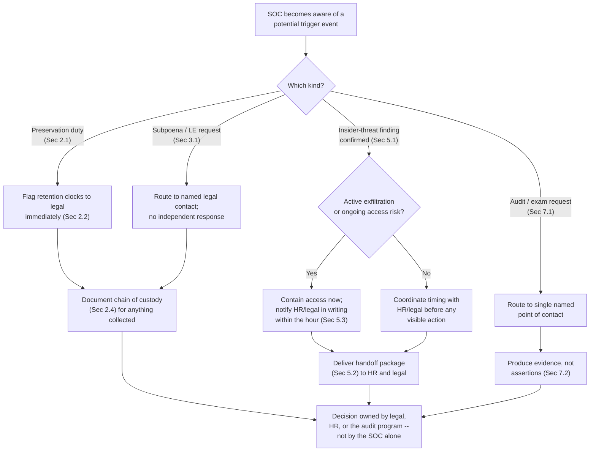

# Part 27 — Legal, HR & Compliance Interfaces

## Why this part exists

**[CONCEPT]** Part 4 built the SOC's standing RACI with legal, HR, and physical security as a set of rows in a matrix — who's Responsible, who's Accountable, for activities like "preserve evidence / apply legal hold" and "insider-threat finding hand-off to HR." A RACI row is a map reference, not a set of directions. This part writes the directions: what actually has to happen, in what order, documented how, the first time a litigation hold lands in a SOC manager's inbox, the first time an insider-threat finding is confirmed and someone has to decide what happens to the person behind it, and the first time an external examiner asks to see evidence rather than a policy document. None of this is technical work. It's procedural work with real legal and financial consequences attached to getting the procedure wrong, and it sits squarely in the manager's chair because no analyst, however senior, has the standing to make these calls alone.

Three standing interfaces make up this part's scope. Toward legal: recognizing when a preservation duty has attached, keeping a litigation hold from being scoped so narrowly it misses the evidence that matters or so broadly it paralyzes the team, responding to a subpoena or a law-enforcement request without either stonewalling or overcomplying, and understanding what changes procedurally once outside counsel is directing a breach investigation. Toward HR: what happens organizationally once an insider-threat finding is confirmed — the hand-off package, who decides discipline, and how a termination's paper trail either survives a legal challenge or hands the challenger their strongest exhibit. Toward audit and regulatory examiners: the standing cadence of internal audit, compliance-framework assessments, and regulatory exam cycles a SOC manager should expect to run into repeatedly, not as a one-time event.

**[CONCEPT]** The detection and response mechanics behind an insider-threat finding — the behavioral indicators, the correlation logic, the escalation criteria that gets a case confirmed in the first place — belong to SOC Playbook Handbook, Insider Threat Playbooks (Category 19), and this part does not re-walk any of it. This part starts exactly where that material ends: a finding is already confirmed, and now an organization has to decide what to do about a person. The same boundary holds for a live breach: Part 28 — The Manager's Role in a Major Incident owns the manager's in-the-moment decision to activate an IR retainer or bring in outside counsel during an active incident. This part owns the standing structure that decision activates — the engagement-letter terms, the privilege routing, the pre-negotiated retainer — so that decision isn't being improvised from scratch under pressure. And Part 16 — Performance Management & Coaching already built the coaching cadence, the diagnostic for what's actually causing a recurring performance problem, and the mechanics of a defensible Performance Improvement Plan; this part adds only the legal-review layer that plan needs once termination moves from a possibility to an actual decision.

## 1. Three interfaces, one shared discipline

**[CONCEPT]** Legal, HR, and audit look like three unrelated relationships with three different vocabularies, but a SOC manager's job across all three has the same shape: recognize the trigger early, preserve and document rather than act unilaterally, route the decision to whoever actually owns it, and never let the team's normal operational instinct — contain the problem fast, fix it now — override a process that exists precisely because speed is not always the right answer once legal exposure, someone's employment, or a regulator's finding is on the table.

| Interface | What triggers it | SOC's actual role | Who owns the decision |
|---|---|---|---|
| Legal — evidence & holds | Reasonably anticipated litigation, a subpoena, a regulatory inquiry, an insider-threat finding likely to end in termination | Preserve what's asked, flag what's about to expire, document chain of custody | In-house or outside counsel |
| Legal — subpoena / law-enforcement request | A document lands naming the organization or an employee, compelling or requesting data | Route immediately, do not respond or confirm anything independently | Legal, working the compulsion/timeline |
| HR — insider-threat aftermath | An insider-threat finding is confirmed under SOC Playbook Category 19's mechanics | Hand off evidence and technical scope, contain access on a coordinated timeline | HR, with legal, on discipline and termination |
| HR — termination documentation | A Performance Improvement Plan (Part 16) is failing or an insider-threat finding implicates a specific person | Supply the technical/behavioral record; do not draft the legal justification alone | HR and legal jointly |
| Audit / regulatory exam | A scheduled cycle: internal audit, a compliance-framework assessment, a regulator's exam | Produce evidence on request, on a single coordinated channel | The audit or exam program itself; the manager doesn't negotiate scope |

**[SENIOR MANAGER]** The common failure across all five rows isn't malice or incompetence — it's a manager or analyst treating a legal/HR/audit trigger as an operational problem to be solved the way an incident is solved: fast, locally, by whoever's closest to it. A SOC that's excellent at incident response can still generate real legal and financial exposure by applying that same instinct to a subpoena or a termination, because the correct move in this domain is almost always to slow down, document, and route — the opposite of what a live security incident usually rewards.

## 2. Evidence preservation and legal holds

### 2.1 What triggers a hold, and who issues it

**[SENIOR MANAGER]** A duty to preserve evidence attaches the moment litigation, a regulatory investigation, or a comparable adversarial process is *reasonably anticipated* — not once a complaint is formally filed. That threshold is a legal judgment, and it belongs to counsel, not to the SOC manager. What belongs to the SOC manager is recognizing the situations that should prompt a call to legal before a hold notice ever arrives: a confirmed insider-threat finding likely to end in termination, a breach with regulated data in scope, an employee's discrimination or harassment complaint that touches systems the SOC has visibility into, or a subpoena or law-enforcement request that references specific data. A manager who waits for legal to proactively identify every one of these triggers is relying on legal having visibility the SOC actually has first — the SOC usually sees the technical fact pattern (an account was accessed, a file was exfiltrated, a login pattern is anomalous) well before legal knows there's anything to preserve.

### 2.2 The retention-clock problem

**[SENIOR MANAGER]** A litigation hold notice describes what to preserve going forward. It says nothing about data that already aged out of a retention tier before the notice existed, and this is where a SOC's own infrastructure becomes the biggest risk to a hold it never intended to create. A SIEM with a 90-day hot-tier retention window and an EDR platform with a 30-day telemetry retention window will auto-purge the exact evidence a hold exists to preserve, on schedule, with no malicious intent from anyone, unless someone on the SOC side flags the clock the moment a preservation trigger from §2.1 appears — not after legal formally issues a notice, which can take days to draft and route through the right approvals.

> **Blind Spot**
> A legal hold notice is written in legal language about custodians and date ranges; it is not written by someone who knows this organization's specific retention tiers, and it will not, by itself, stop a 30-day EDR telemetry window or a 90-day SIEM hot tier from purging data on schedule. The SOC manager is the only person in the chain who actually knows those numbers, and the gap this creates is silent — nothing errors out, nothing alerts, the data simply isn't there anymore when someone finally asks for it six weeks later. Flagging retention windows to legal the moment a preservation trigger appears, before the formal notice is even drafted, is the only thing that closes this gap.

### 2.3 Scoping the hold, and what happens when it's wrong

**[SENIOR MANAGER]** A hold's scope — which custodians, which systems, which date range — is legal's call to make, but the SOC manager is usually the only person who can tell legal, accurately, what a given scope will actually capture: whether "email" also needs to include a specific chat platform, whether "endpoint" needs to include a personal device enrolled in BYOD MDM, whether the date range legal proposed predates or postdates the retention tier that actually holds the relevant data. Getting this conversation right the first time is materially cheaper than discovering the gap during document review, months later, with opposing counsel already aware something is missing.

**CASE-2701 — the hold that named the wrong retention tier.** *COMPOSITE CASE EXAMPLE — merges patterns from several regulated-industry litigation-hold failures into one illustrative narrative; figures below are illustrative, not sourced legal or audited data.*

```text
CONCEPTUAL SAMPLE -- illustrative figures, not sourced legal or audited financial data

Organization: ~40-person SOC, regional financial-services firm
Day 1:   Employment-discrimination complaint filed by a terminated analyst; legal issues
         a hold notice naming "email and personnel records" for the named custodians.
         EDR and SIEM logs are not named -- nobody on the SOC side is asked, and nobody
         volunteers, that EDR telemetry for the custodian's former endpoint is on a
         30-day rolling purge.
Day 34:  EDR telemetry for the relevant endpoint has fully aged out and purged on schedule.
Day 52:  Opposing counsel's document request specifically asks for endpoint activity logs
         to corroborate a claim about after-hours access patterns. The data no longer exists.
Outcome: Court gives an adverse-inference instruction (the jury may assume the missing
         data would have been unfavorable to the employer) based on a spoliation motion.
         Outside counsel's own post-mortem estimate: the spoliation exposure alone added
         roughly $150,000 to the eventual settlement value, on top of the underlying
         claim, specifically because the missing data could no longer be used to
         either confirm or rebut the access-pattern allegation.
```

**[SENIOR MANAGER]** The fix in CASE-2701 wasn't a smarter legal team — it was a SOC manager involved early enough to say "our EDR telemetry for that host is a 30-day rolling window; if this scope doesn't explicitly include it, it's gone before your notice is even drafted." That sentence takes 10 seconds to say and would have prevented the entire spoliation exposure. It never got said because nobody on the SOC side was in the room when the hold's scope was set, and legal had no way to know the question needed asking.

### 2.4 Chain of custody once evidence is actually pulled

**[SENIOR MANAGER]** Once a hold is in place and evidence is being collected, the documentation standard is the same one Part 16 assumes for a performance record and Part 4's RACI assumes for an insider-threat hand-off, applied to technical artifacts instead of conversation notes: who pulled the data, exactly when, from which system, with what identifying hash or export reference, stored where, and who has had access to it since. Four fields — who, when, what, and a verifiable integrity reference — turn a claim ("we pulled the logs") into evidence a court or an examiner can actually rely on. Skipping any one of the four doesn't make the evidence disappear; it makes the evidence contestable, which in a challenged termination or a regulatory finding is nearly as costly as not having it at all.

## 3. Subpoena and law-enforcement request response

### 3.1 The manager's role: router, not decider

**[FRONTLINE MANAGER]** The person who first sees a subpoena or a law-enforcement request is rarely the SOC manager — it's often a team lead who opens an email, or an analyst who's handed a document by a process server or a visiting agent. That person's job has exactly one correct move: route it to the named legal contact immediately, and say nothing substantive to the requester beyond confirming it was received. Answering a question, confirming or denying that a specific account exists, or promising a turnaround time — even something as innocuous as "sure, we can have that by Friday" — can commit the organization to a position legal hasn't reviewed and didn't authorize.

### 3.2 What kind of request this actually is

**[SENIOR MANAGER]** Not every document that arrives looks the same, and the correct response differs sharply by type. The table below is the fast triage a manager needs before legal gets involved — it doesn't replace legal's judgment, it makes sure the right artifact reaches legal fast enough for that judgment to matter.

| Request type | Typical form | Compliance obligation | Manager's immediate action |
|---|---|---|---|
| Civil subpoena (litigation between two parties) | Subpoena duces tecum, produce documents by a set date | Legally compulsory on the timeline the issuing party and applicable court rules set | Route to legal now; do not produce anything or confirm scope independently |
| Grand jury subpoena | Criminal investigation, often with a secrecy expectation | Compulsory; may carry an informal or formal non-disclosure request | Route to legal; do not discuss its existence outside the named legal contact |
| Regulatory examiner information request | Written request during a scheduled exam (see §7) | Compulsory under the regulator's statutory authority | Route to compliance/legal; use the standing process in §7, not an ad hoc response |
| Informal law-enforcement preservation request | A letter or email asking the organization to preserve, not yet produce, specific data | Preserve only; producing content without a warrant or court order can itself create liability | Preserve the named data immediately; route to legal before producing anything |
| National security letter or statutory gag order | Rare; carries its own non-disclosure statute | Compulsory, with a legal prohibition on disclosing even that it was received | Route to the single legal contact named for this scenario; do not acknowledge its existence to anyone else |

> **Field Test**
> **Setup:** No prior drill has tested how a subpoena or law-enforcement request actually moves through the team once it lands.
> **Action:** With legal's sign-off, have someone outside the SOC "serve" a mock civil subpoena — a realistic-looking document with a fictitious case caption — on a randomly chosen Tier 1 analyst's inbox, timed for a normal shift.
> **Expected result:** The analyst forwards it to the named legal contact within the same shift, without independently responding to the sender, confirming any account exists, or discussing its contents outside that routing step. If the analyst instead tries to answer it, sits on it past shift-end, or asks a teammate what to do because no one told them who the named contact even is, the routing path is aspirational, not operational — fix the on-call documentation before relying on it for a real one.

### 3.3 A worked response timeline

**[SENIOR MANAGER]** Many U.S. federal civil subpoenas give the recipient roughly 14 days to object under the applicable procedural rules and set a compliance date commonly 21 to 30 days out — enough time to do this correctly, but not enough time to do it correctly if the SOC's own collection step doesn't start until legal has already used up most of the window deciding how to respond. The table below is an illustrative decomposition of a 21-day window, not a universal timeline — actual deadlines depend on jurisdiction, the specific rule under which the subpoena issued, and any negotiated extension.

```text
CONCEPTUAL SAMPLE -- illustrative timeline, not a substitute for the specific deadline
stated on an actual subpoena or counsel's own guidance

Day 0:      Subpoena received, routed to legal same day (Sec 3.1).
Day 1-3:    Legal reviews scope, decides whether to object, negotiate, or comply as written.
Day 3-4:    Legal confirms the data scope with the SOC manager -- which systems, which
            date range, which custodians -- using the same scoping conversation Sec 2.3
            describes for a litigation hold.
Day 4-14:   SOC collects and hashes the requested data, logging chain of custody (Sec 2.4).
Day 14-18:  Legal reviews the collected production for privilege, relevance, and scope
            before anything leaves the organization.
Day 18-21:  Production delivered on or before the compliance date.
```

**[SENIOR MANAGER]** The collection step (days 4 through 14 above) is the one a SOC manager actually controls, and it's the one most often compressed by a slow start on days zero through three — every day legal spends deciding whether to object is a day not spent collecting, and the compliance date doesn't move to compensate. Starting the retention-tier check from §2.2 and the collection conversation from §2.3 the moment a subpoena is routed, in parallel with legal's own review rather than waiting for legal to finish first, is what keeps a 21-day window from becoming a 10-day scramble.

## 4. Outside counsel and privilege during a breach

### 4.1 Why the engagement letter matters as much as the forensics work

**[SENIOR MANAGER]** Who retains a forensics or incident-response firm during a breach — the SOC directly, or outside counsel on the organization's behalf — changes whether the resulting report is protected by attorney-client privilege or work-product doctrine in later litigation or a regulatory proceeding. A firm retained directly by IT or the SOC, for ordinary security services, produces a report that's discoverable by default; a firm retained by outside counsel, specifically for the purpose of advising counsel on litigation or regulatory risk arising from a specific incident, has a real (though not guaranteed) claim to privilege protection. This distinction became one of the most closely watched issues in cybersecurity law after a widely reported federal court ruling — In re Capital One Consumer Data Security Breach Litigation — where a court ordered production of a breach-investigation report specifically because the same forensics firm had a pre-existing, ordinary-course retainer with the organization before the breach occurred, undercutting the claim that the post-breach report was prepared primarily to help counsel litigate rather than to do the security work the firm was already doing anyway. The exact procedural history is worth verifying against current case law before relying on it in a real matter — this book is not a substitute for that legal research — but the operating lesson survives the specifics: a retainer signed *after* a breach, structured so counsel is the client and the report's primary purpose is legal advice, protects privilege in a way that retroactively re-labeling an existing vendor relationship does not.

**[SENIOR MANAGER]** The practical consequence for a SOC manager is upstream of any specific breach: the retainer terms, the engagement letter's language about who directs the work and for what purpose, and the decision about whether the *existing* IR vendor relationship needs a separate, counsel-directed engagement letter the moment a real incident starts, are all standing decisions worth having settled before day one of an actual breach — which is exactly the gap Part 28's live-incident activation decision assumes has already been closed.

### 4.2 What changes once counsel is directing the investigation

**[SENIOR MANAGER]** Once outside counsel is formally directing a breach investigation, a few concrete things change in how the SOC operates day to day, not just on paper. Investigative findings often route to counsel first rather than up the SOC's normal management chain for that specific matter, with counsel deciding what's shared onward and to whom. Written communications about the investigation — reports, emails, chat messages — should carry an explicit note that they're prepared at counsel's direction for the purpose of legal advice, and informal speculation about root cause or blame needs to move out of ordinary team channels and into whatever narrow, counsel-sanctioned channel the engagement designates, because an offhand Slack message speculating about fault is exactly as discoverable as a formal report if it isn't covered by the same privilege structure.

> **People Risk Trap**
> A team's normal incident channel — Slack, Teams, a ticketing tool's comment thread — is where analysts naturally think out loud during a live breach: "looks like we missed patching this two months ago," "I think whoever owns this service dropped the ball." Once litigation or a regulatory inquiry is reasonably anticipated, that same speculation, written in an ungoverned channel with no privilege protection, becomes a document opposing counsel can request and quote directly — often more damaging than the underlying technical failure, because it reads as an admission rather than a working hypothesis under active investigation. The fix: the moment counsel is engaged, move investigative discussion to the specific channel or format the engagement designates, and treat anything written elsewhere about the incident's cause or fault as if it will be read aloud in a deposition, because it might be.

### 4.3 Where this splits from Part 28

**[SENIOR MANAGER]** This part owns the standing structure — the retainer terms, the privilege routing, the pre-negotiated engagement letter language — that makes a fast, correct activation possible. Part 28 — The Manager's Role in a Major Incident owns the live decision of when to actually pull that trigger during an active incident, alongside the staffing surge and board-communication cadence that decision sits next to. A manager who's never read this part's material before a live incident starts is negotiating privilege structure for the first time under exactly the conditions least suited to getting it right; the standing work this part describes should already be done well before Part 28's decision point ever arrives.

## 5. Insider-threat findings: from confirmed finding to HR handoff

### 5.1 The scope boundary, stated plainly

**[CONCEPT]** Everything in this section assumes a finding already exists — the organizational-aftermath process below starts at confirmation, not at detection.

> **Cross-Book Pointer**
> This part does not cover how an insider-threat finding gets detected or confirmed — the behavioral indicators, the correlation logic across access and data-movement telemetry, and the escalation criteria that turn a suspicion into a confirmed finding are SOC Playbook Handbook, Insider Threat Playbooks (Category 19)'s territory, mechanically developed there. This part starts at the moment that category's own escalation criteria have already been satisfied and a finding is confirmed — what an organization does next, procedurally, with a real person's employment and possibly their legal exposure on the table.

### 5.2 The handoff package: what HR and legal actually need

**[HR/PEOPLE]** A SOC that hands HR a raw case file — alert timestamps, query syntax, a list of accessed file paths — hands HR something it can't act on, because HR and legal need a plain-language narrative, not a technical export. The table below is the standard handoff content; a real handoff needs all six rows before HR or legal should be expected to make a decision.

| Handoff element | What it must contain | Why it's non-negotiable |
|---|---|---|
| Plain-language summary | What happened, in one paragraph a non-technical reader can act on | HR and legal decide based on this, not on raw telemetry |
| Timeline | Dated sequence of the relevant events, cross-referenced to evidence | Establishes what happened when, which matters for both discipline and any legal exposure |
| Evidence list with chain of custody | Every artifact relied on, collected per §2.4's standard | Evidence without a documented chain is contestable in a later challenge |
| Scope of access implicated | Exactly what systems, data, or accounts the person could reach | Determines both containment urgency and the scope of any exfiltration risk |
| Data-exfiltration status | Confirmed yes/no/unable-to-determine — not omitted | Changes both urgency and whether a regulatory notification duty (Part 4's Legal/Privacy RACI row) is triggered |
| Recommended containment status | What access has already been revoked, what's pending, and why | Lets HR and legal coordinate timing instead of discovering containment already happened, or hasn't |

### 5.3 Who decides, who acts, and why the sequence matters

**[SENIOR MANAGER]** The SOC's containment authority and HR/legal's discipline authority are two different decisions that often need to happen close together in time but not in the same sequence every time. A finding involving active, ongoing data exfiltration usually justifies revoking access before HR has finished its own review, because the technical risk of waiting outweighs the coordination cost. A finding involving something already contained — a completed, historical policy violation with no ongoing access risk — usually justifies waiting for HR and legal to weigh in on timing before any visible action happens, because an abrupt access revocation with no documented rationale can itself look punitive or retaliatory if the timeline is ever scrutinized later.

> **Management Autopsy — "revoke access the moment the finding is confirmed" (COMPOSITE CASE EXAMPLE, `CASE-2702`)**
>
> **The decision:** A SOC analyst, on confirming an insider-threat finding involving a data-policy violation with no ongoing exfiltration risk, disabled the employee's badge and VPN access immediately, without looping in HR or legal first, and without documenting a rationale beyond the internal case ticket.
>
> **Why it seemed reasonable:** Containing access fast is the correct instinct for almost every other kind of confirmed compromise this team handles, and nothing about this finding looked different from that pattern in the moment.
>
> **How it failed:** The employee had filed an unrelated internal complaint the week before, and was separately partway through a documented Performance Improvement Plan for unrelated reasons. HR had no record of why access was revoked or when, and the employee's own manager wasn't told the reason. When the employee's attorney later challenged the termination, the undocumented, same-day access revocation — with no HR or legal record explaining it — became the strongest exhibit for a retaliation theory: it looked, on paper, exactly like a punitive response timed to the prior week's complaint, regardless of what actually motivated it. The case resolved through a negotiated settlement of roughly $95,000 — a composite, illustrative figure, not drawn from one traceable matter — which outside counsel's own assessment attributed specifically to the absence of a documented, coordinated rationale for the access revocation's timing, not to any weakness in the underlying insider-threat finding itself, which was sound.
>
> **The fix:** A pre-negotiated emergency protocol that lets the SOC revoke access immediately when the technical risk genuinely requires it, paired with a mandatory, near-simultaneous written notice to HR and legal — within an hour, not by end of day — stating what was revoked and why. The technical action doesn't wait; the documentation of *why it couldn't wait* has to happen just as fast, so the timeline never has to be reconstructed from memory months later.

## 6. Performance documentation that holds up under a challenged termination

### 6.1 What changes once termination is actually on the table

**[HR/PEOPLE]** Part 16 built the coaching cadence, the diagnostic for what's really causing a recurring miss, and the structural components of a defensible Performance Improvement Plan — problem statement, measurable criteria, committed support, timeline, stated consequence. None of that changes here. What changes, the moment termination moves from a stated possibility to an actual decision, is that the plan and its supporting record need a legal-review checkpoint before anything is delivered to the employee: a check for consistency against how similarly situated employees have been treated, a check for timing against any recent protected activity (a leave request, an accommodation request, a discrimination or harassment complaint), and a check that every criterion in the plan is measurable enough to survive a pretext argument — a claim that the stated reason for termination wasn't the real one.

### 6.2 Common legal-review defects and their exposure

**[HR/PEOPLE]** The table below extends Part 16's PIP-quality checklist with the specific legal-exposure lens a review adds once termination is genuinely on the table — the same defects Part 16 flags as weak coaching practice tend to be exactly the defects that create the most legal exposure, which is not a coincidence.

| Defect | Legal exposure it creates | Fix |
|---|---|---|
| No documented issue before the PIP | Weakens the "this was already a known, addressed problem" narrative against a retaliation or discrimination claim | Require a dated prior 1:1 record per Part 16 §2.3 before a PIP opens |
| Inconsistent treatment vs. a comparator | Disparate-treatment claim — why did this person get a PIP or termination for something a peer wasn't disciplined for | Run a comparator check (§6.3) before finalizing any action |
| Termination timing close to protected activity | Invites a retaliation inference regardless of the underlying performance record's own merits | Legal specifically reviews timing; may recommend delay or an independently documented justification |
| Vague, unmeasurable criteria | Supports a pretext argument — a vague standard can be claimed to mean anything after the fact | Hold to Part 16 §4.2's measurable-criteria standard, tied to an actual baseline |
| No coordinated access-offboarding record | Weak account of the organization's own process discipline if litigated; separate security exposure if access lingers | Pair the termination checklist with a documented, timestamped access-revocation step |

### 6.3 The comparator check, concretely

**[SENIOR MANAGER]** Before finalizing any termination, pull the last 12 months of comparable actions — same alert type of performance issue, same tier, same rough tenure band — and ask whether this specific case is being handled the same way those were, or differently, and if differently, whether there's a real, documented reason. A 40-analyst SOC running two or three employment actions a year that could plausibly draw legal scrutiny doesn't need a formal analytics program to do this — it needs someone, usually HR with the SOC manager's input, actually looking at the short list before signing off, rather than assuming consistency because no one has complained yet.

**[EXECUTIVE]** When a termination is contested and litigation becomes a realistic outcome, the board-reporting register shifts — a personnel matter that would otherwise never reach executive attention can become a line item in a legal-exposure report the moment outside counsel is engaged. Part 24 — Executive & Board Reporting owns the cadence and format for that conversation; this part's only claim here is that legal's involvement changes what can safely be said in writing about the matter at all, well before it reaches a board deck.

## 7. Standing audit and regulatory-examiner interactions

### 7.1 What a SOC manager should expect, on a recurring basis

**[SENIOR MANAGER]** Unlike a subpoena or an insider-threat finding, audit and examiner interactions are not rare events triggered by something going wrong — they're a standing, recurring part of running a SOC in almost any regulated or compliance-framework-bound organization, and treating each cycle as a fire drill rather than a routine is the single biggest driver of unnecessary audit stress.

| Audit/exam type | Typical cadence | What they actually sample | Manager's standing prep obligation |
|---|---|---|---|
| Internal audit | Annual or continuous, per the internal audit function's own plan | Control design and operating effectiveness against the organization's own stated policies | Keep policy documents and actual practice in sync — internal audit tests the gap between them |
| Compliance-framework assessment (SOC 2 Type II, ISO 27001 surveillance) | Annual, with SOC 2 Type II covering a review period, commonly 6 or 12 months | A sample of tickets, access logs, or change records across the review period, not every instance | Maintain evidence continuously through the period, not just in the weeks before the assessor arrives |
| PCI DSS QSA assessment | Annual | A defined sample size against specific requirements (e.g., a sample of log-review evidence across the assessment period) | Log review and monitoring evidence needs to already exist in a QSA-legible form, not be reconstructed after the fact |
| Regulatory examiner (e.g., a financial or healthcare regulator's exam) | Set by the regulator's own exam cycle, often multi-year | Broader scope; can request specific incident records, policy documents, and interviews | A single named point of contact and a documented, coordinated response process (§7.2) |
| Cyber-insurance underwriting audit | At renewal, typically annual | Attestations plus, increasingly, evidence for specific controls (MFA coverage, backup testing, EDR deployment) | Keep the same evidence trail current; an underwriting audit that contradicts the policy attestation can affect coverage or premium |

### 7.2 The manager's role during fieldwork

**[SENIOR MANAGER]** An auditor or examiner asks for evidence, not assertions — "we have a 4-hour SLA for critical alerts" is a policy statement; the evidence is a sample of tickets showing that SLA was actually met, or a documented exception where it wasn't and why. A manager who lets every analyst answer auditor questions independently, in real time, risks inconsistent answers about the same control from different people who each have a slightly different mental model of how it actually works — designate a single point of contact for the engagement, brief that person on what's actually true (not what should be true), and route every request through them rather than letting fieldwork turn into a dozen informal hallway conversations with different answers.

> **Blind Spot**
> An audit or examination only tests what it's scoped to sample, and a clean report — a passed SOC 2 Type II, a satisfactory exam letter — says nothing about the controls nobody thought to test this cycle. A manager who treats "we passed" as equivalent to "we're secure" is confusing an audit's specific, narrow scope with a general security posture claim, and that confusion tends to surface at the worst possible time: in a board deck (Part 24) that implies more assurance than the underlying assessment actually provides, or in an incident post-mortem where the exact gap that caused the incident turns out to be one the last three audit cycles never sampled.

> **Field Test**
> **Setup:** No upcoming audit is scheduled, but the SOC claims a specific SLA or control operates consistently.
> **Action:** Pull a random sample of 10 tickets from the last quarter, cold, and ask whoever's on shift to produce evidence — not a description, actual evidence — that the stated SLA or control was met for each one, without going back to the analyst who originally worked the ticket.
> **Expected result:** For most or all of the 10, evidence should already exist and be retrievable within minutes. If retrieving evidence for a routine claim requires reconstructing it after the fact — asking the original analyst to remember, or rebuilding a timeline from scattered sources — the control isn't actually operating the way it's described, and a real audit sample would surface the same gap, just with less forgiving timing.

### 7.3 A finding that reveals a charter gap

**[SENIOR MANAGER]** An audit or exam finding that reveals a scope-boundary or RACI gap Part 4's charter never accounted for is itself worth adding to that charter's own out-of-cycle review triggers — not just fixed locally to satisfy this one finding. A finding that recurs across two consecutive audit cycles because the underlying charter gap was patched narrowly instead of revised is a sign the fix addressed the symptom, not the document that should have named the boundary in the first place.

## 8. Building the standing interface, not just reacting to one event

### 8.1 The first-action gap, named for each trigger

**[SENIOR MANAGER]** Part 4's own worked example showed that a RACI naming who's Accountable for a decision, without naming who's Responsible for the specific first act of notification, has a gap that looks filled on paper and is empty under real time pressure. The table below closes that gap for this part's four recurring triggers specifically — not a replacement for Part 4's general RACI, but the first-action detail it didn't carry.

| Trigger | First action required | Who is Responsible for that first action | Target time |
|---|---|---|---|
| Preservation duty recognized (§2.1) | Flag the trigger and any at-risk retention clock to legal | SOC manager or the analyst who first recognizes the trigger | Same business day |
| Subpoena / LE request received (§3.1) | Route to the named legal contact; no independent response | Whoever physically receives it | Within the same shift |
| Insider-threat finding confirmed (§5.3) | Deliver the handoff package (§5.2) to HR and legal | SOC manager | Within 24 hours of confirmation, sooner if exfiltration is active |
| Audit/exam fieldwork request (§7.2) | Route to the single named point of contact | Whoever receives the request | Same business day |

### 8.2 The decision flow, end to end

**[CONCEPT]** Figure 27.1 traces how a SOC manager should route any of this part's four trigger types once one appears — the shared discipline from §1 expressed as a single walkable path, rather than four separate flows that happen to look similar.

**Figure 27.1 — Routing a legal, HR, or audit trigger to its owner.** *CONCEPTUAL.* Illustrates the shared decision path across the four trigger types this part covers; it is a structural model of the routing decision, not a capture of any single organization's actual ticketing workflow.





**Figure 27.1 — Routing a legal, HR, or audit trigger to its owner.** *CONCEPTUAL.* Renders the routing flowchart above as a static SVG. It supports this section's claim that all four trigger types in this part converge on the same shape — recognize, preserve/route/document, then hand off to the actual decision owner. `FIG-2701`.

### 8.3 Where the manager's job ends, on purpose

**[SENIOR MANAGER]** Across evidence preservation, subpoena response, insider-threat aftermath, termination documentation, and audit interaction, the manager's job has the same boundary every time: recognize the trigger fast enough that the organization's options aren't already foreclosed by a purged retention window or an undocumented unilateral action, preserve and document rather than improvise, and hand the actual decision to whoever legally and organizationally owns it. The manager who does all of that and still tries to personally decide whether to comply with a subpoena, whether an insider-threat finding warrants termination, or whether an audit finding is really a finding has stepped past the edge of the job this part describes — and the manager who recognizes none of these triggers until legal, HR, or an examiner brings it to their attention has stepped short of it. The competent middle is the same in all five cases: see it early, don't act alone on the decision itself, and make sure the paper trail would hold up if someone hostile ever read it back in a room the manager wasn't in.

## Cross-references

Within this book, this part assumes the standing charter and RACI Part 4 — Organizational Placement & Charter already built — specifically the "preserve evidence / apply legal hold" and "insider-threat finding hand-off to HR" rows this part fills in procedurally — and the coaching cadence and Performance Improvement Plan mechanics Part 16 — Performance Management & Coaching already built, adding only the legal-review layer those plans need once termination is genuinely on the table. It hands forward to Part 24 — Executive & Board Reporting (the board-reporting register shift once litigation or a regulatory matter is live) and assumes Part 28 — The Manager's Role in a Major Incident owns the live, in-the-moment decision to activate an IR retainer or outside counsel during an active breach, while this part owns the standing engagement-letter and privilege structure that decision plugs into. Outside this book, it cites SOC Playbook Handbook, Insider Threat Playbooks (Category 19) for the detection and escalation mechanics that confirm an insider-threat finding before this part's organizational-aftermath process ever begins.
