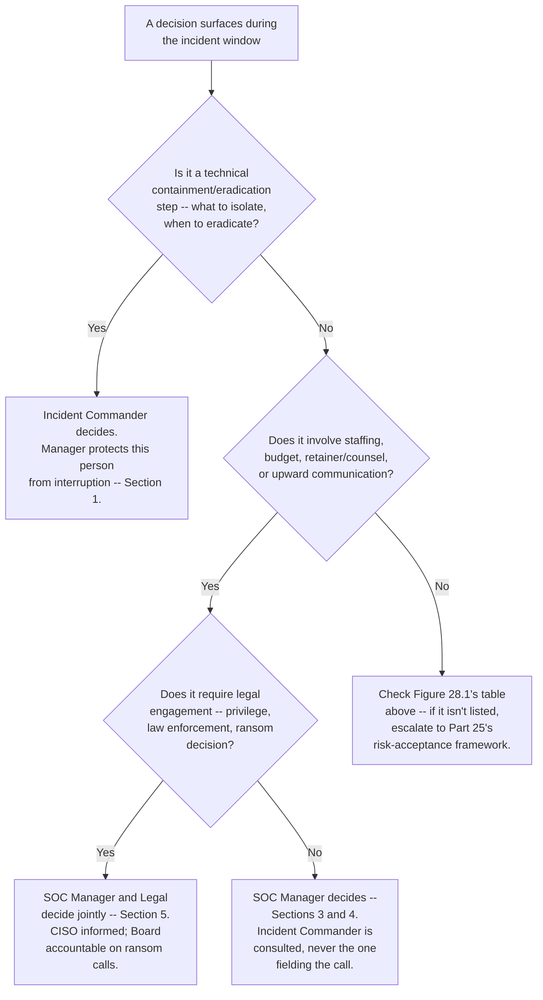

# Part 28 — The Manager's Role in a Major Incident

## Why this part exists

**[CONCEPT]** A declared major incident — a ransomware event, a confirmed large-scale data-exfiltration case, a business-email-compromise chain that's moved real money — puts two very different jobs in the same building at the same time, and the most common way that incident goes worse than it had to is that one person ends up doing both jobs badly instead of two people each doing one job well. SOC Playbook Handbook's Ransomware Master Playbook defines the incident commander role operationally: the person who runs the technical response, directs containment and eradication, and owns the tactical sequencing of the playbook itself. This book has no reason to re-derive any of that, and doesn't. This part is about the other chair in the room — the SOC manager's — and what a manager personally does for the duration of a live major incident that nobody else in the building is positioned to do instead.

**[CONCEPT]** Four things belong to that chair, and this part covers exactly those four: deciding how to surge staffing onto the incident and who backfills the standing queue while that surge is running; setting and running the cadence of communication upward to the CISO and the board, which is a different audience and a different rhythm than the client-facing communication SOC Playbook Handbook, Part 28 — SOC-to-Stakeholder Communication already owns; deciding when to activate a pre-negotiated incident-response retainer or bring in outside counsel; and drawing the decision-authority line clearly enough, in writing, before an incident happens, that the incident commander is never also the person fielding a board phone call at 2 a.m. That last item is this part's connective thread — the other three all exist, in part, to protect the boundary the fourth one draws.

**[CONCEPT]** Major-incident content is split three ways across this series on purpose, and none of the three duplicates another. The technical attack-stage analysis — how a specific compromise actually progresses through its stages — is Detection Engineering Handbook V2's applied compromise models (Parts 44–48). The analyst- and incident-commander-level operational playbook — what actually gets done, in what order, to contain and eradicate a specific attack — is SOC Playbook Handbook's Ransomware Master Playbook. This part owns only what's left: the layer neither of those two books has any reason to cover, because neither is written from the manager's chair. What follows deliberately does not build a severity model (that input is SOC Playbook Handbook, Part 29 — Playbook Severity Model, used here only as a trigger condition), does not re-teach the routine volume-surge toolkit already covered in Part 9 — Queue Health & Workload Management, and does not run the post-incident review — that's Part 29 — Post-Incident Organizational Review, once the incident is over and the manager's job shifts from live decision-making to structured retrospective.

## 1. Two chairs, one incident

**[CONCEPT]** An incident commander and a SOC manager answer to two different clocks. The incident commander's clock is the attack's: how fast can a compromised host be isolated, how fast can a forensic image be pulled before evidence degrades, how fast can eradication happen without tipping into a premature "all clear" that a lingering foothold makes false. The manager's clock is the organization's: how fast does the CISO need an accurate answer before making a board update, how fast does a decision to activate a six-figure retainer need to happen before the delay itself becomes the more expensive choice, how fast can a surge staffing decision get made before the rest of the SOC's standing queue quietly goes unworked. Neither clock is optional, and neither person can run both at once without one of them slipping — usually the incident commander's, because a phone that rings with the CISO's name on it is very hard for anyone to ignore, however senior.

### 1.1 What the incident commander owns

**[CONCEPT]** The incident commander's job, as SOC Playbook Handbook's Ransomware Master Playbook defines it operationally, is the technical direction of the response: which host gets isolated first, what the containment sequence is, when eradication is safe to start, and when the technical evidence actually supports declaring the incident contained. That job requires sustained attention on a fast-moving technical picture, and it degrades measurably the moment it's interrupted by something that has nothing to do with the attack itself — a status call, a request to "just quickly explain where we are" to someone three organizational layers removed from the containment decision in front of them.

> **Cross-Book Pointer**
> This part does not define the incident commander role, the containment/eradication sequence, or when a ransomware incident is safe to declare resolved — that's SOC Playbook Handbook's Ransomware Master Playbook, and it's written at the operational depth this book has no reason to duplicate. Read that playbook for the mechanics of what the incident commander actually does; come back here for what the manager does at the same time, in a different chair, so the two jobs don't collapse into one overloaded person.

### 1.2 What the manager owns

**[SENIOR MANAGER]** The manager's job during the same incident has almost nothing to do with the attack's technical shape and almost everything to do with the organization around it: deciding how many people to pull onto the incident and from where, without leaving the standing queue dangerously thin (§3); setting up and running the upward communication cadence so the CISO and board get accurate, regularly timed information without that information having to come from the person currently directing containment (§4); deciding when a retainer or outside counsel gets activated, and coordinating with Legal on how that engagement is structured (§5); and holding the line, out loud and in writing, on who decides what — so that a board member's reasonable-sounding request to "just get the technical lead on the phone" doesn't quietly become the thing that slows containment down.

### 1.3 Why collapsing the two chairs is the default failure, not the exception

**[SENIOR MANAGER]** Organizations rarely decide, on purpose, to have one person run both jobs. It happens by default, because the most senior, most technically credible person in the building is both the obvious choice to direct containment and the person a nervous executive most wants to hear from directly. `CASE-2801` below shows exactly how that default plays out, and what it costs when nobody catches it early enough to correct it mid-incident.

> **Management Autopsy — "let the incident commander brief the board directly" (`CASE-2801`, COMPOSITE CASE EXAMPLE)**
>
> **The decision:** During a confirmed ransomware incident at a mid-market SOC, the most senior analyst was designated incident commander per the organization's Ransomware Master Playbook implementation. The CISO, wanting direct technical credibility on every update, had that same person join each scheduled board update call personally rather than routing updates through the SOC manager.
>
> **Why it seemed reasonable:** The incident commander genuinely was the person with the clearest, most current picture of the attack, and a relayed update always risks losing precision on the way through a second person. Nobody wanted the board hearing a watered-down or lagging version of the truth during a live crisis.
>
> **How it failed:** Across the first 30 hours, the incident commander joined six board update calls averaging 25 minutes each — roughly 150 minutes of direct call time, plus preparation, pulled straight out of active containment work. The real cost showed up once, at hour 14: telemetry showed lateral movement to a third file server exactly as a scheduled call started. The isolation decision waited 47 minutes for the call to end, because the one person positioned to make it was on the phone with the board instead. During that window, the ransomware encrypted an additional set of files across that third server before isolation finally executed — a delay attributable, directly, to the call, not to any technical limitation. The incremental recovery and rebuild cost attributable to that one avoidable 47-minute window was on the order of $85,000.
>
> **The fix:** The SOC manager took over 100% of upward briefing from that point forward. The incident commander was given one standing rule for the remainder of the incident: never pulled off a live technical decision for a call, full stop. A designated scribe fed the manager real-time technical status between calls, and the manager translated that status into board-appropriate language personally — the same translation skill Part 24 — Executive & Board Reporting develops for routine reporting, applied here under crisis time pressure instead of a quarterly cadence.

*(The dollar figure above is a `CONCEPTUAL SAMPLE` — illustrative arithmetic built to show the mechanism, not sourced benchmark data from a real organization's incident-recovery invoice.)*

**[SENIOR MANAGER]** Nothing about `CASE-2801` required a bad incident commander or an unreasonable CISO. Both people made locally sensible choices — direct technical credibility on a call sounds like a good idea, and it is, right up until the same person's presence on that call is also the only thing standing between telemetry and an isolation decision. The fix isn't a smarter incident commander; it's a decision-authority boundary that exists on paper before the incident starts, so nobody has to improvise the right call under pressure at hour 14.

> **What Would Change My Mind**
> This part treats separating the incident-commander chair from the manager's chair as one of the highest-leverage structural moves available during a live major incident. If organizations that kept one person in both chairs throughout a multi-day incident consistently showed no measurable difference in containment time, decision latency, or post-incident review findings compared to organizations that split the roles, that would undercut this chapter's central recommendation and argue for treating the split as situational rather than close to a default rule.

## 2. The decision-authority boundary, mapped

**[SENIOR MANAGER]** A boundary that exists only as a shared understanding evaporates under real pressure — a board member calling directly, a CISO asking "can't he just tell me himself," a well-meaning executive walking into the incident room. The boundary has to exist as a written, rehearsed answer to "who decides this" for the specific decisions a major incident actually generates, decided before the incident, not negotiated live during one.

**[SENIOR MANAGER]** The table below is a working reference for the decisions that recur across almost every declared major incident, mapped to who is accountable for each one, who gets consulted before it's made, and who is simply informed after the fact. It is deliberately narrower than a full incident playbook — it names the decision and its owner, not the technical criteria behind any single decision, which stays with whichever part or companion-book chapter already owns that mechanics.

The table below maps recurring incident-window decisions to who is accountable for each one, so the answer to "who decides this" is settled before an incident, not negotiated during one.

| Decision During the Incident Window | Accountable | Consulted | Informed |
|---|---|---|---|
| Declare major-incident status (using the severity trigger from SOC Playbook Handbook, Part 29 — Playbook Severity Model) | SOC Manager | Incident Commander, CISO | Board |
| Direct technical containment and eradication steps | Incident Commander | SOC Manager (resourcing only) | — |
| Approve staffing surge and the backfill roster (§3) | SOC Manager | Incident Commander, team leads | CISO |
| Brief the CISO and the board (§4) | SOC Manager | CISO | Incident Commander (relay only — never joins the call directly) |
| Activate the IR retainer or engage outside counsel (§5) | SOC Manager, Legal | CISO | Incident Commander |
| Engage law enforcement | Legal, SOC Manager | CISO | Incident Commander, Board |
| Ransom-payment decision, where applicable | Board, CISO | Outside Counsel, SOC Manager | Incident Commander |
| Client or third-party stakeholder notification content and timing | Owner defined by SOC Playbook Handbook, Part 28 — SOC-to-Stakeholder Communication | SOC Manager | Incident Commander |
| Declare the incident resolved and stand down the surge | SOC Manager | Incident Commander | CISO, Board |

**[SENIOR MANAGER]** Figure 28.1 below sequences the same boundary as a live decision flow rather than a static table — useful in the first hours of a declared incident, when several of these decisions surface in quick succession and the routing has to happen fast enough that nobody defaults to "whoever's already on the phone."

**Figure 28.1 — Routing a live incident-window decision to its owner.** *CONCEPTUAL.* `FIG-2801`. Illustrates the routing logic behind the RACI-style table above, collapsed to three branching questions a manager can run in seconds during a fast-moving incident. It is a structural decision aid, not a capture of any single organization's actual incident-command structure.

> **Field Test**
> **Setup:** A written decision-authority boundary exists — Figure 28.1's table, printed and posted where the incident bridge runs, naming the SOC manager as the sole owner of upward communication.
> **Action:** Run an unannounced tabletop in which a simulated CISO, mid-drill, demands the incident commander "get on the phone right now" while that person is in the middle of a simulated containment decision.
> **Expected result:** The manager redirects the request to themselves without pulling the incident commander off the technical decision, and the drill's own clock shows no measurable delay to that decision. If the incident commander gets pulled onto the call anyway, the boundary is aspirational, not operational — it needs a rehearsed script and a named owner willing to push back on a CISO in the moment, not just a diagram nobody's tested under pressure.

## 3. Staffing surge and backfill during a live major incident

**[SENIOR MANAGER]** Part 9 — Queue Health & Workload Management already covers the routine version of a volume surge: a phishing wave, a scan-and-triage wave off a widely reported vulnerability, a marketing-driven false-positive storm — spikes with an identifiable, usually short-lived cause and an end condition the manager can see coming. A declared major incident is a different kind of surge entirely. It has no natural end condition, it demands the SOC's most experienced people specifically rather than any available headcount, and it competes directly with the standing queue for exactly the analysts who are hardest to replace on short notice.

### 3.1 Declaring the surge

**[SENIOR MANAGER]** The decision to formally surge staff onto an incident sits with the manager, triggered by the same severity determination that declares major-incident status in the first place (Figure 28.1's first row). Declaring the surge is a separate act from declaring the incident: an incident can be declared major and still run with a small, dedicated response team for its first hour or two while the manager assesses scope, before a full surge — pulling analysts off other duties, activating a backfill roster, potentially engaging contract surge staff — is actually justified. Surging immediately and fully, before scope is even roughly known, routinely over-commits headcount to an incident that turns out to be smaller than the first hour suggested, at the direct cost of the standing queue described in §3.2.

### 3.2 Building the incident team without hollowing out the standing queue

**[SENIOR MANAGER]** The instinct under pressure is to pull the most senior, most capable analysts onto the incident bridge — which is usually correct for the incident itself and dangerous for everything else the SOC is still responsible for at the same time. `CASE-2802` shows the failure mode concretely.

> **Management Autopsy — "pull the best people, whatever it costs the standing queue" (`CASE-2802`, COMPOSITE CASE EXAMPLE)**
>
> **The decision:** A 16-analyst SOC running three shifts, each normally staffed at five analysts after accounting for Part 5's shrinkage model, declared a major ransomware incident. The manager pulled nine of the 16 analysts onto the incident bridge across the first 24 hours — the most senior person from every shift, plus several others with relevant experience — leaving seven to cover the standing 24/7 queue across all three shifts combined.
>
> **Why it seemed reasonable:** The incident was, by a wide margin, the highest-severity thing happening anywhere in the organization that day, and every one of the nine analysts pulled was a genuinely strong, defensible choice for the incident team specifically.
>
> **How it failed:** Seven analysts spread across three shifts works out to roughly two per shift instead of five — well under half of normal standing coverage, with no adjustment made to intake volume or SLA targets for the rest of the queue during the surge. At roughly hour 30, a legitimate, unrelated business-email-compromise alert landed in the understaffed standing queue and sat untouched for 11 hours, because the two analysts on that shift were both buried in a backlog the reduced headcount had no way to clear. It was caught only because the targeted client called in, asking why an invoice-change request looked suspicious — not because anything in the SOC's own queue-health signals (Part 9) flagged it, since nobody was watching those signals closely with the team's attention entirely on the incident.
>
> **The fix:** Cap the surge pull at a defined ceiling — no more than 40% of any single shift's standing headcount pulled onto an incident without a named backfill replacement for each person pulled — and build that backfill roster before an incident happens, not during one: identified backup analysts on a standing on-call list, or a pre-negotiated MSSP overflow-burst clause (Part 22 — MSSP & Managed-Service Contract Management owns negotiating that clause) that can absorb standing-queue volume specifically so the SOC's own remaining staff aren't asked to do five people's work with two.

**[SENIOR MANAGER]** The arithmetic behind the 40% ceiling is worth stating plainly, because it's the number a manager actually has to defend to a CISO who wants every capable person on the incident, right now: pulling more than that from a single shift routinely pushes standing-queue coverage below the level at which Part 9's queue-health signals can even be trusted, since the same understaffed shift that's failing to clear the backlog is also the shift least likely to have spare attention to notice and report that the backlog is failing. A surge that quietly disables its own early-warning system for a second, unrelated problem is not a surge that's actually under control — it's a surge that's traded one visible crisis for a second, invisible one.

### 3.3 Rotation, rest, and the multi-day incident

**[HR/PEOPLE]** A major incident that runs past a single shift's worth of hours — most do — turns rest into an operational decision, not a wellness afterthought. An incident commander or analyst running on 20 straight hours makes measurably worse containment decisions than one working a defined rotation, and "the incident is too urgent to rotate people out" is exactly backward: the more urgent the incident, the more a fatigue-driven bad call costs. The manager's job here is narrow but concrete: name a rotation schedule for the incident team within the first several hours of a multi-day incident, not after someone's judgment has already visibly slipped, and hold to it even when the person being rotated out wants to stay.

**[HR/PEOPLE]** This part does not build the rest-and-recovery program itself — mandatory disconnected time after a major incident, the fatigue research behind rotation limits, and the broader wellbeing program this connects to are Part 17 — Burnout, Fatigue & Wellbeing's job. What belongs here is narrower: naming rotation as a live decision the manager has to make during the incident, not just after it, because a rotation plan that only exists in the post-incident wellbeing program arrives too late to protect the judgment calls made during hours 20 through 40.

## 4. Executive and board communication cadence during the incident

**[EXECUTIVE]** Part 24 — Executive & Board Reporting builds the standing cadence and format for translating operational metrics into a business-risk narrative a board can act on — a quarterly or monthly rhythm, built around metrics that are already stable and defined. A live major incident breaks that rhythm on purpose: the board needs information far more often, the information itself is changing hour to hour, and "we don't know yet" is frequently the honest, correct answer rather than a sign the reporting is failing. This section is the crisis-specific deviation from Part 24's baseline, not a second version of it — once the incident resolves, communication cadence steps back down to Part 24's standing rhythm, covered in §4.3.

### 4.1 Cadence by incident phase

**[EXECUTIVE]** Cadence should shift with the incident's phase, not stay fixed at one interval from declaration to resolution. The table below sets a starting cadence a manager can adapt, built around the reality that the first few hours need the fastest rhythm and the least formal format, while later phases can slow down and formalize.

The table below maps incident phase to communication cadence, primary audience, and what changes from Part 24's routine-reporting baseline.

| Incident Phase | Typical Cadence | Primary Audience | What Changes From Routine Reporting (Part 24) |
|---|---|---|---|
| Hour 0–4 (detection and declaration) | Every 30–60 minutes, or on any milestone | CISO directly; board chair or audit-committee chair informed | Verbal/phone-first, not a deck; content is "what we know, what we don't, when the next update lands" |
| Hour 4–24 (active containment) | Every 2 hours, plus milestone-triggered updates | CISO, full board or a designated incident sub-committee | Short written updates supplement the verbal cadence; still no formal board-deck materials |
| Day 2–5 (containment holds, recovery begins) | Twice daily (for example, 09:00 and 17:00) | Full board; regulators or the cyber-insurance carrier often briefed in parallel | First board-deck-style materials appear, adapted from Part 24 and Appendix A7's templates rather than built from scratch mid-incident |
| Day 5+ (stabilization) | Daily, stepping down toward Part 24's standing cadence | Full board | Cadence returns to Part 24's routine rhythm once the incident commander formally stands the response down |

> **Blind Spot**
> A fixed-interval board cadence — an update every 2 hours, on the clock, regardless of what happened — still reports "no material change" at the 2-hour mark even when the actual milestone (a ransom note discovered, exfiltration confirmed) happened 20 minutes earlier and simply hadn't been packaged into an update yet. Calendar-driven cadence is predictable, which the board values, but it is not the same thing as milestone-driven cadence, and a manager who only watches the clock will occasionally deliver a materially stale "no change" update by accident. Pair the fixed cadence with a standing rule: any milestone on a defined trigger list — a ransom note, confirmed exfiltration, confirmed lateral movement to a new business-critical system — generates an immediate out-of-cadence update rather than waiting for the next scheduled slot.

### 4.2 What goes in a crisis briefing that doesn't belong in a routine one

**[EXECUTIVE]** Part 24 already covers translating a stable metric into a business-risk narrative. A crisis briefing carries three things a routine board report almost never has to: an explicit statement of what's still unknown, stated as unknown rather than papered over with a confident-sounding placeholder; a specific "next update" time, stated and kept, because a board that doesn't hear back when promised starts generating its own information requests through side channels the manager can't control; and a running decision log — what's been decided, by whom, and when — because a multi-day incident generates enough decisions that neither the board nor the manager can reliably reconstruct the sequence from memory once the post-incident review (Part 29) needs it.

### 4.3 Layering the audience

**[EXECUTIVE]** Not every crisis update goes to every audience at the same depth. The CISO typically needs the fullest technical picture the manager can translate, fast, because the CISO is the one making board-facing judgment calls in real time. The board itself usually needs less technical detail and more risk-and-decision framing — what's the exposure, what's the plan, what does the organization need from the board right now (a ransom-payment decision, an insurer notification, nothing at all yet). Regulators and the cyber-insurance carrier, when they enter the picture, need a third layer again, shaped by specific notification-timing obligations that sit outside this part's scope entirely.

> **Cross-Book Pointer**
> This part covers upward communication cadence only — what the manager tells the CISO and the board, and how often. It does not cover client-facing or third-party stakeholder communication during the same incident — what gets told to an affected customer, a partner, or the public, and when. That's SOC Playbook Handbook, Part 28 — SOC-to-Stakeholder Communication, and the two communication tracks run in parallel during a real incident without being the same conversation: a board update can honestly say "we don't know the full scope yet" in a way a customer-facing notification usually can't afford to.

## 5. Activating an IR retainer or outside counsel

**[VENDOR/PROCUREMENT]** A retainer or outside-counsel engagement that has to be negotiated from scratch during a live incident is, by definition, arriving too slowly to help with that incident. This section covers the manager's live decision — when to pull the trigger on an engagement that should already be pre-negotiated — not the contract-negotiation mechanics behind getting that engagement in place before an incident ever happens.

### 5.1 Trigger criteria

**[SENIOR MANAGER]** The decision to activate belongs to the manager, made jointly with Legal per Figure 28.1's routing table, and it should be triggered by a short, pre-agreed list of conditions rather than decided fresh under pressure each time: confirmed encryption or destructive activity across more than a small, pre-agreed number of hosts; confirmed or strongly suspected data exfiltration; the appearance of a ransom note or direct attacker communication; or a scope that has grown past what the in-house team can credibly contain and investigate on its own within the incident's operationally relevant timeframe. Waiting for full certainty on any of these before activating is the single most common way a manager turns a fast-response retainer into a slow one.

> **Manager's Note**
> Call the retainer firm's activation line the moment you have a credible major-incident signal, not once you're certain. A false start costs one phone call and, at most, a small activation fee; waiting for certainty costs the hours between "we think this is ransomware" and "we've confirmed it's ransomware" — hours a fast onsite-response SLA can't make up once it's already ticking against a later start time.

### 5.2 Privilege, engagement order, and where this part stops

**[SENIOR MANAGER]** Legal typically needs to engage outside counsel first, ahead of the IR firm itself, so the IR engagement runs under attorney-client privilege from the start rather than being retrofitted onto an already-open investigation. That ordering decision — counsel first, then the IR firm operating under counsel's direction — is the manager's to trigger but Legal's to actually structure. What that structure means procedurally once counsel is engaged — evidence-preservation holds, subpoena or regulator response, the specific mechanics of privileged versus non-privileged findings — is Part 27 — Legal, HR & Compliance Interfaces's territory, not this part's. This part's job stops at recognizing the trigger and making the call to activate; Part 27 picks up everything that follows from that point forward.

> **Operational Reality**
> A retainer contract's onsite-response SLA clock almost never starts the moment the manager places the call — it starts once the statement of work is signed and the engagement is formally opened, which in practice means routing through Legal first so outside counsel can direct the engagement under privilege. A 4-hour SLA quoted at signing routinely becomes 6 to 8 hours in practice once legal review, scoping calls, and the privilege letter are actually accounted for. Build that gap into the incident timeline the manager is mentally running, instead of discovering it live and treating it as the vendor missing its commitment.

### 5.3 What not having one pre-negotiated actually costs

**[VENDOR/PROCUREMENT]** The cost difference between an activated retainer and a cold engagement is large enough to be the argument that gets a retainer funded in the first place, and it's worth stating in the manager's own numbers rather than a vendor's sales deck. A mid-market organization's pre-negotiated retainer, at roughly $60,000 a year, secures priority access and a 4-hour initial-response SLA once the engagement opens, billed at a blended rate of roughly $450 an hour for the responding team from that point. The same firm, engaged cold with no prior relationship or signed retainer, routinely quotes 48 to 72 hours to staff and mobilize an unfamiliar client, at a rate closer to $650 an hour and with no SLA commitment at all — because a firm with no standing agreement has no obligation to prioritize a new client over its existing retainer clients, who called first and already have a contract. Forty-eight to 72 hours of unmanaged dwell time on an active ransomware or exfiltration event routinely costs an order of magnitude more than a year of retainer fees, which is the comparison worth having ready the next time this line item competes against something else in the budget conversation Part 20 — Building & Defending the SOC Budget owns.

*(The dollar figures and lead-time ranges above are a `CONCEPTUAL SAMPLE` — illustrative arithmetic built to show the mechanism, not sourced pricing from any specific IR firm's current rate card.)*

**[VENDOR/PROCUREMENT]** This part covers only the manager's live decision to activate a retainer or engage outside counsel during an incident. It does not cover negotiating the retainer contract itself — the SLA terms, the right-to-audit clause, the pricing structure, or the burst-capacity provisions that make activation fast when the moment actually arrives. Part 22 — MSSP & Managed-Service Contract Management owns that negotiation; make sure it's already done, because §5.1's trigger criteria are only useful against a contract that already exists.

## 6. When the manager is also the incident commander

**[SENIOR MANAGER]** Every recommendation above assumes a SOC large enough to actually split the two chairs. Plenty of SOCs aren't. A four- or five-analyst team's most senior person is very often the manager, the most technically credible incident responder, and the only plausible candidate for both roles at once, with no realistic second person to hand either job to during a live incident.

> **Operational Reality**
> A small SOC's honest answer to "who's the incident commander and who's the manager" is frequently "the same person, because there is no one else" — and no amount of process design changes that fact mid-incident. What a small-SOC manager can still do is protect the boundary's function even without a second person to fill it: designate whoever's next most senior (even a strong Tier 2 analyst without formal incident-command experience) as a technical scribe and communication buffer, so at least the *timing* problem from `CASE-2801` — being pulled off a containment decision mid-call — is reduced, even though the *decision-authority* separation itself can't be fully achieved with one person wearing both hats. Naming this limitation honestly, in the incident plan itself, beats pretending a two-person structure exists when it doesn't.

**[SENIOR MANAGER]** The honest fallback for a genuinely undersized team is external, not organizational: this is exactly the scenario a pre-negotiated retainer (§5) and an MSSP overflow arrangement (Part 22) exist to cover, by adding response capacity from outside the building rather than asking one person to be two people at once. A small SOC that has neither a retainer nor an overflow arrangement in place, and also has no way to split the incident-commander and manager roles internally, is carrying a structural gap that Part 25 — Risk Acceptance & Manager Decision-Making Under Uncertainty would treat as a risk worth naming and formally accepting or escalating — not a gap to discover for the first time during the incident itself.

## 7. Where this goes next

**[CONCEPT]** Everything in this part assumes the incident eventually resolves, the surge stands down, and the organization moves from live decision-making into structured retrospective — that transition, and the organizational blameless-postmortem program built to make sure the same finding doesn't recur across future incidents, is Part 29 — Post-Incident Organizational Review's job. The decision-authority boundary this part builds in §2 is also worth revisiting outside of any live incident: Part 25's risk-acceptance framework and Part 4 — Organizational Placement & Charter's standing RACI both benefit from a written incident-authority boundary that's been rehearsed via the Field Test in §2, not just filed away until the next real incident tests it for the first time under pressure.

---

## Cross-references

**Within this book:** Part 1 — SOC Manager Foundations & the Series Map (names crisis leadership as one of the four decision domains this part develops in full); Part 5 — Headcount & Capacity Modeling (the baseline shrinkage and staffing model that §3.2's surge-ceiling math is measured against); Part 9 — Queue Health & Workload Management (the routine volume-surge toolkit this part's declared-incident surge is explicitly distinct from); Part 17 — Burnout, Fatigue & Wellbeing (mandatory disconnected time and rotation research that §3.3 names as a live decision but does not build); Part 20 — Building & Defending the SOC Budget (the business case a retainer's cost comparison in §5.3 feeds); Part 22 — MSSP & Managed-Service Contract Management (negotiating the retainer SLA, right-to-audit clause, and burst-capacity provisions that §5's activation decision depends on already existing); Part 24 — Executive & Board Reporting (the standing cadence and translation skill this part's crisis cadence in §4 deviates from and returns to); Part 25 — Risk Acceptance & Manager Decision-Making Under Uncertainty (the framework for a structural gap like §6's small-SOC role collapse, and for any incident-window decision Figure 28.1's table doesn't resolve cleanly); Part 27 — Legal, HR & Compliance Interfaces (the procedural mechanics — privilege, evidence holds, subpoena response — that begin once §5.2's activation decision is made); Part 29 — Post-Incident Organizational Review (the retrospective this part's live decisions eventually feed).

**SOC Playbook Handbook:** the Ransomware Master Playbook (defines the incident commander role and the technical containment/eradication mechanics this part deliberately does not re-derive); Part 28 — SOC-to-Stakeholder Communication (client-facing and third-party communication during the same incident, run in parallel with but distinct from this part's upward-only cadence in §4); Part 29 — Playbook Severity Model (the severity trigger this part uses, in §2's table, to decide when major-incident status is declared).

**Detection Engineering Handbook V2:** the applied compromise models (Parts 44–48) own the technical attack-stage analysis behind any specific incident this part's manager is responding to — cited once here as the third leg of the series' deliberate three-way split of major-incident content, and not referenced again because none of that technical detail changes anything this part's manager actually decides.
