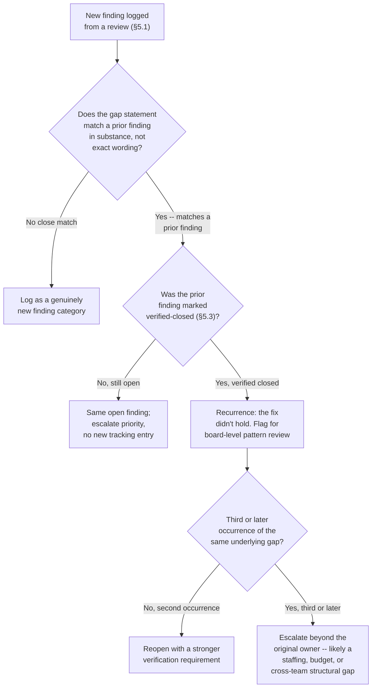
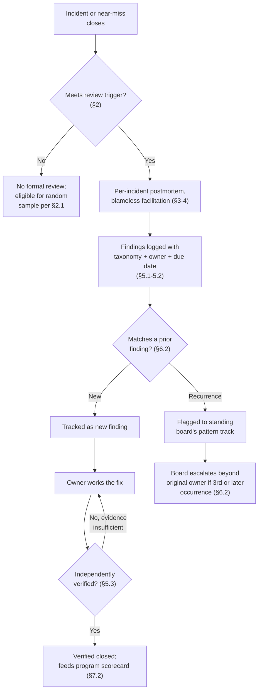

# Part 29 — Post-Incident Organizational Review

## Why this part exists

**[CONCEPT]** Most SOCs that have run for more than a year or two already hold a postmortem after a serious incident. Fewer of them can answer a harder question: has this specific finding — this exact root cause, worded slightly differently each time — shown up in a postmortem before? A single well-run postmortem can be excellent on its own terms: a clear timeline, an honest account of what went wrong, a list of fixes everyone in the room agrees to. None of that guarantees the fix survives past the meeting, and none of it tells anyone, six incidents and 14 months later, that the team is looking at the same underlying gap for the third time. This part is about the layer above any individual postmortem — the standing program that decides which incidents get reviewed, who sits in the room across dozens of reviews rather than just one, and the tracking system whose entire job is making a repeat finding visible before it becomes a fourth incident.

**[CONCEPT]** SOC Playbook Handbook, Part 35 — Playbook Failure Examples already owns the individual-breakdown lens: it walks specific playbooks that failed in specific incidents, the exact step that broke, and the mechanical fix to that playbook. This part does not re-walk that ground and does not build a second catalog of failed playbooks. Its unit of analysis is the pattern across many incidents' findings, not the mechanics of any one incident's breakdown — a program-level question about whether the organization is actually learning, not a technical question about what one playbook got wrong.

**[CONCEPT]** Two assumptions carry over from earlier in this book rather than getting rebuilt here. Part 19 — Team Culture & Psychological Safety establishes blameless postmortem culture as a precondition — the belief, earned through consistent practice, that naming a mistake honestly will not end a career. This part assumes that precondition exists, or is actively being built, and focuses on the program mechanics that sit on top of it; it does not re-argue why blamelessness matters. Part 28 — The Manager's Role in a Major Incident covers what the manager personally does while the incident is still live — staffing surge, board communication, decision authority. This part picks up exactly where that one ends: the incident is over, and now someone has to decide whether it gets reviewed, by whom, on what timeline, and what happens to what the review finds.

**[CONCEPT]** Four mechanics make up the program this part builds: trigger criteria that decide which incidents and near-misses earn a full review (§2); the cadence and participant structure across both the single-incident meeting and a standing review board that looks at many incidents together (§3–4); a corrective-action tracking system built specifically to catch a repeat finding before it becomes a third incident (§5); and the pattern-detection discipline that only exists at the organizational level, never inside any one incident's own review (§6). Appendix A7 carries the fillable post-incident organizational review template and corrective-action tracker this part builds toward.

## 1. From a good postmortem to a program that remembers

### 1.1 What changes when the unit of analysis is the program, not the incident

**[CONCEPT]** A single postmortem answers "what happened in this incident, and what should we do differently." A program answers a different question entirely: "across every incident we've reviewed this year, is the same underlying gap showing up more than once, and is anyone actually watching for that." Those two questions need different infrastructure. The first needs a good meeting, a skilled facilitator, and an honest room. The second needs a place all those meetings' findings actually land — a registry that persists after the meeting ends, survives the facilitator moving to a different role, and can be queried across 12 months of incidents at once rather than read one report at a time.

**[SENIOR MANAGER]** Most SOCs that think they have a mature postmortem practice actually have a mature postmortem *meeting* practice and nothing at the program layer. Every serious incident gets a well-attended review, a clear document, and a list of action items assigned to named owners — and every one of those documents lives in its own folder, named after its own incident, never rolled up anywhere a manager could see that "insufficient EDR console access during off-hours" has now appeared as a finding in three unrelated documents across the last year. The meeting practice is genuinely good. The program is missing, and it's the program's job — not any single meeting's job — to notice the third occurrence.

### 1.2 Blameless as an assumed precondition

**[HR/PEOPLE]** Everything this part builds — trigger criteria, participant lists, a tracking system — depends on the room being honest about what actually happened, and a room is only honest under that pressure if psychological safety already exists as a lived norm, not a slide in the kickoff deck. Part 19 develops what that actually requires: consistent practice over time, leadership that visibly protects someone who names their own mistake, and enough repetition that "blameless" stops being a word management says and becomes a thing analysts have personally tested and found true. A manager standing up the program below in an organization where that precondition doesn't yet hold should expect the first several reviews to under-report — people will talk around the real cause rather than name it — and should treat that as a signal to invest in Part 19's groundwork before assuming this part's mechanics are the missing piece.

> **Cross-Book Pointer**
> This part does not walk individual playbook breakdowns — SOC Playbook Handbook, Part 35 — Playbook Failure Examples already owns that ground in detail, with specific playbooks and the specific step that failed inside each one. Reach for Part 35 when the question is "what exactly broke in this one incident's response"; stay here when the question is "is this the second or third time something like this has broken across different incidents, and does anyone have a system that would even notice."

## 2. Trigger criteria: which incidents earn a full review

### 2.1 Severity as the backbone trigger

**[SENIOR MANAGER]** A program that reviews every closed ticket, the way Part 15's QA program deliberately doesn't, drowns in review overhead before it produces anything useful; a program that only reviews the incidents that made the news gets an unrepresentative sample from the opposite direction. The workable middle, and the one most mature programs converge on, ties the trigger to the severity classification SOC Playbook Handbook, Part 29 — Playbook Severity Model already defines: every incident scored at the top one or two severity tiers gets a mandatory full organizational review, full stop, with no manager discretion to skip it. This part does not redefine that severity scale — it consumes the tier boundary as an already-settled input, the same way Part 9 consumes it for queue-health diagnosis.

**[SENIOR MANAGER]** Below that mandatory line, most programs add a discretionary trigger: any incident commander, team lead, or the SOC manager can request a full review regardless of severity score, and a fixed, small percentage of lower-severity closures get pulled at random on the same logic Part 15's QA sampling uses — not because most of them need a full review, but because a severity score assigned in the heat of the incident is itself sometimes wrong, and a random floor catches the review-worthy incident that a rushed scoring call underrated.

### 2.2 The near-miss trigger most programs skip

**[CONCEPT]** Safety-engineering research going back to Heinrich's 1930s accident-ratio studies — since revised and criticized on its exact numbers, but not on its central claim — argues that near-misses vastly outnumber the incidents that actually cause damage, and that the near-misses carry most of the same causal information at a fraction of the cost of learning it. A SOC's version of a near-miss is a real one: an alert that should have fired and didn't, a playbook step that got skipped and happened not to matter this time, an analyst who noticed something felt wrong and escalated on instinct rather than because any tool told them to. None of these produce an incident. All of them can produce the same finding an incident eventually would, before the incident happens.

> **Blind Spot**
> A trigger list built only from realized incidents systematically excludes exactly the events most likely to contain a preventable finding before it costs anything — the near-miss where the team got lucky rather than got it right. A program that reviews every P1 but has no path for an analyst to flag "this almost went badly and I don't think anyone else knows how close it was" is watching only the incidents where luck ran out, and missing every one where it happened to hold.

**[FRONTLINE MANAGER]** The practical fix costs almost nothing: a standing, low-friction path — a single form field, a Slack command, a line item at shift handoff — for any analyst to flag a near-miss for review, with an explicit norm that flagging one is treated the same as reporting any other honest finding, never as an admission of fault. The volume this produces is usually modest — most programs report single-digit near-miss flags a month even in a busy SOC — which is exactly why it's cheap to run and easy to justify keeping even when budget pressure targets the review program first.

## 3. Cadence and participants: two layers, not one

### 3.1 The per-incident postmortem: timing and facilitation

**[FRONTLINE MANAGER]** The single-incident review has a timing window worth defending explicitly: run it too soon and the room is still in triage mode, relitigating disposition instead of reviewing process; wait too long and memory degrades, people move to other incidents, and the review becomes an argument about what the logs say rather than a shared account of what happened. 5 to 10 business days after the incident closes is the range most programs converge on — long enough for the immediate adrenaline to clear and the full timeline to be assembled, short enough that everyone in the room still remembers the incident as something they lived through rather than something they're reconstructing from a ticket.

> **Manager's Note**
> Never schedule the review for the same day the incident closes, even when everyone's calendar is technically free that afternoon and the temptation to "just get it done" is real. The people who worked the incident are still running on the adrenaline that made triage decisions feel obvious in the moment; give it at least a couple of days before asking them to evaluate those same decisions with a clear head.

**[FRONTLINE MANAGER]** Facilitation is a role, not a volunteer job that falls to whoever's in the room with the most seniority. The facilitator's only job is protecting the process — keeping the room on "what happened and why" rather than "whose fault was it," making sure the quietest person in the room gets asked a direct question before the loudest person gets to summarize for everyone, and closing the meeting with named owners and dates rather than a vague consensus that something should probably get fixed eventually. A facilitator who also worked the incident is compromised in exactly the way a reviewer scoring their own report is compromised in Part 15's QA program — rotate the role, or pull a neutral facilitator (a peer team lead from a different shift, an HR/People partner trained for it) from outside the incident's own chain.

### 3.2 The standing review board: the layer that watches the watchers

**[SENIOR MANAGER]** Nothing above this line requires anyone to look across incidents — every mechanic so far lives inside one incident's own review. The standing review board is the piece that exists purely to look sideways: a fixed group that meets on its own cadence, independent of any single incident's timing, and reads a rolling batch of recent postmortem summaries together specifically looking for the pattern no single incident's own room would ever be positioned to see. A monthly cadence is the common default for a SOC running enough volume to generate more than one or two full reviews a month; a quarterly cadence is reasonable for a smaller team where monthly would mean reviewing the same one or two incidents' findings repeatedly with nothing new to compare them against.

**[SENIOR MANAGER]** Board membership should be smaller and more stable than any single incident's review room: the SOC manager, one or two rotating team leads, a detection-engineering or threat-hunting representative when a finding trends technical, and — critically — someone who was not personally involved in most of the incidents under review that cycle, playing the same outside-perspective role the facilitator plays inside a single review. The board's output is not a new set of individual incident findings; it's a short, standing list of patterns — findings that have now shown up more than once, worded differently each time, that no single incident's review room had the visibility to notice on its own.

### 3.3 Who owns what, across both layers

**[SENIOR MANAGER]** The table below states accountability across the two layers this section builds — the per-incident review and the standing board — because the most common governance failure in this program is treating them as the same meeting with the same owner, which quietly starves the board layer of the independent attention it needs.

**Table 29.1 — Post-incident review RACI, per-incident review vs. standing board.** *(CONCEPTUAL SAMPLE.)* Use this table when review ownership is informal or when the standing board keeps getting cancelled in favor of "we already covered that in the incident's own review" — a sign the two layers have collapsed into one.

| Activity | SOC Manager | Incident Commander / Facilitator | Team Leads | Analysts Involved | Standing Review Board |
|---|---|---|---|---|---|
| Decide if an incident meets the review trigger | A | C | I | I | I |
| Facilitate the per-incident review | I | R | C | C | — |
| Assign corrective-action owners from that review | A | R | C | I | — |
| Log findings to the corrective-action tracker | I | R | I | I | I |
| Review a rolling batch of findings for recurring patterns | C | I | C | I | R/A |
| Escalate a confirmed pattern to budget or staffing decisions | A | I | C | I | R |
| Report program health metrics upward | A | I | I | — | C |

**[SENIOR MANAGER]** The row worth reading twice is pattern review: the standing board is both responsible and accountable for it, and nobody else on the table shares that row at more than a consulted level. That's deliberate — pattern detection is the one activity in this whole program that a per-incident review room structurally cannot do well, because it only ever sees one incident's findings at a time.

## 4. Keeping the review blameless when it counts, not just in the charter

### 4.1 Facilitation mechanics that actually protect the room

**[HR/PEOPLE]** Saying a review is blameless in the meeting invite protects nobody. What actually protects the room is a small set of enforced mechanics: the facilitator opens by naming the norm out loud every time, not just the first time the program ran; questions are phrased about the system, not the person ("what made it hard to see this in time" rather than "why didn't you catch this"); and the write-up that leaves the room describes actions and timeline, never attributing a mistake to a named individual in the document that circulates beyond the room itself. None of this is about hiding accountability — a manager still knows, and still handles, an individual performance issue through Part 16's process where one genuinely exists. It's about making sure the review's own document never becomes the mechanism that punishes someone for being honest in the room that produced it.

### 4.2 Management Autopsy — the review that named names

> **Management Autopsy — "publish the incident timeline with the analyst's name attached" (COMPOSITE CASE EXAMPLE, `CASE-2901`)**
>
> **The decision:** A 25-analyst in-house SOC ran a full postmortem after a missed lateral-movement indicator sat unescalated for six hours during a real intrusion. The write-up, circulated to the SOC manager's own leadership chain and a handful of stakeholders outside the SOC, named the analyst who missed the escalation directly in the timeline: "Analyst Rivera reviewed the alert at 02:14 and closed it as a false positive without checking the associated process tree."
>
> **Why it seemed reasonable:** The timeline needed to be specific and accurate to be useful, and the facilitator reasoned that naming who did what was simply factual — no different from naming which tool generated which alert. Leadership had also asked for "accountability" in the wake of the incident, and a document that read as vague about who did what risked looking evasive.
>
> **How it failed:** Within two review cycles, the volume of near-miss flags and the honesty of what analysts volunteered in reviews both measurably dropped — one flag the following month against a running average of four to six a month in the prior half-year, and the reviews that did happen produced timelines noticeably thinner on the specific judgment calls analysts had made in the moment. Two senior analysts, in separate 1:1s unrelated to each other, told their team lead directly that they'd stopped volunteering details in reviews "in case it ends up in a document with my name on it going to people outside the team." The program had accidentally taught the floor that a postmortem's write-up was a risk to personal reputation, not a shared account of what happened — and once that lesson lands, it's expensive to unlearn even after the practice changes, because the first bad instance is the one people remember.
>
> **The fix:** The write-up format changed permanently: the document that circulates beyond the review room itself never names an individual analyst against a specific action — "the reviewing analyst," "the on-call engineer," roles rather than names. A separate, narrower record — visible only to the SOC manager and, where relevant, HR/People — exists for the rare case where an individual performance issue genuinely needs to be tracked, kept entirely apart from the postmortem document and routed through Part 16's process instead of living inside the incident review's own paper trail.

### 4.3 Field Test — validating psychological safety in the room, not assuming it

> **Field Test**
> **Setup:** A postmortem program has been running for at least two full review cycles, with a stated blameless norm but no direct measurement of whether the room actually believes it.
> **Action:** Immediately after a review meeting, send an anonymous two-question pulse survey to every attendee: "Did you say everything relevant in that room, or did you hold something back?" and "Would you flag a near-miss you personally caused, based on what you just saw happen in that meeting?"
> **Expected result:** A healthy program should see the large majority answer "said everything" and "yes, I would flag it." A meaningful share answering "held something back," especially concentrated among more junior or newer attendees, means the stated norm and the room's actual experience of the norm have diverged — treat that as a signal to revisit facilitation mechanics (§4.1) before running another cycle, not as noise to average away over time.

## 5. The corrective-action tracking system

### 5.1 What a tracked finding actually needs to contain

**[SENIOR MANAGER]** A finding that leaves a postmortem as a bullet point in a document and never becomes a structured record in a persistent system is, functionally, not tracked at all — it exists exactly as long as someone remembers to reread that specific document, which in practice means it exists for a few weeks. A tracked finding needs, at minimum: a plain-language statement of the gap (not the fix — the gap itself, stated so a reader six months later understands what was actually wrong); a category from a fixed taxonomy (§5.2); a named owner who is a person, not a team; a due date; a verification method stated in advance — what evidence would prove this is actually fixed, decided before anyone's incentive to declare victory early kicks in; and a link back to the incident or near-miss that produced it, so a later reviewer can trace a pattern to its origin incidents rather than working from the finding's text alone.

### 5.2 Taxonomy: routing a finding to where its real fix lives

**[SENIOR MANAGER]** The single most common way a corrective-action tracker turns into a graveyard is a finding assigned to "the SOC" with no category and no clear sense of which part of the organization's own toolkit actually owns fixing it. A fixed, small taxonomy solves most of that, because it forces the question "which kind of gap is this, actually" at the moment the finding is logged, not months later when nobody remembers the incident well enough to reconstruct it.

**Table 29.2 — Finding taxonomy: category, what it looks like, where the real fix lives.** *(CONCEPTUAL SAMPLE.)* Use this table at the moment a finding is logged, not after — categorizing a finding correctly up front is what lets the pattern-detection work in §6 actually function across a full year of tracked findings.

| Category | What It Looks Like in a Postmortem | Where the Real Fix Lives |
|---|---|---|
| Staffing / coverage gap | "Nobody with the right access was on shift when this needed a decision" | This book, Part 5 — Headcount & Capacity Modeling, Part 6 — Shift Pattern & Coverage Design |
| Training / competency gap | "The analyst didn't know this escalation path existed" | This book, Part 10 — Competency Models & Skills Matrices, Part 12 — Ongoing Training & Skill Development |
| Detection debt / rule gap | "The rule that should have caught this was never tuned after it started firing on the wrong thing" | Detection Engineering Handbook V2, Part 43 — Detection Debt |
| Playbook / process gap | "The playbook's escalation step assumed access this analyst didn't have" | SOC Playbook Handbook, Part 35 — Playbook Failure Examples |
| Tooling / vendor gap | "The EDR console was down for maintenance and nobody had a fallback" | This book, Part 21 — Tooling Procurement & Platform Strategy, Part 23 — Vendor Relationship & Renewal Management |
| Cross-team / access gap | "IT hadn't provisioned the access this role needed for six weeks" | This book, Part 26 — Cross-Team Politics & Stakeholder Alignment |

> **Cross-Book Pointer**
> A finding that traces back to a detection rule that should have caught something and didn't is a real, common outcome of a postmortem — and it is not this book's finding to fix. Detection Engineering Handbook V2, Part 43 — Detection Debt owns the technical framework for scoring and prioritizing exactly that gap. This part's job stops at correctly categorizing the finding and routing it there with enough context (the incident, the specific rule, the specific miss) that a detection engineer isn't starting from zero.

### 5.3 Verification, not a status field that says "closed"

**[SENIOR MANAGER]** A corrective action closed on the strength of the owner's own word that it's done is closed in the tracker and nowhere else. Verification means someone other than the owner checks the stated evidence against the stated method from §5.1 before the status changes — a second person confirming the access was actually granted and actually works, not a ticket number that shows a request was filed. This is the exact discipline Part 15's QA program applies to a ticket score: a self-report is cheap and mostly right, but the cases where it's wrong are exactly the ones a program most needs to catch, and a program that never independently checks will never find out which cases those were.

> **Operational Reality**
> Most corrective-action trackers report a healthy closure rate and are, in practice, full of findings marked "closed" because the owner filed a request with another team and treated the filing itself as the fix. The tracker's own status field can't distinguish "the access was granted and verified working" from "a ticket exists somewhere in a different system that may or may not ever get actioned" unless verification is a separate, checked step — and if it isn't, the tracker's closure rate is measuring paperwork completion, not risk actually reduced.

> **People Risk Trap**
> Letting the same person who owns a corrective action also be the one who marks it verified concentrates exactly the same conflict Part 15 names for QA reviewers scoring their own reports — a busy owner under pressure to show progress has every incentive to call something done a little earlier than the evidence supports, not out of dishonesty but because "probably fine now" and "verified fine" feel like the same thing when you're the one who did the work. Route verification to someone other than the owner, even when that adds a short delay to closing the item — the delay is the cost of the check actually meaning something.

### 5.4 Sizing the program: a worked cost example

**CONCEPTUAL SAMPLE — illustrative program-sizing math for a 40-analyst SOC; not sourced benchmark data.**

A 40-analyst in-house SOC runs, in a typical year, about 18 incidents that meet the mandatory top-tier severity trigger from §2.1, plus roughly 40 additional reviews pulled from the discretionary and random-sample triggers in §2.1–2.2 — 58 full reviews a year in total. Each review averages six attendees for 90 minutes (nine person-hours in the room) plus about three hours of facilitator time for scheduling, timeline assembly, and write-up — 12 person-hours per review before any corrective-action follow-up is counted. At 58 reviews, that's 696 person-hours a year just running the meetings.

Each review produces, on average, about three or four tracked findings; call it 3.4 across the mix of severities, or roughly 197 tracked findings a year across the whole program. Verified follow-up on a finding — an independent check against the stated evidence in §5.3, not just a status-field update — runs about one hour per finding on average, split across the owner's time and the verifier's time. That adds another 197 person-hours a year. Total program cost: roughly 893 person-hours a year, or about $62,510 annually at a blended fully-loaded cost of $70 an hour — split across a facilitator role (often the SOC manager or a rotating team lead), the standing review board's members, and whoever verifies closures, rather than one dedicated headcount line most SOCs this size would ever separately budget for.

**[SENIOR MANAGER]** That figure is worth saying out loud to whoever eventually asks why the review program needs protected time, because the alternative — the program running informally, on whatever time people find between other duties — doesn't make the cost disappear. It moves the cost into overtime, into reviews that get rushed or skipped when the queue is busy, or into the recurring-finding cost the next section quantifies, which is consistently larger than the cost of running the program properly in the first place.

## 6. Detecting patterns a single incident review can never see

### 6.1 Why the single-incident lens structurally can't do this

**[CONCEPT]** Ask the facilitator of any one incident's review whether this finding has happened before, and the honest answer is usually "I don't know" — not because the facilitator is careless, but because the question requires remembering or searching across every other review this year, which is exactly the job nobody in a single-incident review room has time or mandate to do in the middle of running that meeting. SOC Playbook Handbook, Part 35 — Playbook Failure Examples has the same structural limit from the other direction: its catalog documents what broke in specific playbooks with real precision, but organizing by playbook, not by underlying cause, isn't built to answer "how many of the playbook failures documented there, across this SOC's own incidents, actually trace back to the same access gap." Pattern detection needs a different vantage point entirely — which is exactly what §3.2's standing board exists to provide.

### 6.2 The recurring-finding registry and its dedup logic

**[SENIOR MANAGER]** The mechanism that makes pattern detection possible rather than aspirational is a registry — the same tracker from §5, queried specifically for recurrence rather than for open-item status. Every time a new finding is logged, the review board's real work (not the per-incident facilitator's) is asking one question against the accumulated history: does this finding's plain-language gap statement (§5.1) match, in substance rather than exact wording, a finding already logged and supposedly closed within roughly the last 12 to 18 months? "The on-call engineer lacked read access to the EDR console" and "the responding analyst couldn't pull EDR telemetry without escalating for access" are different sentences describing the same gap, and a registry that only matches on exact text will miss that every time.

**Figure 29.1 — Is this a new finding or a recurrence? Decision logic for the standing review board.** *CONCEPTUAL.* Illustrates the judgment sequence the board applies to a newly logged finding before deciding whether it represents fresh information or evidence that a previously "closed" corrective action didn't actually hold. It is a decision-support diagram for the board's own recurring review, not an automated matching algorithm. Diagram ID `FIG-2901`.

**[SENIOR MANAGER]** The branch worth reading twice is the last one: a finding that recurs a third time after being verified closed twice is rarely still a single owner's problem to fix with a slightly better version of the same corrective action. Three verified-and-failed fixes at the same underlying gap is evidence the original owner didn't have the authority, budget, or standing to actually close it — which routes the finding up to whatever this book's Part 25 — Risk Acceptance & Manager Decision-Making Under Uncertainty would treat as a resourcing or risk-acceptance call, not a fourth attempt at the same fix that already failed twice.

### 6.3 Management Autopsy — the finding that closed three times

> **Management Autopsy — "close the access finding and move on" (COMPOSITE CASE EXAMPLE, `CASE-2902`)**
>
> **The decision:** Across 14 months, a mid-sized MSSP SOC's postmortems produced the same underlying finding three separate times, worded differently each time: after a ransomware-precursor incident in month two ("on-call responder lacked EDR console access outside business hours"), after a credential-stuffing incident in month nine ("the analyst escalating overnight had to wait for a manager to grant temporary access before pulling telemetry"), and after a data-exfiltration near-miss in month 14 ("the on-call engineer's access request during the incident took 40 minutes to approve"). Each time, the corrective action — "provision standing off-hours EDR access for the on-call rotation" — was assigned, given a 30-day due date, and marked closed within that window.
>
> **Why it seemed reasonable:** Each individual review had no visibility into the other two — different incident commanders, different months, no standing board yet cross-checking findings against each other. Each owner filed a real IT ticket requesting the access change, in good faith, and treated the filed ticket as sufficient evidence to close the postmortem's action item, which is exactly the failure §5.3's Operational Reality box describes.
>
> **How it failed:** The underlying IT access-provisioning ticket, in a completely separate system from the postmortem tracker, sat unresolved all three times — deprioritized against IT's own competing work each time, with nobody in the postmortem tracker's chain positioned to see that the same request had already stalled twice before. No individual acted in bad faith at any point; the failure was structural — closing a postmortem action on "a ticket was filed" instead of "the access was verified working" (§5.3), with no registry (§6.2) checking whether this exact gap had already supposedly been fixed twice before.
>
> **The fix:** The tracker adopted verified-closure as a hard requirement (§5.3), and the standing board began checking every new finding against the prior 18 months of history (§6.2) before a facilitator's proposed corrective action was accepted as adequate. The third occurrence, once correctly flagged as a repeat rather than logged as a fresh finding, got escalated past the original individual owner to a cross-team meeting between the SOC manager and IT leadership — the access provisioning finally happened as a standing, audited grant within two weeks of that escalation, after 14 months of the same gap surviving three separate "fixes."

### 6.4 What a good closure rate can still hide

> **What Would Change My Mind**
> This part treats verified corrective-action closure and low recurrence as the two numbers that together indicate the program is actually working, with closure rate alone treated as insufficient (§5.3, `CASE-2902`). If a program with a consistently high closure rate and a consistently low measured recurrence rate still produced a steady stream of near-identical incidents that the tracker never once flagged as connected, that would undermine this part's confidence that the dedup logic in §6.2 is sufficient — it would suggest the taxonomy or the matching judgment itself is missing a category of connection between findings that plain-language matching can't catch, and the board's review method, not just its inputs, would need to change.

## 7. Program governance: the pipeline, the scorecard, and reporting it upward

### 7.1 The pipeline, end to end

**[CONCEPT]** Figure 29.2 ties Sections 2 through 6 together into the single pipeline a finding travels from the moment an incident closes to the point it either verifies closed or surfaces as a pattern the standing board has to act on.

**Figure 29.2 — The post-incident organizational review pipeline, incident close to verified closure or pattern escalation.** *CONCEPTUAL.* Illustrates the sequence this part's sections build: trigger evaluation, per-incident review, taxonomy-tagged findings entering the tracker, verified closure, and the recurring-finding check that routes a repeat into the standing board's pattern-review track. It is a structural process diagram, not a capture of any specific ticketing tool's workflow. Diagram ID `FIG-2902`.

### 7.2 A program-health scorecard

**CONCEPTUAL SAMPLE — illustrative program-health figures for the same 40-analyst SOC modeled in §5.4; not sourced benchmark data.**

**Table 29.3 — Program-health scorecard, trailing 12 months.** *(CONCEPTUAL SAMPLE.)* Use this table (or Appendix A7's fillable version) as a standing quarterly report to whoever the SOC manager answers to — it is the set of numbers that actually answers "is this program working," as distinct from "did the meetings happen."

| Metric | Trailing-12-Month Figure | What It Actually Tells You |
|---|---|---|
| Trigger-eligible incidents reviewed within the 10-business-day target | 19 of 22 (86%) | Whether the per-incident layer is running on schedule, not whether it's any good |
| Findings verified-closed within their stated due date | 61% | Whether the tracker's closure discipline (§5.3) is holding, distinct from raw closure rate |
| Findings later flagged as a recurrence of a previously verified-closed finding | 14% of closed findings | The number that most directly indicates whether fixes are actually holding — this book's central program metric |
| Near-miss flags logged per month (rolling average) | 5 | Whether the low-friction near-miss path (§2.2) is actually being used, not just documented |
| Findings escalated to a cross-team or budget decision after a 3rd-or-later occurrence | 2 | How often the program is catching a structural gap before a fourth incident, rather than after |

**[SENIOR MANAGER]** The 14% recurrence figure is the one worth defending in a budget conversation over the 86% on-schedule figure, even though the schedule number looks more impressive on its own — a program that reviews everything on time but keeps re-closing the same three findings is running an expensive theater of diligence, and the recurrence number is what actually distinguishes that from a program that's making the SOC measurably harder to surprise twice the same way.

### 7.3 Field Test — proving the registry actually catches a repeat

> **Field Test**
> **Setup:** A corrective-action tracker with at least 12 months of history and at least one previously verified-closed finding whose underlying gap is plausibly still present somewhere in the environment.
> **Action:** Deliberately draft a new, differently worded finding describing the same underlying gap as a prior verified-closed item — phrase it as if it came from a fresh, unrelated incident — and submit it into the standing board's next pattern-review cycle through the normal intake path, without flagging to the board in advance that it's a test.
> **Expected result:** The board's dedup check (§6.2) should catch the match and correctly identify it as a probable recurrence rather than logging it as a new, unrelated finding. If it doesn't — if the differently worded version sails through as brand new — the matching judgment is relying on exact wording rather than substance, and the registry is not actually doing the job this section claims it does.

### 7.4 Reporting the program upward

**[EXECUTIVE]** A board or CISO conversation about incident-response maturity usually gravitates toward response time and containment speed, both genuinely important and both owned by SOC Playbook Handbook's metrics and this book's own Part 24 — Executive & Board Reporting for how to frame them upward. The recurrence rate from §7.2 belongs in the same conversation for a different reason: it's the single number that answers "does this organization actually learn from an incident, or does it just recover from one," and a board asking whether a repeat of last year's breach is more or less likely this year is really asking exactly that question, whether or not they'd phrase it that way.

## 8. Where this goes next

**[CONCEPT]** This part built the standing program as four connected mechanics: trigger criteria that decide which incidents and near-misses earn a review without drowning the program in overhead; a two-layer cadence — the per-incident postmortem and the standing board that watches across many of them — with ownership split cleanly between the two; a corrective-action tracker that treats a self-reported "closed" as worthless without independent verification; and a recurring-finding registry that gives the organization, for the first time, a way to notice its own third mistake before a fourth incident forces the question. Appendix A7 carries the fillable post-incident organizational review template and corrective-action tracker (`TMPL-2901`, `TMPL-2902`) built on the structure in §3 and §5. Nothing past this point should need to re-derive what a tracked, verified finding is for — it should assume the registry exists and query it.

---

## Cross-references

**Within this book:** Assumes Part 19 — Team Culture & Psychological Safety for the blameless precondition this program's facilitation mechanics (§4) depend on rather than rebuild, and Part 28 — The Manager's Role in a Major Incident, whose close is where this part's trigger evaluation (§2) picks up. Cross-references Part 15 — Quality Assurance Programs for the calibration and independent-verification discipline this part's tracker (§5.3) reuses; Part 5 — Headcount & Capacity Modeling, Part 6 — Shift Pattern & Coverage Design, Part 10 — Competency Models & Skills Matrices, Part 12 — Ongoing Training & Skill Development, Part 21 — Tooling Procurement & Platform Strategy, Part 23 — Vendor Relationship & Renewal Management, and Part 26 — Cross-Team Politics & Stakeholder Alignment as the destination owners named in the finding taxonomy (Table 29.2); Part 25 — Risk Acceptance & Manager Decision-Making Under Uncertainty for the resourcing call a third-or-later recurrence escalates into (§6.2); and Part 24 — Executive & Board Reporting for framing the program's recurrence-rate metric upward (§7.4). Points forward to Appendix A7 — Executive, Board & Risk-Acceptance Templates, which carries the fillable review and tracker templates this part's Section 3 and Section 5 build toward.

**Other volumes:** SOC Playbook Handbook, Part 35 — Playbook Failure Examples, for the individual-breakdown, single-playbook lens this part deliberately does not re-walk. SOC Playbook Handbook, Part 29 — Playbook Severity Model, for the severity tiers this part's trigger criteria (§2.1) consume as an already-settled input. Detection Engineering Handbook V2, Part 43 — Detection Debt, for the technical framework a detection-debt-category finding (Table 29.2) routes to rather than being fixed inside this program.
