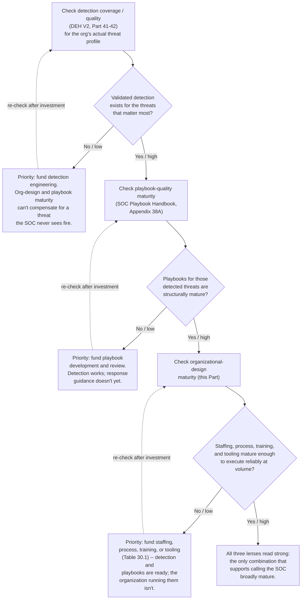

# Part 30 — SOC Maturity Models

## Why this part exists

**[CONCEPT]** A board member, a new CISO, or an auditor eventually asks some version of the same question: how mature is this SOC? The honest answer depends entirely on which of three completely different things the question is actually about, and a manager who answers with a single number has almost certainly picked the wrong one without realizing it. This part builds the maturity model this book owns outright: an organizational-design maturity model scored across four dimensions — staffing ratios, process maturity, training-program maturity, and tooling maturity — that describes whether the SOC has the people, the discipline, and the stack to execute reliably. It says nothing about whether what the SOC executes is any good, which is the entire reason two other maturity models exist in this series and are not re-derived here.

**[CONCEPT]** SOC Playbook Handbook's playbook-maturity model, built out in Appendix 38A, scores individual playbooks for structural quality — completeness, clarity, whether the steps actually produce the hand-off SOC Playbook Handbook, Part 27 — Escalation Quality requires. Detection Engineering Handbook V2's coverage and quality parts — Part 41 — Detection Coverage and Part 42 — Detection Quality — score whether a validated, tested detection exists for a given technique in the organization's threat profile, and whether that detection performs well once it exists. Neither model is re-explained in the pages that follow; both are cited, by name and part number, exactly where a manager needs to bring their output into this part's own model. This part's job is the fourth lens the other two don't cover — the organization running the playbooks and the detections — and, in §4, a synthesis table for reading all three lenses at once without letting a strong score on one stand in for the other two.

## 1. Why three maturity models, and why they don't collapse into one

**[CONCEPT]** A maturity model earns its keep by telling a manager where to invest next. That only works if the model's unit of analysis matches the thing the investment decision is actually about — headcount and process money buys a different outcome than detection-engineering money, which buys a different outcome again than a playbook-rewrite sprint. Collapse three models with three different units of analysis into one composite score and the number that survives the collapse can rise for reasons that have nothing to do with the risk a board actually cares about — a strong quarter of hiring and onboarding can lift a blended score even while the organization's actual detection coverage sits exactly where it did the quarter before. §6 works through a real version of that failure in detail.

**[SENIOR MANAGER]** The three models also have three different natural owners inside most organizations, which is a second, more practical reason not to merge them. A detection engineer or detection-engineering lead owns the inputs to DEH V2's coverage and quality scoring — telemetry availability, rule logic, test results. A senior analyst or team lead who writes and reviews playbooks owns the inputs to SOC Playbook Appendix 38A. The SOC manager — the reader of this book — owns the inputs to this part's model: the headcount number, the QA program, the training budget, the tooling stack. A single blended score has no natural owner, because no single role controls all the inputs that move it, and a metric nobody owns tends to drift unmaintained until the day it's needed for something important.

> **Cross-Book Pointer**
> This part does not score playbook quality — whether a specific playbook's steps are complete, clear, and produce a hand-off that meets the standard SOC Playbook Handbook, Part 27 — Escalation Quality sets. That's SOC Playbook Handbook, Appendix 38A — the Playbook Maturity Model, which this part treats as a finished lens with its own output, not as raw material to re-derive. Go there for the mechanics of scoring an individual playbook; come back here once you have that score and want to read it alongside the organizational picture built in §2–§4.

> **Cross-Book Pointer**
> This part does not score whether a validated detection exists for a given technique, or whether that detection performs well in production — that's Detection Engineering Handbook V2, Part 41 — Detection Coverage and Part 42 — Detection Quality, which build the technique-by-technique tiered coverage model and the precision/recall measures behind it. This part takes a coverage or quality figure from those parts as a finished input, the same way it takes a headcount ratio as its own output — neither model owes the other a rebuild.

**[CONCEPT]** None of this means the three models are unrelated, only that they measure different things and need to stay legible on their own before anyone reads them together. §4 is where they actually get read together, on purpose, with a synthesis table built for exactly that job.

## 2. The four dimensions of organizational-design maturity

**[CONCEPT]** Each of the four dimensions below already has its own full treatment earlier in this book — this section's job is not to re-teach headcount modeling, QA program design, training strategy, or tooling procurement, but to define what "more mature" concretely looks like along each one, in a form that can be scored. Table 30.1 lays out five levels across all four dimensions; the subsections that follow explain the reasoning behind a handful of the more consequential jumps between levels.

### 2.1 Staffing-ratio maturity

**[SENIOR MANAGER]** Staffing-ratio maturity asks whether headcount and the ratios built on top of it — analyst-to-shift-lead, analyst-to-QA-reviewer, concurrent seats to volume — are set by a defensible, maintained model or by whatever the org chart happened to inherit. Part 5 — Headcount & Capacity Modeling builds the actual arithmetic (segmented volume and handle time, the shrinkage stack, coverage-hours reconciliation); this dimension asks whether that arithmetic, or something like it, is actually being run, on a cadence, against real data, rather than defended once at budget time and never revisited.

**[SENIOR MANAGER]** The jump from a merely documented ratio to a mature one is the same jump Part 5 §7 makes between a mean-based model and one stress-tested against a high-percentile volume day. A SOC that can state "we run a 1:8 analyst-to-lead ratio" has cleared a real bar over having no stated ratio at all — but a SOC that can additionally show that ratio held during a documented volume surge, with a named overflow lever that was actually exercised rather than only written down, has cleared a materially higher one. Table 30.1's Level 4 and Level 5 rows draw that line explicitly.

### 2.2 Process maturity

**[SENIOR MANAGER]** Process maturity asks whether the SOC's internal quality mechanics — QA sampling, calibration, onboarding structure, escalation criteria — exist as a documented, running program or as tribal knowledge held by whichever senior analyst has been there longest. Part 15 — Quality Assurance Programs is the fullest expression of one process-maturity input: a sampling methodology sized to a real reviewer-hour budget, a calibration practice with a measured inter-rater agreement threshold, and a score-to-coaching pipeline that reaches the analyst rather than sitting in a spreadsheet.

**[SENIOR MANAGER]** The distinction that matters most here is between a process that exists on paper and one that's been checked to actually run the way it's described. Part 15 §5.4's Field Test — asking analysts directly whether a low score actually produced a coaching conversation within about two weeks — is the concrete version of the question this dimension is really asking: not "is there a QA policy document," but "does the policy document describe what's actually happening." A SOC that has the document but has never run that check is, for maturity-scoring purposes, in a materially different place than one that has run it and passed.

### 2.3 Training-program maturity

**[HR/PEOPLE]** Training-program maturity asks whether onboarding, ongoing skill development, and career progression form a connected system or a set of disconnected activities — a new-hire packet here, a conference-attendance budget line there, a promotion decided informally when someone finally asks. Part 11 — Onboarding & Ramp-Up Programs, Part 12 — Ongoing Training & Skill Development, and Part 13 — Career Ladders & Promotion Criteria each own one stage of this dimension; Part 10 — Competency Models & Skills Matrices supplies the shared vocabulary — "ready for L2," "ready for promotion" defined in observable terms — that a mature training program uses consistently across all three stages rather than reinventing at each one.

**[HR/PEOPLE]** The clearest, cheapest signal of where a SOC sits on this dimension is whether ramp-to-independent-triage time is tracked at all, and whether it's trending in a direction anyone can point to. A SOC that can say "new analysts reach independent triage in roughly 90 days, down from around 130 two years ago, after we restructured onboarding around Part 11's shadowing sequence" is describing a managed system. A SOC that can only say "it takes a few months, depends on the person" has a training activity, not a training program, regardless of how much money is being spent on it.

### 2.4 Tooling maturity

**[VENDOR/PROCUREMENT]** Tooling maturity asks whether the SIEM/EDR/SOAR/TIP stack — and everything layered around it — reflects a rationalized set of deliberate procurement decisions with tracked total cost of ownership, or a history of whoever won the last vendor bake-off, with nothing formally retired since. Part 21 — Tooling Procurement & Platform Strategy owns the selection mechanics (PoC criteria, reference calls, TCO modeling that includes migration and retraining cost); Part 23 — Vendor Relationship & Renewal Management owns what happens after signing, including the tool-sprawl problem this dimension is most often failing on.

**[VENDOR/PROCUREMENT]** The sharpest test of tooling maturity is not how good the current stack looks in a vendor demo — it's whether the organization has ever actually retired a tool. Three case-management platforms doing overlapping work because none was ever formally sunset is a common, specific symptom, not a hypothetical one, and it's cheap to check for directly: ask how many licensed security tools are currently active, how many of them a new hire would need explained to them in onboarding, and how many have had zero material usage growth in the past year. A SOC that has never sunset a tool in its operating history, regardless of how modern its current top-line platform is, has not yet reached the higher levels of this dimension.

**Table 30.1 — Organizational-design maturity, five levels across four dimensions.** *(CONCEPTUAL SAMPLE — illustrative level definitions built from this book's own models in Parts 5, 10–15, and 21; not a sourced external framework.)* Use this table to place a SOC on each dimension independently before doing anything else with the result — §3 shows why scoring each row separately, rather than jumping straight to an average, is the entire point.

| Level | Staffing-ratio maturity | Process maturity | Training-program maturity | Tooling maturity |
|---|---|---|---|---|
| 1 — Ad hoc | Headcount set by budget headroom; no stated ratio; hiring purely reactive to resignations | No documented QA sampling; escalation criteria live in one person's head | No training budget line; certifications reimbursed case by case | Tool chosen by whoever had signing authority; overlapping tools never retired |
| 2 — Developing | A headcount number exists from a single flat annual average, set once and unrevisited | A QA checklist exists; one reviewer uses it; no calibration ever run | A fixed onboarding checklist exists; ongoing training is opportunistic | A documented tool list exists; no TCO tracked; PoC criteria reinvented each purchase |
| 3 — Defined | Headcount segmented by shift/time block (Part 5 §5–§6); a stated ratio target (e.g., `1:8`) exists | A sampling methodology (Part 15 §2) and written rubric exist; calibration happens irregularly | A structured 90-day onboarding plan; a per-analyst training budget; a competency matrix (Part 10) exists but isn't consistently used | A rationalized core stack with documented ownership; renewal dates tracked centrally |
| 4 — Managed | Headcount rebuilt on a fixed cadence against real volume and shrinkage (Part 5 §8); variance from the ratio target is explained to the budget owner | Calibration runs on a fixed cadence with a measured inter-rater agreement threshold (Part 15 §3.3); the QA-to-coaching pipeline has passed a Field Test | Career ladder with observable promotion criteria (Part 13); ramp-to-productivity time is tracked and trending down | TCO tracked per tool, including migration/retraining cost (Part 21); a documented vendor risk-scoring process exists |
| 5 — Optimizing | Model includes a tested surge/overflow lever (Part 5 §7.2, Part 22); backfill lag (Part 18) is modeled into approved headcount | QA findings demonstrably change behavior (Part 15 §5.4 passes repeatedly); the process-maturity score itself is re-audited annually | Mentorship/succession plan removes single-person dependency (Part 14); competency data drives hiring-bar and headcount decisions before a gap appears | At least one redundant tool has actually been retired in the past cycle, not just flagged for retirement; renewal negotiation is informed by measured utilization |

## 3. Scoring a SOC: a worked walkthrough

**[SENIOR MANAGER]** `CASE-3001` below is a composite, illustrative organization built to show a specific, common outcome: once a SOC is scored honestly across all four dimensions, the four scores are almost never the same, and the gap between them is the most useful piece of information the exercise produces.

COMPOSITE CASE EXAMPLE (`CASE-3001`) — illustrative organization and figures, constructed to demonstrate uneven dimension scoring; not drawn from a single traceable real SOC.

**The environment:** A 35-analyst regional MSSP SOC, three years past its initial buildout, scored against Table 30.1.

**Staffing-ratio maturity — Level 3.** Headcount is segmented by shift and rebuilt roughly once a year against the prior year's volume, with a documented `1:9` analyst-to-lead ratio. The model has never been stress-tested against a P90 volume day, and there is no named overflow lever — the ratio is real and defensible, but nobody has checked what happens to it on a bad week.

**Process maturity — Level 2.** A QA rubric exists and one senior team lead reviews a sample of tickets against it. No second reviewer has ever scored the same batch, and no calibration session has been run in the program's three-year history — the reviewer's judgment has never been checked against anyone else's.

**Training-program maturity — Level 4.** A structured onboarding sequence, a competency matrix tied to promotion criteria, and a tracked ramp curve are all in place; new analysts reach independent triage in roughly 97 days, down from about 130 days two years earlier, after onboarding was restructured around graduated shadowing.

**Tooling maturity — Level 2.** Three separate case-management platforms are active in production: a legacy tool from the SOC's original buildout, a second inherited when the MSSP acquired a competitor's client base, and the current nominal standard. No formal TCO comparison or consolidation plan exists for any of the three.

**Table 30.2 — `CASE-3001` scorecard.** *(COMPOSITE CASE EXAMPLE.)* Use a scorecard like this one to record the evidence behind each dimension's score, not just the level number — the evidence is what a skeptical budget owner or board member will actually ask about.

| Dimension | Level | Evidence | Gap to next level |
|---|---|---|---|
| Staffing-ratio maturity | 3 — Defined | `1:9` ratio documented; segmented headcount rebuilt annually | Rebuild on a fixed quarterly cadence; add a tested overflow lever |
| Process maturity | 2 — Developing | Rubric exists; single reviewer, no calibration ever run | Add a second reviewer and run a calibration session per Part 15 §3.2 |
| Training-program maturity | 4 — Managed | Tracked ramp curve (130 to 97 days); competency-linked career ladder | Add a mentorship/succession layer per Part 14 to reach Level 5 |
| Tooling maturity | 2 — Developing | Three overlapping case-management platforms; no TCO tracked | Run a consolidation TCO analysis per Part 21; retire at least one platform |

**[SENIOR MANAGER]** A manager who averages these four scores — (3 + 2 + 4 + 2) ÷ 4 = 2.75 — gets a number that rounds to "somewhere between Developing and Defined" and tells the budget owner almost nothing useful. The organization is not uniformly mediocre; it has a genuinely strong training program sitting next to a process-maturity gap serious enough that no QA score in this SOC's three-year history has ever been checked against a second reviewer's judgment. The averaged number obscures exactly the fact that matters most for deciding what to fund next quarter: process maturity, not training, is the dimension carrying the most unmanaged risk, and it's also the cheapest of the four to fix — a calibration session (Part 15 §3.2) costs a handful of reviewer-hours, not a hiring cycle or a platform migration. Report the four scores separately, every time; an average is a worse version of the same information this part exists to surface clearly.

> **What Would Change My Mind**
> This part treats staffing ratios, process maturity, training-program maturity, and tooling maturity as the four dimensions that make up organizational-design maturity, on the claim that they're the right set to score independently. If a SOC scored at Level 4 or 5 on all four and still failed to execute reliably during a real major incident, for a reason not explained by any weakness in those four dimensions, that would mean a real fifth dimension is missing from this model — and it would need to be named and added on its own terms, not folded into whichever of the existing four seems closest.

## 4. Reading three lenses together, not one number

**[SENIOR MANAGER]** Table 30.1 and `CASE-3001` cover this book's own lens in isolation. A manager rarely gets to stop there — a board asks about overall SOC maturity, not just the organizational slice of it, and the honest answer requires bringing in the other two models this part deliberately doesn't re-derive. Table 30.3 lays out what each of the three lenses actually measures, what a high score on it does and doesn't tell a manager, and the specific conflation trap each one invites.

**Table 30.3 — Three maturity lenses, read side by side.** *(CONCEPTUAL SAMPLE — synthesis built from this book's own model and the stated scope of the other two volumes' models; not a re-derivation of either.)* Use this table before presenting any maturity figure to a board or CISO — it's the check for whether the figure being presented answers the question that was actually asked.

| Lens | Owning model | Unit of analysis | A high score tells you | A high score does *not* tell you | Common conflation trap |
|---|---|---|---|---|---|
| Organizational-design maturity | This book, Part 30 | The program: staffing, process, training, tooling | The SOC has the people, discipline, and stack to execute reliably at volume | Whether what it executes — the playbooks, the detections — is any good | Assuming a well-run team is automatically well-defended |
| Playbook-quality maturity | SOC Playbook Handbook, Appendix 38A | One playbook, scored for structural completeness and clarity | The response guidance for a given scenario is well-written, complete, and produces a proper hand-off | Whether staff are trained and resourced to run it under pressure, or whether the alert that triggers it exists at all | Mistaking well-documented playbooks for a rehearsed, resourced response capability |
| Detection coverage/quality maturity | Detection Engineering Handbook V2, Parts 41–42 | One ATT&CK technique or analytic, scored for telemetry existence and validated detection tier | The org can technically see and reliably flag the specific threats in scope | Whether anyone is staffed and trained to respond once it fires, or whether the response guidance for that alert is any good | Assuming strong detection automatically means a strong overall security program |

**[SENIOR MANAGER]** The three lenses have a natural reading order, not because one matters more than the others in the abstract, but because each one is a precondition for the next one mattering at all. A perfectly staffed, perfectly trained team running a beautifully written playbook against a technique with no working detection never gets the call — organizational maturity and playbook maturity are both irrelevant to an attack the SOC never sees. A validated detection paired with no usable playbook produces an alert nobody knows how to act on correctly. Only once both of those hold does organizational-design maturity — the lens this part owns — determine whether the response actually happens reliably, at the volume and speed a real incident demands, rather than by heroics from whichever analyst happens to be sharpest that day.

**Figure 30.1 — Reading the three maturity lenses in sequence.** *CONCEPTUAL.* Illustrates a defensible default order for bringing the three models together when deciding what to fund next — detection coverage first, playbook quality second, organizational design third — rather than a claim that any one lens is intrinsically more important. It is a decision-sequencing diagram, not a scoring method for any of the three models it references. Diagram ID `FIG-3001`.

**[SENIOR MANAGER]** The sequence in Figure 30.1 is a default, not a rule that overrides judgment. §7 comes back to what happens when two or three lenses are simultaneously weak and only one investment can be funded this cycle — that's a resourcing tradeoff, and this book's own Part 25 — Risk Acceptance & Manager Decision-Making Under Uncertainty owns the judgment call, not this part.

> **What Would Change My Mind**
> This part defaults to reading the three lenses in the order detection coverage, then playbook quality, then organizational design, on the claim that each is a precondition for the next one mattering. If a well-documented case existed where a coverage gap was actually caused by an organizational-design failure — understaffed detection engineering, not a technical blind spot — and fixing the organizational problem directly closed the coverage gap faster or more cheaply than a detection-engineering-first investment would have, that would argue the sequencing in Figure 30.1 isn't universal, and the honest default should be "diagnose the root cause across all three lenses before assuming detection always goes first," not a fixed order.

## 5. Worked case: when the three lenses disagree

**[SENIOR MANAGER]** `CASE-3002` below shows the three-lens synthesis doing its actual job — catching a combination of scores that looks fine on any single lens and is not fine once read together.

COMPOSITE CASE EXAMPLE (`CASE-3002`) — illustrative organization, figures, and incident narrative, constructed to demonstrate the risk of reading one maturity lens in isolation; not drawn from a single traceable real SOC or incident.

**The environment:** A 60-analyst enterprise in-house SOC, scored across all three lenses ahead of an annual security-committee review.

**Organizational-design maturity (this part's model): Level 4 — Managed.** Headcount is rebuilt quarterly against actual volume and shrinkage, holding a `1:7` analyst-to-lead ratio within a stated band. QA calibration runs quarterly with measured inter-rater agreement at 88%. A career ladder with observable promotion criteria is in place, and the tooling team retired one of two overlapping SOAR platforms in the past year after a documented TCO comparison.

**Playbook-quality maturity (SOC Playbook Handbook, Appendix 38A): reported strong.** Ninety percent of the SOC's Ransomware and Insider Threat playbook categories score at Appendix 38A's top quality tier, per the SOC Playbook Handbook's own scoring output — a genuinely strong result on that model's own terms, taken here as a finished input rather than re-checked.

**Detection coverage/quality maturity (Detection Engineering Handbook V2, Parts 41–42): weak.** Only 35% of the ATT&CK techniques in the organization's own documented threat profile sit at DEH V2's validated-detection tier; the remaining majority sit at a lower tier — telemetry exists, but no tested, tuned analytic has been built and confirmed against it.

**[SENIOR MANAGER]** Read on its own, the organizational-design score supports a genuinely positive report: a Level 4 program, staffed, trained, and processed to a real standard. Read alongside a strong playbook-quality figure, the combination looks even better — a well-run team with well-written response guidance. Neither fact changes what the detection-coverage figure is actually saying: for roughly two-thirds of the techniques this organization has told itself to worry about, no validated detection exists to trigger either the mature team or the mature playbook in the first place.

**What happened next:** A ransomware intrusion in this composite case used a lateral-movement technique that sat at DEH V2's lower coverage tier — telemetry existed, but the analytic had never been built and tested. No alert fired for that stage of the intrusion. The organization only engaged its Ransomware playbook once a later, unrelated detection tripped much further into the intrusion than the coverage model, had it been funded, would have allowed. The post-incident review — run per this book's own Part 29 — Post-Incident Organizational Review — found that once the playbook was engaged, the team executed it well: staffing surge worked as designed, the playbook's steps were followed correctly, and Appendix 38A's own quality score for that playbook held up under real use. The organizational-design and playbook-quality maturity this SOC had actually earned were both real, and neither one was the reason the intrusion ran as long as it did.

> **Blind Spot**
> Organizational-design maturity, scored the way this part scores it, has no visibility into whether the detections and playbooks it's executing are any good. A Level 5 staffing, process, training, and tooling program run against a detection portfolio that hasn't been meaningfully touched in years scores exactly as high on this model as the identical program run against a well-maintained one, because none of this part's four dimensions ever examine rule logic or playbook content — that's what the other two lenses are for, and `CASE-3002` is what it costs to forget that.

**[EXECUTIVE]** The report a manager should have given the security committee in `CASE-3002`, before the incident, is not "we are a mature SOC" — it's "our organization and our response playbooks are both strong; our detection coverage is not, and it's the lens that determines whether either of the other two ever gets used against a real intrusion." That framing is the one Part 24 — Executive & Board Reporting is built to help a manager deliver without either overstating confidence or burying the one number that actually mattered.

## 6. What happens when the three scores get averaged into one

**[SENIOR MANAGER]** `CASE-3002` shows what it costs to read one lens without the others. The Management Autopsy below (`CASE-3003`) shows a more specific, more common version of the same mistake: reading all three, and then compressing them into a single figure anyway.

> **Management Autopsy — "one SOC Maturity number for the board" (COMPOSITE CASE EXAMPLE, `CASE-3003`)**
>
> **The decision:** Ahead of an annual security-committee review, a SOC manager combined the organizational-design maturity level, the playbook-quality score, and the detection-coverage percentage into a single blended figure — converted onto a common 100-point scale and averaged — presented as one number: "SOC Maturity: 78/100."
>
> **Why it seemed reasonable:** The committee had explicitly asked for "one number we can track year over year" after a previous review ran long trying to reconcile three separately framed metrics in the same meeting. A single trend line looked easier to defend in a 20-minute agenda slot than three charts each needing its own context, and the manager reasoned that a rising number would still communicate "things are improving" even if the underlying mix shifted.
>
> **How it failed:** The committee watched the blended score rise from 78 to 81 to 84 across three quarters and concluded that overall risk was decreasing. Underneath that trend, the detection-coverage figure — contributing roughly a third of the composite — had not moved at all across two of those three quarters; the entire visible increase came from organizational-design gains (a new analyst cohort completing onboarding, a documentation backlog clearing) and a modest playbook-quality improvement. When a ransomware intrusion later exploited a technique that had sat at the same low coverage tier the whole time, the committee's first question in the post-incident session was how a maturity score that had been rising for three straight quarters hadn't warned anyone. The honest answer was that the averaging math had buried a flat, high-risk-relevance number inside two rising, lower-risk-relevance ones, and nobody reading the single trend line had any way to see that from the number alone.
>
> **The fix:** The three lenses are now reported as three separate trend lines on the same slide, each retaining its own unit and its own owner, never averaged into one figure. Where the committee wants a single glance across all three, the report uses a stoplight per lens — consistent with this book's own Part 24 board-reporting format — rather than a blended score a reader can't unpack. A rising organizational-design or playbook-quality trend next to a flat or declining detection-coverage trend is now visible on sight, instead of hidden inside arithmetic that treats three different kinds of risk as fungible with each other.

**[SENIOR MANAGER]** The lesson generalizes past this one case: any pressure to produce "one number" across the three models in this series should be met with a stoplight or small-multiples display, never an average. The three lenses are not different measurements of the same underlying quantity — they're measurements of three different things that all happen to matter to the same eventual outcome, and averaging quantities that aren't measuring the same thing produces a number with no defensible interpretation, however clean it looks on a slide.

## 7. Using maturity to sequence investment

**[SENIOR MANAGER]** The practical payoff of scoring all three lenses honestly, rather than reaching for a blended figure, is a defensible answer to the only question a maturity model actually needs to answer: what should get funded next. Figure 30.1's default sequence — detection coverage, then playbook quality, then organizational design — gives a starting order when a single investment has to be chosen and nothing else distinguishes the options. Table 30.1's per-dimension breakdown gives the same kind of answer inside this part's own lens once detection and playbook maturity are already accounted for: `CASE-3001`'s process-maturity gap, fixable with a handful of reviewer-hours, is a materially cheaper and faster investment than `CASE-3001`'s tooling-consolidation gap, which needs a TCO study and a migration plan before it moves at all.

**[SENIOR MANAGER]** Neither the sequencing default nor the per-dimension breakdown replaces judgment when budget is fixed and more than one lens is weak at the same time — that tradeoff, and how a manager defends it when the "wrong" lens gets funded first for a legitimate reason, is this book's own Part 25 — Risk Acceptance & Manager Decision-Making Under Uncertainty, not a rule this part can encode. What this part hands forward is the honest input to that decision: four separately scored dimensions, read alongside two other models' outputs rather than blended with them, so whatever gets funded first is a choice made with the real picture in front of it. Part 33 — The Next Twelve Months: Building a SOC Roadmap picks the resulting priorities up and sequences them into an actual roadmap; this part's job ends at producing the maturity picture that roadmap gets built from.

## 8. Where this goes next

**[CONCEPT]** This part built one of three maturity lenses in the series — staffing ratios, process maturity, training-program maturity, and tooling maturity, scored independently rather than averaged — and a synthesis table and decision sequence for reading it alongside SOC Playbook Handbook's playbook-maturity model and Detection Engineering Handbook V2's detection-coverage and quality maturity without letting a strong score on any one stand in for the others. Nothing past this point in either this book or the other two volumes should need to re-derive what "SOC maturity" means across all three lenses at once — it should cite this part's synthesis and move directly to the funding decision.

---

## Cross-references

**Within this book:** Assumes Part 5 — Headcount & Capacity Modeling for the staffing-ratio dimension's underlying arithmetic, Part 10 — Competency Models & Skills Matrices for the shared "ready for L2" vocabulary the training-program dimension reuses, Part 11 — Onboarding & Ramp-Up Programs for the ramp-structure stage that dimension scores, Part 12 — Ongoing Training & Skill Development for what a managed training program actually funds, Part 13 — Career Ladders & Promotion Criteria for the promotion-criteria stage of the same dimension, Part 14 — Mentorship & Knowledge Transfer for the succession-planning input Table 30.1 scores at Level 5, Part 15 — Quality Assurance Programs for the process-maturity dimension's sampling and calibration mechanics, and Part 21 — Tooling Procurement & Platform Strategy for the tooling-maturity dimension's TCO discipline. Points forward to Part 18 — Attrition & Retention (backfill lag as a Level 5 staffing input), Part 22 — MSSP & Managed-Service Contract Management and Part 23 — Vendor Relationship & Renewal Management (surge levers and tool-sprawl rationalization), Part 24 — Executive & Board Reporting (the stoplight format this part's §6 recommends over a blended score), Part 25 — Risk Acceptance & Manager Decision-Making Under Uncertainty (the funding tradeoff when multiple lenses are weak at once), Part 29 — Post-Incident Organizational Review (where `CASE-3002`'s incident review happens), and Part 33 — The Next Twelve Months: Building a SOC Roadmap (sequencing this part's output into a funded plan).

**Other volumes:** SOC Playbook Handbook, Appendix 38A — Playbook Maturity Model, for the playbook-quality lens this part cites in §1 and §4–§6 rather than re-scores. SOC Playbook Handbook, Part 27 — Escalation Quality, for the hand-off standard Appendix 38A's own scoring checks playbooks against. SOC Playbook Handbook, Part 32 — Metrics, for the metric definitions this book's own Part 5 and Part 24 already treat as fixed inputs. Detection Engineering Handbook V2, Part 41 — Detection Coverage and Part 42 — Detection Quality, for the detection lens this part cites in §1 and §4–§6 rather than re-derives.
