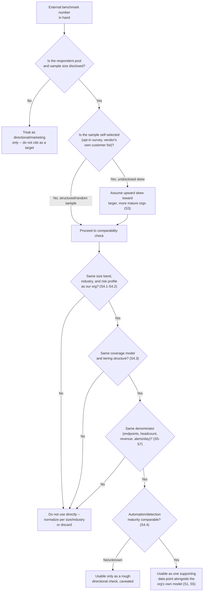

# Part 31 — Benchmarking & Industry Comparison

## Why this part exists

**[CONCEPT]** A SOC manager reaches for an outside number for one of three reasons: a board member just asked "is that normal," a budget request needs something more persuasive than "trust me," or a vendor's sales deck put a chart in front of the CISO with the manager's own ratio looking bad next to it. All three moments create real pressure to answer with a benchmark — a published staffing ratio, an SLA norm, a tooling-spend percentage — as if it were a settled external fact rather than a number somebody else produced, for their own purposes, from a population that may have nothing to do with the reader's organization. This part is about using that kind of data without being misled by it: what's actually comparable across organizations of different size, industry, and risk profile, what almost never is, and the single most common way a manager gets burned — treating a survey with an unknown, self-selected respondent pool as if it were a random, representative sample of "SOCs like mine."

**[CONCEPT]** This part does not define the metrics a benchmark compares — MTTR, handle time, false-positive rate, and the rest are fixed inputs here, defined once and precisely in SOC Playbook Handbook, Part 32 — Metrics, and every worked example below inherits those definitions rather than re-deriving them. It does not build the headcount model a staffing-ratio benchmark gets checked against — that arithmetic, including the honest failure modes of a naive model, is this book's own Part 5 — Headcount & Capacity Modeling. It does not build the budget-category structure a tooling-spend percentage is computed against — that's Part 20 — Building & Defending the SOC Budget. And it is not the same question as the internal SOC maturity model in Part 30 — SOC Maturity Models, even though the two get confused constantly: Part 30 scores your own organization against a staged internal rubric, using evidence only your own program can supply; this part compares your own numbers against other organizations' numbers, using evidence a third party collected under conditions you usually cannot fully audit. A SOC can be honestly assessed as maturity-stage three on Part 30's scale and still have no defensible answer to "are we appropriately staffed compared to peers," because those are different epistemic problems with different failure modes. What's left, and what this part actually owns, is the discipline of knowing when an external number is telling you something real about your own organization and when it's telling you something real only about whoever chose to answer a survey.

## 1. Why "are we normal" is the wrong first question

**[CONCEPT]** "Are we normal" is the question a benchmark gets asked to answer, and it's the wrong one, because normal is not the same thing as adequate. A SOC can sit exactly at the reported industry-median staffing ratio and still be dangerously thin for its own actual risk profile — a small SOC protecting a payment processor's core transaction environment has no business being staffed like the "median" respondent in a blended survey that's mostly retail and light manufacturing. The reverse also holds: a SOC can run well above every published ratio and still be correctly staffed, because its risk profile, regulatory exposure, or detection-quality debt genuinely requires more people than a peer with a cleaner environment and better-tuned detections. The number a benchmark gives back describes a population's central tendency, not a target, and not a floor.

**[SENIOR MANAGER]** The question a benchmark can actually help answer is narrower and more useful: does our own number sit so far outside the range of comparable organizations that it's worth asking why, before anyone decides whether "why" points at a real gap or at a real difference. That framing changes what a manager does with the number in three concrete ways. First, an outlier reading becomes a prompt to investigate the organization's own volume, handle time, and shrinkage data — the inputs Part 5 already builds — rather than a number to defend or attack on its own terms. Second, a benchmark that roughly matches the organization's own number is not, by itself, evidence the staffing level is correct; it only means the organization isn't unusual relative to whatever population answered the survey, which is a much weaker claim. Third, and most important, a benchmark is never a substitute for the organization's own headcount model, SLA-setting process, or budget justification — it is, at best, a sanity check layered on top of work that has to happen anyway.

> **Operational Reality**
> In practice, a benchmark number gets used backward from how it should be: a manager who already wants a budget increase goes looking for a published ratio that supports the ask, and a manager who's being asked to defend headcount goes looking for one that shows the team is already lean. Both searches will succeed, because published benchmarks vary widely enough — across vendors, years, and definitions of "analyst" — that a motivated search can usually find a supporting number in either direction. The discipline this part argues for is choosing the benchmark's source and scope before knowing what number would be convenient, not after.

## 2. Three kinds of benchmark data, and what each one actually measures

**[CONCEPT]** This part covers three specific categories of external comparison data, because each one is asked to do a different job and fails in a different way. The table below states what each one is actually measuring, where it typically comes from, and the confounder most likely to make a naive comparison wrong — read it as an index for what's covered in detail in §5 through §7, not as a complete answer on its own.

The table below supports the comparability discussion in §4 and the worked examples in §5–§7 — use it to identify which confounder to check first for whichever kind of number is in front of you.

| Benchmark Category | What It Actually Measures | Typical Source | Biggest Confounder |
|---|---|---|---|
| Staffing ratios (analyst-to-endpoint, analyst-to-lead, tier mix) | How many people a comparable organization assigned to a comparable function, at the moment they answered the survey | Vendor-sponsored "state of the SOC" surveys, industry association member polls, consultancy staffing studies | Denominator mismatch (endpoints vs. alerts vs. employees) and whether outsourced/MSSP headcount is counted at all |
| SLA and response-time norms | What response-time commitment a comparable organization has published, promised contractually, or set as an internal target | MSSP marketing materials, industry-association guidance, informal peer conversation at conferences | Conflating a contractual SLA commitment with an internal severity-driven response target — these are different instruments answering different questions, per SOC Playbook Handbook, Part 29 — Playbook Severity Model and this book's own Part 22 — MSSP & Managed-Service Contract Management |
| Tooling spend as a percentage of security budget | What share of a comparable organization's reported security spend went to SIEM/EDR/SOAR/TIP licensing and related platform costs | Analyst-firm benchmark reports, vendor total-cost-of-ownership studies, budget-consultancy surveys | The percentage's denominator is highly sensitive to headcount cost and organization size — see §7 |

**[SENIOR MANAGER]** Every category in that table shares one structural property worth naming before going further: none of them, on their own, disclose anything about whether the reporting organization's outcomes were good. A staffing ratio doesn't say whether the reporting SOC caught the incidents that mattered. An SLA norm doesn't say whether the reporting organization actually met its own published number under real incident conditions. A tooling-spend percentage doesn't say whether the reporting organization's tools produced tested, validated detection coverage or a shelf of unused modules. That gap is a blind spot every benchmark in this category shares, and it's worth returning to explicitly.

> **Blind Spot**
> A benchmark's staffing or spend number has no visibility into detection quality or missed incidents at all — a lean ratio might mean an efficient, well-automated SOC, or it might mean a SOC that's quietly under-detecting and hasn't found out yet. Detection Engineering Handbook V2's coverage, quality, and debt material (Parts 41–43) is the only place that question gets a real technical answer; no staffing or spend benchmark in this part's three categories substitutes for checking it, and a manager who reads "we're leaner than the industry average" as automatic good news, without a coverage and quality check behind it, is reading a number that was never designed to tell them that.

## 3. The self-selection problem

**[SENIOR MANAGER]** Of every mistake a manager can make with benchmarking data, this is the one worth naming first, because it silently invalidates almost everything downstream if it's not caught: most published SOC benchmark reports are built from a self-selected respondent pool, and the report rarely says so in language a busy reader will notice.

### 3.1 How a benchmark survey's respondent pool gets built

**[SENIOR MANAGER]** A typical vendor-sponsored "state of the SOC" or "security operations benchmark" report is built by emailing a survey link to a mailing list — often the vendor's own customer base, a webinar-registrant list, or an industry-association membership roll — and reporting statistics on whoever chose to click through and finish it. Nobody is randomly sampled. Nobody is required to respond. The population that actually answers is systematically different from "all SOCs" in at least three predictable ways: organizations that bought the sponsoring vendor's product are over-represented relative to the broader market, because the list the survey went to was that vendor's own customer list; organizations with more mature programs are over-represented, because a security leader with a chaotic, understaffed SOC has neither the spare time nor, often, the appetite to fill out a twenty-minute survey admitting to it; and larger organizations are over-represented among voluntary respondents generally, because they're more likely to have a person whose job includes representing the security function in public forums, conference panels, and vendor research studies.

**[SENIOR MANAGER]** None of that makes the reported numbers fabricated — the individual responses are usually genuine. It makes the aggregate statistic a description of "organizations that use this vendor's product and had the time and inclination to answer a survey," not a description of "SOCs in general," and definitely not a description of "SOCs comparable to mine." A median ratio computed from that pool is real arithmetic performed on a real but skewed sample, and the skew almost always runs in the same direction: toward larger, more mature, better-resourced organizations than the median organization actually operating a SOC today.

> **What Would Change My Mind**
> This section claims self-selected vendor and association surveys skew systematically toward larger, more mature respondents. If a benchmark report disclosed its full sampling methodology — a genuinely randomized or stratified sample drawn from a defined population, response rates by organization size band, and a comparison of respondent demographics against the target population's actual demographics — and that disclosure showed no meaningful skew, this section's caution wouldn't apply to that specific report. The claim is about the typical, undisclosed case, not about every benchmark ever published; a report that does the methodological work to rule the skew out earns a different level of trust, and the test is whether it actually published that work, not whether it claims to be rigorous.

### 3.2 Worked example: the ratio that wasn't there

**[SENIOR MANAGER]** `CASE-3101` below is a composite, illustrative mid-market logistics-company SOC — no real organization's actual figures — built to show how the self-selection problem and a quiet denominator mismatch can stack on top of each other inside the same benchmark citation.

COMPOSITE CASE EXAMPLE (`CASE-3101`) — illustrative organization and figures, constructed to demonstrate the self-selection and denominator-mismatch mechanisms together; not drawn from a single traceable real SOC.

**The setup:** A 900-employee regional logistics company runs a 26-analyst in-house day-shift SOC, with after-hours and weekend coverage handled under a co-managed MSSP contract per this book's own Part 2 — SOC Operating Models. The environment covers roughly 68,000 monitored endpoints. A vendor-published "State of the SOC" report, based on 412 self-selected respondents to an emailed survey, states a median ratio of one analyst per 1,400 monitored endpoints.

**The comparison as first read.** The organization's own raw ratio is 26 analysts against 68,000 endpoints, or one analyst per roughly 2,615 endpoints — a ratio that looks 87% thinner than the reported median. The SOC manager, preparing a headcount request, cites the benchmark directly to justify hiring 23 additional analysts — enough to bring the organization to roughly one analyst per 1,400 endpoints — and closing what the slide calls "the gap to industry median."

**What the CFO's office found on review.** Asked for the report's methodology section, the manager discovered two things the slide hadn't surfaced. First, the 412 respondents were drawn overwhelmingly from the sponsoring vendor's own enterprise EDR customer base — 78% of respondents identified as organizations with more than 5,000 employees running dedicated, fully in-house 24/7 SOCs, a materially different population from a 900-employee company running a single day shift with contracted overnight coverage. Second, the reported ratio's "analyst" count was self-reported by each respondent with no defined boundary around whether MSSP or managed-service analysts counted — meaning an unknown share of the reporting population's denominator likely included contracted headcount the way this organization's own 26-analyst figure explicitly did not, since the after-hours MSSP analysts were never counted in that number at all.

**What actually happened next.** The manager withdrew the benchmark-based request and rebuilt the headcount ask using Part 5's own segmented volume-and-shrinkage model instead, checking the organization's real ticket volume, handle time, and coverage-hours requirement against its current 26-analyst roster. That model showed a genuine, defensible gap of four analysts driven by a 22% year-over-year alert-volume increase following a recent acquisition — a smaller, better-supported number than the benchmark-driven ask, and one the CFO approved within a single review cycle because it was arithmetic the CFO's own office could check line by line, not a borrowed statistic from an undisclosed population.

**[SENIOR MANAGER]** Nothing about the benchmark report in `CASE-3101` was dishonest — the vendor genuinely surveyed 412 real security leaders and genuinely reported a real median from that pool. The failure was entirely on the reading side: treating an unaudited, self-selected, larger-and-more-mature-skewed sample's median as if it were a neutral fact about "SOCs like ours," and treating two differently defined denominators — endpoints counted one way at the reporting organizations, headcount counted one way here — as if they were the same measurement. The fix wasn't finding a better benchmark. It was going back to the organization's own model, which is where the defensible number was sitting the entire time.

## 4. What's actually comparable across organizations

**[SENIOR MANAGER]** Before any benchmark number crosses from "interesting" to "actionable," it has to survive a check against the dimensions that most often make two organizations' numbers genuinely incomparable, even when the report's own methodology is disclosed honestly. Four dimensions matter most.

### 4.1 Size

**[SENIOR MANAGER]** Organization size drives staffing and spend ratios nonlinearly, not proportionally, for a reason that has nothing to do with efficiency: fixed costs. A SIEM platform's base licensing tier, a SOAR platform's minimum seat count, a threat-intelligence feed's floor subscription price, and a shift's minimum coverage requirement (per Part 5's coverage-hours floor) all exist regardless of whether the organization has 5,000 endpoints or 50,000. A small organization pays close to the same fixed floor as a mid-size one and spreads it over a much smaller base, producing a materially higher ratio or percentage with zero difference in actual efficiency. Comparing a 5,000-endpoint organization's tooling-spend percentage against a 50,000-endpoint organization's, with no size-band adjustment, compares two different cost structures and calls the difference a management problem.

### 4.2 Industry and regulatory risk profile

**[EXECUTIVE]** A healthcare organization bound by breach-notification timelines, a payment processor under contractual card-network obligations, and a light-manufacturing company with no comparable regulatory clock are not answering the same underlying question when they set an SLA or staff a shift, even if a blended cross-industry survey reports one median number for all three. The "right" response-time target in each case is driven by the organization's own contractual and regulatory exposure — covered in this book's Part 22 — MSSP & Managed-Service Contract Management for the contract-instrument side, and by SOC Playbook Handbook, Part 29 — Playbook Severity Model for the internal severity-driven target — not by what a peer in a different regulatory posture happens to have published.

### 4.3 Coverage model and tiering

**[SENIOR MANAGER]** `CASE-3101` already showed the mechanism: a benchmark's headcount figure is only comparable to another organization's if both count the same population of people doing the same work. An organization running the fully in-house model has every analyst on its own books; one running the co-managed or MSSP-overflow model per this book's own Part 2 — SOC Operating Models has a real chunk of coverage delivered by people who never appear in its internal headcount at all. Comparing raw analyst counts across those two models without adjusting for who's actually excluded is comparing two different definitions of "staffed," not two different levels of staffing. Tiering structure compounds the same problem: a four-tier SOC with a dedicated threat-hunting function and a three-tier SOC without one will report different "analyst" counts for reasons that have nothing to do with how well either is staffed for its own tier structure, a design question this book's own Part 3 — Tiering Models: L1/L2/L3 and Beyond owns.

### 4.4 Automation and detection maturity

**[SENIOR MANAGER]** Two organizations with identical raw alert volume can have wildly different real workloads if one has invested heavily in auto-closure, auto-enrichment, and SOAR-driven remediation and the other hasn't — the filtering ratio Part 5 §2 already names as a direct multiplier on every downstream headcount calculation. A staffing benchmark that doesn't disclose or control for the respondent population's automation maturity is blending organizations that need very different headcounts to handle the same raw volume, and reading the blended median as a target for either one is a mistake regardless of how carefully every other comparability dimension was checked.

> **Cross-Book Pointer**
> This part does not cover how to decide what should be automated versus gated for human review in the first place — that design decision, and the workload reduction it produces, is SOC Playbook Handbook, Part 30 — Automation and SOAR. Read that part before trusting any staffing benchmark's implied "normal" workload per analyst; a benchmark's respondent pool almost never discloses its automation maturity, and two organizations with the same raw alert volume can need very different headcounts depending entirely on what that part's decisions already filtered out before a human ever saw the queue.

**[SENIOR MANAGER]** The table below turns §4.1 through §4.4 into a working checklist — a comparability scorecard to run against any benchmark number before using it in a real conversation, not a complete taxonomy of every way two SOCs can differ.

| Comparability Dimension | Why It Moves the Raw Number | Where This Book Covers the Adjustment |
|---|---|---|
| Organization size (headcount, revenue, endpoint/asset count) | Fixed licensing and coverage-floor costs spread over a smaller base inflate ratios and percentages with no efficiency difference | Part 5 (headcount), Part 20 (budget categories) |
| Industry vertical and regulatory obligation | Contractual and regulatory response-time clocks differ by industry regardless of what a blended survey reports | Part 22 (contract SLAs); SOC Playbook Handbook, Part 29 — Playbook Severity Model (internal severity targets) |
| Coverage/operating model (in-house, MSSP, co-managed, hybrid) | Headcount and spend figures may or may not include outsourced staff and services, changing what's actually being counted | Part 2 — SOC Operating Models |
| Tiering structure | Different tier designs produce different "analyst" headcounts for the same underlying workload | Part 3 — Tiering Models |
| Automation/SOAR maturity | The same raw alert volume can require very different headcounts depending on how much is filtered before a human sees it | SOC Playbook Handbook, Part 30 — Automation and SOAR |
| Detection quality and coverage maturity | A lean ratio may reflect efficiency or under-detection, and a staffing/spend benchmark alone cannot distinguish the two | Detection Engineering Handbook V2, Parts 41–43 |

## 5. Staffing ratio benchmarks in practice

**[SENIOR MANAGER]** With §3 and §4's cautions in place, staffing ratios still have a legitimate, narrow use: as one input among several when sanity-checking a headcount model that Part 5 has already built from the organization's own volume, handle time, and shrinkage data — never as the model itself. A Tier 1-to-Tier 2 ratio somewhere around three or four to one is a common pattern in a mature three-tier SOC, per this book's own Part 3, and a manager whose own ratio sits far outside that range — a Tier 1-to-Tier 2 ratio of ten to one, say — has a legitimate prompt to ask why, not a mandate to hire down to a specific published number.

**[SENIOR MANAGER]** The honest use of a staffing ratio benchmark is directional and comparative to the organization's own trend line over time, not absolute and comparative to an outside population. A ratio that's drifted from four Tier 1 analysts per Tier 2 analyst to nine over eighteen months, with no corresponding change in the tiering model or automation maturity, is a real internal signal worth investigating regardless of what any external survey reports — the drift itself is the evidence, and the benchmark is only useful here as a rough gut-check that the organization hasn't drifted so far from common patterns that something structural has clearly changed. Used that way, a benchmark earns a supporting role in a staffing conversation. Used as the target itself, it reintroduces every problem §3 and §4 already named.

> **Manager's Note**
> When a benchmark ratio is going to appear anywhere in a budget deck, write the comparability caveats into the deck itself, not into a footnote nobody reads — "this figure comes from a vendor survey of 412 self-selected respondents, skewed toward larger in-house SOCs; our own segmented model in Part 5 is the basis for this request, and the benchmark is included only as directional context" takes one sentence and survives a skeptical follow-up question far better than a bare chart. If you wouldn't want to defend the source out loud in the room, don't put the number on the slide.

## 6. SLA and response-time norms across risk profiles

**[SENIOR MANAGER]** SLA benchmarking runs into a comparability problem that's structural rather than statistical: "SLA" is used to mean at least two different instruments, and a benchmark report rarely says which one it's reporting. A contractual SLA is a commitment written into an MSSP or managed-detection agreement, with financial or termination consequences for missing it — this book's own Part 22 — MSSP & Managed-Service Contract Management owns that instrument. An internal severity-driven response target is a triage discipline, scored per alert against SOC Playbook Handbook, Part 29 — Playbook Severity Model's severity model, with no external party enforcing it. A published "industry-standard" fifteen-minute response time for critical alerts might describe either one, and the two carry very different consequences for missing them.

**[EXECUTIVE]** The table below illustrates why the same published SLA figure can be simultaneously too aggressive and not aggressive enough depending on the reader's own risk profile — a normalization exercise, not a comparison across real organizations (CONCEPTUAL SAMPLE).

| Sector / Risk Profile | Illustrative Published "Industry Norm" for Critical-Severity Response | Why the Norm May Not Transfer |
|---|---|---|
| Payment processing, card-network-bound | 15 minutes | The published norm may already be looser than the organization's own contractual card-network obligations; adopting it as a ceiling instead of a floor risks a real compliance breach |
| Healthcare, breach-notification-bound | 15 minutes | Breach-notification timelines are driven by discovery-to-notification clocks measured in days, not minutes; a 15-minute triage target may be far stricter than the regulatory clock actually requires, diverting resourcing from where it's genuinely needed |
| Light manufacturing, low regulatory exposure | 15 minutes | With no comparable external clock at all, the "right" number is whatever the organization's own risk appetite and Part 29 severity model set — the published norm supplies no information about what that appetite should be |

**[SENIOR MANAGER]** The practical rule this table argues for: use a published SLA norm, if at all, only as a prompt to check the organization's own contractual and regulatory obligations against its current internal target — never as a substitute for reading the actual contract language or the actual regulatory clock. A norm that happens to match an organization's current target is not evidence the target is correct; it only means the target isn't unusual, which, as in §1, is a much weaker claim than "correct for this organization's own risk."

## 7. Tooling spend as a percentage of security budget

**[VENDOR/PROCUREMENT]** Tooling-spend percentages are the benchmark category most likely to produce a number that looks alarming on a board slide for reasons that have nothing to do with overspending, because the percentage is only as meaningful as its denominator, and the denominator moves for structural reasons a percentage alone hides completely.

### 7.1 Why the percentage moves with the denominator

**[VENDOR/PROCUREMENT]** A "percentage of security budget" figure has a denominator — total security budget — that is dominated, in most organizations, by headcount cost, per the budget-category structure this book's own Part 20 — Building & Defending the SOC Budget builds. Tooling costs (SIEM, EDR, SOAR, TIP licensing) scale roughly with data volume, endpoint count, or monitored-asset count, not with analyst headcount in anything close to a one-to-one relationship — the same core platform stack can cost a broadly similar absolute dollar amount whether an organization runs eight analysts or twenty-five against a comparable environment. An organization with a smaller headcount, whether by design (heavy automation, a co-managed model) or by circumstance (a leaner team stretched thin), has a smaller denominator, and the same absolute tooling bill produces a mechanically higher percentage with zero connection to whether the tooling itself is overpriced, underused, or badly negotiated.

### 7.2 Worked example: the tooling line that looked twice the industry average

**[VENDOR/PROCUREMENT]** `CASE-3102` below is a composite, illustrative example — no real organization's actual figures — built to show the denominator effect described in §7.1 with concrete numbers.

COMPOSITE CASE EXAMPLE (`CASE-3102`) — illustrative organization and figures, constructed to demonstrate the denominator-sensitivity mechanism behind tooling-spend percentages; not drawn from a single traceable real SOC.

**The board's question.** An analyst-firm benchmark report, cited in a board briefing, states that organizations typically spend around 25% of total security budget on SOC tooling licensing. The organization's own total security budget is $4.2 million; its tooling line (SIEM, EDR, SOAR, and threat-intel licensing combined) is $1.85 million — 44% of the total. A board member asks, reasonably on its face, why the organization is spending nearly double what's apparently normal.

**The breakdown behind the number.** The organization's $4.2 million budget splits into $1.65 million in fully loaded headcount cost for a 14-analyst team plus two team leads, $1.85 million in tooling licensing, and roughly $700,000 in training, facilities, and MSSP retainer costs. The reported 25% benchmark figure, on inspection of the report's own respondent breakdown, comes disproportionately from larger in-house SOCs — a comparably sized illustrative organization in that population running 60 analysts against a $9 million total budget, with $6 million of that in headcount and $2.25 million in tooling, produces the same 25% figure the report highlights.

**What the comparison actually shows.** The two organizations' absolute tooling spend — $1.85 million versus $2.25 million — is much closer to each other than either organization's total budget or headcount, because both are monitoring a broadly comparable volume of endpoints and log sources and paying broadly comparable platform licensing for it. The percentage looks nearly double only because the smaller organization's denominator — driven by a much smaller headcount cost — is proportionally smaller, not because its tooling is overpriced or its procurement was undisciplined. Reframing the comparison around cost per monitored endpoint, rather than percentage of total budget, showed the two organizations within roughly 12% of each other — a genuinely comparable figure, unlike the original 44%-versus-25% framing.

**[EXECUTIVE]** The board conversation that followed used cost per endpoint and cost per analyst instead of percentage of total budget, disclosed the benchmark's own size-band skew per §3, and closed with a scoped, defensible follow-up: a one-time review of contract terms against two named comparable-size peers' publicly disclosed pricing, rather than an open-ended mandate to "get the percentage down to 25%" — a target that would have meant either firing tooling the SOC genuinely needed or growing headcount for reasons unrelated to actual staffing need, purely to inflate the denominator.

> **What Would Change My Mind**
> This section argues that tooling-spend percentages are usually more sensitive to headcount-driven denominator differences than to real differences in tooling efficiency. If a benchmark report normalized its percentage figure against a fixed unit — cost per monitored endpoint, cost per analyst, cost per terabyte of ingested log volume — instead of percentage of total budget, and organizations of very different sizes still showed materially different normalized figures, that would be real evidence of an efficiency difference rather than a denominator artifact, and this section's caution about the percentage framing specifically would not apply to that better-normalized figure.

## 8. A decision framework: the benchmark comparability check

**[SENIOR MANAGER]** §3 through §7 build toward one repeatable check: a short sequence of questions to run against any external number before it appears in a staffing, SLA, or budget conversation. Figure 31.1 below lays that sequence out as a decision path.

**Figure 31.1 — The benchmark comparability check.** *CONCEPTUAL.* Illustrates the decision sequence built across §3–§7 for evaluating whether an external benchmark number is usable, usable only with normalization, or not usable at all in a given conversation; it is a process model for this part's own reasoning, not a capture of any specific team's review workflow. Diagram ID `FIG-3101`.

**Figure 31.1 — The benchmark comparability check.** *CONCEPTUAL.* Renders the decision path above as a static diagram. It supports the comparability check argued for across §3–§8 and gives a manager a repeatable sequence to run before citing any external number in a real conversation. `FIG-3101`.

**[SENIOR MANAGER]** Two outcomes at the bottom of that path matter more than the others. A benchmark that survives every check still lands as "one supporting data point," never as the model itself — the organization's own Part 5 headcount model, Part 20 budget structure, or SOC Playbook Handbook Part 29 severity-driven SLA target remains the actual basis for the decision. A benchmark that fails the respondent-pool disclosure check at the very first node should be treated as marketing collateral, however polished the report looks, and citing it anywhere a skeptical follow-up question might land is a real professional risk to whoever cites it.

**[SENIOR MANAGER]** The table below turns Figure 31.1 into a standing checklist a manager can run against any specific report before it appears in a deck — a reusable credibility scorecard, not a one-time exercise for a single controversial number.

| Question to Ask of the Benchmark | Why It Matters | If You Can't Answer It |
|---|---|---|
| Who published this, and what do they sell? | A vendor surveying its own customer base structurally over-represents organizations that already bought that vendor's product | Treat the figure as marketing collateral, not an independent benchmark |
| How many respondents, and is that number disclosed? | A median computed across 40 respondents carries far more sampling noise than one computed across 4,000 | Do not cite a figure whose sample size you cannot state in the same sentence |
| How was the sample recruited? | Opt-in survey links systematically favor larger, more resourced organizations whose staff have time to answer a lengthy survey | Assume an upward skew toward size and maturity unless the report proves otherwise |
| What size, industry, and geography band is the figure sliced to? | A blended median across very different organization types describes neither type well | Only use figures sliced to your own size/industry band, or don't use the figure |
| What's the exact denominator? | Ratios and percentages with different denominators aren't comparable even when the numerator looks identical | Recompute your own figure using the same denominator before comparing anything |
| Does the figure include or exclude outsourced/MSSP headcount and spend? | A co-managed SOC's internal headcount excludes real work happening at the MSSP; an undisclosed convention compares different populations | Normalize for coverage model (Part 2) before treating the numbers as comparable |
| Does the report disclose anything about outcome quality — missed incidents, dwell time, tested coverage? | A lean ratio might reflect efficiency or under-detection, and most benchmarks can't tell you which | Treat the figure as directional only, never as evidence of good outcomes |

## 9. Using a benchmark honestly in a board or budget conversation

**[EXECUTIVE]** A benchmark's most legitimate use is exactly the use §1 already named: a sanity check that earns a place in the conversation only after the organization's own model — Part 5's headcount arithmetic, Part 20's budget structure, SOC Playbook Handbook Part 29's severity-driven SLA target — has already produced the actual number being defended. Presented that way, a benchmark strengthens a request: "our own model, built from our actual volume and shrinkage data, calls for four additional analysts; that would bring our ratio roughly in line with the range reported across comparably sized organizations in [disclosed source], though we're treating that as supporting context, not the basis for the ask." Presented the other way — leading with the benchmark and backfilling the organization's own justification afterward — invites exactly the kind of scrutiny `CASE-3101` describes, and rarely survives it intact.

> **Operational Reality**
> The version of this that shows up in real board decks is benchmark theater: a single chart, no disclosed methodology, positioned as the headline justification for a request that was actually decided on other grounds. It works until someone on the board — increasingly often, someone who has seen the same vendor's survey cited by a peer company for the opposite conclusion — asks where the number came from. Building the deck around the organization's own model from the start, with the benchmark as a one-line footnote, costs no more effort and survives that question the first time it's asked instead of the second.

**[EXECUTIVE]** Part 24 — Executive & Board Reporting owns the broader discipline of translating any operational number, benchmarked or not, into a risk narrative a non-technical board member can act on and a skeptical follow-up question won't unravel; this part's job stops at making sure the specific external numbers that narrative might lean on have actually earned their place in it.

## 10. Where this goes next

**[CONCEPT]** This part is a caution layered on top of work built elsewhere in this book, not a standalone model. Part 5's headcount arithmetic, Part 20's budget-category structure, and SOC Playbook Handbook Part 29's severity-driven SLA targets remain the actual basis for a staffing, budget, or response-time decision; this part's comparability check exists to keep an outside number from quietly displacing that work rather than supporting it. Part 30 — SOC Maturity Models picks up the adjacent, frequently conflated question of scoring the organization's own program against a staged internal rubric, which needs no external population at all and fails in almost the opposite way this part's material does — an internal maturity score can be gamed by whoever's scoring it, where a benchmark's failure mode is an unaudited outside population. Part 33 — The Next Twelve Months: Building a SOC Roadmap is the place a defensible number, benchmarked or not, ultimately has to survive contact with a real sequencing and budget plan.

---

**Cross-references.** This book: Part 2 (operating models — what a benchmark's headcount figure does or doesn't count), Part 3 (tiering structure behind a staffing ratio), Part 5 (the headcount model a benchmark checks against, never replaces), Part 20 (the budget-category structure behind a tooling-spend percentage), Part 22 (contractual SLA commitments versus internal severity targets), Part 24 (translating a benchmark-supported number into a board-ready risk narrative), Part 25 — Risk Acceptance & Manager Decision-Making Under Uncertainty (the judgment call when a defensible internal number and a comparison figure genuinely disagree), Part 30 (the adjacent but distinct internal-maturity lens), and Part 33 (where a benchmarked number has to survive a real roadmap). Other volumes: SOC Playbook Handbook, Part 29 — Playbook Severity Model (internal severity-driven response targets, as distinct from a contractual or published SLA norm) and Part 32 — Metrics (the MTTR, handle time, and volume definitions every ratio in this part treats as a fixed input); SOC Playbook Handbook, Part 30 — Automation and SOAR (the workload-filtering decisions behind any staffing benchmark's implied "normal" per-analyst load); Detection Engineering Handbook V2, Parts 41–43 (Detection Coverage, Detection Quality, Detection Debt — the outcome-quality question no staffing or spend benchmark in this part can answer on its own).
