# Part 32 — AI, Automation, and the Future Shape of the SOC

## Why this part exists

**[CONCEPT]** Two different questions get asked in the same sentence more often than any other topic in this book: "how do we use an AI copilot in triage" and "what does an AI copilot do to my headcount plan." They sound like the same question, and they aren't. The first is a workflow-mechanics question — which tool, which prompt pattern, which human-review gate, how a copilot's suggested disposition gets verified before a ticket closes — and SOC Playbook Handbook, Part 31 — AI-Assisted SOC Operations already owns that ground. The second is a staffing and organizational-design question with no home in either companion volume, because neither one is written from the chair that decides how many Tier 1 analysts a SOC needs once a real share of what those analysts used to do by hand gets dispositioned before a human ever opens the ticket. This part is that second question, and only that second question.

The distinction is load-bearing, not academic. A manager who reads SOC Playbook Part 31, learns how to gate an AI-suggested disposition behind a confidence threshold, and stops there has learned how to run this month's queue more efficiently. Nothing in that material tells the same manager whether a headcount plan built for a three-tier model six months ago is still the right plan, what a competency matrix should certify once a copilot does the technical legwork a Tier 1 anchor used to test for directly, or what a manager actually owes the analyst whose job just got smaller. Those are the three questions this part answers, in the same name-the-number register the rest of this book uses for every other staffing decision — not "AI is transforming the SOC," but which specific tasks are gone, which headcount number moves as a result, and what happens to the specific people who used to do those tasks.

This part assumes Part 3's tiering vocabulary and Part 10's four-axis competency framework already exist as artifacts a reader can point to — it revisits both directly, in §4 and §5, rather than rebuilding either from scratch. It also assumes the headcount-modeling mechanics from Part 5 — Headcount & Capacity Modeling and the cross-training program from Part 12 — Ongoing Training & Skill Development as tools this part routes decisions into rather than re-derives.

## 1. The displacement question: what AI actually removes from a Tier 1 queue, task by task

**[CONCEPT]** "AI is automating Tier 1" is not a claim a manager can act on, because Tier 1 is not one task. Part 3 defines Tier 1 as intake, known-pattern triage, and escalation of what doesn't fit — but that single sentence covers at least seven distinguishable activities, and an AI copilot or agentic workflow doesn't touch all seven the same way. Unbundling them is the first, most concrete thing this part does, because a headcount or competency decision built on the unbundled version and one built on the collapsed version produce different, and sometimes opposite, answers.

**[SENIOR MANAGER]** The table below scores each Tier 1 activity against how exposed it actually is to displacement as of this writing, not how exposed a vendor pitch deck claims it is. "High" exposure means a well-tuned agentic workflow can complete the task end to end for the majority of instances without a human touching the ticket first; "low" means the task still requires a human judgment call that current tooling cannot reliably make on its own (CONCEPTUAL SAMPLE — illustrative exposure ratings based on the current state of commercially available SOAR-plus-LLM triage tooling, not a validated measurement study).

| Tier 1 task | Automation exposure | What's left for the analyst |
|---|---|---|
| Known-pattern intake and auto-closure of confirmed benign or duplicate alerts | High | Auditing a sampled share of autonomous closures (§4); handling the residual low-confidence tail the model routes back |
| Initial context enrichment — asset owner, identity history, prior dispositions, threat-intel lookups | High | Judging when the assembled context is wrong, stale, or missing something the tool had no reason to check |
| Executing a documented, fully deterministic playbook step sequence | Medium-high | Playbook branches with an undocumented judgment call still route to a human; writing that branch down at all is SOC Playbook Handbook's territory, not this part's |
| Drafting an escalation note from raw ticket data | Medium | Verifying the draft is accurate before it meets the hand-off bar SOC Playbook Handbook, Part 27 — Escalation Quality defines |
| Ambiguous severity judgment with no clean playbook match | Low | This is the judgment axis Part 10 §3.4 defines directly; still squarely human work |
| Recognizing a genuinely novel technique the existing analytics weren't built to catch | Low | A copilot pattern-matches against what it's seen; a technique outside that distribution is invisible to it precisely because nothing flagged it as worth flagging |
| Hostile, urgent, or emotionally loaded stakeholder communication | Very low | The communication axis (Part 10 §3.3); a distressed stakeholder on a live call does not want to be routed to a bot, and routing them to one is a trust cost this book returns to in §6 |

**[SENIOR MANAGER]** Read down that table and a pattern falls out that the single word "automation" hides: the top three rows are volume — the things Tier 1 does the most often, at the least depth per instance. The bottom three rows are judgment — the things Tier 1 does least often, at the most depth per instance. High-volume, low-depth work is exactly what current AI-assisted triage displaces well, and low-volume, high-depth work is exactly what it doesn't. That's not a coincidence; it's the same mechanism that made tiering itself a good idea in Part 3 — a cheap filter absorbing the routine majority so an expensive resource spends time on the minority that needs it. AI-assisted triage is a second filter stacked in front of the first one, not a different kind of thing.

> **Cross-Book Pointer**
> This part does not cover how to build or gate the automation described in the table above — the confidence-threshold design, the human-review checkpoint, the specific prompt and tool-chain architecture that makes an agentic disposition trustworthy enough to run unattended. SOC Playbook Handbook, Part 31 — AI-Assisted SOC Operations owns that in full, and SOC Playbook Handbook, Part 30 — Automation and SOAR owns the broader automate-versus-gate decision this table's exposure ratings assume is already being made well. Read those for how to build the thing; this part only asks what having built it does to your org chart.

**[SENIOR MANAGER]** One number is worth naming even though it can't be sourced to a single validated study: SOCs running a mature AI-assisted triage layer against a high-volume, high-duplication alert stream report absorbing somewhere in the range of 40% to 65% of what previously required a human touch on the top three rows of the table above, measured in ticket-count terms, within 12 to 18 months of a serious rollout (CONCEPTUAL SAMPLE — illustrative range synthesized from the pattern this book's case examples below draw on, not a sourced industry benchmark). That range is wide on purpose. It depends heavily on how duplicative and low-context the alert stream already was — a SOC with high detection debt and a noisy rule set (the same variable Part 3 §6.1 names as a driver of tiering fit in the first place) has more of exactly the kind of alert an automated triage layer is good at absorbing, and a SOC that already tuned its detections well has less of that fat to cut.

## 2. The volume cliff: what a real drop in Tier 1 volume does to a tiering model built for the old volume

**[SENIOR MANAGER]** Part 3's tiering-fit scorecard treats alert volume as one of four variables that decides whether tiering earns its cost. A serious automation rollout doesn't change the SOC's total risk exposure — it changes that one variable, sharply, inside a single budget cycle, while the other three (team size, hiring-pool skill floor, detection debt) move much more slowly if at all. A tier boundary drawn for 4,000 alerts a day reaching a human doesn't automatically stay the right boundary once that number drops to 1,800, even though nothing else about the SOC's risk profile changed.

**[SENIOR MANAGER]** Four things can happen to the capacity a volume drop frees up, and a manager who doesn't choose deliberately among them will get the fourth one by default, which is usually the worst option:

- **Shrink Tier 1 headcount to match the new volume.** The straightforward option, and the right one when the freed capacity has nowhere useful to go and the SOC genuinely was overstaffed relative to its new, lower ticket count.
- **Redeploy freed capacity upward, into Tier 2 or a specialist bench-depth gap.** The right option when Part 12's cross-training matrix already shows a gap — recall the bench-depth matrix in Part 12 §3.2, where several specialist functions sat one person short of target. A shrinking Tier 1 queue is a scheduling opportunity to close exactly that gap, using people who already know the environment.
- **Convert the surviving Tier 1 seats into an oversight function auditing the automation itself.** Covered in full in §4 — someone has to check that the automated disposition layer is actually right, and that job is a genuinely new kind of Tier 1 work, not the old kind at lower volume.
- **Do nothing yet, because the volume drop isn't confirmed to be stable.** The default outcome, and the dangerous one if it isn't a deliberate choice: a manager who hasn't decided watches headcount sit idle against a queue that shrank months ago, until someone above them notices the gap and makes the call unilaterally, usually as a layoff rather than a redeployment.

> **Operational Reality**
> A vendor's pilot numbers almost always overstate the volume reduction a production rollout will actually sustain, because a pilot runs against a curated slice of the queue chosen to make the tool look good, and a 90-day pilot window rarely survives a full seasonal cycle of alert-volume variance. Treat a vendor's claimed absorption percentage as a ceiling to test against your own ticket data over a full quarter, not a number to build next year's headcount plan around on day one.

## 3. Two SOCs, the same volume drop, opposite outcomes

**[SENIOR MANAGER]** The choice among those four options is easiest to see concretely against two SOCs that started from a similar position and picked differently. Both are composite, illustrative constructions, not traceable real organizations.

**CASE-3201 — the redeployment path.** *COMPOSITE CASE EXAMPLE — merges patterns from several mid-sized in-house SOCs that rolled out AI-assisted triage in 2025–2026; no single organization's staffing or figures are reproduced.* A 30-analyst in-house SOC — 18 Tier 1, 8 Tier 2, 4 specialist — deployed an AI-assisted disposition layer against its highest-duplication alert categories. Over 12 months, measured ticket-count absorption on those categories reached 55%, freeing roughly the equivalent of six full-time Tier 1 seats' worth of capacity. The SOC made no involuntary reductions. It let attrition — assumed here at an illustrative 20%-a-year baseline (CONCEPTUAL SAMPLE; Part 18 documents the tenure-at-departure timing behind burnout-driven exits but doesn't itself publish an aggregate annual rate) — absorb two of the six freed seats over the year without backfilling them, redeployed three analysts into a Part 12 cross-training rotation targeting the two specialist functions already sitting a person short of target bench depth, and created one new "disposition audit" seat (§4) sampling and re-reviewing the AI layer's autonomous closures. Fully loaded Tier 1 cost held roughly flat at around $1.1 million a year (16 seats at a blended $70,000 fully loaded cost, CONCEPTUAL SAMPLE), but the SOC exited the year with two additional specialist-capable analysts it hadn't budgeted a new hire for, and a documented, growing false-negative catch rate from the audit seat that the SOC could show a CISO as evidence the automation was actually safe to keep expanding.

**CASE-3202 — the layoff path.** *COMPOSITE CASE EXAMPLE — merges patterns from several publicized and privately reported AI-driven SOC headcount reductions; no single organization's figures are reproduced.* A comparably sized SOC deployed a similar tool against a similar alert mix, measured a similar absorption rate within the first two quarters, and reduced Tier 1 headcount from 18 to 11 in a single reduction-in-force inside a 60-day window, timed to capture the projected savings in the same fiscal year the tool was purchased. No cross-training rotation, no audit seat, no communicated plan for the remaining analysts beyond "the tool will handle more of the volume now." Within two quarters, voluntary attrition among the surviving 11 Tier 1 analysts ran at roughly double the SOC's prior baseline — exit interviews (Part 18's structured methodology) cited "no confidence in job security" and "unclear what's expected of me now" as the two most common themes. Separately, and more expensively: the automation layer's absorption had been measured on ticket count, not on investigative depth, and the tickets that still reached a human were disproportionately the harder, more time-consuming ones the tool had never touched — average per-ticket handle time for the surviving Tier 1 group rose by roughly 35% within the same two quarters, largely erasing the headcount savings the reduction was built to capture. The SOC re-hired three Tier 1 seats within nine months, at a market rate roughly 12% above what the departed analysts had been paid, plus a full ramp cycle (Part 11) for each replacement.

**[SENIOR MANAGER]** Both SOCs measured the same absorption number. The difference in outcome wasn't the tool — it was whether the freed capacity was routed to a deliberate destination or left to default into a layoff sized to whatever the volume number implied on paper. §6 develops the retraining and communication obligation this comparison turns on; the decision tree below is the routing logic CASE-3201 followed and CASE-3202 skipped.

```mermaid
flowchart TD
    A["AI-assisted disposition layer\nabsorbs a measured share of\nTier 1 known-pattern volume"] --> B{"Absorption confirmed stable\nacross a full quarter,\nnot just a pilot window?"}
    B -->|No| C["Hold headcount; keep measuring.\nDo not backfill attrition yet,\nbut do not reduce either."]
    B -->|Yes| D{"Does Part 12's cross-training\nmatrix show an existing\nbench-depth gap?"}
    D -->|Yes| E["Redeploy freed capacity into\nthe gap via a paired rotation\n(Part 12 §3)"]
    D -->|No| F{"Is autonomous-disposition\naccuracy independently\naudited yet (§4)?"}
    F -->|No| G["Convert one or more freed\nseats into a disposition-audit\nrole before reducing anything"]
    F -->|Yes, and no gap exists| H{"Is the volume drop large\nenough that even audited,\nredeployed capacity exceeds\nrealistic near-term need?"}
    H -->|No| C
    H -->|Yes| I["Reduce headcount only through\nattrition and a communicated\nredeployment offer (§6) —\nnever a same-quarter RIF\ntimed to the tool's ROI case"]
```



**Figure 32.1 — Routing freed Tier 1 capacity after a confirmed automation-driven volume drop.** *CONCEPTUAL.* Diagram ID `FIG-3201`. Illustrates the sequence of checks a manager should run before treating a measured absorption percentage as a headcount-reduction number — confirming stability, checking for an existing bench-depth gap, and confirming audit coverage exists — before attrition-driven reduction is ever the answer. This is a decision-support diagram, not a capture of either case example's actual internal process.

**Figure 32.1 — Routing freed Tier 1 capacity after a confirmed automation-driven volume drop.** *CONCEPTUAL.* Static decision-tree diagram rendered from the Mermaid source directly above. It supports the freed-capacity routing logic §3's case comparison and §6's sequencing obligations both depend on. Diagram ID `FIG-3201`.

## 4. Extending the hand-off model: where the AI sits relative to Tier 1, not above or below it

**[SENIOR MANAGER]** Part 3 §2.4 builds a RACI matrix across the three tiers and the specialist functions. An AI-assisted disposition layer is tempting to add to that chart as a new row sitting below Tier 1 — "Tier 0" — and that instinct is worth resisting for the same reason Part 3 §3.1 rejects treating threat hunting as "L4": a tier is an org-chart position with a person accountable for it, and an automated disposition layer has no accountability of its own to assign. The accountability for what it decides still belongs to a named human, every time, even when no human looked at a specific ticket before it closed.

**[SENIOR MANAGER]** The practical fix is a confidence-threshold boundary sitting inside Tier 1's existing scope, not a new tier alongside it: dispositions the model completes above a defined confidence bar close autonomously, subject to audit (below); dispositions below that bar route to a human exactly the way an ambiguous ticket always has. The table below extends Part 3's hand-off-trigger table (§4 of that part) with the one new trigger this shift adds — it does not replace or restate the rest of that table, which still governs every Tier 1 → Tier 2 and Tier 2 → Tier 3 boundary unchanged.

| Trigger | From → To | Basis | Example Threshold |
|---|---|---|---|
| Autonomous-disposition confidence | Alert → closed, no human touch | Model's own calibrated confidence score against a validated benign/duplicate pattern | Confidence at or above a validated threshold, re-validated per §4.1 below |
| Below-threshold confidence | Alert → Tier 1 human review | Same score, below the validated bar | Any score below the validated threshold |
| Sampled autonomous closure | Closed ticket → disposition-audit review | Random sample, independent of confidence score | A fixed percentage of all autonomous closures, reviewed after the fact |

### 4.1 Why the threshold itself needs a named owner and a re-validation cadence

**[SENIOR MANAGER]** A confidence threshold is a number someone picked, usually during a vendor's initial tuning pass, and it drifts out of date the same way every other tuned threshold in this book does the moment the underlying alert mix shifts — a new detection ships, an upstream data source changes format, a threat actor starts using an infrastructure pattern the model has never seen labeled correctly. Detection Engineering Handbook V2, Part 43 — Detection Debt already names the mechanism by which an unmaintained detection threshold quietly stops matching the environment it was tuned against; the same mechanism applies to a disposition-confidence threshold, and it needs the same owner and the same re-validation discipline, not a one-time vendor configuration a manager never revisits.

**[SENIOR MANAGER]** The disposition-audit sample from the table above is what makes re-validation possible at all — without it, a drifting threshold has no feedback loop, and the first sign of trouble is a missed incident rather than a rising audit-flagged error rate. Sizing that sample is a QA-program decision in every sense Part 15 already covers: random, not risk-selected (an analyst who only samples the tickets that already look suspicious will never catch a confidently-wrong autonomous closure that looked routine), and large enough to catch a meaningful drift within a quarter rather than a year. A sample covering 5% to 10% of autonomous closures, reviewed by a human against the same disposition standard a live ticket would get, is a reasonable starting point for most volumes (CONCEPTUAL SAMPLE — illustrative sampling rate, calibrate against your own false-negative tolerance and audit capacity).

## 5. Rewriting the competency matrix for an AI-augmented Tier 1

**[CONCEPT]** Part 10 built a four-axis competency matrix — technical skill, tool proficiency, communication, judgment — anchored to what a Tier 1 analyst has to demonstrate unaided. Part 10 §7 flagged, without answering, exactly the question this section now answers: what happens to the technical-skill and tool-proficiency anchors once a copilot absorbs a meaningful share of the work those anchors used to test.

**[SENIOR MANAGER]** The honest answer is not "those axes stop mattering." It's that the specific behavior each axis certifies has to shift from *doing the task* to *supervising the tool doing the task*, and those are different skills that don't reliably co-occur — an analyst can be excellent at manually building a cross-tool query and mediocre at spotting when an AI-assembled context summary quietly dropped a relevant data source, because the second skill has never been tested until now. The table below reworks Part 10's L1 anchors for each axis; it assumes Part 10's four-axis structure and gate-per-axis rule (Part 10 §4.1) unchanged, and only rewrites what each anchor certifies (CONCEPTUAL SAMPLE — illustrative revised anchors, calibrate against your own tool's actual failure modes before adopting).

| Axis | Old L1 anchor (Part 10 §4.2) | Revised L1 anchor for an AI-augmented queue |
|---|---|---|
| Technical skill | Maps an alert to the correct playbook step unaided; explains why a match is or isn't a true positive | Independently verifies whether an AI-assembled disposition or context summary is correct before acting on it — can reconstruct the same conclusion manually, on demand, without the tool |
| Tool proficiency | Pulls the exact fields a documented playbook calls for, within SLA, unaided | Directs the AI tool effectively (prompting, scoping, escalating its output) and recognizes the specific query or data-gap patterns where the tool reliably gets it wrong |
| Communication | Escalation notes meet the SOC Playbook Handbook, Part 27 — Escalation Quality bar, with no rewrite needed | Edits an AI-drafted escalation note to the same bar and can identify, specifically, what the draft got wrong or omitted — not just accepts a fluent-sounding draft unread |
| Judgment | Applies the severity model consistently on clear-cut cases; escalates genuinely ambiguous ones instead of guessing | Same anchor, unchanged — and now tested more often, because the tickets that still reach a human are disproportionately the ambiguous ones the tool routed up |

**[SENIOR MANAGER]** Notice what the judgment row does and doesn't do: it doesn't change. That's the point, not an oversight. The judgment axis was always the hardest one to automate, per §1's task table, and an AI-augmented queue doesn't reduce how much judgment a surviving Tier 1 seat needs — if anything, it concentrates judgment demand, because the tickets that still reach a human are the ones the model's confidence threshold explicitly flagged as not confidently routine. A manager who assumes AI-augmentation lowers the overall skill bar for Tier 1 has the direction backward: it raises the average difficulty of what's left in the human-facing queue, even as it lowers the total volume.

> **What Would Change My Mind**
> This section claims the judgment axis doesn't get easier, and may get effectively harder per ticket, once AI absorbs the routine majority of Tier 1 volume. If a SOC running a mature AI-assisted triage layer showed its Tier 1 judgment-axis QA scores (Part 15) holding flat or improving with no change in hiring bar or training investment — not because the remaining tickets got easier, but because the model's confidence threshold was somehow pre-filtering out judgment difficulty along with volume — that would undercut this section's central claim and suggest the concentration effect described above is smaller in practice than this part assumes.

**[HR/PEOPLE]** One consequence worth naming directly for hiring and promotion: the revised technical-skill and tool-proficiency anchors above are, in a specific sense, harder to certify than the ones they replace, because "can reconstruct the AI's conclusion manually on demand" requires the underlying manual skill to still exist, not to have atrophied from disuse. A hiring pipeline or promotion bar that lets a candidate lean entirely on the tool during an assessment, never demonstrating the manual reconstruction Part 8's assessment methodology should now explicitly test for, is quietly certifying tool-operation skill and calling it analyst competency — a substitution risk with the same shape as the tenure-substitutes-for-competency failure Part 10 §2 already warns against, just with a different proxy standing in for the real thing.

## 6. The retraining and redeployment obligation

**[CONCEPT]** Everything in §§1–5 is a technical and organizational-design question a manager can answer with a table, a threshold, and a decision tree. This section is not that kind of question. It's a judgment call about what a manager owes a specific analyst whose role is changing under them, and the honest answer has real limits a manager cannot promise past, alongside real obligations that don't disappear just because the tool vendor's contract doesn't mention them.

### 6.1 What can be promised, and what can't

**[SENIOR MANAGER]** A manager cannot honestly promise that no Tier 1 role will ever shrink because of automation — CASE-3201's own SOC still let two seats go through natural attrition rather than backfilling them, and pretending otherwise to a nervous team erodes exactly the trust it's meant to protect, the moment the first seat quietly doesn't get refilled. What a manager can promise, and should say out loud rather than leave implied, is threefold: that a reduction in Tier 1 headcount driven by automation will be sequenced through attrition and redeployment first, not a same-quarter reduction timed to a vendor's ROI case; that every analyst affected gets a real, named retraining path — not a vague "opportunities may arise" — before any involuntary reduction is even considered; and that the manager will say clearly, on a specific timeline, what's actually changing about the job, rather than let rumor fill the silence CASE-3202's SOC left open.

**[HR/PEOPLE]** "A real, named retraining path" has a specific meaning here, not a motivational one: a documented destination (Tier 2, a specialist bench-depth gap per Part 12 §3.2, the disposition-audit role from §4, or an adjacent function entirely), a defined format and duration drawn from Part 12's cross-training toolkit, and an explicit, observable bar — the same discipline Part 10's competency matrix already applies to a tier transition — for what "ready" looks like at the end of it. An analyst told "we're retraining you" with no destination, no format, and no bar has been told nothing actionable; it's the identical failure Part 10 §2 diagnoses in "I'd know it if I saw it" competency judgments, now applied to a redeployment promise instead of a promotion one.

> **Management Autopsy — "automate first, explain later" (`CASE-3202`, COMPOSITE CASE EXAMPLE)**
>
> **The decision:** Facing budget pressure and a vendor's projected first-year savings, a SOC manager approved an AI-assisted triage rollout and a same-quarter Tier 1 reduction sized to the vendor's absorption estimate, communicated to the affected team only after both decisions were finalized.
>
> **Why it seemed reasonable:** The vendor's pilot numbers were real and reproducible in the SOC's own data; the budget case was genuinely strong; and moving fast on both the rollout and the reduction looked like decisive leadership rather than the drawn-out, uncertain process a phased redeployment plan would have required explaining to finance in the interim.
>
> **How it failed:** The reduction was sized to a ticket-count absorption number that said nothing about the investigative-depth shift described in §3 — the tickets that stayed human-facing got harder on average, not just fewer, and per-ticket handle time rose enough to erode most of the projected savings within two quarters. Separately, and more durably damaging: the surviving team learned about both the tool and the layoffs at the same time, with no stated plan for what came next for them specifically, and voluntary attrition among the survivors roughly doubled the SOC's prior baseline inside two quarters — the exact people the reduction was meant to retain around a leaner, tool-assisted queue left it fastest.
>
> **The fix:** Separate the rollout decision from the headcount decision by at least one full quarter of measured, stable absorption data (Figure 32.1's first gate), and never let a vendor's ROI timeline set the pace of a reduction affecting real people. Communicate the automation rollout and the redeployment plan together, before either the tool or any reduction goes live — not the tool now and the plan for people later, which is the sequencing CASE-3202 got backward.

### 6.2 A worked sequencing that held

**[SENIOR MANAGER]** CASE-3201's SOC, revisited: the redeployment offer given to the three analysts moved into cross-training wasn't generic. Each was offered a specific, named track — two into the specialist bench-depth gaps Part 12's own matrix had already flagged as a person short of target, one into the new disposition-audit seat — with a defined 90-day rotation window drawn directly from Part 12's paired-rotation format, an explicit sign-off bar borrowed from Part 10's competency-matrix discipline, and a stated fallback: if the rotation didn't clear the bar inside the window, the analyst returned to a Tier 1 seat at unchanged pay and standing, not a smaller one. That fallback clause mattered more than the opportunity itself for morale — it converted "we're retraining you" from a euphemism for "we're evaluating whether to keep you" into an actual offer with a floor under it, which is precisely the distinction analysts in CASE-3202's SOC never got the benefit of.

> **People Risk Trap**
> Announcing an automation rollout and a headcount reduction in the same breath — even an honestly sized, well-sequenced reduction — teaches every remaining analyst that the next automation announcement is also a layoff announcement, regardless of what a manager actually intends this time. Once that association forms, it doesn't reset with the next rollout's better handling; it compounds, and a manager loses the ability to communicate a genuine efficiency gain without triggering a flight response in exactly the analysts most worth retaining. Announce the retraining and redeployment plan first, on its own, before or alongside the tool — never the reduction number first with a retraining promise attached as an afterthought.

**[HR/PEOPLE]** None of this removes the real possibility that a genuine, non-punitive reduction is still the right call once redeployment and attrition have both been tried and the volume drop is confirmed durable. §6.1's promise was never "nobody's headcount ever shrinks" — it was that the sequence runs attrition and redeployment first, on a timeline measured in quarters against Figure 32.1's gates, not compressed into the same budget cycle as the tool's purchase order.

## 7. New roles this shift creates, and where they sit on the ladder

**[SENIOR MANAGER]** §4's disposition-audit function and §6's redeployment tracks both point at the same underlying fact: an AI-augmented SOC doesn't just shrink Tier 1, it creates work that didn't exist before, and that work needs a name, a pay band, and a place on the career ladder Part 13 governs, or it ends up as an unrecognized, uncompensated addition to whoever happens to be closest to it.

**[SENIOR MANAGER]** The disposition-audit role is the clearest new seat: someone whose job is specifically sampling and re-checking autonomous closures against the standard Part 15's QA program already applies to human-closed tickets, feeding threshold-drift findings back to whoever owns the confidence bar per §4.1. This is closer to a QA specialization than a triage role, and it should be leveled and compensated that way — Part 13's ladder should treat it as a named branch alongside detection engineer and threat hunter, not an unpaid addition to an existing Tier 1 job description.

**[SENIOR MANAGER]** A second, less obvious new role sits closer to detection engineering than to triage: someone who tunes the automation layer's confidence thresholds and reviews its failure patterns the way a detection engineer tunes a rule's false-positive rate. Detection Engineering Handbook V2, Part 22 — Detection as Code already defines the review-pipeline discipline a role like this should borrow — version control, peer review, and regression testing applied to a threshold change instead of a rule change. This part's job is narrower than that pipeline's mechanics: naming that the role exists, that it draws a genuinely different skill set than either classic Tier 1 triage or classic detection-rule authoring, and that Part 13's branch-bar discipline (a real work sample, not a self-declared interest) should gate entry into it the same way it gates entry into the existing specialist branches.

**[HR/PEOPLE]** Neither new role should be filled by simply relabeling an existing Tier 1 seat without a corresponding pay-band and competency-matrix update. Doing that reproduces the exact leveling-drift failure Part 13 §5 names in detail — a title changes, scope changes, and pay does not — just triggered by a tool rollout instead of a retention negotiation. Route both new roles through the same evidence-packet discipline Part 13 §4.2 already requires for any other branch promotion.

## 8. Headcount and budget implications, briefly

**[SENIOR MANAGER]** This part does not own headcount-modeling mechanics — Part 5 does — or the budget case for the automation tooling itself — Part 20 and Part 21 do. What's worth stating plainly here, because it's easy to get backward under budget pressure, is that an AI-assisted triage layer changes the volume input to Part 5's model; it does not remove the shrinkage math (PTO, sick leave, training time, per Part 5 §3) that model already accounts for, and it adds a genuinely new cost line — tooling license cost, the audit and threshold-tuning roles from §4 and §7, and the retraining investment from §6 — that a naive "AI saves headcount" budget pitch tends to leave out entirely.

**[VENDOR/PROCUREMENT]** The tooling-selection process for an AI-assisted triage platform is, structurally, the same PoC-evaluation and total-cost-of-ownership exercise Part 21 — Tooling Procurement & Platform Strategy already builds for a SIEM, EDR, or SOAR selection — reference-customer calls, a real PoC against your own alert data rather than the vendor's curated demo set, and a TCO model that includes the retraining and audit-staffing cost this part names rather than only the license fee. This part adds one item that vendor's TCO conversation rarely raises on its own: ask specifically what the vendor's own pilot customers did with the headcount their tool freed up, and whether any of them can be reached directly rather than through a vendor-selected reference call — a vendor with a genuinely durable case will have a customer willing to describe a redeployment outcome like CASE-3201's in their own words, not just an absorption percentage.

> **Operational Reality**
> A board or CFO hearing "AI will cut our SOC headcount cost" almost never hears the second half of that sentence — "and add a smaller, different cost for oversight, tuning, and retraining" — unless a manager says it explicitly and puts a number next to it. Left unsaid, the gap between the promised savings and the actual, smaller net savings shows up a year later as a credibility problem for the manager who made the original case, not as evidence the technology failed.

## 9. How much of this is real: a falsifiability check

**[CONCEPT]** Every claim in this part rests on one underlying premise: that a meaningful, durable share of Tier 1 volume is genuinely displaceable now, not merely a vendor narrative ahead of the actual capability. That premise deserves the same scrutiny this book applies to every other confidently stated claim.

**[SENIOR MANAGER]** The honest evidence for the premise, as of this writing, is mixed in a specific and checkable way: the high-volume, low-context tasks in §1's top three rows — known-pattern closure, context enrichment, deterministic playbook execution — have solid, reproducible absorption evidence across multiple independent SOC deployments, which is why this part treats displacement in that band as real rather than speculative. The bottom three rows — ambiguous judgment, novel-technique recognition, hostile stakeholder communication — have essentially no comparable evidence of genuine displacement, and vendor claims that stretch into that territory should be treated with the same skepticism this book applies to a self-selected benchmarking survey in Part 31 — Benchmarking & Industry Comparison.

> **What Would Change My Mind**
> This part treats Tier 1's high-volume, low-context tasks as genuinely, durably displaceable by current AI-assisted triage tooling, and its judgment-heavy tasks as not. If a SOC could show — across more than one incident, not a single anecdote — an AI-assisted workflow correctly recognizing a genuinely novel technique with no prior labeled pattern to match against, and doing so reliably rather than as a lucky one-off, that would move the judgment row of §1's table from "low exposure" toward "medium," and this part's redeployment guidance in §§3 and 6 would need to shift correspondingly toward assuming a smaller, not larger, surviving judgment-heavy Tier 1 function.

**[SENIOR MANAGER]** Absent that evidence, the operating assumption this part recommends is the one every case example above already used: plan the volume-driven headcount and competency changes in §§2–5 with real confidence, because the evidence supports them, and plan the judgment-heavy core of Tier 1 as a stable, durable function that a manager should keep investing in — hiring for, training for, and building a ladder toward — rather than one to quietly shrink on the strength of a vendor roadmap slide describing capability that doesn't exist yet.

## Cross-references

**Within this book:** this part assumes Part 3 — Tiering Models: L1/L2/L3 and Beyond (the tiering vocabulary revisited in §§2–4) and Part 10 — Competency Models & Skills Matrices (the four-axis framework rewritten in §5), and consumes Part 5 — Headcount & Capacity Modeling and Part 12 — Ongoing Training & Skill Development as tools it routes decisions into rather than re-derives. It draws on Part 9 — Queue Health & Workload Management for distinguishing a volume drop from a detection-quality fix, Part 13 — Career Ladders & Promotion Criteria for where the new roles in §7 sit on the ladder, Part 15 — Quality Assurance Programs for the audit-sampling discipline in §4, Part 18 — Attrition & Retention for the baseline attrition figures the worked examples in §3 and §6 compare against, and Part 20 — Building & Defending the SOC Budget and Part 21 — Tooling Procurement & Platform Strategy for the budget and vendor-evaluation mechanics §8 points to rather than repeats. It feeds forward into Part 33 — The Next Twelve Months: Building a SOC Roadmap, where an automation-driven redeployment plan becomes one input into a broader sequencing exercise.

**Other volumes:** SOC Playbook Handbook, Part 31 — AI-Assisted SOC Operations, for the operational mechanics this part deliberately does not re-cover — tool selection inside a workflow, confidence-threshold implementation, and human-review gating at the ticket level. SOC Playbook Handbook, Part 30 — Automation and SOAR, for the broader automate-versus-gate decision this part's displacement analysis assumes. Detection Engineering Handbook V2, Part 22 — Detection as Code, for the review-pipeline discipline §7's threshold-tuning role should borrow, and Part 43 — Detection Debt, for the drift mechanism §4.1 applies to a disposition-confidence threshold instead of a detection rule.
