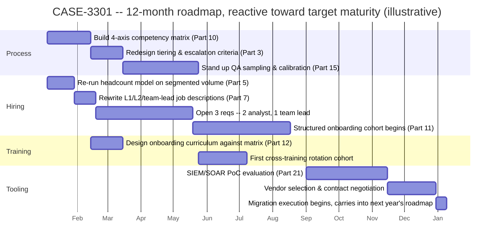
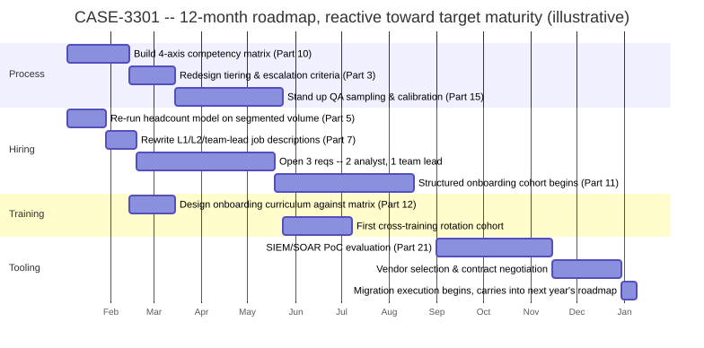

# Part 33 — The Next Twelve Months: Building a SOC Roadmap

## Why this part exists

**[CONCEPT]** Every earlier part in this book hands a manager one lever and tells them how to pull it well: how to size headcount (Part 5), how to design a shift pattern (Part 6), how to hire (Part 7), how to build a competency matrix (Part 10), how to run QA (Part 15), how to defend a budget (Part 20), how to score maturity (Part 30). None of them answer a question every SOC manager still has to answer once all of that exists on paper: in what order, over the next 12 months, given one budget cycle and one hiring pipeline that can't move any faster than it actually moves. A roadmap is not a longer to-do list. It is a sequencing decision under three hard constraints — money, hiring throughput, and the finite number of hours a manager's own senior people can spend building new programs before those programs get a shallow version instead of a real one.

**[CONCEPT]** This part does not re-derive the arithmetic behind any single lever. It does not rebuild the headcount formula — that's Part 5's job, and this part takes a finished headcount number as an input the same way Part 5 itself takes handle time and volume as inputs from SOC Playbook Handbook, Part 32 — Metrics. It does not redesign the budget's category structure — Part 20 — Building & Defending the SOC Budget owns headcount, tooling, training, facilities, and vendor-services as spending categories, and this part treats those categories as the lanes a roadmap's line items travel through, not as something to reinvent. And it does not build the maturity-scoring rubric itself — Part 30 — SOC Maturity Models owns the four organizational-design axes (staffing, process, training-program, and tooling maturity) this part uses only as an already-scored starting point and a stated target. What's left, and what this part actually owns, is the sequencing problem: given a maturity gap and a budget, what happens in month one, what has to wait until month seven because it depends on something that hasn't shipped yet, and what a manager tells the board when only three of the year's four target-maturity axes actually move.

**[CONCEPT]** The horizon is deliberately capped at 12 months, and that boundary is a design choice, not a limitation this part apologizes for. A budget cycle, a hiring pipeline's realistic annual throughput, and most vendor contract terms all run on roughly annual clocks — a roadmap built to that clock can be defended against real money and real reqs. Past 12 months, the compounding uncertainty (a new detection doubling queue volume, an acquisition adding a business unit, an unplanned resignation wave) makes a bespoke, organization-specific plan more honest than a templated multi-year one, and this part stops at the edge where that's true rather than pretending a longer horizon is just this same model run twice.

## 1. Sequencing is a different problem than prioritization

**[CONCEPT]** Prioritization asks which gap matters most. Sequencing asks a harder question: given that three or four gaps all matter, which one has to close first because something else depends on it, which ones can run in parallel without competing for the same scarce resource, and which one has to wait even though it's important, because starting it now would only produce a rushed version. A manager who prioritizes well and sequences badly still fails — a maturity assessment that correctly identifies "we need a competency matrix and we need to migrate our SIEM" as the two biggest gaps says nothing about whether launching both in the same quarter is a plan or a collision. §6 works through exactly that collision with real numbers.

### 1.1 Three scarce resources a roadmap actually arbitrates

**[SENIOR MANAGER]** A roadmap is really arbitrating three resources, and only one of them shows up on a budget spreadsheet. The first is money, tracked against Part 20's categories and the most visible constraint, because it has a dollar figure and an approval process attached to it. The second is hiring throughput — not money, but calendar time: a requisition approved in January and a requisition approved in October compete for the same finite number of qualified candidates the sourcing channels in Part 7 can actually produce inside a year, and doubling the budget for recruiting doesn't double the rate qualified people come through the pipeline. The third, and the one most roadmaps never name explicitly, is the bandwidth of the specific senior people — team leads, the SOC manager, a handful of tenured analysts — whose hours get consumed every time a new program launches: building a competency matrix, running the first QA calibration sessions, mentoring a hiring cohort through onboarding, sitting on a vendor's proof-of-concept calls. Money and hiring throughput are constraints on what the roadmap can afford and how fast it can staff up. The third constraint is what actually breaks when two initiatives get scheduled in the same quarter because nothing on the budget spreadsheet flagged that they'd draw on the same three people's time.

> **Manager's Note**
> Before scheduling anything, write down the names — not roles, actual names — of the three or four people whose hours every major initiative on the draft roadmap will consume. If the same two or three names show up next to more than one initiative in the same quarter, that's the collision waiting to happen, and it's visible on paper weeks before it shows up as a rushed onboarding cohort or a PoC nobody had time to evaluate properly.

### 1.2 What this part assumes is already sitting on the table

**[SENIOR MANAGER]** This part assumes two artifacts already exist before roadmap-building starts: a maturity assessment scored against Part 30's four axes, naming a current level and a target level per axis, and a budget model built or refreshed per Part 5 and Part 20, giving a real headcount number and a real dollar figure to work from. A manager without either of those isn't ready to sequence yet — sequencing an unscored gap or an unbudgeted number just produces a plan that looks organized and isn't defensible the first time someone asks where a figure came from.

## 2. The four levers and their sequencing constraints

**[CONCEPT]** Every investment a SOC roadmap sequences falls into one of four levers — hiring, tooling, training, and process — and each has a different lead time, a different dependency chain, and a different natural forcing function: the thing that makes the initiative actually happen on schedule rather than quietly sliding, unremarked, into next quarter.

The table below compares the four levers on lead time, what has to exist before each one can start, and whether anything besides the roadmap itself forces it to happen on time.

| Lever | Typical lead time to real impact | What it depends on first | Natural forcing function |
|---|---|---|---|
| Hiring | 60–150 days time-to-fill (Part 5, Part 7) plus a 60–90 day ramp (Part 11) before full productivity | A defensible headcount number (Part 5) and a job description that isn't inherited unedited from last year (Part 7) | Strong — an open requisition is visible, and it either fills or it doesn't |
| Tooling | Weeks for a PoC, months for a full migration and retraining cycle (Part 21) | A clear enough process to know what the new tool needs to encode, not just what it needs to replace (§2.4) | Strong — a purchase order and a contract renewal date force a decision point |
| Training | Days to design a module; ongoing to deliver a program | A competency matrix (Part 10) defining what "ready" actually looks like — training with no defined bar teaches to nothing | Weak — nothing forces a training investment to happen on schedule besides the roadmap itself |
| Process | Weeks of workshop and calibration time; near-zero hard dollar cost | Willingness to spend senior analysts' hours, which competes directly with queue time | Weakest — no PO, no contract date, no visible open req; process work is the first thing quietly dropped under pressure |

**[SENIOR MANAGER]** The bottom two rows are the ones a roadmap most often gets wrong, and for the same underlying reason: hiring and tooling both come with a forcing function baked in — an open req looks unfinished until it's filled, and a signed contract has a renewal date attached whether anyone revisits it or not. Training and process have no such mechanism. A training budget line and a QA-calibration line item can both sit unspent at year-end with nobody having to explain why, precisely because neither one has a visible, external trigger demanding action. That asymmetry is the single biggest reason process investments are the ones most often postponed indefinitely under queue pressure — not because managers don't value them, but because nothing forces the question the way an unfilled seat does.

### 2.1 Hiring: the slowest-moving lever, so it goes first

**[HR/PEOPLE]** Because time-to-fill plus ramp time can run five to eight months end to end for a single hire, any hiring decision meant to change capacity within the roadmap's 12-month window has to be locked in during the first quarter. A req approved in month nine of the roadmap doesn't meaningfully change this roadmap's capacity picture at all — it changes next year's, and treating it as this year's fix is the single most common way a roadmap's headcount line looks resolved on paper and stays unresolved on the floor.

### 2.2 Tooling: the lever with the longest tail risk

**[VENDOR/PROCUREMENT]** Part 21 — Tooling Procurement & Platform Strategy owns the PoC evaluation process, the reference-customer calls, and the total-cost-of-ownership modeling a platform decision needs; this part's only job is where that process lands on the calendar relative to everything else competing for the same evaluators' time. The technical effort behind an actual platform migration — what it costs in engineering hours to re-normalize and re-validate detections against a new backend — is Detection Engineering Handbook V2, Part 6 — Normalisation's territory, cited there rather than re-estimated here; this part only needs to know that a migration's tail (the months after signature, not the PoC itself) is long enough that starting it late in a 12-month roadmap all but guarantees it finishes inside next year's, not this one.

### 2.3 Training: the fastest lever to start, with a hidden ceiling

**[HR/PEOPLE]** Training is the cheapest and quickest lever to greenlight — a curriculum can be drafted in days — which makes it tempting to schedule generously across every quarter. The ceiling that actually limits it isn't budget; it's the same senior-analyst bandwidth named in §1.1. A structured onboarding cohort (Part 11), a cross-training rotation (Part 12), and a coaching cadence tied to performance management (Part 16) all draw on a small, overlapping pool of people qualified to mentor, and stacking all three in the same quarter competes for that pool regardless of how much money is behind each line item.

### 2.4 Process: the lever with no natural forcing function

**[SENIOR MANAGER]** A competency matrix (Part 10), a QA sampling and calibration program (Part 15), and a tiering redesign (Part 3) are, in dollar terms, the cheapest items on most roadmaps — mostly workshop time and calibration sessions, not headcount or a purchase order. They are also the items most likely to get quietly dropped the first time the queue runs hot, precisely because nothing forces them the way an open req or a contract renewal date does. The practical fix is naming a hard date for each process deliverable in the roadmap itself and treating a missed process-track date with the same seriousness as a missed hiring or tooling deadline — because absent that discipline, the roadmap itself is the only forcing function process investments will ever have.

## 3. Reading a maturity gap into a dated backlog

### 3.1 From Part 30's four axes to this part's four levers

**[CONCEPT]** Part 30's four maturity axes and this part's four levers line up closely but not perfectly, and the gap between them is worth naming before scheduling anything against it.

The table below maps each Part 30 maturity axis to the lever that typically closes its gap, and flags where the mapping isn't as clean as it looks.

| Part 30 maturity axis | Primary matching lever | Where the mapping breaks |
|---|---|---|
| Staffing maturity | Hiring | Close to 1:1 |
| Process maturity | Process | Close to 1:1 |
| Tooling maturity | Tooling | Retraining cost on a new platform lands partly on the training lever, not tooling alone |
| Training-program maturity | Training | A training-program gap is sometimes actually a process gap in disguise — there's no competency matrix to train against yet, so no curriculum can define "ready" |

**[SENIOR MANAGER]** That last row is worth dwelling on, because it's the same "looks like X, is actually Y" diagnostic error this book returns to under different names in different parts — Part 9's staffing-problem-versus-detection-quality-problem diagnosis for a growing queue, Part 16's skill-gap-versus-process-gap diagnosis for a recurring performance miss. A training-program maturity score stuck at Level 2 often isn't a training-delivery problem at all; it's that nobody has defined, in observable terms, what a trained analyst is supposed to be able to do — which is Part 10's competency matrix, not Part 12's training-delivery mechanics. Scheduling a bigger training budget against that gap without first scheduling the competency matrix that should precede it spends money curing the wrong axis.

### 3.2 Sizing the gap before scheduling it

**[SENIOR MANAGER]** Once the current and target level are known per axis, the roadmap's real job starts: translating each axis's gap into named initiatives with a lever, a lead time, a dependency, and a dollar figure attached — not a restated version of the maturity model's own language. "Improve staffing maturity from Level 1 to Level 3" is a scoring outcome, not a plan; "re-run the headcount model against segmented volume, rewrite the job descriptions, and open three specific requisitions by end of Q1" is a plan a hiring pipeline can actually execute against. §5 works a full worked example of that translation end to end.

## 4. Tying the roadmap to the budget model

### 4.1 Budget categories as spending lanes, not a wish list

**[EXECUTIVE]** A roadmap that isn't mapped to Part 20's actual budget categories — headcount, tooling, training, facilities, vendor services — is a wish list, not a plan a CFO will engage with. Every initiative named in §3.2 needs a category, a dollar figure, and a quarter it lands in before it's a defensible line in next year's budget defense, not just a good idea a manager believes in. The discipline that makes a roadmap survive a budget review is the same discipline Part 20 already teaches for a single number: state the claim, then the figure, then which category absorbs it.

### 4.2 Cash-flow timing: why a Q1 dollar and a Q4 dollar aren't the same dollar

**[EXECUTIVE]** A three-headcount addition approved in January and staffed by March costs roughly nine months of that year's budget; the same three heads approved in September cost roughly three months of this year's budget and the full annualized figure next year. A roadmap that reports only the annualized run-rate cost of its hiring line, without separating this-year's actual cash impact from next year's, will either look more expensive than it actually is this cycle or blow past budget the following cycle when the full run-rate finally lands — either error erodes the credibility of the next roadmap's numbers.

The table below shows how one composite roadmap's four spending lanes actually land across a fiscal year's four quarters, illustrating the timing gap between an annualized figure and the cash a given quarter actually spends.

CONCEPTUAL SAMPLE — illustrative figures built for this part's worked example in §5; not sourced benchmark data.

| Budget category (Part 20) | Q1 spend | Q2 spend | Q3 spend | Q4 spend | Note |
|---|---|---|---|---|---|
| Headcount | $0 | $40,000 | $95,000 | $95,000 | Reqs open in Q1–Q2; cash impact starts only once hires land, per §2.1 |
| Tooling/licensing | $0 | $0 | $10,000 | $25,000 | PoC and evaluation costs land in Q3–Q4; migration execution deferred past the window |
| Training | $8,000 | $14,000 | $16,000 | $8,000 | Curriculum design and rotation stipends, staggered against the same senior-analyst bandwidth as process |
| Vendor/MSSP governance | $5,000 | $5,000 | $5,000 | $5,000 | Standing QBR and audit-clause cadence (Part 22), flat across the year, not new spend |

**[EXECUTIVE]** The pattern worth pointing out to a budget owner directly: the headcount row totals $230,000 in actual cash for the year, not the $405,000 annualized run-rate the three new heads will carry once fully staffed (§5.2) — Q1 shows zero cash impact because nobody has started yet, and even Q3 and Q4 only reflect partial-year salary for hires who landed mid-year. Reporting the $405,000 annualized figure alone, without this quarter-by-quarter breakdown, overstates this year's actual ask by roughly $175,000 and sets up next year's budget conversation to look like an unexplained jump when the same three heads finally show up at their full annualized cost. Part 24 — Executive & Board Reporting owns how to frame that distinction for a board audience; this part's job is making sure the underlying numbers are already split correctly before they reach that conversation.

## 5. Worked example: a reactive, understaffed SOC's 12-month roadmap

**COMPOSITE CASE EXAMPLE `CASE-3301`** — merges patterns from more than one small in-house SOC's first structured roadmap cycle; no single organization is identifiable, and every figure below is illustrative.

### 5.1 The starting point

**[SENIOR MANAGER]** An 8-analyst, 1-manager in-house SOC runs 24/7 coverage across three shifts with no team-lead layer and no enforced distinction between its nominal L1 and L2 titles — everyone works everything. Three of the eight seats turned over in the trailing 12 months, a 37% attrition rate that keeps hiring permanently reactive: requisitions open only after someone resigns, average time-to-fill runs 120 days end to end, and nobody has run a structured onboarding program because there's rarely a quiet enough month to build one. There is no competency matrix, no QA sampling program, and no written promotion criteria. The SIEM has been in place for six years with no SOAR layer; a burst-capacity clause exists in the SOC's MSSP overflow contract, but nobody has run the governance cadence Part 22 describes since it was signed. Total annual SOC budget is $1.8 million: roughly $1.3 million headcount, $310,000 tooling and licensing, $140,000 MSSP overflow, and $12,000 training.

**[SENIOR MANAGER]** A Part 30-style maturity assessment scores the SOC at Level 1 (Reactive) on staffing maturity, Level 1 on process maturity, Level 2 (Developing) on training-program maturity, and Level 2 on tooling maturity. The reactive-hiring, no-competency-matrix, no-QA-program picture is not four independent gaps; it's a single mechanism feeding itself — no process maturity means no defensible way to tell who's ready for more responsibility, which means no real career progression, which is a documented driver of the poaching pattern Part 18 covers, which keeps attrition high, which keeps hiring reactive, which leaves no quiet quarter to build the process work that would break the cycle. A roadmap for this SOC has to name that cycle explicitly, not just list four unrelated maturity scores.

### 5.2 The roadmap, quarter by quarter

**[SENIOR MANAGER]** The roadmap sequences four tracks against the constraint named in §1.1: the same three senior analysts are the only people currently qualified to build the competency matrix, facilitate QA calibration, and mentor a hiring cohort, so those three obligations are staggered rather than launched together, even though hiring and tooling — funded from different budget lines — are allowed to run on their own separate timeline without waiting on the process track.

Figure 33.1 lays out the sequence below as a 12-month timeline. Every task names the part of this book it draws its method from, so the roadmap reads as an execution plan against material the manager already has, not a list of good intentions.

**Figure 33.1 — CASE-3301's 12-month roadmap, sequenced across process, hiring, training, and tooling.** *CONCEPTUAL.* `FIG-3301`. Illustrates the sequencing logic in §5.2 — the process and hiring tracks run in parallel from month one because neither draws on the same constrained senior-analyst hours the other needs at that point in the sequence, while the tooling PoC is deliberately held until month nine, after the onboarding cohort's mentorship demand has passed, to avoid the exact resource collision `CASE-3302` in §6.1 illustrates. It is a structural model of one composite roadmap, not a capture of any single real organization's actual planning artifact. Rendered as a static SVG Gantt-style timeline from the Mermaid source above; supports §5.2's claim that deliberately staggering the tooling PoC behind the hiring wave's heaviest mentorship demand — rather than running both in the same quarter because they draw on different budget lines — is what keeps this composite roadmap from repeating `CASE-3302`'s collision.

**[SENIOR MANAGER]** Total incremental spend against the composite's existing $1.8 million budget runs to roughly $490,000 in annualized run-rate cost — about $405,000 for the three new heads once fully staffed, $46,000 in added training spend, and roughly $35,000 for the tooling PoC itself, with full migration cost deferred to next year's roadmap. Per §4.2's cash-timing logic, actual year-one cash impact runs closer to $310,000, because the hires land mid-year and the tooling spend in this window is limited to evaluation, not migration.

### 5.3 What actually moved, and what didn't

**[SENIOR MANAGER]** By month 12, staffing maturity moves from Level 1 to Level 3: the headcount model is rebuilt against real segmented volume, the two analyst reqs and the team-lead req all filled (the team-lead req took until month nine to close, later than planned, and the onboarding cohort accordingly ran later than the Figure 33.1 timeline's optimistic case), and time-to-fill for the year's later reqs drops from 120 days to 68 once the rewritten job descriptions and a real pipeline are in place — real progress, short of the roughly 55-day figure a fully mature pipeline can eventually reach, and worth naming as such rather than rounding up. Process maturity also moves to Level 3: the competency matrix is live, QA calibration runs monthly, and the tiering redesign has a real escalation criterion behind it instead of an informal norm. Training-program maturity reaches Level 3 on the strength of the structured onboarding curriculum and the first completed cross-training rotation. Attrition over the 12 months drops from 37% to 21% — still above a healthy target, but a real, attributable improvement, not noise.

**[SENIOR MANAGER]** Tooling maturity is the honest exception: the PoC and vendor selection complete on schedule, but full migration and retraining — the resource-intensive part — only begins in the roadmap's final weeks and explicitly carries into next year's cycle, landing the axis around Level 2 rather than the Level 3 the original assessment targeted. A roadmap that reported this as a completed target-maturity axis would be lying with a maturity score; a roadmap that names the slip and schedules the remainder against next year's plan is doing exactly what a living document is supposed to do.

> **Field Test**
> **Setup:** A draft roadmap exists with initiatives assigned to named quarters, before it's presented for budget approval.
> **Action:** For every initiative on the draft, write down which specific named person's hours it draws on — not a role, an actual name — and total those hours per person per quarter against that person's realistic available time after Part 5's shrinkage deductions and their existing queue or team-lead duties.
> **Expected result:** Any quarter where one named person's total claimed hours exceed roughly 70–80% of their genuinely available time flags for staggering before the roadmap ships — not after a hiring wave and a tooling PoC collide on the same three senior analysts, the way `CASE-3302` in §6.1 shows happening in practice.

## 6. Common sequencing failures

### 6.1 Overloading one quarter with two initiatives that need the same people

**[SENIOR MANAGER]** Two budget lines funding two different levers can still collide on the same people, and that collision is invisible until it's already happened, unless someone names the constrained resource before scheduling starts.

**COMPOSITE CASE EXAMPLE `CASE-3302`** — merges patterns from more than one mid-market SOC's first attempt at a formal roadmap; no single organization is identifiable, and all figures are illustrative.

> **Management Autopsy — "fund the SIEM PoC and the year's biggest hiring wave from different budget lines, so schedule them together"**
>
> **The decision:** A 14-analyst SOC's maturity assessment names tooling maturity (Level 1) and staffing maturity (Level 2) as the year's two biggest gaps. Leadership approves launching the SIEM/SOAR PoC and opening five new requisitions in the same quarter, reasoning that tooling spend comes from a capital budget line and headcount comes from an operating budget line, so nothing on the budget spreadsheet suggested a conflict.
>
> **Why it seemed reasonable:** Both were the two largest, most visible gaps from the assessment, and showing visible movement on both in the same quarter looked like a strong opening quarter to report upward — nobody at budget approval asked whose hours either initiative would actually consume.
>
> **How it failed:** The three senior analysts qualified to mentor new hires through Part 11's structured onboarding are the same three the vendor's PoC needs for daily 90-minute evaluation calls across six weeks. Onboarding reverts to informal "shadow whoever has a free minute," and the PoC evaluation itself gets compressed into fewer, rushed sessions because the same three people are stretched across both obligations. Of the five new hires, two require a formal Performance Improvement Plan within six months — a 40% rate. Part 8's own case data ties a well-run structured interview-and-assessment process to a six-month PIP rate closer to 15%; a 40% rate here means the collapsed onboarding is doing real additional damage on top of whatever the interview loop already screened for, not a wash against it. The SIEM/SOAR vendor selected under the rushed evaluation requires $165,000 of unplanned professional-services reconfiguration four months after signature, once gaps the compressed PoC missed surface in production.
>
> **The fix:** Name the constrained resource before scheduling anything — not "capital budget" versus "operating budget," but the specific senior-analyst hours both initiatives actually draw on — and stagger any two initiatives that share those named people by at least one full quarter, regardless of which budget line funds each one. `CASE-3301`'s §5.2 sequencing deliberately holds its own tooling PoC until month nine, after the onboarding cohort's heaviest mentorship demand has passed, for exactly this reason.

### 6.2 Sequencing hiring ahead of the process work it silently depends on

**[SENIOR MANAGER]** A subtler version of §6.1's mistake: opening reqs and building a competency matrix in parallel looks efficient, but a hiring cohort that ramps up before the matrix exists has nothing observable to ramp toward — Part 10's own point about competency assessment collapsing into impression without dedicated evidence per axis applies just as much to a brand-new hire's ramp plan as it does to a promotion nomination. `CASE-3301`'s roadmap avoids this by starting the competency matrix (`p1`) in the same month as the headcount remodel (`h1`), so the matrix exists before the onboarding cohort (`h4`) that needs it actually begins.

### 6.3 Letting the roadmap go stale after the planning offsite ends

**[SENIOR MANAGER]** A roadmap built well once and never re-checked against its own resource assumptions doesn't stay accurate by default — it drifts silently toward whichever track already has a forcing function, per §2's table, and nobody decides that drift on purpose.

**COMPOSITE CASE EXAMPLE `CASE-3303`** — merges patterns from more than one SOC whose first roadmap wasn't revisited between annual planning cycles; no single organization is identifiable, and all figures are illustrative.

> **Management Autopsy — "build the roadmap once at the annual offsite, review it again at year-end"**
>
> **The decision:** An 18-analyst SOC builds a genuinely well-sequenced 12-month roadmap in January, following roughly the structure this part recommends, and schedules no formal review of it before the following January's planning offsite.
>
> **Why it seemed reasonable:** The roadmap was carefully built, sequencing looked sound, and a mid-year review felt like it would just repeat the same conversation the offsite had already had — a reasonable-sounding way to avoid what looked like redundant process overhead.
>
> **How it failed:** In month five, a regional MSSP poaching wave — the same 15% to 20% pay-premium pattern Part 18 documents — pulls three senior analysts in six weeks. The roadmap's Q3 hiring plan (two reqs earmarked for growth) quietly gets repurposed to backfill instead, which nobody formally revises in the roadmap document, because there's no scheduled moment that asks the question. Those same three senior analysts were also the people the roadmap's Q3 process track — the QA calibration rollout — was built around; the rollout slips to Q4, then silently to "next year," without anyone deciding that on purpose at any point. By the December review, 90% of the roadmap's hiring-track items have shipped (because open reqs are visible and get reactive attention by default) against only 40% of its process-track items — a gap nobody noticed the size of at any single checkpoint, because no checkpoint ever asked the process-track question directly.
>
> **The fix:** A written quarterly checkpoint (§7.1) that explicitly re-asks whether the resource assumptions behind the next quarter's items still hold, not a status report on what already shipped. A roadmap with no scheduled moment to notice that its own assumptions broke will drift exactly the way `CASE-3303`'s did, and it will drift silently, in the direction of whatever track already has a visible forcing function — which per §2's table is never the process track.

## 7. Governing the roadmap after it ships

### 7.1 The quarterly re-sequencing checkpoint

**[SENIOR MANAGER]** A roadmap's quarterly review should not be a status report on what shipped — that's a useful input, but it's not the point of the meeting. The point is re-asking, explicitly and in writing, whether the resource assumptions behind the next quarter's remaining items still hold: has a named hire fallen through, has a vendor's timeline slipped, has an attrition spike pulled the same senior people the process track depends on, the way it did in `CASE-3303`. A checkpoint that only asks "what's done" will faithfully report a roadmap quietly repurposing itself out of existence, one unremarked substitution at a time, exactly as §6.3 describes.

> **Field Test**
> **Setup:** A roadmap with quarterly milestones exists and has completed at least one full quarter.
> **Action:** At the quarterly review, before discussing what shipped, ask each track owner one specific question in writing: "has anything changed about who was supposed to do next quarter's work, or what they were supposed to have finished first?" Require a yes/no answer with a name attached, not a general status update.
> **Expected result:** If the answer is yes for any track, the roadmap gets a visible, dated re-sequencing decision before the meeting ends — not a note to "keep an eye on it." A checkpoint that produces zero re-sequencing decisions across an entire year is either evidence of an unusually stable year or evidence that the checkpoint isn't actually asking the question — worth checking which, rather than assuming the former.

### 7.2 Who owns re-sequencing: a governance RACI

**[SENIOR MANAGER]** Re-sequencing fails for the same reason any standing cadence fails, per this book's own recurring pattern from Part 22's contract-governance cadence: a task with no named owner quietly stops happening the moment the person who used to do it informally changes roles or gets pulled onto something more urgent.

The table below assigns Responsible, Accountable, Consulted, or Informed status for each roadmap-governance activity across the roles typically involved (CONCEPTUAL SAMPLE — illustrative role assignment; substitute your own organization's actual titles).

| Governance activity | SOC manager | Team leads | HR/talent partner | Finance/budget owner |
|---|---|---|---|---|
| Quarterly re-sequencing checkpoint (§7.1) | R/A | R | C | I |
| Resource-collision stress test before shipping (Field Test, §5.3) | R/A | R | C | — |
| Mid-year budget-line reforecast (Part 20) | C | I | — | R/A |
| Escalating a slipped axis to a full re-scope (§7.3) | R/A | C | C | C |

**[SENIOR MANAGER]** Finance/budget owner is Accountable for exactly one row — the mid-year reforecast — and Informed on the rest, which is deliberate: re-sequencing which quarter an initiative lands in is the SOC manager's call, not the budget owner's, as long as the total annual figure Part 20 defends doesn't change. The moment a re-sequencing decision does change that total, it stops being this table's §7.1 conversation and becomes a §4.2-style reforecast conversation instead.

### 7.3 Escalation triggers: when a slip needs a re-scope, not just a note

**[SENIOR MANAGER]** Most quarterly slips are absorbable with a note and a revised date — a req that takes three extra weeks to fill doesn't need the whole roadmap rebuilt. Two conditions justify a full re-scope rather than a routine adjustment: a slip on the hiring or tooling track that pushes an item past the 12-month window entirely, the way tooling did in `CASE-3301`'s §5.3, which needs to be explicitly handed to next year's roadmap rather than left as an open item on this one; and a slip that reveals the original resource-collision assumption in §1.1 was wrong for reasons beyond one bad quarter — for instance, discovering the same three senior analysts are load-bearing for four different tracks, not two, which is a structural finding about the team, not a scheduling one, and belongs in the next maturity assessment's staffing-axis conversation as much as in this roadmap.

## 8. Where this leaves the reader

**[CONCEPT]** This part closes the book's arc, and the honest summary of what it adds is narrow on purpose: every other part in this book taught how to build one program well. This part is the discipline of not building four of them badly at once by scheduling them as if they didn't share the same finite calendar, the same finite budget, and the same handful of senior people's hours. `CASE-3301`'s roadmap doesn't hit every target-maturity axis inside 12 months, and that's the honest case for this part's method, not against it — a roadmap that claims to close every gap on schedule either got lucky or isn't telling the whole story, and a manager who reports a slipped axis with a dated plan to close it next cycle is doing the job this part actually asks for.

> **What Would Change My Mind**
> This part treats staggering initiatives that share the same named senior people's hours as the single highest-value sequencing rule in a 12-month roadmap — ahead of strict maturity-gap prioritization or strict budget-category ordering. If a meaningful share of SOCs running formal roadmaps found that resource collisions of the kind `CASE-3302` describes were rare or easily absorbed without the deliberate staggering this part recommends — because, say, a deep enough bench of qualified mentors and evaluators already existed — that would weaken the case for treating this as the roadmap's central constraint rather than one factor among several, and would shift the emphasis back toward straightforward maturity-gap prioritization for organizations with that kind of depth.

---

## Cross-references

**Within this book:** Assumes a completed maturity assessment from Part 30 — SOC Maturity Models and a headcount/budget model from Part 5 — Headcount & Capacity Modeling and Part 20 — Building & Defending the SOC Budget, treating all three as inputs rather than re-deriving them. Sequences the hiring lever using Part 7 — Hiring & Sourcing Analysts and Part 11 — Onboarding & Ramp-Up Programs, the tooling lever using Part 21 — Tooling Procurement & Platform Strategy, the training lever using Part 10 — Competency Models & Skills Matrices and Part 12 — Ongoing Training & Skill Development, and the process lever using Part 3 — Tiering Models & Beyond and Part 15 — Quality Assurance Programs. Draws its attrition and poaching figures from Part 18 — Attrition & Retention, its resource-collision fix from the same governance-cadence discipline built in Part 22 — MSSP & Managed-Service Contract Management, and its budget-timing framing from Part 24 — Executive & Board Reporting.

**SOC Playbook Handbook:** Part 32 — Metrics (the handle-time, MTTR, and volume definitions this part's own budget and headcount inputs treat as already fixed, per Part 5's own citation of the same part); Part 30 — Automation and SOAR (the automation/human-review boundary a tooling-track SOAR rollout in a roadmap should already have resolved before scheduling it).

**Detection Engineering Handbook V2:** Part 6 — Normalisation (the technical engineering effort behind a platform migration's tail, cited rather than re-estimated in §2.2).
